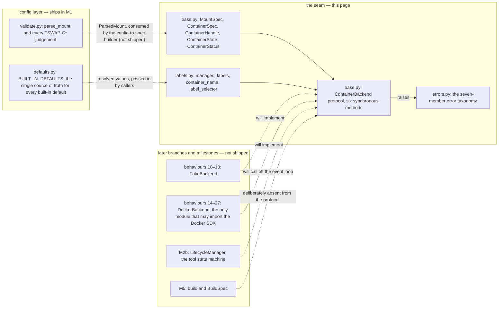

# The container backend seam

Everything in this repository that starts, stops, inspects or lists a
tool's container goes through one interface: the `ContainerBackend`
protocol. This guide describes that seam — its data types, its naming
and labelling rules, its error taxonomy, and the boundary that keeps
the container runtime contained in one place.

**Status: this is the seam, not the engine.** The data types, the
helpers, the protocol declaration and the error taxonomy are shipped;
the two implementations behind the protocol are not. Nothing under
`src/` references the protocol yet: the in-memory backend (plan
behaviours 10–13) and the Docker backend (behaviours 14–27) land on
later branches of the same milestone, each with its own module. The
M2b tool state machine — `STOPPED`, `STARTING`, `LOADING`, `READY` —
does not exist either. This page documents what is here, and says
explicitly where it stops.

The design is specified in
[`plans/m2a-container-backend-seam.md`](../plans/m2a-container-backend-seam.md)
(§4 for the design, §5 for the behaviour ledger); the interface it
implements was first sketched in
[`plan/01_ARCHITECTURE.md`](../plan/01_ARCHITECTURE.md) §12.

## The shape of the seam

Solid edges are shipped; dashed ones are named in the plan but not yet
in the tree.

## What is in the tree

The seam is three modules, all under `src/tool_swap/backend/`:

| Module | Contents |
|---|---|
| [`base.py`](../src/tool_swap/backend/base.py) | [`MountSpec`](../src/tool_swap/backend/base.py:27), [`ContainerSpec`](../src/tool_swap/backend/base.py:49), [`ContainerHandle`](../src/tool_swap/backend/base.py:107), [`ContainerState`](../src/tool_swap/backend/base.py:129), [`ContainerStatus`](../src/tool_swap/backend/base.py:147), and the [`ContainerBackend`](../src/tool_swap/backend/base.py:171) protocol |
| [`labels.py`](../src/tool_swap/backend/labels.py) | [`managed_labels`](../src/tool_swap/backend/labels.py:54), [`container_name`](../src/tool_swap/backend/labels.py:111), [`label_selector`](../src/tool_swap/backend/labels.py:153) |
| [`errors.py`](../src/tool_swap/backend/errors.py) | the seven exception classes, [`BackendError`](../src/tool_swap/backend/errors.py:24) and its six concrete subclasses |

## The data types

### `MountSpec`

One **already-resolved** bind mount: a host `source` (a string), an
absolute container `target`, and a `read_only` flag that defaults to
`True` — a caller must ask for read-write explicitly. It performs no
parsing, no `~` expansion, no existence checks. It is the seam's unit
of mount, and it is hashable because M2b will key by spec fields.

### `ContainerSpec`

Everything needed to start one tool container, as fully resolved
input. Fifteen fields: the required `tool`, `name` and `image`; the
required-and-keyword-only `gpu_runtime` and `container_port`; and the
defaulted `command`, `env`, `labels`, `network`, `mounts`, `devices`,
`shm_size`, `cpus`, `memory` and `published_port`.

Two rules make this a *resolved* input rather than a mini-configuration:

- **No configured default is re-stated.** `gpu_runtime` and
  `container_port` have no field default at all — omitting either is a
  `TypeError` at construction. Every configured value arrives from the
  resolver; [`BUILT_IN_DEFAULTS`](../src/tool_swap/config/defaults.py:20)
  in the config layer remains the single named source of truth for
  their values. (Keyword-only on those two fields is mechanical: a
  dataclass cannot place a non-default field after a defaulted one.)
- **No policy.** There is no TTL, no group, no eviction. `devices=()`
  means CPU-only, and `published_port=None` means nothing is
  published to the host.

### `ContainerHandle`

One started container, identified by all four fields — `id`, `name`,
`tool`, `image` — **never by `id` alone**: a recreated container keeps
its name and tool while its runtime id changes. Handles are frozen and
hashable, and M2b keys its bookkeeping by them.

### `ContainerState`

Exactly four members — `created`, `running`, `exited`, `gone` — and
they describe one thing only: **whether a process exists**. This is
deliberately not the M2b tool state machine. `STARTING`, `LOADING` and
`READY` are readiness concepts owned by M2b's health probe, which does
not exist yet, and a test pins the four-member set so the two state
machines cannot blur together.

### `ContainerStatus`

A point-in-time reading: the `handle`, its `state`, an `exit_code`
that stays `None` while the container is running (a running container
has not exited *successfully* — it has not exited at all), and a
`started_at` carried as the runtime's own string.

## The protocol

[`ContainerBackend`](../src/tool_swap/backend/base.py:171) is a
`@runtime_checkable` `Protocol` with exactly six **synchronous**
methods:

| Method | Signature | Note |
|---|---|---|
| `start` | `(spec: ContainerSpec) -> ContainerHandle` | raises on failure; the error is a taxonomy member |
| `stop` | `(handle, *, timeout_s: float) -> None` | a no-op if the container is gone |
| `is_running` | `(handle) -> bool` | `False` for a missing container, never an exception |
| `inspect` | `(handle) -> ContainerStatus` | returns `ContainerState.GONE` when the container is gone |
| `list_managed` | `() -> list[ContainerHandle]` | stopped containers included |
| `logs` | `(handle, *, follow: bool, tail: int) -> Iterator[str]` | raises on an unknown handle |

Decisions worth knowing, each pinned by the protocol's tests:

- **Synchronous.** The Docker SDK is blocking; M2b's `LifecycleManager`
  is the async layer that off-loads these calls. Making the seam async
  would hide that inside the driver.
- **`build` is absent.** [`plan/01_ARCHITECTURE.md`](../plan/01_ARCHITECTURE.md) §12
  lists it on the protocol; this branch deliberately does not include
  it. It is M5's concern, and issue #3's Definition of Done names
  exactly the six methods above, without it. Including it now would
  force both future implementations to carry a stub.
- **`inspect` returns `ContainerStatus`, never a raw SDK dict.** The
  seam exists to contain the runtime's vocabulary, not leak it.
- **`stop` and `logs` take keyword-only arguments**, so the call sites
  read unambiguously.

## The boundary

The seam's value is as much in what it refuses to do.

- **No mount-string parsing.**
  [`parse_mount`](../src/tool_swap/config/validate.py:2488) in the
  config layer is the repository's only mount-string parser. Mode
  legality, container-path absoluteness and host-path existence are
  the config layer's rules (`TSWAP-C541`, `TSWAP-C542`, `TSWAP-C543`);
  re-doing any of them in the backend is exactly the duplication the
  seam was amended to prevent. A source-level guard test walks
  `src/tool_swap/backend/` on every run and fails if a second parser
  appears. The single `ParsedMount` → `MountSpec` conversion happens in
  the config-to-spec builder, which does not ship on this branch — so
  there is currently no conversion in the tree at all.
- **No configured default is re-stated.** `gpu_runtime`,
  `container_port`, `label_namespace` and `container_prefix` all live
  in [`BUILT_IN_DEFAULTS`](../src/tool_swap/config/defaults.py:20);
  the helpers below take them as **required arguments** and a guard
  test fails if a literal value reappears in `labels.py`.
- **No policy.** No TTL, no group, no eviction, no readiness. The
  backend knows whether a process exists; everything above that is
  M2b's.
- **No runtime import.** Nothing under `src/` imports the Docker SDK
  yet; when the Docker backend lands, that module will be the only one
  allowed to. The import-linter contracts already keep the config
  layer a leaf that never imports the backend
  ([`.importlinter`](../.importlinter)).

## Names and labels

### Container names

`container_name(prefix, tool)` returns `prefix + tool`. Both the tool
name and the whole concatenation must match
`[a-z0-9][a-z0-9_-]*` — the same rule the config layer applies to tool
names under `TSWAP-C210`
([`validate.py`](../src/tool_swap/config/validate.py:310)). That rule
is a strict subset of what Docker accepts, so every name the function
accepts is one Docker accepts; the repository has deliberately not
claimed Docker's own charset, which it has not verified, and **no
length limit is applied**. The prefix is the only input no config
rule checks, so an unusable name names the prefix in its `ValueError`.

### Labels

Every managed container carries a label set produced by
`managed_labels(namespace, tool, ...)`, keyed in the namespace the
caller supplies:

| Label | When present |
|---|---|
| `{namespace}.model` | always — the tool name |
| `{namespace}.managed-by` | always — the value is the constant `tool-swap` |
| `{namespace}.group` | only when a group is given |
| `{namespace}.config-hash` | only when a hash is given (nothing in the repository computes one yet) |
| `{namespace}.runtime-version` | only when a version is given |

An omitted optional omits its key entirely — an empty label value
would be a silent reconciliation mismatch. The `managed-by` value is
a constant independent of the namespace, on purpose: reconciliation,
`tswap ps`, `prune` and staleness detection all key off these labels,
so a value stable across namespace changes keeps containers labelled
under an older namespace recognisable as ours.

`label_selector(namespace)` returns exactly one entry — the
`managed-by` key for that namespace — and it is a **neutral label map,
not a docker filter**: translating it into the SDK's filter form is a
later behaviour's job, to be pinned against the saved docker-py
reference.

## When the container is gone

The protocol's not-found contract (plan §4.3), which M2b's liveness
sweep relies on:

| Method | Missing container |
|---|---|
| `is_running` | returns `False` — never raises |
| `inspect` | returns `ContainerState.GONE` with `exit_code=None` |
| `stop` | a no-op |
| `start`, `list_managed`, `logs` | raise a taxonomy member |

## Troubleshooting: container start failures

Each failure the backend can report is one of the seven classes in
[`errors.py`](../src/tool_swap/backend/errors.py), and each carries
its remedy in the string that M2b surfaces in `/status`. The table
below is keyed by the class name:

| Error class | It means | Remedy, as shipped in the class |
|---|---|---|
| [`BackendUnavailableError`](../src/tool_swap/backend/errors.py:70) | the container daemon is unreachable | check that the daemon is running and reachable, and that `DOCKER_HOST` names the daemon tool-swap is configured to use |
| [`ImageNotFoundError`](../src/tool_swap/backend/errors.py:79) | the image reference does not exist | build the image with `tswap build <tool>`* |
| [`ContainerNameConflictError`](../src/tool_swap/backend/errors.py:88) | the container name is already taken | free the name with `tswap down`* |
| [`ContainerStartError`](../src/tool_swap/backend/errors.py:97) | the daemon refused the start for another reason | read the underlying error text in the message |
| [`ContainerNotFoundError`](../src/tool_swap/backend/errors.py:106) | the container was removed out of band, outside tool-swap's control | start the tool again |
| [`GpuUnavailableError`](../src/tool_swap/backend/errors.py:115) | a GPU device request could not be satisfied | install or repair the NVIDIA container toolkit |
| [`BackendError`](../src/tool_swap/backend/errors.py:24) | fallback for an unrecognised runtime exception | inspect the underlying error text; report it if it does not match a known error |

\* **Forward reference.** `tswap build` and `tswap down` are quoted
from the plan's CLI design (plan §4.3) and do not ship yet; the CLI
today offers `validate`, `config show` and `version`
([`cli/main.py`](../src/tool_swap/cli/main.py)).

Two honest limits on the table:

- **No implementation exists yet**, so nothing in this repository
  raises these classes today. The table describes the surface a user
  will see once a backend lands, and every remedy is the exact string
  the class ships — read it there if you need the verbatim text.
- **How these failures are *produced* is pinned on a later branch.**
  The mapping from the Docker SDK's own exceptions to these classes
  (behaviour 19) is verified against the saved docker-py reference,
  and the daemon behaviour itself (does `stop` return before the
  container has exited? does the label selector really select?) is
  covered by integration tests that are deferred until a daemon
  harness exists.

## Where to go deeper

- [`plans/m2a-container-backend-seam.md`](../plans/m2a-container-backend-seam.md) —
  the design decisions behind every type and rule on this page, with
  the per-behaviour ledger (§5) and what M2b will need from the seam
  (§6).
- [`plan/01_ARCHITECTURE.md`](../plan/01_ARCHITECTURE.md) — §10 (why
  mounts are read-only by default), §11 (the failure modes the error
  taxonomy exists to surface) and §12 (the original interface sketch).
- [`docs/configuration-guide.md`](configuration-guide.md) — the
  `backend:` block and its keys, which is where the namespace, prefix
  and network values this seam consumes are configured.
