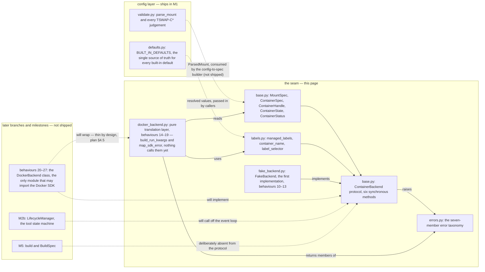

# The container backend seam

Everything in this repository that starts, stops, inspects or lists a
tool's container goes through one interface: the `ContainerBackend`
protocol. This guide describes that seam — its data types, its naming
and labelling rules, its error taxonomy, and the boundary that keeps
the container runtime contained in one place.

**Status: two implementations of the seam are in flight.** The data
types, the helpers, the protocol declaration and the error taxonomy
are shipped, and so is the in-memory backend — `FakeBackend`, plan
behaviours 10–13 — the first real implementation of the
`ContainerBackend` protocol. The Docker backend is arriving in two
slices on the same milestone branch: **behaviours 14–19 have landed**
as the pure translation layer —
[`build_run_kwargs`](../src/tool_swap/backend/docker_backend.py:80)
and [`map_sdk_error`](../src/tool_swap/backend/docker_backend.py:253)
in [`docker_backend.py`](../src/tool_swap/backend/docker_backend.py) —
and behaviours 20–27 (the `DockerBackend` class and the
import-linter contract) are the next pull request, not yet in the
tree. Until that slice lands, **nothing calls the two functions**:
the translation layer is tested directly and is not yet wired into a
backend. The M2b tool state machine — `STOPPED`, `STARTING`,
`LOADING`, `READY` — does not exist either. This page documents what
is here, and says explicitly where it stops.

The design is specified in
[`plans/m2a-container-backend-seam.md`](../plans/m2a-container-backend-seam.md)
(§4 for the design, §5 for the behaviour ledger); the interface it
implements was first sketched in
[`plan/01_ARCHITECTURE.md`](../plan/01_ARCHITECTURE.md) §12.

## The shape of the seam



Solid edges are shipped; dashed ones are named in the plan but not yet
in the tree. `FakeBackend` sits inside the seam's subgraph — it is
shipped, in-memory, and importable with the Docker SDK absent. The
translation layer `DOCKT` is in the same subgraph — it is shipped and
tested — but its edges are *inputs to a future backend*, not calls
from one: no edge from a `ContainerBackend` implementation reaches
`DOCKT`, because nothing calls those functions yet.

## What is in the tree

The seam is four modules, all under `src/tool_swap/backend/`, plus
the first implementation of the protocol:

| Module | Contents |
|---|---|
| [`base.py`](../src/tool_swap/backend/base.py) | [`MountSpec`](../src/tool_swap/backend/base.py:27), [`ContainerSpec`](../src/tool_swap/backend/base.py:49), [`ContainerHandle`](../src/tool_swap/backend/base.py:107), [`ContainerState`](../src/tool_swap/backend/base.py:129), [`ContainerStatus`](../src/tool_swap/backend/base.py:147), and the [`ContainerBackend`](../src/tool_swap/backend/base.py:171) protocol |
| [`labels.py`](../src/tool_swap/backend/labels.py) | [`managed_labels`](../src/tool_swap/backend/labels.py:54), [`container_name`](../src/tool_swap/backend/labels.py:111), [`label_selector`](../src/tool_swap/backend/labels.py:153) |
| [`errors.py`](../src/tool_swap/backend/errors.py) | the seven exception classes, [`BackendError`](../src/tool_swap/backend/errors.py:24) and its six concrete subclasses |
| [`fake_backend.py`](../src/tool_swap/backend/fake_backend.py) | [`FakeBackend`](../src/tool_swap/backend/fake_backend.py:77), the in-memory implementation, and [`FailureMode`](../src/tool_swap/backend/fake_backend.py:50) — the two scriptable failure modes |
| [`docker_backend.py`](../src/tool_swap/backend/docker_backend.py) | [`build_run_kwargs`](../src/tool_swap/backend/docker_backend.py:80) and [`map_sdk_error`](../src/tool_swap/backend/docker_backend.py:253) — the pure translation layer, behaviours 14–19 |

## The data types

### `MountSpec`

One **already-resolved** bind mount: a host `source` (a string), an
absolute container `target`, and a `read_only` flag that defaults to
`True` — a caller must ask for read-write explicitly. It performs no
parsing, no `~` expansion, no existence checks. It is the seam's unit
of mount, and it is hashable because M2b will key by spec fields.

### `ContainerSpec`

Everything needed to start one tool container, as fully resolved
input. Fifteen fields: the required `tool`, `name` and `image`; the
required-and-keyword-only `gpu_runtime` and `container_port`; and the
defaulted `command`, `env`, `labels`, `network`, `mounts`, `devices`,
`shm_size`, `cpus`, `memory` and `published_port`.

Two rules make this a *resolved* input rather than a mini-configuration:

- **No configured default is re-stated.** `gpu_runtime` and
  `container_port` have no field default at all — omitting either is a
  `TypeError` at construction. Every configured value arrives from the
  resolver; [`BUILT_IN_DEFAULTS`](../src/tool_swap/config/defaults.py:20)
  in the config layer remains the single named source of truth for
  their values. (Keyword-only on those two fields is mechanical: a
  dataclass cannot place a non-default field after a defaulted one.)
- **No policy.** There is no TTL, no group, no eviction. `devices=()`
  means CPU-only, and `published_port=None` means nothing is
  published to the host.

### `ContainerHandle`

One started container, identified by all four fields — `id`, `name`,
`tool`, `image` — **never by `id` alone**: a recreated container keeps
its name and tool while its runtime id changes. Handles are frozen and
hashable, and M2b keys its bookkeeping by them.

### `ContainerState`

Exactly four members — `created`, `running`, `exited`, `gone` — and
they describe one thing only: **whether a process exists**. This is
deliberately not the M2b tool state machine. `STARTING`, `LOADING` and
`READY` are readiness concepts owned by M2b's health probe, which does
not exist yet, and a test pins the four-member set so the two state
machines cannot blur together.

### `ContainerStatus`

A point-in-time reading: the `handle`, its `state`, an `exit_code`
that stays `None` while the container is running (a running container
has not exited *successfully* — it has not exited at all), and a
`started_at` carried as the runtime's own string.

## The protocol

[`ContainerBackend`](../src/tool_swap/backend/base.py:171) is a
`@runtime_checkable` `Protocol` with exactly six **synchronous**
methods:

| Method | Signature | Note |
|---|---|---|
| `start` | `(spec: ContainerSpec) -> ContainerHandle` | raises on failure; the error is a taxonomy member |
| `stop` | `(handle, *, timeout_s: float) -> None` | a no-op if the container is gone |
| `is_running` | `(handle) -> bool` | `False` for a missing container, never an exception |
| `inspect` | `(handle) -> ContainerStatus` | returns `ContainerState.GONE` when the container is gone |
| `list_managed` | `() -> list[ContainerHandle]` | stopped containers included |
| `logs` | `(handle, *, follow: bool, tail: int) -> Iterator[str]` | raises on an unknown handle |

Decisions worth knowing, each pinned by the protocol's tests:

- **Synchronous.** The Docker SDK is blocking; M2b's `LifecycleManager`
  is the async layer that off-loads these calls. Making the seam async
  would hide that inside the driver.
- **`build` is absent.** [`plan/01_ARCHITECTURE.md`](../plan/01_ARCHITECTURE.md) §12
  lists it on the protocol; this branch deliberately does not include
  it. It is M5's concern, and issue #3's Definition of Done names
  exactly the six methods above, without it. Including it now would
  force both future implementations to carry a stub.
- **`inspect` returns `ContainerStatus`, never a raw SDK dict.** The
  seam exists to contain the runtime's vocabulary, not leak it.
- **`stop` and `logs` take keyword-only arguments**, so the call sites
  read unambiguously.

## The boundary

The seam's value is as much in what it refuses to do.

- **No mount-string parsing.**
  [`parse_mount`](../src/tool_swap/config/validate.py:2488) in the
  config layer is the repository's only mount-string parser. Mode
  legality, container-path absoluteness and host-path existence are
  the config layer's rules (`TSWAP-C541`, `TSWAP-C542`, `TSWAP-C543`);
  re-doing any of them in the backend is exactly the duplication the
  seam was amended to prevent. A source-level guard test walks
  `src/tool_swap/backend/` on every run and fails if a second parser
  appears. The single `ParsedMount` → `MountSpec` conversion happens in
  the config-to-spec builder, which does not ship on this branch — so
  there is currently no conversion in the tree at all.
- **No configured default is re-stated.** `gpu_runtime`,
  `container_port`, `label_namespace` and `container_prefix` all live
  in [`BUILT_IN_DEFAULTS`](../src/tool_swap/config/defaults.py:20);
  the helpers below take them as **required arguments** and a guard
  test fails if a literal value reappears in `labels.py`.
- **No policy.** No TTL, no group, no eviction, no readiness. The
  backend knows whether a process exists; everything above that is
  M2b's.
- **One runtime import, one module.**
  [`docker_backend.py`](../src/tool_swap/backend/docker_backend.py)
  is the only module under `src/` that imports the Docker SDK — its
  three import lines are the seam's single window onto the runtime,
  and both of its functions are pure over that import. The
  import-linter *contract* that makes "only one module" enforced
  rather than hoped for is behaviour 27 and is not in the tree yet;
  the contracts that do exist, in
  [`.importlinter`](../.importlinter), keep the config layer a leaf
  that never imports the backend.

## Names and labels

### Container names

`container_name(prefix, tool)` returns `prefix + tool`. Both the tool
name and the whole concatenation must match
`[a-z0-9][a-z0-9_-]*` — the same rule the config layer applies to tool
names under `TSWAP-C210`
([`validate.py`](../src/tool_swap/config/validate.py:310)). That rule
is a strict subset of what Docker accepts, so every name the function
accepts is one Docker accepts; the repository has deliberately not
claimed Docker's own charset, which it has not verified, and **no
length limit is applied**. The prefix is the only input no config
rule checks, so an unusable name names the prefix in its `ValueError`.

### Labels

Every managed container carries a label set produced by
`managed_labels(namespace, tool, ...)`, keyed in the namespace the
caller supplies:

| Label | When present |
|---|---|
| `{namespace}.model` | always — the tool name |
| `{namespace}.managed-by` | always — the value is the constant `tool-swap` |
| `{namespace}.group` | only when a group is given |
| `{namespace}.config-hash` | only when a hash is given (nothing in the repository computes one yet) |
| `{namespace}.runtime-version` | only when a version is given |

An omitted optional omits its key entirely — an empty label value
would be a silent reconciliation mismatch. The `managed-by` value is
a constant independent of the namespace, on purpose: reconciliation,
`tswap ps`, `prune` and staleness detection all key off these labels,
so a value stable across namespace changes keeps containers labelled
under an older namespace recognisable as ours.

`label_selector(namespace)` returns exactly one entry — the
`managed-by` key for that namespace — and it is a **neutral label map,
not a docker filter**: translating it into the SDK's filter form is a
later behaviour's job, to be pinned against the saved docker-py
reference.

## The `FakeBackend`

The first implementation of the protocol, in
[`fake_backend.py`](../src/tool_swap/backend/fake_backend.py)
(behaviours 10–13). It is a **test double, not a simulation**: state is
a plain dict of per-container records guarded by a single
`threading.Lock`, no thread is ever spawned and no I/O happens. It is
importable with the Docker SDK absent and asserts no docker fact — it
exists so a test can drive seam behaviour with no daemon.

### How a test drives it

```python
from tool_swap.backend.fake_backend import FakeBackend, FailureMode

backend = FakeBackend(script={"t1": FailureMode.FAIL_TO_START})
```

- `script` is a **tool-name → `FailureMode`** mapping, applied at
  `start` time, so a failure is scripted before any handle exists.
  `FAIL_TO_START` makes that tool's start refuse with
  [`ContainerStartError`](../src/tool_swap/backend/errors.py:97),
  repeatedly and without creating a record — the script is not
  one-shot, so a retry loop can never silently succeed.
  `DIE_AFTER_START` is a death, not a refusal: the start succeeds and
  returns a handle, but the record is created already `EXITED` with a
  non-zero exit code, so the container is dead by the first
  observation.
- **`vanish(handle)` and `seed_logs(handle, lines)` are test control,
  not seam surface.** They sit below a separator comment in the
  source, they are never journaled, and they are not
  `ContainerBackend` members: `LifecycleManager` and every other seam
  consumer must never call them. `vanish` removes a record out of
  band — the in-memory stand-in for a `docker rm -f` behind the
  backend's back — and `seed_logs` appends lines to the per-handle
  buffer that `logs` reads. Both raise
  [`ContainerNotFoundError`](../src/tool_swap/backend/errors.py:106)
  for an unmanaged handle, because both are active operations naming a
  container that may not exist.
- **`backend.calls`** journals every protocol call on entry as a
  `(name, args, kwargs)` triple — including calls that raise, since a
  losing racer's refused start leaves no trace in `list_managed` — so
  M2b can assert "exactly one start" by counting attempts. Test
  control never reaches the journal, so counts depend only on what a
  seam consumer called.

### What it models — and what it cannot

- **Dead versus vanished.** A dead or stopped container stays in
  `list_managed`; only a vanished one disappears. That is deliberate:
  reconciliation adopts by label, and M2b must still see a dead
  handle to mark the tool `FAILED` (plan §6 item 5).
- **`follow=True` returns a terminating snapshot**, because the fake
  has no stream to follow and blocking would hang a caller that never
  stops it. `tail` is pure list semantics: `tail=0` yields nothing, a
  `tail` past the buffer returns everything, and a stopped
  container's buffer survives `stop`.
- **`started_at` stays `None`** for the fake's whole life: it has no
  runtime clock to report from, and inventing a timestamp would be a
  fake docker fact.

### Four contracts exist for M2b, not for M2a

Each would look like over-engineering from M2a's side alone; plan §6
is the point of reference:

1. **The journal records on entry**, so a call that raises is still
   counted (plan §6 item 2).
2. **`is_running` returns `False` for a missing container rather than
   raising**, so M2b's liveness sweep is not an unhandled traceback in
   the watchdog (plan §6 item 4).
3. **The internals are lock-guarded**, because M2b's coalescing test
   drives the fake concurrently (plan §6 item 2).
4. **`vanish()` and `DIE_AFTER_START`** make "a vanished container
   becomes `FAILED`" testable with no daemon (plan §6 item 3).

### `FailureMode` has exactly two members

`STOP_HANGS` is **not a mode in this milestone**: it existed only for
M2b's drain test, and shipping a member no test proves would be
dead code — M2b introduces it in the same red/green cycle as that
test (plan §7 item 5). **"Never ready" is deliberately not a mode
either**: readiness belongs to M2b's health probe, which does not
exist yet, and the fake has no probe to be un-ready against. That is a
knowing departure from issue #3's Scope wording, confirmed by the
user and recorded in plan §7 item 5 — the issue was not amended, so
that plan entry is the record.

## When the container is gone

The protocol's not-found contract (plan §4.3), which M2b's liveness
sweep relies on:

| Method | Missing container |
|---|---|
| `is_running` | returns `False` — never raises |
| `inspect` | returns `ContainerState.GONE` with `exit_code=None` |
| `stop` | a no-op |
| `start`, `list_managed`, `logs` | raise a taxonomy member |

`FakeBackend` honours this contract exactly, which is how a test
reproduces a missing container: `vanish` a running handle and the
three lenient reads behave as the table says without a daemon.

## The Docker translation layer (behaviours 14–19)

The first slice of the Docker backend is in the tree: two pure
functions in
[`docker_backend.py`](../src/tool_swap/backend/docker_backend.py),
no class, no client, no daemon round-trip. The design is plan §4.5:
the `DockerBackend` shell is deliberately **thin**, so the
interesting logic — every kwarg name, every error classification —
lives in functions testable exhaustively with no daemon. That is why
68 new unit tests exist for code that talks to Docker without Docker
being present.

Two things a reader must know before the tables:

- **Nothing calls these functions yet.** The shell that would
  consume them — the `DockerBackend` class, `from_config`, and the
  import-linter contract that pins
  [`docker_backend.py`](../src/tool_swap/backend/docker_backend.py)
  as the only module importing the SDK — is behaviours 20–27, the
  next pull request. The seam does **not** have a working Docker
  backend; it has the backend's pure half.
- **Nothing here was verified against a running daemon.** Every
  docker-py fact is pinned against the installed docker 7.2.0's own
  source and its own classifier, and cited in the function
  docstrings from
  [`plan/third-party-docs/docker/`](../plan/third-party-docs/docker/INDEX.md).
  M2a runs no docker tests — see the deferred-note in the
  troubleshooting section below.

### `build_run_kwargs` — spec to `containers.create` kwargs

[`build_run_kwargs(spec, *, label_namespace)`](../src/tool_swap/backend/docker_backend.py:80)
reads a [`ContainerSpec`](../src/tool_swap/backend/base.py:49) and
nothing else — no client, no daemon, no environment — and returns a
fresh dict for `client.containers.create(**kwargs)`. The keys it
emits, and when:

| Key | Emitted when | Value |
|---|---|---|
| `image` | always | `spec.image`; an empty image raises `ValueError` before any SDK call |
| `name` | always | `spec.name` |
| `labels` | always | the full [`managed_labels`](../src/tool_swap/backend/labels.py:54) set for the namespace and tool, with `spec.labels` merged in — spec labels win a collision |
| `environment` | `spec.env` is non-empty | a plain dict copy of the spec's mapping |
| `network` | `spec.network is not None` | the network name — the SDK also turns it into `network_mode` internally, so this function never emits `network_mode` |
| `volumes` | `spec.mounts` is non-empty | `{source: {"bind": target, "mode": "ro" or "rw"}}` in declaration order, no de-duplication (that is config-validation's job) |
| `device_requests` | `spec.devices` is non-empty | one `DeviceRequest(driver=spec.gpu_runtime, device_ids=[...])` — indices as strings in declaration order, duplicates collapsed; `count` is never set; a negative index raises `ValueError` |
| `nano_cpus` | `spec.cpus is not None` | `round(spec.cpus * 1e9)` — an int in units of 1e-9 CPUs; no `cpu_quota`/`cpu_period` pair |
| `mem_limit` | `spec.memory is not None` | the size string, passed through verbatim |
| `shm_size` | `spec.shm_size is not None` | the size string, passed through verbatim |
| `ports` | `spec.published_port is not None` | `{container_port: published_port}` — the container port is the **key**; a non-positive port raises `ValueError`; no range check (range policy is config validation's) |

Every name is cited from
[`containers-run-create.md`](../plan/third-party-docs/docker/containers-run-create.md)
§2 and its routing table, and the device-request shape from
[`gpu-device-requests.md`](../plan/third-party-docs/docker/gpu-device-requests.md)
§1–§2. Two consequences worth knowing:

- **The start path is `create` + `start`, not `run(detach=True)`.**
  `run` returns before any exit check — hiding an immediate crash —
  and auto-pulls a missing image, so an `ImageNotFound` might never
  surface. The image must therefore pre-exist, and a missing one is
  an honest [`ImageNotFoundError`](../src/tool_swap/backend/errors.py:79)
  rather than a silent multi-gigabyte pull. Hence no `detach` key in
  the output (plan §5 behaviour 14, amended).
- **A typo'd kwarg name is a client-side `TypeError`**: the SDK's
  routing accepts only the names in its two kwarg tables and raises
  on anything else, so the snapshot tests pin the whole kwarg
  surface with no daemon.

### `map_sdk_error` — SDK exception to taxonomy

[`map_sdk_error(exc)`](../src/tool_swap/backend/docker_backend.py:253)
reads an exception — or anything else — and **returns** a member of
the seven-member taxonomy for the caller to raise. Pure and total:
it never raises, so no raw SDK exception escapes the seam, and every
returned member carries a distinctive part of the input's text, so
the original is never swallowed. A genuine exception is chained as
`__cause__`; a non-exception input cannot be chained — CPython
allows an exception's `__cause__` to be only `None` or a
`BaseException` — so for that one input the text is preserved in the
message instead.

The branches are **ordered and must stay ordered**: `APIError`
inherits `requests.exceptions.HTTPError`, so a broad `requests`
check placed first would swallow every API error.

| Order | Input | Maps to |
|---|---|---|
| 1 | an `APIError` 404, re-classified by the **daemon's text** | image fragments in the text → [`ImageNotFoundError`](../src/tool_swap/backend/errors.py:79) naming the image ref; any other 404 → [`ContainerNotFoundError`](../src/tool_swap/backend/errors.py:106) |
| 2 | an `APIError` 409 whose text is the daemon's name-conflict phrase | [`ContainerNameConflictError`](../src/tool_swap/backend/errors.py:88) naming the conflicting name |
| 3 | an `APIError` whose text matches `nvidia` or `gpu`, case-insensitively | [`GpuUnavailableError`](../src/tool_swap/backend/errors.py:115) — brittle, see below |
| 4 | any other `APIError` | [`ContainerStartError`](../src/tool_swap/backend/errors.py:97) carrying the daemon's text |
| 5 | a bare `requests` connection error (`ConnectTimeout` included) | [`BackendUnavailableError`](../src/tool_swap/backend/errors.py:70) |
| 6 | a `DockerException` "Error while fetching server API version: …" — the client-construction path | [`BackendUnavailableError`](../src/tool_swap/backend/errors.py:70) |
| 7 | anything else — an unrelated `DockerException` included, and a non-exception input | [`BackendError`](../src/tool_swap/backend/errors.py:24) fallback, preserving the text |

Each branch is cited from
[`errors.md`](../plan/third-party-docs/docker/errors.md): §1 for the
hierarchy (`APIError` **is** a `requests` `HTTPError`), §2 for the
404 mapping — the SDK classifies 404s by **string-matching the
daemon's message** and degrades to the parent `NotFound` when the
wording stops matching, which is why the re-classification is done on
the *text* rather than on which class the SDK chose — and §3 for the
two distinct dead-daemon hierarchies (operational calls surface a
bare `requests` error; client construction wraps one in a
`DockerException`).

### Two things documented as knowingly brittle

These are brittle by necessity, not interfaces:

- **`GpuUnavailableError` rests on a message heuristic** (plan §7
  item 12). The SDK has no GPU exception class — an unsatisfiable
  device request surfaces as a bare `APIError` — so the mapping
  matches `nvidia`/`gpu` in the daemon's text, which is the only
  channel that exists. The daemon's real wording is recorded nowhere
  and could not be observed in this environment, so the heuristic is
  **untested against reality**; the deferred daemon tests are where
  it would be confirmed. If it proves wrong, the failure mode is
  mild: a GPU refusal surfaces as
  [`ContainerStartError`](../src/tool_swap/backend/errors.py:97)
  with the daemon's text intact — the operator still sees the real
  message, only with a less specific remedy.
- **An authored size string like `16zz` is validated by nothing**
  (plan §7 item 11). No config rule covers it —
  [`schema.py`](../src/tool_swap/config/schema.py:150) types
  `memory` and `shm_size` as plain strings — and
  `build_run_kwargs` deliberately ships no parser of its own,
  because the SDK's `HostConfig` already owns that parsing: its
  `parse_bytes` raises the canonical message naming the accepted
  suffixes, as a `DockerException` rather than a `ValueError`. So an
  invalid string passes validation, passes the translation
  untouched, and fails at the daemon call with the SDK's message —
  not a `TSWAP-C5xx` one naming the file and line. A size-string
  rule in the config layer would be the better fix; it belongs there
  and is not part of this milestone.

## Troubleshooting: container start failures

Each failure the backend can report is one of the seven classes in
[`errors.py`](../src/tool_swap/backend/errors.py), and each carries
its remedy in the string that M2b surfaces in `/status`. The table
below is keyed by the class name; the middle column states how
[`map_sdk_error`](../src/tool_swap/backend/docker_backend.py:253)
reaches it — which SDK condition, and by what signal, because for
several of the seven the decision is made on the daemon's *text*, not
on the SDK's class:

| Error class | It means — and what produces it | Remedy, as shipped in the class |
|---|---|---|
| [`BackendUnavailableError`](../src/tool_swap/backend/errors.py:70) | the container daemon is unreachable — either a bare `requests` connection error from an operational call, or the `DockerException` "Error while fetching server API version: …" from client construction (the two dead-daemon hierarchies of [`errors.md`](../plan/third-party-docs/docker/errors.md) §3) | check that the daemon is running and reachable, and that `DOCKER_HOST` names the daemon tool-swap is configured to use |
| [`ImageNotFoundError`](../src/tool_swap/backend/errors.py:79) | the image reference does not exist — a 404 whose daemon text carries one of the image fragments, whatever class the SDK chose: the SDK string-matches the daemon's message and degrades an `ImageNotFound` to a plain `NotFound` when the wording stops matching, so the text, not the class, decides ([`errors.md`](../plan/third-party-docs/docker/errors.md) §2) | build the image with `tswap build <tool>`* |
| [`ContainerNameConflictError`](../src/tool_swap/backend/errors.py:88) | the container name is already taken — a 409 whose daemon text is the name-conflict phrase, quoted around the name; any other 409 is a refused start | free the name with `tswap down`* |
| [`ContainerStartError`](../src/tool_swap/backend/errors.py:97) | the daemon refused the start for another reason — any other `APIError`, including a GPU refusal whose text does not match the heuristic | read the underlying error text in the message |
| [`ContainerNotFoundError`](../src/tool_swap/backend/errors.py:106) | the container was removed out of band, outside tool-swap's control — any 404 whose daemon text carries no image fragment | start the tool again |
| [`GpuUnavailableError`](../src/tool_swap/backend/errors.py:115) | a GPU device request could not be satisfied — **a message heuristic, not a stable interface**: an `APIError` whose text matches `nvidia` or `gpu`, case-insensitively (the SDK has no GPU exception class); the daemon's real wording is unverified, plan §7 item 12 | install or repair the NVIDIA container toolkit |
| [`BackendError`](../src/tool_swap/backend/errors.py:24) | fallback for an unrecognised runtime exception — any other SDK exception (an unrelated `DockerException` included) or a non-exception input at the seam, the original text always preserved | inspect the underlying error text; report it if it does not match a known error |

\* **Forward reference.** `tswap build` and `tswap down` are quoted
from the plan's CLI design (plan §4.3) and do not ship yet; the CLI
today offers `validate`, `config show` and `version`
([`cli/main.py`](../src/tool_swap/cli/main.py)).

Two honest limits on the table:

- **Which of these a real daemon raises has not been verified
  here.** M2a runs no daemon tests: the `docker` marker is
  registered and deselected by default through `addopts`, and no
  test in the tree carries it. The mapping itself is in the tree —
  [`map_sdk_error`](../src/tool_swap/backend/docker_backend.py:253),
  behaviour 19 — and it is verified against the installed SDK's own
  source and its own classifier, but only over **synthesised
  exception instances**, never against a running daemon; the
  daemon-text branches in particular (the 404 re-classification, the
  name-conflict phrase, the GPU heuristic) encode wording the
  repository has not been able to observe. The only code that
  *raises* these classes today is
  [`FakeBackend`](../src/tool_swap/backend/fake_backend.py:77), and
  it raises three
  of the seven for unit tests without a daemon:
  [`ContainerStartError`](../src/tool_swap/backend/errors.py:97)
  (`FAIL_TO_START` scripted on a tool name),
  [`ContainerNameConflictError`](../src/tool_swap/backend/errors.py:88)
  (starting an already-managed name) and
  [`ContainerNotFoundError`](../src/tool_swap/backend/errors.py:106)
  (`vanish` out-of-band, then `logs` the gone handle).
- **The daemon behaviour itself is deferred.** The three daemon tests
  of
  [`plans/m2-docker-testing-recommendation.md`](../plans/m2-docker-testing-recommendation.md)
  §3 — round trip, stop escalation, the vanished container — are
  planned, not yet in the tree; when they land they will be marked
  `docker` and will run **only** against a disposable daemon named by
  the environment variable `TSWAP_TEST_DOCKER_HOST`, skipping rather
  than touching the ambient daemon when it is unset. The DinD harness,
  the `TSWAP_TEST_DOCKER_HOST` fixture and the loud-skip summary hook
  all belong to the follow-up issue that plan §7 item 7 calls for,
  which is not yet filed. Until that exists, `make test` — whose
  default `-m 'not docker and not gpu and not slow'` deselects the
  `docker` marker — exercises the seam through `FakeBackend` only.

## Where to go deeper

- [`plans/m2a-container-backend-seam.md`](../plans/m2a-container-backend-seam.md) —
  the design decisions behind every type and rule on this page, with
  the per-behaviour ledger (§5) and what M2b will need from the seam
  (§6).
- [`plan/01_ARCHITECTURE.md`](../plan/01_ARCHITECTURE.md) — §10 (why
  mounts are read-only by default), §11 (the failure modes the error
  taxonomy exists to surface) and §12 (the original interface sketch).
- [`docs/configuration-guide.md`](configuration-guide.md) — the
  `backend:` block and its keys, which is where the namespace, prefix
  and network values this seam consumes are configured.
