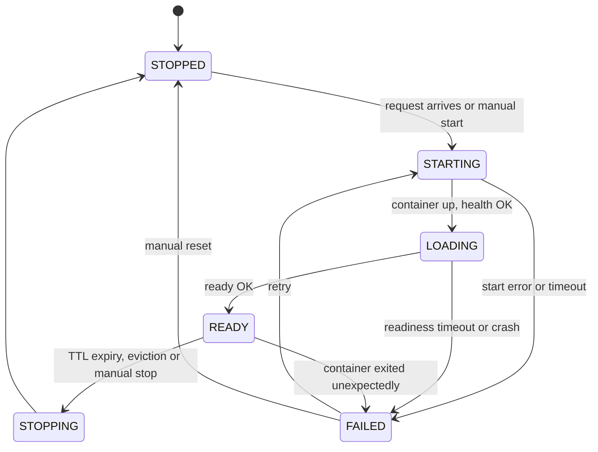

# The tool state machine

The router runs each tool inside its own container, and that
container's life has a long ramp-up: creating and starting the
container takes a moment, and loading the model weights inside it
takes longer still. So there is a long window in which the container
is running but cannot answer anything, and then a point — and only a
point — at which the tool is ready to serve. This page documents the
part of the router that tracks where each tool is in that journey:
the six states, the ten legal moves between them, the per-tool
runtime facts the moves read, and the single function that moves a
tool from one state to another —
[`ToolState`](../src/tool_swap/lifecycle/states.py:35),
[`ModelRuntimeState`](../src/tool_swap/lifecycle/states.py:53) and
[`apply_transition`](../src/tool_swap/lifecycle/states.py:104) in
[`states.py`](../src/tool_swap/lifecycle/states.py). The machine
exists so the router has a typed, testable answer to *may a request
go to this tool*: exactly one of its states means *ready to serve*,
and every other state is a reason to queue or refuse.

Without it, the router has no way to tell `LOADING` from `READY` —
to Docker they are the same thing, a container that is `running` —
and a router that routed on container liveness alone would send
requests into a process that is still loading weights, and be
refused by it or made to hang until the load finishes. The machine
is also the single place in the tree that records which states a
tool may occupy and which moves are legal, so its drivers —
[`drive_readiness`](../src/tool_swap/lifecycle/manager.py:75) today,
and the `LifecycleManager` class that will own it in production —
never re-derive that knowledge by hand.

**Where it sits:** the [spec builder
page](spec-builder.md) documents the layer that decides *what* a
tool's container should look like (the `ContainerSpec`); the
[backend seam page](backend-seam.md) documents the layer that
*starts* that container and reports whether its process is alive;
the [readiness probe
page](readiness-probe.md) documents the seam whose `health` and
`ready` answers move a tool through the states; this page documents
the states themselves and the rules that govern the moves between
them. The other pages are each about one layer; this page is about
one tool's journey through a sequence of containers.

One honest caveat before the detail: **no production code drives
this machine yet.** The machine — the states, the table, the holder,
the transition function — is in the tree and fully tested, and it
has one driver,
[`drive_readiness`](../src/tool_swap/lifecycle/manager.py:75), which
walks a tool `STARTING → LOADING → READY` on probe answers. But
nothing in the router calls `drive_readiness` yet either — the
`LifecycleManager` class that will own it is not built, and no
container has been started through this path. The rest of the page
documents the machine in full, and says where the driver gets there
and where it stops.

## Where this page stops

The machine and its driver `drive_readiness` are in the tree and
fully tested; [`states.py`](../src/tool_swap/lifecycle/states.py) is
pure — no daemon, no event loop, no I/O. What is not: the
`LifecycleManager` *class* that will own the machine in production,
a real probe (the [probe seam](readiness-probe.md) exists, the
socket-opening probe does not), and any router code that calls
`drive_readiness` — nothing in the router has started a container
through this path. `drive_readiness` is the only caller of
`apply_transition` in the tree, and the trigger column of the
transition table below records what the table *accepts*, not what
currently fires.

The design is in
[`plans/m2b-lifecycle-manager.md`](../plans/m2b-lifecycle-manager.md):
[§1.1](../plans/m2b-lifecycle-manager.md:206) for the state machine,
[§1.2](../plans/m2b-lifecycle-manager.md:260) for
`ModelRuntimeState`, [§1.3](../plans/m2b-lifecycle-manager.md:286)
for how waiting composes with the injected clock, and
[§6.10](../plans/m2b-lifecycle-manager.md:1361) for the field
arithmetic.

## `ToolState`: six states, one of which serves

A **tool state** answers one question about one tool: *can it serve
a request right now?* The six answers, in journey order, are:

```python
class ToolState(StrEnum):
    STOPPED = "stopped"
    STARTING = "starting"
    LOADING = "loading"
    READY = "ready"
    STOPPING = "stopping"
    FAILED = "failed"
```

- **`STOPPED`** — no container. Every tool begins life here, and it
  is the state the machine returns to after a stop.
- **`STARTING`** — a start has been requested; the container has not
  yet confirmed its health.
- **`LOADING`** — the container is up and answering its health
  check, but the model weights are still loading and it is serving
  nothing.
- **`READY`** — the only state that can serve traffic.
- **`STOPPING`** — a `stop` has been requested; the backend has not
  yet confirmed it.
- **`FAILED`** — the start, the readiness wait, or the container the
  tool was relying on failed; the reason is carried in
  [`ModelRuntimeState.last_error`](#modelruntimestate-seven-fields-no-invariants).

[`ToolState`](../src/tool_swap/lifecycle/states.py:35) is
deliberately a different enum from
[`ContainerState`](../src/tool_swap/backend/base.py:129), because
the two ask different questions:

| | `ContainerState` | `ToolState` |
|---|---|---|
| Members | 4: `created`, `running`, `exited`, `gone` | 6: `stopped`, `starting`, `loading`, `ready`, `stopping`, `failed` |
| Question | does a process exist | can this tool serve traffic |
| Serving member | none — `running` does not mean serving | `READY` only |

A container is `running` from the moment it is up — including the
whole `LOADING` stretch in which it is serving nothing — so "does a
process exist" and "can this tool serve traffic" have different
answers at exactly the moment a router most needs to tell them
apart. That is why a tool's state is not just its container's
state, and why they are two enums. Both carry an **exact-set pin**
([`test_states.py`](../tests/unit/lifecycle/test_states.py),
[`test_container_handle_state_status.py`](../tests/unit/backend/test_container_handle_state_status.py)),
so a member added to the wrong enum fails a test: the six-member set
is closed, and the value strings are **disjoint** between the two
enums, so a readiness concept can never be smuggled into the backend
seam. `ToolState` is a `StrEnum` so members compare equal to the
bare strings used in CLI output and persisted state.

`STARTING` and `LOADING` are distinct because cold start is
dominated by weight loading, not container start —
[`plan/01`](../plan/01_ARCHITECTURE.md:209)
§4 keeps the `/health` versus `/ready` split and names it in the
machine.

## The transition table: ten edges out of thirty-six

The table is data, not a chain of branches
([`_LEGAL_TRANSITIONS`](../src/tool_swap/lifecycle/states.py:75)),
transcribed from
[plan §1.1](../plans/m2b-lifecycle-manager.md:206):

| From | To | Trigger |
|---|---|---|
| `STOPPED` | `STARTING` | `ensure_ready` on a stopped tool |
| `STARTING` | `LOADING` | the health probe answers true |
| `STARTING` | `FAILED` | backend `start` raised, or `start_timeout` elapsed |
| `LOADING` | `READY` | the ready probe answers true |
| `LOADING` | `FAILED` | `ready_timeout` elapsed |
| `READY` | `STOPPING` | `stop` requested |
| `READY` | `FAILED` | the liveness sweep finds the container gone |
| `STOPPING` | `STOPPED` | the backend `stop` returned |
| `FAILED` | `STARTING` | `ensure_ready` retries |
| `FAILED` | `STOPPED` | manual reset |



**The diagram above carries eleven arrows, but the machine has ten
edges** — and if you count the arrows, you will be wrong.
`[*] --> STOPPED` is mermaid's **initial pseudo-state marker**, not a
transition: it says a tool begins life `STOPPED`, which is an initial
condition rather than something the transition function can perform.

The count is load-bearing because the table's test is arithmetic and
**exhaustive over all 36 ordered pairs**
([`test_transition_table.py`](../tests/unit/lifecycle/test_transition_table.py)):
ten legal, twenty-six illegal. A table with a missing edge and a
table with a spurious one are both silently wrong under any sampled
test, so the pair space is derived with `itertools.product` rather
than hand-listed.

Two absences are decisions, not oversights:

- **Self-transitions are all six illegal.** `READY → READY` is the
  dangerous one: a re-ready must never silently reset a serving
  tool's timers.
- **`STARTING → STOPPED` is illegal, and
  [`plan/06` §8.5b](../plan/06_LIFECYCLE_TTL_AND_SCHEDULING.md:357)
  actually wants it.** That is the shared-node `vram_unavailable`
  path — a neighbour took the VRAM, so the start must return to
  `STOPPED` rather than `FAILED` — and it needs a failure
  classification that does not exist in the tree yet, so the edge is
  not built at all rather than half-built.

**No edge reaches `READY` without a probe answer.** The single edge
into `READY` is `LOADING → READY`, triggered by the ready probe.
Reconciliation of a container left running by a previous router
therefore adopts it by walking `STOPPED → STARTING → LOADING → READY`
rather than assigning `READY` directly: an adoption path that could
write `READY` without a probe answer would be a second, untested way
to reach the only state that serves traffic.

## `ModelRuntimeState`: seven fields, no invariants

```python
@dataclass
class ModelRuntimeState:
    tool: str
    state: ToolState
    handle: ContainerHandle | None
    last_used: float
    became_ready_at: float | None
    inflight: int
    last_error: str | None
```

[`ModelRuntimeState`](../src/tool_swap/lifecycle/states.py:53) holds
the per-tool runtime facts the transitions read. The seven fields are
**not a subset** of the
[full sketch in `plan/06` §9](../plan/06_LIFECYCLE_TTL_AND_SCHEDULING.md:396)
(12 fields); the relationship is:

- **five kept** — `name` renamed to `tool`, `state` retyped from
  `ModelState` to `ToolState`, plus `last_used`, `became_ready_at`
  and `inflight`;
- **seven deferred** with the features that would read them —
  `group`, `queued`, `keep_warm`, `ttl`, `evict_cost`, `vram_gb`,
  `consecutive_failures`;
- **two added that the sketch never had** — `handle`, because
  something must hold the `ContainerHandle` the backend returns, and
  `last_error`, because `FAILED` carries a reason. Five kept plus two
  added is the seven ([§6.10](../plans/m2b-lifecycle-manager.md:1361)).

The deferral is pinned in **both directions**
([`test_model_runtime_state.py`](../tests/unit/lifecycle/test_model_runtime_state.py)):
the exact seven-field set fails on an extra field, and a named set of
the seven deferred fields fails on an early one — so the omission
stays visible rather than forgotten, and adding a deferred field
later is a change with a test, not a quiet edit. A field no code
reads is a field whose meaning is guessed.

Two properties depart from convention and are pinned for that reason:

- **It is mutable**, where every backend-seam data type is frozen
  (`MountSpec`, `ContainerSpec`, `ContainerHandle`, `ContainerStatus`
  are all `frozen=True, slots=True`). The `LifecycleManager` updates
  the state **in place** on every request completion; freezing it
  would mean reallocating on each completion. A named test mutates a
  field and would fail under a frozen refactor.
- **`last_error` holds the taxonomy member's `message`, not
  `str(err)`** — [`BackendError.__str__`](../src/tool_swap/backend/errors.py:61)
  appends the remedy, and the remedy belongs to `/status`, not to the
  `FAILED` reason. A test asserts `last_error != str(err)` for a real
  taxonomy member.

**It enforces no invariants.** There is no `__post_init__`: a
`STOPPED` state carrying a non-`None` handle is stored without
complaint. The no-container-no-handle invariant belongs to the
transitions, and a constructor check would have been
half-enforcement the manager could immediately break by mutating the
same object — worse than no check, because the next reader trusts it.
The test pins the actual behaviour — that construction **stores what
it is given** — under a name that says so.

## Moving a state: `apply_transition`

[`apply_transition(state, to_state, *, reason)`](../src/tool_swap/lifecycle/states.py:104)
is the single entry point that moves a holder. The from-state is read
**from** `state.state`, so the pair can never be inconsistent with
the holder; a legal pair updates the holder in place and returns the
new state, leaving the fields the manager owns (`handle`, timestamps,
`inflight`, `last_error`) untouched.

A pair outside the table raises
[`IllegalTransitionError`](../src/tool_swap/lifecycle/states.py:96),
which names **both** states and leaves the holder exactly where it
was. It subclasses `ValueError` rather than an operational error: the
fault is the pair the caller supplied, not a failure of the process —
raising is the loud default, because a silently ignored transition
would leave a tool in a state its caller does not expect.
[`is_legal_transition`](../src/tool_swap/lifecycle/states.py:91) is
the pure predicate over the same data, for callers that need to ask
without moving.

## Logging: validate first, log second

Every **applied** transition logs exactly one `INFO` record on the
module logger `tool_swap.lifecycle.states`, carrying `tool`,
`from_state`, `to_state` and `reason` as structured fields via
`extra=` — the tests read them off the `LogRecord` attributes, never
out of the formatted message, so a wording change cannot mask a
missing or swapped value.

A **refused** transition logs nothing. That is the sharpest contract
of the machine: logging before validating would leave a record for a
state change that never happened, and a log reader would believe the
tool had moved. The guard was not taken on trust — moving the log
call above the legality check turns **all 37 cases** in
[`test_transition_logging.py`](../tests/unit/lifecycle/test_transition_logging.py)
red, including the 26 that assert a refused transition leaves no
record.

The log call is **best-effort**: it is wrapped in
`suppress(Exception)`, so a broken handler cannot raise out of
`apply_transition` and cannot undo the state change that has already
been made. The order is validate, mutate, log — and only the first
step can refuse.

## The first driver: `drive_readiness`

The table above is driven by exactly one piece of code in the tree,
[`drive_readiness`](../src/tool_swap/lifecycle/manager.py:75). It
takes a holder sitting at `STARTING`, a
probe, a clock and the tool's address, and walks the holder to
`READY`:

```python
async def drive_readiness(
    state: ModelRuntimeState,
    probe: Probe,
    clock: Clock,
    target: ProbeTarget,
    start_timeout: float = 120.0,
    ready_timeout: float = 600.0,
    probe_interval: float = 1.0,
) -> ToolState: ...
```

It polls `probe.health` until it answers true, applies
`STARTING → LOADING`, then polls `probe.ready` until it answers
true and applies `LOADING → READY`. Both moves go through
[`apply_transition`](../src/tool_swap/lifecycle/states.py:104), so
the table's legality check and the `INFO` log are inherited rather
than reimplemented, and each call carries a `reason` into the log
record. The probe it polls is the seam documented on
[the readiness probe page](readiness-probe.md); the real probe
does not exist yet, and the tests inject the scripted
`FakeProbe` in its place.

### Two independent deadlines

The two timeouts are **independent windows, not a chain**:
`start_timeout` covers container-up-to-health, and `ready_timeout`
covers health-to-ready and **starts when `health` answered**, not
at `t=0`. That is the whole point of the two states — ninety
simulated seconds in `LOADING` is a different incident from ninety
in `STARTING` — and a shared clock would report the ready window as
720 seconds when it ran 600. The tests pin the arithmetic: a ready
timeout after a two-poll start reads `clock.now() == 602.0` with
`elapsed == 600.0`.

When a deadline elapses, the phase's error is raised:
[`StartTimeoutError`](../src/tool_swap/lifecycle/manager.py:59)
leaves the holder `STARTING`,
[`ReadyTimeoutError`](../src/tool_swap/lifecycle/manager.py:67)
leaves it `LOADING`. Both subclass the built-in `TimeoutError`
(through a shared `ReadinessTimeoutError` base that holds the
pinned attributes once) and both carry `deadline` — which of the two
ran out — and `elapsed`, the simulated seconds it ran, so an
operator can tell a hung start from a hung ready. **A timeout
raises; it does not mark the tool `FAILED`.** No code in the tree
performs that transition yet, so the holder is left in the phase it
hung in for the caller to classify.

### Waiting goes through the clock, never `asyncio.wait_for`

Each wait is `await clock.sleep(probe_interval)`, and each deadline
is a comparison against `clock.now()` before every poll. The
prohibition is load-bearing: `asyncio.wait_for`'s deadline is the
*event loop's* clock, which a `ManualClock` does not control — a
`wait_for` here would wait 120 real seconds against a 20-second
suite. A first-call true answer breaks before the sleep, so a warm
tool costs zero simulated time.

### A module-level coroutine, not a method

`drive_readiness` lives in
[`manager.py`](../src/tool_swap/lifecycle/manager.py) but is a free
coroutine, not a `LifecycleManager` method, because that class is
not built yet: a free coroutine needs no owning class to exist, and
the class will delegate to it when it lands. The three deadline
parameters default to values read from
[`BUILT_IN_DEFAULTS`](../src/tool_swap/config/defaults.py:42)
rather than retyped, so the signature cannot drift from the config
layer.

## What this page does not claim

- **There is no `LifecycleManager` class.** The driver above is a
  free coroutine; the class that will own coalescing, the liveness
  sweep and the `FAILED` transitions is not built, and nothing in
  the router calls `drive_readiness` yet.
- **No *real* probe exists.** The seam and its scripted double are
  in the tree; no probe that opens sockets exists yet. And
  `drive_readiness` raises on a timeout rather than marking the
  holder `FAILED` — no code in the tree performs that transition
  yet.
- **No container has been started.** Every test here is
  pure: no daemon, no event loop; time is a `ManualClock` value,
  not a running clock.
- **`ModelRuntimeState` enforces no invariants** — see
  [the section above](#modelruntimestate-seven-fields-no-invariants).
  Consistency between `state` and `handle` is the manager's
  responsibility, exercised through the transitions.

## Where to go deeper

- [`docs/backend-seam.md`](backend-seam.md) — the `ContainerHandle`
  this machine holds, the `ContainerState` that answers a different
  question, and the error taxonomy whose `message` feeds
  `last_error`.
- [`docs/readiness-probe.md`](readiness-probe.md) — the `Probe`
  seam `drive_readiness` polls: the two-method protocol, the
  no-URL address, the no-HTTP-client guard and the scripted double.
- [`docs/spec-builder.md`](spec-builder.md) — how the
  `ContainerSpec` the machine will eventually start is built.
- [`plans/m2b-lifecycle-manager.md`](../plans/m2b-lifecycle-manager.md)
  — [§1.1](../plans/m2b-lifecycle-manager.md:206) and
  [§1.2](../plans/m2b-lifecycle-manager.md:260) for the design,
  [§1.3](../plans/m2b-lifecycle-manager.md:286) for the clock
  rules, and [§6.10](../plans/m2b-lifecycle-manager.md:1361)
  for the field arithmetic and its correction.
- [`plan/01_ARCHITECTURE.md`](../plan/01_ARCHITECTURE.md) §4 — the
  state machine's source of transcription, and why `STARTING` and
  `LOADING` are distinct.
