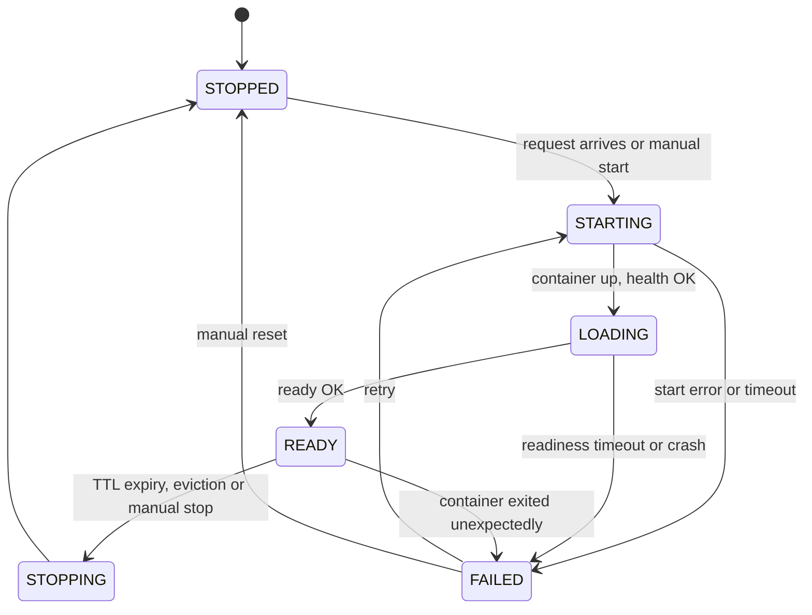

# The tool state machine

Every tool the router manages sits in one of six readiness states, and
moves between them only along a table of ten legal edges. This page
documents that machine — [`ToolState`](../src/tool_swap/lifecycle/states.py:35),
[`ModelRuntimeState`](../src/tool_swap/lifecycle/states.py:53) and
[`apply_transition`](../src/tool_swap/lifecycle/states.py:104) in
[`states.py`](../src/tool_swap/lifecycle/states.py) — the layer that
decides *when* a container should exist. The
[spec builder page](spec-builder.md) documents the layer that decides
*what* it should look like.

**Status: slice B of M2b, shipped — the machine, not its driver.** All
four slice B behaviours (plan behaviours 5–8) are in the tree on
`feature/m2b-state-machine`, stacked on slice A. The module is pure:
no daemon, no event loop, no I/O. It has **no caller yet**: the
`LifecycleManager` that will drive it arrives in slice D, and nothing
in the shipped tree calls `apply_transition` today. This page
documents what is here, and says explicitly where it stops.

The design is in
[`plans/m2b-lifecycle-manager.md`](../plans/m2b-lifecycle-manager.md):
[§1.1](../plans/m2b-lifecycle-manager.md:130) for the state machine,
[§1.2](../plans/m2b-lifecycle-manager.md:184) for
`ModelRuntimeState`, [§3 slice B](../plans/m2b-lifecycle-manager.md:554)
for the behaviours, and [§6.10](../plans/m2b-lifecycle-manager.md:1285)
for the field arithmetic.

## `ToolState`: six states, one of which serves

```python
class ToolState(StrEnum):
    STOPPED = "stopped"
    STARTING = "starting"
    LOADING = "loading"
    READY = "ready"
    STOPPING = "stopping"
    FAILED = "failed"
```

[`ToolState`](../src/tool_swap/lifecycle/states.py:35) answers one
question only: **can this tool serve traffic** — and only `READY`
can. It is deliberately a different enum from
[`ContainerState`](../src/tool_swap/backend/base.py:129):

| | `ContainerState` | `ToolState` |
|---|---|---|
| Members | 4: `created`, `running`, `exited`, `gone` | 6: `stopped`, `starting`, `loading`, `ready`, `stopping`, `failed` |
| Question | does a process exist | can this tool serve traffic |
| Serving member | none — `running` does not mean serving | `READY` only |

A container can be `running` while its tool is still `LOADING`
weights and serving nothing — the two questions have different
answers at that moment, which is why they are two enums. Both carry
an **exact-set pin**
([`test_states.py`](../tests/unit/lifecycle/test_states.py),
[`test_container_handle_state_status.py`](../tests/unit/backend/test_container_handle_state_status.py)),
so a member added to the wrong enum fails a test: the six-member set
is closed, and the value strings are **disjoint** between the two
enums, so a readiness concept can never be smuggled into the backend
seam. `ToolState` is a `StrEnum` so members compare equal to the bare
strings used in CLI output and persisted state.

`STARTING` and `LOADING` are distinct because cold start is dominated
by weight loading, not container start — [`plan/01`](../plan/01_ARCHITECTURE.md:209)
§4 keeps the `/health` versus `/ready` split and names it in the
machine.

## The transition table: ten edges out of thirty-six

The table is data, not a chain of branches
([`_LEGAL_TRANSITIONS`](../src/tool_swap/lifecycle/states.py:75)),
transcribed from [plan §1.1](../plans/m2b-lifecycle-manager.md:130):

| From | To | Trigger |
|---|---|---|
| `STOPPED` | `STARTING` | `ensure_ready` on a stopped tool |
| `STARTING` | `LOADING` | the health probe answers true |
| `STARTING` | `FAILED` | backend `start` raised, or `start_timeout` elapsed |
| `LOADING` | `READY` | the ready probe answers true |
| `LOADING` | `FAILED` | `ready_timeout` elapsed |
| `READY` | `STOPPING` | `stop` requested |
| `READY` | `FAILED` | the liveness sweep finds the container gone |
| `STOPPING` | `STOPPED` | the backend `stop` returned |
| `FAILED` | `STARTING` | `ensure_ready` retries |
| `FAILED` | `STOPPED` | manual reset |



**The diagram above carries eleven arrows, but the machine has ten
edges** — and if you count the arrows, you will be wrong.
`[*] --> STOPPED` is mermaid's **initial pseudo-state marker**, not a
transition: it says a tool begins life `STOPPED`, which is an initial
condition rather than something the transition function can perform.
The plan carried the miscount until behaviour 7's red step counted
the table (commit `4d4c524` corrected six occurrences of "eleven").

The count is load-bearing because behaviour 7's test is arithmetic and
**exhaustive over all 36 ordered pairs**
([`test_transition_table.py`](../tests/unit/lifecycle/test_transition_table.py)):
ten legal, twenty-six illegal. A table with a missing edge and a
table with a spurious one are both silently wrong under any sampled
test, so the pair space is derived with `itertools.product` rather
than hand-listed.

Two absences are decisions, not oversights:

- **Self-transitions are all six illegal.** `READY → READY` is the
  dangerous one: a re-ready must never silently reset a serving
  tool's timers.
- **`STARTING → STOPPED` is illegal, and
  [`plan/06` §8.5b](../plan/06_LIFECYCLE_TTL_AND_SCHEDULING.md:357)
  actually wants it.** That is the shared-node `vram_unavailable`
  path — a neighbour took the VRAM, so the start must return to
  `STOPPED` rather than `FAILED` — and it needs the failure
  classification M6 owns, so it is deferred there rather than
  half-built here.

**No edge reaches `READY` without a probe answer.** The single edge
into `READY` is `LOADING → READY`, triggered by the ready probe.
Reconciliation (behaviour 23, slice F) therefore adopts a surviving
container by walking `STOPPED → STARTING → LOADING → READY` rather
than assigning `READY` directly: an adoption path that could write
`READY` without a probe answer would be a second, untested way to
reach the only state that serves traffic.

## `ModelRuntimeState`: seven fields, no invariants

```python
@dataclass
class ModelRuntimeState:
    tool: str
    state: ToolState
    handle: ContainerHandle | None
    last_used: float
    became_ready_at: float | None
    inflight: int
    last_error: str | None
```

[`ModelRuntimeState`](../src/tool_swap/lifecycle/states.py:53) holds
the per-tool runtime facts the transitions read. The seven fields are
**not a subset** of the
[full sketch in `plan/06` §9](../plan/06_LIFECYCLE_TTL_AND_SCHEDULING.md:396)
(12 fields); the relationship is:

- **five kept** — `name` renamed to `tool`, `state` retyped from
  `ModelState` to `ToolState`, plus `last_used`, `became_ready_at`
  and `inflight`;
- **seven deferred to M6** with the features that read them —
  `group`, `queued`, `keep_warm`, `ttl`, `evict_cost`, `vram_gb`,
  `consecutive_failures`;
- **two added that the sketch never had** — `handle`, because
  something must hold the `ContainerHandle` the backend returns, and
  `last_error`, because `FAILED` carries a reason. Five kept plus two
  added is the seven shipped ([plan §6.10](../plans/m2b-lifecycle-manager.md:1285)).

The deferral is pinned in **both directions**
([`test_model_runtime_state.py`](../tests/unit/lifecycle/test_model_runtime_state.py)):
the exact seven-field set fails on an extra field, and a named set of
the seven M6 fields fails on an early one — so the omission stays
visible rather than forgotten, and adding a deferred field later is a
behaviour with a test, not a quiet edit. A field no behaviour reads
is a field whose meaning is guessed.

Two properties depart from convention and are pinned for that reason:

- **It is mutable**, where every M2a data type is frozen
  (`MountSpec`, `ContainerSpec`, `ContainerHandle`, `ContainerStatus`
  are all `frozen=True, slots=True`). Slice D's manager updates the
  state **in place** on every request completion; freezing it would
  mean reallocating on each completion. A named test mutates a field
  and would fail under a frozen refactor.
- **`last_error` holds the taxonomy member's `message`, not
  `str(err)`** — [`BackendError.__str__`](../src/tool_swap/backend/errors.py:61)
  appends the remedy, and the remedy belongs to `/status`, not to the
  `FAILED` reason (M2a plan §6 item 6: "M2b formats it, it does not
  invent it"). A test asserts `last_error != str(err)` for a real
  taxonomy member.

**It enforces no invariants.** There is no `__post_init__`: a
`STOPPED` state carrying a non-`None` handle is stored without
complaint. The no-container-no-handle invariant belongs to the
transitions, and a constructor check would have been
half-enforcement the manager could immediately break by mutating the
same object — worse than no check, because the next reader trusts it.
The plan originally claimed the rejection; commit `865f459` removed
the claim, and the shipped test pins the actual behaviour — that
construction **stores what it is given** — under a name that says so.

## Moving a state: `apply_transition`

[`apply_transition(state, to_state, *, reason)`](../src/tool_swap/lifecycle/states.py:104)
is the single entry point that moves a holder. The from-state is read
**from** `state.state`, so the pair can never be inconsistent with
the holder; a legal pair updates the holder in place and returns the
new state, leaving the fields the manager owns (`handle`, timestamps,
`inflight`, `last_error`) untouched.

A pair outside the table raises
[`IllegalTransitionError`](../src/tool_swap/lifecycle/states.py:96),
which names **both** states and leaves the holder exactly where it
was. It subclasses `ValueError` rather than an operational error: the
fault is the pair the caller supplied, not a failure of the process —
raising is the loud default, because a silently ignored transition
would leave a tool in a state its caller does not expect.
[`is_legal_transition`](../src/tool_swap/lifecycle/states.py:91) is
the pure predicate over the same data, for callers that need to ask
without moving.

## Logging: validate first, log second

Every **applied** transition logs exactly one `INFO` record on the
module logger `tool_swap.lifecycle.states`, carrying `tool`,
`from_state`, `to_state` and `reason` as structured fields via
`extra=` — the tests read them off the `LogRecord` attributes, never
out of the formatted message, so a wording change cannot mask a
missing or swapped value.

A **refused** transition logs nothing. That is the sharpest contract
in the slice: logging before validating would leave a record for a
state change that never happened, and a log reader would believe the
tool had moved. The guard was not taken on trust — moving the log
call above the legality check turns **all 37 cases** in
[`test_transition_logging.py`](../tests/unit/lifecycle/test_transition_logging.py)
red, including the 26 that assert a refused transition leaves no
record.

The log call is **best-effort**: it is wrapped in
`suppress(Exception)`, so a broken handler cannot raise out of
`apply_transition` and cannot undo the state change that has already
been made. The order is validate, mutate, log — and only the first
step can refuse.

## What this page does not claim

- **There is no `LifecycleManager`.** Nothing calls
  `apply_transition`; the manager is slice D, and it is what will own
  coalescing, timeouts and the liveness sweep. This slice ships the
  machine, not its driver.
- **No probe exists.** That is slice C. The
  `STARTING → LOADING → READY` progression is *expressible* by the
  table, but nothing drives it yet — the trigger column above is what
  the table accepts, not what currently fires.
- **No container has been started.** Every test in the slice is pure:
  no daemon, no event loop; time is a `ManualClock` value, not a
  running clock.
- **`ModelRuntimeState` enforces no invariants** — see
  [the section above](#modelruntimestate-seven-fields-no-invariants).
  Consistency between `state` and `handle` is the manager's
  responsibility, exercised through the transitions.

## Where to go deeper

- [`docs/backend-seam.md`](backend-seam.md) — the `ContainerHandle`
  this machine holds, the `ContainerState` that answers a different
  question, and the error taxonomy whose `message` feeds
  `last_error`.
- [`docs/spec-builder.md`](spec-builder.md) — slice A of the same
  milestone: how the `ContainerSpec` the machine will eventually start
  is built.
- [`plans/m2b-lifecycle-manager.md`](../plans/m2b-lifecycle-manager.md)
  — [§1.1](../plans/m2b-lifecycle-manager.md:130) and
  [§1.2](../plans/m2b-lifecycle-manager.md:184) for the design,
  [§3 slice B](../plans/m2b-lifecycle-manager.md:554) for the
  behaviour ledger, and [§6.10](../plans/m2b-lifecycle-manager.md:1285)
  for the field arithmetic and its correction.
- [`plan/01_ARCHITECTURE.md`](../plan/01_ARCHITECTURE.md) §4 — the
  state machine's source of transcription, and why `STARTING` and
  `LOADING` are distinct.
