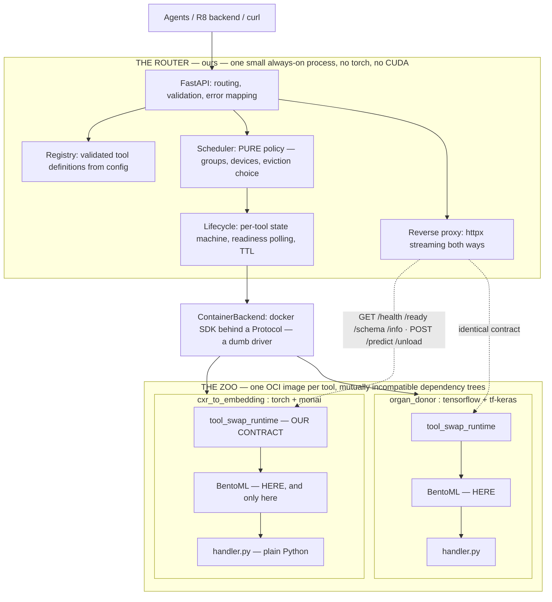
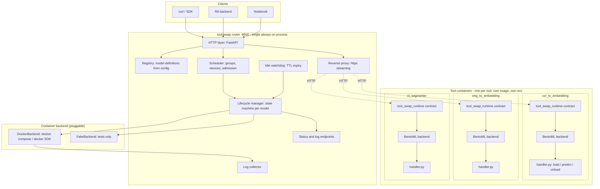
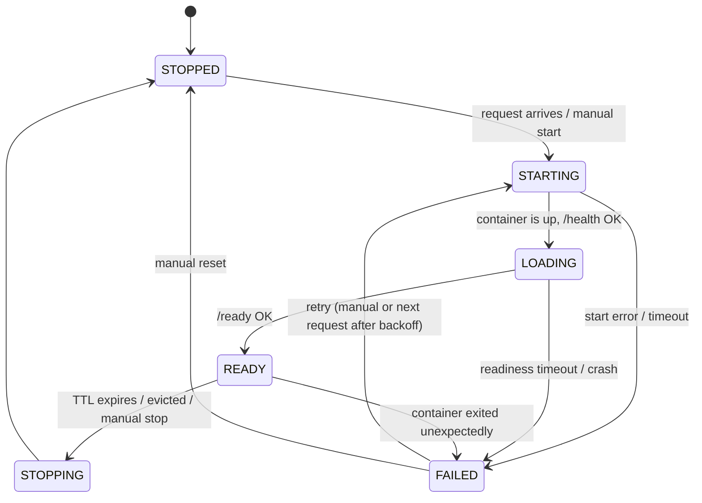
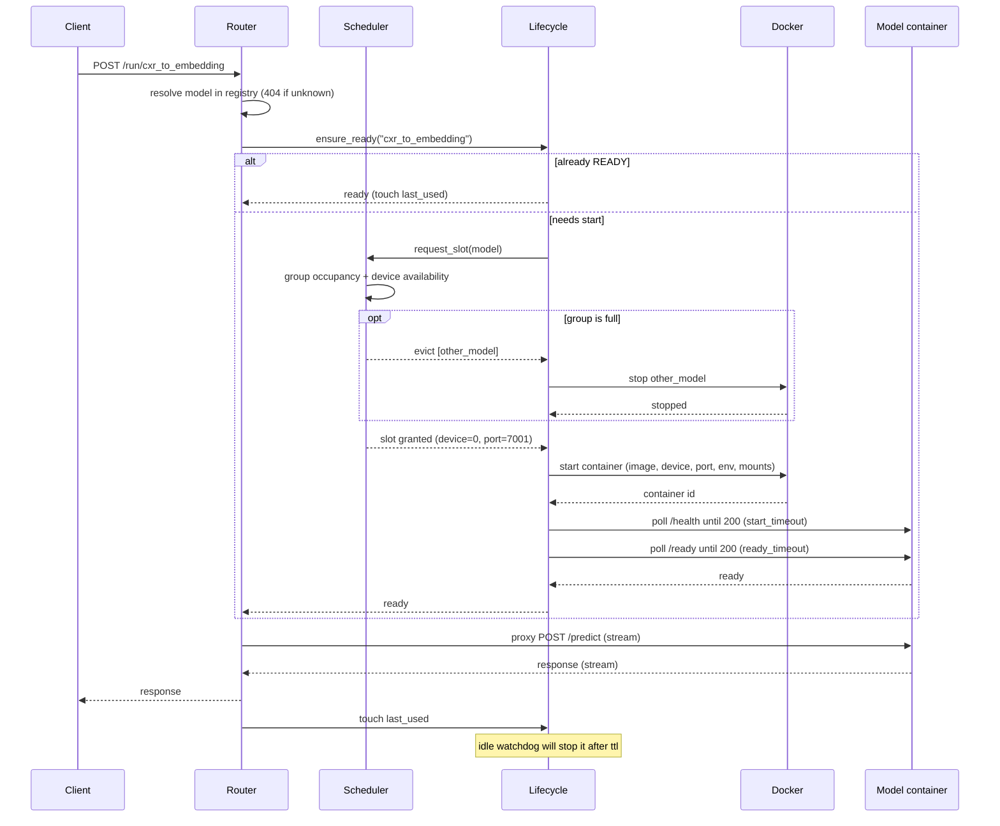
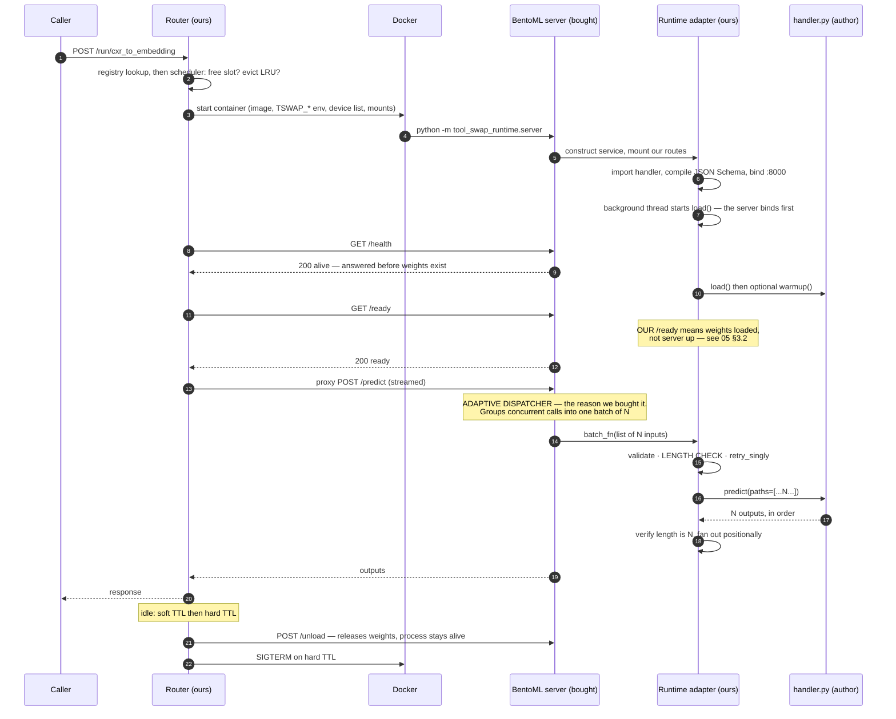
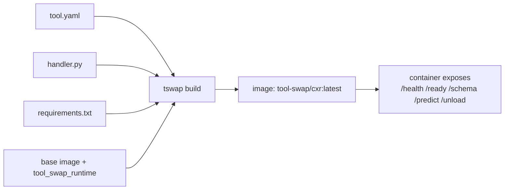

# 01 — Architecture

---

## 1. The one-sentence architecture

**A single always-on router process owns a registry of model definitions and a scheduler; on demand it starts the container for a model, waits for its readiness, proxies requests to it, and stops it when it goes idle.**

Everything else in this document is detail.

---

### 1.1 The two boundaries

Before the component map, the shape that explains every decision downstream. The system has exactly **two** boundaries, and confusing them is the most common way to misread this plan.



| Boundary | What it separates | Why it exists |
|---|---|---|
| **1 — the container** | Each tool's dependency tree from every other tool's, and from the router's | **D2**, the most load-bearing decision in the plan. It is why a torch tool and a TensorFlow tool stop fighting, and why a CUDA OOM in one tool cannot touch another |
| **2 — the runtime contract** | The router from whatever serves inside the container | Eight endpoints, identical across the zoo (§6). The router never asks "what does this image expose?" |

**Where BentoML sits, and what follows from it.** The serving framework (**D14**, [`05_RUNTIME_AND_BATCHING.md`](05_RUNTIME_AND_BATCHING.md) §1) lives strictly *between* boundary 2 and the handler, inside boundary 1. Three consequences, each enforced rather than hoped for:

- **The router never imports it, configures it, or speaks its route names.** It sets `TSWAP_*` environment variables; our adapter translates them ([`05_RUNTIME_AND_BATCHING.md`](05_RUNTIME_AND_BATCHING.md) §7).
- **The tool author never imports it.** `handler.py` is plain Python with `load()` / `predict()` / `unload()`.
- **It competes with exactly one tool's pins**, never the zoo's — which is the whole difference from R8, where one environment held `torch`, `tensorflow`, `ray`, `bentoml` and every model at once ([`00_CONTEXT_AND_MOTIVATION.md`](00_CONTEXT_AND_MOTIVATION.md) §2.3).

An import-linter rule plus an AST check keep `bentoml` out of every module except `tool_swap_runtime/backends/bentoml_backend.py` ([`08_REPO_LAYOUT.md`](08_REPO_LAYOUT.md) §5). That single file is the entire framework-aware surface of the project.

**What we build, in one line each:** the scheduler and the lifecycle manager (the product), the uniform contract, the authoring layer, the catalogue, and the operator tooling. **What we buy:** Docker, FastAPI, and one serving framework per container. Only the scheduler is genuinely novel ([`16_COMPLEXITY_AUDIT.md`](16_COMPLEXITY_AUDIT.md) §6).

---

## 2. Component map



### 2.1 Responsibilities, strictly separated

> **Convergent evidence, worth knowing about.** llama-swap is rewriting its own router after four years and 249 releases, and the decomposition it settled on is this one: *"The legacy `ProxyManager` collapses three concerns into one struct: the HTTP mux, the model→process router, and the cross-cutting services… The new layout keeps the `router.Router` implementations focused on model dispatch and lets `internal/server.Server` own the mux and all cross-cutting middleware."*
>
> Their standing warning is the one to internalise: **"preserve that abstraction rather than reintroducing the branch in every handler."** That is precisely what happens when scheduling policy leaks into request handlers — the failure [`16_COMPLEXITY_AUDIT.md`](16_COMPLEXITY_AUDIT.md) §5 names as never-trim item 2. **We have the warning before writing the code; they got it after writing it twice.**
>
> A second borrowing from the same source: their `Router` interface has three implementations (static groups, a solver, and a remote peer) behind one abstraction, and a `LocalRouter` sub-interface that a remote peer opts out of. **We have one policy and need no second implementation — but the interface shape is worth copying anyway**, because it is what makes federation ([`14_ALTERNATIVES_EVALUATION.md`](14_ALTERNATIVES_EVALUATION.md) §8.6) addable later without touching a single handler. Same reasoning as `ContainerBackend` and `RuntimeBackend`.

| Component | Owns | Must NOT |
|---|---|---|
| **HTTP layer** | Route parsing, request validation, error mapping to status codes, streaming responses. | Contain lifecycle or scheduling logic. |
| **Registry** | Parsed, validated model definitions. Immutable snapshot; replaced atomically on reload. | Hold mutable runtime state (that is the lifecycle manager's). |
| **Scheduler** | Deciding *whether* a model may start now, and *what must stop first*. Group occupancy, device assignment, eviction choice. | Perform I/O. **Pure, synchronous, fully unit-testable.** |
| **Lifecycle manager** | The per-model state machine; ensuring exactly one start/stop is in flight per model; readiness polling; TTL bookkeeping. | Know about HTTP request shapes. |
| **Container backend** | `start`, `stop`, `is_running`, `inspect`, `logs`, `build`. The only component that touches Docker. | Contain policy. It is a dumb driver behind an interface. |
| **Reverse proxy** | Forwarding a request to `http://{host}:{port}{path}`, streaming both ways, header hygiene, timeouts. | Retry business logic beyond the documented swap-retry. |
| **Idle watchdog** | Firing TTL expiry events on a clock tick. | Decide policy — it asks the lifecycle manager. |
| **Log collector** | Streaming container stdout/stderr into per-model rotating files. | Parse or interpret model output. |

And inside each container, below the router entirely:

| Component | Owns | Must NOT |
|---|---|---|
| **`tool_swap_runtime`** (ours) | The HTTP contract, schema compilation, validation, the batch-length check, `retry_singly`, truthful readiness, handler lifecycle. | Import a serving framework outside `backends/`. |
| **Runtime backend** (BentoML, **D14**) | Serving the port, forming batches, worker processes and device assignment — three things, and no more ([`05_RUNTIME_AND_BATCHING.md`](05_RUNTIME_AND_BATCHING.md) §2.2). | Appear in any signature above the seam, or be known to the router. |
| **`handler.py`** (the author) | `load()` / `predict()` / `unload()`. | Import anything of ours beyond a metadata decorator, or any framework. |

The critical testability rule, learned from the R8 code: **the scheduler must be a pure function of state, and the clock must be injectable.** Everything about TTL and eviction can then be tested in milliseconds with no Docker and no `sleep`. See [`10_TESTING_STRATEGY.md`](10_TESTING_STRATEGY.md).

---

## 3. Why the router is the only always-on component

- It is tiny: FastAPI + httpx + pydantic + the docker driver. No torch, no CUDA, no model code. Its image is small and its startup is instant.
- **It must never import model code.** This is the architectural invariant that keeps environments isolated (**D2**). If the router ever needs to `import` something a model needs, the design has been violated.
- It can be restarted without disturbing running model containers (they are separate containers; on boot the router reconciles by inspecting what is already running — see §7).

---

## 4. Model state machine



| State | Meaning | Serves traffic? |
|---|---|---|
| `STOPPED` | No container. Zero resources held. The steady state for most models. | No |
| `STARTING` | Container created/started; not yet answering `/health`. | No — requests queue |
| `LOADING` | Process is up but weights are still loading (`/health` yes, `/ready` no). | No — requests queue |
| `READY` | Fully warm. | **Yes** |
| `STOPPING` | Graceful shutdown in progress. | No |
| `FAILED` | Start or readiness failed, or the container died. Holds an error message and a failure count. | No — returns 503 with the reason |

**Why `STARTING` and `LOADING` are distinct:** cold start is dominated by weight loading, not container start. Separating them makes the status output genuinely diagnostic ("it has been in LOADING for 90s" is a very different problem from "it has been in STARTING for 90s") and lets us set separate timeouts. R8's BentoML engine already made exactly this distinction with `/healthz` (process alive) vs `/readyz` (warm) — we keep it and name it in the state machine.

---

## 5. Request lifecycle — the critical path



### 5.0 The same path, end to end — where every component acts

The diagram above stops at the container door. This one goes through it, and it is the single most useful picture of the system: it shows what the router owns, what Docker owns, what the bought serving framework owns, and what the scientist owns — in the order they execute.



Read the participants as an ownership map:

| Participant | Owned by | Scope |
|---|---|---|
| Router | **Us** | Registry, scheduling, eviction, lifecycle, proxying. Never imports model code, never imports the serving framework |
| Docker | **Bought** | Starting and stopping containers, device requests, mounts |
| BentoML server | **Bought** | Three jobs only: serve the port, **form the batch**, run the workers ([`05_RUNTIME_AND_BATCHING.md`](05_RUNTIME_AND_BATCHING.md) §2.2) |
| Runtime adapter | **Us** | The contract endpoints, schema compilation, validation, the batch-length check, `retry_singly`, truthful readiness, lifecycle hooks |
| `handler.py` | **The author** | `load()` / `predict()` / `unload()`. Plain Python, imports no framework |

Two steps in that sequence are load-bearing and easy to miss:

- **Bind before load.** The server answers `/health` while weights are still loading. R8 did this too — but its warm-up thread *swallowed the exception*, leaving a service alive, never ready, and silent about why ([`12_REFERENCE_CODE.md`](12_REFERENCE_CODE.md) §5). Ours records the traceback, serves it in the `/ready` body, and exits non-zero after a grace period.
- **`batch_fn` is the seam.** The framework decides *when* a batch forms; it hands our code an already-formed list of N and never touches validation, error shaping or the length check. That is exactly why replacing it later is bounded work.

### 5.1 Concurrency rules on this path

These are the details that make or break correctness. Specify them now, test them explicitly.

1. **One in-flight transition per model.** `ensure_ready` must be idempotent and coalescing: if ten requests arrive simultaneously for a `STOPPED` model, exactly **one** container start occurs and all ten requests await the same future. Implement with a per-model `asyncio.Lock` + a stored "pending readiness" awaitable.
2. **Global scheduling lock.** Slot granting and eviction must be serialised across models, or two concurrent starts can both believe the same group slot is free. One global `asyncio.Lock` around the scheduler decision is entirely sufficient at our scale — do not get clever.
3. **In-flight requests block eviction.** A model with `inflight > 0` is never evicted and never TTL-stopped. Maintain an in-flight counter incremented before proxying and decremented in a `finally`. TTL is measured from `last_used`, which is updated on request *completion*.
4. **Graceful drain on stop.** On eviction/TTL, stop accepting new proxied requests for that tool, wait up to `drain_timeout` for in-flight ones, then `SIGTERM` the container, then `SIGKILL` after `stop_timeout`. R8's process engine used `killpg(SIGTERM)` then `kill()` after a 5 s wait — same idea, now delegated to Docker's own stop semantics. **This survives [ADR-0004](adr/0004-hard-stop-only-in-v1.md) unchanged**, and is more careful than llama-swap's flat 10 s `unloadTimeout`, because rule 3 means we never force-kill mid-inference at all. **Check `drain_timeout` against your slowest single inference** ([`06_LIFECYCLE_TTL_AND_SCHEDULING.md`](06_LIFECYCLE_TTL_AND_SCHEDULING.md) §2.1).
5. **Queue bounds.** Waiting for a cold start must be bounded: `queue_timeout` (return 503 with a `Retry-After` if exceeded) and `max_queue_depth` per model (return 429 when exceeded). Never allow unbounded pile-up during a slow load.
6. **Swap-retry.** If a proxied request fails with a connection error *because the model was concurrently stopped*, retry `ensure_ready` + proxy **once**. Beyond that, fail. This handles the benign race between the watchdog and a late request.

### 5.2 Timeout budget (defaults, all configurable)

| Timeout | Default | Applies to |
|---|---|---|
| `start_timeout` | 120 s | container created → `/health` 200 |
| `ready_timeout` | 600 s | `/health` 200 → `/ready` 200 (weight loading; generous because first run may download weights) |
| `queue_timeout` | 300 s | client's total wait for a model to become ready |
| `request_timeout` | 300 s | a single proxied inference call |
| `drain_timeout` | 30 s | waiting for in-flight requests before stopping |
| `stop_timeout` | 30 s | `SIGTERM` → `SIGKILL` |

Note the first-run trap: a model that downloads 20 GB of weights on first start will blow any sane `ready_timeout`. Mitigations: mount a shared weights/HF cache (**always**), and provide `tswap warm <model>` to pre-pull outside the request path. Document this loudly.

---

## 6. The two model kinds

This distinction runs through the entire system, so it is defined once, here.



**There is one kind of tool: one we build from a handler, running on our runtime.** There is no second class of tool that wraps a third-party server image and is proxied as-is. The only serious candidate for such a class was vLLM, and LLM serving belongs to llama-swap ([`04_API_CONTRACT.md`](04_API_CONTRACT.md) §0). Avoiding the split also avoids a `mapping:` translation layer, a `kind:` config key, and a permanent column of "does this feature work for external tools?" caveats running through the architecture.

What that uniformity buys, and it is a lot:

| Property | Consequence of every tool being ours |
|---|---|
| Endpoints | Always standardised by `tool_swap_runtime` — the router never asks "what does this image expose?" Which serving backend is underneath (BentoML in v1, **D14**) is invisible here by design. |
| Batching | Always present, via the runtime's backend (**D5**, **D14**): BentoML's adaptive dispatcher, configured from the tool's declaration. Uniform across the zoo, because every tool runs the same runtime. |
| Schema | Always present and always live from `/schema`, so `?format=tools` never has holes. |
| Soft unload | Always possible, since the handler cooperates — **D9**'s phase 2 applies to the whole zoo, not a subset. |
| `/run/{tool}` | Works for every tool, with no translation configuration. |
| Router-side features | Need no graceful degradation path, because there is no lesser class of tool. |

An author needing a vendor's inference code uses their image as a `base_image` and calls their library from `predict()` ([`03_TOOL_AUTHORING.md`](03_TOOL_AUTHORING.md) §7) — keeping the uniform contract instead of becoming a black box the router cannot describe to an agent.

---

## 7. State reconciliation on router restart

The router holds runtime state in memory only (**no database**, per non-goals). So on boot it must **reconcile**: ask the backend which of our containers are running (identified by a label such as `com.tool-swap.model=<name>` — always label our containers), and for each one found, adopt it: probe `/ready`, and if ready, set state `READY` with `last_used = now`.

Rules:
- A running container whose model is no longer in the config → log a warning, stop it (it is an orphan). Make this behaviour configurable (`orphans: stop | adopt | ignore`, default `stop`).
- There is **no port allocation to reconcile**: tools are reached by container name on the shared network (**D21**, §9), so a restarted router rediscovers a container by its label and name rather than by remembering which port it was given. This is the structural fix for the originating system's `BASE_PORT + i` flaw, where reordering the registry silently reassigned every port — the state that could be wrong no longer exists.
- Reconciliation must be safe to run repeatedly and must never kill a container that is currently serving.

### 7.1 Shutdown ordering on `tswap down`

**Drain the HTTP server before tearing down containers.** llama-swap's own router-rewrite notes state the failure directly: *"`httpServer.Shutdown` must drain inflight requests before `Server.Shutdown` tears down processes, otherwise inflight requests 502."*

**Ours is harder than theirs, because "drain" has two meanings here** (**D22**): a request may be *in flight against a container*, or *queued behind a cold start* for a container we are about to stop. The order is therefore:

1. **Stop accepting new requests** at the router.
2. **Fail queued requests fast** with 503 + `Retry-After` and a shutting-down reason. They are waiting for a container that is about to stop; making them wait out `queue_timeout` first is pointless and looks like a hang.
3. **Drain in-flight requests**, bounded by `drain_timeout`.
4. **Then** stop containers, in the ordinary drain-then-`SIGTERM`-then-`SIGKILL` sequence (§5.1 rule 4).

Cheap to specify now; a source of flaky integration tests if left to implementation.

---

## 8. Where the batching lives

```
Client ──1 request──> Router ──1 request──> Tool container
                                               ├── BentoML adaptive dispatcher   (bought — forms the batch)
                                               └── tool_swap_runtime wrapper     (ours — above the seam)
                                                   ├── validation
                                                   ├── batch-length check
                                                   ├── retry_singly
                                                   └── handler.predict(batched inputs)
```

**Batching happens inside the tool container, never in the router.** Reasons:

- The router is model-agnostic; it cannot know whether two payloads are combinable.
- It keeps the router stateless with respect to inference, and it means batching travels with the image — a tool remains a fully functional server under plain `docker run`.
- It mirrors what R8's BentoML engine did (`@bentoml.api(batchable=True, max_batch_size, max_latency_ms)`), which is the configuration our adapter now generates from the tool's declaration.

**We do not write the batcher (D14).** The engine is BentoML's **adaptive** dispatcher: rather than a fixed "flush at size N or after W ms", it estimates the arrival rate and the model's latency curve and adapts its wait window to hold p99 under `max_latency_ms` ([`05_RUNTIME_AND_BATCHING.md`](05_RUNTIME_AND_BATCHING.md) §4.1). The fixed size-or-age policy is R8's `CoreBatcher` ([`12_REFERENCE_CODE.md`](12_REFERENCE_CODE.md) §7); it is **not** ported into v1, and survives as two useful things: the written specification for a future `native` backend, and the mental model operators should use when tuning the two knobs.

What stays ours regardless of the engine, because it sits above the seam: input validation, the **batch-length check** (a mismatch would return one patient's result for another), `retry_singly` per-item failure isolation, and the structured error envelope.

The tool declares whether it is batchable. A non-batchable tool simply gets batches of size 1, so authors write one code path. One restriction follows from the dispatcher and is enforced at authoring time (**D15**): **a batched tool may declare only batchable inputs**, with per-deployment knobs becoming static params fixed at `load()`. Details in [`05_RUNTIME_AND_BATCHING.md`](05_RUNTIME_AND_BATCHING.md) §4.

---

## 9. Networking

- One user-defined Docker network, e.g. `tool-swap-net`. Router and all model containers join it.
- The router addresses tools **by container name over the Docker network** (`http://ts-cxr_to_embedding:8000`), never by published host ports (**D21**). There is therefore no allocation, no collision, and no persisted record of who holds which port.
- The in-container port is a constant, since nothing else on that network competes for it. It is read from the environment rather than hardcoded, so a platform that dictates it can ([`14_ALTERNATIVES_EVALUATION.md`](14_ALTERNATIVES_EVALUATION.md) §8.5).
- Publishing a tool's port to the host is **opt-in** (`expose_host_port: true`) and exists for debugging — attaching `curl` or a profiler from the host — not for normal operation.
- Only the router's port (default `8600`) is published. It is the single ingress, which is precisely requirement **R3**.
- **A container-side health check runs in the container's own namespace and must therefore target the *internal* port.** This is an easy mistake once tools are addressed by name, and it is the reason a health check that looks correct can fail for a tool that is working.
- If the router runs on the host instead of in a container (a debugging option, **D20**), it reaches tools via published ports on `127.0.0.1`. The backend abstraction hides the difference; only the containerised path carries the v1 test matrix.

---

## 10. Data and weights

Models need paths: DICOM stores, weight caches, scratch space. Rules:

- **A shared model-weight cache mount is mandatory in practice** (e.g. host `${HF_HOME}` → `/root/.cache/huggingface` in every container). R8's compose already did this for both the API and the vLLM service; it is what makes container restarts cheap instead of catastrophic.
- Per-model extra mounts are declared in `tool.yaml`, read-only by default.
- Global mounts applied to every model are declared once in the global config (avoid repeating the HF cache in twenty files).
- Large binary payloads (a CT volume) are passed **by reference**, never inlined as base64 JSON — a 500 MB volume becomes roughly 670 MB of JSON, buffered end to end. The originating system's tools already took `paths: Batchable[str]` for exactly this reason.
- **The reference is resolved inside the runtime, immediately before the handler sees it** (**D18**). In v1 the resolver accepts a filesystem path and returns it unchanged; teaching it `s3://` later is a change to one resolver plus a credentials block, and changes no client code, no tool schema and no handler.
- The coupling this creates in v1 must be documented rather than discovered: the caller and the container must agree on a shared filesystem view, and **a path that is valid on the host but unmounted in the container is a configuration error the tool cannot diagnose**. Expect this to be the most common "file not found" report; `tswap doctor` and the troubleshooting runbook name it explicitly.

---

## 11. Failure modes to design for explicitly

| Failure | Required behaviour |
|---|---|
| Container fails to start (bad image, missing GPU) | `FAILED` + error string surfaced in `/status` and in the 503 body. Exponential backoff before automatic retry; do not hot-loop. |
| Readiness never achieved (weights download stalls) | `FAILED` on `ready_timeout`, container stopped, logs retained and pointed to in the error. |
| CUDA OOM during load | Same as above. Because the model is isolated, **no other model is affected** — this is the headline benefit over R8's in-process engine. |
| Container dies while `READY` | Detected by the watchdog's periodic liveness check → `FAILED`; in-flight requests get 502. Next request retries a start. |
| Eviction target has in-flight work | Never evicted (§5.1 rule 3). If *every* member of a full group is busy, the requester waits until `queue_timeout` then gets 503. |
| Two models pinned to the same device, both start | Allowed only if the same group's `max_resident` permits it. Otherwise the scheduler serialises them. GPU VRAM is not policed in v1 (**D7**) — document that pinning is the user's contract. |
| Router killed while containers run | Containers keep running; reconciliation on restart (§7). |
| Disk fills with images | `tswap prune`; document image size expectations. |

---

## 12. Interfaces to define first (they anchor every test)

Define these three protocols before any implementation; everything else plugs into them.

```python
class ContainerBackend(Protocol):
    """The ONLY component that touches Docker."""
    def start(self, spec: ContainerSpec) -> ContainerHandle: ...
    def stop(self, handle: ContainerHandle, *, timeout_s: float) -> None: ...
    def is_running(self, handle: ContainerHandle) -> bool: ...
    def list_managed(self) -> list[ContainerHandle]: ...   # by label, for reconciliation
    def logs(self, handle: ContainerHandle, *, follow: bool, tail: int) -> Iterator[str]: ...
    def build(self, spec: BuildSpec) -> str: ...           # returns image ref


class HealthProbe(Protocol):
    """Injectable so tests never do real HTTP."""
    async def health(self, endpoint: Endpoint) -> bool: ...
    async def ready(self, endpoint: Endpoint) -> bool: ...


class Clock(Protocol):
    """Injectable so TTL tests never sleep."""
    def now(self) -> float: ...
    async def sleep(self, seconds: float) -> None: ...
```

With `FakeBackend`, `FakeProbe` and `ManualClock`, the whole scheduler/lifecycle/TTL/eviction surface is unit-testable without Docker, without GPUs and without wall-clock waits. Real Docker is then exercised by a small number of `@pytest.mark.docker` integration tests.
