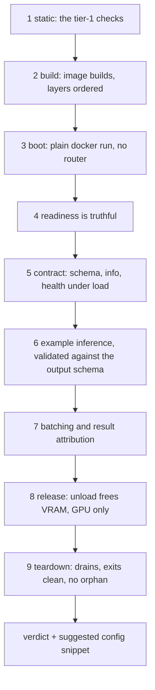

# 03 — Model Authoring (the graduated-complexity ladder)

> Requirement **R2**: *"We need to be able to easily add new models to it, the code and the environment of each model should be easy to setup."*
> Decision **D3**: the simple path asks the author for **only their Python requirements and their code**. Deeper knobs exist but stay out of sight until needed.
>
> **The benchmark to hit: a scientist who has never written a Dockerfile can add a working GPU model in under 15 minutes, touching only files inside their own model directory.**

---

## 1. The ladder

Each rung adds power and asks for more knowledge. Most models stop at Level 1.

| Level | The author writes | Uses when | Docker knowledge needed |
|---|---|---|---|
| **0 — pure function** | one Python file, one function | stateless CPU transform, no deps beyond the base image | none |
| **1 — handler + requirements** | `tool.yaml`, `handler.py`, `requirements.txt` | **the default for ~90% of models**, including all GPU models | none |
| **2 — system packages / install hooks** | + `system_packages`, `pre_install`, `post_install` in `tool.yaml` | needs `apt` libs (`libgl1`, `ffmpeg`, `dcm2niix`) or a wheel from a custom index | none |
| **3 — custom base image** | + `base_image:` | needs a specific CUDA/cuDNN/TF base, or a vendor image such as `nvcr.io/nvidia/pytorch` | a little |
| **4 — full Dockerfile** | own `Dockerfile` | exotic builds a generated Dockerfile cannot express | yes |

There is no fifth rung for "wrap someone else's server image". Every tool, at every level, runs our runtime and speaks our contract — that uniformity is what lets `/run` work identically for all of them with no translation layer.

The escalation must be **additive**: moving from Level 1 to Level 2 means adding two lines to `tool.yaml`, never rewriting anything.

---

## 2. Level 1 in full — the canonical example

Three files in one directory. Nothing else.

```
models/cxr_to_embedding/
├── tool.yaml
├── handler.py
└── requirements.txt
```

### `requirements.txt`
The author's environment, *theirs alone*. No conflict with any other model, ever.

```
torch==2.8.0
transformers==4.56.1
pydicom==3.0.1
numpy==1.26.4
```

### `handler.py`

```python
"""Chest X-ray to embedding model."""

from tool_swap_runtime import model, Field


@tool
class CXRToEmbedding:
    """Convert the chest X-ray image at the provided PATH into a vector
    EMBEDDING using the RAD-DINO foundation model.
    """

    def __init__(self, device: str = "cpu") -> None:
        self.device = device
        self.model = None

    def load(self) -> None:
        """Load weights. Called once when the model becomes READY."""
        from transformers import AutoModel
        self.model = AutoModel.from_pretrained(
            "microsoft/rad-dino", cache_dir=None
        ).to(self.device).eval()

    def unload(self) -> None:
        """Release weights. Called on soft-TTL expiry and on shutdown."""
        self.model = None

    def predict(
        self,
        paths: list[str] = Field(
            description="Path to a DICOM chest X-ray image to convert into an embedding."
        ),
    ) -> list[list[float]]:
        """Embed one or more chest X-rays.

        Args:
            paths: A batch of DICOM file paths.

        Returns:
            One embedding vector of length 768 per input path.
        """
        import torch
        from .dicom import load_image  # the author's own helper, alongside handler.py

        images = [load_image(p) for p in paths]
        with torch.inference_mode():
            out = self.model(torch.stack(images).to(self.device))
        return out.pooler_output.cpu().tolist()
```

### `tool.yaml`

```yaml
name: cxr_to_embedding
description: >
  Convert the chest X-ray image at the provided PATH into a vector EMBEDDING
  using the RAD-DINO foundation model.
handler: handler.py:CXRToEmbedding
runtime:
  accelerator: cuda
  requirements: requirements.txt
inputs:
  - name: paths
    type: string
    batchable: true
    required: true
    description: Path to a DICOM chest X-ray image to embed.
    semantic: dicom_path        # optional free-form hint, never interpreted by the router
outputs:
  - name: embedding
    type: array
    items: number
    description: A 768-dimensional embedding per input image.
batching:
  enabled: true
  max_batch_size: 8
  max_wait_ms: 20
resources:
  vram_gb: 4
example:
  inputs:
    paths: /weights/samples/cxr.dcm
```

### Register and run

```bash
# add one line to tools.yaml:
#   cxr_to_embedding:
#     path: ./tools/cxr_to_embedding
#     group: gpu0

tswap build cxr_to_embedding     # builds the image (base + requirements + code)
tswap test  cxr_to_embedding     # runs the example through the real container
tswap up                         # or reload if already running
curl -X POST localhost:8600/run/cxr_to_embedding \
     -H 'content-type: application/json' \
     -d '{"inputs": {"paths": "/data/cxr/x.dcm"}}'
```

**What the author did not have to know:** Docker, CUDA base images, batching, health endpoints, ports, GPU pinning, TTL, JSON Schema — **and BentoML**, which is what actually serves this handler (**D14**, [`05_RUNTIME_AND_BATCHING.md`](05_RUNTIME_AND_BATCHING.md) §1). That last one is deliberate and load-bearing: R8's BentoML setup required a `service_factory.py` that dynamically built a service class and assigned it into `globals()`, and none of that may reach the authoring path. `handler.py` above imports nothing but our public API, and would run unchanged on a different backend ([`05_RUNTIME_AND_BATCHING.md`](05_RUNTIME_AND_BATCHING.md) §2). That is the point.

**What the author got for free** by declaring `inputs:`/`outputs:`: the declaration is compiled into **JSON Schema** and projected into OpenAI-style tool definitions, so this model is immediately callable by an LLM agent (**D13**, [`04_API_CONTRACT.md`](04_API_CONTRACT.md) §9):

```bash
curl 'localhost:8600/tools?format=tools&names=cxr_to_embedding'
```

```json
{"tools": [{"type": "function", "function": {
  "name": "cxr_to_embedding",
  "description": "Convert the chest X-ray image at the provided PATH into a vector EMBEDDING using the RAD-DINO foundation model.",
  "parameters": {
    "type": "object",
    "properties": {"paths": {"type": "string", "description": "Path to a DICOM chest X-ray image to embed."}},
    "required": ["paths"],
    "additionalProperties": false
  }}}]}
```

This is why `description` is mandatory on the model and on every input: **in a tool definition the description *is* the interface an LLM reads.** An undocumented parameter produces an unusable tool. If you need richer constraints (enums, numeric ranges, nested objects), use the raw `json_schema:` escape hatch in `tool.yaml`.

---

## 3. The handler contract

Deliberately tiny. It is essentially R8's proven `class_tool` contract with the introspection magic removed.

```python
class Handler(Protocol):
    def __init__(self, device: str = "cpu", **kwargs) -> None: ...

    def load(self) -> None:
        """Acquire heavy resources. Called before serving. Optional."""

    def unload(self) -> None:
        """Release heavy resources. Called on soft-TTL / shutdown.

        Required for any tool with `devices` (a GPU tool); optional for CPU tools.
        """

    def predict(self, **inputs) -> Any:
        """Perform inference. REQUIRED."""

    def warmup(self) -> None:
        """Optional. Run a dummy inference to trigger lazy CUDA/JIT init so the
        first real request is not the one paying for it."""
```

Static params declared in `tool.yaml` (§3.1) arrive as `__init__` keyword arguments, so a parameterised handler starts:

```python
def __init__(self, device: str = "cpu", threshold: float = 0.5) -> None:
    self.device = device
    self.threshold = threshold
```

### Rules, and why each exists

| Rule | Why |
|---|---|
| Heavy work goes in `load()`, **never** `__init__` | R8's own tool guide says exactly this. `__init__` runs during import/introspection; `load()` runs when the model is meant to become ready. Conflating them makes cold starts unmeasurable and soft-TTL impossible. |
| `unload()` must actually release, and for a GPU tool it is **mandatory** | Set references to `None`, call `torch.cuda.empty_cache()` / `tf.keras.backend.clear_session()`. Because we are process-isolated, these are now *safe* — R8's code had to warn that Keras session clearing was "process-wide, not scoped to this model alone". Here the process **is** the model. We run on a **shared DGX**, so soft unload is how VRAM goes back to the node and its neighbours ([ADR-0002](adr/0002-shared-node-soft-unload.md)); a handler that only *appears* to release makes us hold memory we have told the scheduler is free. Preflight stage 8 measures it and **fails** if it does not. |
| `predict()` receives **keyword arguments** named after the declared inputs | Positional coupling is what forced R8's HTTP layer to map an ordered `input_modalities` list onto port names by index — fragile and silently wrong if the caller reorders. Names only. |
| `predict()` receives **batches** when `batching.enabled` | Each declared `batchable` input arrives as a list; return a list of the same length **in the same order**. Non-batchable models get lists of length 1 (or set `enabled: false`). The runtime checks the returned length and fails loudly on a mismatch — a silent misalignment would return one patient's result for another ([`05_RUNTIME_AND_BATCHING.md`](05_RUNTIME_AND_BATCHING.md) §4.4). |
| A batched tool declares **only batchable inputs** | **D15.** Per-request knobs cannot be batched safely, so they become static params (§3.1). `tswap validate` hard-errors otherwise. |
| Every input needs a `description` | R8 *raised an error* on a missing parameter description. Keep that strictness: it is what makes `/tools` genuinely self-documenting for humans and LLM agents. `tswap validate` fails without it. |
| Type annotations required on inputs and the return | Enables schema generation and request validation. |
| Never import `tool_swap_runtime` internals beyond the public API | Keeps the runtime upgradable underneath handlers. |
| Imports of heavy libs *inside* `load`/`predict` are encouraged | Keeps `tswap validate`'s import of the module cheap, and mirrors R8's existing style (`from transformers import AutoModel` inside `load`). |

### The `@tool` decorator does almost nothing

It records metadata (name, docstring, declared fields) on the class so the runtime can find it and generate a schema. It **must not** do signature gymnastics, and it **must not** be a BentoML service decorator in disguise — no `bentoml` import, no framework type in any signature here ([`05_RUNTIME_AND_BATCHING.md`](05_RUNTIME_AND_BATCHING.md) §2.4). R8's equivalent grew to ~440 lines of `TypeAdapter`/`get_type_hints` introspection; that complexity belongs nowhere near a user-facing contract. If the decorator ever needs to be clever, prefer requiring an explicit declaration in `tool.yaml` instead.

---

## 3.1 Static parameters — the third input class

> **D15.** A tool with `batching.enabled: true` may declare **only batchable inputs**. Anything that would differ between requests in the same batch is declared as a **static param** instead.

The reason is specific to how batching works ([`05_RUNTIME_AND_BATCHING.md`](05_RUNTIME_AND_BATCHING.md) §4.3): the dispatcher batches whatever arrives concurrently and cannot separate requests by a differing `threshold`. Two callers sending `0.5` and `0.9` would share a batch, and one would receive a result computed with the other's value — no error, no log line, a plausible wrong number about a patient. So the situation is made unrepresentable rather than detected.

```yaml
params:                                    # fixed at load time, part of the tool's identity
  - name: threshold
    type: number
    default: 0.5
    description: Confidence threshold applied to detections.
inputs:                                    # per request; on a batched tool, all batchable
  - name: paths
    type: string
    batchable: true
    required: true
    description: Path to the DICOM series to segment.
```

| | `inputs:` | `params:` |
|---|---|---|
| Supplied by | the caller, per request | config, at deployment |
| Reaches the handler via | `predict(**inputs)` | `__init__(**params)`, before `load()` |
| Batchable | required to be, on a batched tool | n/a — constant across the batch |
| Appears in `?format=tools` | yes | no (it is not a caller-visible argument) |
| Changing it | free | restarts the tool |

Two different thresholds in production means **two config entries over the same image**, which the scheduler, TTL and status surfaces already handle as two tools — at the cost of two resident models. If a value genuinely must vary per request, set `batching.enabled: false` (free for CPU tools and single-request workloads), or use the `native` backend, which is the one place compatibility-key batching is specified ([`05_RUNTIME_AND_BATCHING.md`](05_RUNTIME_AND_BATCHING.md) §2). Note that `native` is **architecture only in v1** — in practice, today, the answer is a static param or no batching.

---

## 4. Level 0 — a bare function

For trivial CPU transforms, ceremony is not warranted:

```python
# models/text_cleanup/handler.py
from tool_swap_runtime import model, Field


@tool
def text_cleanup(
    text: list[str] = Field(description="Raw clinical text to normalise."),
) -> list[str]:
    """Strip control characters and collapse whitespace in clinical text."""
    import re
    return [re.sub(r"\s+", " ", t).strip() for t in text]
```

```yaml
name: text_cleanup
handler: handler.py:text_cleanup
description: Strip control characters and collapse whitespace in clinical text.
runtime: { accelerator: cpu }
inputs:
  - { name: text, type: string, batchable: true, required: true, description: Raw clinical text to normalise. }
outputs:
  - { name: value, type: string, description: The normalised text. }
```

No `load`/`unload`, no requirements file. Runs on the CPU base image, likely `keep_warm: true` since it costs nothing.

---

## 5. Level 2 — system packages and install hooks

```yaml
runtime:
  accelerator: cuda
  requirements: requirements.txt
  system_packages: [libgl1, libglib2.0-0, dcm2niix]
  pre_install:
    - pip install --extra-index-url https://download.pytorch.org/whl/cu129 torch==2.8.0+cu129
  post_install:
    - python -c "import monai; print(monai.__version__)"
```

This rung covers the awkward real-world cases that would otherwise force a jump to a full Dockerfile:

- OpenCV needing `libgl1`.
- The pinned-URL flash-attention wheel (R8 pins `flash_attn-2.8.3+cu12torch2.8...whl` by URL) → a `pre_install` line.
- A CUDA-suffixed torch build needing `--extra-index-url`.
- A model that must pre-download weights at build time → `post_install` with `huggingface-cli download ...` (which also makes cold starts fast at the cost of image size — document the trade-off).

`pre_install` / `post_install` are raw shell lines injected into the generated Dockerfile. Powerful and unsandboxed: say so in the docs, and note that they run at build time with network access.

---

## 6. Level 3 — custom base image

```yaml
runtime:
  base_image: nvcr.io/nvidia/tensorflow:24.03-tf2-py3
  requirements: requirements.txt
```

Requirement: the base must have a Python ≥ 3.10 with `pip`. The build then layers `tool_swap_runtime` + the author's requirements + code on top. This is the escape hatch for TensorFlow models (the R8 `organ_donor` Keras model is the motivating case) and for vendor-optimised images.

Provide our own maintained bases, and pin them:

| Base image | For |
|---|---|
| `tool-swap/base-cpu:py312` | CPU models |
| `tool-swap/base-cuda:12.4-py312` | torch/CUDA models |
| `tool-swap/base-cuda:12.1-py310` | older stacks |

Each base contains: Python, pip, `tool_swap_runtime` and **BentoML at the pinned version** (**D14**), with its transitive set (pydantic, starlette, uvicorn, click). Pre-installing the serving framework makes model builds *faster* — a real benefit of the BentoML decision.

Deliberately **no torch and no TensorFlow** — those come from the model's own requirements, so the base never dictates an ML framework version. That is where **D2**'s dependency freedom actually matters; a serving framework's pins are a bounded, tested set, whereas a pre-installed torch would dictate the CUDA stack of every model.

The pins BentoML brings are accepted on the stated terms ([`05_RUNTIME_AND_BATCHING.md`](05_RUNTIME_AND_BATCHING.md) §1.1): *acceptable until a concrete model demonstrates an unresolvable conflict*. CI resolves every template and example against the base to catch that early, and `tswap doctor` reports the resolved versions inside built images. **If your model pins a conflicting pydantic or starlette, that is a bug report we want** — it is the evidence that would reopen **D14**.

---

## 7. Level 4 — full Dockerfile

### 7.1 Own Dockerfile, still speaking our protocol

```yaml
build:
  context: .
  dockerfile: Dockerfile
```

The author's Dockerfile must `pip install tool-swap-runtime` (which brings the pinned BentoML) and end with the runtime's entrypoint. Note the entrypoint is **ours, not `bentoml serve`** — the runtime module resolves the backend, mounts our contract routes and starts the server, so a Level 4 author never learns BentoML's CLI:

```dockerfile
FROM some/exotic-base:latest
COPY requirements.txt .
RUN pip install -r requirements.txt tool-swap-runtime
COPY . /app
WORKDIR /app
ENV TSWAP_HANDLER=handler.py:MyModel
CMD ["python", "-m", "tool_swap_runtime.server"]
```

### 7.2 What you cannot do: wrap a third-party server

**There is no `kind: external`.** tool-swap does not host someone else's server image — not vLLM, not TEI, not Triton. LLM serving belongs to llama-swap in a separate deployment ([`04_API_CONTRACT.md`](04_API_CONTRACT.md) §0), and every tool here is one we build.

If you need to use a vendor's inference code, wrap it in a handler at Level 3 or 4: use their image as your `base_image`, import their library in `load()`, and call it from `predict()`. You then get batching, the schema, `/run` and TTL like every other tool, instead of a proxied black box the router cannot describe to an agent.

The consequence worth stating plainly: **there is no upstream server in the zoo with a better batcher to defer to** — every tool's throughput depends on the one batching path described in [`05_RUNTIME_AND_BATCHING.md`](05_RUNTIME_AND_BATCHING.md), which is why that path is BentoML's proven adaptive dispatcher (**D14**) rather than something we wrote.

A Level 3 caveat that follows from **D14**: a vendor base image must be able to install the pinned BentoML. Practically every `nvcr.io` PyTorch and TensorFlow image can, but **verify it in the spike or at first build**, not at deployment time.

---

## 8. How the image is built

`tswap build <model>` generates a Dockerfile from the resolved `runtime:` block. Roughly:

```dockerfile
FROM {base_image}                                   # from accelerator or explicit

RUN apt-get update \
 && apt-get install -y --no-install-recommends {system_packages} \
 && rm -rf /var/lib/apt/lists/*

RUN {pre_install...}

COPY requirements.txt /tmp/requirements.txt
RUN --mount=type=cache,target=/root/.cache/pip \
    pip install -r /tmp/requirements.txt

RUN {post_install...}

COPY . /app                                          # the model directory
WORKDIR /app
ENV TSWAP_HANDLER={handler}
EXPOSE 8000
HEALTHCHECK CMD curl -f http://localhost:8000/health || exit 1
CMD ["python", "-m", "tool_swap_runtime.server"]
```

Requirements:

- **Layer order matters**: system packages → requirements → code. Editing `handler.py` must not re-run `pip install`. A scientist iterating on code will rebuild constantly; if each rebuild reinstalls torch, they will abandon the tool.
- Use BuildKit cache mounts for pip (and support `uv` for speed — `uv pip install` is dramatically faster and is worth adopting as the default with a pip fallback).
- Write the generated Dockerfile to `.tswap/build/<model>/Dockerfile` and **keep it**, so a user can inspect it, learn from it, and graduate to Level 4 by copying it. This is the main mechanism by which the graduated ladder actually teaches.
- Tag deterministically: `{registry_prefix}/{model}:{hash-of-inputs}` plus a `:latest` alias, so `tswap build` is a no-op when nothing changed and the router can tell when a rebuild is needed.
- `tswap build --all`, and build-on-demand if an image is missing at start time (with a loud log line).

---

## 9. Developer workflow and the inner loop

The inner loop is where a tool like this is won or lost. A code change must be testable in seconds, not minutes.

```bash
tswap new my_model --template cuda   # scaffold the three files from a template
tswap validate my_model              # config + handler import + schema + descriptions
tswap build my_model                 # cached; only pip-installs when requirements changed
tswap test  my_model                 # runs tool.yaml's `example` through the container
tswap dev   my_model                 # mounts the source dir into the container and
                                     # hot-reloads the handler on file change
tswap logs  my_model -f
tswap preflight my_model             # ← the gate: will this actually deploy? (§10.1)
```

**`tswap preflight` is the last command of the loop and the only one whose verdict matters.** The others are for iterating; preflight is how an author knows they are done. It subsumes `validate`, `build` and `test` — running it is never wrong, and a tool that passes it is deployable. Run it before asking anyone to register your tool, and put it in CI with `--strict`.

The division of labour, since four commands overlapping is otherwise confusing:

| Command | Scope | Needs Docker | Answers |
|---|---|---|---|
| `tswap validate` | the declaration | no | "Is my `tool.yaml` coherent with my handler?" |
| `tswap build` | the image | yes | "Does it compile?" |
| `tswap test` | one happy path | yes | "Does my example return something?" |
| `tswap doctor` | **the host** | yes | "Is this machine able to run tools at all?" |
| **`tswap preflight`** | **the tool, end to end** | yes | **"Will my tool deploy successfully?"** |

`tswap dev` is important: it bind-mounts the model directory over `/app` so edits to `handler.py` take effect on reload without a rebuild. Only requirement changes then need a rebuild.

Templates shipped in the repo (`templates/`): `cpu`, `cuda`, `tensorflow`, `function`. Each is a complete, working, runnable tool — a new user's first action should be to copy a template that already works, not to assemble one from documentation.

---

## 10. Validation, tier 1: what `tswap validate <model>` checks

**Static only. No Docker, no GPU, no network.** That constraint is the whole value of this tier: it runs in seconds, in CI, on every pull request, and in pre-commit.

1. `tool.yaml` parses; no unknown keys; `name` matches the directory/registration.
2. `description` present and non-trivial.
3. Handler file exists; `file:Object` resolves; the object is a class with `predict` or a decorated function.
4. Every `predict` parameter is declared in `inputs`, and vice versa (no drift between code and declaration).
5. Every input has a `description` and a type; every output has a type.
6. `batchable` inputs are annotated as lists when batching is enabled.
7. `load`/`unload` are either both present or both absent (warn if only one — usually a leak). **A tool declaring `devices` must define `unload()`** — a hard error, since soft unload is the primary way VRAM returns to the shared node.
8. Requirements file exists and parses; warn on unpinned versions (reproducibility).
9. Warn if the handler imports heavy libraries at module scope (defeats fast validation and slows container start).
10. If `example` is present, its inputs satisfy the declared schema.
11. **D15**: a tool with `batching.enabled: true` declaring any non-batchable input is a **hard error**, naming the input and both remedies (§3.1).

Steps 1–11 must run **without Docker and without GPUs** so they can run in CI on every pull request. Everything that needs a running container belongs to tier 2 below.

---

## 10.1 Validation, tier 2: `tswap preflight <tool>` — "will my tool deploy?"

> **D17.** The one command an author runs before declaring a tool finished. It answers the question the other commands each answer only a fragment of.

`tswap validate` proves the declaration is coherent. `tswap build` proves an image compiles. `tswap test` runs one happy path. `tswap doctor` diagnoses the **host**. None of them tells an author whether their tool will *deploy* — whether readiness is truthful, whether batching returns each caller their own result, whether `unload()` frees anything, whether the image runs at all without our router. Preflight runs the whole chain and returns **one verdict**.

**It needs no router, no `tools.yaml` entry and no GPU.** It works on a laptop, on a tool nobody else has seen yet — which is exactly when an author wants to ask the question.

### 10.1.1 The stages



| # | Stage | What it asserts | Severity on failure |
|---|---|---|---|
| 1 | **Static** | Every tier-1 check (§10). Runs first because it is free and catches most mistakes. | `FAIL` |
| 2 | **Build** | The image builds from the resolved `runtime:` block. Reports the generated Dockerfile path and the image size. Warns when a code-only edit invalidated the pip layer — the single biggest drag on the inner loop (§8). | `FAIL` / `WARN` |
| 3 | **Standalone boot** | The image runs under **plain `docker run`**, with no router, no orchestration and no injected sidecar. This is guardrail 11 ([`13_OPEN_QUESTIONS.md`](13_OPEN_QUESTIONS.md) Part D) made the author's responsibility rather than a test's. A tool that fails here is not portable to compose, llama-swap or KServe either. | `FAIL` |
| 4 | **Truthful readiness** | `/health` answers **before** load completes; `/ready` is 503 **with a reason** while weights load, and 200 **only** once `load()` has returned. A tool that reports ready at server-up is the exact R8 defect this project corrects ([`05_RUNTIME_AND_BATCHING.md`](05_RUNTIME_AND_BATCHING.md) §3.2) — and at deployment it manifests as requests failing against a tool the router believes is fine. Measures and reports the cold start. | `FAIL` |
| 5 | **Contract** | `/schema` matches the schema compiled from `tool.yaml` (a drift here breaks `?format=tools` and therefore every agent consumer); `/info` reports runtime and backend versions; **`/health` still answers during a long inference** — the event-loop-blocking regression. | `FAIL` |
| 6 | **Example inference** | `tool.yaml`'s `example` runs through the real container and the response **validates against the declared output schema**. Without a declared `example`, this stage is skipped with a loud warning: a tool with no example cannot be preflighted, cannot be `tswap test`ed, and gives a reviewer nothing to run. | `FAIL`, or `WARN` if no example |
| 7 | **Batching and attribution** | N concurrent requests with **distinguishable** inputs; assert the handler was invoked fewer than N times (batching happens at all) and that **every caller received its own correct result**. Guardrail 5 calls misattribution the worst possible bug class in this domain; this stage puts the check in the author's hands. Also exercises `retry_singly`: one deliberately bad item must fail alone. | `FAIL` |
| 8 | **Resource release** | After an idle period, `unload()` genuinely returns VRAM (read via `nvidia-smi` before/after). **GPU hosts only** — skipped with a stated reason elsewhere, never silently. | **`FAIL`** for tools declaring `devices` ([ADR-0002](adr/0002-shared-node-soft-unload.md) §5) |
| 9 | **Teardown** | `SIGTERM` drains in-flight work, the process exits non-zero-free and within the grace period, and **no container, network or volume is left behind** — including when an earlier stage failed. | `FAIL` |

### 10.1.2 Severity and exit codes

| Verdict | Exit | Meaning |
|---|---|---|
| all pass | `0` | Deployable. |
| warnings only | `0` | Deployable, with noted risks (unpinned requirements, no `unload()`, slow cold start, no example, skipped GPU stage). |
| any `FAIL` | `1` | Not deployable. Every failure names the check, what was observed, and the command or edit that fixes it. |
| preflight itself broke | `2` | Docker unreachable, image pull failure — distinguished from a tool failure so scripts do not report a broken laptop as a broken tool. |

A `WARN` tier is deliberate. A tool that is merely *unwise* must still deploy: a gate that refuses everything imperfect gets bypassed, and a bypassed gate protects nobody. `--strict` promotes warnings to failures for use in CI.

### 10.1.3 It ends with a config snippet

Preflight has just measured the things authors otherwise guess at, so it prints them as paste-ready config rather than prose:

```yaml
# suggested for tools.yaml — measured by preflight, review before use
cxr_to_embedding:
  path: ./tools/cxr_to_embedding
  group: gpu0                 # ← choose; preflight cannot know your layout
  ready_timeout: 90           # measured cold start 24.1s x3 safety margin
  ttl: 600
  resources:
    vram_gb: 4                # peak observed during the example inference
  batching:
    max_batch_size: 8
    max_latency_ms: 25        # measured single-item inference 11ms
```

Guessed timeouts are a recurring cause of tools stuck in `FAILED` ([`07_CLI_AND_OPS.md`](07_CLI_AND_OPS.md) §7); a measured suggestion removes the guess. Values preflight cannot know — `group` above all — are emitted with a comment saying so rather than a plausible-looking default.

### 10.1.4 Flags

| Flag | Effect |
|---|---|
| `--fast` | Skip stages 7–8. The pressure valve if preflight becomes slow enough that authors start avoiding it. |
| `--strict` | Warnings become failures. For CI. |
| `--json` | Machine-readable report, so CI and `/ui` can consume the same result. |
| `--keep` | Leave the container running for inspection after a failure (`tswap shell` / `tswap logs`), overriding stage 9's cleanup. |
| `--stage N` | Run one stage. For iterating on a single failure. |

---

## 11. Anti-patterns to document for authors

The last column is the point: **most of these are caught by `tswap preflight`** (§10.1), so an author does not have to have read this table to be protected by it. The ones marked "—" are still on the author, which is why they are documented here.

| Anti-pattern | Why it hurts | Do instead | Caught by |
|---|---|---|---|
| Loading the model in `__init__` | Breaks cold-start accounting and soft-TTL | `load()` | preflight stage 4 |
| Loading weights lazily inside `predict` | The first request pays a huge, invisible cost; `/ready` lies | `load()` | preflight stage 4 |
| `unload()` that does not drop references | VRAM never returns; soft-TTL is useless | `= None` + empty cache | preflight stage 8 (GPU) |
| Returning numpy arrays / tensors directly | Not JSON-serialisable; R8 needed a bespoke pydantic serialiser for exactly this | `.tolist()`, or declare a binary response | preflight stage 6 |
| Returning a different number of results than inputs | **One patient's result delivered for another.** The worst bug class here | One result per input, in input order | preflight stage 7 |
| Base64-inlining a 500 MB CT volume | Memory blowup on both sides | Pass a path/URI; mount the data | — |
| Mutating global state between requests | Batching and multiple workers make this unsafe | Keep `predict` pure w.r.t. the loaded model | preflight stage 7 (sometimes; it is a race) |
| Unpinned requirements | Irreproducible rebuilds; the image hash lies | Pin everything | preflight stage 1 (`WARN`) |
| Writing to the container filesystem | Lost on stop; can fill the disk | Use a declared mount | — |
| Swallowing exceptions in `predict` | Failures become silent wrong answers | Raise; the runtime maps it to a structured error | — |
| Depending on env the router injects | The image stops being portable and runnable standalone | Read config from the documented env contract only | preflight stage 3 |
| Blocking the event loop in `predict` | `/health` stops answering; the router declares a busy tool dead | Keep heavy work off the loop, or declare the handler sync so the runtime offloads it | preflight stage 5 |

"Mutating global state" is deliberately marked as only *sometimes* caught: it is a race, and preflight running once cannot prove its absence. A check that promises more than it can deliver is worse than no check, so the report must not claim otherwise.

---

## 12. A second worked example: a text embedder

The same three files, for a text model rather than an image one — showing that "one kind of tool" really does cover the range:

```python
# handler.py
from tool_swap_runtime import tool, Field


@tool(name="text_embedding")
class TextEmbedding:
    """Embed clinical free text into a vector using a multilingual E5 model."""

    def load(self) -> None:
        from sentence_transformers import SentenceTransformer

        self.model = SentenceTransformer("intfloat/multilingual-e5-large", device="cuda")

    def predict(
        self,
        text: list[str] = Field(description="Text to embed.", batchable=True),
    ) -> list[list[float]]:
        return self.model.encode(text).tolist()

    def unload(self) -> None:
        self.model = None
```

```yaml
# tools.yaml
tools:
  text_embedding:
    path: ./tools/text_embedding
    group: gpu1
    ttl: 600
    max_batch_size: 32
```

`POST /run/text_embedding` now behaves exactly like every other tool — same request shape, same TTL, same status, same logs, same eviction, same appearance in `?format=tools`. Twenty lines of Python, and **the batching is ours** ([`05_RUNTIME_AND_BATCHING.md`](05_RUNTIME_AND_BATCHING.md)), which is precisely why that batcher has to be good.
