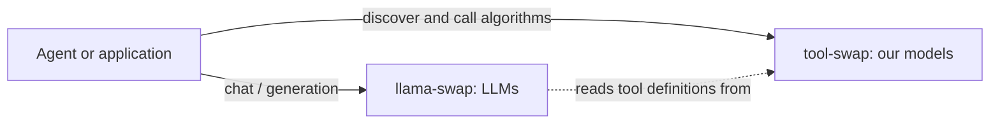

# 04 — API Contract

> Requirement **R3**: *"it should have a proxy to all services."*
> Decision **D4**: adopt llama-swap's **behaviours**, not its surface. We are not cloning any API.

## 0. What this service is, and is not

**tool-swap hosts our own algorithms. It does not host LLMs.**

LLM serving is [`llama-swap`](https://github.com/mostlygeek/llama-swap)'s job, in a separate deployment. tool-swap hosts chest X-ray encoders, CT segmenters, EEG foundation models, tabular classifiers and pure CPU functions — code we write, in images we build.

Two consequences run through this entire document:

1. **There is no OpenAI-compatible front door.** Such a door exists to let OpenAI clients reach LLMs, and we serve no LLMs — so it would serve nothing. There is therefore no `body.model` resolution, no `served_model_name`, no `aliases` and no `openai:` config block.
2. **Every tool is one we build** ([`03_TOOL_AUTHORING.md`](03_TOOL_AUTHORING.md)). There is no `kind: external`, no proxy-only tool, no `mapping:` translation layer. Every tool runs our runtime and speaks our contract, which is why `/run` works uniformly for all of them and needs no per-tool special cases.

The relationship between the two services:



**We are the tool provider to an agent whose LLM lives elsewhere.** That makes `GET /tools?format=tools` (**D13**) and MCP (**D16**) our primary integration surface — not an afterthought behind an OpenAI door, but the whole point.

**The governing rule of this document: every endpoint must earn its place.** If a capability is reachable through an endpoint that already exists, we do not add a second one. Ten endpoints is the entire v1 surface, and each one below states what would be lost if it were removed. Anything that could not answer that question is in §8.

---

## 1. Three front doors, ten endpoints

Every door triggers the same "ensure the tool is ready, then forward" machinery. They differ only in the shape of what is spoken.

| # | Door | Endpoints | For |
|---|---|---|---|
| 1 | **Normalized run** | `POST /run/{tool}` | The uniform API. Every tool answers here. |
| 2 | **Transparent proxy** | `ANY /upstream/{tool}/{path...}` | Reach a tool's own endpoints directly; debugging and escape hatch. |
| 3 | **Ops & discovery** | `GET /tools`, `GET /tools/{tool}`, `GET /status`, `GET /health`, `GET /ui`, `POST /admin/tools/{tool}/start`, `POST /admin/tools/{tool}/stop`, `GET /admin/logs/{tool}` | **R1**, and the agent integration surface. |

Two rules that keep this from growing:

- **Front doors are thin.** A route handler translates a request shape and delegates. All scheduling, queueing, TTL and eviction logic lives behind `ensure_ready(tool)`, in one place, shared by all three doors. A door that needs its own scheduling logic is a design error.
- **One capability, one endpoint.** Batching, schema retrieval and per-tool status are *properties expressed within* the endpoints above, not endpoints of their own.

> **Vocabulary** (README §3): `tool` is the native noun in every path, field and error code. With the OpenAI door gone, the word `model` no longer appears anywhere in this API — the one exception that used to exist is gone with it.

---

## 2. Door 1 — normalized run

### `POST /run/{tool}`

**Scope: every tool.** Because every tool is one we build on our runtime ([`03_TOOL_AUTHORING.md`](03_TOOL_AUTHORING.md)), there is no second class of tool that `/run` cannot serve, and no per-tool translation configuration. The question "which tools does `/run` not work for?" has no answer here, because there are none.

```http
POST /run/cxr_to_embedding
Content-Type: application/json

{
  "inputs": { "paths": "/data/cxr/patient1.dcm" },
  "options": { "timeout": 120 }
}
```

Success — **HTTP 200**:

```json
{
  "tool": "cxr_to_embedding",
  "outputs": { "embedding": [0.013, -0.221, "..."] },
  "meta": {
    "request_id": "01JD2X...",
    "duration_ms": 412,
    "queue_ms": 0,
    "batch_size": 3,
    "cold_start": false
  }
}
```

Failure — **HTTP 4xx/5xx per §6**:

```json
{
  "error": {
    "code": "UPSTREAM_ERROR",
    "message": "CUDA out of memory while loading RAD-DINO",
    "detail": "tswap logs cxr_to_embedding --tail 100"
  },
  "meta": { "request_id": "01JD2X...", "duration_ms": 60123 }
}
```

The shape, and the reasons behind it:

- **No `status` field in the body.** Carrying `status: "success" | "failed"` *and* mandating honest HTTP codes would be two sources of truth for one fact, and they eventually disagree. The HTTP status code is the answer; the body carries `outputs` or `error`, never both. The originating system made the opposite mistake — everything wrapped in HTTP 500, including a mistyped tool name — and §6 fixes that properly.
- **`inputs` is a named map, never a positional list.** R8's HTTP layer mapped an ordered `input_modalities` list onto port names *by index*:

  ```python
  for i, modality in enumerate(req.input_modalities):
      if i < len(tool_spec.input_ports):
          port_name = tool_spec.input_ports[i].name
          input_dict[port_name] = modality
  ```

  That silently returns wrong results when a caller reorders arguments, and forces the router to know each tool's schema. Named inputs delete the entire class of bug and let the router forward blindly.
- **`meta` is always present.** `cold_start`, `queue_ms` and `batch_size` are what make a performance complaint diagnosable, and they cost nothing.
- **Large data goes by reference** (paths/URIs), as R8's tools already did with `paths: Batchable[str]`.

### Batching: a property of the input, not a second endpoint

There is **no `/run/{tool}/batch`**. An input declared `x-batchable` accepts a list wherever it accepts a scalar:

```json
{ "inputs": { "paths": ["/data/a.dcm", "/data/b.dcm", "/data/c.dcm"] } }
```

`outputs` are then parallel lists in input order, and a per-item `meta.items[]` carries each item's status so one bad item does not fail the batch. A separate endpoint would have duplicated validation, documentation and tests to express something the schema already states.

**On a batched tool, every input is `x-batchable`** (**D15**, [`05_RUNTIME_AND_BATCHING.md`](05_RUNTIME_AND_BATCHING.md) §4.3), so the "list on one port, scalar on another" case cannot arise there and the client rule is simply *lists everywhere or scalars everywhere*. Mixed arities across ports in one request remain a 422.

**Per-request knobs are not inputs.** A value like `threshold` is a **static parameter** fixed at deployment ([`02_CONFIGURATION.md`](02_CONFIGURATION.md) §5.5.1), not something a caller sends. It never appears in the request body, and sending it is an unknown-input 422. This is deliberate: requests carrying different thresholds would be batched together and one answered with the other's value — silently. If a tool genuinely needs a per-request knob, it is deployed with `batching.enabled: false`, and only then may the knob be a normal (non-batchable) input.

### Schema: not an endpoint either

There is **no `/run/{tool}/schema`**. `GET /tools/{tool}` (§5) returns the descriptor, which contains the schema. One tool, one descriptor, one URL.

---

## 3. Door 2 — transparent proxy

### `ANY /upstream/{tool}/{path...}`

Forwards method, path, query, headers and body verbatim to `http://{container}:{port}/{path...}`, streaming both directions.

```bash
# reach a tool's own runtime endpoints, with swap + TTL managed for you
curl localhost:8600/upstream/cxr_to_embedding/schema
curl localhost:8600/upstream/cxr_to_embedding/info

# a tool that exposes an endpoint of its own beyond /predict
curl -X POST localhost:8600/upstream/ct_segmenter/visualise -d '{...}'
```

**Why this still exists now that every tool is ours.** It is a fair question, since the original justification — making off-the-shelf servers like vLLM first-class citizens — no longer applies. Three reasons keep it:

1. **Debugging.** Reaching `/schema`, `/info` and `/health` on a live tool, through the router, with the container started on demand, is the single most useful diagnostic path there is. Without it you are running `docker exec` by hand.
2. **Handler-defined endpoints.** A tool may legitimately expose more than `/predict` — a visualisation, an intermediate artefact, a streaming variant. `/upstream` means the router needs no change when it does.
3. **It costs almost nothing.** One streaming reverse-proxy handler, already needed for `/run` to reach the container.

If, after M3, nothing in the zoo has used it for anything but debugging, consider restricting it to authenticated admin use rather than deleting it — the diagnostic value alone justifies its keep.

Requirements:

- **Stream both directions, never buffer.** SSE (`text/event-stream`) and chunked responses must work; a long-running segmentation reporting progress needs it. Test this explicitly.
- Strip hop-by-hop headers (`Connection`, `Transfer-Encoding`, `Keep-Alive`, `Upgrade`, `TE`, `Trailer`, `Proxy-*`). Inject `X-Request-Id`, forward `X-Forwarded-For`.
- Preserve the upstream status code and content type unchanged.
- The cold-start wait happens **before** the first byte is forwarded; the request simply blocks up to `queue_timeout`.
- WebSocket passthrough is phase 2. Say so in the docs so nobody assumes otherwise.

---

## 4. Door 3 — ops, discovery, and the agent interface

### `GET /tools` and `GET /tools/{tool}`

```json
{
  "tools": [
    {
      "name": "cxr_to_embedding",
      "kind": "managed",
      "description": "Convert the chest X-ray image at the provided PATH into a vector EMBEDDING using the RAD-DINO foundation model.",
      "state": "READY",
      "group": "gpu0",
      "devices": [0],
      "ttl": 600,
      "schema": {
        "type": "object",
        "properties": {
          "paths": {
            "type": "string",
            "description": "Path to a DICOM chest X-ray image to embed.",
            "x-batchable": true,
            "x-semantic": "dicom_path"
          }
        },
        "required": ["paths"],
        "additionalProperties": false
      },
      "returns": {
        "type": "array",
        "items": { "type": "number" },
        "description": "A 768-dimensional embedding per input image."
      }
    }
  ]
}
```

`GET /tools/{tool}` returns one such object. The schema is fetched live from the container's `/schema` and cached.

**Static parameters** (**D15**) appear in the descriptor as a separate `params` object — their resolved values, for operators diagnosing "why did this tool return that?" — and are **omitted from `?format=tools`**, because they are not arguments the agent may supply:

```json
"params": { "threshold": 0.5 },
"batching": { "enabled": true, "max_batch_size": 8, "max_wait_ms": 20 }
```

Two config entries over one image (the D15 pattern for two thresholds) therefore appear as two tools with distinct names, distinct descriptions and distinct `params` — which is exactly what an agent choosing between them needs to see. **Their descriptions must distinguish them**; `tswap validate` warns on identical descriptions across tools sharing an image, since an agent cannot choose between two identically-described tools.

Parameters: `?format=json` (default, above) or `?format=tools` (below); `?names=a,b,c` to subset — an agent usually wants a curated toolset, not all twenty.

This succeeds R8's `GET /api/list_services`, keeping the property that made it valuable: **descriptions everywhere, so an agent can read this endpoint and know how to call every tool**. R8 achieved that with a bespoke `to_node_text()` renderer emitting a pseudo-signature for prompt injection. **Do not port it** — a hand-rolled format means every consumer writes a parser. Emit the standard instead:

### `GET /tools?format=tools` — **the primary integration surface**

This endpoint is how tool-swap is consumed. Since we host no LLM, the intended topology is: an agent talks to its LLM (llama-swap, or a hosted provider), fetches this list, and calls back into `/run/{tool}` when the model asks for a tool. Everything about **D13** exists to make this one response correct and standard.

The zoo as an array of standard function definitions, ready to drop straight into a `tools=[...]` argument of any LLM provider SDK:

```json
{
  "tools": [
    {
      "type": "function",
      "function": {
        "name": "cxr_to_embedding",
        "description": "Convert the chest X-ray image at the provided PATH into a vector EMBEDDING using the RAD-DINO foundation model.",
        "parameters": {
          "type": "object",
          "properties": {
            "paths": {
              "type": "string",
              "description": "Path to a DICOM chest X-ray image to embed."
            }
          },
          "required": ["paths"],
          "additionalProperties": false
        }
      }
    }
  ]
}
```

### `GET /status` — the operator's view (**R1**)

```json
{
  "router": {
    "version": "0.1.0",
    "uptime_s": 43201,
    "config_path": "/app/tools.yaml",
    "config_loaded_at": "2026-01-14T09:00:00Z"
  },
  "groups": [
    {"name": "gpu0", "max_resident": 1, "resident": ["cxr_to_embedding"], "devices": [0]},
    {"name": "gpu1", "max_resident": 1, "resident": ["ct_segmenter"], "devices": [1]}
  ],
  "tools": [
    {
      "name": "cxr_to_embedding",
      "state": "READY",
      "since": "2026-01-14T10:02:11Z",
      "container": "ts-cxr_to_embedding",
      "image": "tool-swap/cxr_to_embedding:ab12cd",
      "devices": [0],
      "group": "gpu0",
      "inflight": 2,
      "queued": 0,
      "last_used_s_ago": 3,
      "ttl": 600,
      "ttl_expires_in_s": 597,
      "requests_total": 1841,
      "failures_total": 2,
      "avg_latency_ms": 388,
      "p95_latency_ms": 902,
      "cold_starts": 5,
      "avg_cold_start_s": 24.1,
      "last_error": null
    },
    {
      "name": "organ_donor",
      "state": "FAILED",
      "since": "2026-01-14T10:00:02Z",
      "consecutive_failures": 3,
      "last_error": "readiness timeout after 600s (still LOADING)",
      "next_retry_in_s": 47
    }
  ]
}
```

Design rule: **`/status` must answer "why is my request slow or failing?" without opening a log file.** State, time in state, queue depth, in-flight count, TTL countdown, cold-start stats, last error verbatim. This is the endpoint that satisfies **R1**'s "check its status"; `tswap status` is a pretty renderer over it, and `/ui` is a browser renderer over it.

Because `/status` already carries counters, latencies and cold-start statistics as JSON, **`/metrics` is not in v1** (§8).

### `GET /ui` — status page

One self-contained HTML file — no build step, no npm — polling `/status`: state badges, TTL countdowns, in-flight/queued counts, start/stop buttons, log tail. Disproportionately useful on a shared GPU box where the recurring question is "who is holding GPU 0?".

### `GET /health` — the router's own

```json
{ "ok": true, "config_loaded": true, "backend_reachable": true }
```

One endpoint, not two. The old `/health` + `/ready` split existed to distinguish "process alive" from "config loaded and backend reachable", but both are answered instantly from memory and no caller has been identified that needs one without the other. `ok` is the container-healthcheck signal; the two booleans say why when it is false.

**This must never depend on tool states.** One failing tool taking the router out of a load balancer is a self-inflicted outage. (The `/health` vs `/ready` split *does* remain essential **inside** a tool container, where "process up" and "weights loaded" are minutes apart — see [`05_RUNTIME_AND_BATCHING.md`](05_RUNTIME_AND_BATCHING.md) §3. Same words, different problem.)

### Admin

| Endpoint | Effect |
|---|---|
| `POST /admin/tools/{tool}/start` | Force start, bypassing `autostart: false`. Clears `FAILED` and the consecutive-failure counter first. Returns when ready or on timeout. |
| `POST /admin/tools/{tool}/stop` | Graceful stop with drain. `?force=true` skips the drain. |
| `GET /admin/logs/{tool}` | `?tail=N&follow=true` — plain text or SSE. |

Three endpoints, because everything else was either a composition of these or a phase-2 feature (§8). Admin requires the bearer token when `router.auth_token` is set. All mutating endpoints must be concurrency-safe and idempotent in effect: starting a `READY` tool is a no-op success.

---

## 5. Error model

One envelope everywhere, with **honest HTTP status codes**. R8 collapsed everything into 500, leaving clients unable to distinguish "that tool does not exist" from "the GPU caught fire".

| Code | HTTP | Meaning | Client should |
|---|---|---|---|
| `TOOL_NOT_FOUND` | 404 | Not in the registry | Fix the name; call `/tools` |
| `INVALID_INPUT` | 422 | Schema validation failed | Fix the request |
| `TOOL_UNAVAILABLE` | 503 | Not runnable right now; see `reason` | Depends on `reason` |
| `QUEUE_FULL` | 429 | `max_queue_depth` exceeded | Back off; `Retry-After` is set |
| `UPSTREAM_ERROR` | 502 | Container returned 5xx or died mid-request | Retry once, then report |
| `UPSTREAM_TIMEOUT` | 504 | Exceeded `request_timeout` | Raise the timeout or shrink the input |
| `UNAUTHORIZED` | 401 | Missing or invalid token | Add the header |
| `INTERNAL` | 500 | A genuine router bug | File an issue with the `request_id` |

**`TOOL_UNAVAILABLE` carries a `reason`**, because the cases below are one decision for a client ("it is not runnable, wait or intervene") and differ only in the explanation a human needs:

| `reason` | Meaning | Human action |
|---|---|---|
| `autostart_disabled` | Stopped, `autostart: false` | `POST /admin/tools/{tool}/start` |
| `queue_timeout` | Not ready within `queue_timeout` | Retry later; `Retry-After` is set |
| `failed` | State is `FAILED` | Read `last_error` in `/status`; check logs |
| `evicted` | Stopped mid-request to free resources — rare, since in-flight requests block eviction | Retry |
| `vram_unavailable` | The tool is intact but could not obtain GPU memory: a **neighbour on the shared node** holds it ([`06_LIFECYCLE_TTL_AND_SCHEDULING.md`](06_LIFECYCLE_TTL_AND_SCHEDULING.md) §3.3) | Retry; `Retry-After` is set. **Nothing to fix in the tool.** |

Separate top-level codes would have forced every client to write a five-branch switch that ends in the same two behaviours. The information is preserved; the client's decision tree is not.

**`vram_unavailable` is not a tool failure, and the distinction is load-bearing.** We run on a shared DGX, so memory we released while idle can be taken by another tenant before we reload it. Three rules follow, all of them things it would be easy and wrong to do otherwise ([ADR-0002](adr/0002-shared-node-soft-unload.md) §4):

- the tool returns to `STOPPED` and **must not** be marked `FAILED` ([ADR-0004](adr/0004-hard-stop-only-in-v1.md) replaced `IDLE_SOFT` here with `STOPPED`; the exposure is identical and only the trigger moved, from a failed reload to a failed cold start);
- the occurrence **must not** count toward `max_consecutive_failures`, or a busy neighbour would eventually disable our tool permanently;
- the message must say *the GPU is full*, never anything implying the tool is broken — otherwise every operator's first move during a busy period is to debug a tool that is working perfectly.

Every error body carries `request_id`, and every log line carries the same id, so a user's error report is directly greppable. R8 has a request-id middleware; keep that idea.

---

## 6. Cross-cutting behaviours

| Concern | Rule |
|---|---|
| **Request ID** | Accept an inbound `X-Request-Id`, else generate one. Echo it in the response header, in `meta`, and in every log line. |
| **Streaming** | Never buffer a proxied body. Test with SSE explicitly. |
| **Idempotency** | `/run` is not assumed idempotent. The router retries only the documented swap race: once, on connection failure, before any byte was received. |
| **Backpressure** | Per-tool `max_queue_depth` → 429 with `Retry-After`. Never unbounded. |
| **Timeouts** | `options.timeout` may only *lower* the configured `request_timeout`, never raise it. |
| **CORS** | Configurable; needed for `/ui` and browser clients. |
| **Auth** | One optional bearer token for v1. Not a tenancy system (non-goal). Applied to admin at minimum. |
| **Versioning** | No prefix in v1; `router.version` appears in `/status`. Reserve `/v2` if the run shape ever changes. Note that `/v1/...` is free for that purpose now, since no OpenAI door occupies it. |
| **OpenAPI** | FastAPI gives `/docs` free for the static endpoints. `POST /run/{tool}` documents its dynamic body by linking to `/tools`. |

---

## 7. What deliberately does not exist

Each line states the reason, so none of these is silently re-added by someone who assumes it was forgotten.

**Never:**

- **No workflow/DAG endpoint.** Chaining belongs to the orchestration layer above.
- **No `/train`, no fine-tuning.**
- **No inter-tool calls.** R8's `ToolContext.run_tool()` let a tool invoke another with depth limiting; here a tool that needs another calls the router over HTTP like any other client. The deadlock is the reason: tool A waiting on tool B, where B needs A's group slot, cannot resolve.
- **No result store, no async job API.** If a tool needs minutes per call, the caller holds the connection or the layer above manages the job. R8 keeps a separate Job API for that.

**Removed because we host no LLMs and no third-party servers:**

| Removed | Why |
|---|---|
| The whole OpenAI front door — `ANY /v1/{path...}`, `GET /v1/models` | It existed so OpenAI clients could reach LLMs served here. LLMs are llama-swap's job; we serve none. A compatibility layer for a protocol none of our tools speak is pure cost. |
| `openai:` config block, `served_model_name`, `aliases` | Existed only to resolve `body.model` for that door. |
| `kind: external` and proxy-only tools | Every tool is one we build ([`03_TOOL_AUTHORING.md`](03_TOOL_AUTHORING.md)). No third-party server images in the zoo. |
| `mapping:` — the template + JSONPath façade | Its only purpose was giving an external tool a `/run` façade. With no external tools, there is nothing to map: every tool speaks our contract natively. A mini-language deleted before it was ever written. |

**Deferred, with the trigger that would justify building it:**

| Deferred | Why not in v1 | Build it when |
|---|---|---|
| `GET /metrics` (Prometheus) | `/status` already exposes counters, latencies and cold-start stats as JSON. A registry and an exposition format are real code for no v1 requirement. | Someone actually stands up Prometheus and needs alerting. |
| `?format=openapi` and per-tool operations injected into `/openapi.json` | Serves client codegen and API-gateway import — neither is a stated requirement. The descriptor and `?format=tools` already cover humans, our SDK and every agent framework. | A consumer needs generated clients or gateway import. |
| **MCP server** (**D16**) | Now the *natural* next integration after `?format=tools`, since MCP is how an agent framework consumes a tool provider that is not an LLM endpoint. Same compiled JSON Schema, no new schema work. | The core router is stable — planned as the v1.1 addition. |
| ~~`POST /admin/tools/{tool}/unload`~~ | **Out of v1 again.** [ADR-0002](adr/0002-shared-node-soft-unload.md) had promoted it alongside soft unload; **[ADR-0004](adr/0004-hard-stop-only-in-v1.md) removed both.** Note llama-swap's endpoint of the same name is a *different feature* — it **stops** the upstream, where ours would have asked a live container to release weights. A stop-this-tool-now endpoint already exists as `POST /admin/tools/{tool}/stop`. | **Not in v1**; returns with soft unload if [ADR-0004](adr/0004-hard-stop-only-in-v1.md)'s triggers fire. |
| `POST /admin/tools/{tool}/reset` | Folded into `start`, which clears `FAILED` and the failure counter. | A need arises to clear the state *without* starting. |
| `POST /admin/stop-all` | `tswap stop-all` loops over `/stop`. A convenience endpoint is not worth a route. | A non-CLI client needs one atomic call. |
| `POST /admin/reload` | Config diffing is genuinely complex (which changes are hot, which are dirty). Boot-time reconciliation already adopts running containers, so restarting the router is cheap and non-disruptive. | Restart proves disruptive in practice. |
| `POST /run/{tool}?async=true` | See "no result store" above. A deliberate future addition, not something to slip in early. | Minute-scale tools make held connections untenable. |
| WebSocket passthrough on `/upstream` | No tool in scope needs it yet. | One does. |

---

## 8. Schemas: JSON Schema in, standard projections out

**Decision (D13): a tool's schema is authored once as JSON Schema and projected into whatever standard a consumer speaks. We define no schema language of our own.**

This settles the type-vocabulary question (**D13**). Instead of R8's closed healthcare enum (`TEXT`, `CHEST_XRAY`, `CT_SCAN`, `EEG`, …) or a bespoke `Port` type, we use what the LLM tool-calling ecosystem already standardised on — so **a tool in the zoo is automatically a callable LLM tool**, with no adapter written by us or by any consumer.

**This section carries more weight than it did.** With the OpenAI door gone, the schema projection *is* how an LLM reaches our tools: the agent's model runs elsewhere, reads `?format=tools`, and calls back into `/run`. Getting this response right is the difference between a zoo that agents can use and one they cannot.

### 8.1 Why

- **OpenAI function definitions are JSON Schema**, and Anthropic `input_schema`, Google function declarations, LangChain/LlamaIndex specs and MCP tool definitions are the same shape or trivially derived. One authored schema, every framework.
- **Zero translation code.** R8's `to_node_text()` existed only because its schema was non-standard. Emit the standard and the problem disappears.
- **Validation comes free.** Any validator can check a `/run` body; no hand-written type checks.
- **Open and extensible.** A new "modality" needs no router change: `{"type": "string", "x-semantic": "dicom_path"}`. In R8, adding a modality meant editing an enum in the orchestrator — precisely the coupling we are removing.

### 8.2 Two projections

Authored once in `tool.yaml` (or served by the container's `/schema`), rendered on demand:

| Projection | Endpoint | Consumer |
|---|---|---|
| **Descriptor** — JSON Schema plus our metadata (state, group, devices, TTL) | `GET /tools`, `GET /tools/{tool}` | Humans, our SDK, `/ui` |
| **Tool definitions** — the standard `{"type": "function", "function": {...}}` shape | `GET /tools?format=tools` | LLM agents, LangChain, MCP bridges. **The primary consumer.** |

A third projection, OpenAPI 3.1, is deferred (§7). It would require injecting dynamic per-tool operations into FastAPI's generated document — a substantial piece of work whose consumers (client codegen, API gateways) are not among our requirements.

### 8.3 Reserved extension keywords

JSON Schema permits unknown keywords, so our metadata rides along and standard consumers ignore `x-*`:

| Keyword | Meaning |
|---|---|
| `x-batchable` | This input accepts a list where a scalar is declared (§2, [`05_RUNTIME_AND_BATCHING.md`](05_RUNTIME_AND_BATCHING.md) §4.3). Functional: the router and runtime both act on it. |
| `x-semantic` | Free-form domain hint (`dicom_path`, `eeg_edf`, `nifti_path`, `image`, `text`). Never interpreted by the router; carried for humans and agents. |

Two keywords, not four. `x-modality` was a coarser duplicate of `x-semantic` justified only by "UI grouping", and `x-payload-ref` restated what a `_path` name and an `x-semantic` value already convey. Both were vocabulary the router would never read.

**Strip all `x-*` keys from the `?format=tools` projection** — some providers reject unknown keys in a tool schema, and an agent has no use for them.

### 8.4 Authoring stays simple

The **simple `inputs:` list in `tool.yaml` remains the authoring surface** ([`03_TOOL_AUTHORING.md`](03_TOOL_AUTHORING.md) §2), compiled into JSON Schema. **R4** must not be sacrificed to a standard:

```yaml
inputs:                       # fields of ONE item (ADR-0005)
  - name: path
    type: string
    required: true
    description: Path to a DICOM chest X-ray image to embed.
    semantic: dicom_path
```

compiles to:

```json
{
  "type": "object",
  "properties": {
    "path": {
      "type": "string",
      "description": "Path to a DICOM chest X-ray image to embed.",
      "x-semantic": "dicom_path"
    }
  },
  "required": ["paths"],
  "additionalProperties": false
}
```

Escape hatch for tools needing real expressive power (enums, ranges, nested objects, `oneOf`): a raw `json_schema:` block passed through untouched. Simple case simple, hard case possible.

### 8.5 Implementation notes

- Compiler and both projections in one module (`tool_swap/schema/`), with **snapshot tests for each projection** — a projection regression silently breaks every agent consumer and nothing else would catch it.
- **Validate the generated schema against the JSON Schema meta-schema** in `tswap validate`. Emitting an invalid schema is worse than emitting none, because consumers fail confusingly.
- Keep `additionalProperties: false`, so a typo'd input name is a 422 rather than a silently ignored argument.
- `description` is mandatory ([`13_OPEN_QUESTIONS.md`](13_OPEN_QUESTIONS.md) Q5): in a tool definition the description *is* the interface an LLM reads. An undocumented parameter is an unusable tool.
- Every tool runs through the same compiler; there is no second class of tool with a hand-declared schema to reconcile.
- Build the compiler in **M1** with the config schema (the descriptor is needed by `/tools` in M3); the `?format=tools` projection lands with the rest of the API surface in **M9**.
- **Test the projection against a real agent**, not just a snapshot: feed `?format=tools` into an LLM SDK's `tools=[...]` and confirm the model emits a well-formed call. Since this is now our primary integration surface, a projection that merely *looks* right is not enough.
