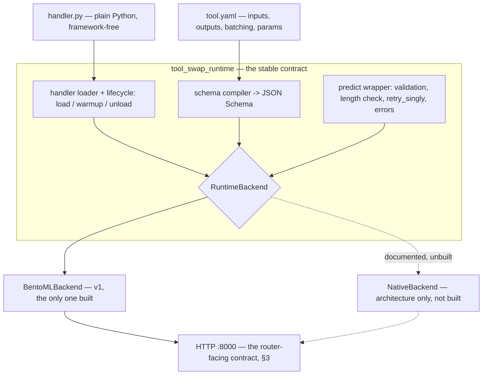
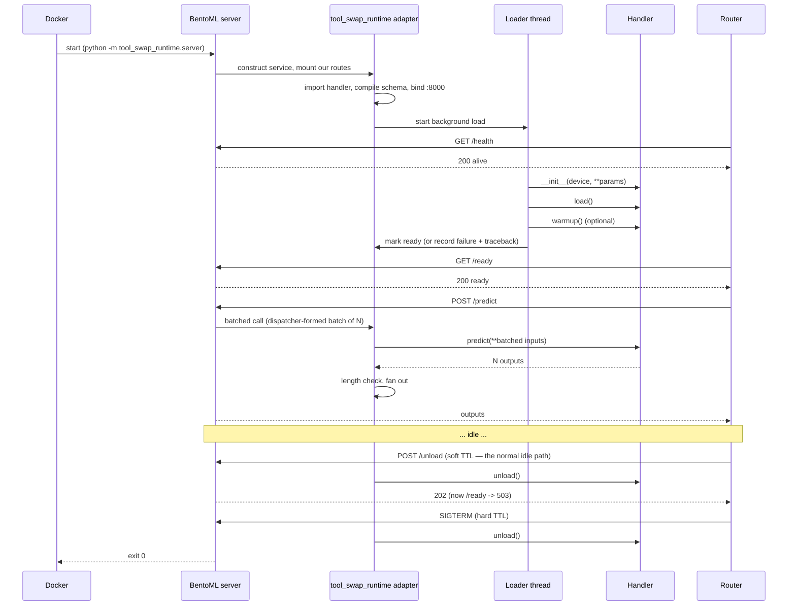

# 05 — The Model Runtime and Micro-Batching

> Decision **D5**: micro-batching is in scope and valuable; take vLLM's continuous-batching behaviour as the model to imitate.
> Decision **D12**: reuse existing self-hostable software where we can.
> Decision **D14** (new, this document): **the in-container runtime is built on BentoML.** Batching is the cumbersome part, BentoML already does it well, and R8 has already run it in production. See §1.

> **This document is load-bearing.** Since every tool is one we build ([`04_API_CONTRACT.md`](04_API_CONTRACT.md) §0), there is no third-party server in the zoo with a better batcher to defer to. Batching quality for the entire zoo is decided here.
>
> This document specifies `tool_swap_runtime` — the small package that lives **inside** a managed model container and turns a `handler.py` into a batching HTTP server. **`tool_swap_runtime` is the contract; BentoML is the engine underneath it.** The distinction is the whole point of §2.

---

## 1. Build vs. reuse — **resolved: reuse BentoML**

**This was the highest-leverage open decision in the plan. It is now closed (**D14**, [`13_OPEN_QUESTIONS.md`](13_OPEN_QUESTIONS.md) Part A).**

| Option | Pros | Cons |
|---|---|---|
| **A. Write our own** (FastAPI + a port of R8's `CoreBatcher`) | Zero extra deps in the model image; we control the exact endpoint contract; trivially testable with an injected clock | **We own a batcher.** Correct micro-batching is the cumbersome, subtle part — async futures, cancellation, fan-out, ordering, back-pressure — and a bug in it can return one patient's result for another. Multi-worker/GPU-affinity is also on us |
| **B. Reuse BentoML** (what R8 did) — **CHOSEN** | Adaptive batching for free (`batchable=True`, `max_batch_size`, `max_latency_ms`) with an adaptive dispatcher that tunes the wait window from observed latency — better than the fixed policy we would have written; `/healthz` `/readyz` `/livez` and Prometheus metrics already there; multi-worker supported; **battle-tested, and already proven in this codebase** | A real dependency inside every model image, pinning pydantic/starlette/click; its service idioms must be kept out of the authoring path (our job, §2); we do not need bento building/yatai and must ignore them |
| **C. Reuse Ray Serve** | `@serve.batch` is excellent | Ray inside every image is far heavier than BentoML; overkill for one model per container. **Refused on cost, not on principle** — see [`15_RAY_SERVE_EVALUATION.md`](15_RAY_SERVE_EVALUATION.md) §3 (Role B) and [ADR-0003](adr/0003-ray-serve-not-adopted.md). A `ray` backend behind the §2 seam remains addable if a real tool ever needs it, which is this seam earning its keep a second time. One open question, recorded rather than assumed: whether `@serve.batch` adapts its wait window from observed latency the way BentoML's dispatcher does ([`15_RAY_SERVE_EVALUATION.md`](15_RAY_SERVE_EVALUATION.md) §9 item 5) |
| **D. LitServe** (Lightning) | Lightweight, batching + streaming, minimal API | Smaller community; no in-house experience; BentoML's dispatcher is more capable |

**Decision: B — BentoML, pinned, wrapped behind our own contract.**

Reasoning, stated plainly:

1. **Batching is the cumbersome part, and it is the part with a mature answer.** Everything else in the runtime (import a handler, load in the background, answer readiness truthfully, expose a schema) is easy code we would write either way. Writing our own batcher buys control over the one component where control is worth least and correctness risk is highest.
2. **The dependency-conflict fear is speculative; treat it as such.** BentoML's locked pins (pydantic, starlette, click, and their transitive set) are assumed **not** to be a problem until a specific model proves otherwise. We do not pay a permanent architectural cost — writing and maintaining an inference server — to pre-empt a conflict nobody has yet hit. §1.2 defines how we would find out, and §2 defines what we do if we ever do.
3. **The reuse principle (D12) applies here too.** It would be possible to argue that D12 stops at the image boundary, on the grounds that a heavyweight framework in every image partially undoes D2 — but that carve-out exists only to justify writing a batcher. With the batcher reused, the principle is honoured uniformly.

**What this does *not* change:** the author still writes a plain `handler.py` with `load()` / `predict()` / `unload()` and never imports BentoML, and the router still talks to a fixed logical contract. Those are protected by §2, and they are the reason this decision is reversible.

### 1.1 The dependency stance, written down

The stance is deliberate, so it can be checked rather than argued about later:

> **A locked dependency is acceptable until a concrete model demonstrates an unresolvable conflict.** "BentoML pins pydantic" is not a conflict; "`tool X` requires pydantic <2 and therefore cannot install alongside BentoML" is. Only the second justifies action.

Consequences:

- The `tool_swap_runtime` dependency budget is now **BentoML plus its transitive set, and nothing further of our own choosing.** A fifth *direct* dependency added by us still needs written justification; BentoML's own tree is accepted wholesale.
- The base images ([`03_TOOL_AUTHORING.md`](03_TOOL_AUTHORING.md) §6) ship BentoML pre-installed, which makes tool builds *faster*, not slower — a genuine benefit that a "no framework in the image" position would have given up.
- **BentoML's version is pinned** in the runtime distribution (`bentoml==X.Y.Z`), and upgrading it is a deliberate, tested change, not a float. An unpinned framework in every image is the version of this decision that would actually hurt.

### 1.2 How we would find out we were wrong

Evidence, not vibes. Three cheap mechanisms:

| Mechanism | What it catches | Where |
|---|---|---|
| **Pre-M4 dependency spike** — resolve BentoML + `torch/monai/transformers`, and BentoML + `tensorflow/tf-keras`, in one image each | The realistic worst cases, *before* the runtime is built on it | [`09_IMPLEMENTATION_PLAN.md`](09_IMPLEMENTATION_PLAN.md) M3.5 |
| **Per-template resolution gate in CI** — `pip install --dry-run` (or `uv pip compile`) every template and every example model | A BentoML upgrade silently breaking a model stack | [`10_TESTING_STRATEGY.md`](10_TESTING_STRATEGY.md) |
| **`tswap doctor`** reports resolved versions of the pinned set inside each built image | Drift between what we tested and what a user's image actually has | [`07_CLI_AND_OPS.md`](07_CLI_AND_OPS.md) |

**The trigger that reopens this decision:** a model that cannot install BentoML, or a BentoML release that breaks the dispatcher contract we depend on. If that happens, §2 is the exit, and it is a *per-model* exit before it is ever a project-wide one.

---

## 2. The escape hatch: `RuntimeBackend` is a seam, not a second implementation

**We are choosing BentoML without being locked into it.** The mechanism is a single internal boundary, specified now and implemented once.

> **Scope statement:** v1 ships **exactly one** backend, `bentoml`. The `native` backend is **architecture only** — a documented interface and a written plan, with **no code in v1**. The point is that writing it later is a bounded, well-understood job, not a rewrite. Do not build it speculatively; building two backends to hedge a risk nobody has hit would cost more than the risk.



### 2.1 What lives above the seam (ours, backend-independent)

Everything that defines the *product* must sit above the seam, or the seam is worthless:

- The handler protocol (`load` / `predict` / `unload` / optional `warmup`) and the `@tool` decorator.
- Handler import from `TSWAP_HANDLER`, and device binding.
- Schema compilation from the declaration to JSON Schema (**D13**).
- The predict wrapper: input validation, **the batch-length safety check** (§4.4), `retry_singly` isolation, and the structured error envelope.
- Truthful readiness — "weights loaded", not "server started" (§3.2).
- The env-var contract (§7) and the effective-configuration log line.

### 2.2 What lives below the seam (backend-specific)

Only three things, which is what makes the seam credible:

1. **Serving the HTTP contract of §3** on port 8000.
2. **Grouping concurrent calls into batches** and handing our wrapper a list of N inputs, then fanning N results back to the right callers.
3. **Worker processes** and their device assignment.

### 2.3 The interface to write down (and honour)

```python
class RuntimeBackend(Protocol):
    """Serves the tool_swap runtime HTTP contract for one loaded handler."""

    def serve(
        self,
        lifecycle: HandlerLifecycle,   # load/ready/unload, ours
        batch_fn: BatchFn,             # (list[Inputs]) -> list[Outputs], ours
        schema: ToolSchema,            # compiled JSON Schema, ours
        settings: RuntimeSettings,     # parsed env contract, ours
    ) -> None:
        """Bind the port and serve until SIGTERM. Blocks."""
```

`batch_fn` is the load-bearing detail: **our wrapper receives an already-formed batch and returns results positionally.** The backend decides *when* to form a batch; it never touches validation, error shaping, or the length check. A `NativeBackend` would therefore need to supply only a queue, a flush policy and a server loop — which is precisely the ported [`CoreBatcher`](12_REFERENCE_CODE.md) §7, retained in the plan for exactly this purpose.

### 2.4 Rules that keep the seam real

Seams rot when nothing tests them. Four rules:

1. **No BentoML import outside `tool_swap_runtime/backends/bentoml_backend.py`.** Enforce with the import-linter rule already in CI ([`08_REPO_LAYOUT.md`](08_REPO_LAYOUT.md) §5).
2. **No BentoML type in any signature above the seam** — not in the handler protocol, not in the schema compiler, not in error types.
3. **A backend-agnostic contract test suite** ([`10_TESTING_STRATEGY.md`](10_TESTING_STRATEGY.md)) written against the HTTP contract of §3, parameterised over backends. In v1 it runs once, against `bentoml`. It is the acceptance test a future `native` backend must pass, written years in advance and kept honest by running continuously.
4. **`runtime.server: bentoml` exists in the config schema from day one**, validated, with `native` as a declared-but-unimplemented value that fails with *"not implemented in this version"* rather than *"unknown key"*. A config key added later is a migration; a config key reserved now is free.

**The deeper hedge is unchanged and matters more than the seam:** a model image is an OCI image serving HTTP ([`14_ALTERNATIVES_EVALUATION.md`](14_ALTERNATIVES_EVALUATION.md) §5). Whatever serves inside it, the model remains portable. **The models are the durable asset.**

---

## 3. Runtime HTTP contract

This is the contract the router relies on. Keep it minimal and stable — it is a versioned interface, and it is defined **independently of BentoML** so §2 stays possible.

### 3.1 Endpoints

| Endpoint | Returns | Provided by |
|---|---|---|
| `GET /health` | `200 {"status":"alive"}` | BentoML's `/livez`, re-exposed at our path. Process is up. Must answer **before** weights load and must never block. |
| `GET /ready` | `200 {"ready":true}` / `503 {"ready":false,"reason":"loading","detail":...}` | **Ours** (§3.2) — BentoML's `/readyz` is not sufficient. |
| `GET /schema` | JSON Schema (draft 2020-12) for inputs and outputs, plus batching config and static params | Ours, mounted ASGI route. |
| `POST /predict` | `{"outputs": ..., "meta": {...}}` | The batched BentoML API (§4). |
| `POST /predict/batch` | Parallel outputs with per-item status | Same endpoint path family; explicit batch submission. |
| `POST /unload` | `202` | Ours. **v1** — the default reclamation mechanism on the shared node ([ADR-0002](adr/0002-shared-node-soft-unload.md)). Releases weights; the process stays alive and `/ready` then answers 503 until the next `load()`. |
| `GET /metrics` | Prometheus text | BentoML built-in, plus our custom metrics (§9). |
| `GET /info` | Runtime version, **backend name and version**, handler name, device, pid, loaded-at | Ours. |

**Implementation note:** BentoML serves an ASGI app and supports mounting additional ASGI routes, so `/health`, `/ready`, `/schema`, `/info` and `/unload` are our own handlers mounted alongside its generated API. We do **not** ask the router to speak `/healthz` / `/readyz`; the router speaks our contract, and the adapter does the translation. That indirection is cheap and is what §2.2 is buying.

### 3.2 Readiness must mean "weights loaded"

BentoML's `/readyz` reports that the *server* is up — which, for a model taking four minutes to load, is a lie in the only direction that matters. R8's `wait_while_warming_up()` polled exactly that endpoint and therefore proved almost nothing ([`12_REFERENCE_CODE.md`](12_REFERENCE_CODE.md) §4). R8 then bolted a custom `readyz` API onto its service to compensate — the right instinct, and we make it a first-class part of the contract rather than an afterthought.

Our `/ready` returns 200 only when:

1. `load()` has returned successfully, **and**
2. `warmup()` (if declared) has completed.

and returns 503 **with the reason and, on failure, the exception message** otherwise. `STARTING` vs `LOADING` in the router's state machine ([`01_ARCHITECTURE.md`](01_ARCHITECTURE.md) §4) depends entirely on this distinction being honest.

---

## 4. Batching

### 4.1 The engine: BentoML's adaptive dispatcher

The batched endpoint is declared once, by our adapter, from the model's declaration:

```python
@bentoml.api(
    batchable=True,
    batch_dim=0,
    max_batch_size=settings.max_batch_size,
    max_latency_ms=settings.max_latency_ms,
)
def predict(self, batch: list[Inputs]) -> list[Outputs]:
    return self._wrapper.run_batch(batch)   # ours, above the seam
```

We inherit BentoML's dispatcher, which is **better than the policy we planned to write**: rather than a fixed "flush at size N or after W ms", it estimates the request-arrival rate and the model's own latency curve and adapts the wait window to keep p99 under `max_latency_ms`. R8's `CoreBatcher` implemented the fixed policy (flush on `max_batch_size` **or** oldest-item age ≥ `max_wait_ms`); that policy remains the specification for a future `native` backend and the mental model for tuning, but it is no longer what runs.

Config maps as: `batching.max_batch_size` → `max_batch_size`, `batching.max_wait_ms` → `max_latency_ms`, `batching.enabled: false` → `batchable=False`.

### 4.2 What the dispatcher does not give us, and what we do about it

Honest accounting of the five improvements a batcher of our own would have been built with:

| Planned improvement | Status under BentoML | Resolution |
|---|---|---|
| **1. Group by compatibility key** (never batch requests whose non-batchable args differ) | **Not supported.** The dispatcher batches whatever arrives. | **Made impossible by construction**, not handled at runtime — see §4.3. This is the most important consequence of the decision. |
| **2. Cap by payload size** (`max_batch_bytes`) | Not supported | Dropped from v1. Mitigate with a conservative per-model `max_batch_size` (a 64-CT-volume batch is a configuration error, and the config is per model). `max_batch_bytes` is recorded as a `native`-backend feature and a phase-2 request upstream. |
| **3. Preserve order and identity** | **Provided** — the dispatcher fans results back positionally | Ours to verify: §4.4's length check plus the contract test for interleaved arrivals. |
| **4. Per-item failure isolation (`retry_singly`)** | Not supported | **Ours**, in the predict wrapper above the seam: catch a batch-wide exception, re-run items individually, attribute the failure. Default on. Unaffected by the backend choice. |
| **5. Injectable clock for unit tests** | **Impossible** — the dispatcher owns its own timing and adapts it | Batching tests move from L1 (`ManualClock`, milliseconds) to L2 (in-process server, real time, statistical assertions). A real cost, and the main testing consequence of this decision ([`10_TESTING_STRATEGY.md`](10_TESTING_STRATEGY.md)). Assert *observable* properties — "N concurrent calls produced fewer than N handler invocations", "every caller got its own correct result" — never exact timings. |

### 4.3 The homogeneity rule — batched tools take only batchable inputs

Because the dispatcher cannot separate requests by their non-batchable arguments, a tool with `batching.enabled: true` **may declare only batchable inputs.** A per-request non-batchable input on a batched tool is a **hard error in `tswap validate`**, with a message naming the offending input and the two ways out.

Why an authoring-time ban rather than a runtime workaround: the failure it prevents is silent. Two requests with `threshold=0.5` and `threshold=0.9` would be batched and one answered with the other's parameter — no exception, no log line, a plausible-looking wrong number returned to a clinician. Making that state unrepresentable is worth a restriction on the authoring surface.

**The escape hatch: static parameters.** Values like `threshold` are usually *per-deployment*, not per-request. So the authoring surface gains a third input class:

```yaml
# tool.yaml
params:                                    # fixed at load time, not per request
  - { name: threshold, type: number, default: 0.5,
      description: Confidence threshold applied to detections. }
inputs:                                    # per request, and all batchable
  - { name: paths, type: string, batchable: true, required: true,
      description: Path to the DICOM series. }
```

Static params are passed to `load()` (not `predict()`), are overridable per config entry, and are part of the tool's identity. A genuine need for two thresholds becomes two config entries over the same image — which the scheduler, TTL and status surfaces already handle, at the cost of two resident models.

**If a tool truly needs per-request non-batchable inputs**, it has two options, both acceptable and both explicit:

1. `batching.enabled: false` — the common answer, and free for CPU tools and single-request workloads.
2. The `native` backend — **the first real use case for §2**, and the honest reason that seam earns its keep beyond dependency risk.

### 4.4 The batch-length check is safety-critical and stays ours

```python
# tool.yaml declares paths batchable; threshold is a static param
def predict(self, paths: list[str]) -> list[dict]:
    # paths: N items;  self.threshold: fixed at load
    # MUST return exactly N results, in the same order
```

Rules:

- Batchable inputs arrive as lists; static params are attributes bound at load.
- The handler **must** return a list of length N in order. The wrapper validates the length and fails loudly on mismatch. A silent misalignment returns one patient's result for another — in a healthcare context, the worst possible bug. **This check runs above the seam and is independent of the batching engine**, which is exactly why it lives there.
- `batching.enabled: false` → the wrapper still calls with lists of length 1, so authors write one code path, unless the handler declares `scalar_inputs: true`.

R8 expressed batchability as `Batchable[T] = Union[T, List[T]]`, which forces annotation introspection. Declaring `batchable: true` in `tool.yaml` is explicit and readable by the router without importing anything, and remains the direction chosen.

---

## 5. Concurrency inside the container

The trap is unchanged by the backend choice: **a GPU inference call must not block the event loop**, or `/health` and `/ready` stop answering and the router declares a busy model dead.

1. Handlers are **synchronous** by default and run in a thread executor. BentoML runs sync API methods off the loop already; do not defeat it by declaring the handler `async`.
2. Exactly **one** inference at a time per worker. Serialise with a lock; use batching for throughput, not concurrency.
3. `/health` and `/ready` are served from mounted routes that **never touch the handler lock** — they must answer during a five-second inference. Contract-tested.
4. `workers > 1` → multiple BentoML workers, each with its own handler and device. **Pass an explicit device list and index into it.** R8 derived `gpu_id = max(0, worker_index - 1)` from BentoML's 1-based `worker_index` ([`12_REFERENCE_CODE.md`](12_REFERENCE_CODE.md) §5) — fragile and off-by-one-prone. Read `worker_index` once, map through `TSWAP_DEVICE_LIST`, **log the resulting mapping at startup**, and fail loudly if the list is shorter than the worker count.
5. Multiple workers multiply VRAM by the worker count. Document loudly; the scheduler does not know (**D7**).
6. Support `async def predict` for genuinely I/O-bound handlers, detected by inspection.

---

## 6. Lifecycle inside the container



Bind-then-load is kept from R8's BentoML service, which started warm-up on a background thread precisely so the HTTP server could bind at once. **But R8's `_warmup_background` swallowed the exception**, leaving a service that was alive, never ready, and silent about why — the worst debugging experience in that setup, compounded by an unbounded readiness poll on the caller's side.

Failure handling:

- `load()` raises → record error and traceback, keep `/ready` at 503 **with the reason in the body**, log the traceback, and exit non-zero after a short grace period so Docker records the failure.
- `predict()` raises → structured error for that item (or batch, with `retry_singly` isolation), log the traceback, stay ready. A bad input must not kill the server.
- OOM during predict → return the error and optionally `torch.cuda.empty_cache()`. On a configurable consecutive-OOM threshold, exit so the router restarts clean.

---

## 7. Environment contract (router → container)

The router configures the container purely through environment variables and mounts — explicit, greppable, no shared code. **The adapter translates these into BentoML configuration**; the router never sets a BentoML variable directly, so the mapping can change without touching the router.

| Variable | Meaning |
|---|---|
| `TSWAP_HANDLER` | `handler.py:ClassName` |
| `TSWAP_MODEL_NAME` | For logs/metrics labels |
| `TSWAP_PORT` | Listen port (default 8000) |
| `TSWAP_DEVICE` | `cpu` or `cuda` (indices already remapped by Docker) |
| `TSWAP_DEVICE_LIST` | e.g. `0,1` as seen inside the container, for multi-worker mapping |
| `TSWAP_MAX_BATCH_SIZE` | → `max_batch_size` |
| `TSWAP_MAX_WAIT_MS` | → `max_latency_ms` |
| `TSWAP_WORKERS` | → BentoML workers |
| `TSWAP_PARAMS` | JSON object of static params (§4.3), passed to `load()` |
| `TSWAP_LOG_LEVEL` / `TSWAP_LOG_JSON` | Runtime logging |
| `TSWAP_RETRY_SINGLY` | Per-item failure isolation |
| `TSWAP_BACKEND` | `bentoml` (v1). Reserved; `native` fails with "not implemented". |

Not available: `TSWAP_MAX_BATCH_BYTES` (§4.2 — the dispatcher has no equivalent).

R8 used the same env-var approach (`RUN_SVC_MAX_BATCH_SIZE` et al.) and **printed the resolved knobs at boot** — exactly right for answering "why is it not batching?". The runtime must **log its full effective configuration at startup**, including the backend name, the BentoML version and the worker→device mapping.

---

## 8. Logging from inside the container

- Write to **stdout/stderr only**; the router's collector persists them ([`07_CLI_AND_OPS.md`](07_CLI_AND_OPS.md)).
- Structured JSON lines when `TSWAP_LOG_JSON=true`, with `model`, `request_id`, `batch_size`, `duration_ms`.
- Propagate the router's `X-Request-Id` into the log context so one id traces client → router → container.
- `PYTHONUNBUFFERED=1` in the base image, or logs vanish on crash — precisely when they are needed.
- **Bring BentoML's own logger into our format** rather than letting it emit a parallel log stream; its access logs are useful, but two formats in one stream defeats the collector.

R8 pumped subprocess stdout/stderr through reader threads and printed them **only when `verbose` was set**, discarding them otherwise. Always persist; let the user filter.

---

## 9. Metrics

BentoML ships Prometheus metrics (request counts, latency histograms, and **batch-size and dispatcher metrics**) — a further concrete gain from the decision, since batch-size observability is exactly what tells us whether batching is working.

Serve them at `/metrics`, relabelled into our namespace where they overlap, plus our additions:

| Metric | Type | Source |
|---|---|---|
| `tswap_requests_total` | counter | BentoML |
| `tswap_request_duration_seconds` | histogram | BentoML |
| `tswap_batch_size` | histogram | BentoML dispatcher |
| `tswap_queue_wait_seconds` | histogram | BentoML dispatcher |
| `tswap_tool_loaded` | gauge (0/1) | Ours |
| `tswap_load_duration_seconds` | histogram | Ours |
| `tswap_batch_item_failures_total` | counter | Ours (`retry_singly`) |

Router-side additions: `tswap_tool_state`, `tswap_cold_starts_total`, `tswap_evictions_total`, `tswap_tool_resident_seconds`. Together these answer the questions that justify the project: how often do we swap, what a cold start costs, and whether batching is actually happening.

---

## 10. Versioning the runtime contract

The runtime is baked into images; the router is upgraded independently. They **will** be out of step in production.

- `/info` reports `runtime_version`, `contract_version`, **`backend`** and **`backend_version`**. The last two are what make a "works on my image" report diagnosable.
- The router logs a warning on an unknown contract version and degrades to the minimal contract (`/health`, `/ready`, `/predict`).
- Never remove or repurpose an endpoint within a contract major version. **This applies to our paths, not BentoML's** — its route names are an implementation detail behind §2, and nothing outside the adapter may depend on them.
- A BentoML major upgrade bumps `runtime_version` and requires the contract suite (§2.4 rule 3) to pass before release.
- `tswap doctor` reports which images were built with which runtime and BentoML versions and flags stale ones. Without it, "rebuild all your models" becomes a mystery-debugging session.
