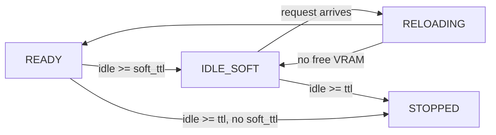

# 06 — Lifecycle, TTL and Scheduling

> **⚠ This document has not yet been rewritten for [ADR-0004](adr/0004-hard-stop-only-in-v1.md), and §3, §5.1, §5.1.1, §5.2, §7 and §8.1b–8.1c currently describe a design we are not building. The ADR is authoritative; where they disagree, follow the ADR.** A rewrite is pending.
>
> **Decision D9, as amended by [ADR-0004](adr/0004-hard-stop-only-in-v1.md): v1 has one idle timer and reclaims by stopping the container.** There is no soft unload, no `IDLE_SOFT` and no `POST /unload`. [ADR-0002](adr/0002-shared-node-soft-unload.md) had promoted soft unload into v1; the requester clarified that a timer suffices — *"we just don't want to block all the resources indefinitely"*.
> **Decision D7**, as amended by [ADR-0002](adr/0002-shared-node-soft-unload.md) §6 (**retained**): pinned devices and groups remain the scheduling primitive. Free VRAM may be **measured** before a start; a model's consumption is still never **predicted**.
>
> This is the heart of the product. Everything else is plumbing around it.

---

## 0. The deployment that shapes this document

**tool-swap runs on a shared DGX node.** Other tenants, whom we do not control and cannot see, use the same GPUs. Two consequences run through everything below:

1. **We must not hold resources indefinitely**, which is what the idle timer is for. Note the requirement is *bounded* holding, **not** prompt release — [ADR-0002](adr/0002-shared-node-soft-unload.md) inferred the latter and built a state machine on it, and [ADR-0004](adr/0004-hard-stop-only-in-v1.md) reversed that.
2. **Memory we release may be taken by someone else.** A cold start can therefore fail through nobody's fault, and that case must be distinguishable from a broken tool (**D28**).

**Preemption is a requirement.** A request for tool B must be able to displace an idle incumbent A *immediately*, rather than waiting out A's remaining TTL. This is the requirement that ruled out Kubernetes at the M−1 gate ([ADR-0001](adr/0001-build-our-own-router.md)), because Kubernetes allocates devices and leaves the second pod `Pending` rather than evicting an incumbent. **The mechanism is a container stop**, so the displaced tool pays a cold start on its next request — which makes `min_residency` and thrash detection (§5.3) more important, not less.

---

## 1. The problem in one paragraph

We have (say) 4 GPUs and 20 models, on a node we share with other tenants. Total VRAM demand far exceeds capacity, but at any instant only a few models are actually in use, and usage is bursty and unpredictable. We want each model to *appear* permanently available while only the working set actually occupies memory. This is caching, with GPUs as the cache and containers as the entries — which means the design questions are the classic ones: admission, eviction, and what to do on a miss. The shared node adds a fourth: what to do when the cache entry you were promised has been taken by somebody else.

---

## 2. Hard TTL

**Rule:** a model in `READY` or `IDLE_SOFT` with `inflight == 0` and `now - last_used >= ttl` is **stopped**.

- `last_used` updates on request **completion** (not arrival), so a long-running request cannot expire mid-flight.
- `inflight > 0` makes a model immune (§5).
- `ttl: 0` means never expire. `keep_warm: true` implies exemption from TTL.
- The watchdog runs on a tick (default 5 s) and processes expiries; it does not need to be precise, and TTL is documented as "at least `ttl` seconds of idleness", never an exact deadline.

Stopping frees everything: VRAM, host RAM, the group slot, the CPU. Cost: the next request pays a full cold start.

**Hard stop is the backstop, not the default path.** On the shared node it has two jobs: reclaiming host RAM and the container after a *longer* idle than `soft_ttl`, and serving as the forced fallback for handlers whose `unload()` cannot genuinely release VRAM (§3.4). Build it first because everything else depends on it and because it always works — the OS reclaims on process exit, whatever the handler believes.

### Choosing TTL values

The trade-off is entirely about the cost of a cold start versus the cost of holding resources.

| Model profile | Cold start | Suggested TTL |
|---|---|---|
| Small CPU model (text cleanup) | < 2 s | `keep_warm: true` — never stop it, it costs nothing |
| Medium GPU encoder (RAD-DINO, ~1 GB) | 10–30 s | 300–900 s |
| Large 3D model (CT segmenter, TotalSegmentator-class) | 60–180 s | 1800–3600 s, or `keep_warm` if it is the primary workload |
| Rarely used specialist (a segmenter run twice a week) | 60 s | 120 s — reclaim aggressively |

Rule of thumb worth documenting: **TTL ≈ 20–50× the cold start**, then adjust from the observed `cold_starts` and `avg_cold_start_s` in `/status`. If a model's cold starts are climbing, its TTL is too short for its actual traffic pattern.

---

## 3. Soft TTL — the default reclamation mechanism (v1)

**Rule:** a model idle for `soft_ttl` (where `soft_ttl < ttl`) receives `POST /unload`; the handler releases weights but the container stays alive.



| | Frees | Recovery cost | Group slot |
|---|---|---|---|
| Soft | **VRAM** (and most host RAM the weights held) | Only `load()` — no container start, no Python import, no CUDA context init | Still held |
| Hard | Everything | Container start + import + CUDA init + `load()` | Released |

Soft unload is worthwhile because on a real system the *fixed* costs are surprisingly large: importing torch, initialising a CUDA context and JIT-warming kernels can easily be 10–20 s before a single weight is read. Soft TTL keeps all of that and pays only for weight loading.

### 3.1 Why this is v1 and not phase 2

**D9** originally deferred soft TTL, and its decisive reason was that an `IDLE_SOFT` model still holds its group slot and therefore *"does not help the contended-GPU case at all"*. That reasoning assumed **we own the whole box**, where the slot and the VRAM are the same scarce thing.

On a shared DGX they come apart (§0). The contended resource is node VRAM; a group slot is a row in a table we invented. Releasing VRAM while holding a slot is therefore *exactly* the trade we want, and the objection dissolves. [ADR-0002](adr/0002-shared-node-soft-unload.md) records the reversal in full.

The third original objection stands and is now simply paid for: the scheduler must distinguish **resident in the group** from **resident in VRAM** (§5.1).

### 3.2 Soft displacement is how preemption stays cheap

Since preemption is required (§0), the question is what it costs. Soft unload is the answer: displacing an incumbent becomes a `POST /unload` rather than a container stop, so the *next* start of that model skips the entire fixed cost above.

Two consequences for the design:

- **The scheduler prefers soft-unloading an incumbent over stopping it** (§5.1).
- **Being wrong about an eviction costs an order of magnitude less.** This materially defuses the thrashing scenario in §5.3 — `min_residency` still exists, but it now guards against a much cheaper mistake.

### 3.3 Reload under contention — a failure that is nobody's fault

**This is the "memory management" the shared node forces on us, and it is a new first-class failure mode.**

While a model sits in `IDLE_SOFT`, another tenant may take the VRAM. The reload then fails with an out-of-memory error that no retry will immediately fix and that no change to our tool would have prevented.

The trap to avoid: treating this as a tool failure. Every other failure path leads to `FAILED`, which means *"this tool is broken"* — and a tool marked broken because a neighbour was using the GPU is both wrong and actively misleading during an incident.

Required behaviour:

| Aspect | Rule |
|---|---|
| Resulting state | Return to **`IDLE_SOFT`**, never `FAILED`. The tool is intact; it could not get memory. |
| Failure budget | **Excluded from `max_consecutive_failures`** (§8.5). A neighbour's usage must never permanently disable our tool. |
| Caller response | **503 with `Retry-After`** and a reason meaning *the GPU is full*, never one implying the tool is broken. Guardrail 6 (honest status codes), applied to a case the first draft did not anticipate. |
| Logging | **Logged distinctly.** A rising rate of these describes the *node*, not our tools, and it is the number an operator needs when negotiating for capacity. |

**Fail fast where possible.** The router may read live free VRAM immediately before attempting a reload, and return the above rather than starting a load it can predict will OOM. This is *measurement*, explicitly permitted by [ADR-0002](adr/0002-shared-node-soft-unload.md) §6 — as distinct from *predicting* how much a model will consume, which **D7** rejects and which remains rejected. The line: **"is there memory right now" is a fact; "will this model fit" is a guess.** We take the first and still refuse the second, and neither ever becomes an input to `request_slot` (§9).

### 3.4 Handlers that cannot release

Soft unload depends on handler cooperation, and handlers are user-authored (**D6**). A handler whose `unload()` silently fails to release is the worst case available: we believe the VRAM is free, we tell the scheduler so, and we hold it anyway — degrading the whole shared node, other tenants included, with no error raised anywhere.

This is why `unload()` verification becomes a **hard `FAIL`** in preflight stage 8 for GPU tools ([`03_TOOL_AUTHORING.md`](03_TOOL_AUTHORING.md) §10.1), measured with `nvidia-smi` before and after.

**A tool that cannot release is not rejected.** It is classified **hard-stop-only**: the scheduler never soft-unloads it, and it is reclaimed exclusively by hard TTL and eviction. TensorFlow/Keras tools are the expected members of this class — R8's own code carries the confession that clearing a Keras session is *"process-wide, not scoped to this model alone"*. The tool still deploys; it loses the fast path, and its author is told exactly why (**D17**'s severity principle: a gate that refuses everything imperfect gets bypassed, and a bypassed gate protects nobody).

### 3.5 Build order

Hard TTL is still implemented **first** in TDD order (M6), because everything else depends on stop working correctly and because it is the mechanism that always works. Soft unload builds on it; it does not replace it.

---

## 4. Groups: the scheduling primitive

A **group** caps how many of its members may be resident simultaneously.

```yaml
groups:
  gpu0: { max_resident: 1, devices: [0], eviction: lru }   # strict swapping on GPU 0
  gpu1: { max_resident: 2, devices: [1] }                  # two small models share GPU 1
  llm:  { max_resident: 1, devices: [2,3], eviction: none } # never evict; requests wait
  cpu:  { max_resident: 8 }                                 # CPU models, generous
```

Why groups rather than modelling VRAM directly (**D7**):

- **Simple to reason about.** "One model on GPU 0 at a time" is a sentence anyone understands; "sum of estimated VRAM ≤ 22 GB with fragmentation headroom" is not.
- **Honest.** We cannot reliably predict a model's VRAM: it depends on batch size, sequence length, activation memory and allocator behaviour. A number in a config file would be a comforting fiction.
- **Sufficient.** Most real deployments are "these three big models take turns on this GPU".
- **Extensible.** `vram_gb` is already in the schema as advisory; a future scheduler can use it *in addition* to groups without any config break.

**What groups cannot do, stated plainly:** they cap **our own** residency and are blind to other tenants on the shared node. `max_resident: 1` guarantees we run one model on that GPU; it guarantees nothing about how much VRAM is actually free, because a neighbour may be using most of it. That gap is handled at reload time (§3.3), not by making groups cleverer — the alternative is predicting VRAM, which **D7** rejects and [ADR-0002](adr/0002-shared-node-soft-unload.md) §6 continues to reject.

Semantics:
- Every model belongs to exactly one group (`default` if unspecified).
- `max_resident` counts models in `STARTING`, `LOADING`, `READY` and `IDLE_SOFT` — i.e. anything holding or about to hold resources. Not `STOPPED` or `FAILED`.
- A group may declare `devices`, which members inherit unless they override.
- Groups are independent: a full `gpu0` never blocks `gpu1`.
- Multiple groups *may* be configured onto the same physical device. That is the user's choice and their responsibility; we warn at validation but do not forbid it (someone will legitimately want two 3 GB models on a 24 GB card).

---

## 5. Admission and eviction

### 5.1 The algorithm (pure, synchronous, unit-testable)

```
request_slot(model) -> Decision:
    group = groups[model.group]
    resident = [m for m in group.members if m.state in HOLDING_STATES]

    if model in resident:                       return Decision.ALREADY_RESIDENT
    if len(resident) < group.max_resident:      return Decision.GRANT(device=assign_device(model, group))

    # group is full: consider displacing an incumbent
    if group.eviction == "none":                return Decision.WAIT
    candidates = [m for m in resident
                  if m.inflight == 0
                  and not m.keep_warm
                  and m.state in EVICTABLE_STATES]
    if not candidates:                          return Decision.WAIT
    victim = rank(candidates, group.eviction)[0]

    # prefer the cheap displacement: release VRAM, keep the container
    if victim.can_soft_unload and victim.state == READY:
        return Decision.SOFT_UNLOAD_THEN_GRANT(victim)
    return Decision.EVICT_THEN_GRANT(victim)
```

`Decision` is one of `ALREADY_RESIDENT | GRANT(device) | SOFT_UNLOAD_THEN_GRANT(victim) | EVICT_THEN_GRANT(victim) | WAIT`. Being a pure function of a state snapshot means the entire policy surface — the whole reason this project exists — is testable in milliseconds with no Docker, no GPU and no sleeping. Do not let this function acquire I/O.

**Two things this function must never do**, both consequences of the shared node:

- **Read `nvidia-smi`.** Free-VRAM measurement (§3.3) happens in the *caller* and enters the policy as a plain value on the snapshot, if at all. Guardrail 2 holds: the scheduler is pure.
- **Use `vram_gb` to decide anything.** It stays advisory. Measuring the present is permitted; predicting a model's consumption is not (**D7**, [ADR-0002](adr/0002-shared-node-soft-unload.md) §6).

`can_soft_unload` is false for tools classified hard-stop-only by preflight stage 8 (§3.4) and for tools with no `unload()` — a CPU tool holding no VRAM has nothing to release, so displacing it means stopping it.

### 5.1.1 Residency is now two questions, not one

`max_resident` counts group **slots**; the shared GPU holds **VRAM**. An `IDLE_SOFT` model holds the first and not the second. The snapshot must therefore carry both facts, and the scheduler must not conflate them — this is the complexity **D9** originally deferred and [ADR-0002](adr/0002-shared-node-soft-unload.md) accepts deliberately.

### 5.2 Eviction ranking

For `eviction: lru`, rank candidates by:

1. `IDLE_SOFT` before `READY` (cheapest to kill — nothing loaded, so no VRAM is even reclaimed by stopping it).
2. Then by `last_used` ascending (least recently used).
3. Tie-break on lower `vram_gb` if declared, else name (deterministic ordering matters for reproducible tests).

Note the interaction with §5.1: an `IDLE_SOFT` victim is *hard-stopped*, because there is nothing left to soft-unload. A `READY` victim is *soft-unloaded* where its handler permits. So the ranking picks the victim and the victim's state picks the mechanism.

Other policies: `lifo` (evict the most recently started — occasionally useful to protect a long-running warm model from a burst of one-off requests) and `none` (never evict; `WAIT` instead).

### 5.3 Fairness and the thundering-herd problem

The pathological case for any swapping system: two clients alternately requesting models A and B in a `max_resident: 1` group. Each request evicts the other's model, so both clients see nothing but cold starts and the GPU spends all its time loading weights and none doing inference. This will happen in production; plan for it.

Mitigations to implement:

1. **`min_residency` (default 30 s).** A model that just became `READY` cannot be evicted for at least this long. This is the single most effective guard: it forces the thrashing pair into alternating batches instead of alternating requests, converting a pathological pattern into a merely slow one. Requests for the other model wait, which is *strictly better* than both thrashing.
2. **Queue coalescing.** All pending requests for the same model share one start and are served in a burst once ready. Already required by [`01_ARCHITECTURE.md`](01_ARCHITECTURE.md) §5.1, and it is what makes `min_residency` effective.
3. **Thrash detection.** Track evictions per model per minute; if it exceeds a threshold, log a prominent warning naming the competing models and suggesting a config fix (raise `max_resident`, separate the groups, or add a GPU). Surface it in `/status` as a `warnings` array. Diagnosing this without help is genuinely hard, so the tool should say it out loud.
4. **Optional `swap_cooldown`** per group: a minimum interval between swaps in that group. Blunt but effective for a pathological workload.

### 5.4 Device assignment

v1 is deliberately simple:
- `devices` explicit on the model → use exactly those.
- Else inherit the group's `devices`.
- Else CPU.

No dynamic device selection, no packing, no VRAM accounting. Translation to Docker: pass the device list as device requests / `NVIDIA_VISIBLE_DEVICES` so the container sees them as `cuda:0..n-1`. **The handler therefore never does device arithmetic** — a deliberate simplification over R8, where tools carried `device`/`gpu_id` parameters and the BentoML service computed `gpu_id = max(0, worker_index - 1)`, an easy source of off-by-one bugs.

Documented growth path (do not build now): a `bin-packing` mode using `vram_gb` plus live `nvidia-smi` free memory, where a group declares total VRAM rather than a model count. Design the scheduler interface so this is a new `Policy` implementation, not a rewrite.

---

## 6. Cold starts

Cold start is the entire cost of this design, so it deserves first-class treatment.

### 6.1 The budget

```
container create+start   0.5–3 s     (image is local; add minutes if pulling)
python + import torch    3–10 s
CUDA context init        1–5 s
weight load from cache   2–60 s      (size and disk dependent)
weight DOWNLOAD          0–1800 s    (first run only — the killer)
warmup / JIT             0–10 s
```

### 6.2 Mitigations (implement all of these)

| Mitigation | Effect |
|---|---|
| **Shared weight cache mount** (mandatory default) | Removes the download from every start after the first. R8's compose already mounted `${HF_HOME}` into containers; do the same for every model by default. |
| **`tswap warm <model>` / `--all`** | Pre-pull weights and pre-build images outside the request path. Run it after deployment and in a cron. |
| **`keep_warm: true`** | For the hot path. The right answer for the one or two models that dominate traffic. |
| **`tswap preload` at boot** | Start `keep_warm` models during `tswap up` so the first user is not the one who waits. |
| **Bake weights into the image** (`post_install` download) | Fastest cold start, largest image. Offer it as a documented trade-off, not a default. |
| **Soft TTL** (v1, and the default) | Removes container start + import + CUDA init from the recovery path, leaving only `load()`. On the shared node this is the primary mechanism, not an optimisation (§3). |
| **Honest reporting** | `cold_start: true` and `queue_ms` in every response's `meta`, plus `avg_cold_start_s` in `/status`. Users tolerate a slow first request they were told about; they do not tolerate mysterious latency. |

### 6.3 Client-visible behaviour during a cold start

The request **blocks** until ready or `queue_timeout`. No 202-and-poll in v1 (it would force every client to implement a state machine). Requirements:

- Bounded by `queue_timeout`; on expiry return 503 with `Retry-After` and a message stating what it was waiting for (`"still LOADING, started 240s ago"`).
- Bounded by `max_queue_depth` → 429.
- Log at INFO on every cold start with the model, the trigger, and the eventual duration. These lines are what make TTL tuning possible.

---

## 7. The watchdog

One periodic task, tick default 5 s:

1. **TTL sweep** — expire `READY`/`IDLE_SOFT` models past their deadline (skipping `inflight > 0` and `keep_warm`).
2. **Soft sweep** — `READY` → `IDLE_SOFT` past `soft_ttl`, for models whose handler can release (§3.4). This is the tick that does most of the useful work on a shared node, since it is what returns VRAM to the neighbours.
3. **Liveness** — verify containers believed to be running still exist; mark vanished ones `FAILED` (a container can die from an OOM kill or a host restart without anyone noticing otherwise).
4. **Readiness re-check** — occasionally re-probe `/ready` for `READY` models to catch a model that silently unloaded itself.
5. **Retry** — retry `FAILED` models whose backoff has elapsed, but only if `keep_warm` (do not spontaneously resurrect on-demand models; wait for a request).
6. **Reconcile** — periodically list managed containers and adopt/stop orphans.

Requirements: the tick must never block (all I/O concurrent with timeouts), must never crash the router (catch and log per-model), and must be driven by the injectable `Clock` so tests advance time instantly. A watchdog that dies silently leaves models resident forever — a failure that is invisible until the GPUs are full, so log a heartbeat line at DEBUG and expose `last_tick_age_s` in `/status`.

---

## 8. Worked scenarios (these become the integration tests)

### 8.1 Simple swap

```
groups: gpu0 { max_resident: 1 }, models A and B both in gpu0

t=0    request A     -> A STOPPED, slot free       -> start A (cold 20s) -> serve
t=25   request B     -> group full, A idle 5s
                        min_residency 30s not met  -> WAIT
t=31   (retry)                                     -> evict A, start B -> serve
t=60   request A                                   -> evict B, start A -> serve
```

Assertions: exactly one model resident at any time; no request lost; `min_residency` respected; `TOOL_UNAVAILABLE` with `reason: evicted` is never returned to a client (the wait absorbed it).

### 8.1b Soft swap — preemption on the cheap path

```
groups: gpu0 { max_resident: 1 }, A and B both in gpu0, both can_soft_unload
A is READY and idle; B is IDLE_SOFT (container alive, weights released)

t=0    request B     -> group full, A idle and past min_residency
                     -> SOFT_UNLOAD_THEN_GRANT(A)
                     -> A releases VRAM, container stays alive
                     -> B reloads (load() only, no container start) -> serve
```

Assertions: **A's container is never stopped**; A's state is `IDLE_SOFT`, not `STOPPED`; B's recovery does **not** include container start or CUDA init; A's group slot accounting is unchanged; a subsequent request for A reloads without a cold start.

This is the scenario the shared-node design exists to produce — the one that turns preemption from a 20 s penalty into a weight load. It is also the test that fails loudly if someone "simplifies" `SOFT_UNLOAD_THEN_GRANT` back into `EVICT_THEN_GRANT`.

### 8.1c Hard-stop-only tool is never soft-unloaded

```
A has can_soft_unload = false (preflight stage 8 classified it hard-stop-only)
B requests the slot
```

Assertion: the decision is `EVICT_THEN_GRANT(A)`, never `SOFT_UNLOAD_THEN_GRANT`. A tool whose `unload()` cannot release must never be asked to, because believing it did is worse than not trying (§3.4).

### 8.2 TTL expiry

```
ttl=300, request at t=0 completes at t=2
t=302  watchdog stops the model
t=400  request        -> cold start
```

Assertion: stop happens once, in the tick after the deadline; `ttl_expires_in_s` in `/status` counts down correctly.

### 8.3 In-flight protection

```
long request on A (60s), ttl=10, B requests a slot at t=5
```

Assertion: A is **not** evicted while in-flight; B waits; A is stopped only after A's request completes and its TTL elapses. Verify the in-flight counter returns to zero even when the client disconnects mid-request (the `finally` must run).

### 8.4 Thundering herd

```
20 concurrent requests for a STOPPED model
```

Assertion: exactly **one** container start; all 20 served; `cold_start: true` on all of them (they all waited for the same start); queue depth peaks at 20 and drains.

### 8.5 Failure and backoff

```
model whose load() raises
```

Assertion: `FAILED` with the traceback available in logs and `last_error` in `/status`; three retries with backoff `[1,5,15]`; then no further automatic retries; `/run` returns 503 `TOOL_UNAVAILABLE` with `reason: failed` immediately (no pointless 600 s wait per request); `POST /admin/tools/{tool}/start` clears the state and the failure counter.

### 8.5b Reload under contention — the shared-node case

```
A is IDLE_SOFT. Another tenant takes the GPU's free VRAM.
t=0    request A     -> RELOADING -> load() raises OOM
```

Assertions, each of which is a distinct way this could be got wrong (§3.3):

- A returns to **`IDLE_SOFT`**, *not* `FAILED`;
- `consecutive_failures` is **unchanged** — a neighbour must never exhaust our failure budget;
- the caller gets **503** with a reason meaning *the GPU is full* and a `Retry-After`, never a message implying the tool is broken;
- the event is logged under its own reason, separable from handler failures when someone greps the logs during an incident;
- a later request, once the neighbour releases, reloads normally with no operator intervention.

The regression this prevents is subtle and expensive: a tool that quietly marks itself broken every time the node is busy, and stays broken until someone notices and restarts it.

### 8.6 Router restart

```
two models READY, router restarted
```

Assertion: containers survive; the router adopts them as `READY`; TTL bookkeeping restarts from `now` (documented: TTL is not preserved across a router restart); orphans (models removed from the config) are stopped per the `orphans` policy.

### 8.7 Group isolation

```
gpu0 full and thrashing; a request arrives for a model in gpu1
```

Assertion: the gpu1 model starts immediately, entirely unaffected. Trivial-sounding, but a shared global lock held during a start would break it — hence a dedicated test.

---

## 9. Testability requirements (non-negotiable)

The failure mode to avoid: TTL/eviction tests that `sleep(31)`, so the suite takes minutes and nobody runs it. The design already accommodates this — enforce it.

```python
@dataclass
class ModelRuntimeState:
    """Everything the scheduler is allowed to see. Plain data, no I/O."""
    name: str
    group: str
    state: ModelState
    last_used: float
    became_ready_at: float | None
    inflight: int
    queued: int
    keep_warm: bool
    ttl: float
    soft_ttl: float
    vram_gb: float | None          # advisory only; never an input to a decision
    can_soft_unload: bool          # false for hard-stop-only tools (§3.4)
    consecutive_failures: int      # reload-contention failures never increment this


def request_slot(snapshot: SchedulerSnapshot, model: str, now: float) -> Decision:
    """Pure. No I/O, no clock access, no logging side effects."""


def find_expired(snapshot: SchedulerSnapshot, now: float) -> list[Expiry]:
    """Pure. Returns the models whose hard or soft TTL has elapsed."""
```

With `ManualClock`, §8's scenarios are all sub-millisecond unit tests. Docker-backed integration tests then verify only that the *effects* happen (a container really starts, really stops, really frees VRAM) — a handful of slow tests behind `@pytest.mark.docker`, not the primary safety net.
