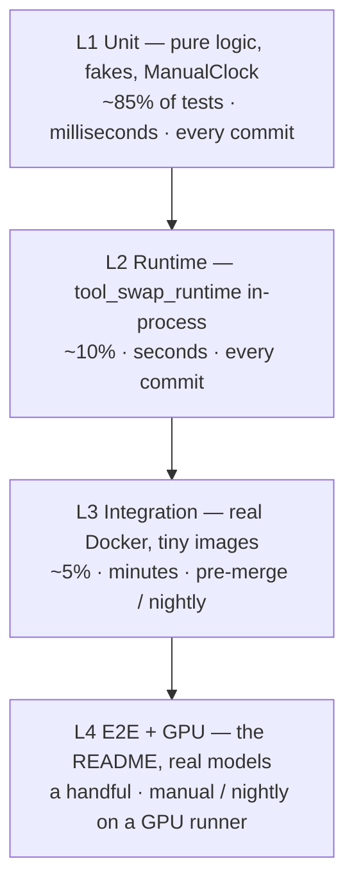

# 10 — Testing Strategy

> The single design constraint that makes this project testable: **the scheduler is pure and the clock is injectable.** Everything below follows from it.
>
> The failure mode to avoid: a suite whose TTL tests `sleep(31)` and whose swap tests need two GPUs, so it takes twenty minutes, is skipped locally, and rots.

---

## 1. The four layers



| Layer | Marker | Needs | Runs |
|---|---|---|---|
| L1 Unit | none | nothing | every commit, < 30 s total |
| L2 Runtime | none | nothing (ASGI test client) | every commit |
| L3 Integration | `@pytest.mark.docker` | Docker daemon | pre-merge and nightly |
| L4 E2E / GPU | `@pytest.mark.gpu`, `@pytest.mark.slow` | GPU host, real weights | manual / nightly |

**Hard rule: nothing essential may be verifiable only at L3/L4.** If a behaviour can only be tested with real Docker, the abstraction is wrong — push the logic into a pure component and test the *effect* at L3.

---

## 2. The three fakes that carry the suite

### `ManualClock`

```python
class ManualClock:
    """Deterministic clock for TTL and batching tests."""

    def __init__(self, start: float = 0.0) -> None:
        self._now = start

    def now(self) -> float:
        return self._now

    async def sleep(self, seconds: float) -> None:
        """Advance instantly; yield so other tasks can observe the new time."""
        self._now += seconds
        await asyncio.sleep(0)

    def advance(self, seconds: float) -> None:
        self._now += seconds
```

Every TTL, `min_residency`, backoff and cold-start-timeout test uses this. A 30-minute idle scenario becomes a single `clock.advance(1800)`.

**Batch-age tests are the one thing it no longer covers.** With the runtime built on BentoML (**D14**), the dispatcher owns and adapts its own timing, so flush timing cannot be driven by an injected clock. Those assertions move to L2 and change shape — see §4. This is the main testing cost of that decision, and it is paid deliberately: what actually protects patients is *result attribution*, not flush timing, and attribution is still assertable deterministically.

### `FakeBackend`

In-memory container backend with **scriptable failures** — the failure paths are the ones that matter and the ones real Docker makes painful to provoke:

```python
class FakeBackend:
    """In-memory ContainerBackend with injectable failure modes."""

    def __init__(self, clock: Clock) -> None: ...

    # scripting
    def fail_start(self, model: str, error: str) -> None: ...
    def never_ready(self, model: str) -> None: ...
    def die_after(self, model: str, seconds: float) -> None: ...
    def slow_start(self, model: str, seconds: float) -> None: ...

    # assertions
    @property
    def start_count(self) -> dict[str, int]: ...
    @property
    def running(self) -> set[str]: ...
    def history(self) -> list[tuple[float, str, str]]:  # (t, model, event)
        ...
```

`start_count` is what proves request coalescing (twenty concurrent requests ⇒ exactly one start), and `history` is what proves ordering (evict A *before* starting B).

### `FakeProbe`

Scriptable health/readiness so the `STARTING` → `LOADING` → `READY` progression is driven explicitly:

```python
probe.set(model, health=True, ready=False)     # LOADING
clock.advance(20)
probe.set(model, health=True, ready=True)      # READY
```

### Plus: a fake upstream ASGI app

For proxy tests — an in-process app that echoes method, path, query, headers and body, can stream SSE, can be slow, and can return 5xx. No network, no Docker, and it makes the streaming assertions precise.

---

## 3. L1 — what to test where

### `config/`
The minimal five-line config; full config; precedence across all four levels; `env` merge vs `mounts` concatenation; interpolation with and without defaults; a missing variable errors; every validation rule from [`02_CONFIGURATION.md`](02_CONFIGURATION.md) §6 has a failing case; unknown keys suggest the nearest valid key; `tswap config show` reports the correct origin per value.

**Table-driven**: a corpus of bad configs, each with its expected error substring. Cheap to extend, and the error text is part of the product (**R4**).

### `scheduler/policy.py` — the most important tests in the repo
Pure functions, so exhaustive coverage is cheap:

- Slot free → `GRANT`; already resident → `ALREADY_RESIDENT`; full + evictable → displacement of the expected victim; full + all busy → `WAIT`; `eviction: none` → `WAIT`.
- **Displacement picks the cheap mechanism**: a `READY` victim that `can_soft_unload` → `SOFT_UNLOAD_THEN_GRANT`; a victim that cannot release, or one already `IDLE_SOFT`, → `EVICT_THEN_GRANT` ([`06_LIFECYCLE_TTL_AND_SCHEDULING.md`](06_LIFECYCLE_TTL_AND_SCHEDULING.md) §5.1).
- LRU picks the least-recently-used; `IDLE_SOFT` is preferred over `READY`; ties break deterministically.
- `keep_warm` and `inflight > 0` are never victims.
- `min_residency` blocks eviction of a just-started model.
- `find_expired` respects `ttl`, `soft_ttl`, `keep_warm`, `inflight`, and `ttl: 0`.
- Group isolation: a full group never affects another.
- **The scheduler never reads free VRAM and never consults `vram_gb`** — a purity test, since the shared node makes that temptation real ([ADR-0002](adr/0002-shared-node-soft-unload.md) §6).

Property-based (hypothesis) is worth it here: for any random snapshot, assert the invariants — never evict a busy model; never exceed `max_resident`; a decision is always one of the five kinds; `GRANT` implies capacity existed; **a tool with `can_soft_unload: false` is never returned as a soft-unload victim**.

### `lifecycle/`
Coalescing (N concurrent ⇒ 1 start); readiness progression; `start_timeout` and `ready_timeout` → `FAILED` with the reason; drain waits then stops; force-stop skips the drain; the in-flight counter returns to zero **even when the client disconnects or the handler raises** (test the `finally`); a container dying while `READY` → `FAILED`; backoff sequence honoured; `max_consecutive_failures` halts auto-retry; an admin `start` clears the failure counter (there is no separate `reset`); reconciliation adopts, stops orphans, and never kills a serving container.

### `proxy/`
Verbatim forwarding of method/path/query/body; hop-by-hop headers stripped; `X-Request-Id` injected and echoed; status and content-type preserved; SSE streams incrementally (assert chunks arrive before the response completes — the test that actually catches accidental buffering); `request_timeout` → 504; the swap-retry happens exactly once, and only for a pre-first-byte connection failure.

### `api/`
Every error code maps to its documented HTTP status ([`04_API_CONTRACT.md`](04_API_CONTRACT.md) §6) — **especially unknown tool ⇒ 404, not 500**; each `TOOL_UNAVAILABLE` cause sets the right `reason` (`autostart_disabled`, `queue_timeout`, `failed`, `evicted`, `vram_unavailable`); **`vram_unavailable` leaves the tool `IDLE_SOFT` with its failure counter untouched** — a neighbour's memory usage is not our tool's fault, and treating it as one produces tools that disable themselves whenever the DGX is busy (**D28**); a success body has `outputs` and no `status` field, an error body has `error` and no `outputs` (the single-source-of-truth rule); `meta` fields present and plausible; input validation 422s, including a list on a non-batchable port; a list on a batchable port returns parallel outputs with per-item status; `options.timeout` can lower but never raise the configured timeout; auth enforced when a token is configured; `/status` snapshot; **`/health` returns the same result regardless of tool states** (the regression that would otherwise pull the router out of a load balancer when one tool fails).

There is no OpenAI door to test — it was deleted along with `kind: external` ([`04_API_CONTRACT.md`](04_API_CONTRACT.md) §7). Add a guard test that **`/v1/...` returns 404**, so nobody reintroduces a compatibility layer by accident.

### `schema/` — the projections (**D13**)
These are contract tests: a regression here silently breaks every agent consumer and nothing else would catch it.

- `inputs:` compiles to the expected JSON Schema (snapshot per case: scalar, batchable, optional-with-default, array, object, raw pass-through).
- **The compiled schema validates against the JSON Schema 2020-12 meta-schema.** Emitting an invalid schema is worse than emitting none.
- `?format=tools` matches the OpenAI tool-definition shape exactly, and **all `x-*` keys are stripped** (some providers reject unknown keys).
- Only two `x-*` keywords exist (`x-batchable`, `x-semantic`); an unknown `x-` keyword in a raw `json_schema:` block passes through untouched rather than being invented by the compiler.
- `?names=a,b` subsets correctly; unknown names 404.
- A missing `description` fails validation (the discipline that makes a tool usable by an LLM).
- **Every registered tool appears in the projection** — with one kind of tool there is no second class that could silently go missing.
- **The agent round trip** (the one that matters most): feed `?format=tools` into an LLM SDK's `tools=[...]`, let the model choose a tool, and assert the emitted call succeeds against `/run/{tool}`. Since the LLM lives elsewhere ([`04_API_CONTRACT.md`](04_API_CONTRACT.md) §0), this projection is our *only* integration surface — a snapshot test proves the shape, but only this proves it works.

### `cli/`
Commands against a fake router API; `up` fails before touching Docker on an invalid config; `doctor` detects each individual failure mode; output snapshots for `status` (the table is a user interface — regressions in it are real regressions).

---

## 4. L2 — runtime tests

Run `tool_swap_runtime` in-process with an ASGI test client and trivial handlers. **D14** splits this layer in two, and the split matters:

### 4.1 Above the seam — pure, deterministic, no server

These test our own code ([`05_RUNTIME_AND_BATCHING.md`](05_RUNTIME_AND_BATCHING.md) §2.1) and are as fast and exact as L1. **The safety-critical assertions live here, deliberately independent of whatever forms the batch:**

- **A length-mismatched handler return fails loudly** rather than silently misaligning. A handler returning N−1 results for N inputs would otherwise shift every subsequent result by one — one patient's answer delivered for another. Highest-value test in the suite.
- **Result attribution**: given a batch and a positional result list, every request id receives exactly its own result. Property-based over random batch compositions.
- `retry_singly` isolates one bad item and serves the other N−1, attributing the error to the offender.
- Input validation rejects unknown, missing and mistyped inputs.
- Static params reach `__init__`, never appear in the request schema, and are rejected if sent in a request body (**D15**).

### 4.2 The backend contract suite — parameterised, real server

`tests/runtime/contract/`, run against a real in-process server. In v1 it runs once, against `bentoml`; it is written as the acceptance test **any** backend must pass ([`05_RUNTIME_AND_BATCHING.md`](05_RUNTIME_AND_BATCHING.md) §2.4). Keeping it backend-agnostic while only one backend exists is what makes the D14 seam more than a diagram.

**Batching — assert observable properties, never timings:**
- N concurrent requests result in **fewer than N** handler invocations (batching demonstrably happens).
- **Every caller receives its own correct result** under interleaved arrivals — the safety-critical invariant, re-asserted end-to-end.
- Added latency stays bounded near `max_latency_ms` (generous bound; the dispatcher adapts, so a tight bound would be flaky by construction).
- `batching.enabled: false` still invokes the handler with lists of length 1.
- Client disconnect does not corrupt the results of the remaining callers.

Deleted, with the reason recorded so nobody re-adds them: *flush on size*, *flush on age via `ManualClock`* (the dispatcher's timing is not ours to drive), *different non-batchable args are never batched* (**D15** makes that state unconstructible — the corresponding test now lives in `tswap validate`), and *`max_batch_bytes` caps the batch* (the key no longer exists).

**Lifecycle:** `/health` 200 before load completes; `/ready` 503 with a reason while loading — **and not merely "server up"**, the R8 behaviour this corrects; `load()` raising leaves the reason visible and exits non-zero; `/health` answers *during* a long inference (the event-loop-blocking regression test); `SIGTERM` drains then unloads; **`/unload` flips readiness back and `/health` stays up throughout**, and an unload → reload → unload cycle is stable with no handle leak.

**Info and schema:** `/schema` matches the compiled schema; `/info` reports backend name and version, so a version-skew report is diagnosable.

### 4.3 Config validation (L1, but belongs to this story)

`tswap validate` **rejects a tool with `batching.enabled: true` and any non-batchable input** (**D15**), with a message naming the input and both remedies. This test is the entire safety mechanism for the one capability given up in D14 — if it is ever weakened, the silent wrong-answer bug returns.

**Schema:** declaration → JSON Schema; a missing description fails validation (the R8 discipline, kept).

---

## 5. L3 — integration, with tiny images

Use only images that build or pull in seconds:

| Fixture | Purpose |
|---|---|
| `example_echo` | A managed model with **no dependencies beyond the base image**. Builds in seconds. The workhorse. |
| `example_sleep` | Configurable load time and inference time — for cold-start, drain and timeout tests. |
| `example_crash` | Fails in `load()`, or dies mid-request. |
| `httpbin`/`nginx` | A stock image used purely as a **proxy test fixture** — not a tool in the zoo, since the zoo holds only tools we build. |

### 5.1 The broken-tool corpus — testing `tswap preflight` (**D17**)

Preflight is only as good as its checks, and a check nobody has seen fail is a check that may not work. **The rule: every check in the registry must have a fixture tool that fails it, and the test asserts both the failure and that the remedy text appears.** A check without a failing fixture does not get merged — the same discipline as the bad-config corpus in §3, applied to tools.

These fixtures are deliberately, minimally broken — each breaks exactly one thing, so a failure is unambiguous:

| Fixture | Breaks | Stage | Expected |
|---|---|---|---|
| `example_echo` | nothing | all | the passing baseline; exit 0 |
| `example_readiness_lies` | loads the model in `__init__`, so `/ready` is 200 immediately | 4 | `FAIL`, remedy names `load()`. **The R8 defect this project exists to correct** |
| `example_short_batch` | `predict()` returns N−1 results for N inputs | 7 | `FAIL`, flagged as a patient-safety defect |
| `example_misordered_batch` | returns results in the wrong order | 7 | `FAIL` on attribution — the failure that no length check would catch |
| `example_schema_drift` | `/schema` disagrees with `tool.yaml` | 5 | `FAIL`, naming the divergent field |
| `example_blocking_health` | a synchronous `predict()` that blocks the event loop | 5 | `FAIL`: `/health` unanswered during inference |
| `example_no_unload` | `load()` without `unload()`, **CPU tool** | 1 | `WARN`, exit 0 — a *warning* fixture is as important as a failing one |
| `example_gpu_no_unload` | `load()` without `unload()`, declares `devices` | 1 | **`FAIL`** — `unload()` is mandatory for GPU tools (**D26**) |
| `example_unload_lies` | `unload()` that drops no references (the Keras pattern) | 8 | **`FAIL`** on a GPU host, with the remedy and the hard-stop-only classification; skipped with a stated reason elsewhere |
| `example_unpinned` | unpinned requirements | 1/2 | `WARN`, promoted to `FAIL` under `--strict` |
| `example_bad_example` | `example` inputs violate the declared schema | 6 | `FAIL` before any container starts |
| `example_no_example` | no `example` block at all | 6 | `WARN` + skip, never a silent pass |
| `example_needs_router` | only starts when router-injected env is present | 3 | `FAIL` — guardrail 11, the standalone-`docker run` invariant |
| `example_leaks` | ignores `SIGTERM` | 9 | `FAIL` after the grace period; **no container left behind** |

Additional preflight tests, none of which need a real tool:

- **The anti-drift test**: over the whole fixture corpus, `tswap validate` and `tswap preflight` reach the same conclusion on every static check. Guards guardrail 13 — if these ever diverge, CI and the author disagree about deployability and the author believes the one that says yes.
- **Teardown is unconditional**: inject a raise in each stage in turn and assert no container, network or volume survives. A preflight that leaks containers onto a shared GPU box gets banned by whoever administers it, and then protects nobody.
- `--keep` does leave the container, and says so.
- **Exit code 2 is not exit code 1**: with Docker unreachable, preflight reports a *host* failure. Conflating a broken laptop with a broken tool sends the author debugging the wrong thing.
- `--fast` skips exactly stages 7–8; `--stage N` runs exactly one; `--strict` promotes every `WARN`.
- The `--json` report contains every check with its severity and remedy, and is the same content as the human rendering — one report shape for CLI, CI and `/ui`.
- **`recommend.py` is pure and unit-testable**: given a measurements struct, it emits the expected snippet, marks `group` as unknowable, and never invents a value it did not measure.

Most of these run at L1 with a fake backend (the check logic is pure); only the stages that genuinely start a container need `@pytest.mark.docker`. Keep that split — otherwise the preflight suite becomes a twelve-image build on every PR and gets skipped.

Scenarios (mirroring [`06_LIFECYCLE_TTL_AND_SCHEDULING.md`](06_LIFECYCLE_TTL_AND_SCHEDULING.md) §8, but asserting real *effects* rather than policy):
real start/stop with labels; TTL actually stops the container (short TTL here, the one legitimate place for a real wait); eviction really alternates two containers in a `max_resident: 1` group; router restart adopts running containers; build → serve → predict for `example_echo`; **logs remain readable after the container is stopped**; a code-only edit rebuilds without reinstalling requirements.

Requirements: unique network/label namespace per test run (so parallel CI runs do not collide); a session fixture that force-removes leftovers on entry and exit; every test must clean up in a `finally` — a leaked GPU container on a shared runner is a genuine nuisance.

**Never** let L3 depend on downloading a real foundation model.

---

## 6. L4 — E2E and GPU

- `tests/e2e/test_quickstart.py` executes the README quickstart verbatim, so the documentation cannot silently rot. This is high value for very little code.
- `@pytest.mark.gpu`: VRAM is genuinely released on stop **and on soft unload** (read `nvidia-smi` before/after) — the second is the one the shared-node design depends on; a soft-displaced tool's container is still running afterwards; a real torch model loads and serves; two real models alternate on one GPU without OOM; a TensorFlow model and a torch model coexist as separate containers — the case that was structurally broken in the shared-process design and therefore the most satisfying test in the suite.
- Optional soak: a script hammering a small zoo for an hour, asserting no leak in the in-flight counter, no orphaned containers, no unbounded log growth, and stable memory in the router.

---

## 7. Conventions

```python
# tests/unit/scheduler/test_policy.py

def test_full_group_evicts_least_recently_used_model() -> None:
    """When a group is at capacity, the LRU idle model is chosen as the victim."""
    snapshot = make_snapshot(
        groups={"gpu0": group(max_resident=1)},
        models=[
            model_state("a", group="gpu0", state=READY, last_used=100.0),
            model_state("b", group="gpu0", state=STOPPED),
        ],
    )

    decision = request_slot(snapshot, "b", now=200.0)

    assert decision == Decision.evict_then_grant(victim="a", device=[0])
```

- Test names are sentences describing the behaviour, not the method under test.
- Arrange / act / assert, visually separated.
- Builders (`make_snapshot`, `model_state`, `group`) keep tests readable; no fixture pyramids.
- One behaviour per test; assert on outcomes, not on internal calls.
- `tests/` mirrors `src/` exactly.
- Docstring on every non-obvious test.

Coverage: ≥90% on `config/`, `scheduler/`, `lifecycle/`, `predict_wrapper`; ≥80% overall. But treat the scenario list in [`06_LIFECYCLE_TTL_AND_SCHEDULING.md`](06_LIFECYCLE_TTL_AND_SCHEDULING.md) §8 as the real checklist — a covered line is not a verified behaviour. Note that `backends/bentoml_backend.py` will not reach 90% by unit tests and should not be forced to: it is exercised by the contract suite (§4.2), which asserts behaviour through a real server rather than lines through a mock.

---

## 8. Anti-patterns, and what to do instead

| Anti-pattern | Why it is fatal here | Instead |
|---|---|---|
| `time.sleep()` in a unit test | Slow suite ⇒ unrun suite ⇒ no safety net | `ManualClock.advance()` |
| Asserting exact flush timings in the contract suite | The dispatcher adapts its own window (**D14**), so any tight timing assertion is flaky by construction and will be quarantined, then ignored | Assert invocation counts, result correctness, and generous latency bounds (§4.2) |
| Mocking BentoML to unit-test the adapter | Tests the mock's idea of the framework, which is exactly the thing we do not control | Run the real thing in-process via the contract suite |
| Putting a safety-critical assertion below the seam | It would have to be rewritten for any future backend, and might not be | Keep length checks and attribution above the seam (§4.1) |
| Real Docker in a unit test | Slow, flaky, needs a daemon | `FakeBackend` |
| Real weights in CI | Gigabytes, minutes, network flakiness | `example_echo` |
| Mocking `httpx` internals | Tests the mock, not the proxy | A real in-process ASGI upstream |
| Asserting log strings for behaviour | Brittle | Assert state and `FakeBackend.history` |
| One giant `test_scheduler` | Failures are uninformative | One scenario per test |
| Skipping tests when Docker is absent, silently | L3 quietly never runs | Marker + an explicit summary line: "docker tests skipped (N)" |
| Testing through the HTTP API only | Slow and imprecise | Test the components; use the API for contract tests |
| Shared mutable fixtures | Order-dependent flakiness | Function-scoped builders |

---

## 9. CI wiring

```bash
# every PR — must be fast
pytest tests/unit tests/runtime -m "not docker and not gpu and not slow" --cov

# pre-merge / nightly
pytest tests/integration -m docker

# nightly on a GPU host
pytest -m gpu
```

Also in CI: ruff, mypy strict, import-linter (**both** boundaries — `tool_swap` ⊥ `tool_swap_runtime`, and `bentoml` importable only from `backends/`), `tswap validate --all` on the examples and templates, generated-Dockerfile snapshot checks, and a docs link check. Print a summary of skipped markers so a silently-inactive L3 is visible.

**Plus the broken-tool corpus** (§5.1), which is to `preflight` what the bad-config corpus is to `validate`: every check must be demonstrated failing by a fixture built to break it, and the remedy text must appear in the output. Run the pure checks on every PR and the container stages nightly with `integration.yml`. A gate whose checks are never seen to fire is a gate nobody should trust, and the corpus is the only thing standing between "preflight passes" and "preflight actually looked".

**Plus the dependency-resolution gate** ([`08_REPO_LAYOUT.md`](08_REPO_LAYOUT.md) §5), which is a test in every sense that matters:

```bash
# for each template and example model, against the pinned runtime
uv pip compile templates/<name>/requirements.txt --with tool-swap-runtime
```

This is the early-warning system for **D14** ([`05_RUNTIME_AND_BATCHING.md`](05_RUNTIME_AND_BATCHING.md) §1.2). The decision to accept BentoML's locked pins was explicitly conditional on *no model proving an unresolvable conflict*; this job is how we would learn that a model has. Its failure output must name the conflicting requirements, because that message is the input to reopening the decision — a bare "resolution failed" would send someone hunting for an hour.

---

## 10. The regression tests that encode past pain

Each of these exists because the R8 implementation got it wrong. Write them as named regression tests with a comment explaining the history — they are the institutional memory of the project.

| Test | Guards against |
|---|---|
| `test_preflight_catches_readiness_lies` | The R8 defect in **author-facing form**: a handler loading in `__init__` reports ready instantly, the router believes it, and requests fail against a tool everyone thinks is fine. Preflight stage 4 catches it at authoring time, by the author ([`03_TOOL_AUTHORING.md`](03_TOOL_AUTHORING.md) §10.1). |
| `test_preflight_catches_misattributed_batch_results` | The worst bug class here, caught before the tool ever reaches the zoo rather than only by our own suite. |
| `test_validate_and_preflight_agree_on_static_checks` | Two implementations of "is this tool well-formed" drifting apart, so CI and the author disagree about deployability (guardrail 13). |
| `test_preflight_never_leaks_containers` | A gate that litters a shared GPU box gets banned, and then protects nobody. |
| `test_unknown_tool_returns_404_not_500` | R8 wrapped every error, including a bad tool name, in HTTP 500. |
| `test_error_responses_carry_no_outputs_and_success_carries_no_status` | R8 signalled success both in the body and in the HTTP code; two sources of truth for one fact eventually disagree ([`04_API_CONTRACT.md`](04_API_CONTRACT.md) §2). |
| `test_readiness_polling_has_a_timeout` | R8's `wait_while_warming_up()` looped on `/readyz` with **no timeout and no exception handling** — an infinite hang whenever a model failed to load. |
| `test_ports_are_stable_when_model_order_changes` | R8 assigned ports as `BASE_PORT + i` over the registry, so reordering silently reassigned every port. |
| `test_unknown_config_key_is_rejected` | R8's `batch_size` typo silently did nothing because the field was `max_batch_size`. |
| `test_model_logs_are_persisted_without_verbose_flag` | R8 read subprocess output and discarded it unless `verbose` was set. |
| `test_load_failure_reason_is_exposed_not_swallowed` | R8's `_warmup_background` caught the exception and only set `_ready = False`, so a failed load left a service alive, never ready, and silent about why ([`12_REFERENCE_CODE.md`](12_REFERENCE_CODE.md) §5). |
| `test_ready_means_weights_loaded_not_server_started` | BentoML's built-in `/readyz` reports server-up; R8 polled it as if it meant loaded. Our `/ready` must be 503 while weights are still loading ([`05_RUNTIME_AND_BATCHING.md`](05_RUNTIME_AND_BATCHING.md) §3.2). |
| `test_worker_device_mapping_is_explicit` | R8 derived `gpu_id = max(0, worker_index - 1)` from a 1-based worker index — fragile and off-by-one-prone. |
| `test_validate_rejects_batched_tool_with_non_batchable_input` | **D15.** Guards the one capability given up by D14: without this rule, requests with differing parameters batch together and one is answered with the other's value, silently. |
| `test_named_inputs_are_not_positionally_mapped` | R8's API mapped an ordered `input_modalities` list onto port names by index. |
| `test_schema_projections_match_the_standard_shapes` | R8 invented a bespoke `to_node_text()` prompt format and a closed modality enum, so every consumer needed its own parser and adding a modality meant editing the orchestrator. |
| `test_one_model_failure_does_not_affect_others` | R8 ran every model in the API process, so one crash or OOM took down everything. |
| `test_batch_results_are_attributed_to_the_correct_request` | The worst possible bug class in a healthcare setting; must be proven, not assumed. |
| `test_router_does_not_import_model_code` | The isolation invariant. Assert via import-linter and a runtime check that no model module appears in `sys.modules`. |
