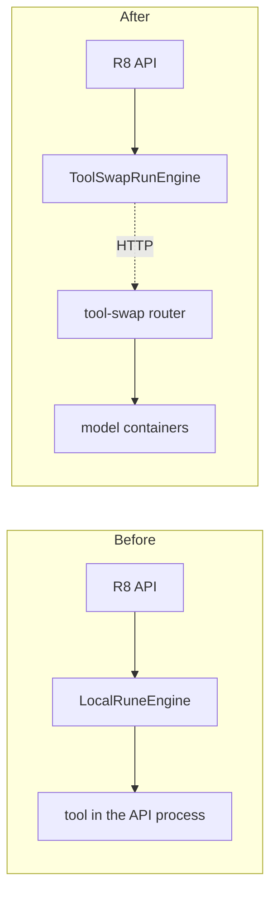

# 11 — Plan: the Healthcare-Systems-R8 Client (later, separate work)

> Decision **D10**: this is **not** part of tool-swap v1. It is a plan for later, written now while the context is fresh.
>
> **Where this work happens:** in the **R8 repository**, not in tool-swap. tool-swap must know nothing about R8 — that is the whole point of extracting it. The only artefact tool-swap may contribute is a generic Python SDK.

---

## 1. Goal

Let the R8 backend keep its existing `RunEngine` abstraction and its two endpoints, while the actual execution happens in tool-swap. Ideally **the change is one line in a factory** and no caller notices.



---

## 2. The seam to implement against

R8 already has exactly the right abstraction — this is why the migration can be cheap. The interface to satisfy (verbatim from the R8 repo):

```python
class RunEngine(ToolInvoker):
    tool_registry: List[ToolSpecification]

    def __init__(self, tools: List[ToolSpecification]) -> None:
        self.tool_registry = tools

    def run_single(self, tool_id: str, inputs: dict[str, Modality], ctx: ToolContext) -> RunEngineOutput: ...

    def list_services(self) -> List[ToolServiceDescriptor]: ...

    def shutdown(self): ...
```

and the injection point (also verbatim — note the already-commented alternative, which shows the seam is real and used):

```python
def create_lifespan(config_file: str, tool_specifications: list[ToolSpecification], verbose: bool = False):
    @asynccontextmanager
    async def lifespan(app: FastAPI):
        # engine = BentoMLRunEngine(tool_specifications, config_file, verbose=verbose)
        engine = LocalRuneEngine(tool_specifications)
        app.state.engine = engine
        ...
```

So the entire integration is: add a third implementation and select it by config.

```python
class ToolSwapRunEngine(RunEngine):
    """RunEngine backed by a remote tool-swap router."""

    def __init__(self, base_url: str, *, token: str | None = None, timeout: float = 300.0) -> None:
        self._client = ToolSwapClient(base_url, token=token, timeout=timeout)
        super().__init__(self._discover_tools())
```

---

## 3. The four mapping problems

Each is a real impedance mismatch. None is hard, but each needs a decision.

### 3.1 `ToolSpecification` ← `/tools`

R8's `RunEngine.__init__` wants a `List[ToolSpecification]`, and R8 conveniently already has a constructor for building one from a descriptor rather than by importing code:

```python
@staticmethod
def from_node_description(node_desc: ToolServiceDescriptor) -> ToolSpecification:
    return ToolSpecification(
        name=node_desc.name,
        fn=lambda: None,          # never called — execution is remote
        doc=node_desc.doc,
        input_ports=node_desc.input_schema,
        output_ports=node_desc.output_schema,
        input_adapters={},
        input_defaults={},
    )
```

So: `GET /tools` → `ToolServiceDescriptor` → `from_node_description`. **R8 stops importing model code entirely**, which is the deeper win: the R8 backend's requirements file can then shed torch, TensorFlow, monai, flash-attention and the rest.

Caveat: `input_adapters` and `input_defaults` are empty, so R8-side input validation and default-filling are lost — validation now happens in tool-swap. Verify nothing downstream depends on the adapters (the workflow validator is the place to check).

Discovery timing: fetch at startup (matching today's eager registry), and add a refresh (`POST /admin/refresh-tools` or a TTL) since the zoo can now change without restarting R8. Handle the router being unavailable at R8 boot: fail loudly, or start with an empty registry and retry — **decide deliberately**, because "silently no tools" would be a confusing outage.

### 3.2 `Modality` → JSON inputs

```python
def run_single(self, tool_id, inputs: dict[str, Modality], ctx) -> RunEngineOutput:
    payload = {"inputs": {name: m.payload for name, m in inputs.items()}}
    result = self._client.run(tool_id, payload, timeout=...)
    return RunEngineOutput(
        payload=result.outputs,
        status=ResultStatus.SUCCESS if result.ok else ResultStatus.FAILED,
        error_message=result.error,
    )
```

Note the pleasing detail: R8's internal interface is **already** `dict[str, Modality]` (named), matching tool-swap's named `inputs`. Only R8's *HTTP layer* used the positional list. So the adapter is nearly trivial, and the positional-mapping bug disappears on the way through.

Open points: whether `modality_type` should be forwarded as metadata (tool-swap does not need it, but it may aid validation/debugging); and numpy payloads, which need `.tolist()` — R8 already has a `NumpyArrayAsList` pydantic helper and `Modality.serialize_payload` for exactly this.

### 3.3 `RunEngineOutput` ← the response

Direct: `status` ↔ `success`/`failed`, `error_message` ↔ `error.message`, `payload` ↔ `outputs`. R8's `extract_payload_or_raise()` keeps working unchanged.

One decision: tool-swap returns a **named** outputs map (`{"embedding": [...]}`) whereas R8 tools return a bare value under a single `value` port. Either unwrap a single-output map to the bare value (preserves R8 behaviour exactly — recommended) or change the R8 nodes. Choose unwrapping; do not perturb the workflow layer.

### 3.4 `ToolContext` — the one genuine loss

R8's `ToolContext` lets a tool call another tool in-process with depth limiting:

```python
def run_tool(self, tool: str, inputs: dict[str, Modality]) -> RunEngineOutput:
    return self.invoker.run_single(tool, inputs, ctx=self.child())
```

tool-swap has no notion of this ([`04_API_CONTRACT.md`](04_API_CONTRACT.md) §8 — inter-tool calls are deliberately out of scope, partly because A-waits-on-B across a contended group is a real deadlock).

Options, in order of preference:

1. **Keep `ToolContext` on the R8 side.** `ctx.run_tool()` calls back into `ToolSwapRunEngine.run_single()`, which makes another HTTP call to the router. Depth limiting still works because the context object still lives in R8. **Recommended** — it preserves the feature with no tool-swap changes.
2. Refactor the affected tools so composition happens in the workflow graph rather than inside a tool. Cleaner, but touches tool code.
3. Add inter-model calls to tool-swap. **Do not.** Deadlock risk, and it drags orchestration into the wrong layer.

Note the extra hazard under option 1: a tool that calls another tool now holds an HTTP connection while a second model may need to swap in. If both are in a `max_resident: 1` group, that is a deadlock. Document it, and configure composed tools into different groups.

---

## 4. Deliverables

| Deliverable | Where | Notes |
|---|---|---|
| `ToolSwapClient` | tool-swap repo, as an optional `tool-swap-client` package | Generic, no R8 concepts. Sync + async, retries, timeouts, typed responses. This is the only thing tool-swap contributes. |
| `ToolSwapRunEngine` | **R8 repo**, `src/core/service_engine/tool_swap_engine/` | Implements R8's `RunEngine` in terms of the client. |
| Config | R8's `serve:` block | `engine: local | tool_swap`, plus `tool_swap.base_url` / `token`. Defaults to `local` so nothing changes until opted in. |
| Tool migration | tool-swap repo, `tools/` | Each existing tool becomes a tool directory ([`03_TOOL_AUTHORING.md`](03_TOOL_AUTHORING.md)). The bulk of the actual work. |
| Tests | R8 repo | Contract tests against a fake router; the existing `tests/api/test_api_services.py` should pass with the new engine injected. |

---

## 5. Migration path

Incremental and reversible — never a big-bang switch:

1. **Ship tool-swap v1** and stand it up alongside R8, serving nothing R8 depends on.
2. **Port one tool** (choose a well-isolated one — `cxr_to_embedding` is ideal: heavy, GPU-bound, few dependencies) into tool-swap. Verify parity by calling both paths and diffing the outputs on real inputs. *Numerical parity is the acceptance criterion and must be checked, not assumed* — a different transformers version can shift embeddings slightly.
3. **Add `ToolSwapRunEngine`** with a hybrid mode: a per-tool routing table, so tool X goes to tool-swap while everything else stays local. This is what makes the migration safe and reversible, and is worth the extra code.
4. **Migrate the rest** tool by tool, verifying parity each time. Prioritise the ones causing dependency pain (the TensorFlow/Keras model first — it is the one that cannot cleanly free GPU memory in a shared process).
5. **Flip the default** to `tool_swap` once every tool is ported and stable.
6. **Delete** `LocalRuneEngine`, `BentoMLRunEngine`, `RayRunEngine`, the tool decorators, `tool_loader`, the ~440-line `tool_builder`, and — the real prize — **strip torch, TensorFlow, monai, flash-attention, rad-dino, sentence-transformers and their transitive dependencies out of the R8 backend's requirements.** The backend becomes a thin, fast-installing, fast-starting orchestration service.

---

## 6. What R8 gains

| Today | After |
|---|---|
| Every model must be importable in one venv with ~300 pinned packages, both torch and TensorFlow | R8's backend needs no ML dependencies at all |
| A model crash or CUDA OOM takes down the whole API | Failures are isolated to one container |
| Every request pays a full model load (`LocalRuneEngine` unloads unconditionally after each call) | Models stay warm with TTL; repeat requests are fast |
| No micro-batching in the active engine | Batching inside each model container |
| Adding a model means re-resolving the monolith's lock file | Adding a model means a new directory |
| Model deployment is coupled to backend releases | Independent lifecycles |

---

## 7. Risks

| Risk | Mitigation |
|---|---|
| Numerical drift between old and new environments | Parity tests per tool with recorded fixtures, before switching |
| Added network latency per call | Measure; it is milliseconds against multi-second inference, and the removal of per-request model loading dominates it by orders of magnitude |
| The router becomes a single point of failure for R8 | It was already single-process; add a healthcheck, `restart: unless-stopped`, and a clear R8-side error when the router is unreachable |
| Losing R8-side input validation (empty `input_adapters`) | Validate in tool-swap against the declared schema; confirm the workflow validator does not rely on adapters |
| `ToolContext` composition deadlocking across groups | §3.4 — document and place composed tools in different groups |
| Two systems to operate | tool-swap's `status`/`logs`/`doctor` are better than what exists today; net operational improvement |

---

## 8. Explicit non-goals for this client

- Do **not** make tool-swap aware of `Modality`, `ToolSpecification`, `ToolContext` or anything else R8-specific. All translation lives in the R8-side adapter.
- Do not port R8's Hydra config, auth or job API into tool-swap.
- Do not attempt to preserve R8's positional `input_modalities` HTTP shape internally; the named form is strictly better and the adapter handles the boundary.
