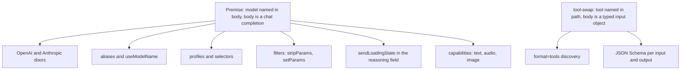
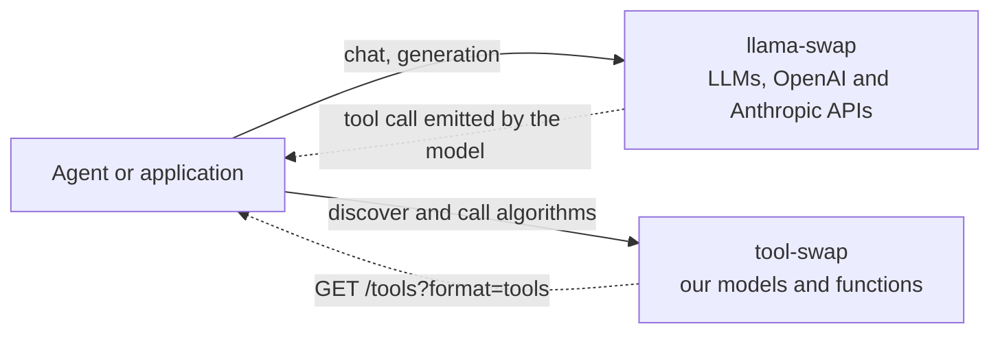

# 17 — The llama-swap Philosophy, Translated to Generic ML Models

> **The one-line brief for this project**: *do what llama-swap does, but for arbitrary ML models instead of LLMs.*
>
> This document takes that seriously. It states the philosophy we are borrowing, maps every llama-swap primitive to its tool-swap equivalent, names what we deliberately refuse and why, works out what genuinely changes when the upstream is an arbitrary model rather than an OpenAI server, and lists five places where llama-swap has solved a problem our plan has not yet noticed.
>
> **Evidence base:** [`third-party-docs/llama-swap/`](third-party-docs/llama-swap/INDEX.md), captured at **v249** (2026-08-10). Every claim about llama-swap here is checkable there. Where the plan's existing description of llama-swap is stale or imprecise, that is recorded as a **finding** in [§3 of the INDEX](third-party-docs/llama-swap/INDEX.md) rather than corrected in place.

---

## 1. The philosophy in one page

llama-swap is a proxy that starts model servers on demand and stops them when idle. Everything else about it follows from four commitments.

**1. One binary, one configuration file, no dependencies.** Their words: *"Easy to deploy and configure: one binary, one configuration file. no external dependencies."* Installation is `brew install`, `winget install`, `docker run`, or a downloaded binary.

**2. Configuration is graduated.** The minimum viable config is three lines and one required key per model:

```yaml
models:
  model1:
    cmd: llama-server --port ${PORT} --model /path/to/model.gguf
```

*"Almost all configuration settings are optional and can be added one step at a time."* Over a hundred keys exist; exactly one is required.

**3. Loading is a consequence of a request, never an operator action.** *"When a request is made… llama-swap will extract the `model` value and load the appropriate server configuration to serve it. If the wrong upstream server is running, it will be replaced with the correct one."* Nobody deploys a model. They request it, and it exists.

**4. The upstream is opaque and replaceable.** The router knows a command line, a port and a health path. It never imports the model, never links against the inference engine, never parses a checkpoint. Hence: *"future proof, upgrade your inference servers at any time."*

### Why this is the right philosophy for a model zoo

Those four commitments answer our four requirements almost exactly:

| Their commitment | Our requirement |
| --- | --- |
| One binary, one config file | **R1** — *simple to launch the service and check its logs and status* |
| Graduated configuration | **R4** — *simple to configure* |
| Request-triggered loading | The stated ultimate goal — *"the serviced tools live by themselves"* |
| Opaque, replaceable upstream | **R2** — *the code and environment of each tool should be easy to set up* |

The fourth is the one to dwell on. **llama-swap's opacity is a deployment convenience; ours is the entire architecture.** They decouple the router from a *server binary*; we decouple it from an *entire Python environment*, because our failure mode is not "I want to upgrade llama.cpp" but "model A needs `transformers==4.30` and model B needs `>=4.56`, and today one of them cannot be added at all" ([`00_CONTEXT_AND_MOTIVATION.md`](00_CONTEXT_AND_MOTIVATION.md) §3).

The same instinct, pushed to where our pain is, produces **D2**. And it is not our invention: their own README recommends running Python inference servers in containers for *"clean environment isolation"* ([INDEX finding F1](third-party-docs/llama-swap/INDEX.md)).

### The one thing to steal above all others

If only one idea survives this document, make it **the three-line config that works**.

llama-swap has `matrix` solvers, `selectors`, `profiles`, `filters`, SSE event streams and a request-capture buffer — and still starts at three lines. That is guardrail 10 ([`13_OPEN_QUESTIONS.md`](13_OPEN_QUESTIONS.md) Part D) demonstrated at scale by somebody else.

Their own closing note on the full example is the warning attached to it:

> *"It has grown quite complex but your favorite local LLM can help with a local configuration."*

**A configuration that needs an LLM to write has lost R4.** The three-line entry point is what keeps that admission confined to the far end of the ladder.

---

## 2. Behaviour by behaviour

Every llama-swap primitive, its tool-swap equivalent, and the reason for the difference. **D4** is the governing decision: *adopt llama-swap's behaviours, not its surface.* This table is that sentence made specific.

### 2.1 The swap machinery — taken almost wholesale

| llama-swap | tool-swap | Difference, and why |
| --- | --- | --- |
| On-demand start on first request | Same ([`01_ARCHITECTURE.md`](01_ARCHITECTURE.md) §5) | None. This is the core behaviour and the project's name |
| Swap: stop the wrong upstream, start the right one | Same, plus **D25** preemption | Ours evicts an idle incumbent *on request arrival* rather than only on contention for the same slot |
| `ttl`, `globalTTL` (`-1` inherit, `0` never, `>0` seconds) | `ttl` + `defaults.ttl` (**D9**) | Same semantics. **Copy their sentinel discipline verbatim** — three states, explicitly named |
| `unloadTimeout` — graceful stop before force-kill, default 10s | `drain_timeout` 30s → SIGTERM → `stop_timeout` 30s ([`01_ARCHITECTURE.md`](01_ARCHITECTURE.md) §5.1–5.2) | **We already have this, and ours is more careful** — we drain in-flight work first and never evict a busy tool at all. See **G1** |
| `groups` with `swap` / `exclusive` / `persistent` | `groups` + `max_resident` (**D7**) | `swap: true` ≈ `max_resident: 1`. Their `exclusive` and `persistent` are *cross-group* relations we cannot express |
| `matrix` + `evict_costs` — solver minimising eviction cost | LRU victim selection | **Gap G2**, §5. Ours is the simple case of what theirs generalises |
| `hooks.on_startup.preload` | `keep_warm` | Same feature. Note their implementation: a **synthetic request** through the ordinary path, not a separate warm-up code path |
| `healthCheckTimeout` (default 120s) | `queue_timeout` (**D22**) | Same job. Their default is a useful reality check on ours |
| `checkEndpoint` — any path, or `none` | `/ready`, meaning **weights loaded**, with a reason on failure | **The most important divergence in the table.** See §4.3 |
| `${PORT}` allocation from `startPort` | No host ports; container name on a shared network (**D21**) | We get theirs for free from Docker networking, without the ordering hazard |
| `cmdStop` | Container stop, by construction | A container has a stop verb; a process needs one supplied |

### 2.2 The operator surface — taken, with the CLI as the front door

| llama-swap | tool-swap | Difference, and why |
| --- | --- | --- |
| `/upstream/:model_id` passthrough | `/upstream/{tool}/...` (**D4**) | Borrowed directly, including the debugging rationale |
| `/running` | `/status`, `tswap status` (**R1**) | Ours is richer: state, device, TTL remaining, last error |
| `/health`, `/metrics` | Same (**R1**, M7) | None |
| `/ui` web UI | `/ui` status page | **Deliberately much smaller.** Theirs is a playground with a token-metrics inspector; ours shows state. A playground for a CT segmenter is not a text box |
| `/logs`, `/logs/stream/{model_id}`, `?no-history` | `tswap logs {tool} -f` (**D8**) | Same intent, CLI-first. **Their HTTP form is worth having too** — it is what makes logs reachable from a browser and from a remote host |
| `logToStdout: proxy\|upstream\|both\|none` | Per-tool log files | Their four-way switch is a cleaner statement of the same choice than ours |
| `POST /api/models/unload/:model_id` | Not in v1 | Distinct from the `POST /unload` [ADR-0004](adr/0004-hard-stop-only-in-v1.md) removed: **theirs stops the upstream**, ours would have asked a live container to *release weights*. A stop-this-tool-now endpoint is a smaller, still-available thing |
| `apiKeys: [str]` | Bearer-token hook ([`README.md`](README.md) §5) | Theirs is a plain array of accepted keys. Ours is deferred, and this is the shape to copy when it arrives |
| `env: ["NAME=value"]` | Per-tool `env` mapping | Same feature; a YAML mapping reads better than `=`-joined strings |
| `macros` | `x-defaults` anchors + `${VAR:-default}` | [`02_CONFIGURATION.md`](02_CONFIGURATION.md) §1.6 already cites this feature by name |
| `peers` — static federation | *(nothing)* | Not in v1. Noted as an unpriced alternative to Kubernetes at the second-host trigger |

### 2.3 What has no counterpart in either direction

**They have, we do not, and it is not applicable:** `aliases`, `useModelName`, `includeAliasesInList`, `profiles`, `selectors`, `filters`, `sendLoadingState`, `compat.ignoreWebsockets`, `capabilities`, the `/v1/*` doors, `/comfyui/`, `/sdapi/*`. See §3.

**We have, they do not, and it is the heart of our value:**

| tool-swap | Why they have no equivalent |
| --- | --- |
| **Typed input/output schemas** (**D13**) | Their upstream is opaque; ours is one we build. A `cmd:` string cannot be introspected by an LLM — a JSON Schema can |
| **`?format=tools` projection** | Their integration surface *is* the OpenAI API. Ours must be discovery, because we are the tool provider, not the LLM |
| **Micro-batching** (**D5**, **D14**) | Their upstreams batch internally (continuous batching in llama.cpp/vLLM). Every one of our tools is ours, so there is no better batcher to defer to |
| **Device pinning by the scheduler** (**D7**) | Theirs is written by hand into `cmd` as `--gpus`. Ours must be assigned, because the scheduler owns placement |
| **The authoring/build layer** (**R2**, **D3**) | They consume servers that already exist. We create them from `handler.py` + `requirements.txt` |
| **`tswap preflight`** (**D17**) | Follows from the above: if we generate the tool, we can answer *"will it deploy?"* before it ships |
| **Weights-loaded readiness with a reason** | Follows from **D14**: BentoML's `/readyz` answers before `load()` runs, so a delegated check would lie |

**That final column is the honest answer to "why not just use llama-swap?"** Not that it lacks features — it has more than we plan to build. But a third of its configuration surface would be dead weight for us ([`config-schema.md`](third-party-docs/llama-swap/config-schema.md) §8), and everything in the table above would still have to be built.

---

## 3. What we deliberately refuse, and why it all traces to one fact

The refusals are not a series of independent judgements. They are one decision, applied repeatedly:

> **The model is named in the request body, and the body is a chat completion.**

That single fact generates most of llama-swap's surface. Our tools are named in the **URL path**, and our bodies are JSON-Schema-validated input objects. Remove the premise and the features it supports have nothing to attach to.



| Refused | What it does | Why it cannot apply here |
| --- | --- | --- |
| `/v1/*` — OpenAI, Anthropic, SDAPI, ComfyUI doors | Speak somebody's generative-AI protocol | **We serve no LLMs.** A compatibility layer for a protocol none of our tools speak is pure cost ([`04_API_CONTRACT.md`](04_API_CONTRACT.md) §0). This is llama-swap's job, in the same deployment |
| `aliases`, `useModelName`, `includeAliasesInList` | Let a client say `gpt-4o-mini` and reach something else | Both exist to resolve `body.model`. **D23** settles versioning by name (`cxr_v1`, `cxr_v2`) with no aliasing at all |
| `profiles`, `selectors` (`warm`/`pin`/`spillover`) | Rewrite or choose model IDs at runtime | Same premise. `spillover` additionally presumes interchangeable replicas — a second embedder is not a substitute for the first, it is a different function |
| `filters` — `stripParams`, `setParams`, `setParamsByID` | Enforce sampling parameters server-side | Our per-request knobs are **static params fixed at load time** (**D15**), because BentoML's dispatcher cannot separate a batch by differing arguments. The state these filters manage is one we made unrepresentable |
| `sendLoadingState` | Stream loading messages into the `reasoning` field | There is no `reasoning` field. A cold start blocks, bounded by `queue_timeout` (**D22**) |
| `capabilities: {in, out, tools, reranker, context}` | Tell clients what a model accepts | **Superseded by something stronger.** Theirs types the *model* by modality; ours types **every input and output** with JSON Schema (**D13**). This is the clearest available demonstration of what D13 buys |
| `compat.ignoreWebsockets`, `upstream.ignorePaths` | Stop browser chatter from triggering swaps | Symptoms of proxying *interactive web UIs*. Nothing we host serves a UI |
| `store`, `ui.activity.session_id`, `captureBuffer` | Session-attributed activity logs and request/response capture | Theirs is a personal-workflow product with a playground. Ours has **no database** ([`README.md`](README.md) §5) and a status page |

**Where the refusals leave us.** Roughly a third of their schema evaporates, and what remains is the swap machinery, which is exactly the part we wanted. This is what **D4** means by *behaviours, not surface* — and it is measurable, not rhetorical.

---

## 4. The generic-ML translation — what actually changes

Here is the substance of the brief. Five things change when the upstream is an arbitrary ML model rather than an OpenAI-compatible server. Each one is a place where copying llama-swap directly would produce a wrong answer.

### 4.1 The request has no universal shape, so discovery must be typed

An OpenAI server accepts one body shape, for every model, forever. That is why llama-swap needs no schema: `model` plus messages, and the rest is the upstream's business.

Our tools accept a DICOM path, or a text string, or a feature vector, or a 3-D volume by reference, and each returns something different. **There is no universal body**, so the router cannot validate, an agent cannot call, and a human cannot discover, unless the shape is *declared*.

Hence **D13**: JSON Schema per input and output, projected into standard tool definitions at `GET /tools?format=tools`. **This is the single largest addition over llama-swap**, and it is the one that makes the zoo consumable by an agent whose LLM lives elsewhere.

The consequence for authoring is **D19** — descriptions mandatory for the tool and every input — because an undescribed parameter is one an LLM fills in wrongly.

### 4.2 Batching moves inside our boundary

llama.cpp and vLLM implement continuous batching internally. llama-swap batches nothing and needs no batching contract; a request goes to the upstream and the upstream sorts it out.

**Every tool here is one we build**, so there is no upstream with a better batcher to defer to. Batching becomes ours — **D5** — and the correctness burden comes with it: a batch of five requests must return five responses to the five right callers. [`16_COMPLEXITY_AUDIT.md`](16_COMPLEXITY_AUDIT.md) names batch attribution as the first never-trim item for exactly this reason.

**D14** answers it by adopting BentoML's adaptive dispatcher rather than writing a third batcher in this codebase ([`00_CONTEXT_AND_MOTIVATION.md`](00_CONTEXT_AND_MOTIVATION.md) §2.4 records the two that were written and never ran). **D15** is the price: a batched tool may declare only batchable inputs, and per-request knobs become load-time static params.

### 4.3 Readiness cannot be delegated

llama-swap polls `checkEndpoint` — any path, default `/health` — until it answers 200. This is correct **for them**, because `llama-server` does not bind until the GGUF is mapped.

For an arbitrary Python model server it is a coin flip, and for ours it would be wrong nearly always: BentoML's `/readyz` answers as soon as the process is up, before `load()` has run ([`third-party-docs/bentoml/health-endpoints-and-lifecycle-source.md`](third-party-docs/bentoml/health-endpoints-and-lifecycle-source.md)).

A router that believes a tool is ready when the server has merely started will proxy a request into a model with no weights. **This is the exact R8 defect [`05_RUNTIME_AND_BATCHING.md`](05_RUNTIME_AND_BATCHING.md) §3.2 exists to correct**, and it is why `/ready` is a *contract* here rather than a *configurable path* — and why it returns a reason while not ready, which llama-swap's poll-for-200 cannot.

**Generalised: what a server can be trusted to say about itself shrinks as the space of servers grows.** Delegating readiness works when you know the upstream; it fails as soon as anyone can write one.

### 4.4 Placement is the scheduler's, because the zoo is heterogeneous

In llama-swap, device selection is written by hand into `cmd` — `--gpus '"device=2,3"'` — and the router never knows about it. Reasonable when the operator is also the person choosing which quantisation fits which card.

Our tools are authored by scientists who should not be choosing GPUs, and the zoo is heterogeneous in a way an LLM fleet is not: a 200 ms CPU function and a 90-second CT segmenter live side by side. So placement must be *assigned* (`devices: [0,1]`, **D7**), and the same heterogeneity is what makes **D25** preemption necessary and **gap G2** (eviction cost) worth asking about.

It is also why **D28** exists: on a shared DGX, a start can fail because a *neighbour* holds the VRAM, and that must never be recorded as a tool failure. llama-swap has no equivalent concern because a personal machine has no neighbours.

### 4.5 Payloads are large, and sometimes not JSON at all

A chat completion is a few kilobytes of text. A CT volume is 500 MB, and base64 in a JSON body is untenable.

**D18** — inputs carry a *reference*, resolved by the runtime just before the handler sees it; v1 resolves filesystem paths against declared mounts, with object-storage URIs as the designed growth path. There is no llama-swap analogue, because there is no LLM analogue of the problem.

Note the second-order effect, which is the reason the decision is framed as *reference* rather than *path*: adding S3 later becomes a change to one resolver instead of a breaking change to every client, schema and handler.

### 4.6 Summary

| | llama-swap | tool-swap |
| --- | --- | --- |
| Request shape | One, universal | **Per-tool, declared** (**D13**) |
| Batching | The upstream's problem | **Ours** (**D5**, **D14**) |
| Readiness | Delegated to a config'd path | **A contract**, weights-loaded, with a reason |
| Placement | Hand-written into `cmd` | **Assigned by the scheduler** (**D7**) |
| Payloads | Kilobytes of text | **Gigabytes, by reference** (**D18**) |
| Isolation boundary | The process | **The container image** (**D2**) |
| Integration surface | The OpenAI API | **`?format=tools`** (**D13**), later MCP (**D16**) |

**Everything in the right-hand column is a consequence of "generic ML models" rather than "LLMs".** That is the translation, and it is the whole of the difference — the swap semantics in §2.1 came across nearly unchanged.

---

## 5. Five gaps — ✅ **all five settled, 2026-08-13**

llama-swap had solved five problems this plan had not noticed. They were written as questions for the requester; **all five now have answers, and each is applied in the document that owns it.** The original framing is kept below so the reasoning survives, with the verdict attached to each.

| Gap | Verdict | Lives in |
| --- | --- | --- |
| **G1** grace period | **Already solved; cross-reference added**, plus a warning to check `drain_timeout` against a 90-second inference | [`06 §2.1`](06_LIFECYCLE_TTL_AND_SCHEDULING.md), [`01 §5.1`](01_ARCHITECTURE.md) |
| **G2** eviction victim | **Cheap version adopted** — one optional `evict_cost` integer in an LRU tie-break. **The solver and its DSL are explicitly refused.** | [`06 §5.1.1`](06_LIFECYCLE_TTL_AND_SCHEDULING.md) |
| **G3** queue priority | **Seam adopted, feature refused** — a policy enum with one implementation, declared before M2 | [`06 §5.1.2`](06_LIFECYCLE_TTL_AND_SCHEDULING.md) |
| **G4** saturated tool | **Both halves answered**: the adapter re-emits `ServiceUnavailable` with a distinct reason, and the router gains an *optional* `max_concurrent` returning 429 | [`05 §4.5`](05_RUNTIME_AND_BATCHING.md), [`06 §10`](06_LIFECYCLE_TTL_AND_SCHEDULING.md) |
| **G5** non-root images | **Adopted, scheduled into M5** — a `USER` line, a read-only cache mount, and `safetensors` guidance | [`03 §6.1`](03_TOOL_AUTHORING.md), [`09 M5`](09_IMPLEMENTATION_PLAN.md) |

**A sixth item, not on the original list, came from the same capture and is also applied:** their `logToStdout` four-way switch becomes our `router.log_output`, and the *"observability regressions are invisible to functional tests"* lesson becomes three assertions in [`10 §6.1`](10_TESTING_STRATEGY.md).

The original questions follow. See [INDEX finding F3](third-party-docs/llama-swap/INDEX.md).

### G1 — Graceful stop: already solved, and worth checking against theirs

> **This one was drafted as a gap and disproved on verification.** It is kept because the comparison is favourable and because the near-miss is instructive: the answer lives in [`01_ARCHITECTURE.md`](01_ARCHITECTURE.md) §5.1, not in the lifecycle document where a reader would look for it.

**They have:** `unloadTimeout`, global and per-model, default **10 seconds**, applied to *"manual, API, or TTL expiry"* stops before force-killing.

**We have, and it is more careful:**

- *"In-flight requests block eviction. A model with `inflight > 0` is never evicted and never TTL-stopped"* (§5.1 rule 3) — so the mid-inference case they force-kill **does not arise for us**.
- *"Graceful drain on stop… wait up to `drain_timeout` for in-flight ones, then `SIGTERM` the container, then `SIGKILL` after `stop_timeout`"* (rule 4), with 30s and 30s defaults (§5.2).

**What remains, and it is small.** Three checks rather than a decision:

1. **Does `drain_timeout` survive [ADR-0004](adr/0004-hard-stop-only-in-v1.md)?** That ADR rewrote the reclamation path around hard stop; §5.1 predates it. The two are compatible, but nothing says so explicitly.
2. **Is 30s + 30s right for a tool whose single inference takes 90 seconds?** Theirs is 10s for workloads that stream tokens continuously. Ours must cover one long, atomic call.
3. **Say it in the lifecycle document.** [`06_LIFECYCLE_TTL_AND_SCHEDULING.md`](06_LIFECYCLE_TTL_AND_SCHEDULING.md) owns TTL and eviction; the stop semantics live two documents away.

**Cost:** a cross-reference and a sentence. **Cost of not:** exactly the confusion that produced this entry.

### G2 — When several tools are evictable, which one goes?

**They have:** `matrix` with `evict_costs` — *"Relative cost of evicting a running model"* — and a solver that *"minimizes eviction cost when swapping."*

**We have:** **D25** says a request preempts an idle incumbent, and [`06_LIFECYCLE_TTL_AND_SCHEDULING.md`](06_LIFECYCLE_TTL_AND_SCHEDULING.md) picks the least recently used.

**The question.** LRU assumes cold starts are comparable. Ours differ by orders of magnitude — a CPU function restarts in under a second, a large segmenter takes ninety. Evicting the expensive one because it was idle a little longer is a bad trade, and on a zoo with this spread it will happen routinely.

**Note the cheap version.** We do not need their solver or its DSL. A per-tool integer weight, breaking ties in an otherwise-LRU policy, captures nearly all of the benefit. **The expensive version is a solver plus a DSL plus a `vars` indirection table — the clearest illustration in the whole capture of what R4 costs when scheduling expressiveness wins.**

**Cost of answering (cheap version):** one optional config key and a comparator. **Cost of not:** avoidable cold starts, felt as latency nobody can explain.

### G3 — Do queued requests have a priority?

**They have:** `routing.scheduler.use: fifo` with per-model `priority` — *"Higher values are serviced first"* — and the enum makes room for more schedulers.

**We have:** an implicitly FIFO queue (**D22**), with `queue_timeout` and `max_queue_depth`.

**The question.** With an interactive tool and a batch job in the same zoo, FIFO puts the interactive request behind the batch. Is that acceptable for v1?

**A view.** Probably yes, and deliberately. Priority is where schedulers acquire starvation bugs, and [`16_COMPLEXITY_AUDIT.md`](16_COMPLEXITY_AUDIT.md) names scheduler purity as never-trim. The part worth copying now is **the shape, not the feature**: their `scheduler.use` enum means a second policy is a new implementation rather than a rewrite — the same seam as `ContainerBackend`.

**Cost of answering:** an interface boundary, no feature. **Cost of not:** a policy hard-coded into the queue and awkward to displace later.

### G4 — What does a saturated but READY tool do?

**They have:** `concurrencyLimit`, default 10 in-flight per model, **HTTP 429** beyond it — a limit on *concurrency*.

**We have:** `max_queue_depth` per model, *"return 429 when exceeded"* ([`01_ARCHITECTURE.md`](01_ARCHITECTURE.md) §5.1 rule 5). Same status code, but a limit on the **cold-start queue**, not on concurrent work against a `READY` tool.

**The question.** A tool that is `READY` and receiving more than it can serve is not queued for a cold start, so `max_queue_depth` never engages. Three layers could own the case: the router (a concurrency cap alongside the queue bound), the runtime (BentoML's `threads=1` limiter and `ServiceUnavailable("process is overloaded")`, see [`third-party-docs/bentoml/health-endpoints-and-lifecycle-source.md`](third-party-docs/bentoml/health-endpoints-and-lifecycle-source.md)), or nobody.

**If nobody, the answer arrives as a 503 from BentoML that loses its message on the way out** — [`third-party-docs/bentoml/error-handling.md`](third-party-docs/bentoml/error-handling.md) records that BentoML replaces the body of any ≥500 response with a generic string. The caller sees an unexplained 503 that looks like a tool failure, and **D28** is precisely about not misattributing failures.

**Note this is largely already answered elsewhere**: that capture concludes *"the adapter must catch it before BentoML's handler and re-emit it in our envelope."* What is missing is the router-side decision — whether to cap concurrency before the container has to.

**Cost of answering:** deciding which layer owns it, and one error code in [`04_API_CONTRACT.md`](04_API_CONTRACT.md) §6. **Cost of not:** an ambiguous 503 under load, misread as a broken tool.

### G5 — Do tool containers run as root?

**They have:** root by default *"for convenience"*, `non-root` image variants, and an explicit warning that this *"can widen the attack surface to privilege escalation exploits"* — plus a pointer to Hugging Face's pickle advisory.

**We have:** **D20** accepts and documents the router's docker socket as root-equivalent. **Nothing specifies a `USER` for tool images** ([`03_TOOL_AUTHORING.md`](03_TOOL_AUTHORING.md), M5).

**The question, and it is sharper for us than for them.** llama-swap loads GGUF, a format with no code-execution path. Our tools call `from_pretrained()` and `torch.load()` against arbitrary Hugging Face repositories — **D11** grants network access precisely so they can — and `.bin` checkpoints are pickles that execute on load. A root container, mounting the shared HF cache, deserialising a pickle from the internet, **on a shared DGX where other people's work is on the same host**, is the sharpest edge in this design, and no plan document currently mentions it.

**Cost of answering:** a `USER` line in the generated base image, a read-only cache mount where downloads are not needed, and a `safetensors` recommendation in the authoring guide. **Cost of not:** the plan makes the *stability* half of the blast-radius argument (**D2**) and omits the *security* half. **Nearly free before M5, awkward after** — changing the base image's `USER` later invalidates every author's assumptions about file ownership.

### Summary — with verdicts

| Gap | Subject | Cheapest form | Urgency |
| --- | --- | --- | --- |
| **G1** | Grace period before force-kill | **Already solved** — needs a cross-reference and a default sanity-check | Before M6 · ✅ **applied** |
| **G2** | Eviction victim selection | An optional per-tool weight in an LRU tie-break | Before M6 · ✅ **applied, cheap version only** |
| **G3** | Queue priority | Adopt the *seam*, not the feature | Before M2 |
| **G4** | Saturated-tool back-pressure | Decide the owning layer; one error code | Before M4 |
| **G5** | Non-root tool images | A `USER` line and a docs paragraph | **Before M5** |

---

## 6. The sibling-service topology

The two projects are not alternatives. They run side by side, and the boundary between them is the cleanest line in this architecture.



**The boundary rule, in one line:** *if it speaks a generative-AI protocol, it belongs to llama-swap; if it is an algorithm we wrote, it belongs to tool-swap.*

That rule decides several things at once, which is how you can tell it is the right one:

- **No OpenAI door here** ([`04_API_CONTRACT.md`](04_API_CONTRACT.md) §0) — and with it no `body.model` resolution, no `aliases`, no `served_model_name`.
- **No `kind: external`** ([`01_ARCHITECTURE.md`](01_ARCHITECTURE.md) §6) — vLLM was the only serious candidate for hosting a third-party server image, and vLLM serves LLMs.
- **No LLM in the zoo**, even as a tool. A text summariser is a call to llama-swap, not an entry in `tools.yaml`.

### The handoff

The connection is one HTTP call. An agent fetches `GET /tools?format=tools` from tool-swap, passes the result as `tools=[...]` to its LLM — served by llama-swap — and when the model emits a call, the agent posts to `/run/{tool}`. Nothing is shared: no database, no config, no process, no Python environment. Two services, one JSON document between them.

**This is why [`09_IMPLEMENTATION_PLAN.md`](09_IMPLEMENTATION_PLAN.md) M8 makes that round trip the acceptance test** — *"llama-swap for the LLM, tool-swap for the algorithm"* — and why it is described there as the product thesis in one test.

### What we owe the sibling relationship

Three practical consequences, easily forgotten because they are operational rather than architectural:

1. **Their upgrades are our operational events.** 249 releases and nightly container builds ([INDEX §4](third-party-docs/llama-swap/INDEX.md)). If M8's integration test runs against a live llama-swap, it inherits that cadence — pin a version in CI.
2. **They will hold the GPUs we want.** Both services swap models on the same host, neither knows about the other, and neither can see the other's VRAM. **This is precisely the scenario D28 was written for**, and llama-swap is the most likely neighbour to cause it.
3. **The philosophy debt runs one way.** We took their semantics; we give back a tool provider their LLMs can call. That is a better relationship than a fork, and it is the reason **D1** kept the `-swap` in the name.

---

## 7. Reading guide

| If you want | Read |
| --- | --- |
| What we are copying and why | This document, §1–§2 |
| Whether llama-swap really does X | [`third-party-docs/llama-swap/INDEX.md`](third-party-docs/llama-swap/INDEX.md) §1, then the captured file |
| Where the plan's description of llama-swap is stale | [`third-party-docs/llama-swap/INDEX.md`](third-party-docs/llama-swap/INDEX.md) §3, findings **F1**–**F4** |
| Why llama-swap is not our router | [ADR-0001](adr/0001-build-our-own-router.md), then finding **F2** for the precise reason |
| The config keys, with types and defaults | [`third-party-docs/llama-swap/config-schema.md`](third-party-docs/llama-swap/config-schema.md) |
| What a mature version of our router looks like | [`third-party-docs/llama-swap/router-design-notes.md`](third-party-docs/llama-swap/router-design-notes.md) |
| What to decide before M5 | §5, gap **G5** |

> **A closing caution.** llama-swap is a moving target with a fast release cadence, and this document describes it as of **v249, 2026-08-10**. Before citing anything here in a new decision, check the version header on the relevant capture — and if the claim is behavioural, re-verify it. The philosophy in §1 will not have changed. Everything in §2 might have.
