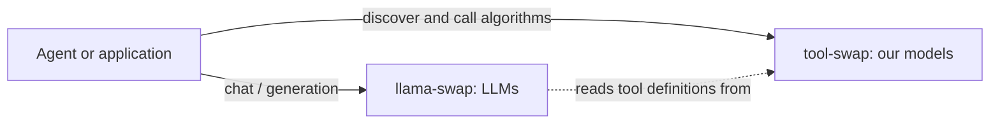
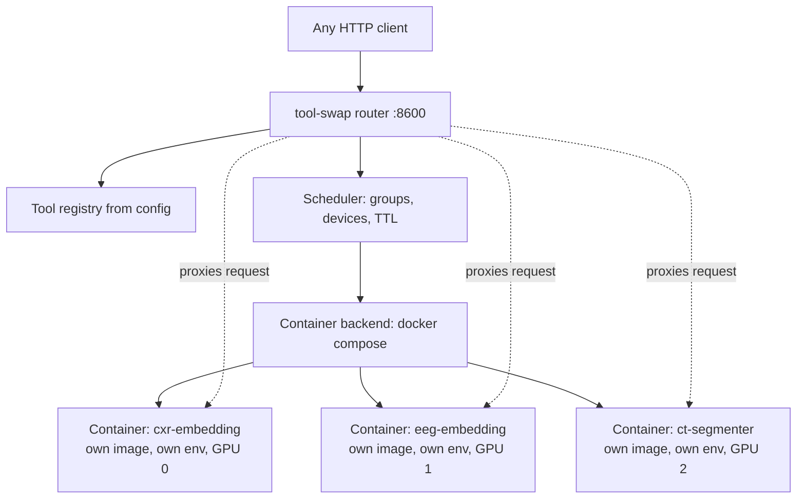

# tool-swap — Plan Index

> **Status**: design / planning stage. No code has been written yet.
> **Audience**: the engineer(s) who will create the new standalone repository.
> **Assumption**: the implementer has **no access** to the originating repository. Every piece of context, reference code and rationale needed is contained in this directory.

### A note on "R8"

This plan refers throughout to **R8** — shorthand for `Healthcare-Systems-R8`, the healthcare AI research prototype this project is being extracted from. You do **not** need access to it, and nothing here asks you to open it.

R8 appears for exactly two reasons, and both are useful rather than incidental:

1. **As evidence.** Claims like "a shared environment cannot isolate dependencies" or "readiness that reports server-up is a lie" are not opinions here; they are things that happened, with the code that caused them reproduced verbatim in [`12_REFERENCE_CODE.md`](12_REFERENCE_CODE.md). If you doubt a design decision, that document is where you check our working.
2. **As a source of reusable material.** Some of it was good and should be ported; some of it is a specification of what not to do. Every piece is labelled with which.

If a statement about R8 anywhere in this plan is *not* backed by code or prose in [`12_REFERENCE_CODE.md`](12_REFERENCE_CODE.md), treat it as unverified and challenge it.

**One exception to "you need no access":** [`11_R8_CLIENT_PLAN.md`](11_R8_CLIENT_PLAN.md) describes work that happens *in that repository*, by that team, after v1 ships. It is included so the eventual integration is designed rather than improvised, and it is explicitly not part of your scope.

---

## 1. What we are building

`tool-swap` is a small, self-contained service that **hosts a zoo of LLM-callable tools and serves them over HTTP**, loading and unloading each tool on demand so that a limited pool of GPUs can serve many more tools than would fit in VRAM simultaneously. ML models (encoders, segmenters, classifiers) are one kind of tool; pure CPU functions (text cleanup, DICOM path validators, FHIR queries) are another.

It is directly inspired by [`llama-swap`](https://github.com/mostlygeek/llama-swap), which does this for `llama.cpp` servers: you declare a set of upstream commands in a YAML file, it starts the right one on demand, proxies your request to it, and stops it after an idle timeout (TTL).

### ⚠ Scope: we host algorithms, not LLMs

**`tool-swap` does not serve LLMs. That is llama-swap's job, in a separate deployment.**

We host *our own* algorithms — chest X-ray encoders, CT segmenters, EEG foundation models, tabular classifiers, text embedders, and pure CPU functions — each of which may need a *different and mutually incompatible Python environment*. That single fact is the reason the design is Docker-first.



Two consequences, and they shape everything downstream:

- **There is no OpenAI-compatible API here**, because nothing we host speaks that protocol. Our integration surface is `GET /tools?format=tools` — standard tool definitions that an agent feeds to *its* LLM, wherever that lives — and later MCP (**D16**).
- **Every tool is one we build**, from a handler plus requirements, on our runtime. There is no `kind: external`, no proxy-only tool wrapping someone else's server image, and therefore no translation layer. Borrowing llama-swap's *behaviours* (on-demand start, TTL, groups, swapping) is the point; adopting its LLM-shaped API surface is not.

### The four hard requirements (from the requester, verbatim intent)

| # | Requirement | Where it is addressed |
|---|---|---|
| | R1 | It should be simple to launch the service and to check its logs and status | [`07_CLI_AND_OPS.md`](07_CLI_AND_OPS.md) |
| | R2 | We need to be able to easily add new tools; the **code** and the **environment** of each tool should be easy to set up | [`03_TOOL_AUTHORING.md`](03_TOOL_AUTHORING.md) |
| | R3 | It should have a proxy to all services | [`04_API_CONTRACT.md`](04_API_CONTRACT.md) |
| | R4 | It should be simple to configure | [`02_CONFIGURATION.md`](02_CONFIGURATION.md) |

And the stated ultimate goal:

> *"The ultimate goal is to have the serviced tool live by themselves."*

Meaning: a tool is a self-contained unit (its own image, its own environment, its own process, its own lifecycle) that does **not** share a Python interpreter or a dependency tree with the orchestrator or with any other tool. This is the single most important architectural constraint in the whole plan.

---

## 2. ✅ The gate is closed: we build our own router

The requester asked the right question — *"would it be simpler to use KServe in the end? I feel like we are reinventing the wheel."* — and it was answered with evidence rather than opinion. [`14_ALTERNATIVES_EVALUATION.md`](14_ALTERNATIVES_EVALUATION.md) defined three timeboxed spikes, each designed to *avoid* building a router. All three failed:

| Spike | Question | Outcome |
|---|---|---|
| **C** | Do all the tools simply fit on the GPUs at once? | **No.** The swapping premise holds. |
| **A** | Can llama-swap be the router, with each tool's command being `docker run`? | **No.** It is LLM/OpenAI-shaped and cannot route our `/predict` tools. Its separate role serving our LLMs is unaffected. |
| **B** | KServe on single-node Kubernetes? | **No.** Kubernetes allocates devices and leaves the second pod `Pending`; it never preempts. We would operate a cluster *and still* write the preemption logic. |

Recorded in **[ADR-0001](adr/0001-build-our-own-router.md)**. **Do not re-run the spikes.** The triggers that would justify revisiting Kubernetes are specific and unchanged: a second GPU host, multi-tenant isolation, or an infra team already running it ([`14_ALTERNATIVES_EVALUATION.md`](14_ALTERNATIVES_EVALUATION.md) §8.6).

### A fourth candidate, challenged later: Ray Serve

*"I got challenged that we were reimplementing Ray Serve — why not use this framework?"* Ray Serve had only ever received a one-paragraph dismissal and **was never spiked**, so the challenge was fair. It is answered in [`15_RAY_SERVE_EVALUATION.md`](15_RAY_SERVE_EVALUATION.md) (**v3**) and decided in **[ADR-0003](adr/0003-ray-serve-not-adopted.md)** (**D29**).

**Three capability concessions stand and are not re-argued:** `image_uri` gives each tool its own container image (**D2 is satisfiable on Ray** — our original "pip-layer only" claim was wrong); `@serve.multiplexed` is off-the-shelf bounded LRU residency; and application-level autoscaling policies are a designed home for a scheduler.

**The decision rests on maintainability instead, which is the axis the requirement names.** Adopting Ray means depending simultaneously on three **experimental-or-alpha** APIs beneath our most load-bearing decision, on a behaviour Ray never documents, and on a config mechanism driven at a cadence its own docs warn against — plus **every tool image locked to the cluster's exact Ray and Python patch version** (a Ray bump becomes a coordinated rebuild of the whole zoo) and, in Ray's own words, *"if you aren't using KubeRay, when the Ray cluster fails, Ray Serve cannot recover."* **Spike D is retired**, because [ADR-0004](adr/0004-hard-stop-only-in-v1.md) removed the one question it existed to answer.

### The deployment: a shared DGX

1. **Preemption is required.** A request for tool B displaces an idle incumbent immediately rather than waiting out its TTL (**D25**). This is what ruled out Kubernetes. The mechanism is a container stop.
2. **We share the node**, so a cold start can fail because a *neighbour* holds the VRAM — and that must never be recorded as a tool failure (**D28**).
3. **Reclamation is by stopping the container, on one idle timer.** **[ADR-0002](adr/0002-shared-node-soft-unload.md)** read the shared DGX as requiring soft unload in v1; **[ADR-0004](adr/0004-hard-stop-only-in-v1.md) reverses that** after the requester clarified the actual demand: *"we just don't want to block all the resources indefinitely… if soft unload is not possible let's just not use it and do hard unloads and find out if it becomes a problem later."* **`IDLE_SOFT`, `POST /unload` and preflight stage 8 are all out of v1.**

**The plan has also been audited against its own complexity** — decision by decision, in [`16_COMPLEXITY_AUDIT.md`](16_COMPLEXITY_AUDIT.md). Soft unload was the largest avoidable item and is gone; three things are named as never-trim (batch attribution, scheduler purity, truthful readiness).

The durable value of this project remains the **authoring UX** and the **swap semantics**, not the HTTP plumbing. Everywhere the plumbing can be borrowed, borrow it — and it was tested, three times, before we wrote any.

---

## 3. Naming and vocabulary

This section exists to prevent vocabulary rot. The rename from "model-swap" to "tool-swap" is not cosmetic — it changes what the project *is*.

**The hard rule:** `tool` is the native noun everywhere in identifiers, prose, config keys, API paths, and documentation. With the OpenAI compatibility layer removed, there is now **no exception at all** — the word `model` should not appear in any path, config key or error code we define. It survives only when referring to an ML model as a thing in the world ("the RAD-DINO model"), never as an API concept.

Consequences:
- Never write "model-swap" or "model_swap" in new code or prose. Use "tool-swap" / "tool_swap".
- Never write "add a model" or "the model container". Write "add a tool" / "the tool container".
- `?format=tools` is the projection that returns tool definitions. It is not called `?format=models` because the native noun is `tool`.

---

## 4. What we decided

These were explicitly confirmed by the requester during the brainstorming session.

| ID | Decision | Rationale |
|---|---|---|
| | **D1** | **Name: `tool-swap`.** Python package `tool_swap`, CLI binary `tswap`. | Sibling to the existing `anvil` project (LLM serving for coding/agents); this one is the generic *tool zoo* with serving. Name echoes `llama-swap` which is the acknowledged inspiration. See §3 for the rationale — the zoo holds ML models AND pure CPU functions, so "model" was always the wrong noun. |
| | **D2** | **Docker-first isolation.** One container image per tool. The orchestrator starts/stops containers and proxies to them. | Only way to give each tool a genuinely independent environment (see [`00_CONTEXT_AND_MOTIVATION.md`](00_CONTEXT_AND_MOTIVATION.md) §3 for the dependency-hell evidence). |
| | **D3** | **Graduated complexity.** The simple path requires the author to provide *only* Python requirements + a handler. Deeper knobs (custom Dockerfile, custom base image, arbitrary command, pre-existing image) exist but are optional and progressively revealed. | R2. Scientists must not need Docker expertise to add a tool. |
| | **D4** | **A normalized API plus a transparent proxy, and no OpenAI layer.** Adopt llama-swap's *behaviours* (on-demand start, TTL, groups, swapping), not its LLM-shaped surface. Three front doors, ten endpoints, each of which must earn its place. There is no OpenAI-compatible door, because such a door exists to serve LLMs and we serve none. | R3. |
| | **D5** | **Micro-batching is in scope and valuable.** Continuous/dynamic batching at the tool-server level, with BentoML's adaptive dispatcher as the engine (**D14**). Since every tool is ours, there is no upstream with a better batcher to defer to, which makes this load-bearing rather than optional. | Explicit request; also the main reason the originating system's BentoML engine was written. |
| | **D6** | **Tools are user-configurable/user-authored.** Making tool implementation as configurable as possible is a goal, including letting users create their own tools. | R2. |
| | **D7** | **Scheduling starts simple**: pinned devices + concurrency groups. Leave room for VRAM-aware placement later. | Avoid premature complexity. |
| | **D8** | **CLI on top of docker compose** for the ops surface. | R1. Familiar, debuggable, no bespoke daemon supervision to write. |
| | **D9** *(re-amended)* | **One idle timer; reclamation is by stopping the container.** No soft unload, no `IDLE_SOFT`, no `POST /unload` in v1. `soft_ttl` is reserved in the schema and rejected. | The requirement is *"we just don't want to block all the resources indefinitely"* — a liveness requirement a timer satisfies, not the latency requirement [ADR-0002](adr/0002-shared-node-soft-unload.md) inferred. See [ADR-0004](adr/0004-hard-stop-only-in-v1.md), which names the four measurements that would bring soft unload back. |
| | **D25** | **A request preempts an idle incumbent** rather than waiting for its TTL. | Stated as a requirement; it is also the decision that ruled out Kubernetes, which allocates rather than preempts. **Nearly free**: it is the existing eviction path with a request as its trigger. Cost: the victim pays a cold start. |
| | **D26** *(reversed)* | **`unload()` is advisory**, and preflight stage 8 is removed. Preflight now needs no GPU at any stage. | It existed only to protect soft unload. With nothing calling `unload()` on the reclamation path, a handler that fails to release has no victim — the container stops and the OS reclaims ([ADR-0004](adr/0004-hard-stop-only-in-v1.md)). |
| | **D27** | **Free VRAM may be measured; a model's consumption is still never predicted.** | *"Is there memory right now"* is a fact; *"will this model fit"* is the guess **D7** rejected. Measurement never enters `request_slot`. |
| | **D28** | **A start that fails for lack of VRAM is not a tool failure.** Back to `STOPPED`, no failure-budget increment, 503 `vram_unavailable`. | On a shared node a neighbour can hold the memory. Marking our tool broken for someone else's usage is wrong and misleads whoever is on call. |
| | **D10** | **The R8-compatible client is a separate, later plan**, not part of v1. | Keeps v1 scope clean. See [`11_R8_CLIENT_PLAN.md`](11_R8_CLIENT_PLAN.md). |
| | **D11** | **The GPU host has network access** and may download tools (Hugging Face etc.) and build/pull images. No air-gapped path required for v1. | Simplifies the deployment story considerably. |
| | **D12** | **Reuse off-the-shelf software where possible**, as long as everything remains self-hostable. Applied to the *infrastructure* (Docker, the swap semantics borrowed from llama-swap) **and to the in-container runtime** (**D14**) — **not** to hosting third-party model servers, which are out of scope entirely. | Explicit instruction: prefer existing tools/software over bespoke code when we can host it ourselves. |
| | **D13** | **Schemas are JSON Schema, projected into standard tool definitions.** Two projections in v1: our descriptor and the standard `tools` shape. We invent no schema language of our own; an OpenAPI 3.1 projection is deferred until a consumer needs codegen or gateway import. | **This is our integration surface.** With no OpenAI door, `?format=tools` is *how* an agent whose LLM lives elsewhere discovers and calls our algorithms. See [`04_API_CONTRACT.md`](04_API_CONTRACT.md) §8. |
| | **D14** | **The in-container runtime is built on BentoML**, wrapped behind our own contract. Batching is the cumbersome, correctness-critical part, and BentoML's adaptive dispatcher already does it well — better than a fixed policy of our own — and the originating system ran it successfully. Its locked pins are accepted *until a concrete tool proves an unresolvable conflict*, with a spike and a CI resolution gate to find out. A `RuntimeBackend` seam keeps the alternative open as **specified architecture with no v1 code**. | The author never sees BentoML; the handler stays framework-free. See [`05_RUNTIME_AND_BATCHING.md`](05_RUNTIME_AND_BATCHING.md) §1–§2. |
| | **D15** | **A batched tool may declare only batchable inputs**; per-request knobs become **static params** fixed at load time. | The one capability given up by **D14**: the dispatcher cannot separate a batch by differing arguments, so two requests with different thresholds would batch and one be answered with the other's value — silently. The state is made unrepresentable rather than detected. |
| | **D16** | **MCP is the next front door**, using the same compiled JSON Schema that powers `?format=tools`. No new schema work. | The natural companion to **D13**: MCP is how agent frameworks consume a tool provider that is not an LLM endpoint — exactly what we are. Transport: stdio + streamable HTTP. Ships as a v1.1 addition. |
| | **D17** | **`tswap preflight <tool>` is a first-class, author-facing deployment gate**: one command that takes a tool from source to a go/no-go verdict by building it, running it standalone under plain `docker run`, and exercising readiness, the contract, the declared example and batch attribution. It needs **no router and no `tools.yaml` entry**. | **D6** says users author tools; nothing told them whether a tool would actually deploy. `validate` is static, `build` only proves it compiles, `test` runs one happy path, and `doctor` diagnoses the *host* — so the author had to chain four commands and interpret four outputs. This is the answer to "will my tool deploy successfully?", and it is also where the standalone-`docker run` invariant becomes something the author proves rather than something a CI test asserts on their behalf. See [`03_TOOL_AUTHORING.md`](03_TOOL_AUTHORING.md) §10.1. |
| | **D18** | **Large payloads travel by reference.** A tool declares an input carrying a reference to the data, and the runtime resolves it just before the handler sees it. v1 resolves filesystem paths against declared mounts; object-storage URIs are the designed growth path. | Inlining a 500 MB CT as base64 is untenable. Specifying the input as a *reference* rather than a *path*, and resolving it inside the runtime, is what makes adding S3 later a change to one resolver instead of a breaking change to every client, schema and handler. |
| | **D19** | **Descriptions are mandatory** for the tool and every input, advisory for outputs. `--allow-missing-descriptions` exists for prototyping and never for CI. | `?format=tools` (**D13**) is only as good as the prose inside it: an undescribed parameter is one an LLM fills in wrongly. |
| | **D20** | **The router runs in a container**; running it on the host is a documented debugging option. | One supported deployment is simpler to document, test and reproduce. The cost — a mounted docker socket, which is root-equivalent — is stated plainly rather than hidden. |
| | **D21** | **Tools are addressed by container name on a shared network. No host ports are published**, except `expose_host_port` for debugging. | Removes an entire problem class: no allocation, no collisions, no state file, and no repeat of the failure where ports assigned by registry index were silently reassigned by reordering the config. |
| | **D22** | **A request during a cold start blocks**, bounded by `queue_timeout` and `max_queue_depth`. | One request, one response: no polling, no result store. Asynchronous submission is phase 2, triggered by a tool whose cold start genuinely exceeds a client's practical timeout. |
| | **D23** | **One tool per container, and one version per tool name.** Two versions means two entries (`cxr_v1`, `cxr_v2`); there is no version routing and no `aliases`. | Packing tools together would reintroduce the shared environment **D2** exists to eliminate, for a few hundred megabytes of RAM. Name-based versioning needs no new concepts — the scheduler, TTL, status and discovery surfaces already handle it. |
| | **D24** | **Config may be one file or many**, via `path:` includes. **One-shot execution lives only inside `tswap test`/`preflight`** — there is no `tswap exec`. | Includes are what make a tool directory portable. A separate one-shot command would be a second code path that drifts from the real request path and then reassures about behaviour it no longer shares. |
| | **D29** *(settled, with triggers)* | **Ray Serve is not the router; Ray *inside* a tool image is permitted.** | Not a capability argument — Ray **can** containerise each tool and host a scheduler policy. It is a maintenance one: three experimental-or-alpha APIs beneath **D2**, every image locked to the cluster's exact Ray and Python patch version, and a cluster that *"cannot recover"* without KubeRay against guardrail 8. [ADR-0004](adr/0004-hard-stop-only-in-v1.md) removed the hinge, so **Spike D is retired**. See [`15_RAY_SERVE_EVALUATION.md`](15_RAY_SERVE_EVALUATION.md) v3. |

---

## 5. The 60-second version of the architecture



1. A request arrives at the **router** naming a tool.
2. If the tool is not `READY`, the router **holds the request**, asks the **scheduler** for a slot, evicting/stopping other tools if the slot is contended.
3. The **container backend** starts the tool's container. The router waits for its `/ready`.
4. The router **proxies** the request to the container and streams the answer back.
5. An **idle watchdog** stops the container after its TTL expires.

Nothing about the tool's Python environment, CUDA version or weights is known to the router. It only knows: an image, a port, a device, a group, a TTL, and a health endpoint.

---

## 6. Glossary

| Term | Meaning |
|---|---|
| **router** | The single always-on HTTP entry point. Owns the registry, the scheduler and the proxy. Formerly what R8 called the "run engine". |
| **tool** | A named, independently-deployable inference unit. Has an image, a config entry, and a lifecycle. ML models (encoders, segmenters) and pure CPU functions (text cleanup, path validators) are both tools. |
| **runtime** | The Python package (`tool_swap_runtime`) installed *inside* every tool image, which turns a `handler.py` into an HTTP server with batching and lifecycle hooks. It **defines the contract**; a **backend** implements the serving underneath it. |
| **backend** (runtime) | What actually serves inside the container: `bentoml` in v1 (**D14**). Invisible to tool authors and to the router, both of which see only the runtime's contract. A `native` alternative is specified but not built. |
| **handler** | The user-authored Python object implementing `load()` / `predict()` / `unload()`. Plain Python — it imports no serving framework. |
| **static param** | A value fixed at load time and passed to the handler's `__init__` (**D15**), as opposed to a per-request **input**. Where a knob like `threshold` lives on a batched tool. |
| **tool** (all of them) | A tool whose image we build from the author's `handler.py` + `requirements.txt` on top of our base image. **There is only one kind.** A tool needing an exotic build supplies its own Dockerfile, but still runs our runtime and speaks our contract. |
| **group** | A set of tools that compete for the same resources. At most `max_resident` members of a group may run at once. |
| **preflight** | The author-facing deployment gate (**D17**): `tswap preflight <tool>` runs every check from source to a live container and returns one verdict plus a suggested config snippet. Answers "will my tool deploy?" before the tool ever reaches the zoo. |
| **check** | One named, independently-reportable assertion about a tool, with a severity (`FAIL` blocks, `WARN` informs) and an actionable remedy string. The unit both `validate` and `preflight` are built from. |
| **check registry** | The single place every check is declared. `validate` runs the static subset; `preflight` runs all of them. One registry, so the CI gate and the author's command can never drift apart. |
| **TTL** | Idle seconds after which the container is **stopped**, freeing VRAM, RAM and the group slot. **The only idle timer in v1** ([ADR-0004](adr/0004-hard-stop-only-in-v1.md)). |
| **TTL (soft)** | *Not in v1.* Idle seconds after which a container would be asked to **release its weights** while staying alive. `soft_ttl` is reserved in the schema and rejected; phase 2, with triggers. |
| **cold start** | The latency of going from `STOPPED` to `READY`, dominated by container start + weight loading. |
| **swap** | Stopping tool A to make room for tool B. The behaviour that gives the project its name. |

---

## 7. Quickstart

```bash
git clone <repo> && cd tool-swap
cp tools.example.yaml tools.yaml
cp .env.example .env            # HF_TOKEN, HF_HOME, TSWAP_TOKEN
tswap up
```

```
$ tswap up
✓ config tools.yaml valid (7 tools, 4 groups)
✓ network tool-swap-net
✓ router healthy at http://localhost:8600
⠿ preloading keep_warm tools: text_cleanup ... ready (1.8s)

  tswap status              show all tools
  tswap logs -f             follow router logs
  open http://localhost:8600/ui
```

---

## 8. How to use this plan

- Work through [`09_IMPLEMENTATION_PLAN.md`](09_IMPLEMENTATION_PLAN.md) milestone by milestone.
- Every milestone is written to be testable in isolation. Write the test first (see [`10_TESTING_STRATEGY.md`](10_TESTING_STRATEGY.md)).
- When a design detail is ambiguous, check [`13_OPEN_QUESTIONS.md`](13_OPEN_QUESTIONS.md) — it may already be flagged as an open question with a recommended default. If it is not there, and the choice is consequential, **ask** rather than guess.

---

## 9. Reading order

Read these in order. Each one assumes the previous.

**If you are the team receiving this plan, start with [`HANDOFF.md`](HANDOFF.md)** — it explains what is decided, what is open, what to challenge, and what to ask us about, in two pages.

| File | Contents |
|---|---|
| | [`HANDOFF.md`](HANDOFF.md) | **Start here if this plan is new to you.** What tool-swap is, the gate before any code, what is settled versus open, how to read the rest critically, and what only we can tell you. |
| | [`00_CONTEXT_AND_MOTIVATION.md`](00_CONTEXT_AND_MOTIVATION.md) | Where this comes from, what the existing "run engine" does today, what its problems are, why we are extracting it. **Read this first**; it is written for someone who has never seen the originating system. |
| | [`01_ARCHITECTURE.md`](01_ARCHITECTURE.md) | Components, diagrams, request lifecycle, tool state machine. |
| | [`02_CONFIGURATION.md`](02_CONFIGURATION.md) | The full config reference: the `tools.yaml` global config and the per-tool `tool.yaml`. |
| | [`03_TOOL_AUTHORING.md`](03_TOOL_AUTHORING.md) | How a scientist adds a tool. The graduated-complexity ladder (Level 0 → Level 4). Handler contract. Worked examples. |
| | [`04_API_CONTRACT.md`](04_API_CONTRACT.md) | Every HTTP endpoint of the router and of the tool runtime, with request/response schemas. |
| | [`05_RUNTIME_AND_BATCHING.md`](05_RUNTIME_AND_BATCHING.md) | The `tool-swap-runtime` package that lives *inside* each tool container: the HTTP contract, the lifecycle hooks, and the BentoML backend that serves and batches (**D14**), behind a seam that keeps it replaceable. |
| | [`06_LIFECYCLE_TTL_AND_SCHEDULING.md`](06_LIFECYCLE_TTL_AND_SCHEDULING.md) | Hard/soft idle TTL, groups, device pinning, eviction, cold-start handling, request queueing during swaps. |
| | [`07_CLI_AND_OPS.md`](07_CLI_AND_OPS.md) | The `tswap` CLI, log layout, status page, troubleshooting runbook. |
| | [`08_REPO_LAYOUT.md`](08_REPO_LAYOUT.md) | Directory tree of the new repo, packaging, tooling, CI. |
| | [`09_IMPLEMENTATION_PLAN.md`](09_IMPLEMENTATION_PLAN.md) | Milestones M0 → M10 with acceptance criteria, in TDD order. |
| | [`10_TESTING_STRATEGY.md`](10_TESTING_STRATEGY.md) | Test layers, fakes, injected clock, docker-marked integration tests. |
| | [`11_R8_CLIENT_PLAN.md`](11_R8_CLIENT_PLAN.md) | **Not your scope.** A separate, later plan for the originating team: the adapter that lets their backend consume tool-swap in place of its current engine. Included so the integration is designed rather than improvised. |
| | [`12_REFERENCE_CODE.md`](12_REFERENCE_CODE.md) | **Verbatim source code and the evidence base.** Everything worth porting, plus the code behind every claim this plan makes about the originating system. |
| | [`13_OPEN_QUESTIONS.md`](13_OPEN_QUESTIONS.md) | The decision log (D1–D29, with reasoning), the few genuinely open questions, parked ideas, and the guardrails that must not be "improved" away. |
| | [`14_ALTERNATIVES_EVALUATION.md`](14_ALTERNATIVES_EVALUATION.md) | "Are we reinventing the wheel?" — KServe vs llama-swap vs build, scored against R1–R4, plus the de-risking spikes. **The gate it defines is now closed** (§2); read it for the reasoning and for the §8 growth path. |
| | [`15_RAY_SERVE_EVALUATION.md`](15_RAY_SERVE_EVALUATION.md) | The Ray Serve challenge, answered on the maintainability axis (**v3**; v1 and v2 argued capability and lost ground each time). The three roles Ray could play, the three concessions that stand, the experimental-API and version-lockstep case that decides it, and why Spike D is retired. **Read this if someone asks why we are not using Ray Serve**, and read it before dismissing the next reuse candidate in a paragraph. |
| | [`16_COMPLEXITY_AUDIT.md`](16_COMPLEXITY_AUDIT.md) | **"Are we building a complex stack for the fun of it?"** — every decision scored as forced, chosen or elective, against the demand it answers and its permanent carrying cost. Produced [ADR-0004](adr/0004-hard-stop-only-in-v1.md), recommends two further trims, and names three things that must never be trimmed. |
| | [`adr/`](adr/README.md) | **Decisions taken after the plan was written.** [ADR-0001](adr/0001-build-our-own-router.md) closes the router gate; [ADR-0002](adr/0002-shared-node-soft-unload.md) records the shared-DGX reading that moved soft unload into v1; [ADR-0003](adr/0003-ray-serve-not-adopted.md) answers the Ray Serve challenge; **[ADR-0004](adr/0004-hard-stop-only-in-v1.md) reverses ADR-0002 and takes soft unload back out of v1** — read it before implementing anything in the lifecycle layer. |
