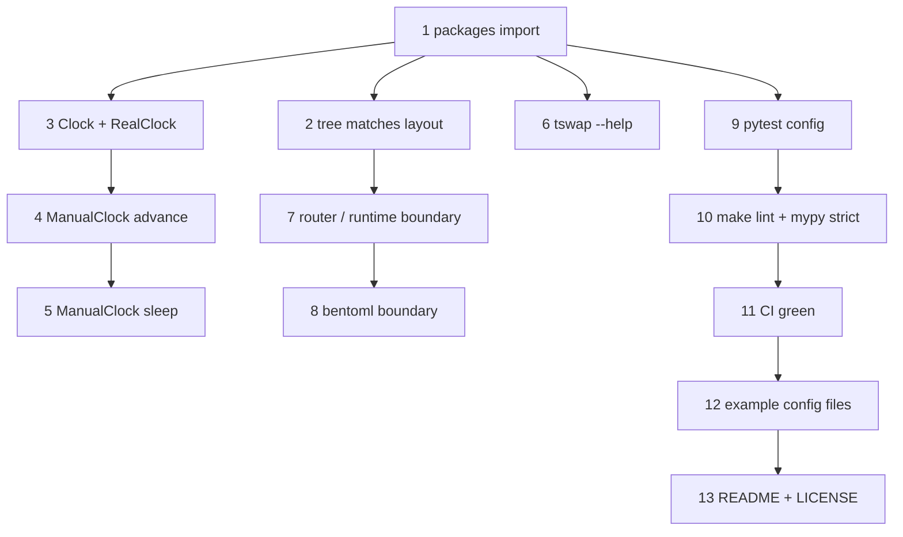

# M0 — Repository skeleton: wired project, zero running code

**Intake:** GitHub issue [iar3-r8/tool-swap#1](https://github.com/iar3-r8/tool-swap/issues/1)
**Type:** feature (not a bugfix)
**Proposed branch:** `feature/m0-repository-skeleton`
**Test command:** `pytest` (exposed as `make test`; see §5)
**Reference docs:** [`plan/09_IMPLEMENTATION_PLAN.md`](../09_IMPLEMENTATION_PLAN.md:53) §M0, [`plan/08_REPO_LAYOUT.md`](../08_REPO_LAYOUT.md:5) §1–§5, [`plan/01_ARCHITECTURE.md`](../01_ARCHITECTURE.md:300) §12, [`plan/10_TESTING_STRATEGY.md`](../10_TESTING_STRATEGY.md:31) §2

---

## 0. What this milestone is, and what it is not

M0 produces a repository where **nothing runs and everything is wired**: two distributions,
lint/type/test tooling, two import-boundary contracts, CI, and exactly one piece of real
logic — the injectable clock that every later milestone's tests depend on.

The temptation to resist is writing "just a little" of M1's config loader or M2's backend
protocol because the directories exist. **The directories are for the reader, the code is for
the milestone that owns it.** Anything in this repo after M0 that is not in the behaviour list
below is scope creep, and it will be reviewed as such.

The second thing M0 buys is stated explicitly in the implementation plan
([`09_IMPLEMENTATION_PLAN.md`](../09_IMPLEMENTATION_PLAN.md:58)): the two import-linter rules
land **now, while there is no code to violate them.** Retrofitting a boundary after imports
have spread is how seams die. So behaviours 9 and 10 are not "tooling chores" — they are the
milestone's load-bearing deliverable, and they are the ones most likely to be skipped under
pressure.

---

## 1. Decisions taken while planning (flag any you disagree with)

These were ambiguities in the Definition of Done. Each is recorded with its reasoning so a
reversal is cheap.

### D-M0-1 — "Directory tree matches §1 exactly" means *directories*, not *leaf modules*

[`08_REPO_LAYOUT.md`](../08_REPO_LAYOUT.md:5) §1 names roughly ninety leaf modules that belong
to M1–M10 (`scheduler/policy.py`, `api/run.py`, `preflight/checks/*.py`, …). Creating them all
as docstring-only stubs would satisfy a literal reading and produce a repository where a
reader cannot tell what exists from what is merely promised — and where `mypy --strict` and
coverage both report on files with no content.

**Decision:** M0 creates **every directory** from §1 with an `__init__.py` carrying a real
module docstring stating what that package will own, plus **only the leaf files M0 itself
needs**:

| Created in M0 | Deferred to its owning milestone |
|---|---|
| `src/tool_swap/__init__.py`, `__main__.py` | `config/*.py`, `schema/*.py`, `registry/*.py` (M1) |
| `src/tool_swap/utils/clock.py`, `utils/ids.py` | `scheduler/*.py`, `lifecycle/*.py`, `backend/*.py` (M2) |
| `src/tool_swap/cli/main.py` | `proxy/*.py`, `api/*.py` (M3), `preflight/**` (M5.5) |
| `src/tool_swap_runtime/__init__.py`, `backends/__init__.py` | `server.py`, `decorator.py`, … (M4) |
| `src/tool_swap_runtime/backends/NATIVE.md` (stub, per §1's note that it is a document) | `bentoml_backend.py` (M4) |
| `tests/` tree with `conftest.py` | the fakes themselves (`FakeBackend` M2, `FakeProbe` M2) |
| `docker/`, `templates/`, `docs/`, `deploy/`, `models/` as directories with a `README.md` naming their owner milestone | Dockerfiles (M5), templates (M5), doc bodies (M10) |

`utils/ids.py` is included because it is trivial and `utils/` would otherwise hold one file.
`models/.gitignore` is included because §1 calls for it and it is load-bearing for the zoo.

**If you prefer the literal reading**, say so and I will convert every deferred leaf into a
docstring-only stub; behaviour 2's assertion list simply grows.

### D-M0-2 — `docker-compose.yml` is deferred to M5/D8, not stubbed

§1 lists it, but a compose file that references an unbuildable `docker/router.Dockerfile` is
worse than its absence: it invites `docker compose up` and fails confusingly. The
`docker/README.md` records that it arrives with the build pipeline.

### D-M0-3 — BentoML is **not** pinned or installed in M0

[`08_REPO_LAYOUT.md`](../08_REPO_LAYOUT.md:200) §3 requires `bentoml==X.Y.Z` pinned in the
runtime distribution. M0 has no runtime code and CI must stay under ~2 minutes with no
Docker ([§5](../08_REPO_LAYOUT.md:231)). Installing BentoML's full tree to lint an empty
package buys nothing and would make M0's CI the slowest part of the repo.

**Decision:** `tool-swap-runtime` declares no `bentoml` dependency in M0; the pin is chosen in
**M3.5** (the spike that exists precisely to validate it) and added in **M4**. This has one
consequence for behaviour 10 — see its "Implementation risk" note, because a `forbidden`
contract naming an uninstalled external package is the one place import-linter can silently
pass.

### D-M0-4 — Licence: **Apache-2.0** unless you say otherwise

The DoD requires a `LICENSE` but names none. Apache-2.0 is the safe default for a
container/infrastructure project intended to be installed into third-party images (explicit
patent grant, permissive). **This one genuinely needs your confirmation** — it is far cheaper
to choose now than to relicense after external contributions.

### D-M0-5 — Python: `requires-python >= 3.12` for the router, `>= 3.10` for the runtime

Directly from [`08_REPO_LAYOUT.md`](../08_REPO_LAYOUT.md:208) §3: the runtime must install into
older vendor base images, the router runs where we choose. CI matrixes the runtime over 3.10 /
3.11 / 3.12 and the router over 3.12 only.

### D-M0-6 — This plan lives in a gitignored `plan/task/` directory

Per your instruction. **`plan/task/` must be added to `.gitignore`** by the implementing mode
(architect mode cannot edit non-Markdown files). Append it *below* the Anvil marker, as
`setup-repo` does:

```gitignore
plan/task/
```

Note the consequence: this plan will not travel with the pull request, so the PR description
must carry its own summary of what was built and why.

---

## 2. Behaviours — one per TDD red/green cycle

Ordered so that each cycle's test can actually run once the previous cycle is green. Cycles
1–2 are the bootstrap: until the packages import, no other test can even be collected.

Several behaviours assert on **configuration and tooling** rather than on Python functions.
That is deliberate and it is the only honest way to test M0: the milestone's product *is* the
wiring. Where a test would merely restate a config file, it is written instead as a test of the
**effect** — that `make -n lint` names ruff and mypy, that a marked test is deselected, that a
deliberately-violating fixture is rejected. A test asserting `pyproject.toml` contains the
string `"strict = true"` is worthless; a test asserting mypy actually rejects an untyped
function is not.

---

### Behaviour 1 — Both distributions install and import, and expose a version

**Inputs:** a fresh clone; `pip install -e ".[dev]"` (or `uv pip install -e`).
**Outputs:**
- `import tool_swap` succeeds; `tool_swap.__version__` is a non-empty PEP 440 string.
- `import tool_swap_runtime` succeeds; `tool_swap_runtime.__version__` is a non-empty PEP 440 string.
- `importlib.metadata.version("tool-swap")` equals `tool_swap.__version__`; likewise for
  `tool-swap-runtime` (**no drift between the packaged and the declared version**).
- Both modules have a non-empty `__doc__`.

**Edge cases:**
- The two distributions have **independent** version numbers and must not be asserted equal to
  each other (the runtime's version is stamped into images as `runtime_version`; the router's
  is not).
- `src/` layout: the test must fail if the package is importable only from the repo root
  (i.e. it must exercise the installed package, not a stray `sys.path` entry).
- Editable install and wheel install must both expose the same metadata.

**Error behaviour:** a missing distribution raises
`importlib.metadata.PackageNotFoundError` — the test asserts the real exception type rather
than catching broadly, so a typo'd distribution name in `pyproject.toml` fails loudly.

**Notes for the implementer:** the two distributions in one repo need either two
`[project]` tables in separate `pyproject.toml` files or one build backend configured for two
packages. Recommended: a root `pyproject.toml` for `tool-swap` and
`packaging/runtime/pyproject.toml` (or `src/tool_swap_runtime/pyproject.toml`) for
`tool-swap-runtime`, with `hatchling` as the backend. **Confirm the layout with the user before
implementing** — it constrains how M5's generated Dockerfiles install the runtime
([`08_REPO_LAYOUT.md`](../08_REPO_LAYOUT.md:206) leaves "copy the wheel in vs publish to an
index" open, and asks that it be decided early).

---

### Behaviour 2 — The package tree matches the layout document

**Inputs:** the repository root path (discovered from the test file, not hardcoded).
**Outputs:** for every directory named in [`08_REPO_LAYOUT.md`](../08_REPO_LAYOUT.md:5) §1 under
`src/`:
- the directory exists;
- it contains `__init__.py`;
- that `__init__.py` has a module docstring of at least ~20 characters (a docstring, not a
  placeholder character).

Plus: `tests/unit/{config,scheduler,lifecycle,proxy,api,cli}`, `tests/runtime/contract`,
`tests/integration`, `tests/e2e` exist, and `docker/`, `templates/`, `docs/`, `deploy/`,
`models/` exist.

**Edge cases:**
- `src/tool_swap_runtime/backends/` must exist **and** contain `NATIVE.md`; the test asserts
  `NATIVE.md` is a file and that no `native/` package directory exists — §1 is explicit that
  its promotion to a package is a recorded decision, not a refactor, so **the test is what
  makes that promotion visible**.
- Test directories are deliberately **not** packages (no `__init__.py`) — pytest rootdir-based
  collection. The test must not demand `__init__.py` there.
- The expected-directory list is data in the test, one entry per line, so extending it in M1+
  is a one-line diff.

**Error behaviour:** the failure message lists **every** missing path at once, not the first —
a test that reports one missing directory per run turns this into a dozen red/green cycles.

---

### Behaviour 3 — `Clock` protocol and `RealClock`

**Inputs:** `from tool_swap.utils.clock import Clock, RealClock`; `RealClock()`.
**Outputs:**
- `Clock` is a `typing.Protocol`, `@runtime_checkable`, with exactly `now() -> float` and
  `async sleep(seconds: float) -> None` ([`01_ARCHITECTURE.md`](../01_ARCHITECTURE.md:321) §12).
- `isinstance(RealClock(), Clock)` is `True`; `isinstance(ManualClock(), Clock)` is `True`.
- `RealClock().now()` returns a `float` that is **monotonic non-decreasing** across two calls.
- `await RealClock().sleep(0.01)` returns after at least ~0.01 s of elapsed monotonic time.

**Edge cases:**
- `now()` must be **monotonic**, not wall-clock: `time.monotonic()`, never `time.time()`. TTL
  arithmetic on a wall clock breaks on NTP steps and DST — an eviction storm at 02:00. The test
  asserts non-decreasing over repeated calls; the choice of source is enforced by review and
  by the docstring stating why.
- `runtime_checkable` protocols only check method **presence**, not signatures. The test must
  therefore also assert the signature via `inspect.signature`, or the protocol gives false
  confidence.
- `await RealClock().sleep(0)` must return promptly and must still yield to the event loop.

**Error behaviour:** `RealClock().sleep(-1)` — `asyncio.sleep` accepts negatives and returns
immediately. Decide and test one way: **raise `ValueError`** on negative durations in both
clocks, so that a sign error in M6's backoff arithmetic surfaces as a crash rather than a busy
loop. (Alternative — clamp to 0 and log — is available; it makes the bug quieter, which is why
it is not the recommendation.)

---

### Behaviour 4 — `ManualClock.now()` and `advance()`

This is the behaviour the Definition of Done names explicitly.

**Inputs:** `ManualClock()`; `ManualClock(start=100.0)`; `advance(seconds)` calls.
**Outputs:**
- `ManualClock().now() == 0.0` (documented default start).
- `ManualClock(start=100.0).now() == 100.0`.
- `advance(5)` then `now() == 5.0`; `advance(5)` again then `now() == 10.0` (**accumulates**).
- `advance()` returns `None` — it is a command, not a query.
- `now()` is pure: calling it repeatedly never changes the time.

**Edge cases:**
- `advance(0)` is a no-op that must not raise (M6 tests do it at boundaries).
- Fractional advances accumulate without visible float drift: `advance(0.1)` × 10 lands within
  `1e-9` of `1.0`. Assert with `pytest.approx`, **never** `==`, and say why in a comment — a
  future contributor "tidying" this into `== 1.0` reintroduces a flaky test.
- Large advances (`advance(1800)` — the 30-minute idle scenario from
  [`10_TESTING_STRATEGY.md`](../10_TESTING_STRATEGY.md:54)) are exact.
- Two `ManualClock` instances are fully independent (no class-level mutable state).

**Error behaviour:** `advance(-1)` raises `ValueError` naming the argument and the received
value. Time moving backwards in a TTL test would produce a passing test asserting impossible
behaviour, which is worse than a crash.

---

### Behaviour 5 — `ManualClock.sleep()` advances time and yields control

**Inputs:** an `asyncio` event loop; `await clock.sleep(seconds)`; concurrent tasks.
**Outputs:**
- `await clock.sleep(30)` returns **immediately in wall-clock terms** (the whole test body
  completes in well under a second) while `clock.now()` has advanced by exactly 30.
- After `sleep`, a second task scheduled on the loop **observes the new time** — the
  `await asyncio.sleep(0)` in the reference implementation
  ([`10_TESTING_STRATEGY.md`](../10_TESTING_STRATEGY.md:45)) is what makes this true, and the
  test must be able to fail if it is removed.
- Sequential sleeps accumulate: `sleep(10)`, `sleep(20)` ⇒ `now() == 30`.

**Edge cases:**
- The yield assertion needs a real observer: spawn a task that records `clock.now()` when it
  next runs, `await clock.sleep(30)`, then assert the recorded value is `30`. Asserting only
  that `now()` changed would pass without the yield and the test would not protect the
  property it exists for.
- `await clock.sleep(0)` advances by nothing but still yields.
- Two tasks sleeping concurrently: document the resulting `now()` and assert it. Time is a
  single shared scalar, so concurrent sleeps **sum** rather than overlap — which is *not* how
  real time behaves. This is a known, accepted limitation of the fake; record it in the
  docstring so an M6 test author is not surprised, and assert the actual behaviour so it
  cannot change silently.
- Requires `pytest-asyncio`; `asyncio_mode` must be configured (recommend `strict` with
  explicit `@pytest.mark.asyncio`, so async tests can never be silently skipped).

**Error behaviour:** `await clock.sleep(-1)` raises `ValueError`, consistent with behaviour 3.

---

### Behaviour 6 — `tswap --help` prints usage and exits 0

**Inputs:** `tswap --help`; `tswap` with no arguments; `python -m tool_swap --help`.
**Outputs:**
- Exit code `0`; stdout contains `Usage:` and the program name `tswap`.
- Stdout contains the one-line description of the router.
- **`python -m tool_swap --help` produces byte-identical output to `tswap --help`** (modulo the
  program name), because both must route through the same typer app object — two entry points
  that drift is a class of bug worth designing out on day one.
- `tswap` with no arguments prints help and exits **0** (`no_args_is_help=True`), not `2`. An
  operator typing `tswap` to see what exists has not made an error (**R1**).

**Edge cases:**
- Terminal-width-dependent line wrapping: assert on substrings, never on whole rendered
  blocks, and set `COLUMNS`/`TERM` in the test environment so CI and local agree.
- Rich colour codes: run through typer's `CliRunner` (or set `NO_COLOR=1`) so assertions see
  plain text.
- M0's app has **no subcommands**. `no_args_is_help` on a command-less typer app is a known
  sharp edge — verify the exit code empirically rather than trusting the flag's documentation
  ([`.roo/rules/coding-guidelines.md`](../../.roo/rules/coding-guidelines.md) — never document
  a flag from memory).
- The `tswap` console script only exists after install; the test should prefer `CliRunner`
  (fast, no subprocess) and cover the installed-script path once, so a broken
  `[project.scripts]` entry is still caught.

**Error behaviour:** `tswap --nonexistent-flag` exits with typer's usage error code (`2`) and
writes to stderr. `tswap doesnotexist` likewise. Assert the code and the stream, not the text.

---

### Behaviour 7 — Import boundary: the router and the runtime are strictly separate

**Inputs:** the repository; `lint-imports` (import-linter) with the contracts in
`.importlinter` (or `pyproject.toml`'s `[tool.importlinter]`).
**Outputs:**
- `lint-imports` exits `0` on the repository as committed.
- Two `forbidden` contracts are configured and **enforced**:
  `tool_swap` ⊥ `tool_swap_runtime`, and `tool_swap_runtime` ⊥ `tool_swap`.
- **The contracts have teeth**: given a fixture package tree containing a deliberate violation
  and an equivalent contract, `lint-imports` exits non-zero and names the offending import.

**Edge cases:**
- §1 requires the boundary in **both** directions ("The router must never import the runtime
  and vice versa"); the issue text names only one. Configure both — the reverse rule is free
  and the runtime importing the router would be the more damaging direction, since it would
  drag the router's dependency tree into every model image.
- Contracts must also forbid the router's own deps (`docker`, `typer`, `rich`) from
  `tool_swap_runtime`. **Recommended but optional in M0**: it is the mechanical guarantee behind
  §3's "the router's deps must never leak into a model image", and it is cheapest to add while
  the runtime has no imports at all.
- With both packages empty, a contract can pass because there is nothing to analyse. Hence the
  fixture test above — without it, this behaviour cannot fail and is therefore not tested.

**Error behaviour:** a violation exits non-zero with a report naming the importing module, the
imported module, and the line. The CI job must surface that report in the log, not just the
exit code.

---

### Behaviour 8 — Import boundary: `bentoml` only inside `tool_swap_runtime/backends/`

Separately numbered because it is a distinct contract with a distinct failure mode, and
because [`09_IMPLEMENTATION_PLAN.md`](../09_IMPLEMENTATION_PLAN.md:58) singles it out (**D14**,
[`05_RUNTIME_AND_BATCHING.md`](../05_RUNTIME_AND_BATCHING.md) §2.4).

**Inputs:** the repository; `lint-imports`.
**Outputs:**
- A contract forbids `bentoml` from every `tool_swap_runtime` module **outside**
  `tool_swap_runtime.backends`, and from `tool_swap` entirely.
- `lint-imports` exits `0` as committed.
- The contract rejects a fixture in which a non-`backends` runtime module imports `bentoml`.
- **Anti-rot guard:** a unit test enumerates the modules under `src/tool_swap_runtime/`
  (excluding `backends/`) and asserts each appears in the contract's `source_modules`. Without
  it, M4 adds `predict_wrapper.py`, forgets the contract line, and the boundary is silently
  narrower than it looks — which is precisely the "convenience import" failure §1 warns about.

**Edge cases:**
- `backends/base.py` must not import bentoml either (§1: "no framework import"). Whether to
  encode that as a third contract or leave it to review: **encode it** — it is the module most
  likely to acquire a "just one type annotation" import, and that annotation is exactly what
  makes **D14** irreversible.
- **Implementation risk (from D-M0-3):** import-linter needs
  `include_external_packages = True` to see external imports, and behaviour with an
  *uninstalled* external package must be verified rather than assumed. If an uninstalled
  `bentoml` makes the contract vacuous, add a belt-and-braces AST test (walk
  `src/tool_swap_runtime/`, parse each file, assert no `Import`/`ImportFrom` node resolves to
  `bentoml` outside `backends/`). That AST test is ~15 lines, has no dependency on
  import-linter's semantics, and cannot be made vacuous — **prefer it as the primary assertion**
  and keep import-linter as the reporting layer.
- The contract must survive `import bentoml as _b`, `from bentoml import Service`,
  `from bentoml.io import JSON`, and a lazy `importlib.import_module("bentoml")`. The last one
  defeats both AST matching on import statements and import-linter; note it as a documented
  gap the code review covers, rather than pretending the tooling closes it.

**Error behaviour:** as behaviour 7 — non-zero exit, report names the module and line.

---

### Behaviour 9 — `pytest` configuration: markers, strictness, warnings-as-errors

**Inputs:** `pytest` invocations against a small set of fixture tests inside `tests/`.
**Outputs:**
- Markers `docker`, `gpu`, `slow` are registered
  ([`08_REPO_LAYOUT.md`](../08_REPO_LAYOUT.md:220) §4); `--strict-markers` is on by default via
  `addopts`.
- A test marked `@pytest.mark.docker` is **collected without warning** and **deselected** by the
  default marker expression, so a plain `pytest` on a laptop with no Docker still exits `0`
  ([`10_TESTING_STRATEGY.md`](../10_TESTING_STRATEGY.md:20) §1: L1/L2 need nothing).
- A test marked with an **unregistered** marker fails collection (proves `--strict-markers` is
  actually in effect).
- `filterwarnings = ["error"]` is in effect: a test emitting a `DeprecationWarning` from our own
  code fails ([§4](../08_REPO_LAYOUT.md:223), zero-warnings policy).
- `pytest` on the repository as committed exits `0` (the DoD's "empty suite exits 0" — by M0's
  end the suite is not empty, but it must be green).

**Edge cases:**
- **How `docker`/`gpu` tests are excluded by default is a design choice with consequences.**
  Recommended: `addopts = "-m 'not docker and not gpu'"` so the default is safe, with
  `make test-docker` overriding. The alternative (a `conftest.py` autoskip based on daemon
  reachability) hides the tests' existence and lets a broken daemon look like a pass. Note the
  cost: `-m` in `addopts` means `pytest -m docker` alone will **not** work — it must be
  `pytest -m docker --override-ini` or the Makefile target. Document it in the Makefile help,
  or M2 will lose an afternoon to it.
- `filterwarnings = error` will trip on third-party deprecations (a known nuisance with
  pydantic/starlette). Add narrow `ignore::` entries **with a comment naming the package and
  the reason**, never a blanket ignore.
- A meta-test that runs pytest inside pytest must use `pytester`/`CliRunner` with an isolated
  `rootdir`, or it inherits the repo's own config and asserts nothing.

**Error behaviour:** an unregistered marker exits `4` (usage/collection error) with a message
naming the marker. A warning-as-error surfaces as a normal test failure with the warning text.

---

### Behaviour 10 — `make lint` is clean, and mypy is genuinely strict

**Inputs:** `make lint`; `make typecheck`; `make format`; `make test`; `make -n <target>`.
**Outputs:**
- `make lint` runs ruff (check + format check) **and** mypy strict over `src/`, exits `0` with
  zero findings and zero warnings on the repo as committed.
- **Strictness is proven by effect, not by config:** mypy rejects a fixture module containing an
  untyped function definition and an implicit `Any` return. A test asserting
  `"strict = true"` appears in `pyproject.toml` proves only that a string exists.
- `make test` runs pytest and exits `0`.
- Every target the DoD and daily work need exists: `lint`, `format`, `typecheck`, `test`,
  `test-docker`, `help`. `make help` lists them (discoverability — an operator-facing surface,
  **R1**).
- `make -n lint` output names both `ruff` and `mypy`, so a target that silently stopped running
  one of them is caught.

**Edge cases:**
- Ruff line length **88** and Black-compatible formatting, per
  [`.roo/rules/coding-guidelines.md`](../../.roo/rules/coding-guidelines.md). Note the tension:
  the repo rules say Black, [`08_REPO_LAYOUT.md`](../08_REPO_LAYOUT.md:218) §4 says ruff for
  lint *and* format. **Recommendation: `ruff format` only, configured to 88 columns** — one
  formatter, matching the parent project's tooling; running both invites a formatting war in
  CI. Flag if you want Black itself.
- Docstring style: Google, enforced by ruff's `D` rules with `convention = "google"` and
  `D` enabled for `src/` but relaxed for `tests/` (a docstring on every test function is noise).
- `mypy --strict` on the `tests/` tree is a separate decision. Recommend **src/ only** in M0 to
  keep the suite writable, with a note that `disallow_untyped_defs` for tests can be added in
  M10 if drift appears.
- Makefile must work with `uv` present or absent (§3 wants `uv` with a pip fallback); the
  targets should not hardcode a virtualenv path.

**Error behaviour:** any finding exits non-zero and prints the ruff/mypy report. `make lint`
must **not** auto-fix — a lint target that mutates the tree makes CI and local disagree about
what was committed.

---

### Behaviour 11 — CI runs lint, type-check and tests on a fresh clone

**Inputs:** `.github/workflows/ci.yml`; a push/PR event.
**Outputs:**
- The workflow file is valid YAML and defines jobs covering **lint**, **type-check** and
  **test** (asserted by parsing the workflow, so a rename cannot silently drop a gate).
- The workflow includes the import-linter step
  ([`08_REPO_LAYOUT.md`](../08_REPO_LAYOUT.md:231) §5 lists **both** rules as CI content).
- It requires **no local files** — no `.env`, no `tools.yaml`. A test asserts that nothing in
  the M0 test suite reads `.env` or a gitignored path; CI's own green run is the real proof.
- Triggers: `pull_request` and `push` to the default branch.
- No Docker, no GPU steps in `ci.yml` (§5: it must finish in ~2 minutes).

**Edge cases:**
- The runtime must be tested on 3.10 / 3.11 / 3.12 (§3). M0 can matrix the test job over the
  three and keep lint/type-check on 3.12 only, to stay inside the time budget.
- `integration.yml` and `release.yml` are named in §5 but belong to M2 and M10 respectively.
  **Recommendation: do not create empty workflow files** — a workflow that exists and runs
  nothing shows as a green check and is worse than a missing one.
- A test that asserts CI *content* can drift from CI *behaviour*. Keep the assertions coarse
  (jobs exist, steps mention the tools) and let the real run be the real test.

**Error behaviour:** a malformed workflow surfaces as a GitHub Actions parse error, not a test
failure — hence the local YAML-parse test, which catches the common case before push.

---

### Behaviour 12 — Example configuration and environment files are present and parseable

**Inputs:** `tools.example.yaml`; `.env.example`.
**Outputs:**
- `tools.example.yaml` exists and parses as YAML into a mapping.
- `.env.example` exists and documents `HF_TOKEN`, `HF_HOME`, `TSWAP_TOKEN`, `TSWAP_PORT`
  ([`08_REPO_LAYOUT.md`](../08_REPO_LAYOUT.md:13) §1), each with a comment saying what it is for
  and whether it is required.
- Every line in `.env.example` is either blank, a comment, or `KEY=value` (so `set -a; source`
  cannot break).
- `TSWAP_PORT` defaults to `8600` ([§2](../08_REPO_LAYOUT.md:187)).

**Edge cases:**
- **Schema validation of `tools.example.yaml` belongs to M1**, not M0 — there is no schema yet.
  M0 asserts parseability only; M1's DoD adds "`tools.example.yaml` validates" to CI. Say so in
  a comment in the test, or someone will "fix" the weak assertion by inventing a schema early.
- `.env.example` must contain **no real secrets** — assert no value looks like a populated
  token (e.g. `HF_TOKEN=` is empty or an obvious placeholder). Cheap, and it catches the
  accident that matters.
- Is `tools.example.yaml` a *working* multi-model example (§1) at M0? It cannot be — no models
  exist. Ship a **commented, minimal, clearly-marked-illustrative** file and let M1/M3 make it
  real. Note it in the file itself so a reader does not try `tswap up` against it.

**Error behaviour:** malformed YAML raises `yaml.YAMLError` and the test asserts that specific
type, so an unrelated `IOError` cannot be mistaken for a passing parse.

---

### Behaviour 13 — README skeleton with description, architecture link and getting started

**Inputs:** `README.md`; `LICENSE`.
**Outputs:**
- `README.md` contains: a one-paragraph project description; a link to the architecture
  document; a "Getting started" section referencing the plan; a placeholder marked clearly as
  a placeholder for the quickstart.
- Every relative link in `README.md` resolves to a file that exists (the "docs link check" from
  [§5](../08_REPO_LAYOUT.md:231)).
- `LICENSE` exists, is non-empty, and its identifier matches `pyproject.toml`'s
  `license` field (Apache-2.0 per **D-M0-4**).

**Edge cases:**
- The link checker must skip external `http(s)://` links (no network in CI) and handle anchors
  (`docs/x.md#section`) by checking the file, not the anchor.
- The quickstart placeholder must **not** contain runnable commands that do not yet work.
  [§6](../08_REPO_LAYOUT.md:254) requires the quickstart to be executed by
  `tests/e2e/test_quickstart.py` so it cannot rot; at M0 there is nothing to execute, so the
  honest form is a placeholder plus a note naming the milestone (M3) that fills it. A README
  promising `tswap up` before M3 is documentation that lies.
- The link check should cover `plan/` links too, since this README points into the plan set.

**Error behaviour:** a broken link fails with the source line and the unresolved target. A
licence mismatch fails naming both values.

---

## 3. Sequencing



Behaviours 3–5 are the only ones producing product logic; they are the milestone's real
content and should not be rushed to reach the tooling items.

---

## 4. Definition of Done — traceability

| DoD item (issue #1) | Behaviour |
|---|---|
| `make lint` clean (ruff + mypy strict, zero warnings) | 10 |
| `make test` runs the suite and exits 0 | 9, 10 |
| `tswap --help` prints usage (via `python -m tool_swap`) | 6 |
| Import-linter: `tool_swap` ⊥ `tool_swap_runtime` | 7 |
| Import-linter: `bentoml` only in `backends/` | 8 |
| `ManualClock` unit-tested on tick/advance | 4, 5 |
| CI green on a fresh clone | 11 |
| Directory tree matches §1 | 2 (scoped by **D-M0-1**) |
| README: description, architecture link, get started | 13 |
| `pyproject.toml` with two distributions | 1 |
| `.env.example`, `tools.example.yaml`, Makefile | 10, 12 |
| `LICENSE` | 13 |
| `Clock` + `RealClock` + `ManualClock` | 3, 4, 5 |

---

## 5. Test command

`pytest`, wrapped as `make test`. Docker/GPU markers are excluded by default (behaviour 9), so
the command is valid on any machine including this dev container. Confirm after behaviour 1
lands that `pytest` runs from a clean checkout with only `pip install -e ".[dev]"`.

---

## 6. Open questions for the user

1. **Licence** — Apache-2.0 (**D-M0-4**)? This is the one item that is genuinely expensive to
   change later.
2. **Two-distribution layout** — root `pyproject.toml` + a second one for the runtime, or a
   single file with two build targets? It constrains M5's generated Dockerfiles
   ([`08_REPO_LAYOUT.md`](../08_REPO_LAYOUT.md:206) asks that this be decided early).
3. **Tree fidelity** — packages-only (**D-M0-1**) or literal stub-every-leaf?
4. **Formatter** — `ruff format` only, or Black as the repo coding guidelines say? (§4 of the
   layout doc says ruff for both.)
5. **`plan/task/` gitignore entry** — architect mode cannot edit `.gitignore`; the implementing
   mode must add it (**D-M0-6**).
