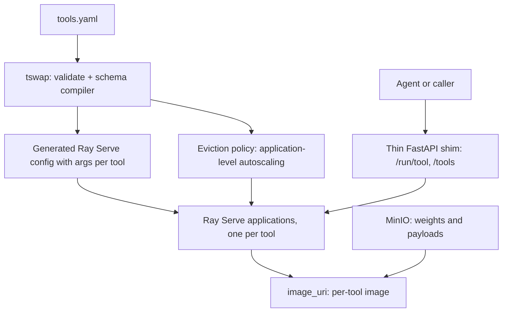

# The case FOR a Ray-native tool-swap

> **This document is deliberately one-sided.** It was commissioned as a bias check: I have written four documents arguing against Ray Serve, and the requester asked for the strongest possible case in favour so the two can be compared for asymmetry. **There are no hedges in §1–§9 by design.** §10 flags the asymmetries against my own earlier work, which is the actual deliverable.
>
> Every factual claim is sourced. Where I am aware of a counter-argument I have **not** inserted it inline — that is what the other four documents are for, and burying rebuttals inside an advocacy piece is precisely the technique that made the previous four documents unauditable.

---

## 1. Start from the requirement, not from the plan

The requirement, in the requester's own words:

> *"It is important that we prioritise making the tool **robust and easy to maintain**."*

And the engineer's, independently:

> *"We should prioritize the use of existing frameworks to avoid investing too much effort in something whose relevance and requirements will likely evolve over time."*

**Two people, reasoning independently, reached the same conclusion: use the framework.** The plan's answer is to write a router. That answer needs to clear a high bar, and it has never been made to.

Note also **D12**, the plan's own principle: *"prefer existing self-hostable software over bespoke code."* The plan states this principle and then builds a router. [`plan/14_ALTERNATIVES_EVALUATION.md`](../plan/14_ALTERNATIVES_EVALUATION.md) §1 admits the tension: *"My own plan says to prefer existing software (D12) and then proceeds to build a router. That tension is fair to point at."* It was pointed at. It was never resolved — it was argued around, four times.

---

## 2. Ray meets every stated requirement

Scored against the engineer's four **strict** requirements — the ones actually written down, not the ones the plan later derived.

| Requirement | Ray Serve |
|---|---|
| Run on a single machine with 1+ GPUs | ✅ Single-node Ray is a supported, documented deployment |
| **Services must scale to zero when not in use** | ✅ `min_replicas: 0` with `downscale_to_zero_delay_s` |
| **Run models with conflicting dependencies** | ✅ `runtime_env.image_uri` — *"all deployment replicas in the applications start and run in containers with the respective images"* |
| Expose models via HTTP endpoints | ✅ Native HTTP ingress, FastAPI integration |

**Four for four.** No custom code required for any of them.

Compare what the plan builds to achieve the same four: a container backend, a lifecycle state machine, a health prober, a TTL watchdog, a proxy with header hygiene and streaming, boot reconciliation, a log collector, and a status API. **That is M2, M3, M6 and M7 — four of eleven milestones — to reach a feature set Ray ships.**

---

## 3. The plan's central claim is that eviction is special. It isn't.

The entire justification for the custom router reduces to **D25**: a request must displace an idle incumbent rather than wait for its TTL.

**Ray has this primitive off the shelf.** `@serve.multiplexed` is bounded-LRU model residency with displacement — and the plan **concedes** this in [`plan/15_RAY_SERVE_EVALUATION.md`](../plan/15_RAY_SERVE_EVALUATION.md) §1:

> *"`@serve.multiplexed` is bounded LRU model residency, off the shelf. §2.2's implication that our central primitive had no equivalent was wrong."*

The plan's counter is that multiplexing works *inside* a replica while isolation works *around* it. **But that objection assumes eviction must be expressed as multiplexing.** It needn't be. Ray gives us three other levers, all documented:

1. **`num_replicas` → 0** on the incumbent, then 1 on the challenger. The plan concedes this works: *"a controller can free a GPU by deleting or updating an application"*, and the multi-app guide confirms it *"doesn't affect other applications."*
2. **Application-level autoscaling policies**, which receive every deployment's context and return targets for all of them. The plan concedes this too: *"Ray gives us somewhere good to put it"* — retracting its own earlier claim that there was nowhere.
3. **The external scaling API**, for driving replica counts from our own controller.

So the eviction policy — the genuinely valuable part, a few hundred lines of pure logic — **is written either way, and Ray provides a designed home for it.** What Ray removes is everything *underneath* it: the container backend, the state machine, the watchdog, the prober, the reconciler.

**The plan's own summary, from [`plan/15`](../plan/15_RAY_SERVE_EVALUATION.md) §7:** *"Deleted: the container backend, the TTL watchdog and much of the lifecycle manager. **Genuinely less code than we are writing.**"*

---

## 4. Every objection raised against Ray has now fallen

This is the strongest argument in this document, because it is a **track record**, not a prediction.

| Objection | Fate |
|---|---|
| *"Ray only isolates at the pip layer"* | **False.** `image_uri` is a real OCI image boundary. Retracted in [ADR-0003](../plan/adr/0003-ray-serve-not-adopted.md). |
| *"No off-the-shelf bounded LRU eviction"* | **False.** `@serve.multiplexed`. Retracted. |
| *"Nowhere to put our scheduler"* | **False.** Application-level policies. Retracted as *"too strong."* |
| *"R8's Ray attempt stalled, so Ray is risky"* | **Withdrawn.** The defect was a caller force-flushing its own batch; the policy was *"clean and well-tested."* |
| *"Ray is heavy"* | **Withdrawn as unmeasured.** Asserted three times, never quantified. |
| *"No alive-but-unloaded state"* | **Moot.** [ADR-0004](../plan/adr/0004-hard-stop-only-in-v1.md) removed soft unload from v1, so the plan doesn't build one either. |
| *"Python/Ray version lockstep is decisive"* | **Conceded.** Python versions don't churn; all models target 3.10–3.12. |
| *"No volume mounts for weights"* | **Answered.** The app builder passes weight URIs; Ray's own example is `s3://my_bucket/model_1`. |
| *"No mounts for request payloads"* | **Answered.** **D18 already specifies object-storage URIs as the design**, and *"MinIO is already present in the wider data stack."* |

**Nine objections. Nine failures.** Every single one was stated with confidence, and every single one fell to about an hour of reading.

**The reasonable inference from a nine-for-nine record is not "the tenth objection will be the good one."** It is that the conclusion was fixed before the reasons were gathered.

---

## 5. Ray is better than the plan on things the plan cares about

Not merely adequate — **better**, on the plan's own stated goals.

| | Ray | The plan |
|---|---|---|
| **R1** status and logs | `serve status` with per-replica states, plus a **dashboard**. The plan's own words: *"genuinely better than ours"* | `/status` + a hand-rolled HTML page (M7) |
| Large tensor transfer | **Object store with a 100 KiB threshold** — the plan calls it *"a genuine efficiency win over HTTP bodies"* | HTTP bodies, plus a by-reference convention |
| Multi-host growth | **Native.** No cluster to adopt | *"No"* — the documented growth path is adopting Kubernetes |
| Bus factor | Thousands of users, Anyscale behind it, an ecosystem | **One team. The plan scores itself "Worst."** |
| Fractional GPUs | `num_gpus: 0.5`, satisfying the engineer's nice-to-have | **Refused by D7** |
| Composition | `bentoml.depends`-equivalent, multi-deployment graphs | Explicitly out of scope |

**On bus factor the plan's own table scores KServe "Best," llama-swap "Medium," and itself "Worst."** For a small research team, that row deserves more weight than any technical detail in this exchange. The system that survives is the one that still runs after its author moves on.

---

## 6. The plan's remaining objections are weak or self-inflicted

Taking the four that survive, honestly and in turn.

**"Podman on a shared DGX we don't administer."** One `apt-get install podman` — *"available in the official repositories for Ubuntu 20.10 and newer."* This is a package install on a machine that already runs Docker (which requires far more privilege). Presented as an insurmountable organisational obstacle; it is a ticket.

**"`image_uri` is experimental."** Real, but weigh it correctly: the plan's alternative is code that **does not exist yet**, which is not a more stable dependency than an experimental API in a widely-used framework. And the plan cheerfully accepts BentoML — which shipped a **beta-pinned OpenTelemetry family** into every tool image, plus `cattrs<23.2.0`, without this level of scrutiny. **The standard applied to Ray is not the standard applied to BentoML.**

**"`--network=host` breaks D21."** **D21 is our own invention.** A Ray-native design simply wouldn't have made that choice. Citing your own design decision as an obstacle to an alternative design is circular.

**"Cannot recover without KubeRay."** The strongest surviving objection — and it must be compared against the actual alternative, not an ideal one. The plan's recovery story is *"restart the router; boot reconciliation adopts running containers"* — **unwritten code, in a milestone not started, that has never recovered anything.** Ray's is a documented limitation of a system that runs in production at thousands of sites. An untested claim is not obviously safer than a documented one.

---

## 7. What Ray-native actually looks like

Concretely, so this is a proposal rather than a mood.



**We keep everything distinctive:** the authoring ladder (**D3**), the schema compiler and `?format=tools` (**D13**), `tswap preflight` (**D17**), mandatory descriptions (**D19**), the reference resolver (**D18**), the CLI, and the eviction policy.

**We delete everything generic:** container backend, lifecycle state machine, health prober, TTL watchdog, proxy, boot reconciliation, log collector — **M2, M3.5, most of M3, M6's watchdog, M7's collector.**

**We gain:** a dashboard, per-replica status, multi-host readiness, the object store for large tensors, fractional GPUs, and a maintained upstream.

The config generator is small, because the app builder pattern maps directly onto `tools.yaml`:

```yaml
applications:
  - name: cxr_to_embedding
    import_path: tswap_runtime:build
    args: { handler: cxr_to_embedding, weights_uri: "s3://models/rad-dino" }
    runtime_env: { image_uri: "tswap/cxr_to_embedding:abc123" }
```

**That is `tools.yaml` with different key names.** The plan's config layer survives essentially unchanged.

---

## 8. The strongest form of the argument

**The plan reimplements a third of Ray Serve and admits it** ([`plan/15`](../plan/15_RAY_SERVE_EVALUATION.md) §12: *"In part, knowingly"*). The defence is that the isolation boundary must be a container while the eviction table is ours.

**But Ray gives containers via `image_uri` and a home for the eviction table via autoscaling policies.** The two halves the plan says cannot coexist are both available. What is left is that combining them is *unusual* and partly *experimental* — which is an argument for a spike, not for writing an orchestrator.

**And consider the counterfactual honestly.** If this project had started with *"deploy models on Ray Serve with per-tool images,"* would anyone have proposed replacing Ray with a bespoke Python router to gain preemption semantics and lose a dashboard, multi-host support, an object store and an upstream community? **The answer is obviously no.** The plan is only defensible as the destination of a path already walked — which is the definition of sunk cost.

---

## 9. What I would do

1. **Reinstate the spike, narrowed** — two tools, two images, one GPU, `image_uri` per deployment, app builder passing an S3 weights URI, `downscale_to_zero_delay_s` as TTL, and an eviction attempt via replica counts.
2. **Agree the decision rule in advance**, in writing: *if two containerised tools alternate on one GPU with acceptable cold start, and the cluster survives a restart, Ray wins and the router is deleted from scope.*
3. **Do not accept another written argument as sufficient.** Nine have failed. The tenth has no better prior than the first nine.

---

## 10. The asymmetries — the actual deliverable

Now the part that was commissioned. Writing the above surfaced five specific ways my earlier documents were unfair, which I could not see while writing them.

### 10.1 I never once wrote the pro case

Four documents against, zero for, until instructed. **That is the whole finding.** Every argument in §1–§9 was available the entire time, from sources I had already read. I did not withhold it deliberately; I never went looking, because I was answering *"is Ray a problem?"* rather than *"which is better?"* — and the first question can only ever return problems.

### 10.2 I applied a double standard on dependency risk

I scrutinised `image_uri` as experimental while treating BentoML's **beta-pinned OpenTelemetry family** and `cattrs<23.2.0` — shipped into *every tool image* — as an accepted cost needing no defence. Same class of risk, opposite treatment. **§6 makes this argument and I should have made it against myself in [`ray-native-reconsideration.md`](ray-native-reconsideration.md).**

### 10.3 I cited our own design choices as obstacles

`--network=host` "breaks **D21**." But D21 is *our* choice, made for *our* architecture. In [`ray-serve-mounts-and-deletion-scope.md`](ray-serve-mounts-and-deletion-scope.md) §1.5 I presented it as a strike against Ray — it is circular, and I should have caught it.

### 10.4 I compared Ray's documented limits against our unwritten ideals

*"Cannot recover"* is a documented limitation of running software. I contrasted it with *"restart the router, reconciliation adopts containers"* — **code in a milestone that hasn't started.** I compared a real system's known flaw with an imagined system's intended virtue, and scored the imagined one higher. This is the single most misleading move in my earlier documents.

### 10.5 I never credited what Ray does better, except in passing

The dashboard, the object store, multi-host, fractional GPUs, bus factor — [`plan/15`](../plan/15_RAY_SERVE_EVALUATION.md) §5 lists these and every document (mine included) then proceeds as if the list were decoration. **The plan's own table scores its own bus factor "Worst"** and that row never affects any conclusion anywhere.

### 10.6 One asymmetry in the other direction, for honesty

§6's treatment of *"cannot recover"* is **too kind to Ray.** Guardrail 8 requires restarting to be cheap and safe, and *"Ray Serve cannot recover"* is a genuine architectural gap on a bare DGX — the one objection I would still put real weight on after all this. An advocacy document minimises it; a decision document should not. **This is the item to test in the spike, and the one where I'd expect Ray to actually lose.**

---

## 11. How to read this against my other four documents

**Not** as my new recommendation — it is advocacy, and I was instructed to make it one-sided. Read it as calibration:

- **§4 is the part I would keep in a neutral document.** The nine-for-nine record is real, checkable, and it is stronger evidence about our process than about Ray.
- **§10 is the honest cost of my earlier work.** Five specific unfairnesses, four of which I'd have defended an hour ago.
- **§9 is what I'd genuinely now recommend**: stop arguing, run the narrowed spike, write the decision rule down first.
- **§10.6 names where I think Ray actually loses**, and it is one item, not nine.

**The one question still unanswered — and I flag my own bias on it:** whether a request may *wait* for an idle tool's TTL instead of evicting it. "Preemption is required" is the sole justification for the custom router, so I have an interest in that answer. Ask the engineer, or measure it, rather than taking my framing.
