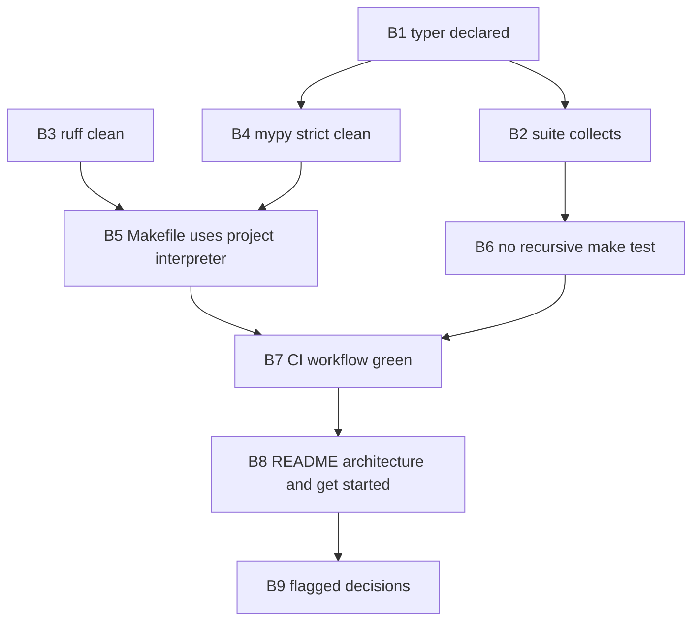

# M0 Completion Fix — Plan

**Intake:** GitHub issue [#1 — M0 — Repository skeleton: wired project, zero running code](https://github.com/iar3-r8/tool-swap/issues/1)
**Type:** bugfix (no new product capability; closes Definition-of-Done gaps left on `feature/m0-repository-skeleton`)
**Branch:** `bugfix/m0-completion`
**Test command:** `.venv/bin/pytest` (equivalently `make test` once Behaviour 5 lands)

---

## 1. Scope summary

Issue #1 has 8 Definition-of-Done items. Verified state:

| DoD item | State | Behaviour that closes it |
|---|---|---|
| `make lint` clean (ruff + mypy strict) | FAIL | B1, B3, B4 |
| `make test` runs and exits 0 | FAIL | B2, B4, B5, B6 |
| `tswap --help` prints usage | FAIL | B1 |
| Import-linter enforces boundaries | PARTIAL | B9 (flagged, see §4) |
| `ManualClock` unit-tested | FAIL (tests exist, do not collect) | B2 |
| CI green on fresh clone | FAIL (no workflow) | B7 |
| Directory tree matches `plan/08_REPO_LAYOUT.md` | PASS | — |
| README: description + architecture link + get started | FAIL | B8 |

### Two risks not in the original blocker list

- **Recursive `make test`.** [`tests/unit/test_makefile.py`](tests/unit/test_makefile.py:216) shells out to `make test`, which runs `pytest` over `tests/`, which re-collects `test_makefile.py`, which shells out to `make test` again. Today this is masked because the inner `pytest` dies on the collection error from Blocker 2. **The moment Blocker 2 is fixed, this becomes unbounded recursion** bounded only by the 120 s `timeout=` (which then fails the test). This must be fixed in the same change set — see **B6**.
- **`make lint` depends on ambient `PATH`.** [`Makefile`](Makefile:11) calls bare `ruff` / `mypy` / `pytest`. [`tests/unit/test_makefile.py`](tests/unit/test_makefile.py:73) invokes `make lint` as a subprocess, so it only passes when the venv is on `PATH`. Running the suite as `.venv/bin/pytest` (the documented command) does **not** put `.venv/bin` on `PATH`. See **B5**.

---

## 2. Behaviours (independently testable, in execution order)

### B1 — `typer` is a declared dependency, so the CLI imports and runs

- **Inputs:** [`pyproject.toml`](pyproject.toml:24); a fresh environment created from `pip install -e ".[dev]"`.
- **Change:** add `typer>=0.12` to `[project] dependencies`; add `typer` to `[project.optional-dependencies] dev` so the test extra is self-sufficient.
- **Outputs / assertions:**
  - `python -c "import typer"` succeeds in the project env.
  - `tswap --help` exits 0 and stdout contains `Usage:` and `tswap`.
  - `python -m tool_swap --help` exits 0 and contains `Usage:` and `version`.
  - `mypy src/` reports no `import-not-found` for `typer`.
  - `pyproject.toml` names `typer` in **both** `dependencies` and the `dev` extra.
- **Edge cases:**
  - `typer` is a *runtime* import at [`src/tool_swap/__main__.py`](src/tool_swap/__main__.py:3) module top level, so declaring it in `dev` only would still break `pip install tool-swap`; both places are required.
  - `typer.testing.CliRunner` in [`tests/unit/test_cli.py`](tests/unit/test_cli.py:14) requires the `click` testing extra shipped with typer — confirm `CliRunner(env=...)` and `result.stderr` are available in the resolved typer version (`result.stderr` on a non-separated runner raises on older click; if it does, that is a test-side fix, not a source fix).
  - `python -m tool_swap --help` is compared to `CliRunner` output at [`tests/unit/test_cli.py`](tests/unit/test_cli.py:167); `COLUMNS=80`/`TERM=linux` are already pinned, do not change them.
- **Error behaviour:** if typer cannot be resolved, `tswap` must fail with a clear `ModuleNotFoundError: No module named 'typer'` rather than a partially-initialised app — no `try/except ImportError` fallback, no lazy import shim.
- **Files:** `pyproject.toml`.

### B2 — the test suite collects: `tool_swap` is importable from `tests/`

- **Inputs:** [`tests/unit/test_clock.py`](tests/unit/test_clock.py:28) (`from src.tool_swap.utils.clock import Clock, RealClock`), [`tests/conftest.py`](tests/conftest.py), `pyproject.toml` pytest config.
- **Change (decided):** normalise on the canonical package path.
  1. Add `pythonpath = ["src", "."]` to `[tool.pytest.ini_options]`.
  2. Rewrite the import in `test_clock.py` to `from tool_swap.utils.clock import Clock, RealClock`.
  3. Add a defensive `sys.path` guard in `tests/conftest.py` that prepends `<repo>/src` and `<repo>` if absent, so direct `pytest tests/unit/test_clock.py` and IDE runners work even without the ini being picked up.
- **Outputs / assertions:**
  - `.venv/bin/pytest --collect-only` exits 0 with **zero** collection errors.
  - `.venv/bin/pytest tests/unit/test_clock.py` exits 0; the `ManualClock` advance/tick assertions execute (they are already written, 589 lines).
  - `from tests.conftest import ManualClock` at [`tests/unit/test_clock.py`](tests/unit/test_clock.py:92) resolves — this is why `"."` is required in `pythonpath`, not just `"src"`.
  - `.venv/bin/pytest tests/unit/test_clock.py` run from a different CWD still collects (guard proves itself).
- **Edge cases:**
  - `tests/unit/__init__.py` exists but `tests/__init__.py` does not; `tests.conftest` resolves as an implicit namespace package. Do **not** add `tests/__init__.py` — [`tests/unit/test_repo_layout.py`](tests/unit/test_repo_layout.py:182) asserts the leaf test dirs have no `__init__.py`, and adding a root one changes rootdir insertion semantics.
  - `conftest.py` is imported by pytest as `conftest` and again as `tests.conftest` by the clock test — two module objects, one `ManualClock` class per object. The `isinstance(ManualClock(), Clock)` assertion is protocol-based so duplication is harmless; do not "fix" it by exporting the real `ManualClock`.
  - [`tests/conftest.py`](tests/conftest.py:10) imports `runtime_checkable` and `TYPE_CHECKING` without using `runtime_checkable`, and sets `Protocol = object` unused. Dead but harmless; leave unless `tests/` is linted (it is not).
  - `pythonpath` requires pytest ≥ 7; verify the pinned pytest supports it, else the conftest guard becomes the sole mechanism.
- **Error behaviour:** a missing `src/` on the path must surface as a normal `ModuleNotFoundError` at collection; the conftest guard must never silently swallow an import failure.
- **Files:** `pyproject.toml`, `tests/conftest.py`, `tests/unit/test_clock.py`.

### B3 — ruff check + ruff format are clean over `src/`

- **Inputs:** [`src/tool_swap/observability/__init__.py`](src/tool_swap/observability/__init__.py:1) (89 chars, exceeds the 88 limit → `E501`); [`src/tool_swap/utils/clock.py`](src/tool_swap/utils/clock.py:127) (the 3-line `raise ValueError(...)` collapses to one line under `ruff format`).
- **Change:** reflow the observability docstring to a summary line ≤ 88 chars plus a body; run `ruff format src/` and commit the result.
- **Outputs / assertions:**
  - `ruff check src/` exits 0, zero findings.
  - `ruff format --check src/` exits 0 ("would reformat" count = 0).
  - Every line in `src/` is ≤ 88 characters.
  - [`tests/unit/test_repo_layout.py`](tests/unit/test_repo_layout.py:109) still passes: the observability module docstring must remain ≥ 20 characters after reflow.
- **Edge cases:**
  - `make format` is executed by [`tests/unit/test_makefile.py`](tests/unit/test_makefile.py:193), which **mutates the working tree**. If formatting is not already committed, the test suite leaves the repo dirty. Commit the formatted state so `make format` is a no-op.
  - Reflowing the docstring must not drop the words the layout test relies on (docstring presence and length only — no keyword assertion today).
- **Error behaviour:** `make lint` must exit non-zero on any reintroduced violation; no `# noqa` suppressions, no per-file ruff ignores.
- **Files:** `src/tool_swap/observability/__init__.py`, `src/tool_swap/utils/clock.py`.

### B4 — mypy strict is clean over `src/`

- **Inputs:** [`src/tool_swap/__main__.py`](src/tool_swap/__main__.py:3-19): 1 × `import-not-found` (typer) and 2 × untyped-decorator (`@app.callback`, `@app.command`).
- **Change:** expected to be a *consequence* of B1 — typer ships `py.typed`, so once installed the decorators are typed and all three errors vanish. Verify; only if residual errors remain, add explicit annotations (never `# type: ignore` without a code and a reason).
- **Outputs / assertions:**
  - `mypy src/` exits 0 with `Success: no issues found`.
  - `make typecheck` exits 0 ([`tests/unit/test_makefile.py`](tests/unit/test_makefile.py:158)).
  - Strictness still has teeth: `mypy --strict` on a temp module containing `def bad_function(x): return x + 1` exits non-zero ([`tests/unit/test_makefile.py`](tests/unit/test_makefile.py:96)).
- **Edge cases:**
  - `[tool.mypy] python_version = "3.12"` while `.venv` is Python 3.11 and `requires-python = ">=3.11"`. Confirm mypy does not warn about the mismatch; if it does, align `python_version` to `3.11` or raise `requires-python`. Decide explicitly — do not leave it implicit.
  - `mypy src/` walks both `tool_swap` and `tool_swap_runtime`; the runtime tree must not acquire a `bentoml` import as a side effect of any fix.
- **Error behaviour:** zero warnings, not just zero errors — the DoD says "zero warnings".
- **Files:** none expected beyond `pyproject.toml` from B1; `src/tool_swap/__main__.py` only if residual errors appear.

### B5 — Makefile targets use the project interpreter, not ambient `PATH`

- **Inputs:** [`Makefile`](Makefile:10-25); the fact that tests invoke `make lint`, `make typecheck`, `make format`, `make test`, `make -n lint`, `make help` as subprocesses.
- **Change:** introduce a `PY` variable defaulting to the venv interpreter when present (`PY ?= $(if $(wildcard .venv/bin/python),.venv/bin/python,python3)`) and invoke tools as `$(PY) -m ruff …`, `$(PY) -m mypy …`, `$(PY) -m pytest …`. Overridable from the environment so CI can pass its own interpreter.
- **Outputs / assertions:**
  - `make lint` exits 0 when run with `.venv/bin` **absent** from `PATH`.
  - `make -n lint` output still contains both `ruff` and `mypy` ([`tests/unit/test_makefile.py`](tests/unit/test_makefile.py:34,49)).
  - `make typecheck`, `make format`, `make -n test-docker`, `make help` all exit 0.
  - `make help` lists `lint`, `format`, `typecheck`, `test`, `test-docker`, `help` ([`tests/unit/test_makefile.py`](tests/unit/test_makefile.py:260)).
  - `PY=/some/other/python make -n lint` shows that interpreter (override works).
- **Edge cases:**
  - `ruff` is a standalone binary but is also runnable as `python -m ruff` when installed in the env — confirm against the pinned ruff before committing (do not assume).
  - `make -n lint` must still literally contain the substrings `ruff` and `mypy` after the rewrite; a variable that hides the tool names would break the dry-run tests.
  - Keep `.PHONY` accurate for any new target.
- **Error behaviour:** if no interpreter is found, the target must fail loudly with a non-zero exit, not silently skip.
- **Files:** `Makefile`.

### B6 — `make test` does not recurse into itself

- **Inputs:** [`tests/unit/test_makefile.py`](tests/unit/test_makefile.py:216) (`make test` in a subprocess) plus `testpaths = ["tests"]`.
- **Change (options — pick one, recommendation first):**
  1. **Recommended:** export a sentinel from the Makefile `test` target (e.g. `TSWAP_IN_MAKE_TEST=1`) and have the meta-test `pytest.skip(...)` when the sentinel is already set. Self-documenting, keeps the assertion meaningful on the outer run.
  2. Point the inner assertion at a narrow, non-recursive invocation (`make -n test` for existence + `pytest tests/unit/test_clock.py` for exit 0), losing the whole-suite guarantee.
  3. Drop `test_make_test_exits_zero` entirely and let CI be the sole proof that `make test` exits 0.
- **Outputs / assertions:**
  - `.venv/bin/pytest` completes with no test exceeding a few seconds; no nested `pytest` process tree deeper than one level.
  - `make test` exits 0 (verified by the outer run and by CI).
  - With the sentinel set, the meta-test reports *skipped*, not *passed* — the skip must be visible, never silent.
- **Edge cases:** the same recursion trap applies to any future `make ci`-style aggregate target; note it in the Makefile comment so the next author does not reintroduce it.
- **Error behaviour:** a genuinely broken `make test` must still fail the outer run; the guard must not convert a real failure into a skip.
- **Files:** `Makefile`, `tests/unit/test_makefile.py`.

### B7 — CI is green on a fresh clone

- **Inputs:** none in-repo (no `.github/` exists); target shape from [`plan/08_REPO_LAYOUT.md`](plan/08_REPO_LAYOUT.md:153) and §"ci.yml … no Docker, no GPU, ~2 minutes".
- **Change:** create `.github/workflows/ci.yml` — triggers `push` + `pull_request`; steps: checkout → `actions/setup-python` → `pip install -e ".[dev]"` → `make lint` → `lint-imports` → `make test`.
- **Outputs / assertions:**
  - Workflow file exists, is valid YAML, and parses into a job with all four command steps.
  - Every step runs from a clean checkout with no local files (no `.venv`, no caches committed — `.gitignore` must cover `.venv/`, `.mypy_cache/`, `.ruff_cache/`, `.pytest_cache/`, `.grimp_cache/`, `.import_linter_cache/`).
  - The default marker deselection (`-m 'not docker and not gpu and not slow'`) keeps CI Docker-free and GPU-free.
  - `lint-imports` is invoked by module or resolved path, not by assuming `.venv/bin/lint-imports` — note that [`tests/unit/test_imports.py`](tests/unit/test_imports.py:30) **hardcodes `.venv/bin/lint-imports`**, so either CI creates a `.venv` at that path or that helper is made resolution-based. Decide and make it consistent.
- **Edge cases:**
  - Python version: `requires-python = ">=3.11"`, classifiers list 3.12, `.venv` is 3.11, mypy config says 3.12. Pin CI to a single version consistent with B4's decision; a matrix is optional and must not double the lint cost.
  - [`tests/unit/test_makefile.py`](tests/unit/test_makefile.py:193) runs `make format`, which writes files — CI must not fail on a dirty tree afterwards, or the formatted state must already be committed (B3).
  - `filterwarnings = ["error"]` makes CI sensitive to dependency deprecation warnings; a green run locally is not proof — the workflow must actually be observed green.
- **Error behaviour:** any of lint / import-linter / tests failing must fail the job; no `continue-on-error`, no `|| true`.
- **Files:** `.github/workflows/ci.yml`, `.gitignore` (only if a cache dir is unignored), `tests/unit/test_imports.py` (only if the `lint-imports` path helper is generalised).

### B8 — README carries description, architecture link, and "get started"

- **Inputs:** [`README.md`](README.md:1) — has title, one-line description, install, CLI, repository structure, license; **missing** an architecture link and a "Get started" section referencing the plan.
- **Change:** add an `## Architecture` section linking [`plan/01_ARCHITECTURE.md`](plan/01_ARCHITECTURE.md) (and `plan/README.md` as the plan index), and a `## Get started` section with clone → `pip install -e ".[dev]"` → `make lint` → `make test` → `tswap --help`, plus the documented test command caveat (`.venv/bin/pytest` when the venv is not activated).
- **Outputs / assertions:**
  - README contains a link whose target resolves to an existing file under `plan/` and whose text mentions architecture.
  - README contains a "get started" heading (case-insensitive) referencing the plan directory.
  - Project description is present in the first ~5 lines.
  - Every relative link in README resolves to a path that exists (guards against `docs/quickstart.md`-style dangling links).
- **Edge cases:** the existing repository-structure block lists `docker/router.Dockerfile`, which is not in the tree — either create it or correct the block, otherwise a link/path check will contradict the README.
- **Error behaviour:** no placeholder link text and no TODO markers in the shipped README.
- **Files:** `README.md`.

### B9 — FLAGGED, needs your decision: literal import-linter coverage of the `bentoml` rule

- **Observed:** [`.importlinter`](.importlinter:6-16) contains exactly two `forbidden` contracts, both of which encode *router ⊥ runtime*. The rule "`bentoml` importable **only** from `tool_swap_runtime/backends/`" is currently enforced by an **AST test** ([`tests/unit/test_bentoml_boundary.py`](tests/unit/test_bentoml_boundary.py:62)), not by import-linter. Issue #1's DoD says *import-linter* enforces it.
- **Options:**
  1. Accept the AST test as the enforcement mechanism; record the deviation in the PR body so the verifier is not surprised. (Cheapest; DoD satisfied in spirit.)
  2. Add a third contract (`source_modules = tool_swap`, `forbidden_modules = bentoml`) plus a `tool_swap_runtime → bentoml` contract with `ignore_imports` for `tool_swap_runtime.backends.*`, and set `include_external_packages = True`. Requires `bentoml` to be resolvable for graph building — which pulls a heavy dependency into CI and contradicts the "~2 minutes, tiny deps" goal.
  3. Defer to a follow-up issue.
- **Also flagged (issue Scope, not DoD):** `LICENSE`, `.env.example`, `tools.example.yaml`, `docker-compose.yml` are listed in the M0 scope and [`plan/08_REPO_LAYOUT.md`](plan/08_REPO_LAYOUT.md:9-16) but are absent, and `pyproject.toml` declares `license = "Apache-2.0"` with no LICENSE file present. Tell me whether these belong in this bugfix or a separate issue.
- **Files (if option 2):** `.importlinter`, `pyproject.toml`.

---

## 3. Dependency order

B1 and B3 are independent and can be done in either order; B6 must land in the same commit range as B2 or the suite will hang.

## 4. Full file list

| Path | Behaviour | Nature of change |
|---|---|---|
| [`pyproject.toml`](pyproject.toml) | B1, B2 | add `typer` to `dependencies` + `dev`; add `pythonpath = ["src", "."]`; possible `python_version` alignment |
| [`tests/conftest.py`](tests/conftest.py) | B2 | prepend `<repo>/src` and `<repo>` to `sys.path` if absent |
| [`tests/unit/test_clock.py`](tests/unit/test_clock.py:28) | B2 | canonical import `from tool_swap.utils.clock import …` |
| [`src/tool_swap/observability/__init__.py`](src/tool_swap/observability/__init__.py:1) | B3 | reflow docstring under 88 chars, keep ≥ 20 chars |
| [`src/tool_swap/utils/clock.py`](src/tool_swap/utils/clock.py:127) | B3 | commit `ruff format` output |
| [`Makefile`](Makefile) | B5, B6 | `PY` variable + `-m` invocations; `TSWAP_IN_MAKE_TEST` sentinel on `test` |
| [`tests/unit/test_makefile.py`](tests/unit/test_makefile.py:216) | B6 | skip the recursive `make test` assertion when the sentinel is set |
| `.github/workflows/ci.yml` | B7 | new: lint → import-linter → test on a fresh clone |
| [`tests/unit/test_imports.py`](tests/unit/test_imports.py:30) | B7 | only if the hardcoded `.venv/bin/lint-imports` path must work in CI |
| [`.gitignore`](.gitignore) | B7 | only if a cache dir is currently unignored |
| [`README.md`](README.md) | B8 | add `## Architecture` link + `## Get started`; fix the stale `docker/router.Dockerfile` entry |
| [`.importlinter`](.importlinter) | B9 | only if option 2 is chosen |

## 5. Exit criteria for the PR

1. `.venv/bin/pytest` — 0 failures, 0 errors, 0 collection errors, and the run finishes without nested-pytest recursion.
2. `make lint` — exit 0, zero ruff findings, mypy `Success`, zero warnings.
3. `lint-imports` — both contracts kept.
4. `tswap --help` and `python -m tool_swap --help` — exit 0, print `Usage:`.
5. The `ManualClock` tick/advance tests in [`tests/unit/test_clock.py`](tests/unit/test_clock.py) actually execute (visible in the run summary, not skipped).
6. CI observed green on the PR head from a fresh clone.
7. `git status` clean after a full `make lint && make test` cycle (no formatter drift).
8. Every DoD checkbox in issue #1 is ticked, with the B9 deviation (if option 1) stated explicitly in the PR body.
