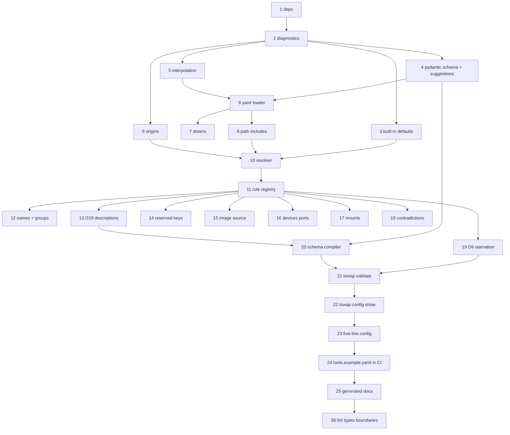

# M1 — Configuration: parse, validate, resolve with excellent error messages

**Intake:** GitHub issue [#2 — M1 — Configuration](https://github.com/iar3-r8/tool-swap/issues/2)
**Classification:** **feature** (new product capability: the configuration layer the router runs on)
**Proposed branch:** `feature/m1-configuration`
**Test command:** `.venv/bin/python -m pytest`
**Baseline to preserve:** 206 passed, 2 skipped on `main`
**Planning questions posted to the issue:** [comment](https://github.com/iar3-r8/tool-swap/issues/2#issuecomment-5316964963) (Q1–Q9, mirrored in §5 below)

---

## 0. How to read this plan

Section §1 is **the TDD loop ledger**. Each numbered behaviour is one red→green→commit cycle: the Q&A tester writes the failing tests for exactly that behaviour, the coder makes them pass without breaking any earlier behaviour, and the pipeline commits. Behaviours are ordered so that every dependency is already green when it is needed.

Two rules that apply to every behaviour:

- **No `warnings.warn`, ever.** [`pyproject.toml`](pyproject.toml:64) sets `filterwarnings = ["error"]`, so a real Python warning aborts the suite. Every M1 "warning" is a `Diagnostic` with `severity="warning"` on a report object. This is a hard constraint, not a style preference.
- **Errors are data before they are text.** Every diagnostic carries a stable `code`, a `message`, a `location` (file + YAML path + line where available) and a `remedy`. Tests assert on `code` plus substrings of `message`/`remedy`, never on whole-string equality of rendered output — otherwise every wording improvement is a test failure.

### The diagnostic model (fixed in behaviour 2, used by everything after)

```python
@dataclass(frozen=True)
class Diagnostic:
    code: str            # "TSWAP-C101" — stable, greppable, documented
    severity: Severity   # ERROR | WARNING
    message: str         # what is wrong, naming the offending key/value
    location: Location   # file, yaml_path ("tools.cxr_to_embedding.ttl"), line, column
    remedy: str          # what to do about it — MANDATORY, non-empty
```

`remedy` is mandatory and non-empty for every diagnostic, enforced by a test that iterates the whole registered code table. The M1 Definition of Done is *"a message a stranger can act on"*; a diagnostic that cannot say how to fix itself does not satisfy it. This mirrors `plan/08_REPO_LAYOUT.md`'s rule for preflight checks (*"A check that cannot say how to fix its own failure does not get merged"*), which M5 will refactor `validate` into.

### Diagnostic code blocks

| Range | Owner |
|---|---|
| `TSWAP-C0xx` | reading/parsing the file (not found, YAML syntax, unresolvable env var, `path:` include errors) |
| `TSWAP-C1xx` | schema shape (unknown key, wrong type, missing required) |
| `TSWAP-C2xx` | naming and references (name charset, duplicates, unknown group) |
| `TSWAP-C3xx` | descriptions (D19) |
| `TSWAP-C4xx` | withdrawn/reserved keys (`soft_ttl`, `runtime.server: native`) |
| `TSWAP-C5xx` | resources, ports, devices, mounts |
| `TSWAP-C6xx` | contradictions and starvation warnings (D9) |
| `TSWAP-S1xx` | schema compiler |

The code table lives in one module and is rendered into the generated docs (behaviour 22), so the troubleshooting table cannot drift from the codes actually emitted.

---

## 1. Behaviour ledger

### Behaviour 1 — dependencies are declared and importable

- **Inputs:** [`pyproject.toml`](pyproject.toml:24); a venv built from `pip install -e ".[dev]"`.
- **Change:** add to `[project] dependencies`: `pydantic>=2.7`, `pyyaml>=6`, `python-dotenv>=1.0`, `jsonschema>=4.21`. Add `types-PyYAML` to the `dev` extra (mypy strict cannot type `yaml` without it; `pydantic` and `jsonschema` ship their own types). Add the same four to the `dev` extra so the test extra is self-sufficient, matching the precedent set for `typer` in M0.
- **Expected outputs:** `import pydantic, yaml, dotenv, jsonschema` all succeed; `pydantic.VERSION` starts with `2`; `make lint` (`ruff check` + `ruff format --check` + `mypy src/` strict) still exits 0; the 206-test baseline still passes.
- **Edge cases:**
  - `jsonschema` is needed **only** for meta-schema validation (behaviour 20). It is nonetheless a runtime dependency, because `tswap validate` is a runtime command.
  - The runtime distribution [`src/tool_swap_runtime/pyproject.toml`](src/tool_swap_runtime/pyproject.toml) must **not** gain any of these; the import-linter contracts keep the two packages apart and this milestone must not weaken that.
  - mypy strict will reject `yaml.safe_load`'s `Any` return flowing into typed code — the loader must narrow it explicitly (behaviour 6), not `# type: ignore` it.
- **Error behaviour:** a missing dependency surfaces as an ordinary `ModuleNotFoundError` at import. No `try/except ImportError` shims, no optional-feature degradation.
- **Files:** `pyproject.toml`.

### Behaviour 2 — the diagnostic model and the error-report container

- **Inputs:** constructed `Diagnostic` values.
- **Expected outputs:**
  - `Diagnostic` is frozen, hashable, ordered deterministically by `(file, line, code)` so output is stable across runs and platforms.
  - `Location` renders as `tools.yaml:42` when a line is known, `tools.yaml (tools.cxr_to_embedding.ttl)` when only the YAML path is known, and `tools.yaml` when neither is.
  - `ConfigReport.errors` / `.warnings` filter by severity; `.ok` is true iff `errors` is empty; `.exit_code` is `0` when ok else `1`.
  - `ConfigReport.render()` produces one block per diagnostic: severity + code, location, message, then an indented `remedy:` line.
  - `ConfigReport.to_json()` produces a list of objects with keys `code, severity, message, file, yaml_path, line, remedy` — the same content as the human render (the *"one report shape, three consumers"* rule from `plan/07_CLI_AND_OPS.md` §6).
  - `ConfigError` (the raised form) carries a `ConfigReport` so a caller that wants an exception and a caller that wants a report use the same data.
- **Edge cases:** empty report renders to the empty string, not `"no errors"` (the caller owns the success message); a diagnostic with an empty `remedy` raises `ValueError` at construction.
- **Error behaviour:** this behaviour *is* the error behaviour of everything downstream. Nothing here raises for config content.
- **Files:** `src/tool_swap/config/errors.py` (new), `tests/unit/config/test_errors.py`.

### Behaviour 3 — built-in defaults are a single named source of truth

- **Inputs:** none — the module's own constants.
- **Expected outputs:** every default in `plan/02_CONFIGURATION.md` §3 `defaults:` and §5 is present with the documented value: `ttl=900`, `keep_warm=False`, `autostart=True`, `group="default"`, `devices=[]`, `cpus=None`, `memory=None`, `shm_size="1g"`, `max_batch_size=8`, `max_wait_ms=20`, `workers=1`, `runtime_server="bentoml"`, `start_timeout=120`, `ready_timeout=600`, `queue_timeout=300`, `request_timeout=300`, `drain_timeout=30`, `stop_timeout=30`, `max_queue_depth=64`, `health_path="/health"`, `ready_path="/ready"`, `probe_interval=1.0`, `evict_cost=1`, `max_concurrent=None`, `restart_backoff=[1,5,15,60]`, `max_consecutive_failures=3`, `container_port=8000`, `expose_host_port=False`. Router: `host="0.0.0.0"`, `port=8600`, `log_level="INFO"`, `log_dir="./logs"`, `log_json=True`, `cors_origins=["*"]`, `auth_token=None`, `status_page=True`, `log_output="router"`. Backend: `type="docker"`, `network="tool-swap-net"`, `container_prefix="ms-"`, `label_namespace="com.tool-swap"`, `gpu_runtime="nvidia"`, `orphans="stop"`, `port_range=[7000,7999]`, `registry_prefix="tool-swap"`.
- **Edge cases:** mutable defaults (`devices`, `cors_origins`, `restart_backoff`, `port_range`, `mounts`, `env`) must be produced per-instance — a shared list mutated by one tool's resolution corrupting another is the classic bug here, and gets a dedicated test that resolves two tools and mutates one's `devices`.
- **Error behaviour:** none. A test asserts the built-in set is **exhaustive** over the resolvable field names, so adding a schema field without a default fails a test rather than producing a silent `None`.
- **Files:** `src/tool_swap/config/defaults.py` (new), `tests/unit/config/test_defaults.py`.

### Behaviour 4 — Pydantic schema accepts the documented config and rejects unknown keys with a suggestion

- **Inputs:** dicts (already-parsed YAML), including the full §3 reference config and the five-line minimal config.
- **Expected outputs:**
  - `RouterConfig`, `BackendConfig`, `DefaultsConfig`, `GroupConfig`, `ToolConfig`, `ToolYamlConfig`, `RootConfig` — all with `model_config = ConfigDict(extra="forbid")`.
  - The full §3 reference config validates with **zero** errors.
  - `version: 1` is accepted; `version: 2` is rejected naming the supported major (`TSWAP-C001`: *"config version 2 is not supported by tool-swap 0.1.0; this version understands version 1"*).
  - An unknown key produces `TSWAP-C101` naming the key, its containing path, **and the nearest valid alternative** computed by edit distance over that model's field names: `unknown key 'batch_size' in tools.cxr_to_embedding — did you mean 'max_batch_size'?`
  - When no field is within the distance threshold, the message omits *"did you mean"* and instead lists the valid keys for that block: `unknown key 'zzzz' in router — valid keys are: auth_token, cors_origins, host, ...`. A confidently wrong suggestion is worse than none.
  - `devices` is always a **list of GPU indices**, never a count. `devices: 3` is a type error whose message says so explicitly, citing §5.4 (*"`devices` is a list of GPU indices, not a count; write `devices: [3]` for GPU 3, or `devices: [0,1,2]` for three GPUs"*). This is the R8 flaw the spec calls out by name, so it gets its own message rather than Pydantic's default.
- **Edge cases:**
  - The nearest-alternative search runs against the *correct* model for the offending location, so `ttl` misspelled inside `groups:` suggests group fields, not tool fields.
  - Distance threshold must not suggest across obviously-unrelated names; the threshold and its rationale are asserted by a table-driven test (`batch_size`→`max_batch_size`, `mount`→`mounts`, `descripton`→`description`, `xyzzy`→ no suggestion).
  - Pydantic reports multiple errors at once — **all** unknown keys in one file must be reported in a single run, not just the first. `tswap validate` that reveals one typo per invocation is a bad tool.
  - `tools:` may be empty (`tools: {}`) — valid, warns nothing; a router with no tools is a legitimate boot state.
  - Extra keys inside `env:` are legal (it is a free-form map) — `extra="forbid"` must not be applied to map-valued fields.
- **Error behaviour:** the schema layer raises nothing to the caller; a translation function converts `pydantic.ValidationError` into a list of `Diagnostic`s. Pydantic's raw error text never reaches the user, because it names Python types and internal locations a config author cannot act on.
- **Files:** `src/tool_swap/config/schema.py` (new), `src/tool_swap/config/suggest.py` (new — the edit-distance helper, pure and separately tested), `tests/unit/config/test_schema.py`, `tests/unit/config/test_suggest.py`.

### Behaviour 5 — `${VAR}` and `${VAR:-default}` interpolation, with an actionable failure

- **Inputs:** raw YAML text plus an explicit environment mapping (injected, never read from the ambient process in tests).
- **Expected outputs:**
  - `${HF_TOKEN}` → the variable's value.
  - `${TSWAP_TOKEN:-}` → the empty string when unset (this exact form appears in §3's `auth_token`).
  - `${HF_HOME:-~/.cache/huggingface}` → the literal default when unset; `~` is **not** expanded by the interpolator (path expansion is behaviour 7's job, and doing it here would silently rewrite a value the user can see).
  - Multiple references in one scalar are all substituted; a reference inside a longer string substitutes in place (`${HF_HOME}/hub`).
  - `$$` escapes to a literal `$`, so a value containing a dollar sign is expressible.
  - A bare `$VAR` without braces is left **untouched** — only the braced form is a reference. Silently interpolating `$` in, say, a password would be a data-corruption bug.
  - Interpolation happens on the **raw text before YAML parsing**, so a substituted value cannot inject YAML structure — a value containing `: ` or a newline is quoted/escaped so it remains a scalar. This is tested adversarially with `HF_TOKEN='a: b'` and with a value containing `\n`.
- **Edge cases:**
  - `${VAR:-default}` where the default itself contains `}` or `:-`.
  - An unclosed `${VAR` is a syntax error naming the line, not a silent pass-through.
  - An empty-but-set variable (`HF_TOKEN=""`) is **set** — `${HF_TOKEN:-fallback}` yields `""`, matching POSIX `:-`... note this is the one place we deliberately deviate: POSIX `:-` substitutes on *unset or empty*. **We treat empty-but-set as set** and document it, because `TSWAP_TOKEN=""` meaning "explicitly no token" must not resurrect a default. A test pins this and the docs state it. *(Flagged as assumption A10.)*
- **Error behaviour:** a referenced variable that is unset **and** has no default → `TSWAP-C010`, naming the variable, the file, the line, and the remedy: *"set HF_TOKEN in the environment or in .env, or give it a default: `${HF_TOKEN:-}`"*. All missing variables are reported together, not one per run (§6 rule 10).
- **Files:** `src/tool_swap/config/interpolate.py` (new), `tests/unit/config/test_interpolate.py`.

### Behaviour 6 — the YAML loader reads a file, reports syntax errors with a line, and preserves source lines

- **Inputs:** a path to a YAML file on a `tmp_path`.
- **Expected outputs:**
  - The five-line minimal config (`tools:` / one tool / `path:`) loads to the expected mapping.
  - Every mapping node carries its **source line** so diagnostics can cite `tools.yaml:42`. Implemented with a `SafeLoader` subclass recording `__line__` per mapping, kept out of the data handed to Pydantic.
  - YAML anchors/aliases and an `x-defaults` anchor block resolve (§1 principle 6). A top-level key beginning `x-` is accepted and ignored, so the anchor idiom in the examples works without tripping `extra="forbid"`.
  - Duplicate keys in one mapping are an **error** (`TSWAP-C002`), not last-wins. PyYAML's default silently accepts them, and a duplicated `ttl:` where one is ignored is precisely the class of silent failure M1 exists to eliminate.
- **Edge cases:** empty file → `TSWAP-C003` (*"tools.yaml is empty; a minimal config needs a `tools:` block"*); a file whose top level is a list or scalar → `TSWAP-C004` naming what was found; a UTF-8 BOM is tolerated; CRLF line endings do not shift reported line numbers.
- **Error behaviour:** file not found → `TSWAP-C000` naming the resolved absolute path and the remedy (*"create tools.yaml, or pass --config <path>"*). YAML syntax error → `TSWAP-C001` with the parser's line/column and the offending line echoed with a caret. Both exit `2` from the CLI (behaviour 21) because the config could not be read at all — a different failure class from "the config is wrong".
- **Files:** `src/tool_swap/config/loader.py` (new), `tests/unit/config/test_loader.py`.

### Behaviour 7 — `.env` loading, merged before resolution

- **Inputs:** a `tmp_path` containing `.env` and `tools.yaml`; an injected base environment.
- **Expected outputs:**
  - `.env` next to the config file is loaded automatically; `--env-file <path>` overrides the location.
  - **Precedence: the real process environment wins over `.env`.** `HF_TOKEN` exported in the shell beats `HF_TOKEN` in `.env`, so a developer can override without editing the file. This is `python-dotenv`'s `load_dotenv(override=False)` semantics and is stated in the docs.
  - Values from `.env` are visible to interpolation (behaviour 5), so a `.env`-only variable resolves.
  - A missing `.env` is **not** an error (it is optional); a missing **explicitly requested** `--env-file` **is** an error (`TSWAP-C011`).
- **Edge cases:** `.env` with quoted values, `export ` prefixes, comments and blank lines; a `.env` entry whose value contains `=`; `.env` is never read into the *container* environment here — `env_file:` in a tool config is a separate, later concern and this behaviour must not conflate them.
- **Error behaviour:** an unparseable `.env` line → `TSWAP-C012` naming the line number and content.
- **Files:** `src/tool_swap/config/loader.py`, `tests/unit/config/test_env_loading.py`.

### Behaviour 8 — `path:` inclusion of `tool.yaml`, resolved relative to the including file

- **Inputs:** a `tmp_path` tree: `tools.yaml` with `tools: {t: {path: ./tools/t}}`, and `tools/t/tool.yaml` + `handler.py` + `requirements.txt`.
- **Expected outputs:**
  - `tool.yaml` is loaded and its content becomes the tool's mid-precedence layer (consumed in behaviour 10).
  - Relative paths inside `tool.yaml` (`handler: handler.py:Cls`, `runtime.requirements: requirements.txt`) resolve against **the `tool.yaml`'s own directory**, not the CWD and not the root config's directory. This is what makes a tool directory portable, which is the stated purpose of `path:` (§4).
  - Relative `path:` in `tools.yaml` resolves against the **root config file's** directory, so `tswap validate` gives identical results from any CWD — asserted by running the same validation from two different working directories.
  - `~` in `path:` expands; absolute paths are honoured as-is.
  - The `name:` inside `tool.yaml` must equal the `tools:` map key, or `TSWAP-C201` fires naming both. Silently preferring one would make the URL/container name unpredictable.
- **Edge cases:**
  - `path:` pointing at a directory with no `tool.yaml` → `TSWAP-C005` naming the directory and the expected filename.
  - `path:` pointing at a file rather than a directory → `TSWAP-C006`, with the remedy naming the directory form.
  - `path:` **and** an inline `handler:` in the same entry: legal — `path:` supplies the layer, inline wins (behaviour 10). `path:` and `build:` together is checked by behaviour 15 (exactly-one-image-source).
  - Two `tools:` entries with the **same** `path:` → `TSWAP-C202` warning; usually a copy-paste, but legitimate when two entries differ only by `params:` (§5.5.1 explicitly describes that pattern), so it is a warning with the remedy naming that case.
  - No include recursion: a `tool.yaml` may not itself contain `path:` or nested includes (`TSWAP-C007`). One level, so there is no cycle detection to get wrong.
  - A symlinked tool directory resolves through the symlink without escaping the check.
- **Error behaviour:** as listed. A `tool.yaml` that fails its own schema validation reports diagnostics located in **that** file, with its own line numbers — not in `tools.yaml`.
- **Files:** `src/tool_swap/config/loader.py`, `tests/unit/config/test_includes.py`.

### Behaviour 9 — `Origin` tracking primitives

- **Inputs:** layer dicts tagged with their provenance.
- **Expected outputs:**
  - `Origin` names the level (`INLINE` | `TOOL_YAML` | `DEFAULTS` | `BUILT_IN`) **and** the concrete source (`tools.yaml:143`, `tools/t/tool.yaml:12`, `built-in default`).
  - `Origin.render()` → `tools.yaml:143 (inline)`, `built-in default`.
  - `ResolvedValue[T]` pairs a value with its `Origin`; an `OriginMap` maps a dotted field path to the winning `Origin`, and additionally records the **shadowed** origins so `config show --verbose` can say *"`ttl: 600` from tools.yaml:143 (inline), overriding 900 from built-in default"*. Knowing what was overridden is the whole point of the command.
- **Edge cases:** merged/concatenated fields (`env`, `mounts`) need **per-element** origins — `env.HF_HOME` may come from `defaults:` while `env.MY_VAR` comes from inline; each mount string carries the origin of the layer that contributed it. A single origin for the whole collection would be a lie.
- **Error behaviour:** requesting the origin of an unknown field path raises `KeyError` — a programming error, not a user error.
- **Files:** `src/tool_swap/config/origin.py` (new), `tests/unit/config/test_origin.py`.

### Behaviour 10 — the resolver: precedence `inline > tool.yaml > defaults > built-in`, with origins

- **Inputs:** the four layers for one tool.
- **Expected outputs:**
  - **Scalars:** the highest present layer wins. A four-layer test sets `ttl` at every level and asserts inline wins with `Origin.INLINE`; then removes layers one at a time and asserts each next level takes over with the right origin.
  - **`env` is merged** key-by-key, the higher layer winning per key (§5.6). `defaults.env = {HF_HOME: /a, HF_TOKEN: x}` + inline `env = {HF_HOME: /b}` → `{HF_HOME: /b, HF_TOKEN: x}` with per-key origins.
  - **`mounts` is concatenated**, not replaced (§5.6), in order **built-in → defaults → tool.yaml → inline**, so the most specific mount is last. Duplicates are preserved (Docker's own last-wins applies) but a duplicate *container* path across layers emits `TSWAP-C503` warning naming both host sources, because a shadowed mount is invisible at runtime.
  - **Other lists (`devices`, `cors_origins`, `restart_backoff`, `args`, `cmd`) are replaced wholesale**, not concatenated. Asserted explicitly, because "which lists merge" is the documented confusion (§5.6) and guessing differently per field is how a config layer becomes unpredictable.
  - **Nested blocks in `tool.yaml` flatten onto the tool's fields**: `batching.max_batch_size` → `max_batch_size`, `resources.group` → `group`, `resources.accelerator` → `devices` hint, `lifecycle.ttl` → `ttl`, `lifecycle.ready_timeout` → `ready_timeout`. The mapping table is asserted field by field, in both directions, so a `tool.yaml` key that maps to nothing fails a test.
  - `ttl: -1` means **inherit `defaults.ttl`** (§5.3 sentinel), `0` means never stop, `>0` seconds. `-1` resolves to the inherited value with the origin of the layer it inherited *from*, not the layer holding `-1`. `-2` and below → `TSWAP-C501` naming the three legal sentinels.
  - The output is a frozen `ResolvedTool` plus its `OriginMap`. Resolution is a **pure function** of the layers — no filesystem, no environment, no clock — so it is exhaustively testable, per the project's pure-function guideline.
- **Edge cases:**
  - An explicit `null` in a higher layer: it **wins** and means "unset", it does not fall through. Otherwise `cpus: null` could never override a `defaults.cpus: 4.0`. Tested directly, and documented, because the opposite reading is equally defensible and the choice must be visible.
  - A key absent from a layer's dict is distinct from a key present with value `None`. The layers therefore carry sentinel-free "unset" markers rather than `None`.
  - `devices` inherited **from the group** when the tool sets none (§5.4 *"from group"*): origin is the group, rendered as `groups.gpu0.devices`. Group-supplied `devices` sit between `defaults:` and `built-in` in precedence — *(flagged as assumption A11; §4.1 does not place the group layer.)*
  - Resolving all tools must not share mutable defaults (see behaviour 3).
- **Error behaviour:** the resolver emits diagnostics for sentinel violations only; every cross-tool and cross-reference rule belongs to behaviours 12–19, so the resolver stays pure.
- **Files:** `src/tool_swap/config/resolver.py` (new), `tests/unit/config/test_resolver.py`, `tests/unit/config/test_merge_semantics.py`.

### Behaviour 11 — the validator skeleton: a rule registry that reports everything at once

- **Inputs:** a resolved config + origins.
- **Expected outputs:**
  - Rules are registered objects with `id`, `severity`, a `check()` returning diagnostics, and a **mandatory** `remedy` — deliberately the shape `plan/08_REPO_LAYOUT.md` specifies for the M5 preflight `Check` protocol, so M5 *moves* these rules rather than reimplementing them (guardrail 13). Getting the shape right now is what makes that a move.
  - `validate_config()` runs **every** rule and returns one report; it does not stop at the first error. A config with five distinct problems yields five diagnostics.
  - Rule order does not affect the outcome; diagnostics are sorted deterministically (behaviour 2).
  - A registry test asserts every §6 rule in scope has a registered id, and that every registered id is exercised by at least one test — so a rule cannot be quietly dropped.
- **Edge cases:** a rule raising an unexpected exception is caught and reported as an internal diagnostic naming the rule id, rather than crashing the whole command and hiding the other findings.
- **Error behaviour:** never raises for config content.
- **Files:** `src/tool_swap/config/validate.py` (new), `tests/unit/config/test_validate_registry.py`.

### Behaviour 12 — names, duplicates, and group references (§6 rules 2, 3)

- **Inputs:** configs with bad names and dangling group references.
- **Expected outputs / error behaviour:**
  - `TSWAP-C210`: name not matching `^[a-z0-9][a-z0-9_-]*$` → error naming the tool, the offending characters, and the reason (*"used in URLs, container names and log directory names"*). Cases: `Tool_A` (uppercase), `_leading`, `has space`, `has.dot`, `ünïcode`, `""`.
  - `TSWAP-C211`: duplicate tool names. (Distinct from behaviour 6's duplicate-YAML-key error: this catches a duplicate arising *across* layers or after `tool.yaml` name resolution.)
  - `TSWAP-C220`: a tool references a group absent from `groups:` → error naming the group, the tool, and the **nearest existing group name** plus the full list of defined groups.
  - `TSWAP-C221`: `groups.*.max_resident < 1` → error naming the group and the value.
  - `TSWAP-C222`: `groups.*.eviction` not in `{lru, lifo, none}` → error listing the valid values.
  - The implicit `default` group: a tool with no `group:` resolves to `default`. If `groups:` is absent entirely, a `default` group with `max_resident: 4` is synthesised (so the five-line config works) with origin `built-in default`. If `groups:` is present but omits `default` while some tool needs it, that is `TSWAP-C220` like any other missing group — silently synthesising into a hand-written `groups:` block would hide a typo.
- **Edge cases:** a group defined but referenced by nothing → `TSWAP-C223` warning (probably a rename); a tool named `default` is legal (names live in different namespaces) and is tested so nobody "fixes" it.
- **Files:** `src/tool_swap/config/validate.py`, `tests/unit/config/test_validate_names_groups.py`.

### Behaviour 13 — D19, the mandatory-description rule (§6 rule 6b)

- **Inputs:** tools with descriptions missing at each of the three sites.
- **Expected outputs / error behaviour:**
  - `TSWAP-C300` **ERROR** — missing or whitespace-only `description` on the tool. Message states *why*: *"the description is what an LLM agent reads to decide whether to call this tool"*, with the remedy naming the file and key to add.
  - `TSWAP-C301` **ERROR** — missing description on any entry in `inputs:`, naming the input.
  - `TSWAP-C302` **WARNING** — missing description on any entry in `outputs:`, naming the output.
  - `TSWAP-C303` **ERROR** — missing description on any entry in `params:` (§5.5.1 requires `name`, `type`, `description`).
  - `--allow-missing-descriptions` downgrades `C300`, `C301` and `C303` to warnings **and** appends to each: *"downgraded by --allow-missing-descriptions; this flag is for local prototyping and is never permitted in CI"*. The banner is part of the diagnostic, so it survives `--json` and cannot be lost by a caller that only prints diagnostics.
- **Edge cases:** a description of `"   "` or `"\n"` counts as missing; a description present in `tool.yaml` and blank inline — inline wins per behaviour 10, so it **is** missing, and this precedence interaction gets its own test because it is easy to implement backwards. A very short description (`"x"`) is accepted — we do not invent a length rule the spec does not state.
- **Files:** `src/tool_swap/config/validate.py`, `tests/unit/config/test_validate_descriptions.py`.

### Behaviour 14 — withdrawn and reserved keys (§6 rules 4, 1c)

- **Inputs:** configs setting `soft_ttl` and `runtime.server: native`.
- **Expected outputs / error behaviour:**
  - `TSWAP-C400` — `soft_ttl` present at any level → **error** citing [ADR-0004](plan/adr/0004-hard-stop-only-in-v1.md) by path and title, stating that TTL is the only idle timer, with the remedy *"remove `soft_ttl`; use `ttl:` — it is the only idle timer in v1"*. This must **not** surface as the generic unknown-key error: §5.3 requires the key be *accepted by the schema and rejected at load* so that re-promotion stays additive. Tested by asserting the code is `C400` and **not** `C101`.
  - `TSWAP-C401` — `runtime.server: native` → error *"not implemented in this version"*, naming the current version and that `bentoml` is the only implemented backend (§6 rule 1c).
  - `TSWAP-C402` — `runtime.server` set to anything outside `{bentoml, native}` → unknown-value error **listing the valid ones**.
  - `TSWAP-C403` — `scalar_inputs` present → error citing ADR-0005 (removed; every handler takes a list). Same accepted-then-rejected treatment, for the same reason.
  - `TSWAP-C404` — per-input `batchable:` present → error citing ADR-0005: batching is a property of the tool. See assumption **A1**.
  - `TSWAP-C405` — `max_batch_bytes` present → error stating the key does not exist and naming the mitigation the spec prescribes (*"set `max_batch_size` low for large payloads"*, §5.5). This key is not in the schema, so it would otherwise be a bare unknown-key error; users coming from other batching frameworks will reach for it, and the spec has a specific answer.
- **Edge cases:** `soft_ttl: null` is still present and still rejected — the key's presence is the signal, not its value.
- **Files:** `src/tool_swap/config/schema.py` (reserved fields), `src/tool_swap/config/validate.py`, `tests/unit/config/test_validate_reserved.py`.

### Behaviour 15 — image source, handler and file existence (§6 rules 5, 6)

- **Inputs:** tools with zero, one and two image sources; missing handler and requirements files.
- **Expected outputs / error behaviour:**
  - `TSWAP-C510` — more than one of `image` / `build` / (managed via `handler`+`requirements`) → error naming which ones were found and requiring exactly one.
  - `TSWAP-C511` — none of them, and no `path:` supplying one → error listing the three ways to define a tool.
  - `TSWAP-C512` — `handler` not in `file.py:Name` form → error showing the expected form and what was found. Cases: `handler.py` (no colon), `:Cls` (no file), `handler.py:` (no name), `handler.py:not-an-identifier`.
  - `TSWAP-C513` — the handler **file** does not exist → error with the **resolved absolute path** tried, since a relative-path misunderstanding is the likely cause.
  - `TSWAP-C514` — `requirements` named but the file does not exist → error with the resolved path.
  - `TSWAP-C515` — `build.context` does not exist, or `build.dockerfile` does not exist within it → error with resolved paths.
  - Validation is **static only** — the handler file is never imported. `tswap validate` must run with no Docker and none of the tool's dependencies installed (§2 *"No Docker needed — runs in CI"*), and importing a handler would pull in torch. A test asserts no import occurs (a `sys.modules` snapshot before/after).
- **Edge cases:** a handler file that exists but is a directory; a handler path escaping the tool directory via `../` (allowed, but `TSWAP-C516` warning, since it breaks the portability that `path:` exists to provide); a class name that is a valid Python identifier but not a class cannot be checked statically and is explicitly out of scope for M1 (it is M5 preflight stage 1).
- **Files:** `src/tool_swap/config/validate.py`, `tests/unit/config/test_validate_image_source.py`.

### Behaviour 16 — devices, workers, ports (§6 rules 4c, 7, 8)

- **Inputs:** configs with negative devices, high indices, `workers > 1` + devices, colliding and out-of-range host ports.
- **Expected outputs / error behaviour:**
  - `TSWAP-C520` — a negative or non-integer device index → error.
  - `TSWAP-C521` — a device index exceeding the GPUs visible on this host → **WARNING**, never an error (§6 rule 7: the config may target another machine). The GPU count comes from an **injected** probe so the test is deterministic and passes on a GPU-less CI runner; when the count is unknown the rule is skipped silently rather than warning.
  - `TSWAP-C522` — duplicate index within one tool's `devices` → warning.
  - `TSWAP-C523` — `workers > 1` **and** `devices` non-empty → **WARNING** (§6 rule 4c) stating that VRAM multiplies by the worker count invisibly to the scheduler, with the remedy naming both options (reduce `workers`, or accept and size the group accordingly).
  - `TSWAP-C530` — two tools sharing an `expose_host_port` → error naming both tools and the port (§6 rule 8).
  - `TSWAP-C531` — an explicit `expose_host_port` outside `backend.port_range` → error naming the port and the range.
  - `expose_host_port: true` (auto-allocate from the range) participates in **neither** check — nothing is allocated at validate time (D21: normal operation publishes nothing). Asserted, so a future implementation does not start allocating during validation.
  - `TSWAP-C532` — `backend.port_range` inverted or malformed → error.
- **Edge cases:** `devices: []` (CPU) with `workers: 4` → no warning; `expose_host_port: 0` → error (0 means "pick one" to Docker, and we do not support that spelling).
- **Files:** `src/tool_swap/config/validate.py`, `tests/unit/config/test_validate_resources.py`.

### Behaviour 17 — mounts (§6 rule 9, §5.6)

- **Inputs:** mount strings in every documented and malformed shape.
- **Expected outputs / error behaviour:**
  - Parsing: `host:container`, `host:container:ro`, `host:container:rw`. **A missing mode defaults to `ro`, and the resolved config says so** (§5.6 *"Default to `ro` when the mode is omitted, and say so"*) — the resolved mount renders with an explicit `:ro` and an origin note. A read-only default that is invisible produces a baffling permission error at runtime.
  - `TSWAP-C540` — unparseable mount (no colon, too many colons, empty side) → error showing the expected forms.
  - `TSWAP-C541` — mode other than `ro`/`rw` → error listing the two.
  - `TSWAP-C542` — the container-side path is not absolute → error (Docker requires it).
  - `TSWAP-C543` — the **host** path does not exist → **WARNING** only (§6 rule 9: it may be created later), with a remedy that names the host-vs-router-container path trap from `plan/07_CLI_AND_OPS.md` §5 — the failure mode where a path exists on the host but the mount is interpreted by the daemon.
  - `TSWAP-C503` (from behaviour 10) — the same container path mounted twice across layers → warning.
- **Edge cases:** a host path containing `:` (Windows-style or otherwise) is documented as unsupported and produces `C540`; `~` on the host side expands, and the expanded form appears in `config show`; a relative host path is resolved against the config file's directory and the **absolute** result is what gets reported and validated.
- **Files:** `src/tool_swap/config/validate.py`, `tests/unit/config/test_validate_mounts.py`.

### Behaviour 18 — contradictions (§6 rule 11)

- **Inputs:** `keep_warm: true` with `autostart: false`; other contradictory pairs.
- **Expected outputs / error behaviour:**
  - `TSWAP-C600` — `keep_warm: true` + `autostart: false` → **error**, explaining the contradiction (one says start at boot and never idle-stop, the other says never start automatically) and naming both remedies with their consequences.
  - `TSWAP-C601` — `keep_warm: true` + `ttl` explicitly `> 0` → **warning**: `keep_warm` exempts the tool from TTL, so the `ttl` value has no effect and the author probably expected one.
  - `TSWAP-C602` — `max_concurrent: 0` → error (a cap of zero rejects everything; use `autostart: false` to disable a tool).
  - `TSWAP-C603` — `max_batch_size < 1`, `max_wait_ms < 0`, `workers < 1`, any timeout `<= 0` → error naming the field and the permitted range. `batching.enabled: false` resolves to `max_batch_size: 1` and nothing else (ADR-0005), asserted here as a resolution outcome, not a validation error.
- **Edge cases:** the diagnostic must cite the **origin** of each conflicting value, since the two halves frequently come from different layers (`keep_warm` inline, `autostart` from `defaults:`) — and that is exactly the case a user cannot debug unaided.
- **Files:** `src/tool_swap/config/validate.py`, `tests/unit/config/test_validate_contradictions.py`.

### Behaviour 19 — D9 group starvation, and group capacity (§6 rules 12, 13)

- **Inputs:** groups configured to starve.
- **Expected outputs / error behaviour:**
  - `TSWAP-C610` — **every** member of a group is `keep_warm` while `max_resident < member count` → **WARNING** (D9). The message names the group, the member count, `max_resident`, and both remedies: raise `max_resident` to the member count, or set `eviction: none` if pinning was the intent. It must explain the mechanism — *"`keep_warm` exempts a tool from TTL but not from eviction, so this group can never satisfy all its members"* — because the symptom (tools restarting forever) does not point at the cause.
  - `TSWAP-C611` — a group with **no members** → warning naming the group (the issue's DoD phrases D9 as covering both no-members and all-same-device; see assumption **A2**).
  - `TSWAP-C612` — total `max_resident` across groups sharing a device exceeds... nothing checkable in v1, so this is a **warning** only, per §6 rule 12's *"only a warning — we do not model VRAM in v1"*: it fires when two or more groups declare overlapping `devices` and their combined `max_resident` exceeds the larger group's, naming the shared device index.
  - `TSWAP-C613` — a group with `max_resident` greater than its member count → warning (harmless, but usually a stale config).
- **Edge cases:** a **partially** keep-warm group does not warn under C610 (the spec says *every* member); a single-member group with `max_resident: 1` and `keep_warm` does not warn; a group whose members are all on the same device is only interesting if that means starvation, so its severity and phrasing follow the A2 resolution.
- **Files:** `src/tool_swap/config/validate.py`, `tests/unit/config/test_validate_groups_starvation.py`.

### Behaviour 20 — the schema compiler: `inputs:`/`outputs:` → JSON Schema 2020-12

- **Inputs:** `inputs:`/`outputs:`/`params:` lists as authored in `tool.yaml`; and raw `json_schema:` blocks.
- **Expected outputs:**
  - `compile_inputs(inputs)` returns a dict with `$schema: "https://json-schema.org/draft/2020-12/schema"`, `type: "object"`, `properties`, `required` and **always** `additionalProperties: false` (§8.5 — a typo'd input name must be a 422, not a silently ignored argument). Snapshot-tested (corpus 7, 9).
  - The §8.4 example compiles to the documented shape, with `required` **matching the declared input name** — see assumption **A4** (the spec's worked example has `name: path` but `required: ["paths"]`).
  - `required` contains exactly the inputs with `required: true`, in declaration order; it is **omitted** when empty rather than emitted as `[]`.
  - Type mapping: `string`, `number`, `integer`, `boolean`, `array`, `object` pass through as JSON Schema types. `array` requires `items:`, which maps to `items: {type: ...}`. Nested `items` beyond one level is not supported by the simple form and directs the author to `json_schema:` (`TSWAP-S110`).
  - `semantic: dicom_path` → `x-semantic: "dicom_path"` (§8.3). `x-semantic` is carried verbatim and never interpreted.
  - `description` is copied verbatim into each property; a missing one is an error via behaviour 13's `C301`, and the compiler additionally refuses to emit a property with no description (`TSWAP-S120`) so the two paths cannot disagree (corpus 12).
  - `json_schema:` present → returned **untouched**, byte-for-byte equal to the parsed input, with **no** `additionalProperties` injected and no `$schema` added (corpus 10). *"Passed through untouched"* is taken literally; a test asserts deep equality including key order.
  - `json_schema:` and `inputs:` both present → `TSWAP-S130` error naming both and requiring one (they are alternatives, per §8.4's "escape hatch" framing).
  - `compile_outputs(outputs)` produces the same shape for the output schema; outputs are never `required`-bearing and a missing description is a warning (behaviour 13's `C302`).
  - `validate_against_metaschema(schema)` checks every compiled schema — including a passed-through `json_schema:` — against the 2020-12 meta-schema using `jsonschema` (corpus 11). §8.5: *"Emitting an invalid schema is worse than emitting none."* An invalid raw block → `TSWAP-S140` quoting the meta-schema validator's own path and message, which is the one place a library's error text is genuinely the most actionable thing available.
- **Edge cases:**
  - Empty `inputs: []` → a valid object schema with no properties and `additionalProperties: false` (a no-argument tool is legal).
  - `inputs:` absent entirely → `None`, distinct from `[]`. The tool is then schema-less: legal (§4 says the block is optional), and `/tools` will say so. A test pins `None ≠ {}`.
  - Duplicate input names → `TSWAP-S100`.
  - A name colliding between `inputs:` and `params:` → `TSWAP-S101` (§6 rule 1d), naming both and stating the deciding question from §5.5.1: *does this value change what the batched forward pass computes?*
  - A property name that is not a valid identifier is **allowed** (JSON Schema permits any string key) but warns (`TSWAP-S102`), since handlers receive inputs as keyword arguments (§3 of `plan/03_TOOL_AUTHORING.md`) and a non-identifier name cannot be one.
  - `type:` outside the six supported values → `TSWAP-S103` listing them and pointing at `json_schema:` for anything richer (enums, ranges, `oneOf`).
  - **No `x-batchable` is emitted** and a per-input `batchable:` key is rejected — see assumption **A1** and behaviour 14's `C404`.
- **Error behaviour:** all compiler diagnostics use the `TSWAP-S1xx` block and are surfaced through the same `ConfigReport`, so `tswap validate` reports config and schema problems in one pass rather than in two commands.
- **Files:** `src/tool_swap/schema/compile.py` (new), `tests/unit/schema/test_compile.py`, `tests/unit/schema/test_compile_snapshots.py`, `tests/unit/schema/test_metaschema.py`.

### Behaviour 21 — `tswap validate`

- **Inputs:** CLI invocations against fixture configs.
- **Expected outputs:**
  - `tswap validate` validates `./tools.yaml`; `--config <path>` overrides; `--env-file <path>` overrides `.env`.
  - `tswap validate <tool>` restricts **reporting** to one tool, but still loads and resolves the whole file — cross-tool rules (duplicate ports, group starvation) cannot be evaluated otherwise, and a per-tool validate that misses them would be misleading. Cross-tool diagnostics implicating the named tool are reported.
  - `--all` is accepted as an explicit synonym of the default (it appears in `plan/07_CLI_AND_OPS.md` §2).
  - On success: a one-line confirmation naming the file and the tool count, plus any warnings. Exit `0`.
  - On validation failure: every diagnostic rendered per behaviour 2, then a summary line (`3 errors, 1 warning`). Exit `1`.
  - On unreadable/unparseable config or an unresolvable env var: the single `C0xx` diagnostic. Exit `2`. This distinction lets CI tell "your config is wrong" from "your config is missing".
  - `--strict` promotes warnings to errors (exit `1`); `--json` emits `ConfigReport.to_json()` to stdout with **nothing else on stdout**, so it pipes to `jq`; human output goes to stderr in that mode.
  - `--allow-missing-descriptions` behaves per behaviour 13 and prints the never-in-CI banner.
  - Diagnostics go to **stderr**, the success line to stdout, so `tswap validate && ...` composes in a shell.
- **Edge cases:**
  - `tswap validate <unknown-tool>` → error naming the unknown tool and the **nearest** defined tool name, exit `1`.
  - Output must be deterministic and colour-free under `NO_COLOR=1` (the existing CLI tests already pin `NO_COLOR`/`COLUMNS`; new tests follow that pattern).
  - `--help` for the subcommand lists every flag with a one-line description.
- **Error behaviour:** an unexpected internal exception prints a short message plus the diagnostic codes gathered so far and exits `2` — never a bare traceback, since `validate` is the command a stranger runs first.
- **Files:** `src/tool_swap/cli/main.py` (new — see assumption **A5**), `src/tool_swap/cli/validate.py` (new), `src/tool_swap/__main__.py` (reduced to re-exports), `tests/unit/cli/test_validate_cli.py`.

### Behaviour 22 — `tswap config show`

- **Inputs:** CLI invocations against fixture configs.
- **Expected outputs:**
  - `tswap config show` prints the fully-resolved config for every tool; `tswap config show <tool>` for one.
  - **Every value is printed with its origin** (§4.1 — *"the origin of each value"*), e.g. `ttl: 600            # tools.yaml:143 (inline)` and `shm_size: 1g         # built-in default`.
  - `--verbose` additionally shows the shadowed values (`# overrides 900 from built-in default`), which is what actually answers *"why is it not using my setting?"*
  - `env` shows a per-key origin; `mounts` shows a per-entry origin and the explicit `:ro` default made visible (behaviour 17).
  - The router and backend blocks are shown too, with origins.
  - `--json` emits a machine-readable structure `{tool: {field: {value, origin}}}`, and nothing else on stdout.
  - Warnings from validation are **shown** (so `config show` is never more optimistic than `validate`), but errors do not suppress the resolved output where resolution succeeded — seeing the partial resolution is often how a user finds the mistake. Exit code follows `validate`'s scheme.
  - Output ordering is stable: config-declaration order for tools, and a fixed field order within a tool (not dict-insertion order, not alphabetical-by-accident).
- **Edge cases:** a secret-looking value (`auth_token`, anything under `env` whose key matches `TOKEN|SECRET|KEY|PASSWORD`) is **redacted** to `***` with its origin still shown, and `--show-secrets` opts out. `config show` output is exactly the thing a user pastes into an issue; leaking `HF_TOKEN` by default would be our bug. *(Flagged as assumption A12 — not in the spec, proposed.)*
- **Error behaviour:** unknown tool name → nearest-match suggestion, exit `1`. An unreadable config → the same `C0xx` diagnostic and exit `2` as `validate`.
- **Files:** `src/tool_swap/cli/config_show.py` (new), `tests/unit/cli/test_config_show_cli.py`.

### Behaviour 23 — the five-line minimal config works end to end

- **Inputs:** exactly this file and a matching tool directory:
  ```yaml
  tools:
    example_echo:
      path: ./tools/example_echo
  ```
- **Expected outputs:** `tswap validate` exits `0` with no errors **and no warnings**; `tswap config show` prints a fully-populated resolved config in which every value not written above has origin `built-in default` (or `tool.yaml` for what the tool directory declares). The R4 promise — *"a working single-model config must fit in five lines"* — is asserted mechanically, including a check that the file is **≤ 5 non-comment lines**.
- **Edge cases:** the same file must validate cleanly from a different CWD (behaviour 8's path-resolution rule, re-asserted at the integration level); with `groups:` absent, the synthesised `default` group must not warn.
- **Error behaviour:** none — this is the golden path. Any diagnostic at all is a test failure, which is what makes it a meaningful guard against over-eager warnings accumulating in later milestones.
- **Files:** `tools/example_echo/{tool.yaml,handler.py,requirements.txt}` (new fixtures — see assumption **A8**), `tests/unit/config/test_minimal_config.py`.

### Behaviour 24 — `tools.example.yaml` validates, asserted in CI

- **Inputs:** a committed `tools.example.yaml` at the repo root.
- **Expected outputs:**
  - It exercises the documented surface — `version`, `router`, `backend`, `defaults` (including `env` and `mounts`), `groups`, and several `tools:` entries covering the `path:`, inline-`handler:` and `build:` forms from §3.
  - `tswap validate --config tools.example.yaml --strict` exits `0`: **zero errors and zero warnings**. `--strict` is the point — an example that ships with warnings teaches the warnings.
  - Every `${VAR}` in it has a default (`${VAR:-...}`), so it validates with an empty environment. A test runs it with a **cleared** environment to prove it.
  - Every path it references exists in the repo, so rule-6 file-existence checks are genuinely satisfied rather than skipped.
  - A CI step runs this, so a schema change that breaks the example fails the build.
- **Edge cases:** host mount paths in the example would trip the `C543` host-path warning under `--strict`; the example therefore mounts only paths that exist in the repo, or uses `${VAR:-<repo-relative-path>}`. This constraint is why the example cannot simply be §3 copied verbatim.
- **Error behaviour:** n/a — the assertion is that there is none.
- **Files:** `tools.example.yaml` (new), `.github/workflows/ci.yml` (add the step), `tests/unit/config/test_example_config.py`.

### Behaviour 25 — the generated config reference, README section and troubleshooting table

- **Inputs:** the Pydantic models and the diagnostic code table.
- **Expected outputs:**
  - `docs/configuration.md` is **generated** from the Pydantic schema: every key, its type, default, and description, grouped by block. Field descriptions live in `Field(description=...)` on the models, so the reference cannot omit a key that exists.
  - A test regenerates the document and asserts the committed copy is **identical** — the reference cannot silently rot as the schema changes.
  - A test asserts **every** field on every model has a non-empty `Field(description=...)`. We require descriptions of tool authors (D19); requiring them of ourselves is the same argument.
  - The troubleshooting table maps every `TSWAP-C*`/`TSWAP-S*` code to a cause and a fix, generated from the same code table, with a test asserting the table covers every code the codebase can emit and emits no code the table lacks.
  - `README.md` gains a configuration section: writing a `tools.yaml`, validating it, inspecting the resolved config, and links to `docs/configuration.md` and `plan/02_CONFIGURATION.md`.
  - Module docstrings on `config/{schema,loader,resolver,validate,errors,origin,interpolate,defaults}.py` and `schema/compile.py` explaining each component's role and its place in the pipeline.
- **Edge cases:** generation must be deterministic (sorted, no timestamps, no absolute paths) or the identity test flaps.
- **Error behaviour:** the generator exits non-zero with a clear message if a field lacks a description.
- **Files:** `docs/configuration.md` (new, generated), `scripts/gen_config_reference.py` (new), `README.md`, module docstrings, `tests/unit/config/test_docs_generated.py`.

### Behaviour 26 — lint, types and import boundaries stay clean

- **Inputs:** the whole new codebase.
- **Expected outputs:** `make lint` exits 0 (`ruff check`, `ruff format --check`, `mypy src/` strict); import-linter passes; the full suite is green with **zero** warnings; the 206-test baseline is intact.
- **Edge cases:**
  - `tool_swap.config` and `tool_swap.schema` must not import `tool_swap.cli`, `tool_swap.lifecycle`, `tool_swap.backend` or `tool_swap.proxy` — the config layer is a leaf that everything else depends on. **Add an import-linter contract expressing this** while there is no code to violate it, exactly the argument M0 used for its two contracts.
  - `tool_swap.cli` may import `config` and `schema`; `schema` may import `config.errors` but **not** `config.schema` (the compiler is usable standalone by the M5 preflight path and by the runtime's own schema module).
  - mypy strict over `yaml`/`jsonschema` boundaries needs explicit narrowing rather than `Any` leaking into typed code.
- **Error behaviour:** n/a.
- **Files:** `.importlinter`, plus fixes wherever needed.

---

## 2. Test-corpus mapping

The issue's 12-item corpus maps onto the ledger as follows. Every item is covered; two are split because an ADR removed half of the original requirement.

| # | Corpus item | Behaviour(s) | Notes |
|---|---|---|---|
| 1 | Five-line minimal config works | **23** (with 6, 8, 12) | Asserted with zero errors **and** zero warnings, plus a ≤5-line file check |
| 2 | Unknown key errors name the key and suggest the nearest valid one | **4** (helper in 4's `suggest.py`) | Includes the no-good-suggestion path, which lists valid keys instead |
| 3 | Precedence for scalars (inline wins) | **10** | Four-layer test, then layer-removal tests, each asserting the origin |
| 4 | Merge semantics: `env` merged vs `mounts` concatenated | **10** | Plus the explicit "other lists replace" assertion and per-element origins (9) |
| 5 | Missing env var with no default fails | **5** (surfaced by 6, 21) | `TSWAP-C010`; all missing vars reported together |
| 6 | Every §6 rule has a failing-config test | **12–19** | Rule-by-rule mapping in §3 below. Rules **1b** and **4b** are excluded as withdrawn by ADR — assumption **A2** |
| 7 | Schema compiler: `inputs:` → JSON Schema snapshot | **20** | `required` uses the self-consistent form — assumption **A4** |
| 8 | `batchable`/`semantic` → `x-batchable`/`x-semantic` | **20** (semantic) + **14** (`C404`, batchable) | **Split.** ADR-0005 removed per-input `batchable:`; the `batchable` half becomes a rejection test — assumption **A1** |
| 9 | `additionalProperties: false` always emitted | **20** | Except in a raw `json_schema:` pass-through, where "untouched" wins |
| 10 | Raw `json_schema:` passes through | **20** | Deep-equality assertion including key order |
| 11 | Compiled output validates against the meta-schema | **20** | Applied to compiled **and** passed-through schemas |
| 12 | Missing `description` fails validation | **13** (config) + **20** (`S120`, compiler) | Both paths, asserted to agree |

### §6 rule → behaviour map (corpus item 6, exhaustive)

| §6 rule | Subject | Behaviour | Severity |
|---|---|---|---|
| 1 | Unknown keys + nearest alternative | 4 | error |
| 1b | Non-batchable input on a batched tool | — | **withdrawn by ADR-0005** (A2) |
| 1c | `runtime.server: native` / unknown value | 14 | error |
| 1d | `inputs:`/`params:` name collision | 20 | error |
| 2 | Name charset; no duplicates | 12 | error |
| 3 | Group exists; `max_resident >= 1` | 12 | error |
| 4 | `soft_ttl` rejected, citing ADR-0004 | 14 | error |
| 4b | Tool with `devices` must define `unload()` | — | **removed by ADR-0004** (A2) |
| 4c | `workers > 1` with `devices` set | 16 | warning |
| 5 | Exactly one image source | 15 | error |
| 6 | Handler/requirements exist; description non-empty; I/O well-formed | 15, 13, 20 | error |
| 6b | D19 descriptions (tool/inputs error, outputs warning) | 13 | error + warning |
| 7 | Device indices non-negative; warn if above host GPU count | 16 | error + warning |
| 8 | No shared `expose_host_port`; inside `port_range` | 16 | error |
| 9 | Mount host paths exist (warn); mount strings parse | 17 | error + warning |
| 10 | Unresolvable env var names the variable | 5 | error |
| 11 | `keep_warm` + `autostart: false` | 18 | error |
| 12 | Combined `max_resident` on a shared device | 19 | warning |
| 13 | D9 group starvation | 19 | warning |

---

## 3. File layout

### New source files

```
src/tool_swap/config/
├── __init__.py        (exists — gains the public API re-exports + docstring)
├── errors.py          Diagnostic, Severity, Location, ConfigReport, ConfigError   [B2]
├── defaults.py        BUILT_IN_DEFAULTS — one source of truth                     [B3]
├── schema.py          Pydantic models, extra="forbid", reserved fields            [B4,B14]
├── suggest.py         pure edit-distance nearest-key helper                        [B4]
├── interpolate.py     ${VAR} / ${VAR:-default}, pre-parse, injection-safe          [B5]
├── loader.py          YAML read, line tracking, .env, path: includes           [B6,B7,B8]
├── origin.py          Origin, ResolvedValue, OriginMap                             [B9]
├── resolver.py        inline > tool.yaml > defaults > built-in, with origins      [B10]
└── validate.py        the §6 rule registry                                     [B11–B19]

src/tool_swap/schema/
├── __init__.py        (exists — gains re-exports + docstring)
└── compile.py         inputs:/outputs: -> JSON Schema 2020-12, meta-schema check  [B20]

src/tool_swap/cli/
├── __init__.py        (exists — docstring only today)
├── main.py            the typer app (moved from __main__.py)                       [B21]
├── validate.py        tswap validate                                               [B21]
└── config_show.py     tswap config show                                            [B22]

scripts/
└── gen_config_reference.py   generates docs/configuration.md                       [B25]
```

### Changed files

| File | Change | Behaviour |
|---|---|---|
| `pyproject.toml` | add pydantic, pyyaml, python-dotenv, jsonschema, types-PyYAML | 1 |
| `src/tool_swap/__main__.py` | reduced to `from tool_swap.cli.main import app, main` re-exports, preserving the `tswap` entry point and `from tool_swap.__main__ import app` in the existing tests | 21 |
| `.importlinter` | new contract: `config`/`schema` are leaves | 26 |
| `.github/workflows/ci.yml` | assert `tools.example.yaml` validates under `--strict` | 24 |
| `README.md` | configuration section | 25 |

### New fixtures and documentation

| Path | Purpose | Behaviour |
|---|---|---|
| `tools.example.yaml` | the CI-asserted example config | 24 |
| `tools/example_echo/{tool.yaml,handler.py,requirements.txt}` | dependency-free tool the examples point at (assumption **A8**) | 23, 24 |
| `docs/configuration.md` | generated key reference + troubleshooting table | 25 |

### New test files

```
tests/unit/config/
├── test_errors.py                     [B2]     test_validate_reserved.py       [B14]
├── test_defaults.py                   [B3]     test_validate_image_source.py   [B15]
├── test_schema.py                     [B4]     test_validate_resources.py      [B16]
├── test_suggest.py                    [B4]     test_validate_mounts.py         [B17]
├── test_interpolate.py                [B5]     test_validate_contradictions.py [B18]
├── test_loader.py                     [B6]     test_validate_groups_starvation.py [B19]
├── test_env_loading.py                [B7]     test_minimal_config.py          [B23]
├── test_includes.py                   [B8]     test_example_config.py          [B24]
├── test_origin.py                     [B9]     test_docs_generated.py          [B25]
├── test_resolver.py                   [B10]
├── test_merge_semantics.py            [B10]
├── test_validate_registry.py          [B11]
├── test_validate_names_groups.py      [B12]
└── test_validate_descriptions.py      [B13]

tests/unit/schema/                     (new directory — needs a .gitkeep-free real module)
├── test_compile.py                    [B20]
├── test_compile_snapshots.py          [B20]
└── test_metaschema.py                 [B20]

tests/unit/cli/
├── test_validate_cli.py               [B21]
└── test_config_show_cli.py            [B22]
```

Note: [`tests/unit/test_repo_layout.py`](tests/unit/test_repo_layout.py:50) enumerates the expected test directories and asserts the leaf test dirs have **no** `__init__.py`. Adding `tests/unit/schema/` may require updating that list — check it in behaviour 20 rather than discovering it as a surprise failure.

---

## 4. Execution order and dependency graph



Behaviours 12–19 are siblings and could be reordered or parallelised; the listed order groups related fixtures. Behaviour 20 depends only on 4 and 13, so it may be pulled earlier if the pipeline prefers to land the compiler before the long validation run.

---

## 5. Assumptions — ALL CONFIRMED (2026-08-17)

All of these were posted to [issue #2](https://github.com/iar3-r8/tool-swap/issues/2) as Q1–Q9 and **confirmed by the maintainer on 2026-08-17** (see the decision comment on the issue). The proposed default stands in every case:

- **A1 — ADR-0005 wins.** Maintainer: "from the tool perspective we should call on single sample but behind the scene these are microbatched if in large quantity, this is supposed to be delegated to bentoml". Compiler emits `x-semantic` only; per-input `batchable:` is rejected citing ADR-0005; corpus 8 split as planned.
- **A8 — `tools/example_echo/`** (not `models/`) — "the repo is named tool".
- **A12 — secret redaction approved** (`--show-secrets` opt-out).
- **A10 — empty-but-set counts as set** (`TSWAP_TOKEN=""` ≠ unset).
- **A2, A3, A4, A5, A6, A7, A9, A11** — adopted as proposed, no objection raised.

Subtasks: treat this section as settled fact. Do not re-litigate; do not ask again.

| # | Assumption | Proposed default | Affects |
|---|---|---|---|
| **A1** | `x-batchable` / per-input `batchable:` | **Not emitted, and `batchable:` is rejected** citing ADR-0005, which explicitly removed the per-input flag and says the M1 compiler *"needs reworking"*. Contradicts the DoD as literally written | 14, 20; corpus 8 |
| **A2** | "every §6 rule" | Read as *every rule not withdrawn by an accepted ADR*: **1b** (ADR-0005) and **4b** (ADR-0004) get no test, recorded as deliberate | 11; corpus 6 |
| **A3** | `04_API_CONTRACT.md` **§9** | Does not exist; the schema section is **§8**. Treated as §8 throughout | 20 |
| **A4** | §8.4's worked example has `name: path` but `required: ["paths"]` | Snapshot asserts the **self-consistent** form; the spec typo is not reproduced | 20; corpus 7 |
| **A5** | Where the typer app lives | `cli/__init__.py` holds **only a docstring** today; the app is in [`__main__.py`](src/tool_swap/__main__.py:5). Create `cli/main.py`, reduce `__main__.py` to re-exports, keeping the entry point and existing imports working | 21 |
| **A6** | `soft_ttl` / `native` must be *accepted then rejected* | Declared as real optional fields so `extra="forbid"` does not claim them, then rejected with dedicated codes citing the ADR | 14 |
| **A7** | `validate` exit codes and warning policy | `0` ok / `1` validation errors / `2` unreadable config; `--strict` promotes warnings; **no `warnings.warn`** because `filterwarnings = ["error"]` | 2, 21 |
| **A8** | `tools.example.yaml` needs real files to point at | Ship `tools/example_echo/` fixtures. **`08_REPO_LAYOUT.md` says `models/example_echo/` while `02_CONFIGURATION.md` uses `./tools/...` everywhere** — the two disagree; `tools/` chosen to match the `tools:` key | 23, 24 |
| **A9** | The generated reference's location | `docs/configuration.md`, generated, with a regenerate-and-diff test so it cannot rot | 25 |
| **A10** | POSIX `:-` substitutes on unset **or empty** | We treat **empty-but-set as set**, so `TSWAP_TOKEN=""` means "explicitly no token" and does not resurrect a default. Documented and pinned by a test | 5 |
| **A11** | Where group-supplied `devices` sit in precedence | §4.1 lists four levels and does not place the group. Assumed **between `defaults:` and built-in** | 10 |
| **A12** | Secret redaction in `config show` | Not in the spec. Proposed: redact `auth_token` and `env` keys matching `TOKEN\|SECRET\|KEY\|PASSWORD`, with `--show-secrets` to opt out, because this output is what users paste into issues | 22 |

### Scope boundaries recorded deliberately

- **No handler import.** `tswap validate` never imports a tool's Python. Checking that `handler.py:Cls` names a real class with the right methods is M5 preflight stage 1 (`plan/03_TOOL_AUTHORING.md` §10.1) and requires the tool's dependencies.
- **No Docker.** Nothing in M1 talks to a container runtime; §2 of `plan/07_CLI_AND_OPS.md` requires `validate` to run in CI without it.
- **No `?format=tools` projection.** `04_API_CONTRACT.md` §8.5 defers it to M9. M1 builds the compiler only; `schema/tools.py` is not created.
- **No reload/diffing.** `02_CONFIGURATION.md` §7 defers `tswap reload`; config changes are applied by restart.
- **No registry.** `registry/model_def.py` and `registry/registry.py` are M2+; M1 stops at a resolved, validated config object.
- **The rule registry is shaped for M5 to *move*, not copy.** `08_REPO_LAYOUT.md` guardrail 13 forbids two implementations of "is this tool well-formed". Every rule therefore carries `id`, `severity` and a mandatory `remedy` from day one.

---

## 6. Definition of Done → behaviour map

| DoD item | Behaviour(s) |
|---|---|
| `extra="forbid"` rejects unknown keys with key name + nearest suggestion | 4 |
| Loader handles `${VAR}`, `${VAR:-default}`, `.env`, `path:` inclusion | 5, 6, 7, 8 |
| Resolver precedence with origin tracking | 9, 10 |
| Missing env var with no default fails actionably | 5 |
| D19 descriptions: tool/input error, output warning | 13 |
| D9 group-starvation warning | 19 |
| Schema compiler: snapshot, `x-*`, `additionalProperties: false`, raw pass-through, meta-schema | 20 |
| `tswap validate` gives an actionable message for every malformed example | 12–19 (rules), 21 (rendering + exit codes) |
| `tswap config show` prints resolved config with origins | 22 |
| `tools.example.yaml` validates, asserted in CI | 24 |
| Full suite green, zero warnings, ruff + mypy strict | 26 |
| Documentation: generated key reference, README section, module docstrings, troubleshooting table | 25 |