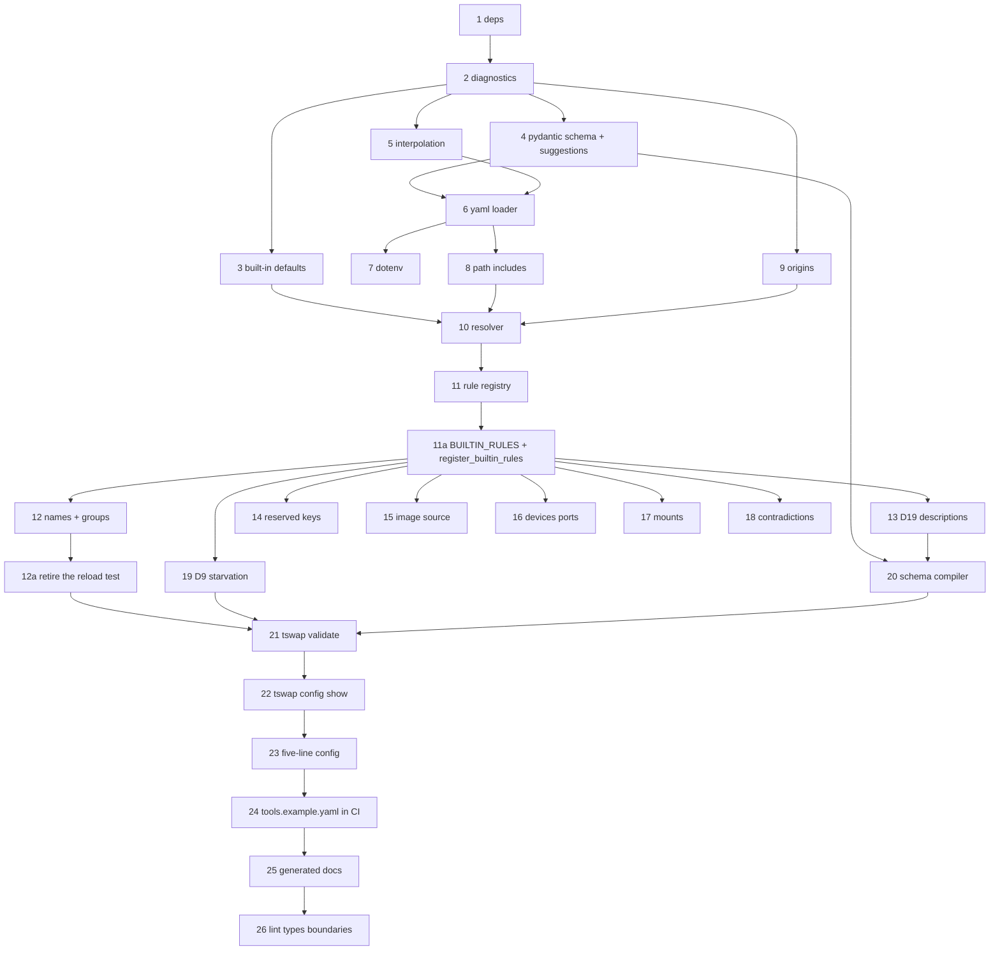

# M1 — Configuration: parse, validate, resolve with excellent error messages

**Intake:** GitHub issue [#2 — M1 — Configuration](https://github.com/iar3-r8/tool-swap/issues/2)
**Classification:** **feature** (new product capability: the configuration layer the router runs on)
**Proposed branch:** `feature/m1-configuration`
**Test command:** `.venv/bin/python -m pytest`
**Baseline to preserve:** 206 passed, 2 skipped on `main`
**Planning questions posted to the issue:** [comment](https://github.com/iar3-r8/tool-swap/issues/2#issuecomment-5316964963) (Q1–Q9, mirrored in §5 below)

---

## 0. How to read this plan

Section §1 is **the TDD loop ledger**. Each numbered behaviour is one red→green→commit cycle: the Q&A tester writes the failing tests for exactly that behaviour, the coder makes them pass without breaking any earlier behaviour, and the pipeline commits. Behaviours are ordered so that every dependency is already green when it is needed.

Two rules that apply to every behaviour:

- **No `warnings.warn`, ever.** [`pyproject.toml`](pyproject.toml:64) sets `filterwarnings = ["error"]`, so a real Python warning aborts the suite. Every M1 "warning" is a `Diagnostic` with `severity="warning"` on a report object. This is a hard constraint, not a style preference.
- **Errors are data before they are text.** Every diagnostic carries a stable `code`, a `message`, a `location` (file + YAML path + line where available) and a `remedy`. Tests assert on `code` plus substrings of `message`/`remedy`, never on whole-string equality of rendered output — otherwise every wording improvement is a test failure.

### The diagnostic model (fixed in behaviour 2, used by everything after)

```python
@dataclass(frozen=True)
class Diagnostic:
    code: str            # "TSWAP-C101" — stable, greppable, documented
    severity: Severity   # ERROR | WARNING
    message: str         # what is wrong, naming the offending key/value
    location: Location   # file, yaml_path ("tools.cxr_to_embedding.ttl"), line, column
    remedy: str          # what to do about it — MANDATORY, non-empty
```

`remedy` is mandatory and non-empty for every diagnostic, enforced by a test that iterates the whole registered code table. The M1 Definition of Done is *"a message a stranger can act on"*; a diagnostic that cannot say how to fix itself does not satisfy it. This mirrors `plan/08_REPO_LAYOUT.md`'s rule for preflight checks (*"A check that cannot say how to fix its own failure does not get merged"*), which M5 will refactor `validate` into.

### Diagnostic code blocks

| Range | Owner |
|---|---|
| `TSWAP-C0xx` | reading/parsing the file (not found, YAML syntax, unresolvable env var, `path:` include errors) |
| `TSWAP-C1xx` | schema shape (unknown key, wrong type, missing required) |
| `TSWAP-C2xx` | naming and references (name charset, duplicates, unknown group) |
| `TSWAP-C3xx` | descriptions (D19) |
| `TSWAP-C4xx` | withdrawn/reserved keys (`soft_ttl`, `runtime.server: native`) |
| `TSWAP-C5xx` | resources, ports, devices, mounts |
| `TSWAP-C6xx` | contradictions and starvation warnings (D9) |
| `TSWAP-S1xx` | schema compiler |

The code table lives in one module and is rendered into the generated docs (behaviour 22), so the troubleshooting table cannot drift from the codes actually emitted.

---

## 1. Behaviour ledger

### Behaviour 1 — dependencies are declared and importable

- **Inputs:** [`pyproject.toml`](pyproject.toml:24); a venv built from `pip install -e ".[dev]"`.
- **Change:** add to `[project] dependencies`: `pydantic>=2.7`, `pyyaml>=6`, `python-dotenv>=1.0`, `jsonschema>=4.21`. Add `types-PyYAML` to the `dev` extra (mypy strict cannot type `yaml` without it; `pydantic` and `jsonschema` ship their own types). Add the same four to the `dev` extra so the test extra is self-sufficient, matching the precedent set for `typer` in M0.
- **Expected outputs:** `import pydantic, yaml, dotenv, jsonschema` all succeed; `pydantic.VERSION` starts with `2`; `make lint` (`ruff check` + `ruff format --check` + `mypy src/` strict) still exits 0; the 206-test baseline still passes.
- **Edge cases:**
  - `jsonschema` is needed **only** for meta-schema validation (behaviour 20). It is nonetheless a runtime dependency, because `tswap validate` is a runtime command.
  - The runtime distribution [`src/tool_swap_runtime/pyproject.toml`](src/tool_swap_runtime/pyproject.toml) must **not** gain any of these; the import-linter contracts keep the two packages apart and this milestone must not weaken that.
  - mypy strict will reject `yaml.safe_load`'s `Any` return flowing into typed code — the loader must narrow it explicitly (behaviour 6), not `# type: ignore` it.
- **Error behaviour:** a missing dependency surfaces as an ordinary `ModuleNotFoundError` at import. No `try/except ImportError` shims, no optional-feature degradation.
- **Files:** `pyproject.toml`.

### Behaviour 2 — the diagnostic model and the error-report container

- **Inputs:** constructed `Diagnostic` values.
- **Expected outputs:**
  - `Diagnostic` is frozen, hashable, ordered deterministically by `(file, line, code)` so output is stable across runs and platforms.
  - `Location` renders as `tools.yaml:42` when a line is known, `tools.yaml (tools.cxr_to_embedding.ttl)` when only the YAML path is known, and `tools.yaml` when neither is.
  - `ConfigReport.errors` / `.warnings` filter by severity; `.ok` is true iff `errors` is empty; `.exit_code` is `0` when ok else `1`.
  - `ConfigReport.render()` produces one block per diagnostic: severity + code, location, message, then an indented `remedy:` line.
  - `ConfigReport.to_json()` produces a list of objects with keys `code, severity, message, file, yaml_path, line, remedy` — the same content as the human render (the *"one report shape, three consumers"* rule from `plan/07_CLI_AND_OPS.md` §6).
  - `ConfigError` (the raised form) carries a `ConfigReport` so a caller that wants an exception and a caller that wants a report use the same data.
- **Edge cases:** empty report renders to the empty string, not `"no errors"` (the caller owns the success message); a diagnostic with an empty `remedy` raises `ValueError` at construction.
- **Error behaviour:** this behaviour *is* the error behaviour of everything downstream. Nothing here raises for config content.
- **Files:** `src/tool_swap/config/errors.py` (new), `tests/unit/config/test_errors.py`.

### Behaviour 3 — built-in defaults are a single named source of truth

- **Inputs:** none — the module's own constants.
- **Expected outputs:** every default in `plan/02_CONFIGURATION.md` §3 `defaults:` and §5 is present with the documented value: `ttl=900`, `keep_warm=False`, `autostart=True`, `group="default"`, `devices=[]`, `cpus=None`, `memory=None`, `shm_size="1g"`, `max_batch_size=8`, `max_wait_ms=20`, `workers=1`, `runtime_server="bentoml"`, `start_timeout=120`, `ready_timeout=600`, `queue_timeout=300`, `request_timeout=300`, `drain_timeout=30`, `stop_timeout=30`, `max_queue_depth=64`, `health_path="/health"`, `ready_path="/ready"`, `probe_interval=1.0`, `evict_cost=1`, `max_concurrent=None`, `restart_backoff=[1,5,15,60]`, `max_consecutive_failures=3`, `container_port=8000`, `expose_host_port=False`. Router: `host="0.0.0.0"`, `port=8600`, `log_level="INFO"`, `log_dir="./logs"`, `log_json=True`, `cors_origins=["*"]`, `auth_token=None`, `status_page=True`, `log_output="router"`. Backend: `type="docker"`, `network="tool-swap-net"`, `container_prefix="ms-"`, `label_namespace="com.tool-swap"`, `gpu_runtime="nvidia"`, `orphans="stop"`, `port_range=[7000,7999]`, `registry_prefix="tool-swap"`.
- **Edge cases:** mutable defaults (`devices`, `cors_origins`, `restart_backoff`, `port_range`, `mounts`, `env`) must be produced per-instance — a shared list mutated by one tool's resolution corrupting another is the classic bug here, and gets a dedicated test that resolves two tools and mutates one's `devices`.
- **Error behaviour:** none. A test asserts the built-in set is **exhaustive** over the resolvable field names, so adding a schema field without a default fails a test rather than producing a silent `None`.
- **Files:** `src/tool_swap/config/defaults.py` (new), `tests/unit/config/test_defaults.py`.

### Behaviour 4 — Pydantic schema accepts the documented config and rejects unknown keys with a suggestion

- **Inputs:** dicts (already-parsed YAML), including the full §3 reference config and the five-line minimal config.
- **Expected outputs:**
  - `RouterConfig`, `BackendConfig`, `DefaultsConfig`, `GroupConfig`, `ToolConfig`, `ToolYamlConfig`, `RootConfig` — all with `model_config = ConfigDict(extra="forbid")`.
  - The full §3 reference config validates with **zero** errors.
  - `version: 1` is accepted; `version: 2` is rejected naming the supported major (`TSWAP-C001`: *"config version 2 is not supported by tool-swap 0.1.0; this version understands version 1"*).
  - An unknown key produces `TSWAP-C101` naming the key, its containing path, **and the nearest valid alternative** computed by edit distance over that model's field names: `unknown key 'batch_size' in tools.cxr_to_embedding — did you mean 'max_batch_size'?`
  - When no field is within the distance threshold, the message omits *"did you mean"* and instead lists the valid keys for that block: `unknown key 'zzzz' in router — valid keys are: auth_token, cors_origins, host, ...`. A confidently wrong suggestion is worse than none.
  - `devices` is always a **list of GPU indices**, never a count. `devices: 3` is a type error whose message says so explicitly, citing §5.4 (*"`devices` is a list of GPU indices, not a count; write `devices: [3]` for GPU 3, or `devices: [0,1,2]` for three GPUs"*). This is the R8 flaw the spec calls out by name, so it gets its own message rather than Pydantic's default.
- **Edge cases:**
  - The nearest-alternative search runs against the *correct* model for the offending location, so `ttl` misspelled inside `groups:` suggests group fields, not tool fields.
  - Distance threshold must not suggest across obviously-unrelated names; the threshold and its rationale are asserted by a table-driven test (`batch_size`→`max_batch_size`, `mount`→`mounts`, `descripton`→`description`, `xyzzy`→ no suggestion).
  - Pydantic reports multiple errors at once — **all** unknown keys in one file must be reported in a single run, not just the first. `tswap validate` that reveals one typo per invocation is a bad tool.
  - `tools:` may be empty (`tools: {}`) — valid, warns nothing; a router with no tools is a legitimate boot state.
  - Extra keys inside `env:` are legal (it is a free-form map) — `extra="forbid"` must not be applied to map-valued fields.
- **Error behaviour:** the schema layer raises nothing to the caller; a translation function converts `pydantic.ValidationError` into a list of `Diagnostic`s. Pydantic's raw error text never reaches the user, because it names Python types and internal locations a config author cannot act on.
- **Files:** `src/tool_swap/config/schema.py` (new), `src/tool_swap/config/suggest.py` (new — the edit-distance helper, pure and separately tested), `tests/unit/config/test_schema.py`, `tests/unit/config/test_suggest.py`.

### Behaviour 5 — `${VAR}` and `${VAR:-default}` interpolation, with an actionable failure

- **Inputs:** raw YAML text plus an explicit environment mapping (injected, never read from the ambient process in tests).
- **Expected outputs:**
  - `${HF_TOKEN}` → the variable's value.
  - `${TSWAP_TOKEN:-}` → the empty string when unset (this exact form appears in §3's `auth_token`).
  - `${HF_HOME:-~/.cache/huggingface}` → the literal default when unset; `~` is **not** expanded by the interpolator (path expansion is behaviour 7's job, and doing it here would silently rewrite a value the user can see).
  - Multiple references in one scalar are all substituted; a reference inside a longer string substitutes in place (`${HF_HOME}/hub`).
  - `$$` escapes to a literal `$`, so a value containing a dollar sign is expressible.
  - A bare `$VAR` without braces is left **untouched** — only the braced form is a reference. Silently interpolating `$` in, say, a password would be a data-corruption bug.
  - Interpolation happens on the **raw text before YAML parsing**, so a substituted value cannot inject YAML structure — a value containing `: ` or a newline is quoted/escaped so it remains a scalar. This is tested adversarially with `HF_TOKEN='a: b'` and with a value containing `\n`.
- **Edge cases:**
  - `${VAR:-default}` where the default itself contains `}` or `:-`.
  - An unclosed `${VAR` is a syntax error naming the line, not a silent pass-through.
  - An empty-but-set variable (`HF_TOKEN=""`) is **set** — `${HF_TOKEN:-fallback}` yields `""`, matching POSIX `:-`... note this is the one place we deliberately deviate: POSIX `:-` substitutes on *unset or empty*. **We treat empty-but-set as set** and document it, because `TSWAP_TOKEN=""` meaning "explicitly no token" must not resurrect a default. A test pins this and the docs state it. *(Flagged as assumption A10.)*
- **Error behaviour:** a referenced variable that is unset **and** has no default → `TSWAP-C010`, naming the variable, the file, the line, and the remedy: *"set HF_TOKEN in the environment or in .env, or give it a default: `${HF_TOKEN:-}`"*. All missing variables are reported together, not one per run (§6 rule 10).
- **Files:** `src/tool_swap/config/interpolate.py` (new), `tests/unit/config/test_interpolate.py`.

### Behaviour 6 — the YAML loader reads a file, reports syntax errors with a line, and preserves source lines

- **Inputs:** a path to a YAML file on a `tmp_path`.
- **Expected outputs:**
  - The five-line minimal config (`tools:` / one tool / `path:`) loads to the expected mapping.
  - Every mapping node carries its **source line** so diagnostics can cite `tools.yaml:42`. Implemented with a `SafeLoader` subclass recording `__line__` per mapping, kept out of the data handed to Pydantic.
  - YAML anchors/aliases and an `x-defaults` anchor block resolve (§1 principle 6). A top-level key beginning `x-` is accepted and ignored, so the anchor idiom in the examples works without tripping `extra="forbid"`.
  - Duplicate keys in one mapping are an **error** (`TSWAP-C002`), not last-wins. PyYAML's default silently accepts them, and a duplicated `ttl:` where one is ignored is precisely the class of silent failure M1 exists to eliminate.
- **Edge cases:** empty file → `TSWAP-C003` (*"tools.yaml is empty; a minimal config needs a `tools:` block"*); a file whose top level is a list or scalar → `TSWAP-C004` naming what was found; a UTF-8 BOM is tolerated; CRLF line endings do not shift reported line numbers.
- **Error behaviour:** file not found → `TSWAP-C000` naming the resolved absolute path and the remedy (*"create tools.yaml, or pass --config <path>"*). YAML syntax error → `TSWAP-C001` with the parser's line/column and the offending line echoed with a caret. Both exit `2` from the CLI (behaviour 21) because the config could not be read at all — a different failure class from "the config is wrong".
- **Files:** `src/tool_swap/config/loader.py` (new), `tests/unit/config/test_loader.py`.

### Behaviour 7 — `.env` loading, merged before resolution

- **Inputs:** a `tmp_path` containing `.env` and `tools.yaml`; an injected base environment.
- **Expected outputs:**
  - `.env` next to the config file is loaded automatically; `--env-file <path>` overrides the location.
  - **Precedence: the real process environment wins over `.env`.** `HF_TOKEN` exported in the shell beats `HF_TOKEN` in `.env`, so a developer can override without editing the file. This is `python-dotenv`'s `load_dotenv(override=False)` semantics and is stated in the docs.
  - Values from `.env` are visible to interpolation (behaviour 5), so a `.env`-only variable resolves.
  - A missing `.env` is **not** an error (it is optional); a missing **explicitly requested** `--env-file` **is** an error (`TSWAP-C011`).
- **Edge cases:** `.env` with quoted values, `export ` prefixes, comments and blank lines; a `.env` entry whose value contains `=`; `.env` is never read into the *container* environment here — `env_file:` in a tool config is a separate, later concern and this behaviour must not conflate them.
- **Error behaviour:** an unparseable `.env` line → `TSWAP-C012` naming the line number and content.
- **Files:** `src/tool_swap/config/loader.py`, `tests/unit/config/test_env_loading.py`.

### Behaviour 8 — `path:` inclusion of `tool.yaml`, resolved relative to the including file

- **Inputs:** a `tmp_path` tree: `tools.yaml` with `tools: {t: {path: ./tools/t}}`, and `tools/t/tool.yaml` + `handler.py` + `requirements.txt`.
- **Expected outputs:**
  - `tool.yaml` is loaded and its content becomes the tool's mid-precedence layer (consumed in behaviour 10).
  - Relative paths inside `tool.yaml` (`handler: handler.py:Cls`, `runtime.requirements: requirements.txt`) resolve against **the `tool.yaml`'s own directory**, not the CWD and not the root config's directory. This is what makes a tool directory portable, which is the stated purpose of `path:` (§4).
  - Relative `path:` in `tools.yaml` resolves against the **root config file's** directory, so `tswap validate` gives identical results from any CWD — asserted by running the same validation from two different working directories.
  - `~` in `path:` expands; absolute paths are honoured as-is.
  - The `name:` inside `tool.yaml` must equal the `tools:` map key, or `TSWAP-C201` fires naming both. Silently preferring one would make the URL/container name unpredictable.
- **Edge cases:**
  - `path:` pointing at a directory with no `tool.yaml` → `TSWAP-C005` naming the directory and the expected filename.
  - `path:` pointing at a file rather than a directory → `TSWAP-C006`, with the remedy naming the directory form.
  - `path:` **and** an inline `handler:` in the same entry: legal — `path:` supplies the layer, inline wins (behaviour 10). `path:` and `build:` together is checked by behaviour 15 (exactly-one-image-source).
  - Two `tools:` entries with the **same** `path:` → `TSWAP-C202` warning; usually a copy-paste, but legitimate when two entries differ only by `params:` (§5.5.1 explicitly describes that pattern), so it is a warning with the remedy naming that case.
  - No include recursion: a `tool.yaml` may not itself contain `path:` or nested includes (`TSWAP-C007`). One level, so there is no cycle detection to get wrong.
  - A symlinked tool directory resolves through the symlink without escaping the check.
- **Error behaviour:** as listed. A `tool.yaml` that fails its own schema validation reports diagnostics located in **that** file, with its own line numbers — not in `tools.yaml`.
- **Files:** `src/tool_swap/config/loader.py`, `tests/unit/config/test_includes.py`.

### Behaviour 9 — `Origin` tracking primitives

- **Inputs:** layer dicts tagged with their provenance.
- **Expected outputs:**
  - `Origin` names the level (`INLINE` | `TOOL_YAML` | `DEFAULTS` | `BUILT_IN`) **and** the concrete source (`tools.yaml:143`, `tools/t/tool.yaml:12`, `built-in default`).
  - `Origin.render()` → `tools.yaml:143 (inline)`, `built-in default`.
  - `ResolvedValue[T]` pairs a value with its `Origin`; an `OriginMap` maps a dotted field path to the winning `Origin`, and additionally records the **shadowed** origins so `config show --verbose` can say *"`ttl: 600` from tools.yaml:143 (inline), overriding 900 from built-in default"*. Knowing what was overridden is the whole point of the command.
- **Edge cases:** merged/concatenated fields (`env`, `mounts`) need **per-element** origins — `env.HF_HOME` may come from `defaults:` while `env.MY_VAR` comes from inline; each mount string carries the origin of the layer that contributed it. A single origin for the whole collection would be a lie.
- **Error behaviour:** requesting the origin of an unknown field path raises `KeyError` — a programming error, not a user error.
- **Files:** `src/tool_swap/config/origin.py` (new), `tests/unit/config/test_origin.py`.

### Behaviour 10 — the resolver: precedence `inline > tool.yaml > defaults > built-in`, with origins

- **Inputs:** the four layers for one tool.
- **Expected outputs:**
  - **Scalars:** the highest present layer wins. A four-layer test sets `ttl` at every level and asserts inline wins with `Origin.INLINE`; then removes layers one at a time and asserts each next level takes over with the right origin.
  - **`env` is merged** key-by-key, the higher layer winning per key (§5.6). `defaults.env = {HF_HOME: /a, HF_TOKEN: x}` + inline `env = {HF_HOME: /b}` → `{HF_HOME: /b, HF_TOKEN: x}` with per-key origins.
  - **`mounts` is concatenated**, not replaced (§5.6), in order **built-in → defaults → tool.yaml → inline**, so the most specific mount is last. Duplicates are preserved (Docker's own last-wins applies) but a duplicate *container* path across layers emits `TSWAP-C503` warning naming both host sources, because a shadowed mount is invisible at runtime.
  - **Other lists (`devices`, `cors_origins`, `restart_backoff`, `args`, `cmd`) are replaced wholesale**, not concatenated. Asserted explicitly, because "which lists merge" is the documented confusion (§5.6) and guessing differently per field is how a config layer becomes unpredictable.
  - **Nested blocks in `tool.yaml` flatten onto the tool's fields**: `batching.max_batch_size` → `max_batch_size`, `resources.group` → `group`, `resources.accelerator` → `devices` hint, `lifecycle.ttl` → `ttl`, `lifecycle.ready_timeout` → `ready_timeout`. The mapping table is asserted field by field, in both directions, so a `tool.yaml` key that maps to nothing fails a test.
  - `ttl: -1` means **inherit `defaults.ttl`** (§5.3 sentinel), `0` means never stop, `>0` seconds. `-1` resolves to the inherited value with the origin of the layer it inherited *from*, not the layer holding `-1`. `-2` and below → `TSWAP-C501` naming the three legal sentinels.
  - The output is a frozen `ResolvedTool` plus its `OriginMap`. Resolution is a **pure function** of the layers — no filesystem, no environment, no clock — so it is exhaustively testable, per the project's pure-function guideline.
- **Edge cases:**
  - An explicit `null` in a higher layer: it **wins** and means "unset", it does not fall through. Otherwise `cpus: null` could never override a `defaults.cpus: 4.0`. Tested directly, and documented, because the opposite reading is equally defensible and the choice must be visible.
  - A key absent from a layer's dict is distinct from a key present with value `None`. The layers therefore carry sentinel-free "unset" markers rather than `None`.
  - `devices` inherited **from the group** when the tool sets none (§5.4 *"from group"*): origin is the group, rendered as `groups.gpu0.devices`. Group-supplied `devices` sit between `defaults:` and `built-in` in precedence — *(flagged as assumption A11; §4.1 does not place the group layer.)*
  - Resolving all tools must not share mutable defaults (see behaviour 3).
- **Error behaviour:** the resolver emits diagnostics for sentinel violations only; every cross-tool and cross-reference rule belongs to behaviours 12–19, so the resolver stays pure.
- **Files:** `src/tool_swap/config/resolver.py` (new), `tests/unit/config/test_resolver.py`, `tests/unit/config/test_merge_semantics.py`.

### Behaviour 11 — the validator skeleton: a rule registry that reports everything at once

- **Inputs:** a resolved config + origins.
- **Expected outputs:**
  - Rules are registered objects with `id`, `severity`, a `check()` returning diagnostics, and a **mandatory** `remedy` — deliberately the shape `plan/08_REPO_LAYOUT.md` specifies for the M5 preflight `Check` protocol, so M5 *moves* these rules rather than reimplementing them (guardrail 13). Getting the shape right now is what makes that a move.
  - `validate_config()` runs **every** rule and returns one report; it does not stop at the first error. A config with five distinct problems yields five diagnostics.
  - Rule order does not affect the outcome; diagnostics are sorted deterministically (behaviour 2).
  - A registry test asserts every §6 rule in scope has a registered id, and that every registered id is exercised by at least one test — so a rule cannot be quietly dropped.
- **Edge cases:** a rule raising an unexpected exception is caught and reported as an internal diagnostic naming the rule id, rather than crashing the whole command and hiding the other findings.
- **Error behaviour:** never raises for config content.
- **Files:** `src/tool_swap/config/validate.py` (new), `tests/unit/config/test_validate_registry.py`.
- **Status: SHIPPED (committed).** Line 205 above states a *requirement* (no rule silently dropped) but not a *mechanism*. The mechanism is decided below; under that decision **both** of behaviour 11's registry tests remain correct and unchanged — see "Registration mechanism" next.

### Registration mechanism — DECIDED (2026-08-18)

**The ambiguity.** Behaviour 11 ships an empty registry and its docstring says *"Importing `validate.py` never registers a rule."* Behaviour 12's committed RED test pins the opposite (import-time self-registration, verified by `importlib.reload`). Line 205 requires that no rule be silently dropped but names no mechanism. Behaviours 12–19 all need one, and behaviour 21 cannot produce a full report without it.

**Options considered.**

| | Option A — import-time self-registration | Option B — explicit `register_builtin_rules()` | Option C — per-test-module registration only |
|---|---|---|---|
| Mechanism | `validate.py` calls `register(...)` at module top level | `validate.py` defines `BUILTIN_RULES` + an idempotent `register_builtin_rules()`; the CLI entry point calls it once | Each test module registers what it needs; no central entry point |
| B11 fresh-interpreter test | **Breaks** — a fresh interpreter would report six ids, not `[]` | **Passes unchanged** — import still registers nothing | Passes unchanged |
| B11 `import_module` test | Passes only by accident (an already-loaded module is not re-executed), so it would assert nothing | **Passes, and means what it says** | Passes |
| Duplicate-registration RAISING | Fine on `reload` (a fresh namespace), but a genuine double-import path collides with `ValueError` | `register()` keeps its strict duplicate guard; the bulk entry point is a no-op for rules already registered as the *same object*, so re-entry never raises while a real id clash still does | N/A |
| Reload idempotency | **Hazardous.** `reload` rebinds the module global to a *new* `_RuleRegistry`, orphaning every `from ... import RULES` binding held elsewhere — including behaviour 11's test module. Collection is alphabetical (`names_groups` before `registry`), so the reload poisons B11's later assertions | No reload anywhere; the registry object is never replaced | No reload anywhere |
| Test isolation (autouse `unregister_all`) | Fighting it: the fixture wipes the registry, and the only way to restore it is the hazardous reload | Working with it: a test registers exactly the rules it exercises, or calls the entry point deliberately | Working with it |
| Line 205 no-silent-drop | Satisfied by import | **Satisfied by a completeness test** over `BUILTIN_RULES` vs the §6 scope table | **Violated** — a rule nobody registers is invisible |
| B21 full report | Implicit, order-dependent on who imported what | One deterministic call site | No answer |
| M5 move-not-reimplement | Rules are reachable only as import side effects | `BUILTIN_RULES` **is** the list M5 moves; the `Rule` shape is unchanged | Nothing to move |

**Decision: Option B — explicit registration via `register_builtin_rules()`.** It is the only option that satisfies line 205 without invalidating a single committed behaviour-11 test, and it removes the `importlib.reload` hazard that would otherwise make the suite order-dependent.

Contract added by behaviour 11a below:

- `BUILTIN_RULES: tuple[Rule, ...]` — every rule M1 ships, in code order. Behaviours 12–19 each append their own rules to it.
- `register_builtin_rules() -> None` — registers every rule in `BUILTIN_RULES`. **Idempotent:** a rule already registered *as the same object* is skipped; an id registered by a *different* object still raises `ValueError` through `register()`, so the duplicate-id guard is preserved rather than weakened.
- Importing `validate.py` continues to register nothing. This keeps `config` a side-effect-free leaf package (behaviour 26) and keeps the fresh-interpreter test honest as the number of rules grows.

### Behaviour 11a — the registration entry point (`BUILTIN_RULES`, `register_builtin_rules()`)

*New numbered item, added 2026-08-18 by the decision above. Behaviour 11 is already committed, so this is a separate red→green→commit cycle. It must land **before** behaviour 12's green step, because behaviour 12's rules are the first entries in `BUILTIN_RULES`.*

- **Inputs:** the module's own `BUILTIN_RULES` tuple.
- **Expected outputs:**
  - `BUILTIN_RULES` exists and is a tuple of `Rule`. While behaviour 11a is the only landed step it is **empty**; each of behaviours 12–19 adds its rules and extends the completeness assertion.
  - `register_builtin_rules()` leaves `registered_rule_ids()` equal to `[rule.id for rule in BUILTIN_RULES]`.
  - **Idempotency:** calling it twice in a row is not an error and does not duplicate ids — asserted directly, because behaviour 21 and the test suite may both reach it.
  - After `unregister_all()`, calling it again restores exactly the same ids — the fixture-friendly property that makes Option B work with the autouse reset fixtures.
  - A rule id present in `BUILTIN_RULES` twice (a genuine authoring mistake) raises `ValueError` naming the id, via the existing `register()` guard.
  - Importing `validate.py` still registers nothing: behaviour 11's [`test_fresh_interpreter_starts_with_an_empty_registry`](tests/unit/config/test_validate_registry.py:685) and [`test_importing_validate_leaves_the_registry_unchanged`](tests/unit/config/test_validate_registry.py:668) stay green **unchanged**, and remain green for the rest of M1.
  - **The line-205 completeness test lives here**: the set of `BUILTIN_RULES` ids equals the set of codes the §6 rule → behaviour map marks in scope for M1, so a rule cannot be quietly dropped. It is extended by each of behaviours 12–19, which is what makes "no silent drop" mechanical rather than aspirational.
- **Edge cases:** no `importlib.reload` of `validate.py` anywhere in the suite. The registry is live module-level state, and `reload` rebinds it to a new object while other modules keep the old binding — a suite-order-dependent failure. A test asserting the registry survives an ordinary re-import (`import_module`) is the correct, non-destructive form.
- **Error behaviour:** `register_builtin_rules()` never raises for config content; it raises only for an authoring error in `BUILTIN_RULES` itself.
- **Files:** `src/tool_swap/config/validate.py`, `tests/unit/config/test_validate_registry_builtins.py` (new — a new file rather than an edit to the committed behaviour-11 file, so that file's shipped assertions stay untouched).

### Behaviour 12 — names, duplicates, and group references (§6 rules 2, 3)

- **Inputs:** configs with bad names and dangling group references.
- **Expected outputs / error behaviour:**
  - `TSWAP-C210`: name not matching `^[a-z0-9][a-z0-9_-]*$` → error naming the tool, the offending characters, and the reason (*"used in URLs, container names and log directory names"*). Cases: `Tool_A` (uppercase), `_leading`, `has space`, `has.dot`, `ünïcode`, `""`.
  - `TSWAP-C211`: duplicate tool names. (Distinct from behaviour 6's duplicate-YAML-key error: this catches a duplicate arising *across* layers or after `tool.yaml` name resolution.)
  - `TSWAP-C220`: a tool references a group absent from `groups:` → error naming the group, the tool, and the **nearest existing group name** plus the full list of defined groups.
  - `TSWAP-C221`: `groups.*.max_resident < 1` → error naming the group and the value.
  - `TSWAP-C222`: `groups.*.eviction` not in `{lru, lifo, none}` → error listing the valid values.
  - The implicit `default` group: a tool with no `group:` resolves to `default`. If `groups:` is absent entirely, a `default` group with `max_resident: 4` is synthesised (so the five-line config works) with origin `built-in default`. If `groups:` is present but omits `default` while some tool needs it, that is `TSWAP-C220` like any other missing group — silently synthesising into a hand-written `groups:` block would hide a typo.
- **Edge cases:** a group defined but referenced by nothing → `TSWAP-C223` warning (probably a rename); a tool named `default` is legal (names live in different namespaces) and is tested so nobody "fixes" it.
- **Files:** `src/tool_swap/config/validate.py`, `tests/unit/config/test_validate_names_groups.py`.

#### Confirmed contract details (2026-08-18)

Settled by the registration decision above and by the committed RED test [`tests/unit/config/test_validate_names_groups.py`](tests/unit/config/test_validate_names_groups.py:1) (commit `a285d5b`):

- **Rule objects:** module-level constants `TSWAP_C210_RULE`, `TSWAP_C211_RULE`, `TSWAP_C220_RULE`, `TSWAP_C221_RULE`, `TSWAP_C222_RULE`, `TSWAP_C223_RULE` in `validate.py`, each a frozen `Rule` subclass instance whose `id` is the matching code. `TSWAP-C223` is `Severity.WARNING`; the other five are `Severity.ERROR`. Every `remedy` is non-empty.
- **No self-registration.** The six rules are appended to `BUILTIN_RULES` (behaviour 11a) and are registered by `register_builtin_rules()`. `validate.py` must **not** call `register(...)` at import time. Behaviour 12's green step therefore also extends behaviour 11a's completeness test with these six ids.
- **`effective_groups(raw: dict) -> dict[str, dict]`** — a pure helper: when `raw` has no `"groups"` key it returns the synthesised `{"default": {"max_resident": 4, "eviction": "lru"}}`; when `"groups"` is present it returns that block **deep-copied and otherwise unchanged**, never inserting a `default` entry. The synthesised values match [`GroupConfig`](src/tool_swap/config/schema.py:120)'s field defaults, so the synthesis cannot drift from the schema.
- **Location contract:** every diagnostic carries `Location(file=str(config.path), yaml_path=<dotted path>, line=config.line_for(<dotted path>))` — `tools.<name>` for `C210`, `groups.<name>.max_resident` for `C221`, `groups.<name>.eviction` for `C222`. A `line_for` returning `None` surfaces `line=None`; the file is never hardcoded.
- **`C220` nearest-group suggestion** reuses `config/suggest.py` (behaviour 4), so the "did you mean" logic has one implementation.

### Behaviour 12a — retire the reload-based registration test

*New numbered item, added 2026-08-18. Behaviour 12's RED step is already committed, so correcting it is itself a test change = a new red step = a new commit.*

- **Superseded test:** [`test_behaviour_12_rules_are_registered_at_import_time`](tests/unit/config/test_validate_names_groups.py:247) in `tests/unit/config/test_validate_names_groups.py`. It pins import-time self-registration, which the decision above rejects, and it does so via `importlib.reload(tool_swap.config.validate)`.
- **Why it must go, beyond the decision:** `reload` re-executes the module top level and **rebinds `RULES` to a new `_RuleRegistry` object**, while [`tests/unit/config/test_validate_registry.py`](tests/unit/config/test_validate_registry.py:95) holds a `from tool_swap.config.validate import RULES` binding to the original. Test files are collected alphabetically, so `test_validate_names_groups.py` reloads the module *before* `test_validate_registry.py` runs, and that file's `assert (r1, r2) == RULES` assertions then compare against a detached, permanently-empty object. The reload is a latent cross-file failure regardless of which registration mechanism wins.
- **Replacement (the new red):** a test asserting that `register_builtin_rules()` registers the six behaviour-12 ids into a registry cleared by the autouse fixture, and that the ids are absent beforehand. This proves the same thing the reload test was reaching for — the rules are reachable from a central entry point and none is dropped — with no module reloading and no dependence on collection order.
- **Also amended in the same red step:** the module docstring's pinned-API paragraph (lines 23–28), which states the rules *"must register themselves at import time via explicit `register` calls … pinned by one dedicated reload test"*. The other 20-odd tests in the file are unaffected: each already calls `register(TSWAP_C2xx_RULE)` explicitly, because the autouse `unregister_all()` fixture clears the registry before every test — so self-registration was never what made them pass.
- **Behaviour 11's tests are NOT amended.** Both [`test_fresh_interpreter_starts_with_an_empty_registry`](tests/unit/config/test_validate_registry.py:685) and [`test_importing_validate_leaves_the_registry_unchanged`](tests/unit/config/test_validate_registry.py:668) remain correct and unchanged under this decision. This is the decisive practical advantage of Option B: it invalidates one test in one uncommitted-behaviour file rather than two tests in a shipped one.
- **Files:** `tests/unit/config/test_validate_names_groups.py` (test change only; no source change).

### Behaviour 13 — D19, the mandatory-description rule (§6 rule 6b)

- **Inputs:** tools with descriptions missing at each of the three sites.
- **Expected outputs / error behaviour:**
  - `TSWAP-C300` **ERROR** — missing or whitespace-only `description` on the tool. Message states *why*: *"the description is what an LLM agent reads to decide whether to call this tool"*, with the remedy naming the file and key to add.
  - `TSWAP-C301` **ERROR** — missing description on any entry in `inputs:`, naming the input.
  - `TSWAP-C302` **WARNING** — missing description on any entry in `outputs:`, naming the output.
  - `TSWAP-C303` **ERROR** — missing description on any entry in `params:` (§5.5.1 requires `name`, `type`, `description`).
  - `--allow-missing-descriptions` downgrades `C300`, `C301` and `C303` to warnings **and** appends to each: *"downgraded by --allow-missing-descriptions; this flag is for local prototyping and is never permitted in CI"*. The banner is part of the diagnostic, so it survives `--json` and cannot be lost by a caller that only prints diagnostics.
- **Edge cases:** a description of `"   "` or `"\n"` counts as missing; a description present in `tool.yaml` and blank inline — inline wins per behaviour 10, so it **is** missing, and this precedence interaction gets its own test because it is easy to implement backwards. A very short description (`"x"`) is accepted — we do not invent a length rule the spec does not state.
- **Files:** `src/tool_swap/config/schema.py` (the two field additions below), `src/tool_swap/config/resolver.py` (the carrier fields below), `src/tool_swap/config/validate.py`, `tests/unit/config/test_validate_descriptions.py`.

#### Confirmed contract details (2026-08-18)

The rule needs four data fields that the shipped modules do not carry end to end. This block pins the whole data path, so the RED step can be written and the GREEN step implemented without guessing. **No shipped test breaks under it** — that is the property the design was chosen for (see "Why not flat keys" below).

**1. Schema additions ([`schema.py`](src/tool_swap/config/schema.py:1))**

On [`ToolYamlConfig`](src/tool_swap/config/schema.py:159) — the authoring blocks of `plan/02` §4, kept **as authored** (the compiler of behaviour 20 owns their inner shape, so this layer stores and does not interpret):

```python
inputs: list[dict[str, Any]] | None = None
outputs: list[dict[str, Any]] | None = None
params: list[dict[str, Any]] | None = None
json_schema: dict[str, Any] | None = None
```

`list[dict[str, Any]]` is deliberate: an entry is a mapping of `name` / `type` / `required` / `description` / `semantic` / `items` (§5.5.1 requires `name`, `type`, `description`; §8.4 adds the rest), but declaring a per-entry Pydantic model here would move `TSWAP-S1xx` shape validation out of behaviour 20, which owns it. `None` (absent) must stay distinct from `[]` (declared empty) — behaviour 20 pins `None ≠ {}`, and a no-argument tool is legal.

On [`ToolConfig`](src/tool_swap/config/schema.py:134) — one field only:

```python
description: str | None = None
```

`description` **must** be here, because plan line 297 requires that a blank inline description beat a good one in `tool.yaml`; a value that cannot be written inline cannot win inline. `inputs:` / `outputs:` / `params:` / `json_schema:` are **not** added to `ToolConfig` in M1: every authoring example puts them in `tool.yaml`, behaviour 20's inputs are *"as authored in `tool.yaml`"*, and nothing in M1 reads an inline copy. This is a deliberate narrowing of §5.5.1's *"Overridable per config entry"* — recorded as assumption **A14** in §5, and cheap to widen later because the carrier fields already exist.

*Not part of behaviour 13, but discovered while pinning it:* `ToolYamlConfig` is currently **unreachable** — no `RootConfig` field has that type, so `validate_root` never applies it, and the loader deliberately does not schema-validate an included `tool.yaml` ([`test_include_tool_yaml_unknown_key_loads_with_file_recorded`](tests/unit/config/test_includes.py:543) pins exactly that). Whoever first wires it in must also add the §4 blocks `runtime`, `batching`, `resources`, `lifecycle` and `example`, or `extra="forbid"` will reject the §4 reference `tool.yaml`. Behaviour 13 does **not** wire it in.

**2. Resolver additions ([`resolver.py`](src/tool_swap/config/resolver.py:41)) — trailing carrier fields, and NO new flat keys**

```python
@dataclass(frozen=True)
class ResolvedTool:
    name: str
    values: dict[str, object]
    origins: OriginMap
    diagnostics: list[Diagnostic]
    # --- added by behaviour 13; outside `values` on purpose ---
    description: str | None = None
    inputs: list[dict[str, object]] | None = None
    outputs: list[dict[str, object]] | None = None
    params: list[dict[str, object]] | None = None
    json_schema: dict[str, object] | None = None
```

- `values` is **unchanged**: still exactly `set(BUILT_IN_DEFAULTS)`, still 47 keys.
- `BUILT_IN_DEFAULTS` is **unchanged**: still exactly 47 keys.
- `description` is **layered** by `resolve_tool`, `inline` > `tool.yaml`, and nothing below: `defaults:`, the group layer and the built-in layer contribute no description (a defaulted description would defeat D19 entirely). A key **present with a blank value wins**, exactly like every other layer key (plan line 191), which is what makes plan line 297's case come out as *missing*. When no layer supplies the key at all, the field is `None`. The existing `_winner_index` helper cannot be reused unmodified — it raises `AssertionError` when no layer provides the field, relying on the built-in layer always having it — so this needs its own small pure helper over the same layer list.
- `inputs` / `outputs` / `params` / `json_schema` are **not layered**: they are read from the `tool_yaml` layer only, deep-copied verbatim on entry like every other layer input, and are `None` when the key is absent.
- These keys are invisible to [`_flatten_tool_yaml`](src/tool_swap/config/resolver.py:199) today (its first loop skips keys outside `_KNOWN_BLOCKS`, its second copies only keys in `BUILT_IN_DEFAULTS`), so they are currently **silently dropped** and, importantly, do **not** produce `TSWAP-C106`. Extraction is therefore purely additive and cannot change any existing diagnostic.
- **Origins:** recorded in the same `OriginMap` at the dotted paths `description`, `inputs`, `outputs`, `params`, `json_schema` — and **only when some layer supplied the key**, so behaviour 9's contract (an unrecorded path raises `KeyError`) keeps meaning something.

**Why not flat keys in `values` (the pin that would have broken)**

Both obvious routes break a committed test, in opposite directions:

| Route | Breaks |
|---|---|
| Add `description`/`inputs`/… to `values` but **not** to `BUILT_IN_DEFAULTS` | [`test_values_covers_exactly_the_builtin_field_set`](tests/unit/config/test_resolver.py:115) — it asserts `set(result.values) == set(BUILT_IN_DEFAULTS)`, **set equality in both directions** |
| Add them to `BUILT_IN_DEFAULTS` as well | [`test_built_in_default_key_set_is_exhaustive_over_resolvable_fields`](tests/unit/config/test_defaults.py:324) — it asserts `set(BUILT_IN_DEFAULTS) == set(EXPECTED_RESOLVABLE_FIELDS)`, a 47-name table pinned literally in the test file |

Carrier fields on `ResolvedTool` break neither, and they are also the honest modelling: these are not *resolvable defaultable fields*, they are authored content. Adding **trailing defaulted** fields to a frozen dataclass is safe against every existing construction site — [`test_validate_registry.py`](tests/unit/config/test_validate_registry.py:151) and [`test_validate_names_groups.py`](tests/unit/config/test_validate_names_groups.py:114) both build `ResolvedTool(name=…, values=…, origins=…, diagnostics=…)` by keyword — and against [`test_resolved_tool_is_frozen_dataclass_with_pinned_fields`](tests/unit/config/test_resolver.py:99), which asserts the presence of the four original fields and frozenness, not the absence of others. Defaults must be `None` (never `[]` or `{}`): a dataclass rejects a mutable default outright, and `None`-means-absent is required anyway.

**3. The rule-source contract**

[`ValidatedConfig`](src/tool_swap/config/validate.py:150) stays **frozen at its four fields** (`tools`, `raw`, `line_for`, `path`) — pinned by [`test_validated_config_fields_and_defaults`](tests/unit/config/test_validate_registry.py:311) and its immutability twin, and **not** amended here. Everything the rule reads therefore comes from `config.tools[<key>]`:

- `tool.description` → `C300`
- `tool.inputs` → `C301`
- `tool.outputs` → `C302`
- `tool.params` → `C303`

The rule must **not** re-read the filesystem, must **not** call the loader, and must **not** parse `config.raw` for these four — `raw` holds the inline layer only, so a `tool.yaml`-authored description is not in it, and reading it would reintroduce precedence logic the resolver already owns. `config.raw` stays in use only for the group rules of behaviour 12.

**Blankness (one helper, pinned):** a description counts as **missing** when the value is `None`, or a `str` whose `.strip()` is empty (`""`, `"   "`, `"\n"`). A **non-string** value (e.g. `description: 123`) counts as **present** and is left to the schema layer's `TSWAP-C105`, so one mistake yields one diagnostic rather than two. `"x"` is present.

**Robustness (prevents a `TSWAP-C999`):** an entry inside `inputs:`/`outputs:`/`params:` that is not a mapping (e.g. `inputs: [paths]`) is **skipped silently** by this rule; malformed entries belong to behaviour 20's `TSWAP-S1xx`. A block whose value is not a list is likewise skipped.

**Naming the entry:** `C301`/`C303` name the input/param and `C302` names the output, taken from the entry's `name` value when it is a non-empty string; otherwise the entry is named positionally as `inputs[<i>]` / `outputs[<i>]` / `params[<i>]` so the message stays actionable.

**4. Absent blocks are legal (behaviour 23's five-line config)**

`C300` applies to **every** tool. `C301`, `C302` and `C303` apply **only to entries that exist**: `inputs` absent (`None`) and `inputs: []` both yield **nothing**, from all three codes. The five-line minimal config therefore validates clean, provided `tools/example_echo/tool.yaml` carries a non-blank `description:` — which behaviour 23's fixture must, since `C300` has no escape in a zero-diagnostic assertion.

**5. Location / `yaml_path` per code**

Every diagnostic carries `Location(file=str(config.path), yaml_path=<below>, line=config.line_for(<the same string>))` — the behaviour-12 form; the file is never hardcoded, and `line=None` is a legal outcome.

| Code | `yaml_path` |
|---|---|
| `C300` | `tools.<name>` |
| `C301` | `tools.<name>.inputs.<i>.description` |
| `C302` | `tools.<name>.outputs.<i>.description` |
| `C303` | `tools.<name>.params.<i>.description` |

`<i>` is the 0-based entry index; `<name>` is the `tools:` **map key** (not `tool.name`), matching behaviour 12's `tools.<key>` choice.

**Dotted-numeric, not `[i]`, and why the two conventions differ.** The repo already has two list-index spellings and they are not interchangeable:

- [`OriginMap`](src/tool_swap/config/origin.py:95) uses brackets (`mounts[0]`) — an opaque key namespace with no line information attached, documented as caller convention.
- [`LoadedConfig`](src/tool_swap/config/loader.py:494)'s line map uses **dotted numeric** segments: [`_walk_lines`](src/tool_swap/config/loader.py:95) indexes a sequence element as `prefix + (str(index),)`, producing keys like `tools.t.inputs.0.description`.

`Location.yaml_path` is the string handed to `line_for`, so it follows the **loader's** convention. Two consequences, pinned rather than discovered:

- Today `line_for` returns `None` for any list-indexed path: it walks `data` dict-by-dict and bails at the first non-dict (`inputs` is a list), before it ever consults the line map that already holds the right key. Behaviour 13's tests must therefore assert `location.line == config.line_for(location.yaml_path)` (behaviour 12's shipped pattern), **never** a hardcoded line number.
- Teaching `line_for` to walk list indices is a real improvement and a **non-goal here** — it changes a shipped, tested method, so it needs its own red step, and behaviour 13 must not depend on it. The `yaml_path` form pinned above is chosen precisely so that fix later becomes a loader-only change with no diagnostic churn.

Note also that the `C301`/`C302`/`C303` paths only ever resolve to a line for an **inline**-authored block, since the line map belongs to the root config; a `tool.yaml`-authored entry has no line here. `Location.file` is `str(config.path)` for all four codes, because `ValidatedConfig` carries no per-tool `tool.yaml` path and is frozen. The remedies must therefore be self-sufficient: name the key to add and the tool it belongs to, and direct the author to *"the tool's `tool.yaml`, or its inline `tools.<name>` entry"* rather than pretending to know which file. Carrying the `tool.yaml` path (as a further `ResolvedTool` carrier field) is a deliberate deferral, not an oversight.

**6. The `--allow-missing-descriptions` downgrade — mechanism (a)**

**Decision: the rules always emit their documented severities; a pure post-processing function rewrites the report.** Not (b): a flag-bearing rule would have to be constructed per invocation, which collides head-on with `BUILTIN_RULES` being a tuple of module-level singletons whose *identity* `register_builtin_rules()` relies on for idempotency (behaviour 11a), and it would put CLI state inside a rule that must stay a pure function of `ValidatedConfig`.

The mechanism lives in `validate.py`, **not** in the CLI, so it is unit-testable in behaviour 13's own file before behaviour 21 exists; the CLI merely calls it:

```python
MISSING_DESCRIPTION_CODES: Final[frozenset[str]] = frozenset(
    {"TSWAP-C300", "TSWAP-C301", "TSWAP-C303"}
)
ALLOW_MISSING_DESCRIPTIONS_BANNER: Final[str] = (
    "downgraded by --allow-missing-descriptions; this flag is for local "
    "prototyping and is never permitted in CI"
)

def downgrade_missing_descriptions(report: ConfigReport) -> ConfigReport: ...
```

- Pure: returns a **new** `ConfigReport` and mutates nothing. `Diagnostic` is frozen, so each rewrite is a `dataclasses.replace(d, severity=Severity.WARNING, message=f"{d.message} — {ALLOW_MISSING_DESCRIPTIONS_BANNER}")`.
- Exactly `C300`, `C301`, `C303` are touched. `C302` is untouched — it is already a warning, and appending "downgraded by" to a diagnostic the flag did not change would be a lie.
- The banner goes in **`message`**, which is what makes it survive `--json`: [`to_json`](src/tool_swap/config/errors.py:159) serialises `message` and `severity`, and the CLI runs the downgrade **before** rendering or serialising, so both consumers see identical content. It is not put in `remedy` (the remedy still describes the fix, not the flag).
- **Idempotent:** a diagnostic already carrying the banner is returned unchanged, so a double call cannot double-append. Pinned by a test, because a CLI refactor could easily call it twice.
- Every other diagnostic passes through untouched; the returned report carries the same diagnostics otherwise, served in the existing `ConfigReport` sort order.
- **`--strict` + `--allow-missing-descriptions` is contradictory, and `--strict` wins:** the downgrade runs first, then `--strict` promotes warnings back to errors. The flag therefore cannot smuggle a missing description past the mode CI actually uses — which is exactly what *"never permitted in CI"* asserts. Behaviour 21 owns the flag plumbing; behaviour 13 owns the function and pins this ordering so 21 has nothing left to decide.

**7. What behaviour 20 reads (one contract, two consumers)**

Behaviour 20's compiler keeps its pure signatures (`compile_inputs(inputs)`, `compile_outputs(outputs)`) and is handed `tool.inputs` / `tool.outputs` / `tool.params` / `tool.json_schema` from the same carrier fields — **no second storage, no re-reading of `tool.yaml`, no re-parse**. That is what lets `C301` and `S120` be asserted to agree (corpus 12) rather than merely hoped to: they read the same list out of the same field. `json_schema` is carried for the same reason — `TSWAP-S130` must detect `json_schema:` **and** `inputs:` both present, which requires both to be observable from one place.

**Rule objects (behaviour 12's shape, reused):** module-level `TSWAP_C300_RULE`, `TSWAP_C301_RULE`, `TSWAP_C302_RULE`, `TSWAP_C303_RULE` in `validate.py`, each a frozen `Rule` subclass instance whose `id` is its code; `TSWAP_C302_RULE` is `Severity.WARNING`, the other three `Severity.ERROR`; every `remedy` non-empty; **no import-time self-registration** — all four are appended to `BUILTIN_RULES` in code order, and behaviour 13's green step extends behaviour 11a's completeness test with the four ids.

### Behaviour 14 — withdrawn and reserved keys (§6 rules 4, 1c)

- **Inputs:** configs setting `soft_ttl` and `runtime.server: native`.
- **Expected outputs / error behaviour:**
  - `TSWAP-C400` — `soft_ttl` present at any level → **error** citing [ADR-0004](plan/adr/0004-hard-stop-only-in-v1.md) by path and title, stating that TTL is the only idle timer, with the remedy *"remove `soft_ttl`; use `ttl:` — it is the only idle timer in v1"*. This must **not** surface as the generic unknown-key error: §5.3 requires the key be *accepted by the schema and rejected at load* so that re-promotion stays additive. Tested by asserting the code is `C400` and **not** `C101`.
  - `TSWAP-C401` — `runtime.server: native` → error *"not implemented in this version"*, naming the current version and that `bentoml` is the only implemented backend (§6 rule 1c).
  - `TSWAP-C402` — `runtime.server` set to anything outside `{bentoml, native}` → unknown-value error **listing the valid ones**.
  - `TSWAP-C403` — `scalar_inputs` present → error citing ADR-0005 (removed; every handler takes a list). Same accepted-then-rejected treatment, for the same reason.
  - `TSWAP-C404` — per-input `batchable:` present → error citing ADR-0005: batching is a property of the tool. See assumption **A1**.
  - `TSWAP-C405` — `max_batch_bytes` present → error stating the key does not exist and naming the mitigation the spec prescribes (*"set `max_batch_size` low for large payloads"*, §5.5). **Corrected 2026-08-18** (this line previously read *"This key is not in the schema, so it would otherwise be a bare unknown-key error"*, which is unsatisfiable — see the contract block below, item 5): the key is **reserved in the schema and rejected by this rule**, so the author gets the spec's answer instead of a bare unknown-key error. Users coming from other batching frameworks will reach for it, and the spec has a specific answer.
- **Edge cases:** `soft_ttl: null` is still present and still rejected — the key's presence is the signal, not its value.
- **Files:** `src/tool_swap/config/schema.py` (the reserved fields below), `src/tool_swap/config/resolver.py` (the `RESERVED_KEYS` scan + the `reserved_keys` carrier below), `src/tool_swap/config/validate.py`, `tests/unit/config/test_validate_reserved.py`.

#### Confirmed contract details (2026-08-18)

Six rules, three data paths, and one contradiction in the source spec to resolve. This block pins all of it, so the RED step can be written and the GREEN step implemented without guessing. **No shipped test breaks under it** — see block 8, which names every test checked.

The governing property of the whole design, stated once because every decision below follows from it: **the accept/reject boundary does not move.** Every key named here is an error today (as `TSWAP-C101` or `TSWAP-C106`) and is an error after behaviour 14. What changes is *which* code fires and *what the message says*. No config that validates today stops validating; no config that fails today starts passing.

**1. Schema additions ([`schema.py`](src/tool_swap/config/schema.py:1)) — the reserved fields**

Three withdrawn keys become **reserved fields**, applying confirmed assumption **A6**'s mechanism (*"declared as real optional fields so `extra="forbid"` does not claim them, then rejected with dedicated codes citing the ADR"*) to all three rather than to `soft_ttl` alone:

```python
soft_ttl: Any = None
scalar_inputs: Any = None
max_batch_bytes: Any = None
```

Placement is **deliberate and asymmetric**, because the levels a key was legal at differ:

| Reserved key | [`DefaultsConfig`](src/tool_swap/config/schema.py:73) | [`ToolConfig`](src/tool_swap/config/schema.py:134) | [`ToolYamlConfig`](src/tool_swap/config/schema.py:163) | [`GroupConfig`](src/tool_swap/config/schema.py:110) |
|---|---|---|---|---|
| `soft_ttl` | **yes** | **yes** | **yes** | **no** |
| `scalar_inputs` | no | **yes** | **yes** | **no** |
| `max_batch_bytes` | **yes** | **yes** | **yes** | **no** |

- `soft_ttl` is on all three because plan line 443 says *"present at any level"*, and §5.3 lists it in the tool-level lifecycle table alongside `ttl`, which is writable in `defaults:` too.
- `scalar_inputs` is **not** on `DefaultsConfig`: it was never a `defaults:` key ([ADR-0005](plan/adr/0005-one-uniform-batched-calling-convention.md) removed it from the per-tool authoring surface). `defaults.scalar_inputs` therefore stays a plain `TSWAP-C101` unknown key, which is the honest answer.
- `max_batch_bytes` **is** on `DefaultsConfig`, because its live sibling `max_batch_size` is (§5.5 batching keys are `defaults:`-writable), so that is exactly where someone coming from another batching framework will write it.
- **`GroupConfig` gets none of them, on purpose.** A misspelled or withdrawn lifecycle key inside `groups:` stays a schema-level `TSWAP-C101`. `GroupConfig`'s docstring already states the reason (*"TTL is a tool-level and `defaults:` concern, so a misspelled `ttl` inside `groups:` must not be 'corrected' to a tool field"*), and the same argument applies verbatim to `soft_ttl`. Pinned by a test asserting `groups.g1.soft_ttl` yields `C101` and **not** `C400`, so nobody "fixes" it later.

**Type is `Any`, default `None`, and the value is never read.** Not `int | None`: the key's presence is the signal, not its value (plan line 449), so `soft_ttl: "forever"` must produce **one** `C400` and never a `TSWAP-C105` shape error on top of it — a reserved key has no legal value, so type-checking it would be theatre. `Any` also makes `soft_ttl: null` accepted by the schema, which is required for the null edge case to reach the rule at all.

**Field descriptions (behaviour 25):** all three carry `Field(description=...)` like every other field, since behaviour 25 asserts *"every field on every model has a non-empty `Field(description=...)`"*. The description must say the key is reserved and rejected, and name the ADR — the generated `docs/configuration.md` then documents the reserved keys automatically, which is the desired outcome, not a leak. This is the **only** point at which behaviour 14 touches behaviour 25, and it is additive.

**2. Presence detection — decided, and the mechanism is the same for all three**

The key must be detected by **presence in the layer's raw mapping**, not by the resolved value: `None` is both the field default and a legal authored value, so a resolved `soft_ttl == None` cannot distinguish `soft_ttl: null` (must fire) from an absent key (must not fire).

**Decision: the resolver scans the raw layer dicts it already deep-copies, and carries the result on a new `ResolvedTool` trailing field.** Not `model_dump`, not a sentinel:

| Option | Rejected because |
|---|---|
| Rule re-reads `config.raw` | `raw` is the **inline layer only**; a `tool.yaml`-authored `soft_ttl` is invisible in it. Behaviour 13's block already forbids this route for exactly this reason (*"reading it would reintroduce precedence logic the resolver already owns"*) |
| `model_dump(exclude_unset=True)` on the Pydantic models | `ValidatedConfig` carries no model instances — only `raw`, `tools`, `line_for`, `path` — and it is frozen and **not** amended here (pinned by [`test_validated_config_fields_and_defaults`](tests/unit/config/test_validate_registry.py:311)). The models are constructed inside `validate_root` and discarded |
| A sentinel default (`_UNSET`) on the schema fields | Changes `extra="forbid"` semantics not at all but leaks a private object into `model_dump`, into behaviour 25's generated reference, and into every `None`-check downstream. Presence is already knowable from the dict |
| Resolver scan of the layer dicts | **Chosen.** `resolve_tool` already receives, and deep-copies, every layer as a plain dict. `"soft_ttl" in inline` is exactly the predicate the rule needs, evaluated where the layers actually are |

Concretely, in [`resolver.py`](src/tool_swap/config/resolver.py:1):

```python
#: Withdrawn/reserved keys behaviour 14 rejects, mapped to the layers the
#: schema reserves them at (mirrors the schema placement table).  Detected
#: by PRESENCE in a layer mapping, never by value ("soft_ttl: null" is
#: still present).
RESERVED_KEYS: Final[dict[str, frozenset[str]]] = {
    "soft_ttl": frozenset({"inline", "tool.yaml", "defaults"}),
    "scalar_inputs": frozenset({"inline", "tool.yaml"}),
    "max_batch_bytes": frozenset({"inline", "tool.yaml", "defaults"}),
}

@dataclass(frozen=True)
class ResolvedTool:
    ...                                # unchanged through json_schema
    # --- added by behaviour 14; outside `values` on purpose ---
    reserved_keys: tuple[tuple[str, str], ...] = ()
```

- `reserved_keys` is a tuple of `(key, layer)` pairs, where `layer` is one of the literals `"inline"`, `"tool.yaml"`, `"defaults"` — the layer label, **not** an `Origin`, because the rule renders a `yaml_path` and needs the level as a string, and because a tuple keeps `ResolvedTool` hashable-shaped and free of a mutable default.
- **The scan is layer-scoped per key, exactly mirroring the schema placement table.** `scalar_inputs` is scanned in the inline and `tool.yaml` layers only, because that is where the schema reserves it. This is not decoration: `defaults.scalar_inputs` is a schema-level `TSWAP-C101`, and scanning for it in `defaults:` too would make one mistake produce **two** diagnostics (`C101` *and* `C403`) — the exact double-reporting behaviour 13 avoided with its non-string-description rule. One mistake, one diagnostic. Pinned by a test.
- Order is **layer order, most specific first, then key name sorted within a layer**, so the diagnostic sequence is deterministic without the rule re-sorting.
- The **same key present in two reserved layers yields two pairs**, and therefore two diagnostics. That is correct: an author who wrote `soft_ttl` in both `defaults:` and a tool has two places to delete it, and behaviour 21's report should name both.
- The group layer is **not** scanned (see the `GroupConfig` decision above), and the built-in layer trivially has none.
- The `tool.yaml` layer is scanned in its **raw, pre-flattening form** — the mapping `resolve_tool` receives — not the flattened `tool_flat` dict, because a reserved key is a top-level `tool.yaml` key that [`_flatten_tool_yaml`](src/tool_swap/config/resolver.py:318) drops (it is in neither `_KNOWN_BLOCKS` nor `BUILT_IN_DEFAULTS`). Scanning the flattened form would silently detect nothing.
- Populated by a small pure helper over the same layer inputs the function already deep-copies, before the `values` loop. It emits **no diagnostic of its own** — the resolver stays sentinel-only (plan line 195), and every `C4xx` is a rule.

**A trailing defaulted field is safe** for exactly the reasons behaviour 13's block established: every construction site in the suite passes the four original fields by keyword, and [`test_resolved_tool_is_frozen_dataclass_with_pinned_fields`](tests/unit/config/test_resolver.py:99) asserts presence and frozenness, not absence of others. `values` stays **exactly 47 keys**; `BUILT_IN_DEFAULTS` stays **exactly 47 keys**. Both are re-asserted by behaviour 14's own tests, because a reserved key resembles a field closely enough that a future reader might add it to the defaults table.

**3. `runtime.server` — where it is writable, and what the rule reads**

Today [`DefaultsConfig`](src/tool_swap/config/schema.py:92) has the flat `runtime_server: str = "bentoml"`, which is one of the 47 `BUILT_IN_DEFAULTS` keys and is pinned literally in [`test_defaults.py`](tests/unit/config/test_defaults.py:153) and in [`test_schema.py`](tests/unit/config/test_schema.py:155)'s reference-config fixture. §5.4/§5.5 nevertheless document the authoring spelling as a **block**: `runtime: { server: ... }` in `tool.yaml` (§4's reference `tool.yaml` writes `runtime.server: bentoml` under a `runtime:` block).

**Decision: both spellings exist, and behaviour 14 adds the block *only* to the flattening table — it introduces no new resolvable field.**

- `defaults.runtime_server` and inline `runtime_server` stay exactly as they are. The 47-key set does not change.
- `_FLATTENING_TABLE` in [`resolver.py`](src/tool_swap/config/resolver.py:27) gains one entry: `("runtime", "server"): "runtime_server"`. `runtime` joins `_KNOWN_BLOCKS` as a consequence, which is derived from the table and needs no separate edit.
- **The rule reads `tool.values["runtime_server"]` and nothing else.** One resolved value, one diagnostic, regardless of which spelling the author used — which is the entire point of resolving before validating.

This is additive and cannot change an existing diagnostic: `runtime` is not in `_KNOWN_BLOCKS` today, so [`_flatten_tool_yaml`](src/tool_swap/config/resolver.py:318)'s first loop skips the whole block and its second loop skips it too (`runtime` is not in `BUILT_IN_DEFAULTS`) — a `tool.yaml` `runtime:` block is **silently dropped today and emits no `TSWAP-C106`**. After the change, `runtime.server` flattens and any *other* key under `runtime:` (`base_image`, `accelerator`, `requirements`, `system_packages`, `pre_install`, `post_install` — all six from §4's reference `tool.yaml`) becomes a `TSWAP-C106`. **That is a real behaviour change and it is not wanted here**: those keys are M2 image-build concerns that M1 does not own.

**Resolution: `runtime` is added to a new `_PARTIAL_BLOCKS` set** — blocks that flatten their mapped keys and **silently ignore** their unmapped ones, rather than emitting `C106`. `batching`, `resources` and `lifecycle` keep the strict `C106` behaviour they have today, so [`test_unmapped_nested_key_is_c106_error_naming_the_key`](tests/unit/config/test_merge_semantics.py:278) is untouched. A test pins that `runtime.base_image` produces **no** diagnostic, and that `runtime.server` flattens. If a future milestone wants those six keys validated, it promotes `runtime` out of `_PARTIAL_BLOCKS` in one line.

**Version source for the `C401` message.** The message names the current version, read from [`tool_swap.__version__`](src/tool_swap/__init__.py:7) (`"0.1.0"`) — the package's single public version string. **Not** `schema.py`'s private `_CURRENT_VERSION`, which is a duplicate of the same literal that happens to live in another module; `validate.py` importing a private name from `schema.py` for a message string would create a second source of truth for the version. `pyproject.toml` is not read at runtime.

**4. `C403` / `C404` / `C405` — detection source per code**

| Code | Key | Detected from | Why |
|---|---|---|---|
| `C400` | `soft_ttl` | `tool.reserved_keys` | Presence across inline / `tool.yaml` / `defaults:` |
| `C401` | `runtime.server == "native"` | `tool.values["runtime_server"]` | Resolved value; both spellings converge |
| `C402` | `runtime.server` outside `{bentoml, native}` | `tool.values["runtime_server"]` | Same |
| `C403` | `scalar_inputs` | `tool.reserved_keys` | Same mechanism as `C400` |
| `C404` | per-entry `batchable:` | `tool.inputs` (behaviour 13's carrier) | Already the as-authored `list[dict[str, Any]]`; the rule scans entries |
| `C405` | `max_batch_bytes` | `tool.reserved_keys` | Same mechanism as `C400` — see block 5 |

**`C404` scanning contract**, mirroring behaviour 13's robustness rules so the two rules cannot disagree about what an entry is:

- The rule iterates `tool.inputs` when it is a list; a non-list block is skipped silently, and a non-mapping entry is skipped silently (malformed shapes are behaviour 20's `TSWAP-S1xx`).
- `batchable` fires on the **key being present in the entry**, whatever its value — `batchable: false` is as withdrawn as `batchable: true`. Same presence-not-value rule as `C400`, for the same reason.
- One diagnostic **per offending entry**, named by the behaviour-13 convention: the entry's `name` when it is a non-empty string, else the positional label `inputs[<i>]`. The two rules must produce the same label for the same entry, so `C404` reuses behaviour 13's existing `_entry_label` helper rather than growing a second one.
- `outputs:` and `params:` are **not** scanned. `batchable` was only ever an `inputs:` flag ([ADR-0005](plan/adr/0005-one-uniform-batched-calling-convention.md): *"The `batchable: true` flag per input"*), and a `batchable` under `params:` is a different mistake with no spec answer. Pinned by a test, so the scope is a decision rather than an omission.

**5. The `C405` asymmetry — resolved, and it is a plan correction**

Plan line 448 says of `max_batch_bytes`: *"This key is not in the schema, so it would otherwise be a bare unknown-key error."* That sentence is **internally inconsistent with the rest of the same bullet**, and the inconsistency is resolved here rather than papered over.

- If the key is genuinely absent from the schema, `extra="forbid"` rejects it during `validate_root` — which runs in the **loader/schema layer, before any rule sees the config**. A `C4xx` rule reading `ValidatedConfig` could then never fire, because the resolver would never be reached with that key present. The bullet's own requirement (*"users … will reach for it, and the spec has a specific answer"*) would be unsatisfiable.
- The same bullet demands a bespoke, actionable message. The only mechanism in this codebase that produces one is the reserve-then-reject mechanism confirmed as **A6** and already prescribed for `soft_ttl` and `scalar_inputs` in the two neighbouring bullets.

**Resolution: `max_batch_bytes` is a reserved schema field, exactly like `soft_ttl` and `scalar_inputs`, and `C405` fires from `reserved_keys` like the other two.** The plan line is corrected to: *"This key is reserved in the schema and rejected by this rule, so the author gets the spec's answer instead of a bare unknown-key error."*

The sentence's *intent* — that `max_batch_bytes` is not a real config key and never becomes one — is preserved exactly: it is reserved-and-rejected, never resolved, never in `BUILT_IN_DEFAULTS`, never in `values`, and §5.5's *"There is no `max_batch_bytes` key"* remains literally true of the config surface. Only the implementation sentence changes.

**This is not a widening of the spec**, so it does **not** need a new assumption. `max_batch_bytes` is an error before and after; the accept/reject boundary is unmoved (see the governing property above), and the mechanism is the one the maintainer already confirmed as A6. It is recorded as a **plan correction** in §5's assumption list for visibility, and is worth one line in the PR description — not a blocking question for [issue #2](https://github.com/iar3-r8/tool-swap/issues/2).

**6. Location contract per code**

Every diagnostic carries `Location(file=str(config.path), yaml_path=<below>, line=config.line_for(<the same string>))` — the behaviour-12/13 form. The file is never hardcoded, `line=None` is a legal outcome, and tests assert `location.line == config.line_for(location.yaml_path)` rather than a literal line number.

| Code | `yaml_path` |
|---|---|
| `C400` (inline layer) | `tools.<key>.soft_ttl` |
| `C400` (`defaults:` layer) | `defaults.soft_ttl` |
| `C400` (`tool.yaml` layer) | `tools.<key>.soft_ttl` |
| `C401` / `C402` | `tools.<key>.runtime_server` |
| `C403` | `tools.<key>.scalar_inputs` (never `defaults.scalar_inputs` — that spelling is a `C101`, per the placement table) |
| `C404` | `tools.<key>.inputs.<i>.batchable` |
| `C405` | `tools.<key>.max_batch_bytes` / `defaults.max_batch_bytes` |

- `<key>` is the `tools:` **map key**, matching behaviours 12 and 13.
- `<i>` is the 0-based entry index, in the loader's **dotted-numeric** convention (`inputs.0.batchable`), not `inputs[0]` — behaviour 13's block pins why the two conventions differ and which one `Location.yaml_path` follows. As there, `line_for` returns `None` for a list-indexed path today; teaching it to walk list indices remains a separate, later, loader-only change.
- A `tool.yaml`-authored key resolves to `yaml_path = tools.<key>.<field>` and a `line` of `None`, because the line map belongs to the root config. The **`layer` element of the `reserved_keys` pair is therefore load-bearing for the message, not for the path**: the message names the layer in words (*"written in the tool's `tool.yaml`"*), so the author is not sent to the wrong file. Same self-sufficiency requirement as behaviour 13's `C301`–`C303`.

**7. Message and remedy contracts**

All six rules are `Severity.ERROR`. Every `remedy` is non-empty. The pinned content per code:

| Code | Message must contain | Remedy direction |
|---|---|---|
| `C400` | that `ttl` is the only idle timer in v1; the ADR citation string below | *"remove `soft_ttl`; use `ttl:` — it is the only idle timer in v1"* |
| `C401` | `"not implemented in this version"`; the current version from `tool_swap.__version__`; that `bentoml` is the only implemented backend | set `runtime.server: bentoml` (or remove the key) |
| `C402` | the offending value; the valid values `bentoml`, `native` | set it to one of the listed values |
| `C403` | that every handler takes and returns a list; the ADR-0005 citation string | remove `scalar_inputs`; the handler already takes a list |
| `C404` | the offending input's name/label; that batching is a property of the tool, not of an input; the ADR-0005 citation string | remove `batchable` from the input entry |
| `C405` | that the key does not exist; the spec's mitigation *"set `max_batch_size` low for large payloads"* | remove it and set `max_batch_size` low for large payloads |

**Exact ADR citation strings** (verified against the ADR files' own `# ` titles, so a citation cannot drift from a renamed ADR):

```
plan/adr/0004-hard-stop-only-in-v1.md (ADR-0004 — v1 reclaims resources by stopping containers; soft unload is deferred)
plan/adr/0005-one-uniform-batched-calling-convention.md (ADR-0005 — One uniform calling convention: every handler takes and returns a list)
```

`C400` cites the first; `C403` and `C404` cite the second. Both go in the **message** (path *and* title, per plan line 443's *"by path and title"*), not only in the remedy, so the citation survives `--json` for the same reason behaviour 13's banner does. Each string is a module-level `Final[str]` constant in `validate.py`, referenced by the rules that need it, so the two consumers of ADR-0005 cannot drift apart.

**8. Only-own-codes, and the shipped pins checked**

- **A config with none of the reserved keys produces no `C4xx`.** Asserted directly, including the five-line minimal config (behaviour 23 requires zero diagnostics, and a `C4xx` firing on an empty tool would break it) and a tool whose `runtime_server` is the resolved built-in default `"bentoml"` — the commonest case in the whole suite, and the one an over-eager `C402` would break everywhere at once.
- **`values` stays 47 keys; `BUILT_IN_DEFAULTS` stays 47 keys.** Neither [`test_values_covers_exactly_the_builtin_field_set`](tests/unit/config/test_resolver.py:115) nor [`test_built_in_default_key_set_is_exhaustive_over_resolvable_fields`](tests/unit/config/test_defaults.py:324) is amended; the reserved keys are never resolvable fields and `runtime_server` already exists.
- **`extra="forbid"` elsewhere is unchanged.** [`test_all_documented_models_are_pydantic_models_forbidding_extra_keys`](tests/unit/config/test_schema.py:529) keeps passing: adding fields to a model does not change its `extra` setting.
- **Every `C101` test in [`test_schema.py`](tests/unit/config/test_schema.py:1) was checked key by key, and none breaks.** The suggestion helper is the only place new field names could leak into an existing message, so each was checked against [`nearest_alternative`](src/tool_swap/config/suggest.py:45)'s threshold (distance ≤ 0.3 × the longer name):
  - [`test_unknown_key_names_key_path_and_nearest_alternative`](tests/unit/config/test_schema.py:316) — `batch_size` in a tool. Candidates gain `soft_ttl` (distance 9), `scalar_inputs` (11) and `max_batch_bytes` (7, threshold 4.5). All far outside; `max_batch_size` (distance 4, threshold 4.2) still wins. Unchanged.
  - [`test_suggestion_inside_a_tool_suggests_tool_fields`](tests/unit/config/test_schema.py:412) — `titl` → `ttl` (distance 1). `soft_ttl` is distance 5 against a threshold of 2.4. Unchanged.
  - [`test_suggestion_inside_groups_suggests_group_fields`](tests/unit/config/test_schema.py:435) — `GroupConfig` gains no fields at all, by the block-1 decision. Unchanged, and this test is precisely why `GroupConfig` was excluded.
  - [`test_unknown_key_without_close_match_lists_valid_keys`](tests/unit/config/test_schema.py:350) — asserts `"valid keys are"` and that `"host"` appears; it does not assert the full key list, and `RouterConfig` gains nothing regardless. Unchanged.
  - [`test_full_reference_config_validates_with_zero_errors`](tests/unit/config/test_schema.py:250) and [`test_minimal_five_line_config_validates_with_zero_errors`](tests/unit/config/test_schema.py:262) — neither fixture writes a reserved key, and adding optional defaulted fields cannot turn a clean config dirty. Unchanged.
  - [`test_all_unknown_keys_in_one_file_are_reported_in_a_single_run`](tests/unit/config/test_schema.py:376) — its three keys (`bogus_key`, `another_bad`, `yet_more`) are unrelated to every added name. Unchanged.
- **`ToolYamlConfig` is still unreachable**, exactly as behaviour 13's block recorded: no `RootConfig` field has that type, and the loader deliberately does not schema-validate an included `tool.yaml` ([`test_include_tool_yaml_unknown_key_loads_with_file_recorded`](tests/unit/config/test_includes.py:543) pins that). Behaviour 14 adds the reserved fields to it for the day it *is* wired in, and does **not** wire it in. The consequence to state plainly: **a `soft_ttl` in a `tool.yaml` is caught by `C400` via the resolver's layer scan, not by the schema** — which is why the detection mechanism of block 2 is a resolver scan rather than anything Pydantic-shaped.
- **The flattening-table addition breaks nothing**, and the reason is worth stating because it looks risky. [`test_merge_semantics.py`](tests/unit/config/test_merge_semantics.py:71) pins its own **local copy** named `FLATTENING_TABLE` and never imports the resolver's `_FLATTENING_TABLE`; both [`test_flattening_table_is_one_nested_key_per_flat_field`](tests/unit/config/test_merge_semantics.py:235) and [`test_flattening_maps_each_nested_key_to_its_flat_field`](tests/unit/config/test_merge_semantics.py:245) iterate that copy only. Adding `("runtime", "server")` to the source table therefore leaves both green, and the local copy may be extended in behaviour 14's own green step or left alone. *(That the two tables are unlinked is itself a latent gap — the local copy could drift from the real one and the "bijection" test would keep passing. Noted, **not** fixed here: linking them is a change to a committed test file and belongs in its own step.)*
- **No test needs a preparatory red step.** This is the same property behaviour 13's design was chosen for, and it was the acceptance criterion for every choice above.

**9. Registration**

Module-level constants `TSWAP_C400_RULE`, `TSWAP_C401_RULE`, `TSWAP_C402_RULE`, `TSWAP_C403_RULE`, `TSWAP_C404_RULE`, `TSWAP_C405_RULE` in `validate.py`, each a frozen `Rule` subclass instance whose `id` is its code, all `Severity.ERROR`, every `remedy` non-empty. **No import-time self-registration** — all six are appended to `BUILTIN_RULES` in code order, after behaviour 13's four.

The green step extends **both** completeness constants, and both are required:

- [`_EXPECTED_BUILTIN_IDS`](tests/unit/config/test_validate_registry_builtins.py:74) (behaviour 11a's file) — its comment already says *"BEHAVIOURS 14-19 EXTEND THIS CONSTANT FURTHER"*.
- [`_LANDED_BUILTIN_IDS`](tests/unit/config/test_validate_names_groups.py:98) (behaviour 12a's file) — same instruction in its own comment.

The two constants are a **known duplication**: one asserts the contents of `BUILTIN_RULES`, the other asserts what `register_builtin_rules()` puts in the registry, and nothing keeps them in step but discipline. Behaviour 14 **extends both and does not fix the duplication** — collapsing them touches two committed test files for no behavioural gain, and belongs in its own step if anyone wants it. Noted so the next behaviour does not rediscover it.

**10. Rule/`ValidatedConfig` boundary**

`ValidatedConfig` stays **frozen at its four fields** and is not amended, as in behaviour 13. Every `C4xx` rule reads only `config.tools[<key>]` — `reserved_keys`, `values["runtime_server"]`, `inputs` — plus `config.path` and `config.line_for` for the location. No rule re-reads the filesystem, calls the loader, or parses `config.raw`. `defaults:`-layer findings arrive through `reserved_keys`' layer label, which is why the pair carries one.

### Behaviour 15 — image source, handler and file existence (§6 rules 5, 6)

- **Inputs:** tools with zero, one and two image sources; missing handler and requirements files.
- **Expected outputs / error behaviour:**
  - `TSWAP-C510` — more than one of `image` / `build` / (managed via `handler`+`requirements`) → error naming which ones were found and requiring exactly one.
  - `TSWAP-C511` — none of them, and no `path:` supplying one → error listing the three ways to define a tool.
  - `TSWAP-C512` — `handler` not in `file.py:Name` form → error showing the expected form and what was found. Cases: `handler.py` (no colon), `:Cls` (no file), `handler.py:` (no name), `handler.py:not-an-identifier`.
  - `TSWAP-C513` — the handler **file** does not exist → error with the **resolved absolute path** tried, since a relative-path misunderstanding is the likely cause.
  - `TSWAP-C514` — `requirements` named but the file does not exist → error with the resolved path.
  - `TSWAP-C515` — `build.context` does not exist, or `build.dockerfile` does not exist within it → error with resolved paths.
  - Validation is **static only** — the handler file is never imported. `tswap validate` must run with no Docker and none of the tool's dependencies installed (§2 *"No Docker needed — runs in CI"*), and importing a handler would pull in torch. A test asserts no import occurs (a `sys.modules` snapshot before/after).
- **Edge cases:** a handler file that exists but is a directory; a handler path escaping the tool directory via `../` (allowed, but `TSWAP-C516` warning, since it breaks the portability that `path:` exists to provide); a class name that is a valid Python identifier but not a class cannot be checked statically and is explicitly out of scope for M1 (it is M5 preflight stage 1).
- **Files:** `src/tool_swap/config/schema.py` (the `image` field below), `src/tool_swap/config/resolver.py` (the five carrier fields below), `src/tool_swap/config/validate.py` (the probe + the seven rules), `tests/unit/config/test_validate_reserved.py` (the preparatory repair, item 0), `tests/unit/config/test_validate_image_source.py`.

#### Confirmed contract details (2026-08-18)

Seven rules, and the **first rule group in M1 that touches the filesystem**. Behaviours 11–14 established that every rule is a pure function of `ValidatedConfig`; this block pins how that property survives contact with the disk, and pins the whole data path so the RED step can be written and the GREEN step implemented without guessing. **One shipped test breaks** — [`test_builtin_rules_append_the_behaviour_14_codes_in_code_order`](tests/unit/config/test_validate_reserved.py:264) — and item 0 below is the named preparatory red sub-step that repairs it *before* behaviour 15's red.

The governing property, stated once because every decision follows from it: **the rules never touch ambient state.** Not the real filesystem directly, not `~`, not the CWD, not the clock, not the environment. Every byte of disk knowledge arrives through **one injected collaborator carried on `ValidatedConfig`**, and every path is computed **lexically**. That is what keeps `validate_config` a function of its input, keeps the tests deterministic on any runner, and makes "the handler is never imported" a structural fact rather than a promise.

**0. REQUIRED PREPARATORY RED SUB-STEP — position-stabilise behaviour 14's append-order test**

This must land **before** behaviour 15's red step, as its own commit, and it is a test-only change with no production change.

[`test_builtin_rules_append_the_behaviour_14_codes_in_code_order`](tests/unit/config/test_validate_reserved.py:264) is **tail-anchored**:

```python
assert len(BUILTIN_RULES) == 16
assert ids[-6:] == list(_BEHAVIOUR_14_IDS)
```

Appending the seven C5xx rules breaks **both** lines. This is exactly the failure mode behaviour 13's block predicted and avoided for itself — [`test_builtin_rules_append_the_behaviour_13_codes_in_code_order`](tests/unit/config/test_validate_descriptions.py:240) is index-anchored (*"'the last four ids' would be false as soon as behaviour 14's six C4xx rules land"*) and therefore stays green under this append. Behaviour 14's file did not follow that precedent, and behaviour 15 pays for it.

The repair applies behaviour 13's pattern to behaviour 14's file:

```python
first_c400 = ids.index(_BEHAVIOUR_14_IDS[0])
assert first_c400 == len(_BEHAVIOUR_12_IDS) + len(_BEHAVIOUR_13_IDS)   # == 10
assert ids[first_c400 : first_c400 + len(_BEHAVIOUR_14_IDS)] == list(_BEHAVIOUR_14_IDS)
```

The `len(BUILTIN_RULES) == 16` line is **removed, not updated to 23**: a total-count assertion in a per-behaviour file is the same tail-anchoring mistake wearing a different hat, and [`test_builtin_rules_is_a_tuple_of_rules_with_unique_ids`](tests/unit/config/test_validate_registry_builtins.py:116) plus [`test_builtin_rules_cover_every_rule_behaviour_landed_so_far`](tests/unit/config/test_validate_registry_builtins.py:267) already own "nothing added, nothing dropped" mechanically. Behaviour 14's file must import `_BEHAVIOUR_12_IDS` / `_BEHAVIOUR_13_IDS` or restate their lengths as a module-top constant; restating is preferred, since cross-test-file imports are their own coupling.

**Sequencing (for the TDD manager):** (0) repair behaviour 14's test, suite green, commit → (1) behaviour 15 red → (2) behaviour 15 green. Step 0 is a refactor of a committed test, so it is committed on its own, exactly as behaviour 12a retired the reload test on its own.

**1. Filesystem access — an injected probe carried on `ValidatedConfig` (mechanism (c), confirmed with one refinement)**

The three candidates and why two lose:

| Option | Verdict |
|---|---|
| (a) rules call `Path.exists()` directly | **Rejected.** The rule stops being a function of its input; the tests need a real tree for every case, including the "no GPU, no Docker, no deps" CI runner behaviour 15 exists to protect. |
| (b) a probe passed to `check()` | **Rejected.** `Rule.check(config) -> list[Diagnostic]` is pinned by behaviour 11 and implemented by 16 committed rules plus the fake rules in four test files ([`FixedDiagnosticRule`](tests/unit/config/test_validate_registry.py:125), [`RaisingRule`](tests/unit/config/test_validate_registry.py:141)). Changing the signature breaks all of them for one rule group's benefit. |
| (c) a probe carried on `ValidatedConfig` | **Chosen.** |

`ValidatedConfig`'s field list is pinned by [`test_validated_config_fields_and_defaults`](tests/unit/config/test_validate_registry.py:311) — **verified line by line**: it constructs with keyword arguments, reads back the four values, and constructs a second instance with defaults. It asserts **no field count and no field list**. Its immutability twin [`test_validated_config_is_frozen`](tests/unit/config/test_validate_registry.py:334) loops over the four names and asserts each raises. **A trailing keyword-only defaulted field therefore breaks neither**, exactly as behaviour 13's and 14's trailing carriers were safe on `ResolvedTool`. Neither committed test is amended.

```python
# validate.py, above ValidatedConfig
def _real_is_file(path: Path) -> bool: ...     # path.is_file(), OSError -> False
def _real_is_dir(path: Path) -> bool: ...      # path.is_dir(),  OSError -> False

@dataclass(frozen=True)
class FileProbe:
    """The ONLY filesystem contact the config layer has."""
    is_file: Callable[[Path], bool] = _real_is_file
    is_dir: Callable[[Path], bool] = _real_is_dir

REAL_FILESYSTEM: Final[FileProbe] = FileProbe()

@dataclass(frozen=True)
class ValidatedConfig:
    tools: dict[str, ResolvedTool]
    raw: dict[str, object]
    line_for: Callable[[str], int | None] = field(default=_no_line, kw_only=True)
    path: Path = field(default=Path("tools.yaml"), kw_only=True)
    # --- added by behaviour 15; trailing, keyword-only, defaulted ---
    probe: FileProbe = field(default=REAL_FILESYSTEM, kw_only=True)
```

**The refinement on the leaning note:** the field is typed `FileProbe`, **not** `Callable[[Path], bool] | None`, and its default is the real-filesystem probe object rather than `None`.

- Two predicates are needed, not one. `C513` must distinguish "absent" from "present but a directory" (the pinned edge case), and `C515` checks a **directory** (`build.context`) and a **file** (`build.dockerfile`) in one rule. A single `exists` cannot express that; two separate `Callable` fields would be two trailing fields and one more thing to keep in step. One frozen `FileProbe` groups them.
- `None`-means-real requires every call site to write `(config.probe or REAL)(p)`. A defaulted object needs no branch, so there is no unbranched path that could accidentally hit the disk.
- **Behaviour 16's `TSWAP-C521` GPU probe should follow this shape** and become a second trailing field (`gpu_count: int | None = None`, where `None` means "unknown, skip silently" — which behaviour 16's text already requires). Pinned here so 16 does not invent a third injection style; 16 remains free to name it.
- Unit tests inject `FileProbe(is_file=..., is_dir=...)` backed by a `set` of paths — **no `tmp_path` needed for the rule tests**, which stay pure. Behaviour 23's five-line e2e and any loader-level test use the default and a real `tmp_path` tree. Both directions are exercised.
- `_real_is_file` / `_real_is_dir` swallow `OSError` (permission denied, a path too long, a broken symlink loop) and return `False`. A `PermissionError` escaping a rule would become a `TSWAP-C999` "rule raised" — a validator crash where the honest answer is "I could not see that file", which the existing `C513`/`C515` message already conveys.
- `validate_config` itself is unchanged, still takes only `ValidatedConfig`, and stays pure *with respect to its input*: given the same config **including its probe**, it returns the same report. [`test_validate_config_is_pure_and_does_not_mutate_its_input`](tests/unit/config/test_validate_registry.py:719) and [`test_validate_config_ignores_the_ambient_environment`](tests/unit/config/test_validate_registry.py:760) both keep passing unchanged — they register fake rules that never read the probe.

**2. Resolution root — pinned lexically, with no disk access to compute it**

A tool's `handler`, `requirements`, `build.context` and `build.dockerfile` are relative to the **tool's base directory**:

| The tool has… | Base directory | Why |
|---|---|---|
| `path: ./tools/t` | the tool directory itself | Behaviour 8: *"Relative paths inside `tool.yaml` resolve against the `tool.yaml`'s own directory, not the CWD and not the root config's directory. This is what makes a tool directory portable."* |
| no `path:` (fully inline) | `config.path.parent` | The §3 example writes `handler: ./tools/text_embedding/handler.py:TextEmbedding` in `tools.yaml` — a path relative to the root config, matching behaviour 8's rule for `path:` itself (*"resolves against the root config file's directory, so `tswap validate` gives identical results from any CWD"*). |

**(a) How the rule knows the base directory.** `ValidatedConfig.path` is the config **file**; `config.path.parent` is the root directory. That covers the inline case. The `path:` case cannot be derived by the rule — the resolver's `values` has no `path` key (`path` is not in `BUILT_IN_DEFAULTS`) and `ValidatedConfig` does not carry `LoadedConfig`. So the tool directory is **carried**, by the resolver, as a trailing carrier field (item 3). The rule computes:

```python
base = tool.base_dir if tool.base_dir is not None else config.path.parent
```

**Resolution is `base / Path(value)`, then a purely lexical normalisation — never `Path.resolve()`.** `resolve()` touches the disk (symlink resolution) and is CWD-dependent for a relative base, which would reintroduce exactly the ambient dependence item 1 removes. The normalisation is `os.path.normpath` semantics: collapse `.`, and collapse `..` against the preceding segment textually. An absolute `handler:` is honoured as-is. `~` is **not** expanded here: the loader expands `~` for `path:` only ([`_resolve_tool_path`](src/tool_swap/config/loader.py:278)), and a `handler: ~/x.py` is a portability mistake the `C513` message will show verbatim in its resolved path, which is more informative than silently expanding it. *(Pinned; if a user reports it, expansion is additive.)*

**(b) `../` escape detection — `C516`, pinned to the lexical comparison, not a string check.** After the normalisation above, compare the resolved path against the base directory: the path escapes when `base` is **not** a prefix of the resolved path, segment by segment (`os.path.commonpath`-style, or equivalently `Path.is_relative_to(base)` — a pure lexical method, no I/O). A raw string check on `".." in value` is **rejected**: it fires on the legitimate `../` that cancels out (`a/../handler.py` never leaves the directory) and misses an absolute path pointing elsewhere entirely, which is the same portability loss. The comparison is on the **normalised** path so the two cases come out right. An **absolute** `handler:`/`requirements:`/`build.context:` outside `base` is a `C516` too, for the identical reason. `C516` is one WARNING **per offending path**, and it does not suppress `C513`/`C514`/`C515` — an escaping path that also does not exist yields both, since they are different problems.

**(c) "the resolved absolute path tried" in the messages.** Pinned as **`str(resolved)`** — the normalised path from (a), placed in the **message** (not only the remedy), so it survives `--json`. When `base` is itself relative (a `ValidatedConfig` built by hand with the default `Path("tools.yaml")`, whose `.parent` is `.`), the rendered path is relative and that is **correct**, not a bug: the rule must not call `Path.cwd()` to absolutise it. In real runs the CLI passes an absolute config path, so real messages carry absolute paths. Tests assert `str(<the path the fake probe was keyed on>) in message`, never a hardcoded absolute string.

**3. Source inventory — `image`, `build`, `handler`, and what the rule can actually see**

**(a) `image` is not in the schema today.** Verified: [`ToolConfig`](src/tool_swap/config/schema.py:151) has `path` / `handler` / `requirements` / `build` / … and **no `image`**; [`ToolYamlConfig`](src/tool_swap/config/schema.py:205) has no `image` either. `plan/02` §5.2's field table lists `image` as a legitimate tool-level key (*"Pin a pre-built image of this tool instead of building it"*), so a config writing `image:` today gets a `TSWAP-C101` unknown-key error — which would make `C510`/`C511` unreachable for it, the same trap behaviour 14's `C405` fell into. The green step adds it:

```python
# ToolConfig only:
image: str | None = None
```

**`ToolYamlConfig` does not get `image`.** §4's `tool.yaml` reference has no `image:` key — image selection there is `runtime.base_image`, an M2 concern the resolver already ignores via `_PARTIAL_BLOCKS`. Adding it would invent a config surface the spec does not describe. *(Flagged as assumption **A15**.)*

**The carrier, pinned: `image` is a carrier field on `ResolvedTool`, NOT a `values` key.** This is the behaviour-13 decision applied verbatim, and the 47-key pins are why:

| Route | Breaks |
|---|---|
| add `image` to `values` only | [`test_values_covers_exactly_the_builtin_field_set`](tests/unit/config/test_resolver.py:115) — `set(result.values) == set(BUILT_IN_DEFAULTS)`, set equality both ways |
| add `image` to `BUILT_IN_DEFAULTS` too | [`test_built_in_default_key_set_is_exhaustive_over_resolvable_fields`](tests/unit/config/test_defaults.py:324) — a literal 47-name table in the test file |

A carrier field breaks neither, and it is the honest modelling for the same reason as `description`: `image` has **no built-in default** (there is nothing sensible to default it to) and its *absence* is semantically load-bearing for `C510`/`C511`. `BUILT_IN_DEFAULTS` and `values` both stay at **47 keys**, unamended.

**Resolver additions — five trailing carrier fields** (appended after behaviour 14's `reserved_keys`, so every existing keyword construction site stays valid, and [`test_resolved_tool_is_frozen_dataclass_with_pinned_fields`](tests/unit/config/test_resolver.py:99) — which asserts the four original fields and frozenness, not the absence of others — stays green):

```python
image: str | None = None                    # layered inline > tool.yaml (tool.yaml never supplies it)
handler: str | None = None                  # layered inline > tool.yaml
requirements: str | None = None             # inline, or tool.yaml's runtime.requirements
build: dict[str, object] | None = None      # inline only; {"context": ..., "dockerfile": ...}
base_dir: Path | None = None                # the tool directory; None = "no path:, use config.path.parent"
```

- All five are layered/extracted by the **same** `_winner_index_safe` helper behaviour 13 added for `description`; `None` means "no layer supplied it", which is exactly what `C511` tests for. Origins are recorded at `image` / `handler` / `requirements` / `build` / `base_dir`, and **only when a layer supplied the key**, preserving behaviour 9's `KeyError` contract.
- `handler` is a **top-level** key of `tool.yaml` (§4: `handler: handler.py:CXRToEmbedding`) and is currently dropped: [`_flatten_tool_yaml`](src/tool_swap/config/resolver.py:358) copies only top-level keys that are in `BUILT_IN_DEFAULTS`, and `handler` is not. Extraction is additive and produces no new `TSWAP-C106` (the first loop only walks `_KNOWN_BLOCKS`).
- `requirements` in `tool.yaml` lives at **`runtime.requirements`** (§4), inside `runtime` — a `_PARTIAL_BLOCKS` member whose unmapped keys are ignored silently. Two options, and the safe one is pinned: **extract it in the carrier pass, do NOT add `("runtime", "requirements")` to `_FLATTENING_TABLE`.** Adding it to the table would put `requirements` in `flat`, and `flat` feeds the layer whose keys are resolved into `values` — reaching a 48th key and breaking both pins. The carrier pass reads `tool_yaml["runtime"]["requirements"]` directly. As a bonus this leaves [`test_merge_semantics.py`](tests/unit/config/test_merge_semantics.py:71)'s local `FLATTENING_TABLE` copy untouched, so the drift hazard behaviour 14 noted is not made worse.
- `base_dir` is set by whoever builds `ValidatedConfig` from a `LoadedConfig` (behaviour 21's CLI wiring) out of [`LoadedConfig.tool_yaml(name)`](src/tool_swap/config/loader.py:514)'s returned path — its `.parent`, which the loader's own docstring already names as *"the directory that relative paths inside `tool.yaml` resolve against"*. `resolve_tool` gains an optional `base_dir` parameter it stores verbatim; it does **not** compute one, and it never touches the filesystem. Behaviour 10's purity is preserved.

**(b) Counting sources for `C510` — pinned, with the spec's own wording as evidence.** §6 rule 5 reads *"Exactly one image source: `image` XOR `build` XOR (managed → we build it)"*, and plan line 650 phrases the third as *"(managed via `handler`+`requirements`)"*. The counting rule:

```
sources = []
if image is not None:              sources.append("image")
if build is not None:              sources.append("build")
if handler is not None:            sources.append("handler")     # the managed source
```

- **A tool with both `build:` and `handler:` IS a `C510`.** The XOR is three-way, and the message names both. This is the honest reading: the §3 example (c) `totalsegmentator` supplies `build.context` + `build.dockerfile` and **no `handler:`** — its comment (*"must install `tool_swap_runtime` and run the handler"*) confirms the Dockerfile owns the handler wiring in that mode, so a config-level `handler:` alongside `build:` is genuinely ambiguous about who builds the image. **Note the tension with behaviour 8's line 161**, which says *"`path:` **and** an inline `handler:` in the same entry: legal"* — that is about `path:` vs `handler:`, not `build:` vs `handler:`, and `path:` is *not* a source (see (c)). The two lines are consistent under this pinning, and line 161's own final clause defers `path:`+`build:` to this behaviour.
- `requirements` is **not** counted. It is an *attribute* of the managed source, optional (a handler with no third-party imports needs none), and `C514` only fires when it is named. A `requirements:` with no `handler:` contributes nothing to the count and is therefore covered by `C511`, not `C510`.
- `build` present but empty/malformed (`build: {}`) still **counts as present** — presence is the signal, and `BuildConfig` requires `context`, so a malformed one is already a `TSWAP-C105` from the schema layer. One mistake, one diagnostic.

**(c) `C511`, and the honest statement of what the rule cannot see.** `path:` is **not** an image source — it is a *layer supplier*. A tool with `path:` and no inline source is legal because its `tool.yaml` supplies `handler:`.

**Pinned: the rule does not special-case `path:` at all, and it does not need to.** Under item 3's carrier design the resolver has *already merged* `tool.yaml`'s `handler` into `ResolvedTool.handler`, so a `path:`-based tool arrives at the rule with `handler` set, and both `C510` and `C511` see the true, post-merge picture. This is strictly better than the "skip when `path:` is set" fallback the task suggested, and it is only available *because* `handler` is extracted from `tool.yaml` — which is why item 3's carrier list includes it.

What the rule sees, stated plainly and honestly:

- **Sees:** the post-resolution merge of inline + `tool.yaml` (+ `defaults:`/group/built-in, which contribute none of these five keys) for `image` / `handler` / `requirements` / `build`, and `base_dir`.
- **Cannot see:** the raw `tool.yaml` mapping, its file path (beyond `base_dir`), its line numbers, or `LoadedConfig` in any form. `config.raw` is the **inline layer only**, so it must **not** be consulted for source presence — a `tool.yaml`-supplied `handler` is absent from `raw`, and reading `raw` would resurrect a `C511` false positive on every `path:` tool. `config.raw` stays in use only for behaviour 12's group rules.
- **Consequence, pinned:** when `base_dir` is `None` **and** a tool's `handler` came from a `tool.yaml`, paths would resolve against the wrong root. That combination is unreachable in the real pipeline (a `tool.yaml` layer exists only when `path:` was included, which is exactly when `base_dir` is set) and is a fixture error in tests. It is not defended against with a diagnostic.

**4. `C512` — the `file.py:Name` grammar, pinned exactly**

Split on the **first** `:` (a Windows-style `C:\...` absolute handler is out of scope; the spec's form is `file:ClassName`). Both halves must be non-empty after stripping surrounding whitespace. Then:

| Part | Rule |
|---|---|
| file | non-empty; **must end with `.py`** |
| name | non-empty; `str.isidentifier()` **and** not a Python keyword (`keyword.iskeyword`) |

**`.py` is REQUIRED — a decision, since the plan's bad-case list does not include it.** §4 calls the field *"Entry point: `file:ClassName`"* and every example in `plan/02` and `plan/03` writes `handler.py:Cls`. A `handler:Cls` without the extension would resolve to a file that cannot exist as a Python module, so `C513` would fire with a confusing "file not found: …/handler" message. `C512` catching it first gives the actionable answer. The `C512` message shows the expected form `file.py:ClassName` and the value found, so the fix is obvious either way. *(Flagged as assumption **A16** — a rejection the plan's case list does not enumerate.)*

`str.isidentifier()` is pinned over a regex: it is the language's own definition (Unicode-correct), and a regex would be a second, drifting definition of "identifier". The keyword check is added because `handler.py:class` satisfies `isidentifier()` yet can never name a class. A **dotted** name (`handler.py:pkg.Cls`) fails `isidentifier()` and is a `C512`; nested attribute lookup is not part of the documented form.

`C512` **suppresses `C513`** for that tool: an unparseable handler string has no file part to look for, and emitting both would be two diagnostics for one mistake. When the string parses, `C513` checks the file part. `C516` is likewise evaluated only for a parseable handler.

The handler string is read from `tool.handler` (the carrier field of item 3) — never from `values`, never from `raw`.

**5. Location contract per code**

Every diagnostic carries `Location(file=str(config.path), yaml_path=<below>, line=config.line_for(<the same string>))` — the behaviour-12/13/14 form. The file is never hardcoded, `line=None` is a legal outcome, and tests assert `location.line == config.line_for(location.yaml_path)` rather than a literal line number.

| Code | `yaml_path` |
|---|---|
| `C510` | `tools.<key>` |
| `C511` | `tools.<key>` |
| `C512` | `tools.<key>.handler` |
| `C513` | `tools.<key>.handler` |
| `C514` | `tools.<key>.requirements` |
| `C515` (context) | `tools.<key>.build.context` |
| `C515` (dockerfile) | `tools.<key>.build.dockerfile` |
| `C516` | the path's own key: `tools.<key>.handler` / `.requirements` / `.build.context` / `.build.dockerfile` |

`<key>` is the `tools:` **map key**, matching behaviours 12–14. These are all **dict** paths, so no list indices arise and the dotted-numeric-vs-brackets question of behaviour 13 does not apply here. A `tool.yaml`-authored `handler` resolves to `tools.<key>.handler` with `line=None` (the line map belongs to the root config); as in behaviours 13 and 14 the **remedies must be self-sufficient** and name *"the tool's `tool.yaml`, or its inline `tools.<name>` entry"* rather than pretending to know which file was authored. The resolved path in the message is what actually locates the problem for these codes.

**6. Static-only, and the directory case**

- **No import, ever.** The rules call only `probe.is_file` / `probe.is_dir` on computed paths. There is no `importlib`, no `exec`, no `compile`, no `read_text` — the handler file's *contents* are never opened, let alone executed. With the probe injected, a unit test's fake never touches the disk at all, so "no import" is structural.
- **The pinned test:** snapshot `set(sys.modules)` before `validate_config`, run it against a config whose handler names a **real file on `tmp_path` that raises on import** (e.g. `raise RuntimeError("must not be imported")` at module top level, or `import definitely_not_installed_xyz`), using the **default real probe** so the file genuinely exists and `C513` does not fire. Assert: no new modules (`set(sys.modules) - before == set()`), the handler's module name is absent from `sys.modules`, and the call did not raise. Running it against a real file with the real probe is the point — a fake probe would prove nothing about importing.
- **A handler path that exists but is a DIRECTORY → `C513` fires** (it is not a file). Pinned message direction: state that the path **"is a directory, not a file"**, alongside the same resolved path. Distinguishing it from plain absence is why `FileProbe` carries `is_dir` as well as `is_file`. Mechanically: `C513` fires when `not probe.is_file(resolved)`; the message adds the "is a directory" clause when `probe.is_dir(resolved)` is true. Same treatment for `C514`. For `C515`, `build.context` must be a **directory** (`is_dir`) — a context pointing at a file gets the mirrored message *"is a file, not a directory"* — and `build.dockerfile` must be a **file**, resolved **within the context directory** (per plan line 655, *"does not exist within it"*): `context_resolved / dockerfile`, unless `dockerfile` is absolute, in which case it is used as-is and also `C516`-checked against `base`.
- **Out of scope, restated:** whether the named class exists, is a class, or has `load`/`predict`/`unload` is M5 preflight stage 1 (§5's *"No handler import"* boundary). `C512` checks the *shape of the string*, nothing about the code.

**7. Severity**

`C510`, `C511`, `C512`, `C513`, `C514`, `C515` are **`Severity.ERROR`**. `C516` is **`Severity.WARNING`** (plan line 657: the escape is *allowed*). Every `remedy` is non-empty.

**8. Registration**

Module-level constants `TSWAP_C510_RULE` … `TSWAP_C516_RULE` in `validate.py`, each a frozen `Rule` subclass instance whose `id` is its code, **no import-time self-registration**, appended to `BUILTIN_RULES` in code order after behaviour 14's six — **23 landed rules in total** (6 + 4 + 6 + 7).

The green step extends **both** completeness constants, and both are required:

- [`_EXPECTED_BUILTIN_IDS`](tests/unit/config/test_validate_registry_builtins.py:74) (behaviour 11a's file).
- [`_LANDED_BUILTIN_IDS`](tests/unit/config/test_validate_names_groups.py:98) (behaviour 12a's file).

**The two-constant duplication is the known wart behaviour 14 recorded** — one asserts the contents of `BUILTIN_RULES`, the other what `register_builtin_rules()` puts in the registry, and nothing keeps them in step but discipline. Behaviour 15 **extends both and again does not fix it**; that is now the second behaviour to pay the tax, and collapsing them is worth its own step after 19 (when the constant stops growing) rather than mid-stream.

**9. Shipped pins checked, one by one**

- **BREAKS — [`test_builtin_rules_append_the_behaviour_14_codes_in_code_order`](tests/unit/config/test_validate_reserved.py:264)**, both its `len(BUILTIN_RULES) == 16` and its `ids[-6:]` tail assertion. Repaired by the **preparatory red sub-step, item 0**, before behaviour 15's red.
- **Safe — [`test_builtin_rules_append_the_behaviour_13_codes_in_code_order`](tests/unit/config/test_validate_descriptions.py:240):** index-anchored at `len(_BEHAVIOUR_12_IDS)` by deliberate design. Unchanged.
- **Safe — the position-stable C2xx/C3xx registry tests** and [`test_builtin_rules_carries_the_behaviour_12_codes_in_code_order`](tests/unit/config/test_validate_registry_builtins.py:131): the latter compares against `_EXPECTED_BUILTIN_IDS`, which the green step extends in the same commit, so it stays exact.
- **Safe — [`test_validated_config_fields_and_defaults`](tests/unit/config/test_validate_registry.py:311)** and [`test_validated_config_is_frozen`](tests/unit/config/test_validate_registry.py:334): verified to construct by keyword and assert per-field values only — **no field count, no field list**. A trailing keyword-only defaulted `probe` is invisible to both. Neither is amended.
- **Safe — [`test_resolved_tool_is_frozen_dataclass_with_pinned_fields`](tests/unit/config/test_resolver.py:99):** asserts the four original fields and frozenness, not the absence of others.
- **Safe — the 47-key pins**, [`test_values_covers_exactly_the_builtin_field_set`](tests/unit/config/test_resolver.py:115) and [`test_built_in_default_key_set_is_exhaustive_over_resolvable_fields`](tests/unit/config/test_defaults.py:324): `image` and the other four are carrier fields; neither `values` nor `BUILT_IN_DEFAULTS` gains a key. Neither is amended.
- **Safe — every `C101` suggestion test in [`test_schema.py`](tests/unit/config/test_schema.py:1).** `image` is the only new field name, and it is added to `ToolConfig` alone, so it can only affect suggestions inside a `tools:` entry. Checked against [`nearest_alternative`](src/tool_swap/config/suggest.py:45)'s threshold (distance ≤ 0.3 × the longer name): [`test_unknown_key_names_key_path_and_nearest_alternative`](tests/unit/config/test_schema.py:316) — `batch_size` vs `image` is distance 8 against a threshold of 3.0, far outside, and `max_batch_size` still wins at distance 4. [`test_suggestion_inside_a_tool_suggests_tool_fields`](tests/unit/config/test_schema.py:412) — `titl` vs `image` is distance 5 against a threshold of 1.8; `ttl` still wins at distance 1. [`test_suggestion_inside_groups_suggests_group_fields`](tests/unit/config/test_schema.py:435) — `GroupConfig` gains nothing. [`test_unknown_key_without_close_match_lists_valid_keys`](tests/unit/config/test_schema.py:350) — `RouterConfig` gains nothing. [`test_all_unknown_keys_in_one_file_are_reported_in_a_single_run`](tests/unit/config/test_schema.py:376) — its three keys are unrelated to `image`. All unchanged.
- **Safe — there is no "image is an unknown key" test to break.** Searched: no shipped test asserts that `image:` is rejected, so adding the field cannot contradict a committed expectation. The accept/reject boundary *does* move here (an `image:` entry goes from `C101` to accepted-and-checked), which is the point of §5.2 listing it — recorded as **A15**.
- **Safe — [`test_all_documented_models_are_pydantic_models_forbidding_extra_keys`](tests/unit/config/test_schema.py:529):** adding a field does not change a model's `extra` setting.
- **Safe — [`test_includes.py`](tests/unit/config/test_includes.py:1)**, including [`test_include_tool_yaml_unknown_key_loads_with_file_recorded`](tests/unit/config/test_includes.py:543): `ToolYamlConfig` remains **unreachable** (no `RootConfig` field has that type and the loader still does not schema-validate an included `tool.yaml`), and behaviour 15 does not wire it in. The new carrier extraction reads the `tool.yaml` **mapping** in `resolve_tool`, not the Pydantic model, so no loader behaviour changes.
- **Safe — [`test_merge_semantics.py`](tests/unit/config/test_merge_semantics.py:71)'s local `FLATTENING_TABLE` copy:** `_FLATTENING_TABLE` is deliberately **not** extended (item 3), so the copy cannot drift further.
- **Safe — behaviour 23's five-line config:** with no `image:`, no `build:` and a `path:` supplying `handler:` from `tool.yaml`, exactly one source is present → no `C510`, no `C511`. The fixture's `handler.py` and `requirements.txt` must exist on disk (they do, per behaviour 23's file list) so `C513`/`C514` stay silent under the real probe, and neither escapes the tool directory so `C516` stays silent.
- **`values` stays 47 keys; `BUILT_IN_DEFAULTS` stays 47 keys.** Restated because it is the property two of the pins above enforce in opposite directions.

**10. Rule/`ValidatedConfig` boundary**

Every `C5xx` rule reads only `config.tools[<key>]`'s carrier fields (`image`, `handler`, `requirements`, `build`, `base_dir`), plus `config.path`, `config.line_for` and `config.probe`. No rule re-reads the filesystem outside the probe, calls the loader, imports anything, or parses `config.raw`.

### Behaviour 16 — devices, workers, ports (§6 rules 4c, 7, 8)

- **Inputs:** configs with negative devices, high indices, `workers > 1` + devices, colliding and out-of-range host ports.
- **Expected outputs / error behaviour:**
  - `TSWAP-C520` — a negative or non-integer device index → error.
  - `TSWAP-C521` — a device index exceeding the GPUs visible on this host → **WARNING**, never an error (§6 rule 7: the config may target another machine). The GPU count comes from an **injected** probe so the test is deterministic and passes on a GPU-less CI runner; when the count is unknown the rule is skipped silently rather than warning.
  - `TSWAP-C522` — duplicate index within one tool's `devices` → warning.
  - `TSWAP-C523` — `workers > 1` **and** `devices` non-empty → **WARNING** (§6 rule 4c) stating that VRAM multiplies by the worker count invisibly to the scheduler, with the remedy naming both options (reduce `workers`, or accept and size the group accordingly).
  - `TSWAP-C530` — two tools sharing an `expose_host_port` → error naming both tools and the port (§6 rule 8).
  - `TSWAP-C531` — an explicit `expose_host_port` outside `backend.port_range` → error naming the port and the range.
  - `expose_host_port: true` (auto-allocate from the range) participates in **neither** check — nothing is allocated at validate time (D21: normal operation publishes nothing). Asserted, so a future implementation does not start allocating during validation.
  - `TSWAP-C532` — `backend.port_range` inverted or malformed → error.
- **Edge cases:** `devices: []` (CPU) with `workers: 4` → no warning; `expose_host_port: 0` → error (0 means "pick one" to Docker, and we do not support that spelling).
- **Files:** `src/tool_swap/config/schema.py` (the two inline fields below), `src/tool_swap/config/validate.py` (the `gpu_count` seam + the seven rules), `tests/unit/config/test_validate_resources.py`.

#### Confirmed contract details (2026-08-19)

Seven rules, and the **first rule group in M1 that reads a root-level block other than `groups:`**. Behaviour 15 pinned how a rule reaches the *disk*; this block pins how a rule reaches **`backend:`**, and pins the data path for every one of `devices` / `workers` / `expose_host_port` / `port_range` so the RED step needs no guessing. **No preparatory sub-step is required** (item 10 verified behaviour 15's append-order test is index-anchored). **The resolver is not touched at all** (item 2(d)).

The governing property, stated once because three decisions follow from it: **a rule reads a value from exactly one place, and that place is the one the author's YAML actually reaches.** Per-tool fields arrive through `tool.values` (the resolved 47); the `backend:` block arrives through `config.raw`, because no resolver layer carries it (item 3). Getting this backwards is the single largest trap in behaviour 16, and item 3(a) names it explicitly.

**1. The GPU count — a trailing scalar field on `ValidatedConfig`, defaulting to "unknown"**

Behaviour 15's block pinned the shape (*"`gpu_count: int | None = None`, where `None` means 'unknown, skip silently'"*). Confirmed **as a plain scalar field, not a `GPUProbe` object**:

```python
@dataclass(frozen=True)
class ValidatedConfig:
    tools: dict[str, ResolvedTool]
    raw: dict[str, object]
    line_for: Callable[[str], int | None] = field(default=_no_line, kw_only=True)
    path: Path = field(default=Path("tools.yaml"), kw_only=True)
    probe: FileProbe = field(default=REAL_FILESYSTEM, kw_only=True)
    # --- added by behaviour 16; trailing, keyword-only, defaulted ---
    gpu_count: int | None = field(default=None, kw_only=True)
```

- **Why a scalar and not a probe object.** `FileProbe` is an object because it groups **two predicates** over an **unbounded** set of paths, so it must be callable. The GPU count is **one datum for the whole run**: a `Callable[[], int | None]` would add laziness nobody needs and a second injection style to keep in step. A frozen dataclass wrapping a single int is a box with nothing in it.
- **Why the default is `None` and not a real count, when `FileProbe`'s default IS the real filesystem.** The asymmetry is deliberate and is the point. `Path.is_file` is stdlib, cheap and portable; counting GPUs requires `pynvml` or a `nvidia-smi` subprocess — a vendor dependency the config layer must not acquire, and a subprocess `tswap validate` must never spawn (§2: *"No Docker needed — runs in CI"*). **The shipped config layer calls neither, in any code path.** `None` is the honest answer for a library that refuses to look.
- **Consequence, stated plainly rather than hidden: in M1, `C521` never fires in production.** Nothing in M1 populates `gpu_count`, so every real `tswap validate` run skips the rule silently. It fires only where a test injects a count. This is not a defect of the rule — §6 rule 7 exists to warn against *this host*, and a validator that cannot see the host correctly says nothing. DoD item 6 (*"every §6 rule has a failing-config test"*) is satisfied by the injected-count test.
- **Where a real count would come from if ever wired — pinned so 16 does not create a silent obligation on a later behaviour.** The natural home is **M5 preflight**, which already owns host-facing checks and a GPU stage (`plan/03` §7 stage 8) and is where `validate`'s rules get *moved* (guardrail 13). The **CLI (behaviour 21) is the second candidate** and may inject a counted value later. **M1 pins only the seam**: behaviour 21's contract is *not* extended here, and no M1 behaviour is obliged to produce a count. Adding one later is purely additive — one keyword argument at one construction site.
- **Shipped-pin check, verified line by line.** [`test_validated_config_fields_and_defaults`](tests/unit/config/test_validate_registry.py:311) constructs with keyword arguments, reads back four values, then constructs with defaults; it asserts **no field count and no field list**. [`test_validated_config_is_frozen`](tests/unit/config/test_validate_registry.py:334) loops over the four names `("tools", "raw", "line_for", "path")`. A trailing keyword-only defaulted field is invisible to both, exactly as `probe` was. **Neither test is amended.**

**2. Where each value lives — checked against the code, field by field**

**(a) `devices` and `workers` are already resolvable `values` keys.** Both are in [`BUILT_IN_DEFAULTS`](src/tool_swap/config/defaults.py:32) (`devices: []`, `workers: 1`), so [`resolve_tool`](src/tool_swap/config/resolver.py:225) resolves them like any other of the 47 and the rules read `tool.values["devices"]` / `tool.values["workers"]`. **No carrier field, no resolver change.**

**(b) `expose_host_port` is also already a resolvable `values` key** ([`BUILT_IN_DEFAULTS`](src/tool_swap/config/defaults.py:55), default `False`), so `C530`/`C531` read `tool.values["expose_host_port"]`.

**(c) …but two of the three cannot be authored today. Two schema fields must be added, or three rules are unreachable.** Verified against [`ToolConfig`](src/tool_swap/config/schema.py:151), which has `devices` (line 179) and **neither `workers` nor `expose_host_port`**:

| Key | In `BUILT_IN_DEFAULTS`? | In `ToolConfig`? | Today, written inline |
|---|---|---|---|
| `devices` | yes | **yes** | accepted |
| `workers` | yes | **no** | `TSWAP-C101` unknown key |
| `expose_host_port` | yes | **no** | `TSWAP-C101` unknown key |

This is **exactly the trap behaviour 14's `C405` fell into and behaviour 15's `image` escaped**: a rule that can never fire, because `extra="forbid"` rejects the key inside `validate_root` before any rule sees the config. `plan/02` §5.2's field table lists `expose_host_port` (*"bool \| int, `false`, Publish for debugging; `true` picks from `backend.port_range`"*) and §5.5 lists `workers` as tool-level, so both are documented tool keys. The green step adds them to **`ToolConfig` only**:

```python
# ToolConfig only:
workers: int | None = None
expose_host_port: bool | int | None = None
```

- **`DefaultsConfig` gains neither.** It already has `workers` (line 91) — nothing to do. It deliberately does **not** gain `expose_host_port`: a defaults-level published port would collide across every tool by construction, so `C530` would fire on every multi-tool config. The key is inherently per-tool. A `defaults.expose_host_port` stays a `TSWAP-C101`, which is the right answer.
- **`ToolYamlConfig` gains neither**, following the A14/A15 precedent: §4's `tool.yaml` reference authors neither key, `batching.workers` is not in [`_FLATTENING_TABLE`](src/tool_swap/config/resolver.py:28) and would be a `TSWAP-C106`, and inventing a surface the spec does not describe is how a config layer grows keys nobody documented.
- *(The boundary move — both keys go from rejected to accepted-and-checked — is flagged as assumption **A17**.)*

**(d) No resolver change is needed, and this is worth stating because it is not obvious.** The resolver does not whitelist inline keys: [`_winner_index`](src/tool_swap/config/resolver.py:580) walks the layers asking `field in layer.data` for each of the 47 built-in field names, and the inline layer is the author's dict verbatim. So the moment the schema stops rejecting `workers:` / `expose_host_port:`, both flow into `values` with correct origins and no resolver edit. Behaviour 16 touches `schema.py` and `validate.py` only.

**3. `port_range` — read from `config.raw["backend"]`, NOT from `values`**

**(a) THE TRAP, named explicitly: `tool.values["port_range"]` exists and is a lie.** `port_range` **is** one of the 47 [`BUILT_IN_DEFAULTS`](src/tool_swap/config/defaults.py:76) keys, so every `ResolvedTool` carries `values["port_range"] == [7000, 7999]` and the obvious implementation compiles, type-checks and passes a naive test. **It is wrong.** No layer the resolver reads can ever supply it: `BackendConfig` is a *root* block, [`resolve_tool`](src/tool_swap/config/resolver.py:144) takes only `inline` / `tool_yaml` / `defaults` / `group`, and neither `ToolConfig` nor `DefaultsConfig` has a `port_range` field. So a user writing `backend: {port_range: [8000, 8999]}` would be validated against `[7000, 7999]` — every port in their own declared range reported as out of range. **`C531`/`C532` must not read `values["port_range"]`.** (The same caveat applies to the other seven backend keys and the nine router keys that ride along in `values`; behaviour 16 only needs this one, and does not fix the wider oddity.)

**(b) The rule reads the root block through `config.raw` — the behaviour-12 precedent, not a new mechanism.** `ValidatedConfig.raw` is documented as *"the raw root YAML mapping"* and behaviour 12's [`effective_groups`](src/tool_swap/config/validate.py:318) already reads `raw["groups"]` this way. **No `port_range` carrier on `ResolvedTool`, no new `resolve_tool` parameter, no new rule input.** A helper mirrors `effective_groups` exactly:

```python
def effective_port_range(raw: dict[str, object]) -> object:
    """The backend port range a rule should check against."""
    backend = raw.get("backend")
    if not isinstance(backend, dict) or "port_range" not in backend:
        return list(BackendConfig.model_fields["port_range"].default)
    return backend["port_range"]
```

- Pure, no mutation of `raw`, and the absent-block default is read **from the schema's own field default** — the same anti-drift move `_SYNTHESISED_DEFAULT_GROUP` makes with `GroupConfig.model_fields` (behaviour 12). It is copied, not aliased, so a rule can never mutate a Pydantic default (the `port_range` mutable-default hazard behaviour 3 has a dedicated test for).
- The value is returned **as authored** — deliberately not narrowed to `list[int]` — because judging its shape is `C532`'s entire job (item 6).

**(c) `C530` sees all tools by iterating `config.tools`,** which is the resolved set, reading each `ResolvedTool.values["expose_host_port"]`. It needs nothing else; cross-tool visibility was never in question.

**4. `C520` — negative or non-integer device index**

`devices` is `list[int]` in [`ToolConfig`](src/tool_swap/config/schema.py:179), [`DefaultsConfig`](src/tool_swap/config/schema.py:84) and [`GroupConfig`](src/tool_swap/config/schema.py:139), so it is tempting to assume the schema has already made every entry an `int`. **It has not, for two independent reasons, and the rule must handle both:**

- **The rules never see Pydantic's output.** [`validate_root`](src/tool_swap/config/schema.py:291) calls `model_validate` and **discards the model**, returning only diagnostics; `resolve_tool` then merges the **raw parsed-YAML dicts**. So `values["devices"]` holds the entries **as authored**, uncoerced — a `"0"` stays the string `"0"`.
- **Pydantic's lax mode coerces anyway.** `devices: ["0"]` passes `list[int]` by str→int coercion and produces **no** schema diagnostic at all, so if the rule did not check, a string index would reach M2 unreported.

**Pinned: `C520` fires per offending entry when the entry is not an `int`, or is an `int` below 0.** `bool` is excluded by an explicit `isinstance(value, bool)` test **before** the `int` test (`True` is an `int` in Python, and `devices: [true]` is a mistake, not GPU 1). The message names the tool, the offending entry (`repr`, so `"0"` is visibly a string) and its position.

**Overlap with the schema layer, stated honestly rather than engineered around:** `devices: [1.5]` is rejected by `list[int]` as a `TSWAP-C105` **and** flagged by `C520`, so one mistake can yield two diagnostics from two layers. This is accepted, not suppressed: the two layers run independently (`validate_root` before the rules, per behaviour 21's pipeline), a rule cannot see the schema's findings, and the "one mistake, one diagnostic" discipline of behaviours 13–15 governs **rules against each other**, not rules against the schema. The `C105` and the `C520` say compatible things.

`devices` that is **not a list** (`devices: 3`, the R8 flaw) is **skipped silently** by all of `C520`/`C521`/`C522`/`C523` — [`TSWAP-C104`](src/tool_swap/config/schema.py:436) owns it with a bespoke message, and re-reporting it per rule would bury that message. This mirrors behaviour 13's "a block whose value is not a list is skipped silently".

**A group-supplied `devices` yields one diagnostic per member tool.** Group values enter through the group layer (assumption A11) and land in each member's `values`, so a `groups.gpu0.devices: [-1]` shared by three tools produces three `C520`s at three tool locations. This is accepted: the rule is per-tool by construction, and each tool genuinely resolves to a bad device. The **remedy must therefore be self-sufficient** (the behaviour-13/14/15 rule) and name every place the list could have come from — *"the tool's `devices:`, the `defaults:` block, or the tool's group"* — rather than pretending to know which layer authored it.

**5. `C521` / `C522` / `C523`**

- **`C521` (WARNING).** Skipped **entirely and silently** when `config.gpu_count is None`. When a count is injected, it fires for every entry that is an `int`, not a `bool`, **`>= 0`** (negatives belong to `C520` — one mistake, one diagnostic) and `>= gpu_count`. Message names the index, the count seen, and that the config may target another machine (§6 rule 7's own reason). `gpu_count: 0` is a **legitimate injected value** meaning "this host has no GPUs" and warns for every device index — it is not conflated with `None`.
- **`C522` (WARNING).** Duplicate index within **one tool's** `devices`. Compares only `int`, non-`bool` entries (a duplicated `"0"` is `C520`'s problem twice over). **One diagnostic per tool**, naming every duplicated index, located at the list rather than at an entry — the duplication is a property of the list, and picking "the second occurrence" would be arbitrary.
- **`C523` (WARNING).** Fires when `values["workers"]` is an `int`, not a `bool`, `> 1` **and** `values["devices"]` is a **non-empty list**. `devices: []` with `workers: 4` → **nothing**, explicitly pinned and explicitly tested; that is the CPU case, where multiple workers are the intended way to use more cores. The message must state the mechanism — *VRAM multiplies by the worker count, invisibly to the scheduler* (§6 rule 4c) — because the symptom (an OOM under load) does not point at `workers:`. **The remedy names BOTH options**: reduce `workers`, **or** keep it and size the group accordingly (lower the group's `max_resident` so the multiplied VRAM still fits). A remedy offering only "reduce workers" would be telling a user their deliberate choice is wrong.

**6. `C530` / `C531` / `C532` — the port rules**

**(a) The type shape of `expose_host_port`, and the `bool`-before-`int` order.** §5.2 pins `bool | int`. The three meanings:

| Value | Meaning | `C530` | `C531` |
|---|---|---|---|
| `false` (default) | publish nothing | no | no |
| `true` | auto-allocate from `backend.port_range` | **no** | **no** |
| an `int` | publish exactly this host port | yes | yes |

**`true` participates in NEITHER check**, and this is asserted so that a future implementation does not start allocating at validate time (D21: normal operation publishes nothing and allocates nothing). Mechanically this depends on one detail worth pinning because it is the classic Python bug: **`isinstance(value, bool)` must be tested first**, since `isinstance(True, int)` is `True` — a naive `isinstance(value, int)` would treat `expose_host_port: true` as **port 1**, colliding it with every other `true` in the file. Any other type (a string, a list) is **skipped silently**; the schema owns the type.

**(b) `C531` — an explicit port outside the range (ERROR).** Fires when the value is an `int` (not a `bool`) and falls outside the effective range from item 3. The message names **the port and the range**, both.

**`expose_host_port: 0` is a `C531`, unconditionally — a decision.** Plan line 902 requires an error and does not assign a code. `0` is outside every realistic range, so `C531` fires naturally; the pin is that it fires **even if an authored `port_range` somehow contained 0**, because the objection is not arithmetic. The message carries a dedicated clause naming the direction: **`0` tells Docker "pick any free port", and tool-swap does not support that spelling — write `true` to auto-allocate from `backend.port_range`, or an explicit port.** That sentence is the whole value of the diagnostic: it converts a rejection into the one-word fix (`true`). Negative ports and ports above 65535 are covered by the same range comparison and need no special case.

**(c) `C532` — the range itself (ERROR).** The authored shape is pinned by [`BackendConfig.port_range`](src/tool_swap/config/schema.py:69): **a list of exactly two ints, `[low, high]`** — `[7000, 7999]` in §3 line 69. It is **not** a tuple and **not** a `"7000-7999"` string; no spelling other than the two-element list is accepted, and none is parsed. The schema's `list[int]` catches non-int entries but **does not check the length** (`[]` and `[1,2,3]` both pass it), so `C532` owns:

| Case | `C532`? |
|---|---|
| length ≠ 2 (`[]`, `[7000]`, `[7000, 7999, 8000]`) | yes — naming the length found |
| a non-`int` (or `bool`) entry that survived coercion | yes |
| `low > high` (inverted) | yes — naming both values |
| `low == high` | **no** — a one-port range is tight but legitimate |
| an endpoint outside `1..65535` | yes — not a port number |
| not a list at all | **no** — skipped silently; the schema's `TSWAP-C105` owns it |

**`C532` suppresses `C531`** for the whole run: a malformed range cannot judge any port, and emitting "port 7001 is outside `[7999, 7000]`" alongside "the range is inverted" is two diagnostics for one mistake. This is the `C512`-suppresses-`C513` pattern from behaviour 15. **`C532` does not suppress `C530`** — a collision between two tools is true regardless of the range.

**(d) `C530` — a shared port (ERROR).** Collect `(tool key, port)` for every tool whose `expose_host_port` is an `int` and not a `bool`; emit **one diagnostic per colliding port**, naming the port and **every** tool claiming it (not one per pair, and not one per tool). Located at `tools`, following [`_C211Rule`](src/tool_swap/config/validate.py:422)'s duplicate-name precedent — the collision belongs to no single tool. `C530` and `C531` can both fire for the same port; they are different problems and neither suppresses the other (the behaviour-15 `C513`/`C516` precedent).

**7. Location contract per code**

Every diagnostic carries `Location(file=str(config.path), yaml_path=<below>, line=config.line_for(<the same string>))` — the behaviour-12/13/14/15 form. The file is never hardcoded, `line=None` is a legal outcome, and tests assert `location.line == config.line_for(location.yaml_path)` rather than a literal line number.

| Code | `yaml_path` |
|---|---|
| `C520` | `tools.<key>.devices.<i>` |
| `C521` | `tools.<key>.devices.<i>` |
| `C522` | `tools.<key>.devices` |
| `C523` | `tools.<key>.workers` |
| `C530` | `tools` |
| `C531` | `tools.<key>.expose_host_port` |
| `C532` | `backend.port_range` |

`<key>` is the `tools:` **map key**, matching behaviours 12–15. `<i>` is the **0-based** position in the resolved `devices` list, written **dotted-numeric** (`tools.t.devices.0`), which is behaviour 13's convention — [`_check_entry_descriptions`](src/tool_swap/config/validate.py:808) emits `tools.<key>.<block>.<index>.description`, and brackets appear nowhere in a `yaml_path` (the resolver's `mounts[i]` is an **origin** path, a different namespace). `C532` is the first `yaml_path` in M1 rooted at `backend`, which is correct and needs no new machinery: `line_for` takes any dotted path and is free to answer `None`.

**8. Severity**

`C520` **ERROR**; `C521` **WARNING**; `C522` **WARNING**; `C523` **WARNING**; `C530` **ERROR**; `C531` **ERROR**; `C532` **ERROR**. Every `remedy` is non-empty. Note the shape: the three `C52x` warnings are all *"this may be fine on another machine or on purpose"* judgements, while every ERROR is a statement the config is unusable as written on any host.

**9. Registration**

Module-level constants `TSWAP_C520_RULE` … `TSWAP_C532_RULE` in `validate.py`, each a frozen `Rule` subclass instance whose `id` is its code, **no import-time self-registration**, appended to `BUILTIN_RULES` in code order after behaviour 15's seven — **30 landed rules in total** (6 + 4 + 6 + 7 + 7). The seven ids in code order are `TSWAP-C520`, `TSWAP-C521`, `TSWAP-C522`, `TSWAP-C523`, `TSWAP-C530`, `TSWAP-C531`, `TSWAP-C532`.

The green step extends **both** completeness constants, and both are required:

- [`_EXPECTED_BUILTIN_IDS`](tests/unit/config/test_validate_registry_builtins.py:74) (behaviour 11a's file).
- [`_LANDED_BUILTIN_IDS`](tests/unit/config/test_validate_names_groups.py:98) (behaviour 12a's file).

**This is the third behaviour to pay the two-constant tax** that behaviours 14 and 15 recorded. It is still not fixed here, for the reason 15 gave: collapsing them is worth its own step after 19, when the constant stops growing. The new test file restates `_BEHAVIOUR_12_IDS` … `_BEHAVIOUR_15_IDS` lengths as module-top constants and anchors behaviour 16's block **by index**, never by tail or total count — the pattern behaviour 14 had to be repaired into.

**10. Shipped pins checked, one by one**

- **Safe — [`test_builtin_rules_append_the_behaviour_15_codes_in_code_order`](tests/unit/config/test_validate_image_source.py:370): VERIFIED index-anchored.** It computes `first_c510 = ids.index(_BEHAVIOUR_15_IDS[0])`, asserts that index equals `len(_BEHAVIOUR_12_IDS) + len(_BEHAVIOUR_13_IDS) + len(_BEHAVIOUR_14_IDS)`, and slices forward; it carries **no** `len(BUILTIN_RULES)` assertion. Appending seven rules after it changes nothing it measures. **No preparatory red sub-step is needed** — behaviour 15's own repair of behaviour 14's file, plus 15's deliberate design, hold the line.
- **Safe — behaviour 13's and the repaired behaviour 14's append-order tests**, and [`test_builtin_rules_carries_the_behaviour_12_codes_in_code_order`](tests/unit/config/test_validate_registry_builtins.py:131): all index-anchored or compared against `_EXPECTED_BUILTIN_IDS`, which the green step extends in the same commit.
- **Safe — [`test_validated_config_fields_and_defaults`](tests/unit/config/test_validate_registry.py:311) and [`test_validated_config_is_frozen`](tests/unit/config/test_validate_registry.py:334):** re-verified line by line for `gpu_count` (item 1). No field count, no field list, a four-name loop. Neither is amended.
- **Safe — the 47-key pins**, [`test_values_covers_exactly_the_builtin_field_set`](tests/unit/config/test_resolver.py:115) and [`test_built_in_default_key_set_is_exhaustive_over_resolvable_fields`](tests/unit/config/test_defaults.py:324): behaviour 16 adds **no** key to `BUILT_IN_DEFAULTS` and **no** key to `values`. `devices`, `workers`, `expose_host_port` and `port_range` are all already among the 47; the two schema fields added are *gates* on keys that already resolve. **`values` stays 47; `BUILT_IN_DEFAULTS` stays 47.**
- **Safe — [`test_resolved_tool_is_frozen_dataclass_with_pinned_fields`](tests/unit/config/test_resolver.py:99):** `ResolvedTool` gains no carrier in behaviour 16 (item 3 chose `config.raw` over a `port_range` carrier), so it is not even touched.
- **Safe — [`test_defaults.py`](tests/unit/config/test_defaults.py:1)'s literal 47-name table and its `port_range` mutable-default test:** unchanged; `effective_port_range` copies the schema default rather than aliasing any shared list.
- **Safe — every `C101` suggestion test in [`test_schema.py`](tests/unit/config/test_schema.py:1).** Two new names, added to `ToolConfig` **only**, so they can only affect suggestions inside a `tools:` entry. Checked against [`nearest_alternative`](src/tool_swap/config/suggest.py:45)'s threshold (distance ≤ 0.3 × the longer name): [`test_unknown_key_names_key_path_and_nearest_alternative`](tests/unit/config/test_schema.py:316) — `batch_size` (10) vs `workers` (7) is threshold 3.0 against a distance of 9, and vs `expose_host_port` (16) threshold 4.8 against a distance of 14; both far outside, and `max_batch_size` still wins at distance 4. [`test_suggestion_inside_a_tool_suggests_tool_fields`](tests/unit/config/test_schema.py:412) — `titl` (4) vs `workers` is threshold 2.1 against a distance of 6, vs `expose_host_port` threshold 4.8 against a distance of 15; `ttl` still wins at distance 1. [`test_suggestion_inside_groups_suggests_group_fields`](tests/unit/config/test_schema.py:435) and [`test_unknown_key_without_close_match_lists_valid_keys`](tests/unit/config/test_schema.py:350) — `GroupConfig` and `RouterConfig` gain nothing. [`test_all_unknown_keys_in_one_file_are_reported_in_a_single_run`](tests/unit/config/test_schema.py:376) — its keys are unrelated to both new names. All unchanged.
- **Safe — [`test_full_reference_config_validates_with_zero_errors`](tests/unit/config/test_schema.py:250).** The §3 reference config writes `workers` only under `defaults:` (where the field already exists) and writes `expose_host_port` nowhere, so adding two optional-`None` fields to `ToolConfig` cannot change its result. [`test_minimal_five_line_config_validates_with_zero_errors`](tests/unit/config/test_schema.py:262) likewise.
- **Safe — [`test_all_documented_models_are_pydantic_models_forbidding_extra_keys`](tests/unit/config/test_schema.py:529):** adding a field does not change a model's `extra` setting.
- **Safe — [`test_devices_as_count_gets_bespoke_message_not_pydantic_default`](tests/unit/config/test_schema.py:463):** it asserts *exactly one* `TSWAP-C1xx` error from `validate_root` for `devices: 3`. Behaviour 16 adds no schema diagnostic, and the rules are a separate layer this test does not run, so the count is unaffected. The `C520`-and-`C105` double-report of item 4 concerns `[1.5]`, which no shipped test exercises.
- **Safe — there is no test asserting `workers:` or `expose_host_port:` is rejected inline.** Searched `test_schema.py`: no shipped test writes either key inside a `tools:` entry, so accepting them cannot contradict a committed expectation. The accept/reject boundary *does* move, which is the point of §5.2/§5.5 listing them — recorded as **A17**.
- **Safe — behaviour 23's five-line config:** it declares no `devices`, no `workers` and no port, and inherits `devices: []` / `workers: 1` / `expose_host_port: false`, so all seven rules stay silent. With no `backend:` block, `effective_port_range` returns the schema default `[7000, 7999]`, which is well formed — no `C532`.
- **Safe — [`test_validate_config_is_pure_and_does_not_mutate_its_input`](tests/unit/config/test_validate_registry.py:719) and [`test_validate_config_ignores_the_ambient_environment`](tests/unit/config/test_validate_registry.py:760):** `gpu_count` is data carried on the input, not an ambient read, and `effective_port_range` copies rather than mutates `raw`.
- **Safe — [`test_merge_semantics.py`](tests/unit/config/test_merge_semantics.py:71)'s local `FLATTENING_TABLE` copy:** `_FLATTENING_TABLE` is not extended (item 2(c) keeps both keys out of `tool.yaml`), so the copy cannot drift further.

**11. Rule/`ValidatedConfig` boundary**

Every `C52x`/`C53x` rule reads only `config.tools[<key>].values["devices" | "workers" | "expose_host_port"]`, `config.raw["backend"]["port_range"]` (through `effective_port_range`), `config.gpu_count`, `config.path` and `config.line_for`. **No rule reads `config.probe`** — behaviour 16 touches no filesystem — and none reads `values["port_range"]` (item 3(a)), calls the loader, imports anything, or spawns a subprocess.

### Behaviour 17 — mounts (§6 rule 9, §5.6)

- **Inputs:** mount strings in every documented and malformed shape.
- **Expected outputs / error behaviour:**
  - Parsing: `host:container`, `host:container:ro`, `host:container:rw`. **A missing mode defaults to `ro`, and the resolved config says so** (§5.6 *"Default to `ro` when the mode is omitted, and say so"*) — the resolved mount renders with an explicit `:ro` and an origin note. A read-only default that is invisible produces a baffling permission error at runtime.
  - `TSWAP-C540` — unparseable mount (no colon, too many colons, empty side) → error showing the expected forms.
  - `TSWAP-C541` — mode other than `ro`/`rw` → error listing the two.
  - `TSWAP-C542` — the container-side path is not absolute → error (Docker requires it).
  - `TSWAP-C543` — the **host** path does not exist → **WARNING** only (§6 rule 9: it may be created later), with a remedy that names the host-vs-router-container path trap from `plan/07_CLI_AND_OPS.md` §5 — the failure mode where a path exists on the host but the mount is interpreted by the daemon.
  - `TSWAP-C503` (from behaviour 10) — the same container path mounted twice across layers → warning.
- **Edge cases:** a host path containing `:` (Windows-style or otherwise) is documented as unsupported and produces `C540`; `~` on the host side expands, and the expanded form appears in `config show`; a relative host path is resolved against the config file's directory and the **absolute** result is what gets reported and validated.
- **Files:** `src/tool_swap/config/validate.py`, `tests/unit/config/test_validate_mounts.py`.

#### Confirmed contract details (2026-08-19)

Four rules, and the **first rule group in M1 that parses a compound string into a structure other rules and a CLI command both consume**. Behaviour 15 pinned how a rule reaches the disk; behaviour 16 pinned how a rule reaches a root block; this block pins **where a mount string is parsed, who owns the parsed view, and what "the resolved config says so" concretely means**. **No preparatory sub-step is required** (item 12 verified behaviour 16's append test is index-anchored). **Neither the resolver nor `schema.py` is touched** (items 1, 8 and 12).

The governing property, stated once because four decisions follow from it: **`values` holds what the author wrote; a rule computes the interpretation and never writes it back.** Behaviour 16 item 4 already leans on this (`values["devices"]` holds `"0"` as a string precisely because nothing coerces it). Behaviour 17 is the first behaviour tempted to break it — a "normalised mounts" rewrite is the obvious design — and item 1 rejects it explicitly.

**1. The parsed view lives in `validate.py` as a pure helper. `values["mounts"]` is NOT rewritten, and no carrier is added.**

Three options were on the table; the third is pinned.

| Option | Verdict |
|---|---|
| (a) The resolver rewrites `values["mounts"]` into normalised strings (`:ro` made explicit, `~` expanded, relatives absolutised) | **Rejected** |
| (b) The resolver carries a side structure in a trailing `mounts_parsed` carrier on `ResolvedTool` | **Rejected** |
| (c) A pure module-level parse helper in `validate.py`, called by the rules and by behaviour 22 | **PINNED** |

- **(a) is rejected on three independent grounds, any one of which is sufficient.** First, it breaks the governing property: `values` would stop being the authored value and `config show`'s per-entry origin (`mounts[i]`, behaviour 9) would point at a layer that did not write the string shown. Second, **the resolver cannot do it** — normalisation needs the *config file's* directory and [`resolve_tool`](src/tool_swap/config/resolver.py:144) takes `name`, `inline`, `tool_yaml`, `defaults`, `group`, `base_dir` and nothing else; `base_dir` is the **tool** directory, which item 3 shows is the wrong root for a mount. Third, `~` expansion reads the environment, and behaviour 10 pins the resolver as *"a **pure function** of the layers — no filesystem, no environment, no clock"* (plan line 189). A rewrite would have to break that sentence.
- **(b) is rejected because it buys nothing (a) does not.** It still needs the config directory in `resolve_tool`, still needs the environment for `~`, and additionally grows `ResolvedTool` by a field whose only consumers are four rules and one CLI command that both already hold a `ValidatedConfig`.
- **(c) costs nothing and has a precedent.** `ValidatedConfig` already carries `path` (→ the config directory) and `probe`; the parse is a pure function of `(entry string, config directory, home)`. This is exactly [`_parse_handler`](src/tool_swap/config/validate.py:1370) — one shared parser that C512, C513 and C516 all re-run so *"the three rules cannot disagree about parseability"*. Behaviour 17 has four rules and a CLI command with the same requirement.

Pinned shapes, all in `validate.py`, all public (behaviour 22 imports them):

```python
@dataclass(frozen=True)
class ParsedMount:
    """One parsed `host:container[:ro|rw]` entry."""
    host: str             # as authored, after ~ expansion; may still be relative
    container: str        # as authored
    mode: str             # as authored, or "ro" when the entry omitted it
    mode_defaulted: bool  # True iff the authored entry had no third part
    resolved_host: Path   # host resolved against the config file's directory


def parse_mount(entry: str, *, config_dir: Path, home: Path | None = None) -> ParsedMount | None:
    """Parse one mount entry; ``None`` means unparseable (``TSWAP-C540``)."""
```

- **`mode` is the mode AS AUTHORED**, not a validated one: a `"RO"` survives into `ParsedMount.mode` and is `C541`'s to reject (item 5). Only the *absence* of a third part is filled in, and `mode_defaulted` records that it was.
- **`parse_mount` returns `None` for exactly the `C540` cases and for nothing else** (item 5). `C541`/`C542`/`C543` all re-run it and skip on `None`, so the four rules cannot disagree — the `_parse_handler` contract, restated.
- **Nothing mutates `config`.** The helper is pure; `validate_config`'s no-mutation pin ([`test_validate_config_is_pure_and_does_not_mutate_its_input`](tests/unit/config/test_validate_registry.py:719)) is untouched.

**2. What `config show` (behaviour 22) reads, pinned so 17 and 22 cannot drift**

Behaviour 22 line 1173 promises *"`mounts` shows a per-entry origin and the explicit `:ro` default made visible"*. Concretely, for tool `t` and resolved entry `i`:

| Piece | Source |
|---|---|
| the rendered string | `parse_mount(tool.values["mounts"][i], config_dir=config.path.parent, home=config.home)` → `f"{m.resolved_host}:{m.container}:{m.mode}"` |
| the origin | `tool.origins.winning(f"mounts[{i}]")` — already recorded by [`_resolve_mounts`](src/tool_swap/config/resolver.py:783) |
| the defaulted-mode note | `m.mode_defaulted` |

**The pinned note phrase is `mode defaulted to ro`** — a test may assert that substring. A rendered line therefore reads:

```
mounts:
  /home/u/.cache/hf:/weights/hf:ro    # tools.yaml:114 (defaults); mode defaulted to ro
```

An **unparseable** entry (`parse_mount` → `None`) is rendered **verbatim as authored** with its origin and no note; `config show` never hides a string it could not parse, and `C540` is already reporting it.

**3. Expansion and relative resolution — at rule time, against the CONFIG file's directory**

- **`~` expands, unlike behaviour 15's paths, and the asymmetry is deliberate.** Behaviour 15's [`_resolved`](src/tool_swap/config/validate.py:1403) pins *"never `~` expansion … a `~` left unexpanded is a portability mistake"*. That is right for a `handler:` inside a tool directory and wrong for a mount: `plan/02` §3 line 115 and `plan/07` §5 line 209 both **author** `${HF_HOME:-~/.cache/huggingface}` as a mount, so a literal `~` there is the documented spelling, not a mistake. Plan line 1095 requires the expansion and requires the expanded form in `config show`.
- **The environment read is INJECTED, following `probe`, not `gpu_count`.** `~` expansion reads `HOME`, and `validate_config` is pinned as *"a pure function of its input (no filesystem, no clock, no environment)"* ([`test_validate_registry.py`](tests/unit/config/test_validate_registry.py:714)'s own section heading). The seam is a **trailing, keyword-only, defaulted field** on `ValidatedConfig`:

```python
@dataclass(frozen=True)
class ValidatedConfig:
    ...
    gpu_count: int | None = field(default=None, kw_only=True)
    # --- added by behaviour 17; trailing, keyword-only, defaulted ---
    home: Path | None = field(default=None, kw_only=True)
```

  `None` means **"the real home"** — the helper calls `Path(host).expanduser()`, exactly what the loader already does for `path:` ([`_resolve_tool_path`](src/tool_swap/config/loader.py:296)). A `Path` injected by a test replaces a **leading** `~` or `~/` literally, making every test deterministic on any machine. This mirrors `probe: FileProbe = REAL_FILESYSTEM` (a cheap, portable, stdlib ambient fact whose default IS the real answer) and deliberately **not** `gpu_count: None` (an expensive vendor fact the config layer refuses to look up). Getting this backwards would make `C543` silently wrong in production rather than silently absent.
- **Only a LEADING `~` expands.** `/data/~backup:/x` is a literal directory name; `Path.expanduser` agrees.
- **A relative host path resolves against `config.path.parent` — NOT against `tool.base_dir`.** `_tool_base` exists and is the tempting wrong call. A mount is a **host-machine** path handed to the Docker daemon, authored anywhere in the layer stack (`defaults:` most often), and `mounts` is the one field **concatenated across layers** — so "the layer that wrote this entry" is not a directory the rule can turn into a root without inventing per-entry base directories. One predictable root for every entry of every tool is the only honest choice, and it is what plan line 1095 says.
- **Resolution is LEXICAL, reusing behaviour 15's helper**: `_resolved(config.path.parent, expanded_host)` — `normpath` semantics, **no** `Path.resolve()`, **no** `Path.cwd()`, no disk contact. The result is absolute because the loader resolves the config path ([`loader.py`](src/tool_swap/config/loader.py:627) `path.resolve()`) before any of this runs; the rule itself never reaches for the CWD to make it so. A hand-built `ValidatedConfig` with the default relative `Path("tools.yaml")` therefore yields a relative resolved host — accepted, and worth one test, because it is the honest consequence rather than a hidden `Path.cwd()` call.

**4. `TSWAP-C540` — unparseable (ERROR)**

Split the entry on `":"`. It parses iff there are **exactly 2 or 3 parts and every part is non-empty**. Anything else is `C540`, whose message shows the value found and **both** expected forms verbatim: `host:container` and `host:container:ro|rw`.

| Entry | Parts | Outcome |
|---|---|---|
| `/h:/c` | 2 | parses, `mode="ro"`, `mode_defaulted=True` |
| `/h:/c:ro` / `/h:/c:rw` | 3 | parses, `mode_defaulted=False` |
| `/h` | 1 | **C540** (no colon) |
| `""` | 1 | **C540** |
| `:/x` | 2, empty host | **C540** |
| `/h:` | 2, empty container | **C540** |
| `/h:/c:` | 3, empty mode | **C540** |
| `/h:/c:ro:extra` | 4 | **C540** |
| `C:\data:/weights:ro` | 4 | **C540** (the Windows case at ≥4 parts) |
| `C:\data:/weights` | 3 | **parses** → `C541` + `C542`, not `C540` (item 5) |

Splitting is done on the **authored** string, before any expansion — expansion cannot introduce or remove a colon, and splitting first keeps the parse a pure function of the string.

**Non-string entries and non-list `mounts` are skipped silently by all four rules.** `list[str]` on [`ToolConfig`](src/tool_swap/config/schema.py:200) and [`DefaultsConfig`](src/tool_swap/config/schema.py:107) means a `mounts: [123]` is a schema-layer `TSWAP-C105` and a `mounts: "x"` is too; re-reporting either per rule would bury the schema's message. This is behaviour 13's *"a block whose value is not a list is skipped silently"*, applied a fourth time.

**5. `TSWAP-C541` — a mode outside `{ro, rw}` (ERROR), matched EXACTLY**

Fires when a 3-part entry's third part is not literally `ro` or `rw`. **Case-sensitive: `:RO` is a `C541`.** The plan is silent; the pin is exact match, because every documented form in `plan/02` §5.6, §3 and `plan/07` §5 is lowercase, and a case-insensitive parser would have to decide what `config show` renders for `:RO` — either it echoes a spelling Docker docs never use, or it silently rewrites the author's string. Rejecting is one clear diagnostic with a one-character fix. *(Flagged as assumption **A18**.)* The message names the offending mode with `repr` and lists the two legal values.

**The 3-part Windows case is a `C541` (plus a `C542`), NOT a `C540` — a correction to the plan's own edge-case bullet.** `C:\data:/weights` splits into exactly 3 non-empty parts, so it parses: `host="C"`, `container="\data"`, `mode="/weights"`. Line 1095 says a host path containing `:` *"produces `C540`"*, which is true only for the ≥4-part spellings in item 4's table. Rather than add a "does this look like a path?" heuristic to the mode check, `C541`'s **remedy carries the trap in one clause**: *a host path containing ':' (a Windows drive letter, for example) is not supported — mount entries are split on ':'*. That sentence is the whole value of the diagnostic for this user. *(Recorded as a plan correction below, not a new assumption: the entry is an error before and after, with a more specific message.)*

**6. `TSWAP-C542` — a non-absolute container path (ERROR)**

Fires when the container part does not start with `/`. Docker requires an absolute destination; `\data`, `data`, `./data` and `C:\data` all fail. Windows-style container paths are unsupported, and the message says so rather than pretending the value might work.

**`C541` and `C542` are independent and BOTH may fire on one entry** — they judge different parts of the string, and suppressing either would hide half the fix. The Windows 3-part case is exactly where both fire, which is the honest picture: the mode is wrong *and* the destination is wrong, because a colon was eaten. This is the same accepted double-report behaviour 16 item 4 recorded for `C520`-and-`C105`, and it does not contradict the "one mistake, one diagnostic" discipline, which governs a rule against a rule *reading the same value*.

**`C540` suppresses `C541`, `C542` and `C543` for that entry**, because nothing was parsed to judge — the [`C512`-suppresses-`C513`/`C516`](src/tool_swap/config/validate.py:1548) pattern, implemented the same way (each rule re-runs `parse_mount` and skips on `None`). Suppression is **per entry**, never per tool: a tool with one malformed and one missing-host mount reports both.

**7. `TSWAP-C543` — the host path does not exist (WARNING)**

Fires when `probe.is_file(m.resolved_host)` **and** `probe.is_dir(m.resolved_host)` are both false. **Either predicate satisfies existence** — a bind mount source is legitimately a directory (weights caches, `/data/ct`) or a file (a socket path, a single model file, `/var/run/docker.sock`), and requiring one over the other would warn on half of the documented examples. Never an error (§6 rule 9: the path may be created before the container starts). Not suppressed by `C541` or `C542`, which say nothing about the host side.

The message names the resolved host path (`str(m.resolved_host)`, so a `~` expansion and a relative resolution are both visible). **The remedy names the host-vs-router-container trap from [`plan/07_CLI_AND_OPS.md`](plan/07_CLI_AND_OPS.md:226)**, whose source sentence is: *"If the router is itself containerised, paths in `mounts:` are **host** paths interpreted by the Docker daemon, not paths inside the router container — a classic and confusing trap."* The pinned assertable phrase, near-verbatim, is:

> **`host paths interpreted by the Docker daemon, not paths inside the router container`**

A test asserts that substring appears in the remedy. Without it the warning reads as "you typed the path wrong", when the actual cause is usually "the path is right, but you are reading it from inside the router".

**A `defaults:`-supplied or group-supplied mount yields one diagnostic per member tool**, since `mounts` concatenates into every tool's resolved list. The remedy must therefore be **self-sufficient** (the behaviour 13/14/15/16 rule) and name every place the entry could have come from — *the tool's `mounts:`, the `defaults:` block, or its `tool.yaml`* — rather than pretending to know which layer authored it.

**8. `TSWAP-C503` — ALREADY SHIPPED, and behaviour 17 does not touch it**

Verified against the code, because "does it need the parsed view?" was the open question:

- **It is a resolver diagnostic, not a `Rule`.** [`_duplicate_container_paths`](src/tool_swap/config/resolver.py:816) runs inside `resolve_tool` and lands in `ResolvedTool.diagnostics`. It is **not** in `BUILTIN_RULES` and must **not** be added there — that would double-report it once behaviour 21 wires resolver diagnostics into the report.
- **It already parses.** [`_split_mount`](src/tool_swap/config/resolver.py:861) returns `(parts[0], parts[1])`, i.e. it compares the **container path**, not the raw string. So the exact case named in the task — `a:/x:ro` versus `a:/x` — **already** collides on `/x` and already warns today. **No change is needed, and none is made**; the shipped [`test_duplicate_container_path_across_layers_is_c503_warning`](tests/unit/config/test_merge_semantics.py:157) stays as committed.
- **Its location stays exactly as B10 shipped it**: `Location(file=<the tool name>, yaml_path="mounts")` — note `file` is the tool *name*, not the config path, because `resolve_tool` has no config path. That is odd next to the `C54x` locations of item 9, and it is **deliberately left alone**: it is a shipped pin, changing it is a behaviour-21 rendering concern, and behaviour 17 does not get to quietly rewrite a landed contract.
- **One honest wart, recorded not fixed.** `_split_mount` returns `(parts[0], parts[0])` for a colon-less entry, so two layers each writing the bare string `/data` collide on the "container path" `/data` and emit a `C503` **alongside** the two `C540`s. Two diagnostics for a mistake that is genuinely present twice, from two independent layers, with a correct message — not worth touching a shipped rule for. `parse_mount` is **not** wired into the resolver.

**9. Location contract per code**

Every diagnostic carries `Location(file=str(config.path), yaml_path=<below>, line=config.line_for(<the same string>))` — the behaviour 12/13/14/15/16 form. The file is never hardcoded, `line=None` is a legal outcome, and tests assert `location.line == config.line_for(location.yaml_path)` rather than a literal line number.

| Code | `yaml_path` |
|---|---|
| `C540` | `tools.<key>.mounts.<i>` |
| `C541` | `tools.<key>.mounts.<i>` |
| `C542` | `tools.<key>.mounts.<i>` |
| `C543` | `tools.<key>.mounts.<i>` |
| `C503` | *(unchanged from B10: `file=<tool name>`, `yaml_path="mounts"`)* |

`<key>` is the `tools:` **map key**; `<i>` is the **0-based** position in the **resolved, concatenated** `mounts` list, written **dotted-numeric** (`tools.t.mounts.0`) — behaviour 13's convention, re-affirmed by behaviour 16 item 7. **The bracketed `mounts[i]` spelling is an ORIGIN path and a different namespace**; brackets appear in no `yaml_path`. The two indices happen to agree (both index the resolved list), which is a convenience for behaviour 22 and not a contract either side may rely on.

**10. Severity**

`C540` **ERROR**; `C541` **ERROR**; `C542` **ERROR**; `C543` **WARNING**; `C503` **WARNING** (existing, unchanged). Every `remedy` is non-empty. The shape matches behaviour 16's: the warnings are *"this may be fine later or elsewhere"* judgements (the path may be created; the shadowed mount may be intended), the errors are statements that Docker cannot be handed this string at all.

**11. Registration**

Module-level constants `TSWAP_C540_RULE` … `TSWAP_C543_RULE` in `validate.py`, each a frozen `Rule` subclass instance whose `id` is its code, **no import-time self-registration**, appended to `BUILTIN_RULES` in code order after behaviour 16's seven — **34 landed rules in total** (6 + 4 + 6 + 7 + 7 + 4). The four ids in code order are `TSWAP-C540`, `TSWAP-C541`, `TSWAP-C542`, `TSWAP-C543`. **`TSWAP-C503` is NOT among them** (item 8).

The green step extends **both** completeness constants, and both are required:

- [`_EXPECTED_BUILTIN_IDS`](tests/unit/config/test_validate_registry_builtins.py:74) (behaviour 11a's file).
- [`_LANDED_BUILTIN_IDS`](tests/unit/config/test_validate_names_groups.py:98) (behaviour 12a's file).

**This is the fourth behaviour to pay the two-constant tax** that behaviours 14, 15 and 16 recorded. Still not fixed here, for the reason 15 and 16 gave: collapsing them is worth its own step after 19, when the constant stops growing. The new test file restates `_BEHAVIOUR_12_IDS` … `_BEHAVIOUR_16_IDS` lengths as module-top constants and anchors behaviour 17's block **by index**, never by tail or total count.

**12. Shipped pins checked, one by one**

- **Safe — [`test_builtin_rules_append_the_behaviour_16_codes_in_code_order`](tests/unit/config/test_validate_resources.py:355): VERIFIED index-anchored.** It computes `first_c520 = ids.index(_BEHAVIOUR_16_IDS[0])`, asserts that index equals the sum of the four preceding block lengths, slices forward, and then checks object identity per constant; it carries **no** `len(BUILTIN_RULES)` assertion and **no** tail slice. Appending four rules after it changes nothing it measures. **No preparatory red sub-step is needed.**
- **Safe — behaviour 13's, 14's and 15's append-order tests**, and [`test_builtin_rules_carries_the_behaviour_12_codes_in_code_order`](tests/unit/config/test_validate_registry_builtins.py:131): all index-anchored or compared against `_EXPECTED_BUILTIN_IDS`, which the green step extends in the same commit.
- **Safe — the 47-key pins**, [`test_values_covers_exactly_the_builtin_field_set`](tests/unit/config/test_resolver.py:115) and [`test_built_in_default_key_set_is_exhaustive_over_resolvable_fields`](tests/unit/config/test_defaults.py:324): behaviour 17 adds **no** key to `BUILT_IN_DEFAULTS` and **no** key to `values`. `mounts` is already among the 47 ([`defaults.py`](src/tool_swap/config/defaults.py:58), `"mounts": []`). **`values` stays 47; `BUILT_IN_DEFAULTS` stays 47.**
- **Safe — [`test_defaults.py`](tests/unit/config/test_defaults.py:95)'s literal `"mounts": []` entry and its `_MUTABLE_KEYS` deep-copy test:** behaviour 17 changes neither the default nor the copying.
- **THE PIN THAT OPTION (a) WOULD HAVE BROKEN, and the reason item 1 chose (c).** Four shipped tests assert `values["mounts"]` holds the **authored strings, unchanged**: [`test_mounts_concatenated_in_layer_order_most_specific_last`](tests/unit/config/test_merge_semantics.py:119) (`== ["/h1:/data/a:ro", ...]`), [`test_mounts_empty_in_some_layers_concatenates_rest`](tests/unit/config/test_merge_semantics.py:142), [`test_duplicate_container_path_across_layers_is_c503_warning`](tests/unit/config/test_merge_semantics.py:157) and [`test_distinct_container_paths_produce_no_c503`](tests/unit/config/test_merge_semantics.py:177). A normalising rewrite would break **all four** and force a red step that edits shipped, correct tests to accommodate a design choice. Under the pinned design **none of them is touched**.
- **Safe — [`test_resolved_tool_is_frozen_dataclass_with_pinned_fields`](tests/unit/config/test_resolver.py:99):** `ResolvedTool` gains no carrier (item 1 rejected option (b)), so it is not touched.
- **Safe — [`test_resolver.py`](tests/unit/config/test_resolver.py:374)'s deep-copy test** (`inline["mounts"].append(...)` after the call): the resolver is unchanged.
- **Safe — [`test_validated_config_fields_and_defaults`](tests/unit/config/test_validate_registry.py:311) and [`test_validated_config_is_frozen`](tests/unit/config/test_validate_registry.py:334):** re-verified line by line for `home` (item 3). The first constructs with keyword arguments and asserts **no field count and no field list**; the second loops over the four names `("tools", "raw", "line_for", "path")`. A trailing keyword-only defaulted field is invisible to both, exactly as `probe` and `gpu_count` were. **Neither is amended.**
- **Safe — [`test_validate_config_is_pure_and_does_not_mutate_its_input`](tests/unit/config/test_validate_registry.py:719):** its `raw` fixture literally contains `{"mounts": ["/a:/b:ro"]}`, but the rules read `tool.values`, not `raw`, its two rules are fakes, and `parse_mount` is pure. Untouched.
- **Safe — [`test_validate_config_ignores_the_ambient_environment`](tests/unit/config/test_validate_registry.py:760):** `home` is data carried on the input. The **default** `home=None` does consult `$HOME` via `expanduser`, which is why every behaviour-17 test injects a `home` — but this shipped test registers a fixed-diagnostic fake rule and never parses a mount, so it is unaffected. Behaviour 17's own purity test injects `home` and asserts two identical reports across an `os.environ["HOME"]` change.
- **Safe — [`test_schema.py`](tests/unit/config/test_schema.py:250)'s `FULL_REFERENCE_CONFIG` and its `mounts:` entries:** behaviour 17 adds no schema field and no schema diagnostic; `validate_root` is untouched. The rules are a separate layer this test does not run.
- **Safe — [`test_suggest.py`](tests/unit/config/test_suggest.py:63)'s `mount`→`mounts` case:** no key is added or renamed.
- **Safe — [`test_origin.py`](tests/unit/config/test_origin.py:334)'s `mounts[0]`/`mounts[1]` per-index origins:** the bracketed origin namespace is unchanged (item 9), and behaviour 22 consumes it as-is.
- **Safe — behaviour 23's five-line config:** it declares no `mounts` and inherits `[]`, so all four rules stay silent and `C503` cannot fire.
- **Watch, not a break — behaviour 24's `tools.example.yaml`:** line 1204 already records that a mount to a non-existent host path trips `C543` under `--strict`. Item 7's "file OR directory" rule slightly widens what satisfies it, which can only help. No committed test exists yet.

**13. Rule/`ValidatedConfig` boundary**

Every `C54x` rule reads only `config.tools[<key>].values["mounts"]`, `config.path`, `config.line_for`, `config.probe` and `config.home`. **No rule reads `config.raw`** (mounts are per-tool and fully resolved), none re-reads the filesystem outside the probe, none calls `os.environ`, `Path.cwd()` or `Path.resolve()`, none calls the loader, and none imports anything.

### Behaviour 18 — contradictions (§6 rule 11)

- **Inputs:** `keep_warm: true` with `autostart: false`; other contradictory pairs.
- **Expected outputs / error behaviour:**
  - `TSWAP-C600` — `keep_warm: true` + `autostart: false` → **error**, explaining the contradiction (one says start at boot and never idle-stop, the other says never start automatically) and naming both remedies with their consequences.
  - `TSWAP-C601` — `keep_warm: true` + `ttl` explicitly `> 0` → **warning**: `keep_warm` exempts the tool from TTL, so the `ttl` value has no effect and the author probably expected one.
  - `TSWAP-C602` — `max_concurrent: 0` → error (a cap of zero rejects everything; use `autostart: false` to disable a tool).
  - `TSWAP-C603` — `max_batch_size < 1`, `max_wait_ms < 0`, `workers < 1`, any timeout `<= 0` → error naming the field and the permitted range. `batching.enabled: false` resolves to `max_batch_size: 1` and nothing else (ADR-0005), asserted here as a resolution outcome, not a validation error.
- **Edge cases:** the diagnostic must cite the **origin** of each conflicting value, since the two halves frequently come from different layers (`keep_warm` inline, `autostart` from `defaults:`) — and that is exactly the case a user cannot debug unaided.
- **Files:** `src/tool_swap/config/validate.py`, `src/tool_swap/config/resolver.py` (the `batching.enabled` resolution, item 6), `src/tool_swap/config/schema.py` (two inline keys, item 1(b)), `tests/unit/config/test_validate_contradictions.py`.

#### Confirmed contract details (2026-08-19)

Four rules, and the **first rule group in M1 whose message content is the origin map rather than the value**. Behaviour 16 pinned how a rule reads a root block; behaviour 17 pinned how a rule reaches the disk; this block pins **which origin accessor a rule calls, what a winning layer is rendered as in prose, and what "explicitly set" concretely means**. It also pins **one new resolver behaviour** (item 6) and **one schema widening** (item 1(b), assumption **A19**) — behaviour 18 is not a pure-rule behaviour, and pretending otherwise would leave two of its four codes unreachable.

The governing property, stated once because four decisions follow from it: **a contradiction is a property of the RESOLVED tool, but its remedy is a property of the LAYERS.** The rule therefore reads `tool.values` to decide *whether* to fire and `tool.origins` to decide *what to say*. Neither half is optional: values alone produce a diagnostic naming a key the author cannot find, and origins alone cannot tell a contradiction from a coincidence.

**1. The fields, named exactly, and the two that are unreachable today**

**(a) Every field behaviour 18 reads is a resolvable value in the 47-key set**, read from `tool.values[<key>]` — verified key by key against [`BUILT_IN_DEFAULTS`](src/tool_swap/config/defaults.py:20). **No carrier is read, `config.raw` is never read, and no key is added to `values` (it stays 47).**

| Code | Keys read from `tool.values` | Built-in default |
|---|---|---|
| `C600` | `keep_warm`, `autostart` | `False`, `True` |
| `C601` | `keep_warm`, `ttl` | `False`, `900` |
| `C602` | `max_concurrent` | `None` |
| `C603` | `max_batch_size`, `max_wait_ms`, `workers`, and the **six** timeout keys below | `8`, `20`, `1` |

**The plan's "any timeout `<= 0`" means exactly these six keys, and no others:** `start_timeout` (120), `ready_timeout` (600), `queue_timeout` (300), `request_timeout` (300), `drain_timeout` (30), `stop_timeout` (30). There is **no key named `timeout`**. Three near-misses are deliberately **out of scope**, recorded so nobody adds them by analogy:

- **`ttl`** is not a timeout for `C603`'s purposes. Its legal range is `-1` / `0` / `>0` and [`TSWAP-C501`](src/tool_swap/config/resolver.py:700) already owns it inside the resolver; a second range check would contradict the `0` sentinel.
- **`probe_interval`** (`1.0`) is a poll interval, not a timeout. `> 0` is arguably right for it too, but the plan does not say so and inventing the clause here would put a range check on a float field nobody asked about.
- **`max_queue_depth`** (`64`) is a count, not a timeout. Same reasoning.

**`max_concurrent` is the real key name** — verified in [`defaults.py`](src/tool_swap/config/defaults.py:27) and in `plan/02` §5.3's field table. There is no `max_instances`.

**(b) TWO of the four codes are unreachable through the schema today, and the green step must widen `ToolConfig` — assumption A19.** [`ToolConfig`](src/tool_swap/config/schema.py:151) has `extra="forbid"`, and it carries **neither `autostart` nor `max_concurrent`**:

- `autostart` exists on [`DefaultsConfig`](src/tool_swap/config/schema.py:81) but **not** on `ToolConfig`. So `C600` is reachable today *only* through `defaults: {autostart: false}` + an inline `keep_warm: true` — which is, by luck, exactly the plan's own headline example. A tool writing `autostart: false` on itself gets a `TSWAP-C101` unknown-key error before any rule runs.
- `max_concurrent` exists on **neither** model. `C602` is therefore **completely unreachable** today: no config can express `max_concurrent: 0`.

This is the identical trap A15 (`image`) and A17 (`workers` / `expose_host_port`) recorded, and it takes the identical resolution: **add `autostart: bool | None = None` and `max_concurrent: int | None = None` to the inline `ToolConfig` only.** `plan/02` §5.3's field table lists both as tool-level keys (`autostart` *"bool, `true`, If `false`, a request to a stopped model returns 503 instead of starting it"*; `max_concurrent` *"int, unset, Optional cap on in-flight requests to a `READY` tool; **429** beyond it"*), so the move is toward the documented spec.

Three deliberate exclusions, each with its reason:

- **`DefaultsConfig` does not gain `max_concurrent`.** §3's `defaults:` block does not list it and §5.3 presents it as a per-tool shed-load knob. Following A14/A15/A17: do not invent a surface the spec does not describe. A `defaults.max_concurrent` stays a `TSWAP-C101`.
- **`ToolYamlConfig` gains neither**, the A14/A15/A17 precedent unchanged: §4's `tool.yaml` reference authors neither key, and `lifecycle.autostart` would additionally need a `_FLATTENING_TABLE` entry.
- **The six timeout keys are NOT added to `ToolConfig`.** They appear only in §3's `defaults:` block and in **no** §5 field table, so `defaults:`-level *is* their documented home. `C603`'s timeout clause therefore fires on the resolved value of a `defaults:`-authored timeout, and an inline `start_timeout:` stays a `TSWAP-C101`. This is the honest reading, and it is why item 2's origin citation carries the whole weight of "where do I fix this?" for those six.

`max_concurrent: int | None = None` has a benign ambiguity worth stating: `None` is both "absent" and the built-in "uncapped" sentinel, so an inline `max_concurrent: null` is indistinguishable from omission at the schema layer. The resolver's explicit-null rule resolves both to `None`, `C602` skips `None`, and the outcome — uncapped — is the same either way. Nothing to decide.

**2. ORIGIN CITATION — the accessor, the layer vocabulary, and the message shape**

This is the headline edge case, so every piece is pinned literally.

**(a) The accessor is [`OriginMap.winning(field_path)`](src/tool_swap/config/origin.py:129), which returns an [`Origin`](src/tool_swap/config/origin.py:42)** — a frozen `(level: OriginLevel, source: str)` pair. It is **not** `origins.get(...)`, there is no tuple return, and there is no `(layer, path)` shape. `shadowed(field_path)` also exists and behaviour 18 **does not use it** (that is behaviour 22's `--verbose`).

**`winning` raises `KeyError` for an unrecorded path, and that is a real hazard, not a hypothetical.** Every hand-built `ResolvedTool` in the shipped test files passes `origins=OriginMap()` — see [`_tool`](tests/unit/config/test_validate_mounts.py:250). A rule that called `winning("keep_warm")` on such a fixture would raise, be caught by `validate_config`, and report `TSWAP-C999` instead of its own code. **The rules therefore go through one shared, total helper**, and behaviour 18's own fixtures record real origins so the citation is exercised:

```python
def _origin_phrase(tool: ResolvedTool, field: str) -> str:
    """How a C60x message names the layer that set ``field``."""
```

**(b) The layer vocabulary, pinned to the exact strings a message must contain.** [`OriginLevel`](src/tool_swap/config/origin.py:16) has exactly four members and **no `GROUP`** (assumption A11): a group-supplied value records level `DEFAULTS` with the source `groups.<name>.<field>` ([`_group_layer`](src/tool_swap/config/resolver.py:420)). `_origin_phrase` maps them as:

| Winning origin | Pinned phrase |
|---|---|
| `INLINE` | `set inline` |
| `TOOL_YAML` | `set in the tool's tool.yaml` |
| `DEFAULTS`, source **not** starting `groups.` | `set in the defaults: block` |
| `DEFAULTS`, source `groups.<name>.<field>` | `set in group '<name>'` (the name from `source.split(".")[1]`, `repr`-quoted) |
| `BUILT_IN` | `the built-in default` |
| **unrecorded** (`KeyError`) | `origin unrecorded` |

- **`Origin.render()` is deliberately NOT used.** It is `config show`'s renderer, and because the resolver stores fixed source strings it produces `"inline (inline)"`, `"defaults (defaults)"` and `"tool.yaml (tool.yaml)"` — a doubled word that reads as a bug inside a sentence. `render()` stays behaviour 22's; the prose phrase is behaviour 18's. The two are independent by design and a test pins each separately.
- **The built-in case has no author, and the phrase says so** rather than naming a layer: `the built-in default`. A message reading *"autostart: true (the built-in default)"* is the honest answer to "where did that come from?".
- **The group branch is defensive today.** [`GroupConfig`](src/tool_swap/config/schema.py:127) carries only `max_resident`, `eviction` and `devices`, and `_group_layer` filters on `BUILT_IN_DEFAULTS`, so no group can currently supply `keep_warm`, `autostart`, `ttl` or `max_concurrent`. The branch is still implemented and still tested — by a hand-built `OriginMap` recording a `groups.g.keep_warm` source — because `GroupConfig` is the one model most likely to grow, and a `KeyError`-free helper with an untested branch is how a `C999` ships.

**(c) The message names BOTH values AND both origins.** Pinned templates; tests assert **substrings**, never whole strings (§0's rule):

```
C600: Tool 't1' sets keep_warm: true (set inline) with autostart: false
      (set in the defaults: block); keep_warm starts the tool at boot and
      exempts it from TTL, while autostart: false forbids starting it
      automatically at all
C601: Tool 't1' sets keep_warm: true (set inline) with ttl 3600 (set
      inline); keep_warm exempts the tool from TTL, so the ttl value has
      no effect
C602: Tool 't1' sets max_concurrent 0 (set inline); a cap below 1 rejects
      every request with 429, so the tool can never serve
C603: Tool 't1' sets max_batch_size 0 (set in the defaults: block);
      max_batch_size must be >= 1
```

The assertable shape for `C600` is therefore: the message contains `keep_warm`, `autostart`, **and one phrase from the table above for each of them**. A test that sets the two halves in *different* layers and asserts both phrases appear is the one test this whole block exists for.

**3. `TSWAP-C600` — `keep_warm: true` + `autostart: false` (ERROR)**

Fires when `values["keep_warm"] is True` **and** `values["autostart"] is False`. Identity against the bool singletons, not truthiness: `keep_warm: 1` is a schema-layer problem (`bool` on both models), and treating `1` as `true` here would report a contradiction the author cannot see in their file. Any non-bool value on either key is **skipped silently** — behaviour 13's *"a value of the wrong shape is skipped silently"*, applied for the fifth time.

**Layer-blind on purpose.** A `defaults: {autostart: false}` plus one `keep_warm: true` tool is an error *for that tool*, and the fact that eleven sibling tools are fine is exactly why the origin phrase is in the message rather than the location. Contrast `C601`, which is authorship-sensitive (item 4) — the asymmetry is deliberate: `C600` says *this tool can never run as configured*, a fact independent of who wrote it; `C601` says *you probably expected something*, a claim about an author.

**Both remedies, each with its consequence** (§6 rule 11's *"naming both remedies with their consequences"*). The `remedy` is a rule-level constant, self-sufficient per the behaviour 13/14/15/16/17 rule, and contains both of these assertable fragments:

> `set keep_warm: false` … *the tool then starts on demand and idle-stops after `ttl`*
> `set autostart: true` … *the tool then starts at boot and stays resident, exempt from TTL*

and closes by naming where each key may live — *the tool's entry or the `defaults:` block* — because the rule cannot know which of the two the reader owns. A test asserts the substrings `keep_warm: false` and `autostart: true` both appear.

**4. `TSWAP-C601` — `keep_warm: true` + an EXPLICIT `ttl > 0` (WARNING)**

Fires when all three hold:

1. `values["keep_warm"] is True`;
2. `values["ttl"]` is an `int`/`float`, not a `bool`, and `> 0`;
3. **`tool.origins.winning("ttl").level` is `INLINE` or `TOOL_YAML`** — the ttl was authored **on this tool**.

**Condition 3 is the pin, and it is narrower than "not the built-in default".** Two candidate readings of *"explicitly `> 0`"* were on the table:

| Reading | Verdict |
|---|---|
| (a) origin ∈ {`INLINE`, `TOOL_YAML`} — the ttl was set on this tool | **PINNED** |
| (b) origin is anything but `BUILT_IN` — any author-written ttl, including `defaults.ttl` | **Rejected** |

- **(b) makes the specification's own reference config warn.** [`plan/02_CONFIGURATION.md`](plan/02_CONFIGURATION.md:77) ships `defaults: {ttl: 900}` and, twenty lines later, a `text_cleanup` tool whose only lifecycle key is `keep_warm: true`. Under (b) that config emits a `C601` — and behaviour 24 requires `tools.example.yaml` to validate, with `--strict` promoting warnings to errors. A rule whose first victim is the document that defines it is the wrong rule.
- **(b) is also wrong on the merits.** A `defaults.ttl` written once for a dozen tools expresses no expectation about the keep-warm one; `keep_warm: true` next to `ttl: 3600` in the same entry does. The plan's justification is *"the author probably expected one"*, and (a) is the reading under which that sentence is true.
- **Narrowing is the safe direction.** Relaxing (a) into (b) later only adds warnings to configs already accepted; tightening (b) into (a) would silence a warning users had learned to expect.

Consequences, each worth its own test:

| Config | `ttl` origin | Outcome |
|---|---|---|
| `keep_warm: true`, no `ttl` anywhere | `BUILT_IN` (900) | **no C601** |
| `keep_warm: true`, `defaults: {ttl: 900}` | `DEFAULTS` | **no C601** — the spec's own reference config |
| `keep_warm: true`, `defaults: {ttl: 0}` | `DEFAULTS` | no C601 (fails clause 2 as well) |
| `keep_warm: true`, inline `ttl: 3600` | `INLINE` | **C601** |
| `keep_warm: true`, `tool.yaml` `lifecycle: {ttl: 600}` | `TOOL_YAML` | **C601** |
| `keep_warm: true`, inline `ttl: 0` | `INLINE` | no C601 — `0` is *never idle-stop*, which **agrees** with `keep_warm` |
| `keep_warm: true`, inline `ttl: -1` inheriting `defaults: {ttl: 900}` | `DEFAULTS` | **no C601** — see below |

**The `ttl: -1` case is the reason the origin check is written against `winning("ttl")` and not against a re-read of the layers.** [`_resolve_ttl`](src/tool_swap/config/resolver.py:644) records the origin of *the layer the sentinel inherited from*, not of the layer holding the `-1`. So an inline `ttl: -1` resolves with a `DEFAULTS` (or `BUILT_IN`) origin and does not warn — which is the correct answer: `-1` means *"whatever the defaults say"*, i.e. no per-tool expectation. This is a landed resolver behaviour behaviour 18 consumes rather than changes, and it is worth one dedicated test because it looks like a bug until the sentence above is read.

The message states the mechanism (*`keep_warm` exempts the tool from TTL, so the `ttl` value has no effect*) and cites the origin of **both** halves, exactly as `C600` does. The remedy names both resolutions: *remove the `ttl` from this tool if `keep_warm` is what you want, or set `keep_warm: false` if the idle timeout is what you want*.

**5. `TSWAP-C602` — `max_concurrent: 0` (ERROR)**

Fires when `values["max_concurrent"]` is an `int`, **not** a `bool`, and `<= 0`. Three deliberate widenings/narrowings of the plan's literal `max_concurrent: 0`:

- **`<= 0`, not `== 0`.** A negative cap is the same mistake with the same consequence and the same remedy; reporting `0` and ignoring `-1` would be an obvious gap. The message names the actual value found, so `-1` reads correctly.
- **`bool` before `int`.** `max_concurrent: false` is `0` in Python. `int | None` on the schema means it is a shape error there, and re-reporting it as a cap-of-zero would name a number the author never wrote. The `bool`-before-`int` discipline of [`_C530Rule`](src/tool_swap/config/validate.py:2148) and [`_is_device_index`](src/tool_swap/config/validate.py:1910), reused.
- **`None` is skipped silently.** It is the documented "uncapped" default (§5.3 *"Unset means uncapped"*), and it is the built-in value, so every clean tool hits this branch.

The message names the field, the value, and its origin phrase; the **remedy carries the plan's own redirection verbatim enough to assert**:

> **`use autostart: false to disable a tool`**

A test asserts that substring, and asserts the message contains `max_concurrent` and `0`. The pairing matters: an operator who wrote `max_concurrent: 0` was trying to turn something off, and naming the key that actually does it is the whole value of the diagnostic. `C602` is otherwise the simplest of the four — one key, one comparison, one remedy.

**6. `TSWAP-C603` — out-of-range numbers (ERROR), and the `batching.enabled` resolution**

**(a) The nine fields and their permitted ranges, as the message must state them:**

| Key | Fires when | Range phrase in the message |
|---|---|---|
| `max_batch_size` | `< 1` | `>= 1` |
| `max_wait_ms` | `< 0` | `>= 0` |
| `workers` | `< 1` | `>= 1` |
| `start_timeout` | `<= 0` | `> 0` |
| `ready_timeout` | `<= 0` | `> 0` |
| `queue_timeout` | `<= 0` | `> 0` |
| `request_timeout` | `<= 0` | `> 0` |
| `drain_timeout` | `<= 0` | `> 0` |
| `stop_timeout` | `<= 0` | `> 0` |

Implemented as **one table-driven rule**, not nine rules: a module-level `_C603_RANGES: Final[tuple[tuple[str, str, Callable[[float], bool]], ...]]` of `(key, range phrase, is-out-of-range)`, iterated per tool in table order. **One diagnostic per offending key**, so a tool with `max_batch_size: 0` and `workers: 0` reports two — each names its own field, its own range and its own origin, because each is a separate edit.

- **`max_wait_ms: 0` is legal** (`>= 0`): it means *flush immediately*, a meaningful setting on a latency-critical tool. `-1` is the error.
- **Every check is `bool`-before-`int`**, and a non-numeric value is skipped silently (the schema's `int` owns it).
- **Order within a tool is table order**, which is `values`-independent and therefore deterministic — the plan's *"deterministic output"* requirement, satisfied without sorting.

**(b) `batching.enabled: false` → `max_batch_size: 1` is NEW RESOLVER WORK. It is not implemented today.** Verified against the code, three ways:

- **`enabled` is in no schema model.** Neither [`DefaultsConfig`](src/tool_swap/config/schema.py:73) nor [`ToolConfig`](src/tool_swap/config/schema.py:151) nor [`ToolYamlConfig`](src/tool_swap/config/schema.py:230) has it, and none of them models a `batching:` block at all.
- **`("batching", "enabled")` is not in [`_FLATTENING_TABLE`](src/tool_swap/config/resolver.py:28)**, which maps only `("batching", "max_batch_size")`. `batching` **is** in `_KNOWN_BLOCKS` (derived from the table) and is **not** in `_PARTIAL_BLOCKS`, so a `tool.yaml` writing `batching: {enabled: false}` today emits **`TSWAP-C106`** — *"does not map to any tool field"* — and is otherwise ignored.
- **`enabled` is not in [`BUILT_IN_DEFAULTS`](src/tool_swap/config/defaults.py:20)**, so it is not one of the 47 and never reaches `values`.

The pinned resolution, and the reason it is a resolution rather than a rule: ADR-0005 and `plan/02` §5.5 both say `enabled: false` *"means `max_batch_size: 1`, and nothing else"* — a **translation**, not a complaint. A rule cannot perform it (rules do not write `values`, behaviour 17's governing property), and every downstream consumer must see the translated value, so it belongs where the value is produced.

> **Pinned:** the `tool.yaml` `batching:` block gains **`("batching", "enabled")` as a recognised key that flattens to NO flat field**, and `resolve_tool` applies one post-resolution override: **when the effective `batching.enabled` is exactly `False`, `values["max_batch_size"]` becomes `1`, regardless of any authored `max_batch_size` at any layer.** `max_wait_ms`, `workers` and every other batching-adjacent field are **untouched** — *"and nothing else"* is taken literally. The origin recorded for the overridden `max_batch_size` is **the origin of the `enabled` key that caused it**, since that is the line the author must edit to change the outcome; a test pins that, because pointing at a shadowed `max_batch_size:` would be actively misleading.

Consequences pinned so the green step needs no judgement:

- **`enabled` never enters `values`. The 47-key set does not change**, and neither does `BUILT_IN_DEFAULTS`. It is read from the layers, used, and discarded — the `soft_ttl`-scan precedent (behaviour 14), one layer down.
- **The `C106` regression is the sharp edge.** Adding `enabled` to the recognised-keys set means a `tool.yaml` `batching: {enabled: false}` stops being a `C106`. The mechanism: `_FLATTENING_TABLE` maps `("batching", "enabled")` to `None` is not expressible (the table's values are field names), so the green step adds a separate `_FLATTENING_IGNORED: Final[frozenset[tuple[str, str]]] = frozenset({("batching", "enabled")})` consulted before the `C106` branch. **`batching` must NOT be added to `_PARTIAL_BLOCKS`** — that would silence `C106` for *every* unmapped `batching` key and lose the typo protection §6 rule 1 exists for. A test asserts `batching: {zz_not_a_key: 3}` is still a `C106`.
- **Where `enabled` may be authored: `tool.yaml`'s `batching:` block, and inline `batching:` is NOT added.** §4 authors the block in `tool.yaml`; §5.5's field table names the key `batching.enabled` (dotted, block-scoped) rather than a flat tool key; and adding an inline `batching:` mapping to `ToolConfig` would introduce M1's first nested inline block for one boolean. An inline `enabled:` or `batching:` stays a `TSWAP-C101`. *(This is the narrow half of A19 — see item 12.)*
- **Precedence for `enabled` is `tool.yaml` only**, so there is no layer contest to resolve and no `defaults.batching`. One provider, one value, `None` when absent.
- **`enabled: true` is a no-op**, explicitly: the override fires on `is False` only. A `None`/absent/non-bool `enabled` changes nothing.

**(c) Behaviour 18's `C603` test then asserts the resolution as an OUTCOME, per the plan's own sentence** — `resolve_tool(..., tool_yaml={"batching": {"enabled": False, "max_batch_size": 32}})` yields `values["max_batch_size"] == 1`, **no diagnostic**, and no `C603` (1 satisfies `>= 1`). The test lives in the behaviour-18 file even though the code lives in the resolver, because the plan puts the assertion here; a one-line cross-reference in [`test_merge_semantics.py`](tests/unit/config/test_merge_semantics.py:1)'s docstring is worth adding so the resolver's own file names where its newest behaviour is pinned.

**7. Location contract per code**

Every diagnostic carries `Location(file=str(config.path), yaml_path=<below>, line=config.line_for(<the same string>))` — the behaviour 12/13/14/15/16/17 form. The file is never hardcoded, `line=None` is a legal outcome, and tests assert `location.line == config.line_for(location.yaml_path)` rather than a literal line number.

| Code | `yaml_path` |
|---|---|
| `C600` | `tools.<key>.keep_warm` |
| `C601` | `tools.<key>.keep_warm` |
| `C602` | `tools.<key>.max_concurrent` |
| `C603` | `tools.<key>.<the offending field>` |

**The cross-field codes are located at `keep_warm`, and the precedent is behaviour 16's `C523`, not its `C530`.** Behaviour 16 established the distinction and behaviour 18 applies it unchanged:

- **`C530` locates at bare `tools`** because *"the collision belongs to no single tool"* ([`_C530Rule`](src/tool_swap/config/validate.py:2148)) — a genuinely cross-**tool** finding.
- **`C523` locates at `tools.<key>.workers`** ([plan item 9](plans/m1-configuration.md:1042)) even though it reads `workers` **and** `devices`. A cross-**field**, single-tool finding picks one canonical field and names the other in the message.

`C600` and `C601` are `C523`'s shape exactly, so both locate at **`tools.<key>.keep_warm`** — the field that is `true` in every firing, the field the reader most likely wrote, and the one whose line a `line_for` lookup is most likely to find. **`keep_warm` is chosen deliberately over "the first field alphabetically" or "the more specific layer's field":** the latter would make the location depend on the origin map, so two configs with identical values would report different locations — non-determinism dressed as helpfulness.

**A location may point at a line the author did not write, and that is accepted.** When `keep_warm` came from `defaults:`, `config.line_for("tools.t1.keep_warm")` returns `None` and the render falls back to the file plus the YAML path (behaviour 2's `Location` rendering). **The message's origin phrase is what carries the truth**, which is precisely why item 2 is mandatory rather than decorative. `C603`'s six timeout keys hit this every time, since `defaults:` is their only documented home.

**8. Severity**

`C600` **ERROR**; `C601` **WARNING**; `C602` **ERROR**; `C603` **ERROR**. Every `remedy` is non-empty. The shape matches behaviours 16 and 17: the single warning is a *"you probably expected something"* judgement about an author's intent, while all three errors are statements that the tool cannot serve a request as configured — `C600` never starts, `C602` rejects everything with 429, `C603` hands the runtime a number it cannot use.

**9. Registration**

Module-level constants `TSWAP_C600_RULE` … `TSWAP_C603_RULE` in `validate.py`, each a frozen `Rule` subclass instance whose `id` is its code, **no import-time self-registration**, appended to `BUILTIN_RULES` in code order after behaviour 17's four — **38 landed rules in total** (6 + 4 + 6 + 7 + 7 + 4 + 4). The four ids in code order are `TSWAP-C600`, `TSWAP-C601`, `TSWAP-C602`, `TSWAP-C603`.

The green step extends **both** completeness constants, and both are required:

- [`_EXPECTED_BUILTIN_IDS`](tests/unit/config/test_validate_registry_builtins.py:74) (behaviour 11a's file).
- [`_LANDED_BUILTIN_IDS`](tests/unit/config/test_validate_names_groups.py:98) (behaviour 12a's file).

**This is the fifth behaviour to pay the two-constant tax** that behaviours 14, 15, 16 and 17 recorded. Still not fixed here, for the reason each of them gave: collapsing them is worth its own step after 19, when the constant stops growing — **and behaviour 19 is the last growth, so that step is now next.** The new test file restates `_BEHAVIOUR_12_IDS` … `_BEHAVIOUR_17_IDS` lengths as module-top constants and anchors behaviour 18's block **by index**, never by tail or total count.

**10. Behaviour 17's append test: VERIFIED index-anchored. No preparatory sub-step is required.**

[`test_builtin_rules_append_the_behaviour_17_codes_in_code_order`](tests/unit/config/test_validate_mounts.py:1234) computes `first_c540 = ids.index(_BEHAVIOUR_17_IDS[0])`, asserts that index equals the sum of the five preceding block lengths, slices forward by `len(_BEHAVIOUR_17_IDS)`, and then checks object identity per constant. It carries **no** `len(BUILTIN_RULES)` assertion, **no** tail slice such as `ids[-4:]`, and no total count. Appending four rules after it changes nothing it measures. Its sibling [`test_rule_objects_carry_expected_ids_and_severities`](tests/unit/config/test_validate_mounts.py:1208) reads only the four C54x constants. **Behaviour 18 needs no 18.0 repair step** — unlike behaviour 15, which did.

**11. Shipped pins checked, one by one**

- **THE ONE REAL BREAK — [`test_unmapped_nested_key_is_c106_error_naming_the_key`](tests/unit/config/test_merge_semantics.py:278) needs checking, and passes.** It writes `tool_yaml={"batching": {"max_batch_size": 16, "zz_not_a_key": 3}}` and asserts exactly one `C106`. `zz_not_a_key` is **not** `enabled`, so `_FLATTENING_IGNORED` does not cover it and the `C106` still fires. **This test is not amended.** It is listed first because it is the test item 6(b) was most likely to break, and the `_FLATTENING_IGNORED`-rather-than-`_PARTIAL_BLOCKS` choice is what keeps it green.
- **Safe — [`test_merge_semantics.py`](tests/unit/config/test_merge_semantics.py:71)'s local `FLATTENING_TABLE` copy** and its two table tests ([`test_flattening_table_is_one_nested_key_per_flat_field`](tests/unit/config/test_merge_semantics.py:235), [`test_flattening_maps_each_nested_key_to_its_flat_field`](tests/unit/config/test_merge_semantics.py:248)): the copy is a **local literal** that never imports `_FLATTENING_TABLE`, and item 6(b) adds `enabled` to a **separate** `_FLATTENING_IGNORED` set rather than to the table, so the table is byte-identical and the copy cannot drift. Had the design put `("batching", "enabled")` into `_FLATTENING_TABLE` itself, the "one nested key per flat field" test would have needed a target field to point at — another reason for the separate set.
- **Safe — the 47-key pins**, [`test_values_covers_exactly_the_builtin_field_set`](tests/unit/config/test_resolver.py:115) and [`test_built_in_default_key_set_is_exhaustive_over_resolvable_fields`](tests/unit/config/test_defaults.py:324): behaviour 18 adds **no** key to `BUILT_IN_DEFAULTS` and **no** key to `values`. `enabled` is read and discarded (item 6(b)); the nine `C603` fields, `keep_warm`, `autostart`, `ttl` and `max_concurrent` are all already among the 47. **`values` stays 47; `BUILT_IN_DEFAULTS` stays 47.**
- **Safe, and checked precisely because item 6(b) changes a VALUE — no shipped test pins the `batching.enabled: false` outcome.** Grepped for `enabled` across `tests/`: the only hits are unrelated (`external_scaler_enabled` in vendored docs). No test authors a `batching:` block containing `enabled`, so nothing asserts today's behaviour (a `C106` plus an unchanged `max_batch_size`). **The value change is unobserved by the shipped suite.**
- **Safe — [`test_field_in_no_layer_resolves_to_builtin`](tests/unit/config/test_resolver.py:196)'s `max_batch_size == 8` case** and [`test_defaults.py`](tests/unit/config/test_defaults.py:74)'s literal `"max_batch_size": 8`: neither passes a `batching` block, so the override never fires and the built-in stands.
- **Safe — [`test_inline_top_level_key_wins_over_flattened_twin`](tests/unit/config/test_merge_semantics.py:270)** (`inline={"max_batch_size": 32}` over `tool_yaml={"batching": {"max_batch_size": 16}}` → `32`): no `enabled` key, so the override never fires and inline still wins. Worth naming because it is the test that would break if the override were written as *"`enabled` absent means false"*. **Absent means absent.**
- **Safe — [`test_defaults.py`](tests/unit/config/test_defaults.py:58)'s value table and [`EXPECTED_RESOLVABLE_FIELDS`](tests/unit/config/test_defaults.py:135):** `keep_warm: False`, `autostart: True`, `max_concurrent: None`, `ttl: 900`, `workers: 1`, `max_wait_ms: 20` and the six timeouts keep their documented values. Behaviour 18 changes **no default**; it only judges resolved values.
- **Safe — [`test_schema.py`](tests/unit/config/test_schema.py:150)'s `FULL_REFERENCE_CONFIG`:** it writes `keep_warm: False` and `autostart: True` inside `defaults:` (both already fields there) and `keep_warm: True` inside a `tools:` entry (already a `ToolConfig` field). It writes **neither `autostart` nor `max_concurrent` inside a `tools:` entry**, so item 1(b)'s two additions are invisible to it — and **no shipped test asserts that either key is currently rejected as unknown**, verified by grep. The same finding A15 and A17 recorded.
- **Safe — [`test_suggest.py`](tests/unit/config/test_suggest.py:46):** its candidate lists are **local literals** in the test, not derived from the schema models, so adding two `ToolConfig` fields cannot change a suggestion it pins. (`autostart` is already in both lists.)
- **Safe — [`test_validate_config_is_pure_and_does_not_mutate_its_input`](tests/unit/config/test_validate_registry.py:719) and [`test_validate_config_ignores_the_ambient_environment`](tests/unit/config/test_validate_registry.py:760):** every `C60x` rule reads only `tool.values`, `tool.origins`, `config.path` and `config.line_for`. **No rule touches `config.raw`, `config.probe`, `config.home`, `config.gpu_count`, the filesystem, `os.environ` or the clock**, and none mutates anything. Behaviour 18 is the first rule group since behaviour 12 to need **no** ambient seam at all.
- **Safe — [`test_validated_config_fields_and_defaults`](tests/unit/config/test_validate_registry.py:311) and [`test_validated_config_is_frozen`](tests/unit/config/test_validate_registry.py:334):** `ValidatedConfig` gains **no field** (contrast behaviours 15, 16 and 17, which each added one). Neither test is touched.
- **Safe — [`test_resolved_tool_is_frozen_dataclass_with_pinned_fields`](tests/unit/config/test_resolver.py:99):** `ResolvedTool` gains **no carrier**. `enabled` is consumed inside `resolve_tool` and never stored.
- **Safe — [`test_resolve_tool_is_pure_equal_inputs_equal_results`](tests/unit/config/test_resolver.py:344) and [`test_resolve_tool_deep_copies_inputs_on_entry`](tests/unit/config/test_resolver.py:372):** the override is a pure function of the already-deep-copied layers — no filesystem, no environment, no clock. **Behaviour 10's purity pin (plan line 189) is preserved**, which is the one property item 6(b) had to be checked against.
- **Safe — the ttl tests**, [`test_ttl_minus_one_inherits_defaults_with_defaults_origin`](tests/unit/config/test_resolver.py:287) and [`test_ttl_legal_values_resolve_as_is`](tests/unit/config/test_resolver.py:314): [`_resolve_ttl`](src/tool_swap/config/resolver.py:644) is **not modified**. Item 4 *reads* the origin it already records.
- **Safe — [`test_origin.py`](tests/unit/config/test_origin.py:1):** `OriginMap`, `Origin`, `OriginLevel` and `render()` are all unchanged. Item 2 adds a **prose** helper in `validate.py` and deliberately does not touch `render()`.
- **Safe — behaviour 23's five-line config:** it declares none of `keep_warm`, `autostart`, `ttl`, `max_concurrent` or `batching`, inheriting `False`, `True`, `900`, `None` and the batching defaults, so all four rules stay silent.
- **Watch, not a break — behaviour 24's `tools.example.yaml`:** item 4's option (a) exists precisely so a `defaults.ttl` beside a `keep_warm: true` tool does **not** warn, which is the shape `plan/02` §3 ships and the shape that fixture will follow. Under `--strict` a `C601` there would be a CI failure; under the pinned reading it cannot fire. No committed test exists yet.

**12. Assumption A19, and the rule/`ValidatedConfig` boundary**

**A19 (new) — the schema widening of item 1(b) plus the `batching.enabled` surface of item 6(b).** Both move the accept/reject boundary and therefore need an `A`-number rather than a plan correction; both are recorded in §5 and are worth one line in the PR description. In summary: `autostart:` and `max_concurrent:` become legal in a `tools.yaml` **tool entry** (they are `TSWAP-C101` today, which makes `C602` unreachable and `C600` reachable only via `defaults:`); `batching: {enabled: ...}` becomes legal in a **`tool.yaml`** (a `TSWAP-C106` today) and stays illegal inline; `max_concurrent` stays illegal in `defaults:`; the six `C603` timeout keys stay legal in `defaults:` only.

Every `C60x` rule reads only `config.tools[<key>].values[...]`, `config.tools[<key>].origins`, `config.path` and `config.line_for`. **No rule reads `config.raw`** (every field is per-tool and fully resolved), **none reads `config.probe`, `config.home` or `config.gpu_count`**, none touches the filesystem, `os.environ` or the clock, none calls the loader, and none imports anything.

### Behaviour 19 — D9 group starvation, and group capacity (§6 rules 12, 13)

- **Inputs:** groups configured to starve.
- **Expected outputs / error behaviour:**
  - `TSWAP-C610` — **every** member of a group is `keep_warm` while `max_resident < member count` → **WARNING** (D9). The message names the group, the member count, `max_resident`, and both remedies: raise `max_resident` to the member count, or set `eviction: none` if pinning was the intent. It must explain the mechanism — *"`keep_warm` exempts a tool from TTL but not from eviction, so this group can never satisfy all its members"* — because the symptom (tools restarting forever) does not point at the cause.
  - ~~`TSWAP-C611` — a group with **no members** → warning naming the group.~~ **WITHDRAWN before implementation (2026-08-19); the code is never allocated.** Its predicate is already shipped as behaviour 12's `TSWAP-C223`. *(The original bullet cited **A2**; that citation was wrong — the source of the no-members/all-same-device phrasing is the issue's own DoD line, and the resolution is **A20**. See the contract block, items 0 and 6.)*
  - `TSWAP-C612` — total `max_resident` across groups sharing a device exceeds... nothing checkable in v1, so this is a **warning** only, per §6 rule 12's *"only a warning — we do not model VRAM in v1"*: it fires when two or more groups declare overlapping `devices` and their combined `max_resident` exceeds the larger group's, naming the shared device index.
  - `TSWAP-C613` — a group with `max_resident` greater than its member count → warning (harmless, but usually a stale config).
- **Edge cases:** a **partially** keep-warm group does not warn under C610 (the spec says *every* member); a single-member group with `max_resident: 1` and `keep_warm` does not warn; a group whose members are all on the same device **fires no code at any severity** — that is the documented intent of `groups:`, and the device dimension is covered by C612's two-or-more-groups reading (resolved under **A20**, not A2 as this bullet previously said).
- **Files:** `src/tool_swap/config/validate.py`, `tests/unit/config/test_validate_groups_starvation.py`.

#### Confirmed contract details (2026-08-19)

**Three** rules, not four, and the **first rule group in M1 whose subject is a group rather than a tool**. Behaviour 16 pinned how a rule reads a root block; behaviour 17 pinned how a rule reaches the disk; behaviour 18 pinned how a rule reads the origin map; this block pins **how a rule sees a group together with all of its members**, which is the one thing none of the preceding thirty-eight rules needed. **No preparatory sub-step is required** (item 10 verified behaviour 18's append test is index-anchored, discharging the instruction at plan line 1850). **Behaviour 19 is a PURE-RULE behaviour**: it touches `validate.py` and its own test file and nothing else — no schema field, no resolver change, no `ValidatedConfig` field, no `BUILT_IN_DEFAULTS` key. It is the first behaviour since 13 for which that is true, and it is why item 12 records no accept/reject boundary move.

The headline correction, stated first because the deliverable count depends on it: **`TSWAP-C611` is withdrawn and its code is never allocated.** Its predicate — *a group with no members* — is **already shipped** as behaviour 12's [`TSWAP-C223`](src/tool_swap/config/validate.py:638).

**0. `TSWAP-C611` is a duplicate of the shipped `TSWAP-C223`, and is retired**

[`_C223Rule`](src/tool_swap/config/validate.py:638) fires on *"a group defined but referenced by no tool"*, where a tool "references" a group when its resolved `group` equals the group name. A group with **no members** is precisely a group no tool references: the two predicates are the same predicate written twice. Shipping `C611` would emit **two WARNINGs with two codes for one mistake**, in a milestone whose stated purpose is diagnostics a stranger can act on, and would double-report under behaviour 21's summary line and behaviour 24's `--strict`.

`C223` is additionally the *better* of the two, so there is nothing to salvage: it carries a suppression clause `C611` was never specified to have — when **no** defined group is referenced at all, it stays silent, because a hand-written `groups:` block that omits `default` is a `C220` typo cascade rather than five orphans. A `C611` without that clause would be a regression on a config `C223` already handles well.

- **`TSWAP-C611` is never allocated**, so the code is not reused later and behaviour 25's troubleshooting table must not list it. The gap between `C610` and `C612` is deliberate and is recorded here so nobody "tidies" the numbering.
- **Nothing user-visible changes.** An orphan group warns before and after, at the same severity (`WARNING`), the same location (`groups`), naming the same group. Only a code number that was never emitted disappears. This is therefore a **plan correction**, on the `max_batch_bytes` precedent, and needs no `A`-number of its own — but see item 6, where the *reason* `C611` was written into the ledger does need one.
- **Behaviour 19's `C611` bullet above is superseded by this item.** Its cross-reference to **A2** is a mis-citation (item 6).

**1. Data access — `group_members(config)`, the load-bearing decision**

The three rules are cross-tool and cross-group: each must see a group *and* every member's resolved values. Pinned as a **public module-level helper in `validate.py`**, the option (b) of the three considered:

```python
def group_members(config: ValidatedConfig) -> dict[str, list[ResolvedTool]]:
    """Every effective group mapped to its member tools (behaviour 19)."""
```

- **Key set** = exactly `effective_groups(config.raw).keys()`, in that mapping's iteration order. A group with no members maps to `[]`.
- **Members** = the tools of `config.tools` whose [`_effective_group`](src/tool_swap/config/validate.py:383) equals the key, in `config.tools` iteration order (config-declaration order).
- **Excluded from every group**, and this is pinned rather than incidental: a tool whose `group` value is not a string (`_effective_group` returns `None` — a schema-level problem `TSWAP-C105` owns) and a tool naming a group absent from the block (a dangling reference [`TSWAP-C220`](src/tool_swap/config/validate.py:505) owns). Neither becomes a member of anything, and neither inflates or deflates another group's count.
- **Pure.** No filesystem, no environment, no clock, no mutation of `config` or of anything reachable from it; `effective_groups` already deep-copies.

**Where each datum actually lives, pinned against the shipped code so the RED step needs no guessing:**

| Datum | Where it lives | How a rule reads it |
|---|---|---|
| *which group is tool X in* | `tool.values["group"]` — a resolvable field with the built-in default `"default"` ([`defaults.py`](src/tool_swap/config/defaults.py:31)), so it is **always** present | [`_effective_group(tool)`](src/tool_swap/config/validate.py:383) (shipped, private, unchanged) |
| *a group's members* | nowhere — it is derived | `group_members(config)[name]` |
| `max_resident` | the **raw** `groups:` block only | `_group_max_resident(block)` (item 2) |
| `eviction` | the **raw** `groups:` block only | not read by any B19 rule; it appears in `C610`'s remedy as prose |
| a group's `devices` | the **raw** `groups:` block **and**, separately, each member's `values["devices"]` | `C612` reads the **raw block**, never member values (item 4) |

**Why `max_resident` and `eviction` are raw-only, verified in the shipped resolver:** [`_group_layer`](src/tool_swap/config/resolver.py:436) keeps a group key only `if key in BUILT_IN_DEFAULTS`. `max_resident` and `eviction` are in **no** `BUILT_IN_DEFAULTS` slot — they are group-level, not tool-level — so they are dropped without a diagnostic and **never reach any `ResolvedTool.values`**. `devices` **is** a tool field, so it alone flows both ways, which is exactly the trap item 4 addresses. There is no route to a group's capacity other than `config.raw`.

**Why a module helper and not the alternatives:**

- **(a) each rule groups `config.tools` itself** is rejected: three rules re-deriving "who is a member" is the drift [`_parse_handler`](src/tool_swap/config/validate.py:1377) and [`effective_port_range`](src/tool_swap/config/validate.py:357) exist to prevent. `C610` and `C613` compare against **the same count** and must not be able to disagree about it.
- **(c) a carrier on `ResolvedTool`** is rejected on modelling grounds: membership is a property of the *set* of tools, and [`resolve_tool`](src/tool_swap/config/resolver.py:157) sees one tool at a time and could not compute it.
- **A `ValidatedConfig` field is rejected**, following behaviour 18: the value is derivable from `raw` and `tools`, both already carried, so a field would be cached state with an invalidation question and would break [`test_validated_config_fields_and_defaults`](tests/unit/config/test_validate_registry.py:311) for nothing.
- **The signature takes the whole `ValidatedConfig`, unlike `effective_groups(raw)`.** The asymmetry is deliberate and worth one line: `effective_groups` is a function of `raw` alone, while membership needs `raw` **and** `tools`. Passing both separately would let a caller pair one config's groups with another's tools.
- **Public, and unit-tested directly**, on the `effective_groups` precedent ([`test_effective_groups_synthesises_default_when_groups_key_absent`](tests/unit/config/test_validate_names_groups.py:252)). The membership rules above are worth their own tests independent of the three rules that consume them.

**2. `_group_max_resident` — the shared capacity reader, and the default**

Private helper, used by all three rules so they cannot disagree:

```python
def _group_max_resident(block: object) -> int | None:
    """A group's effective max_resident, or None when it must be skipped."""
```

- **Absent key → the schema default, `4`**, read as `int(GroupConfig.model_fields["max_resident"].default)` — *never* a literal — exactly as [`_SYNTHESISED_DEFAULT_GROUP`](src/tool_swap/config/validate.py:321) already does, so the two cannot drift. **A group that omits `max_resident` is checked, not skipped**, because Pydantic genuinely applies `4` at runtime: the starvation is real, and `groups: {gpu0: {devices: [0]}}` is the commonest hand-written shape. Skipping it would make the rule silent where it matters most.
- **`None` (skip the group silently) for:** a non-dict block; a `bool` (`bool`-before-`int`, the shipped `C221`/`C530` pattern); a non-`int`; and any value `< 1`. The last is [`TSWAP-C221`](src/tool_swap/config/validate.py:551)'s error, already reported, and a second warning about a capacity the author must change anyway is noise.
- **Consequence, stated so no test asserts otherwise:** with every skipped case removed, every `max_resident` a B19 rule sees is an `int >= 1`.

**3. The synthesised `default` group — checked by `C610`, NOT by `C613`**

When `raw` has no `"groups"` key, `effective_groups` synthesises `{"default": {"max_resident": 4, "eviction": "lru"}}`. Whether the rules judge that synthetic group is decided **per rule**, because the two answers are different:

| Rule | Judges the synthesised `default`? | Why |
|---|---|---|
| `C610` | **Yes** | Five keep-warm tools against a capacity of four genuinely starve, whoever wrote the four. D9's teeth would be pulled entirely by exempting the commonest config shape, and the remedy is still actionable (*add a `groups:` block raising `default`'s `max_resident`*) |
| `C612` | Moot — **can never fire** | The synthesised block declares no `devices`, so it cannot participate in an overlap. No special case is written |
| `C613` | **No** | Excess capacity is *"harmless, but usually a stale config"* — and "stale" is a claim about something **the author wrote**. `4` is *our* number; warning that our default exceeds their one tool is warning about nothing |

`C613`'s exemption is **required, not chosen**: plan line 1632 (behaviour 23) states that *"with `groups:` absent, the synthesised `default` group must not warn"*, and behaviour 23 asserts zero errors **and zero warnings** on the five-line config. Under the unexempted reading, one tool against `max_resident: 4` fires `C613` and behaviour 23 fails on the golden path. **Implemented as: `C613` returns `[]` when `"groups" not in config.raw`** — one guard, checked against `raw` directly rather than by sniffing the synthesised values, so it cannot be confused with a hand-written block that happens to say `4`.

**A hand-written `groups: {default: {max_resident: 4}}` with one tool DOES fire `C613`**, and that is the point of the distinction: the author wrote the `4`.

**4. `TSWAP-C610` — universal keep-warm against insufficient capacity (WARNING)**

Fires for a group when **all four** hold, evaluated in this order:

1. `_group_max_resident(block)` returns an `int` (item 2 — a skipped group is silent);
2. the group has **at least one** member (`members != []`) — a memberless group is `C223`'s business, and `all()` over an empty list is vacuously `True`, which is exactly the bug this clause prevents;
3. **every** member resolves `keep_warm` to `True`;
4. `max_resident < len(members)`.

**"Every member" is pinned as `all(tool.values.get("keep_warm") is True for tool in members)`** — identity against the `True` singleton, the shipped [`_C600Rule`](src/tool_swap/config/validate.py:2828) pattern, never truthiness. The consequences follow directly and are each worth a test:

| Group shape | `C610`? |
|---|---|
| 3 members, all `keep_warm: true`, `max_resident: 2` | **fires** |
| 3 members, two `keep_warm: true`, one with no `keep_warm` anywhere | **no** — the third resolves to the built-in `False`, so the group is only *partially* keep-warm |
| 3 members, all `keep_warm: true`, `max_resident: 3` | **no** — `3 < 3` is false; the group exactly fits |
| 1 member, `keep_warm: true`, `max_resident: 1` | **no** — the plan's own edge case, and it falls out of clause 4 with no special case |
| 0 members | **no** — clause 2; `C223` reports it |
| 2 members, all `keep_warm: true`, `max_resident: 0` | **no** — `C221` already errors (item 2) |

**A missing member value resolves to the built-in `False` and therefore breaks "every".** This is not a special case in the rule: `keep_warm` is a resolvable field with the built-in default `False`, so `values["keep_warm"]` is *always* present and is `False` for any tool that did not ask for it. **`_effective_group` and `keep_warm` are read layer-blind** — a `defaults: {keep_warm: true}` makes every tool in every group keep-warm, and that config starves exactly as hard as an inline one. No origin is consulted anywhere in behaviour 19, which is why item 1's table has no origin column and why `C610` carries no origin phrase (contrast behaviour 18, whose whole message *is* the origin map): the group's arithmetic is true regardless of who wrote it.

**The message.** Names the group, the member count, and `max_resident`, and **must contain this exact sentence**, pinned verbatim from plan line 1554 and asserted as a substring:

```
keep_warm exempts a tool from TTL but not from eviction, so this group can never satisfy all its members
```

The sentence is a **module-level constant** `_C610_MECHANISM: Final[str]`, so the test imports it rather than restating it — the [`_URLS_REASON`](src/tool_swap/config/validate.py:304) / [`_C300_WHY`](src/tool_swap/config/validate.py:745) precedent. Note the deliberate wording change from the spec's own §6 rule 13 (*"the group"*): **"this group"**, because the message names a specific group. The full shape:

```
C610: Group 'gpu0' has 3 members and every one of them sets keep_warm:
      true, but max_resident is 2; keep_warm exempts a tool from TTL but
      not from eviction, so this group can never satisfy all its members
```

**BOTH remedies, in the `remedy` field, not the message**, following every shipped rule:

```
Raise the group's max_resident to 3 so every keep-warm member fits, or
set eviction: none on the group if pinning these tools was the intent.
```

The member count is interpolated into the remedy, which forces `remedy` to be **per-diagnostic rather than `self.remedy`** — the [`_C220Rule`](src/tool_swap/config/validate.py:505) precedent (it interpolates the nearest-group suggestion). `Rule.remedy` still holds a non-empty generic fallback so the constructor's invariant holds and behaviour 25's table has something to print.

**5. `TSWAP-C612` — overlapping devices with combined capacity above the larger group's (WARNING)**

The **only** rule in behaviour 19 whose subject is a *pair* of groups. Per §6 rule 12 it is warning-only — *"we do not model VRAM in v1"* — and the message must say so, so nobody reads it as an arithmetic guarantee.

**Operands.** A group participates when **both** hold: `_group_max_resident` returns an `int`, **and** its **raw block** declares `devices` as a list of usable device indices. Pinned precisely:

- **`devices` is read from the raw group block, NEVER from member values.** The trap is real and is why this is stated first: group `devices` **do** flow into each member's `values["devices"]` through [`_group_layer`](src/tool_swap/config/resolver.py:436), and a tool may also override them inline. Reading member values would make `C612` fire on *tools* that happen to share a device — a per-tool fact §6 rule 12 does not describe (it says *"across groups sharing a device"*) and one that would double-report against behaviour 16's `C523`. **`C612` is a statement about the `groups:` block alone.**
- **The index set** is `{i for i in devices if _is_device_index(i)}` — reusing the shipped [`_is_device_index`](src/tool_swap/config/validate.py:1911) (`int`, not `bool`), so a malformed entry is skipped here and reported by [`TSWAP-C520`](src/tool_swap/config/validate.py:1958) where it belongs. A group whose `devices` is absent, not a list, empty, or entirely unusable does not participate.
- **`GroupConfig.devices` defaults to `None`, not `[]`** ([`schema.py`](src/tool_swap/config/schema.py:139)), and there is no synthesis: a group that omits `devices` simply does not participate. Contrast `max_resident`, which does default. The asymmetry is the schema's, not ours.

**The inequality, pinned exactly.** For **each device index** shared by two or more participating groups, with `S` the set of groups declaring it:

```
sum(max_resident of g for g in S)  >  max(max_resident of g for g in S)
```

Strictly greater, **per shared device index**, over the summed total against the **largest single** member of that same set.

| Groups sharing device 0 | Combined | Larger | Fires? |
|---|---|---|---|
| A `max_resident: 4`, B `max_resident: 6` | 10 | 6 | **yes** — the plan's worked example |
| A `4`, B `4` | 8 | 4 | **yes** — the pinned identical-value edge |
| A `1`, B `1` | 2 | 1 | **yes** |
| A `1` alone | — | — | no — one group is not an overlap |
| A `4`, B `6`, C `2` (all on device 0) | 12 | 6 | **yes**, once, naming all three |

**The inequality is satisfied by any two participating groups**, since every `max_resident` is `>= 1` after item 2's filter: `a + b > max(a, b)` whenever both are positive. **This is deliberate and is recorded so nobody reads the comparison as dead code.** It is written as the plan specifies rather than collapsed to *"two or more groups share a device"* for three reasons: the plan states it as an inequality and a contract block pins the plan; it is the honest expression of the *reason* (the device can hold `max(a, b)` under the strictest single group's own rule, and the config permits `a + b`); and it is the clause that keeps working if `max_resident: 0` ever becomes legal. **A test asserts the equivalence explicitly** — that every two-group overlap fires — so the behaviour is pinned rather than accidental.

**One diagnostic per shared device index**, not per pair: three groups on device 0 produce one diagnostic naming all three, and two groups sharing devices 0 **and** 1 produce **two** diagnostics, one per index. Each names its own index, because each is its own contended piece of hardware. Ordering is by ascending device index, then by group name, so output is deterministic (behaviour 21 renders it).

```
C612: Groups 'gpu0' and 'gpu1' both declare device 0, and their combined
      max_resident is 10 against the larger group's 6; tool-swap does not
      model VRAM in v1, so this is not checked further
```

Remedy: *"Give each group its own device, or lower the groups' max_resident so their combined total fits what device 0 can actually hold; tool-swap cannot verify VRAM capacity in v1."*

**6. `TSWAP-C613` — `max_resident` above the member count (WARNING), and the A2 correction**

Fires when `_group_max_resident` returns an `int`, `raw` **has** a `groups:` key (item 3), and `max_resident > len(members)`. **A memberless group does not fire `C613`** even though `4 > 0`: it is `C223`'s finding, and reporting a stale capacity for a group that has no members is the less useful of the two facts. Members are counted, not de-duplicated — `config.tools` keys are already unique ([`TSWAP-C211`](src/tool_swap/config/validate.py:460) owns duplicates).

**The message direction is "you probably shrank this group and forgot", not "this is wrong":**

```
C613: Group 'gpu0' has max_resident 4 but only 2 members, so 2 slots can
      never be used; this is harmless, but usually means the group lost
      members and max_resident was not updated
```

Remedy: *"Lower the group's max_resident to 2 to match its members, or add the missing tools to the group if members were removed by mistake; nothing breaks either way."* The closing clause is deliberate: `C613` is the only diagnostic in M1 that reports a config which is **entirely correct**, and under behaviour 21's `--strict` it becomes an error, so the text must make the harmlessness unmissable.

**`C610` and `C613` are mutually exclusive by construction** — one needs `max_resident < count`, the other `max_resident > count`, and `==` fires neither. No suppression logic is needed, and a test pins that no group ever produces both.

**Assumption A2 is NOT the source of behaviour 19's "no members / all same device" phrasing, and the ledger's two cross-references to it are corrected here.**

Read verbatim, **A2** (§5, table row) is: *"'every §6 rule' → Read as every rule not withdrawn by an accepted ADR: **1b** (ADR-0005) and **4b** (ADR-0004) get no test, recorded as deliberate. Affects: 11; corpus 6."* It is about **corpus item 6's coverage claim** and names two withdrawn rules. It says nothing about groups, members or devices, and behaviour 19 is not in its "Affects" column. **A2 was confirmed on 2026-08-17 and stands unchanged; behaviour 19's `C611` bullet and its edge-case bullet simply cite the wrong assumption**, and both citations are struck.

The real source of *"no members or all members share the same device"* is **the issue's own Definition-of-Done line**: *"D9 (group-starvation): warning emitted when a group has no members or all members share the same device."* That line **disagrees with the specification it points at**. `plan/02` §6 rule 13 defines D9 as *"every member of a group is `keep_warm` while `max_resident` is smaller than the member count"* and §6 rule 12 covers the device dimension as *"total `max_resident` across groups sharing a device"*. Neither mentions memberless groups, and **neither makes "all members on the same device" a diagnosis at all** — a group with `devices: [0]` and four members is the *documented, intended* shape (`plan/02` §3's `gpu0` and §7's worked example both ship it, and `plan/02` line 125 comments it as *"only one model on this GPU at a time → true swapping"*). The DoD's second clause, read literally, **warns on the specification's own reference configuration**.

**The pinned resolution, expressed across the three codes:**

| DoD clause | Where it lands | Severity |
|---|---|---|
| *"a group has no members"* | **already shipped** as `TSWAP-C223` (item 0). Behaviour 19 adds nothing | WARNING |
| *"all members share the same device"* | **maps to `C612`, narrowed to its §6 rule 12 meaning**: the interesting case is not one group on one device — that is the design — but **two or more groups** on one device, where nothing bounds the combined residency. A single group whose members all share a device fires **nothing, at any severity** | WARNING when two groups overlap; **silent** otherwise |
| D9 proper (§6 rule 13) | `TSWAP-C610` | WARNING |

**"A group whose members are all on the same device" therefore fires no code**, and this is the behaviour-19 edge case answered explicitly, discharging the *"its severity and phrasing follow the A2 resolution"* bullet above. The reason in one line: **a group is the mechanism by which tools share a device safely** — that is what `max_resident` is for — so warning about it would warn about the feature working. A test asserts silence on `plan/02` §7's four-tool two-GPU example, which is the shape most likely to attract a well-meaning "improvement" later.

**This narrowing takes a new `A`-number: A20 (item 12)**, because it declines a Definition-of-Done clause as literally written. That is exactly the situation **A1** is in, and A1 took an `A`-number for it.

**7. Locations — group-level, and the `groups.<name>` form**

| Code | `yaml_path` |
|---|---|
| `C610` | `groups.<name>.max_resident` |
| `C612` | `groups` |
| `C613` | `groups.<name>.max_resident` |

Every diagnostic carries `Location(file=str(config.path), yaml_path=<the path above>, line=config.line_for(<the same path>))` — behaviour 12's shipped form, built inline exactly as [`_C221Rule`](src/tool_swap/config/validate.py:584) does, and **never** through `_tool_location` (which is a per-tool helper; these are group findings).

- **`C610` and `C613` locate at `groups.<name>.max_resident`, not at `groups.<name>`.** `max_resident` is the number in the message, the number in the first remedy, and the line the author will edit. It is the same reasoning behaviour 18 used to put its cross-field codes at `keep_warm`: locate at the field the reader most likely wrote. It is deliberately **not** located at any member tool's `keep_warm`, even though `C610`'s predicate reads every member: the finding belongs to the group, and picking one of three members would be arbitrary and non-deterministic.
- **`C610` locates at `max_resident` even when the key is absent** (item 2's default). `line_for` then returns `None` and behaviour 2's `Location` rendering falls back to file plus YAML path — the accepted behaviour behaviour 18 item 7 already pinned (*"a location may point at a line the author did not write"*). The path still names the key to add.
- **`C612` locates at bare `groups`**, following [`_C223Rule`](src/tool_swap/config/validate.py:679), which is the shipped precedent for *"this finding belongs to no single group"*. Choosing either overlapping group would be arbitrary; the shared device index in the message carries the specificity.
- **`line_for` needs no change.** All three paths are dict-only — `groups` → `<name>` → `max_resident` — so the list-index limitation behaviour 13 recorded ([`line_for`](src/tool_swap/config/loader.py:494) bails at the first non-dict) never applies. Tests assert `location.line == config.line_for(location.yaml_path)`, never a hardcoded line.

**8. Severities**

`C610` **WARNING**; `C612` **WARNING**; `C613` **WARNING**. `C611` is not allocated (item 0). Every `remedy` is non-empty. **Behaviour 19 is the only rule group in M1 that is entirely warnings**, and correctly so: all three describe configurations the router will happily run. The errors in this space were landed by behaviour 12 — `C220` (undefined group), `C221` (`max_resident < 1`), `C222` (bad eviction) — and behaviour 19 deliberately adds none, per §6 rule 12's *"only a warning — we do not model VRAM in v1"*.

**9. Registration — THREE rules, and the total is 41**

Module-level constants `TSWAP_C610_RULE`, `TSWAP_C612_RULE`, `TSWAP_C613_RULE` in `validate.py`, each a frozen `Rule` subclass instance whose `id` is its code, **no import-time self-registration**, appended to `BUILTIN_RULES` in code order after behaviour 18's four — **41 landed rules in total** (6 + 4 + 6 + 7 + 7 + 4 + 4 + 3), **not 42**. The three ids in code order are `TSWAP-C610`, `TSWAP-C612`, `TSWAP-C613`.

Behaviour 19's green step extends **both** constants — the known duplication behaviours 14, 15, 16, 17 and 18 each recorded and each declined to fix:

- [`_EXPECTED_BUILTIN_IDS`](tests/unit/config/test_validate_registry_builtins.py:74) (behaviour 11a's file).
- [`_LANDED_BUILTIN_IDS`](tests/unit/config/test_validate_names_groups.py:98) (behaviour 12a's file).

Both carry comments reading *"BEHAVIOURS 14-19 EXTEND THIS CONSTANT FURTHER"*. **Behaviour 19 is the last behaviour those comments describe**, and its green step must update the comment text along with the ids, since a stale instruction pointing at a finished range is how the next reader is misled.

**9a. The two-constant collapse is a SEPARATE step AFTER behaviour 19 — numbered 19b — and is NOT part of 19's green**

Plan line 868 (behaviour 15's block) states it precisely: *"collapsing them is worth its own step after 19 (when the constant stops growing) rather than mid-stream."* Behaviour 19 is where the constant stops growing, so the step is now due. It is pinned as **19b** so the next manager action is unambiguous:

- **Not inside 19's green**, for the reason that has held since behaviour 14: the collapse edits **two committed test files** for **zero behavioural gain**, and folding it into a green step would mix "make the red test pass" with "refactor the suite" in one commit — the one thing the red/green discipline exists to prevent. It would also make 19's green diff unreviewable against 19's red.
- **Not the first action of behaviour 20** either. Behaviour 20 is the schema compiler; it touches `src/tool_swap/schema/compile.py` and `tests/unit/schema/`, shares no file with the registry, and pinning the collapse there would attach a config-layer refactor to a compiler behaviour for no reason other than adjacency.
- **19b is test-only, exactly like 12a and 15.0** — the two precedents this repository already has for a standalone suite-repair step. Sequence: **19 red → 19 green → 19b (collapse, suite green, its own commit)**. It ships with the same PR and needs no new source code.
- **Shape (recorded so 19b needs no re-derivation, not as a binding design):** one constant survives. `_EXPECTED_BUILTIN_IDS` in [`test_validate_registry_builtins.py`](tests/unit/config/test_validate_registry_builtins.py:74) is the natural survivor — behaviour 11a's file owns `BUILTIN_RULES` — and [`test_validate_names_groups.py`](tests/unit/config/test_validate_names_groups.py:98) imports it in place of its local `_LANDED_BUILTIN_IDS`. Both assertions that consume them ([line 168](tests/unit/config/test_validate_registry_builtins.py:168) and [line 336](tests/unit/config/test_validate_names_groups.py:336)) keep their current shape. A test-file-to-test-file import is a mild smell and is accepted here as strictly better than two hand-maintained copies of a 41-element tuple.
- **The per-behaviour `_BEHAVIOUR_NN_IDS` tuples are NOT collapsed** and are not in 19b's scope. They are small, local, and each is the anchor its own file's index-anchored append test needs.

**10. Behaviour 18's append test: VERIFIED index-anchored. No preparatory sub-step is required.**

Plan line 1850 instructs behaviour 19 to run this check. Done: [`test_c6xx_rules_are_appended_to_builtin_rules_after_behaviour_17`](tests/unit/config/test_validate_contradictions.py:1118) computes `first_c540 = ids.index(_BEHAVIOUR_17_IDS[0])`, asserts that index equals the sum of the five preceding block lengths, slices **forward** by four from `first_c540 + len(_BEHAVIOUR_17_IDS)`, and checks object identity per constant. It carries **no** `len(BUILTIN_RULES)` assertion, **no** tail slice such as `ids[-4:]`, and no total count — verified additionally by grepping the whole suite for `len(BUILTIN_RULES)`, `ids[-` and `BUILTIN_RULES[-`: **zero hits anywhere**. Appending three rules after it changes nothing any shipped test measures.

**Behaviour 19's own append test must follow the same index-anchored shape** — `ids.index(_BEHAVIOUR_18_IDS[0])`, compare against the sum of the six preceding block lengths, slice forward by three — even though no behaviour will append after it. The habit is cheap and B19 is not certainly the end of the codebase's life.

**11. Shipped-test survey: NOTHING BREAKS, and behaviour 12's group tests are the ones checked hardest**

- **Safe — every behaviour-12 group test.** `group_members` is a **new** function; [`effective_groups`](src/tool_swap/config/validate.py:330) and [`_effective_group`](src/tool_swap/config/validate.py:383) are **called, not modified**, and neither gains a parameter. Checked individually: [`test_effective_groups_synthesises_default_when_groups_key_absent`](tests/unit/config/test_validate_names_groups.py:252), [`test_effective_groups_returns_groups_block_unchanged_and_deep_copied`](tests/unit/config/test_validate_names_groups.py:271) (the deep-copy/no-aliasing pin — `group_members` never mutates the block it reads), [`test_c223_warns_on_group_referenced_by_no_tool`](tests/unit/config/test_validate_names_groups.py:670) and [`test_c223_is_silent_when_every_defined_group_is_referenced`](tests/unit/config/test_validate_names_groups.py:698). **`C223` is not touched at all** — item 0 withdraws `C611` precisely so it need not be. Each behaviour-12 test registers only the rules it exercises (the file's autouse `unregister_all` fixture), so three new `BUILTIN_RULES` entries cannot leak into any of them.
- **Safe — [`test_all_six_rules_together_report_every_problem_in_one_run`](tests/unit/config/test_validate_names_groups.py:880).** It registers behaviour 12's six rules **explicitly and only those**, then asserts `{C210, C220, C221, C222, C223} <= codes`. A **subset** assertion, so even a leaked B19 diagnostic could not fail it — and none can, since the B19 rules are never registered there. Its fixture is nonetheless the exact shape `C613` would judge (`gpu0: {max_resident: 2}`, `orphan: {max_resident: 1}`), which is why it was checked line by line.
- **Safe — no shipped test pins `max_resident` or `eviction` as resolved tool VALUES,** because they cannot be: [`_group_layer`](src/tool_swap/config/resolver.py:436) filters on `BUILT_IN_DEFAULTS` and neither key is in it (item 1). The values pinned by [`_valid_group_block`](tests/unit/config/test_validate_names_groups.py:224) and by [`_SYNTHESISED_DEFAULT`](tests/unit/config/test_validate_names_groups.py:150) are **raw-block literals inside the test file**, asserted against `effective_groups`' output only. Behaviour 19 changes neither the schema default (`4`/`"lru"`) nor the synthesis, and reads the same schema field the synthesis reads.
- **Safe — the 47-key pins**, [`test_values_covers_exactly_the_builtin_field_set`](tests/unit/config/test_resolver.py:115) and [`test_built_in_default_key_set_is_exhaustive_over_resolvable_fields`](tests/unit/config/test_defaults.py:324): behaviour 19 adds **no** key to `BUILT_IN_DEFAULTS` and **no** key to `values`. `group`, `keep_warm` and `devices` are all already among the 47. **`values` stays 47.**
- **Safe — [`test_validated_config_fields_and_defaults`](tests/unit/config/test_validate_registry.py:311) and [`test_validated_config_is_frozen`](tests/unit/config/test_validate_registry.py:334):** `ValidatedConfig` gains **no field** (item 1), matching behaviour 18 and unlike 15/16/17.
- **Safe — [`test_validate_config_is_pure_and_does_not_mutate_its_input`](tests/unit/config/test_validate_registry.py:719) and [`test_validate_config_ignores_the_ambient_environment`](tests/unit/config/test_validate_registry.py:760):** the three rules read only `config.raw`, `config.tools[*].values`, `config.path` and `config.line_for`. **None reads `origins`** (item 4 — layer-blind), none reads `probe`, `home` or `gpu_count`, none touches the filesystem, `os.environ` or the clock, and none mutates anything. Note this is the **first** behaviour since 16 to read `config.raw` again, which is legitimate: `raw` is the only home the `groups:` block has.
- **Safe — [`test_schema.py`](tests/unit/config/test_schema.py:250)'s `FULL_REFERENCE_CONFIG` and [`test_suggestion_inside_groups_suggests_group_fields`](tests/unit/config/test_schema.py:435):** behaviour 19 adds **no schema field to any model** — `GroupConfig` in particular gains nothing, keeping behaviour 14's block-1 decision and this suggestion test intact — and adds no schema diagnostic. `validate_root` is untouched. The rules are a separate layer these tests do not run.
- **Safe — [`test_validate_resources.py`](tests/unit/config/test_validate_resources.py:1) and `C520`/`C522`/`C523`:** `C612` reads raw group `devices` while those rules read `tool.values["devices"]` (item 5). Different inputs, no shared helper beyond the pure [`_is_device_index`](src/tool_swap/config/validate.py:1911), which is read-only and unmodified.
- **Safe — behaviour 23's five-line config, and it is the constraint that shaped item 3.** No `groups:` key → `C612` cannot fire (no `devices`), `C613` is exempted by the `"groups" not in raw` guard, and `C610` needs a keep-warm member the config does not have. **Zero warnings on the golden path**, as plan line 1632 requires.
- **Watch, not a break — behaviour 24's `tools.example.yaml`.** It is the one place all three rules can bite under `--strict`, and it has no committed test yet. If the fixture follows `plan/02` §3 (`default: 4`, `gpu0: 1` + `devices: [0]`, `gpu1: 1` + `devices: [1]`, `cpu: 8`), then: **`C612` is silent** (no two groups share an index); **`C613` fires** on `cpu` (`max_resident: 8`, one member) and on `default` (`4`, zero or few members) — a hand-written block, so item 3's exemption does not apply; and `C223` may fire on `default`. **Behaviour 24 must size its groups to their members** — `cpu: {max_resident: 1}` with one member, and either give `default` a member or omit it. Recorded here so behaviour 24 does not discover it as a CI failure, exactly as behaviour 18's block did for `C601`.

**12. Assumption A20, and the two-code deviation from the ledger**

**A20 (new) — the Definition-of-Done's D9 phrasing is narrowed, and one planned code is withdrawn.** Both are visible deviations from the issue as written and belong in the PR description; see item 6 for the full argument and item 0 for the duplicate. In summary: the DoD line *"D9 (group-starvation): warning emitted when a group has no members or all members share the same device"* is implemented as — *no members* → the **already-shipped** `TSWAP-C223` (so `TSWAP-C611` is withdrawn before implementation and its code is never allocated); *all members share the same device* → **no diagnostic**, because a group whose members share a device is the documented intent of `groups:` and `plan/02` §3 and §7 both ship that shape, with the device dimension covered instead by `TSWAP-C612` in its `plan/02` §6 rule 12 meaning (**two or more groups** overlapping on a device index); and D9 proper — §6 rule 13's *"every member keep_warm while `max_resident` < member count"* — implemented as `TSWAP-C610`. **Behaviour 19 therefore ships three rules, not four, and `BUILTIN_RULES` reaches 41.** The user-visible consequence to confirm: a `tools.yaml` whose `gpu0` group holds four tools on `devices: [0]` produces **no** warning; an orphan group produces **one** warning (`C223`), not two.

This is the same class of decision as **A1** (which declined a DoD clause on ADR grounds) and is resolved the same way: the specification the DoD points at wins over the DoD's paraphrase of it, and the deviation is recorded rather than silently taken. **A2 is untouched by all of this** — item 6 corrects two mis-citations of it in behaviour 19's bullets and adds nothing to it.

### Behaviour 20 — the schema compiler: `inputs:`/`outputs:` → JSON Schema 2020-12

- **Inputs:** `inputs:`/`outputs:`/`params:` lists as authored in `tool.yaml`; and raw `json_schema:` blocks.
- **Expected outputs:**
  - `compile_inputs(inputs)` returns a dict with `$schema: "https://json-schema.org/draft/2020-12/schema"`, `type: "object"`, `properties`, `required` and **always** `additionalProperties: false` (§8.5 — a typo'd input name must be a 422, not a silently ignored argument). Snapshot-tested (corpus 7, 9).
  - The §8.4 example compiles to the documented shape, with `required` **matching the declared input name** — see assumption **A4** (the spec's worked example has `name: path` but `required: ["paths"]`).
  - `required` contains exactly the inputs with `required: true`, in declaration order; it is **omitted** when empty rather than emitted as `[]`.
  - Type mapping: `string`, `number`, `integer`, `boolean`, `array`, `object` pass through as JSON Schema types. `array` requires `items:`, which maps to `items: {type: ...}`. Nested `items` beyond one level is not supported by the simple form and directs the author to `json_schema:` (`TSWAP-S110`).
  - `semantic: dicom_path` → `x-semantic: "dicom_path"` (§8.3). `x-semantic` is carried verbatim and never interpreted.
  - `description` is copied verbatim into each property; a missing one is an error via behaviour 13's `C301`, and the compiler additionally refuses to emit a property with no description (`TSWAP-S120`) so the two paths cannot disagree (corpus 12).
  - `json_schema:` present → returned **untouched**, byte-for-byte equal to the parsed input, with **no** `additionalProperties` injected and no `$schema` added (corpus 10). *"Passed through untouched"* is taken literally; a test asserts deep equality including key order.
  - `json_schema:` and `inputs:` both present → `TSWAP-S130` error naming both and requiring one (they are alternatives, per §8.4's "escape hatch" framing).
  - `compile_outputs(outputs)` produces the same shape for the output schema; outputs are never `required`-bearing and a missing description is a warning (behaviour 13's `C302`) — on the compiler side too: `TSWAP-S120` is emitted at **WARNING** severity from `compile_outputs` and the property is still emitted, without a `description` key (contract block, item 8).
  - `validate_against_metaschema(schema)` checks every compiled schema — including a passed-through `json_schema:` — against the 2020-12 meta-schema using `jsonschema` (corpus 11). §8.5: *"Emitting an invalid schema is worse than emitting none."* An invalid raw block → `TSWAP-S140` quoting the meta-schema validator's own path and message, which is the one place a library's error text is genuinely the most actionable thing available.
- **Edge cases:**
  - Empty `inputs: []` → a valid object schema with no properties and `additionalProperties: false` (a no-argument tool is legal).
  - `inputs:` absent entirely → `None`, distinct from `[]`. The tool is then schema-less: legal (§4 says the block is optional), and `/tools` will say so. A test pins `None ≠ {}`.
  - Duplicate input names → `TSWAP-S100`.
  - A name colliding between `inputs:` and `params:` → `TSWAP-S101` (§6 rule 1d), naming both and stating the deciding question from §5.5.1: *does this value change what the batched forward pass computes?*
  - A property name that is not a valid identifier is **allowed** (JSON Schema permits any string key) but warns (`TSWAP-S102`), since handlers receive inputs as keyword arguments (§3 of `plan/03_TOOL_AUTHORING.md`) and a non-identifier name cannot be one.
  - `type:` outside the six supported values → `TSWAP-S103` listing them and pointing at `json_schema:` for anything richer (enums, ranges, `oneOf`).
  - **No `x-batchable` is emitted** and a per-input `batchable:` key is rejected — see assumption **A1** and behaviour 14's `C404`. **The rejection is `C404`'s alone, at the config layer**: the compiler *ignores* a `batchable` key in an entry and emits no `S1xx` for it, because two codes for one mistake is the defect behaviour 19 item 0 retired `C611` to avoid (contract block, item 5).
- **Error behaviour:** all compiler diagnostics use the `TSWAP-S1xx` block and are surfaced through the same `ConfigReport`, so `tswap validate` reports config and schema problems in one pass rather than in two commands.
- **Files:** `src/tool_swap/schema/compile.py` (new), `tests/unit/schema/test_compile.py`, `tests/unit/schema/test_compile_snapshots.py`, `tests/unit/schema/test_metaschema.py`.

#### Confirmed contract details (2026-08-19)

The **first non-config behaviour in M1**: it ships in `tool_swap.schema`, registers no `Rule`, touches no Pydantic model, and adds no `ValidatedConfig` field. Everything it reads arrives through behaviour 13's landed carrier fields on [`ResolvedTool`](src/tool_swap/config/resolver.py:122), so this block pins **pure functions over plain data** and nothing else. **No shipped test breaks under it** — item 15 names every test checked. `jsonschema>=4.21` is already a declared dependency ([`pyproject.toml`](pyproject.toml:29)), so there is no manifest change and behaviour 1's [`test_dependencies.py`](tests/unit/config/test_dependencies.py:41) is untouched.

The governing property, stated once because every decision below follows from it: **the compiler is TOTAL and never raises.** It is handed data that no schema layer has validated (the carriers are stored *as authored*, [`resolver.py`](src/tool_swap/config/resolver.py:378) deep-copies and casts without inspecting), and behaviour 21 must report every problem in **one pass**. A function that raised on the first malformed entry could not do that, and a `TSWAP-C999` escaping the compiler would be the same class of defect behaviour 13 designed its skip-silently rule to prevent.

**1. The §8.4 worked example — the executable spec for the snapshot (corpus 7)**

Authored, exactly as [`plan/04_API_CONTRACT.md`](plan/04_API_CONTRACT.md:459) §8.4 writes it:

```yaml
inputs:
  - name: path
    type: string
    required: true
    description: Path to a DICOM chest X-ray image to embed.
    semantic: dicom_path
```

`compile_inputs` returns **exactly** this dict, and the snapshot test asserts it by `==` **and** asserts `list(schema) == ["$schema", "type", "properties", "required", "additionalProperties"]`:

```python
{
    "$schema": "https://json-schema.org/draft/2020-12/schema",
    "type": "object",
    "properties": {
        "path": {
            "type": "string",
            "description": "Path to a DICOM chest X-ray image to embed.",
            "x-semantic": "dicom_path",
        }
    },
    "required": ["path"],
    "additionalProperties": false,   # Python: False
}
```

Two deliberate departures from the §8.4 JSON block, both already decided and neither new:

- **`required: ["path"]`, not `["paths"]`** — assumption **A4**, confirmed 2026-08-17. The spec's worked example is internally inconsistent (`name: path`, `required: ["paths"]`); the snapshot asserts the self-consistent form and the typo is not reproduced.
- **`$schema` is emitted**, though §8.4's JSON omits it. Plan line 1824 requires it and §8.5 requires the output to be meta-schema-validatable on its own terms; §8.4's block is an abbreviation for the prose, not a byte-level target. Not an assumption — the ledger already pinned it.

The matching **outputs** snapshot is [`plan/02_CONFIGURATION.md`](plan/02_CONFIGURATION.md:214) §4's block, which is also the only place the authored `items:` spelling appears:

```yaml
outputs:
  - name: embedding
    type: array
    items: number
    description: Embedding vector of shape (768,) per input image.
```

```python
{
    "$schema": "https://json-schema.org/draft/2020-12/schema",
    "type": "object",
    "properties": {
        "embedding": {
            "type": "array",
            "items": {"type": "number"},
            "description": "Embedding vector of shape (768,) per input image.",
        }
    },
    "additionalProperties": False,
}
```

**No `required` key, ever** (item 8).

**2. The exact output shape, and where key order is pinned**

| Position | Key | Always? |
|---|---|---|
| 1 | `$schema` | always, `JSON_SCHEMA_2020_12` |
| 2 | `type` | always, `"object"` |
| 3 | `properties` | **always**, `{}` when there are no entries |
| 4 | `required` | **inputs only, and omitted entirely when empty** — never `[]` |
| 5 | `additionalProperties` | **always `False`** (§8.5 — a typo'd input name must be a 422) |

- **Property order inside `properties` = declaration order.** Pinned, not incidental: it is what makes the snapshot readable and what keeps `/tools` output stable in M3.
- **Key order inside one property: `type`, `items` (arrays only), `description`, `x-semantic` (only when `semantic:` was authored).** `items` sits next to `type` because it completes the type — the spelling [`plan/02`](plan/02_CONFIGURATION.md:238) §4 already uses in its `json_schema:` comment (`{ type: array, items: { type: string }, description: … }`).
- **Key order is pinned for the COMPILED output as well as the pass-through.** Corpus 10 only demands key order of the pass-through, but pinning it on both costs one extra assertion and buys a genuinely stable artefact: the compiled schema is serialised into `/tools` in M3 and into `?format=tools` in M9, and `json.dumps` preserves insertion order — an unpinned order would make those snapshots flap on an unrelated refactor. Python dicts are insertion-ordered by language guarantee, so this is a property of the construction code, not of a sort call: **build the dict in the pinned order and never re-key it.**

**3. The API — signatures, and the total, never-raising return contract**

```python
JSON_SCHEMA_2020_12: Final[str] = "https://json-schema.org/draft/2020-12/schema"
SUPPORTED_TYPES: Final[tuple[str, ...]] = (
    "string", "number", "integer", "boolean", "array", "object",
)

def compile_inputs(
    inputs: list[dict[str, Any]] | None,
) -> tuple[dict[str, Any] | None, list[SchemaDiagnostic]]: ...

def compile_outputs(
    outputs: list[dict[str, Any]] | None,
) -> tuple[dict[str, Any] | None, list[SchemaDiagnostic]]: ...

def compile_tool_schema(
    *,
    inputs: list[dict[str, Any]] | None = None,
    outputs: list[dict[str, Any]] | None = None,
    params: list[dict[str, Any]] | None = None,
    json_schema: dict[str, Any] | None = None,
) -> CompiledSchemas: ...

def validate_against_metaschema(
    schema: dict[str, Any],
) -> list[SchemaDiagnostic]: ...
```

**Decision: `(schema, diagnostics)` tuples — the compiler NEVER raises a typed exception.** The three options and why this one:

| Option | Rejected because |
|---|---|
| Raise `SchemaCompileError` on the first problem | Behaviour 21 must report **every** problem in one pass (plan line 1934: *"config and schema problems in one pass rather than in two commands"*). First-error-wins would make `tswap validate` a game of whack-a-mole on a five-input tool, and it would make S100/S101/S103 mutually invisible. |
| Return only the schema, collect diagnostics in a passed-in mutable accumulator | Not a pure function; the caller owns a mutable that outlives the call; untestable without constructing the accumulator. |
| **Return `(schema, diagnostics)`** | **Chosen.** Pure, total, trivially testable (`schema, diags = compile_inputs(...)`), and it is the shape behaviour 13's `downgrade_missing_descriptions` already established for "pure function, report-shaped output". |

- **Never raises for any input.** Not for a non-list `inputs`, not for a non-dict entry, not for a missing `name`, not for `None`. A test asserts this over a hostile corpus (`"oops"`, `[None]`, `[[]]`, `[{"name": None}]`, `[{}]`, `42`). The one exception is a genuine programming error inside the compiler itself, which is `TSWAP-C999`'s job at behaviour 21's boundary and not something the compiler catches for itself.
- **The schema half is `None` when compilation could not produce a meaningful schema**, i.e. when the input block is absent (item 13) **or** when any ERROR-severity diagnostic was produced. It is a dict whenever the diagnostics are all WARNING-severity. This is §8.5's rule made mechanical: *"Emitting an invalid schema is worse than emitting none."* A caller can therefore write `if schema is not None: publish(schema)` without inspecting severities.
- **Diagnostic order = detection order**, which is: block-level checks first (`S130`), then per-entry checks in declaration order, then cross-entry checks (`S100`, `S101`). Pinned so the tests can assert a list rather than a set.

**4. `semantic:` → `x-semantic`, carried verbatim**

- `semantic: dicom_path` → the property gains `x-semantic: "dicom_path"`. The value is copied **verbatim and never interpreted** (§8.3: *"Never interpreted by the router; carried for humans and agents"*). Any string passes: `eeg_edf`, `nifti_path`, `banana`. There is **no vocabulary check** and a test asserts an unknown value survives unchanged — inventing a closed list here would re-create R8's `ModalityType` enum, which is the exact coupling **D13** removed.
- The compiler emits the literal key `x-semantic`; the authored key is `semantic`. A test asserts `"semantic"` is **not** a key of any compiled property (the authored spelling must not leak into the schema) and that `x-semantic` is present.
- **`semantic:` absent → no `x-semantic` key at all.** Not `None`, not `""`.
- **A non-string `semantic` value → `TSWAP-S102`? No — `TSWAP-S103`? No.** It gets its **own** code, **`TSWAP-S104` (ERROR)**: *"input 'path': semantic must be a string, got int"*. Rationale: it is neither a name problem (`S102`) nor a type-vocabulary problem (`S103`), and silently emitting `x-semantic: 5` would put a non-string in a schema that `?format=tools` strips but `/tools` publishes. `S104` is a **new code not in the ledger's S1xx list** — flagged as **A21**, item 16.

**5. `x-batchable` is never emitted, and `batchable:` is C404's alone**

- **Test target, stated so the red step can copy it:** for every compiled property of every corpus case, `assert "x-batchable" not in prop`, and additionally `assert not any(k.startswith("x-") and k != "x-semantic" for k in prop)` — the stronger form, which is what [`plan/10_TESTING_STRATEGY.md`](plan/10_TESTING_STRATEGY.md:139) actually asks for (*"`x-semantic` is the only `x-*` keyword the compiler emits (`x-batchable` is gone with the per-input flag)"*).
- **A `batchable` key in an entry is IGNORED by the compiler.** It produces **no** `S1xx` diagnostic, and it is not copied into the property (it is not one of the six recognised entry keys, item 6a). The pure-function contract, decided honestly rather than by symmetry:
  - [`TSWAP-C404`](src/tool_swap/config/validate.py:1262) is **landed** and scans `tool.inputs` — the *same* carrier list the compiler is handed. Every `batchable:` that reaches the compiler has therefore **already** been reported as an ERROR by the config layer.
  - Emitting a second code for it would be exactly the defect behaviour 19's item 0 retired `C611` to avoid: *two codes for one mistake*, doubling under behaviour 21's summary line and behaviour 24's `--strict`.
  - The compiler is nonetheless not *silent by accident*: an ignored unknown entry key is the general rule (item 6a), and `batchable` is simply an instance of it. A test pins the specific case anyway (`compile_inputs([{...,"batchable": True}])` → schema compiles, diagnostics contain no `S1xx` mentioning batchable, `"x-batchable"` absent) so a future refactor cannot quietly start emitting it.

**6. The entry shape, and what happens to a malformed one**

A recognised entry is a mapping whose keys come from: **`name`, `type`, `required`, `description`, `semantic`, `items`**. That set is the one behaviour 13's contract block already named ([plan line 315](plans/m1-configuration.md:315)) and it is closed for *interpretation*, not for *acceptance*:

**6a. Unknown entry keys are ignored, not rejected.** `{"name": "p", "type": "string", "description": "d", "default": 0.5}` compiles to a property with no `default`, and emits nothing. Rationale: the entry blocks live in `tool.yaml`, which the loader deliberately does **not** schema-validate ([`test_include_tool_yaml_unknown_key_loads_with_file_recorded`](tests/unit/config/test_includes.py:543) pins that), so the compiler is not the unknown-key police for a surface nobody else guards either; and `params:` entries legitimately carry `default:` (§5.5.1), so a shared "unknown key" error would need a per-block exception list on day one. **Recorded as a deliberate narrowing, and the one place a `default:` on an `inputs:` entry is silently dropped** — worth a line in behaviour 25's docs.

**6b. Malformed entries, exhaustively:**

| Entry | Outcome | Code |
|---|---|---|
| `inputs` is not a list (`"oops"`, `{...}`, `42`) | no schema, one diagnostic naming the actual type | **`TSWAP-S105`** ERROR (new — **A21**) |
| entry is not a mapping (`"paths"`, `None`, `[]`) | that entry is skipped; the others still compile | **`TSWAP-S105`** ERROR, naming `inputs[<i>]` |
| `name` missing, or not a non-empty string | entry skipped | **`TSWAP-S106`** ERROR (new — **A21**), *"inputs[0]: every entry needs a non-empty string 'name'"* |
| `type` missing | entry skipped | **`TSWAP-S103`** ERROR — the same code as a *wrong* type, whose message already lists the six; a missing type and a bogus type are the same question (*"which of the six is it?"*) with the same answer |
| `type` present but not a string | entry skipped | **`TSWAP-S103`** ERROR |
| `type` outside the six | entry skipped | **`TSWAP-S103`** ERROR (item 11) |
| `description` missing/blank | **property still skipped** for inputs (item 8) | **`TSWAP-S120`** |
| `required` present but not a bool | property emitted; the name is **not** added to `required` | **`TSWAP-S107`** ERROR (new — **A21**) |

*Skipped* means: the entry contributes **no** property, and (for inputs) no `required` member. Because any ERROR forces the schema half to `None` (item 3), a skipped entry can never produce a quietly-incomplete published schema.

`S105`/`S106`/`S107` are three codes the ledger's S1xx list does not contain. They exist because item 3's totality guarantee has to land *somewhere*: without them the compiler would either raise (rejected) or silently drop malformed entries (worse — the author gets a schema missing an input with no explanation). See **A21**, item 16. The alternative of folding all three into one `TSWAP-S105` "malformed entry" code was considered and rejected: the three messages have three different remedies, and behaviour 25's troubleshooting table maps code→cause→fix one-to-one.

**7. The pass-through, the dispatcher, and `S130`**

**`compile_tool_schema(...)` is the single entry point behaviour 21 calls.** It returns a small frozen carrier:

```python
@dataclass(frozen=True)
class CompiledSchemas:
    """The compiled input/output schemas for one tool, plus every diagnostic."""

    inputs: dict[str, Any] | None
    outputs: dict[str, Any] | None
    diagnostics: tuple[SchemaDiagnostic, ...]
```

- **The caller does NOT dispatch.** Behaviour 21 hands over `tool.inputs`, `tool.outputs`, `tool.params`, `tool.json_schema` from the carrier fields and receives one `CompiledSchemas` per tool. Putting the `json_schema`-vs-`inputs` decision in the CLI would duplicate it in M3's `/tools` and in M5's preflight, and `S130` would then have to be detected in each of them.
- **Dispatch rule inside `compile_tool_schema`:**
  1. `json_schema` is not `None` **and** `inputs` is not `None` → **`TSWAP-S130`** ERROR naming both keys; `inputs=None` is returned (no schema at all — the author must choose).
  2. `json_schema` is not `None` (and `inputs` is `None`) → the pass-through becomes the **input** schema. `outputs` is compiled normally in the same call; `json_schema:` describes per-request **inputs** only ([`plan/02`](plan/02_CONFIGURATION.md:231) §4's comment says so explicitly).
  3. otherwise → `compile_inputs(inputs)`.
  4. `outputs` always goes through `compile_outputs`, independent of the branch above. `params` is read **only** for the `S101` collision check (item 10) and produces no schema — §5.5.1: static params are *"NOT part of the agent-visible tool definition"*.
- **The pass-through returns a `copy.deepcopy` of the block, not the same object.** *"Untouched"* is about **content**, not identity. Aliasing would let a downstream projection (`?format=tools` strips `x-*` in M9) mutate the `ResolvedTool` carrier in place, and `ResolvedTool` is frozen precisely to prevent that class of bug; the resolver itself already deep-copies on entry ([`_tool_yaml_carrier_dict`](src/tool_swap/config/resolver.py:398)) for the same reason. `copy.deepcopy` **preserves dict insertion order**, so the byte-for-byte/key-order assertion holds. The test pins both halves: `compiled == raw` (deep equality), `list(compiled) == list(raw)` recursively (key order), and `compiled is not raw` (no aliasing) plus `compiled["properties"] is not raw["properties"]` (deep, not shallow).
- **Nothing is injected into a passed-through block**: no `$schema`, no `additionalProperties`, no `type`. A test asserts a `json_schema:` **without** `additionalProperties` comes back without it — the one documented exception to corpus 9, already recorded in the corpus table ([line 1950](plans/m1-configuration.md:1950)).
- **`TSWAP-S130`'s message names both keys and the file they live in:** *"'json_schema:' and 'inputs:' are alternatives; this tool declares both. Use `inputs:` for the simple form, or `json_schema:` for enums, ranges, nested objects and oneOf — not both."* Remedy: *"remove one of them from the tool's tool.yaml"*.

**8. `compile_outputs` — same shape minus `required`, and `S120` is a WARNING there**

- **No `required` key is ever emitted for outputs**, not even when an output entry writes `required: true`. Pinned as an assertion (`assert "required" not in schema`) on every output corpus case, including one whose entry carries `required: true` — the key is **ignored** (item 6a's unknown-key rule; `required` is meaningful only on the input side). Rationale: `required` on an output schema would assert something about the handler's return value that nothing in v1 checks, and §8.4's projection consumes only the input schema.
- **`additionalProperties: false` IS emitted for outputs**, same as inputs. §8.5 states the rule without restricting it to inputs, and an output schema that permits arbitrary extra keys documents nothing.
- **A missing/blank description on an OUTPUT: the property IS emitted, without a `description` key, and `S120` is a WARNING.** This is the one place inputs and outputs diverge, and the divergence is deliberate:
  - Behaviour 13 already pins the severity split: [`C301`](src/tool_swap/config/validate.py:975) (inputs) is ERROR, [`C302`](src/tool_swap/config/validate.py:985) is **WARNING** — *"outputs are advisory, unlike inputs and params"*, in the shipped docstring.
  - Corpus 12's *"asserted to agree"* is an **input-side** claim (the corpus row reads *"Missing `description` fails validation — 13 (config) + 20 (`S120`, compiler)"*, and `C301` is the input rule). The agreement test therefore pins: for the same entry list, `C301` fires **iff** input-side `S120` fires. There is no corpus item asking `C302` and output-side `S120` to agree on *severity*, only that neither is silent.
  - Refusing to emit a description-less **output** property would make a WARNING behave like an ERROR — the schema half would go to `None` under item 3 — and a tool would lose its whole output schema over an advisory omission. That contradicts `C302`'s severity directly.
  - **So:** input-side `S120` = **ERROR**, property skipped, schema → `None`. Output-side `S120` = **WARNING**, property emitted without `description`, schema still returned. Same code, two severities, chosen because the code names one *finding* (*"a property has no description"*) whose *consequence* differs by block — exactly the `C301`/`C302` split, mirrored. A test pins both halves side by side so the asymmetry is deliberate in the record and not discovered later.
- A **blank** description (`""`, `"   "`, `"\n"`) counts as missing, reusing behaviour 13's pinned blankness rule ([plan line 373](plans/m1-configuration.md:373)) verbatim. A **non-string** description (`42`) counts as **present** at the config layer (same line) — but the compiler cannot put an int in a `description` keyword and stay meta-schema-valid, so it emits **`TSWAP-S108`** ERROR (new — **A21**) and skips the property, rather than emitting an invalid schema for `validate_against_metaschema` to catch a step later with a worse message.

**9. `validate_against_metaschema(schema) -> list[SchemaDiagnostic]`**

```python
def validate_against_metaschema(schema: dict[str, Any]) -> list[SchemaDiagnostic]:
    """Check one schema against the JSON Schema 2020-12 meta-schema."""
```

- **Returns a list, empty when valid.** Not `bool` (throws away the message §8.5 says is the most actionable thing available), not `(ok, error)` (redundant — `not diagnostics` *is* `ok`), and it does not raise. Same shape as the compiler halves, so behaviour 21 concatenates lists and never branches on return type.
- **Uses `jsonschema.Draft202012Validator(Draft202012Validator.META_SCHEMA).iter_errors(schema)`, not `check_schema`.** [`check_schema`](.venv/lib/python3.11/site-packages/jsonschema/validators.py:307) raises `SchemaError` on the **first** problem; `iter_errors` yields **all** of them, which is the same one-pass argument as item 3. A raw `json_schema:` block with two independent mistakes must report two `S140`s, not one.
- **One `TSWAP-S140` ERROR per yielded error.** Each message quotes the validator's own text and its location, taken from the two attributes `jsonschema` provides: [`error.json_path`](.venv/lib/python3.11/site-packages/jsonschema/exceptions.py:153) (the `$.properties.path.type` form) and `error.message`. Shape: *"the schema is not valid JSON Schema 2020-12 at `$.properties.path.type`: 5 is not of type 'string', 'array'"*. `json_path` is preferred over `absolute_path` because it is already a printable string; the test asserts **both** the path fragment and a distinctive substring of the library's message appear, without pinning the library's full wording (which would break on a `jsonschema` upgrade).
- **WHO emits `S140`:** this pure function *reports* it; **behaviour 21 surfaces** it, exactly as with every other `S1xx`. `compile_tool_schema` does **not** call it internally — the meta-schema check is a separate, explicitly-invoked step, so a caller that only wants a compiled dict does not pay for it, and the corpus-11 test can call it directly on hand-written schemas. Behaviour 21's order is pinned here so 21 has nothing to decide: **compile first, then meta-schema-validate whatever schema halves came back non-`None`** (compiled *and* passed-through, per plan line 1833 — *"including a passed-through `json_schema:`"*). A `None` half is not validated; there is nothing to validate.

**10. `TSWAP-S102` — the non-identifier property name**

- **Check: `str.isidentifier()`**, plus a keyword check (`keyword.iskeyword`), on the entry's `name`.
- **Unicode is ACCEPTED**, because `str.isidentifier()` accepts it and Python identifiers genuinely are unicode: `def predict(*, café)` is legal Python 3, so `name: café` produces a keyword argument that works. Pinning ASCII would reject a name the handler contract actually supports. A test pins `"café".isidentifier() is True` → no `S102`.
- **Severity: WARNING, and the property IS emitted.** JSON Schema permits any string key (§8.3's whole premise), so the schema is valid; what breaks is the handler call, since [`plan/03`](plan/03_TOOL_AUTHORING.md:191) §3's `predict(self, **inputs)` receives inputs as **keyword arguments** and `**{"my-input": 1}` cannot bind to a parameter. That is a real defect but not a schema defect, and M5 preflight — which can import the handler — is where it becomes an error. Warning here, error there, is the same escalation `C543` uses for host paths.
- Message names the offending name and the reason: *"input name 'my-input' is not a valid Python identifier; handlers receive inputs as keyword arguments, so this input can never be passed"*. Remedy: *"rename it to a valid identifier, e.g. 'my_input'"*.
- A **Python keyword** (`class`, `return`, `lambda`) passes `isidentifier()` but can never be a keyword argument either, so it warns under the same code — the identical sharpening **A16** applied to `handler:` class names.

**11. `TSWAP-S103` — the six types**

- The six, exactly and in this order (the order [`plan/02`](plan/02_CONFIGURATION.md:210) §4's comment writes them): **`string`, `number`, `integer`, `boolean`, `array`, `object`**. Pinned as `SUPPORTED_TYPES` so the test imports the tuple rather than re-typing it.
- Message lists all six **and points at the escape hatch**, in that direction: *"input 'threshold': type 'enum' is not supported; the simple form accepts string, number, integer, boolean, array, object. For enums, ranges, oneOf or nested objects use the raw `json_schema:` block."* The direction matters — the author who wrote `type: enum` wants the richer form, and §8.4 frames `json_schema:` as exactly that escape hatch. Remedy: *"use one of the six types, or move this tool to a `json_schema:` block"*.
- `null` is **not** among the six and is not special-cased: `type: null` is an `S103`. Optionality is expressed by omitting the name from `required`, which is what `required: false` already does.

**12. `array` and `items`**

- **`type: array` REQUIRES `items:`.** Missing → **`TSWAP-S109`** ERROR (new — **A21**), entry skipped: *"input 'tags': type 'array' requires an 'items:' declaring the element type"*. It is **not** folded into `S103` (the type *is* one of the six — the message would then list six types at an author who picked a correct one) and not into `S110` (which is specifically about nesting depth). Emitting a bare `{"type": "array"}` instead was rejected: it is meta-schema-valid but describes nothing, and §8.5's *"emitting an invalid schema is worse than emitting none"* argument extends to a vacuous one.
- **Authored form: `items: number`** — a bare type name, as [`plan/02`](plan/02_CONFIGURATION.md:217) §4 writes it — compiles to `items: {"type": "number"}`. **Also accepted: `items: {type: number}`**, the mapping form, compiling to the same thing; §4 uses the bare form and §4's `json_schema:` comment uses the mapping form, so both spellings appear in the spec and rejecting either would be arbitrary.
- **The element type must itself be one of the six** → otherwise `TSWAP-S103`, message naming the *element* (*"input 'tags': items type 'enum' is not supported…"*).
- **Nesting beyond one level → `TSWAP-S110`** ERROR, entry skipped: an `items` mapping that itself carries an `items` key (`items: {type: array, items: number}`), or an `items` mapping whose `type` is `object` with nested `properties`. Message directs to the escape hatch: *"input 'matrix': nested arrays are not supported by the simple `inputs:` form; use a raw `json_schema:` block"*.
- **`items` on a NON-array type is ignored**, per item 6a's unknown-key rule (`{"type": "string", "items": "number"}` compiles to `{"type": "string", ...}` with no `items`). Pinned by a test so the ignore is deliberate.

**13. Empty and absent**

- **`inputs: []` → a valid schema with `properties: {}`** — the key is **present and empty**, not omitted. Both are meta-schema-valid; `properties: {}` is chosen because item 2 pins a fixed five-key order and a conditionally-absent key would make the compiled shape vary by content, which is exactly what the key-order pin exists to prevent. It also lets every consumer write `schema["properties"]` without a `.get`. `required` is **omitted** (it would be empty) and `additionalProperties: False` is present — a no-argument tool is legal and its schema says *"this tool takes an object with no properties, and rejects any you send"*, which is precisely true.
- **`inputs: None` (absent) → `(None, [])`.** No schema, no diagnostics. The tool is schema-less, which §4 permits ("Optional but STRONGLY recommended") and `/tools` will report in M3.
- **A test pins the three-way distinction explicitly:** `compile_inputs(None)[0] is None`, `compile_inputs([])[0] == {"$schema": ..., "type": "object", "properties": {}, "additionalProperties": False}`, and `compile_inputs(None)[0] != compile_inputs([])[0]` — the *"`None` ≠ `{}`"* pin of plan line 1836, made concrete. Note `None ≠ {}` is trivially true in Python; the assertion that carries meaning is that the **empty-list** case produces a **populated** schema dict, never `{}` and never `None`.

**14. The diagnostic carrier — `SchemaDiagnostic`, its own type, and why**

```python
class SchemaSeverity(Enum):
    ERROR = "error"
    WARNING = "warning"

@dataclass(frozen=True)
class SchemaDiagnostic:
    """One problem found while compiling or meta-validating a schema."""

    code: str
    severity: SchemaSeverity
    message: str
    remedy: str
    entry_index: int | None = None   # 0-based index in the authored block
    block: str | None = None         # "inputs" / "outputs" / "json_schema"
```

**Decision: the schema package defines its OWN diagnostic type, and behaviour 21 converts.** The importlinter citation, read honestly:

- [`.importlinter`](.importlinter:1) as shipped contains **two contracts, both `forbidden`, both about `tool_swap` ↔ `tool_swap_runtime`**. There is **no** contract today constraining `tool_swap.schema` → `tool_swap.config`, so importing `config.errors` from `compile.py` would **not** fail `lint-imports` as the repo stands. That is the honest reading and it is stated first.
- **But behaviour 26 is already committed to adding one**, and it already pins the direction: plan line 1929 reads *"`schema` may import `config.errors` but **not** `config.schema`"*, and line 2018 lists the new contract as *"`config`/`schema` are leaves"*. So `config.errors` is *permitted* by the contract behaviour 26 will write.
- **The decision is nonetheless to define `SchemaDiagnostic` separately**, for reasons that are about the code rather than the linter:
  1. [`Diagnostic`](src/tool_swap/config/errors.py:59) requires a `Location` with a mandatory `file: str`. **The compiler does not know the file.** It is handed a list, not a path; `ResolvedTool` carries no `tool.yaml` path (behaviour 13's block records that deferral explicitly at [line 406](plans/m1-configuration.md:406)); and `ValidatedConfig.path` is the *root* config, not the `tool.yaml` where `inputs:` actually lives. Constructing a `Location(file=...)` inside the compiler would mean inventing a filename, which is the exact defect `C503` is already recorded as carrying ([line 2145](plans/m1-configuration.md:2145)) and which behaviour 17 was told not to repeat.
  2. `entry_index` + `block` are what the compiler *does* know, and they are precisely what behaviour 21 needs to build a `yaml_path` of the shipped dotted-numeric form — `tools.<key>.inputs.<i>` — matching behaviour 13's table ([line 388](plans/m1-configuration.md:388)). Converting *up* (compiler facts → located `Diagnostic`) is easy; converting *down* is impossible.
  3. It keeps the compiler usable by the two callers M1 does not build: M5 preflight and the runtime's own schema module (plan line 1929's stated reason for the boundary).
- **`SchemaDiagnostic.code` reuses the shipped `TSWAP-[CS]\d{3}` regex** so the S-codes are valid `Diagnostic` codes on conversion, and `remedy` is mandatory and non-empty for the same reason `Diagnostic`'s is. **The conversion function is behaviour 21's**, named here so it is not re-invented: `to_diagnostic(sd, *, file, yaml_path, line) -> Diagnostic`, living in `cli/validate.py` alongside the tool loop that knows those three values.
- **`SchemaSeverity` is a separate enum, not `config.errors.Severity`**, for the same decoupling reason; behaviour 21's conversion maps them one-to-one. This is one enum of two members and the duplication is accepted deliberately.

**15. Where the constants live, and the S1xx table**

**Module-level constants in `compile.py`**, following [`validate.py`](src/tool_swap/config/validate.py:975)'s `TSWAP_C301_RULE` precedent. The tests import them; a bare string literal in both the source and the test is how a typo'd code ships. Names are the code with underscores:

```python
TSWAP_S100: Final[str] = "TSWAP-S100"
```

| Code | Severity | Fires when | Effect on the schema half |
|---|---|---|---|
| `S100` | ERROR | two entries share a `name` | both skipped → `None` |
| `S101` | ERROR | a name appears in both `inputs:` and `params:` (§6 rule 1d) | schema → `None` |
| `S102` | **WARNING** | `name` is not a Python identifier, or is a keyword | property **emitted** |
| `S103` | ERROR | `type` missing, non-string, or outside the six (also for an `items` element type) | entry skipped → `None` |
| `S104` | ERROR | `semantic` present but not a string | entry skipped → `None` |
| `S105` | ERROR | the block is not a list, or an entry is not a mapping | entry skipped → `None` |
| `S106` | ERROR | `name` missing or not a non-empty string | entry skipped → `None` |
| `S107` | ERROR | `required` present but not a bool | property emitted, name not in `required` → `None` |
| `S108` | ERROR | `description` present but not a string | entry skipped → `None` |
| `S109` | ERROR | `type: array` with no `items` | entry skipped → `None` |
| `S110` | ERROR | `items` nested beyond one level | entry skipped → `None` |
| `S120` | ERROR *(inputs)* / **WARNING** *(outputs)* | `description` missing or blank | inputs: entry skipped → `None`. outputs: property emitted without `description` |
| `S130` | ERROR | `json_schema:` and `inputs:` both present | inputs half → `None` |
| `S140` | ERROR | the schema fails the 2020-12 meta-schema | n/a (reported by `validate_against_metaschema`) |

`S101`'s message states the deciding question from §5.5.1 verbatim, as plan line 1838 requires: *"…does this value change what the batched forward pass computes? If yes it is an input; if no it is a param."*

`S101` is the one check that needs `params`, which is why it lives in `compile_tool_schema` (which has both lists) rather than in `compile_inputs` (which has one). `compile_inputs` called alone therefore **cannot** emit `S101` — pinned, so a test does not go looking for it there.

**16. Shipped-test survey, the red step, and assumption A21**

**Nothing shipped breaks. Two files must be touched by the RED step, and neither is a behavioural change:**

1. **[`tests/unit/test_repo_layout.py`](tests/unit/test_repo_layout.py:50) — `TEST_DIRS` must gain `tests/unit/schema`.** The plan already warned of this at [line 2060](plans/m1-configuration.md:2060); it is now checked and confirmed. The list does **not** currently contain `tests/unit/schema`, so as things stand nothing fails — the directory simply is not asserted to exist. Adding the entry is a **one-line test-data change in the red step**, and it makes `test_test_directory_exists` and `test_test_directory_no_init` cover the new directory. Note the second of those: **`tests/unit/schema/` must NOT get an `__init__.py`** (every leaf test dir is asserted to lack one), and it needs no `.gitkeep` either, since it lands with three real test modules in the same commit.
2. **Nothing else.** Verified individually:
   - **[`test_dependencies.py`](tests/unit/config/test_dependencies.py:41)** — `jsonschema` is already in both dependency lists and already asserted importable. Behaviour 20 adds no dependency and changes no manifest. **Safe.**
   - **[`test_no_import_error_shims_in_src`](tests/unit/config/test_dependencies.py:241)** — bans `except ImportError` anywhere in `src/`. `compile.py` must therefore import `jsonschema` **unconditionally** at module top level, with no availability guard. **Constraint on the green step, not a break.**
   - **[`test_src_tool_swap_package_docstring`](tests/unit/test_repo_layout.py:109)** — [`src/tool_swap/schema/__init__.py`](src/tool_swap/schema/__init__.py:1) already exists with a 79-character docstring and already passes. Line 1999's *"gains re-exports + docstring"* is satisfied for the docstring half; **adding re-exports is optional** and, if done, must keep the docstring. **Safe.**
   - **[`test_imports.py`](tests/unit/test_imports.py:303)** — runs `lint-imports` on the real repo. `compile.py` importing `jsonschema` (a third party) and `dataclasses`/`copy`/`keyword` (stdlib) violates neither shipped contract, and it imports **no** `tool_swap.config` module under item 14's decision. **Safe, and item 14 keeps it safe under behaviour 26's future contract too.**
   - **[`test_validate_descriptions.py`](tests/unit/config/test_validate_descriptions.py:460)'s `C301` suite** — behaviour 20 adds no rule, registers nothing, and does not import `validate.py`. Corpus 12's agreement test is **new**, lives in `tests/unit/schema/test_compile.py`, and *reads* `TSWAP_C301_RULE` rather than modifying it. **Safe.**
   - **`filterwarnings = ["error"]`** ([`pyproject.toml`](pyproject.toml:73)) — `jsonschema` emits a `DeprecationWarning` from [`validator_for`](.venv/lib/python3.11/site-packages/jsonschema/validators.py:1401) when a schema carries a `$schema` the library does not know. Our compiled output always carries the **known** 2020-12 URI, and `validate_against_metaschema` constructs `Draft202012Validator` **explicitly** rather than going through `jsonschema.validate`/`validator_for`, so that path is never taken. A **passed-through `json_schema:` block with an unknown `$schema` is the risk case**, and constructing the validator explicitly is precisely what avoids it. Pinned as a test: a raw block with `$schema: "http://example.invalid/schema"` produces `S140`s (or none) and **no warning**. This is the same discipline **A7** applied when it banned `warnings.warn`.

**The RED step, concretely:** create `tests/unit/schema/` with the three modules, add `"tests/unit/schema"` to `TEST_DIRS`, and write the tests against the API above. `compile.py` does not exist yet, so every test in the three new files fails at import — the correct red. `test_repo_layout.py`'s two new parametrised cases pass immediately (the directory exists once the test files are written), which is expected: that entry is bookkeeping, not the behaviour under test.

**A21 (new, 2026-08-19) — NOT yet confirmed by the intake source; worth one line in the PR description.** Behaviour 20's ledger lists **eight** S1xx codes (`S100`, `S101`, `S102`, `S103`, `S110`, `S120`, `S130`, `S140`). This block adds **six** more — `S104` (non-string `semantic`), `S105` (non-list block / non-mapping entry), `S106` (missing or non-string `name`), `S107` (non-bool `required`), `S108` (non-string `description`), `S109` (`array` without `items`) — bringing the compiler to **fourteen** codes.

They are not new *policy*: every one of them is a malformed-entry case the ledger's eight simply do not cover, and the ledger could not have covered them, because the decision that makes them necessary is item 3's — **the compiler is total and never raises**. Given totality, each malformed shape must produce *some* diagnostic; the only alternatives are raising (rejected: behaviour 21 needs one pass) or silently dropping the entry (rejected: the author gets a schema missing an input with no explanation, which is the exact silent-ignore defect [`00_CONTEXT_AND_MOTIVATION.md`](plan/00_CONTEXT_AND_MOTIVATION.md) §2.6 records as an R8 failure). Six codes rather than one catch-all `S105` was chosen because behaviour 25's troubleshooting table maps code → cause → fix one-to-one, and *"malformed entry"* is not a fix.

**Nothing user-visible widens or narrows** in the config-acceptance sense: these blocks are stored as-authored by a `tool.yaml` the loader deliberately does not schema-validate, so today they produce **no** diagnostic at all and the tool silently ends up with a wrong or absent schema. Every one of the six turns silence into a message. **No shipped test asserts the current silence** (verified: no committed test calls a compiler that does not exist, and [`test_validate_descriptions.py`](tests/unit/config/test_validate_descriptions.py:595) pins only that the *description rules* skip malformed entries — which they still will, since `C301` and the compiler are separate layers reading the same list). The consequences to confirm: a `tool.yaml` whose `inputs:` entry is malformed now produces a `TSWAP-S1xx` error from `tswap validate` instead of a silently schema-less tool; and behaviour 25's troubleshooting table must list fourteen S-codes, not eight.

Two further details are pinned by this block rather than by the spec, flagged for the same visibility and **not** taking `A`-numbers because nothing user-visible turns on them: an **unknown key inside an entry is ignored** rather than rejected (item 6a — the notable instance is that a `default:` written on an `inputs:` entry is silently dropped), and **`x-semantic` values are never vocabulary-checked** (item 4 — `semantic: banana` compiles).

### Behaviour 21 — `tswap validate`

- **Inputs:** CLI invocations against fixture configs.
- **Expected outputs:**
  - **`register_builtin_rules()` (behaviour 11a) is called exactly once, at the start of the validate command**, before any rule runs. This is the deterministic "every rule registered exactly once" guarantee the full report depends on. A test asserts the reported code set covers every rule in `BUILTIN_RULES`, and that invoking the CLI twice in one process does not raise a duplicate-id `ValueError`.
  - `tswap validate` validates `./tools.yaml`; `--config <path>` overrides; `--env-file <path>` overrides `.env`.
  - `tswap validate <tool>` restricts **reporting** to one tool, but still loads and resolves the whole file — cross-tool rules (duplicate ports, group starvation) cannot be evaluated otherwise, and a per-tool validate that misses them would be misleading. Cross-tool diagnostics implicating the named tool are reported.
  - `--all` is accepted as an explicit synonym of the default (it appears in `plan/07_CLI_AND_OPS.md` §2).
  - On success: a one-line confirmation naming the file and the tool count, plus any warnings. Exit `0`.
  - On validation failure: every diagnostic rendered per behaviour 2, then a summary line (`3 errors, 1 warning`). Exit `1`.
  - On unreadable/unparseable config or an unresolvable env var: the single `C0xx` diagnostic. Exit `2`. This distinction lets CI tell "your config is wrong" from "your config is missing".
  - `--strict` promotes warnings to errors (exit `1`); `--json` emits `ConfigReport.to_json()` to stdout with **nothing else on stdout**, so it pipes to `jq`; human output goes to stderr in that mode.
  - `--allow-missing-descriptions` behaves per behaviour 13 and prints the never-in-CI banner.
  - Diagnostics go to **stderr**, the success line to stdout, so `tswap validate && ...` composes in a shell.
- **Edge cases:**
  - `tswap validate <unknown-tool>` → error naming the unknown tool and the **nearest** defined tool name, exit `1`.
  - Output must be deterministic and colour-free under `NO_COLOR=1` (the existing CLI tests already pin `NO_COLOR`/`COLUMNS`; new tests follow that pattern).
  - `--help` for the subcommand lists every flag with a one-line description.
- **Error behaviour:** an unexpected internal exception prints a short message plus the diagnostic codes gathered so far and exits `2` — never a bare traceback, since `validate` is the command a stranger runs first.
- **Files:** `src/tool_swap/cli/main.py` (new — see assumption **A5**), `src/tool_swap/cli/validate.py` (new), `src/tool_swap/__main__.py` (reduced to re-exports), `tests/unit/cli/test_validate_cli.py`.

### Behaviour 22 — `tswap config show`

- **Inputs:** CLI invocations against fixture configs.
- **Expected outputs:**
  - `tswap config show` prints the fully-resolved config for every tool; `tswap config show <tool>` for one.
  - **Every value is printed with its origin** (§4.1 — *"the origin of each value"*), e.g. `ttl: 600            # tools.yaml:143 (inline)` and `shm_size: 1g         # built-in default`.
  - `--verbose` additionally shows the shadowed values (`# overrides 900 from built-in default`), which is what actually answers *"why is it not using my setting?"*
  - `env` shows a per-key origin; `mounts` shows a per-entry origin and the explicit `:ro` default made visible (behaviour 17).
  - The router and backend blocks are shown too, with origins.
  - `--json` emits a machine-readable structure `{tool: {field: {value, origin}}}`, and nothing else on stdout.
  - Warnings from validation are **shown** (so `config show` is never more optimistic than `validate`), but errors do not suppress the resolved output where resolution succeeded — seeing the partial resolution is often how a user finds the mistake. Exit code follows `validate`'s scheme.
  - Output ordering is stable: config-declaration order for tools, and a fixed field order within a tool (not dict-insertion order, not alphabetical-by-accident).
- **Edge cases:** a secret-looking value (`auth_token`, anything under `env` whose key matches `TOKEN|SECRET|KEY|PASSWORD`) is **redacted** to `***` with its origin still shown, and `--show-secrets` opts out. `config show` output is exactly the thing a user pastes into an issue; leaking `HF_TOKEN` by default would be our bug. *(Flagged as assumption A12 — not in the spec, proposed.)*
- **Error behaviour:** unknown tool name → nearest-match suggestion, exit `1`. An unreadable config → the same `C0xx` diagnostic and exit `2` as `validate`.
- **Files:** `src/tool_swap/cli/config_show.py` (new), `tests/unit/cli/test_config_show_cli.py`.

### Behaviour 23 — the five-line minimal config works end to end

- **Inputs:** exactly this file and a matching tool directory:
  ```yaml
  tools:
    example_echo:
      path: ./tools/example_echo
  ```
- **Expected outputs:** `tswap validate` exits `0` with no errors **and no warnings**; `tswap config show` prints a fully-populated resolved config in which every value not written above has origin `built-in default` (or `tool.yaml` for what the tool directory declares). The R4 promise — *"a working single-model config must fit in five lines"* — is asserted mechanically, including a check that the file is **≤ 5 non-comment lines**.
- **Edge cases:** the same file must validate cleanly from a different CWD (behaviour 8's path-resolution rule, re-asserted at the integration level); with `groups:` absent, the synthesised `default` group must not warn.
- **Error behaviour:** none — this is the golden path. Any diagnostic at all is a test failure, which is what makes it a meaningful guard against over-eager warnings accumulating in later milestones.
- **Files:** `tools/example_echo/{tool.yaml,handler.py,requirements.txt}` (new fixtures — see assumption **A8**), `tests/unit/config/test_minimal_config.py`.

### Behaviour 24 — `tools.example.yaml` validates, asserted in CI

- **Inputs:** a committed `tools.example.yaml` at the repo root.
- **Expected outputs:**
  - It exercises the documented surface — `version`, `router`, `backend`, `defaults` (including `env` and `mounts`), `groups`, and several `tools:` entries covering the `path:`, inline-`handler:` and `build:` forms from §3.
  - `tswap validate --config tools.example.yaml --strict` exits `0`: **zero errors and zero warnings**. `--strict` is the point — an example that ships with warnings teaches the warnings.
  - Every `${VAR}` in it has a default (`${VAR:-...}`), so it validates with an empty environment. A test runs it with a **cleared** environment to prove it.
  - Every path it references exists in the repo, so rule-6 file-existence checks are genuinely satisfied rather than skipped.
  - A CI step runs this, so a schema change that breaks the example fails the build.
- **Edge cases:** host mount paths in the example would trip the `C543` host-path warning under `--strict`; the example therefore mounts only paths that exist in the repo, or uses `${VAR:-<repo-relative-path>}`. This constraint is why the example cannot simply be §3 copied verbatim.
- **Error behaviour:** n/a — the assertion is that there is none.
- **Files:** `tools.example.yaml` (new), `.github/workflows/ci.yml` (add the step), `tests/unit/config/test_example_config.py`.

### Behaviour 25 — the generated config reference, README section and troubleshooting table

- **Inputs:** the Pydantic models and the diagnostic code table.
- **Expected outputs:**
  - `docs/configuration.md` is **generated** from the Pydantic schema: every key, its type, default, and description, grouped by block. Field descriptions live in `Field(description=...)` on the models, so the reference cannot omit a key that exists.
  - A test regenerates the document and asserts the committed copy is **identical** — the reference cannot silently rot as the schema changes.
  - A test asserts **every** field on every model has a non-empty `Field(description=...)`. We require descriptions of tool authors (D19); requiring them of ourselves is the same argument.
  - The troubleshooting table maps every `TSWAP-C*`/`TSWAP-S*` code to a cause and a fix, generated from the same code table, with a test asserting the table covers every code the codebase can emit and emits no code the table lacks.
  - `README.md` gains a configuration section: writing a `tools.yaml`, validating it, inspecting the resolved config, and links to `docs/configuration.md` and `plan/02_CONFIGURATION.md`.
  - Module docstrings on `config/{schema,loader,resolver,validate,errors,origin,interpolate,defaults}.py` and `schema/compile.py` explaining each component's role and its place in the pipeline.
- **Edge cases:** generation must be deterministic (sorted, no timestamps, no absolute paths) or the identity test flaps.
- **Error behaviour:** the generator exits non-zero with a clear message if a field lacks a description.
- **Files:** `docs/configuration.md` (new, generated), `scripts/gen_config_reference.py` (new), `README.md`, module docstrings, `tests/unit/config/test_docs_generated.py`.

### Behaviour 26 — lint, types and import boundaries stay clean

- **Inputs:** the whole new codebase.
- **Expected outputs:** `make lint` exits 0 (`ruff check`, `ruff format --check`, `mypy src/` strict); import-linter passes; the full suite is green with **zero** warnings; the 206-test baseline is intact.
- **Edge cases:**
  - `tool_swap.config` and `tool_swap.schema` must not import `tool_swap.cli`, `tool_swap.lifecycle`, `tool_swap.backend` or `tool_swap.proxy` — the config layer is a leaf that everything else depends on. **Add an import-linter contract expressing this** while there is no code to violate it, exactly the argument M0 used for its two contracts.
  - **Importing `validate.py` has no side effects** (the registration decision above). The behaviour-11 fresh-interpreter test is the executable form of this: the CLI importing `validate` pulls in no runtime dependency and mutates no global state. A module that registers rules on import would make "import boundaries are clean" mean "and also, importing does work".
  - `tool_swap.cli` may import `config` and `schema`; `schema` may import `config.errors` but **not** `config.schema` (the compiler is usable standalone by the M5 preflight path and by the runtime's own schema module).
  - mypy strict over `yaml`/`jsonschema` boundaries needs explicit narrowing rather than `Any` leaking into typed code.
- **Error behaviour:** n/a.
- **Files:** `.importlinter`, plus fixes wherever needed.

---

## 2. Test-corpus mapping

The issue's 12-item corpus maps onto the ledger as follows. Every item is covered; two are split because an ADR removed half of the original requirement.

| # | Corpus item | Behaviour(s) | Notes |
|---|---|---|---|
| 1 | Five-line minimal config works | **23** (with 6, 8, 12) | Asserted with zero errors **and** zero warnings, plus a ≤5-line file check |
| 2 | Unknown key errors name the key and suggest the nearest valid one | **4** (helper in 4's `suggest.py`) | Includes the no-good-suggestion path, which lists valid keys instead |
| 3 | Precedence for scalars (inline wins) | **10** | Four-layer test, then layer-removal tests, each asserting the origin |
| 4 | Merge semantics: `env` merged vs `mounts` concatenated | **10** | Plus the explicit "other lists replace" assertion and per-element origins (9) |
| 5 | Missing env var with no default fails | **5** (surfaced by 6, 21) | `TSWAP-C010`; all missing vars reported together |
| 6 | Every §6 rule has a failing-config test | **12–19** | Rule-by-rule mapping in §3 below. Rules **1b** and **4b** are excluded as withdrawn by ADR — assumption **A2** |
| 7 | Schema compiler: `inputs:` → JSON Schema snapshot | **20** | `required` uses the self-consistent form — assumption **A4** |
| 8 | `batchable`/`semantic` → `x-batchable`/`x-semantic` | **20** (semantic) + **14** (`C404`, batchable) | **Split.** ADR-0005 removed per-input `batchable:`; the `batchable` half becomes a rejection test — assumption **A1** |
| 9 | `additionalProperties: false` always emitted | **20** | Except in a raw `json_schema:` pass-through, where "untouched" wins |
| 10 | Raw `json_schema:` passes through | **20** | Deep-equality assertion including key order |
| 11 | Compiled output validates against the meta-schema | **20** | Applied to compiled **and** passed-through schemas |
| 12 | Missing `description` fails validation | **13** (config) + **20** (`S120`, compiler) | Both paths, asserted to agree **on the input side** (`C301` ERROR ⇔ input-side `S120` ERROR). On the output side both fire but as WARNINGs, and `S120` still emits the property — behaviour 20's contract block, item 8 |

### §6 rule → behaviour map (corpus item 6, exhaustive)

| §6 rule | Subject | Behaviour | Severity |
|---|---|---|---|
| 1 | Unknown keys + nearest alternative | 4 | error |
| 1b | Non-batchable input on a batched tool | — | **withdrawn by ADR-0005** (A2) |
| 1c | `runtime.server: native` / unknown value | 14 | error |
| 1d | `inputs:`/`params:` name collision | 20 | error |
| 2 | Name charset; no duplicates | 12 | error |
| 3 | Group exists; `max_resident >= 1` | 12 | error |
| 4 | `soft_ttl` rejected, citing ADR-0004 | 14 | error |
| 4b | Tool with `devices` must define `unload()` | — | **removed by ADR-0004** (A2) |
| 4c | `workers > 1` with `devices` set | 16 | warning |
| 5 | Exactly one image source | 15 | error |
| 6 | Handler/requirements exist; description non-empty; I/O well-formed | 15, 13, 20 | error |
| 6b | D19 descriptions (tool/inputs error, outputs warning) | 13 | error + warning |
| 7 | Device indices non-negative; warn if above host GPU count | 16 | error + warning |
| 8 | No shared `expose_host_port`; inside `port_range` | 16 | error |
| 9 | Mount host paths exist (warn); mount strings parse | 17 | error + warning |
| 10 | Unresolvable env var names the variable | 5 | error |
| 11 | `keep_warm` + `autostart: false` | 18 | error |
| 12 | Combined `max_resident` on a shared device | 19 | warning (`C612`) |
| 13 | D9 group starvation | 19 | warning (`C610`); the DoD's extra "no members" clause is the shipped `C223` and its "all same device" clause fires nothing — assumption **A20** |

---

## 3. File layout

### New source files

```
src/tool_swap/config/
├── __init__.py        (exists — gains the public API re-exports + docstring)
├── errors.py          Diagnostic, Severity, Location, ConfigReport, ConfigError   [B2]
├── defaults.py        BUILT_IN_DEFAULTS — one source of truth                     [B3]
├── schema.py          Pydantic models, extra="forbid", reserved fields            [B4,B14]
├── suggest.py         pure edit-distance nearest-key helper                        [B4]
├── interpolate.py     ${VAR} / ${VAR:-default}, pre-parse, injection-safe          [B5]
├── loader.py          YAML read, line tracking, .env, path: includes           [B6,B7,B8]
├── origin.py          Origin, ResolvedValue, OriginMap                             [B9]
├── resolver.py        inline > tool.yaml > defaults > built-in, with origins      [B10]
└── validate.py        the §6 rule registry                                     [B11–B19]

src/tool_swap/schema/
├── __init__.py        (exists — gains re-exports + docstring)
└── compile.py         inputs:/outputs: -> JSON Schema 2020-12, meta-schema check  [B20]

src/tool_swap/cli/
├── __init__.py        (exists — docstring only today)
├── main.py            the typer app (moved from __main__.py)                       [B21]
├── validate.py        tswap validate                                               [B21]
└── config_show.py     tswap config show                                            [B22]

scripts/
└── gen_config_reference.py   generates docs/configuration.md                       [B25]
```

### Changed files

| File | Change | Behaviour |
|---|---|---|
| `pyproject.toml` | add pydantic, pyyaml, python-dotenv, jsonschema, types-PyYAML | 1 |
| `src/tool_swap/__main__.py` | reduced to `from tool_swap.cli.main import app, main` re-exports, preserving the `tswap` entry point and `from tool_swap.__main__ import app` in the existing tests | 21 |
| `.importlinter` | new contract: `config`/`schema` are leaves | 26 |
| `.github/workflows/ci.yml` | assert `tools.example.yaml` validates under `--strict` | 24 |
| `README.md` | configuration section | 25 |

### New fixtures and documentation

| Path | Purpose | Behaviour |
|---|---|---|
| `tools.example.yaml` | the CI-asserted example config | 24 |
| `tools/example_echo/{tool.yaml,handler.py,requirements.txt}` | dependency-free tool the examples point at (assumption **A8**) | 23, 24 |
| `docs/configuration.md` | generated key reference + troubleshooting table | 25 |

### New test files

```
tests/unit/config/
├── test_errors.py                     [B2]     test_validate_reserved.py       [B14]
├── test_defaults.py                   [B3]     test_validate_image_source.py   [B15]
├── test_schema.py                     [B4]     test_validate_resources.py      [B16]
├── test_suggest.py                    [B4]     test_validate_mounts.py         [B17]
├── test_interpolate.py                [B5]     test_validate_contradictions.py [B18]
├── test_loader.py                     [B6]     test_validate_groups_starvation.py [B19]
├── test_env_loading.py                [B7]     test_minimal_config.py          [B23]
├── test_includes.py                   [B8]     test_example_config.py          [B24]
├── test_origin.py                     [B9]     test_docs_generated.py          [B25]
├── test_resolver.py                   [B10]
├── test_merge_semantics.py            [B10]
├── test_validate_registry.py          [B11]   (committed — NOT amended by the 11a/12a decision)
├── test_validate_registry_builtins.py [B11a]  (new — BUILTIN_RULES + register_builtin_rules)
├── test_validate_names_groups.py      [B12]   (committed — one test superseded by B12a)
└── test_validate_descriptions.py      [B13]

tests/unit/schema/                     (new directory — no __init__.py, no .gitkeep;
│                                       lands with three real modules in one commit)
├── test_compile.py                    [B20]
├── test_compile_snapshots.py          [B20]
└── test_metaschema.py                 [B20]

tests/unit/cli/
├── test_validate_cli.py               [B21]
└── test_config_show_cli.py            [B22]
```

Note: [`tests/unit/test_repo_layout.py`](tests/unit/test_repo_layout.py:50) enumerates the expected test directories and asserts the leaf test dirs have **no** `__init__.py`. **Checked 2026-08-19 (behaviour 20's contract block, item 16): `TEST_DIRS` does not list `tests/unit/schema`, so nothing fails today; behaviour 20's RED step adds the one-line entry**, which then asserts the directory exists and carries no `__init__.py`. No other shipped test is affected.

---

## 4. Execution order and dependency graph



Behaviours 12–19 are siblings and could be reordered or parallelised; the listed order groups related fixtures. Behaviour 20 depends only on 4 and 13, so it may be pulled earlier if the pipeline prefers to land the compiler before the long validation run.

**11a and 12a (added 2026-08-18)** are *not* optional siblings. **11a must land before behaviour 12's green step**, because `register_builtin_rules()` is how behaviour 12's rules become reachable. **12a should land immediately after 12's green step** (or be folded into 12's next red) because the reload it removes is a cross-file hazard for behaviour 11's committed tests for as long as it exists.

**Behaviour 15 carries a mandatory preparatory sub-step (added 2026-08-18).** Before behaviour 15's red step, [`test_builtin_rules_append_the_behaviour_14_codes_in_code_order`](tests/unit/config/test_validate_reserved.py:264) must be position-stabilised — it is tail-anchored (`ids[-6:]`, `len(BUILTIN_RULES) == 16`) and any append breaks it. It is a test-only change, committed on its own, exactly as 12a was: **15.0 (repair, suite green, commit) → 15 red → 15 green.** See behaviour 15's contract block, item 0. The same hazard applies to every later appending behaviour (16–19), so each should check its predecessor's append-order test for tail anchoring before starting.

**Behaviours 16, 17, 18 and 19 need NO such sub-step (verified 2026-08-19).** Each predecessor's append-order test was checked and is index-anchored: behaviour 16's block verified 15's, behaviour 17's verified 16's, behaviour 18's block item 10 verified [`test_builtin_rules_append_the_behaviour_17_codes_in_code_order`](tests/unit/config/test_validate_mounts.py:1234), and **behaviour 19's block item 10 has now run the same check against behaviour 18's** [`test_c6xx_rules_are_appended_to_builtin_rules_after_behaviour_17`](tests/unit/config/test_validate_contradictions.py:1118) — index-anchored, forward-sliced, with no tail slice and no `len(BUILTIN_RULES)` assertion (a suite-wide grep for `len(BUILTIN_RULES)`, `ids[-` and `BUILTIN_RULES[-` returns zero hits). The plan-line-1848 hazard is discharged for the whole 15–19 range.

**Behaviour 19b — collapse the two builtin-id constants (added 2026-08-19). Test-only, its own commit, immediately after 19's green.** Behaviour 19 is the last rule-growth behaviour, so `_EXPECTED_BUILTIN_IDS` / `_LANDED_BUILTIN_IDS` stop growing there and the duplication behaviours 14–18 each recorded is finally worth collapsing. It is **not** part of 19's green (a refactor of two committed test files must not ride inside a make-the-red-test-pass commit) and **not** the first action of behaviour 20 (which shares no file with the registry). Sequence: **19 red → 19 green → 19b → 20.** Precedents: 12a and 15.0. Full shape in behaviour 19's contract block, item 9a.

---

## 5. Assumptions — ALL CONFIRMED (2026-08-17)

All of these were posted to [issue #2](https://github.com/iar3-r8/tool-swap/issues/2) as Q1–Q9 and **confirmed by the maintainer on 2026-08-17** (see the decision comment on the issue). The proposed default stands in every case:

- **A1 — ADR-0005 wins.** Maintainer: "from the tool perspective we should call on single sample but behind the scene these are microbatched if in large quantity, this is supposed to be delegated to bentoml". Compiler emits `x-semantic` only; per-input `batchable:` is rejected citing ADR-0005; corpus 8 split as planned.
- **A8 — `tools/example_echo/`** (not `models/`) — "the repo is named tool".
- **A12 — secret redaction approved** (`--show-secrets` opt-out).
- **A10 — empty-but-set counts as set** (`TSWAP_TOKEN=""` ≠ unset).
- **A2, A3, A4, A5, A6, A7, A9, A11** — adopted as proposed, no objection raised.

Subtasks: treat this section as settled fact. Do not re-litigate; do not ask again.

**A13 (new, 2026-08-18) — NOT yet confirmed by the intake source.** The registration mechanism decided above (explicit `register_builtin_rules()`, no import-time self-registration) is a design choice **not** covered by Q1–Q9 or by A1–A12, and therefore not covered by the issue's "ALL CONFIRMED" comment. It is an internal-mechanism decision with no effect on the config file format, the diagnostic codes, the CLI surface, or any Definition-of-Done item, so it does not need maintainer sign-off to proceed. It is recorded here for visibility, and should be mentioned in the pull-request description rather than blocking work. The one part worth a maintainer's eye is the consequence: behaviour 12's committed reload test is superseded (behaviour 12a).

**A14 (new, 2026-08-18) — NOT yet confirmed by the intake source; worth one line in the PR description.** Behaviour 13's contract block adds `inputs:` / `outputs:` / `params:` / `json_schema:` to `ToolYamlConfig` **only**, not to the inline `ToolConfig`. §5.5.1 says `params` is *"Overridable per config entry"*, and §4's *"inline overrides beat the tool.yaml"* would extend that to `inputs:`/`outputs:` by symmetry; every worked example in `plan/02` nevertheless authors all four blocks in `tool.yaml`, and behaviour 20's stated inputs are *"as authored in `tool.yaml`"*. M1 therefore reads them from `tool.yaml` alone. The narrowing is visible in exactly one place (`ToolConfig`), and widening it later is additive — the `ResolvedTool` carrier fields and the origin paths already exist, so it becomes a layering change inside `resolve_tool`, not a redesign. The user-visible consequence to confirm: in M1, writing `params:` in a `tools.yaml` entry is an unknown-key `TSWAP-C101`, not an override. `description:` **is** inline-overridable, as behaviour 13 requires.

**Plan correction (2026-08-18) — `max_batch_bytes`, behaviour 14's `C405`. Not a new assumption.** Behaviour 14's `C405` bullet previously stated that `max_batch_bytes` is *"not in the schema"* while simultaneously requiring a bespoke `TSWAP-C405` diagnostic for it. The two cannot both hold: a key absent from the schema is rejected by `extra="forbid"` inside `validate_root`, which runs before any rule sees the config, so the rule could never fire. The resolution — reserve the key like `soft_ttl` and `scalar_inputs`, and reject it with `C405` — applies the mechanism the maintainer already confirmed as **A6**, and leaves the accept/reject boundary exactly where it was: `max_batch_bytes` is an error before and after, is never resolvable, never enters `BUILT_IN_DEFAULTS` or `ResolvedTool.values`, and §5.5's *"There is no `max_batch_bytes` key"* stays literally true of the config surface. Because nothing user-visible widens or narrows, this needs **no** confirmation from [issue #2](https://github.com/iar3-r8/tool-swap/issues/2) and no new `A`-number; it is recorded here, and in behaviour 14's own bullet, for visibility, and is worth one line in the PR description.

**A15 (new, 2026-08-18) — NOT yet confirmed by the intake source; worth one line in the PR description.** Behaviour 15's contract block adds `image: str | None` to the inline `ToolConfig` **only**, not to `ToolYamlConfig`. `plan/02` §5.2's field table lists `image` as a tool-level key (*"Pin a pre-built image of this tool instead of building it"*), and `TSWAP-C510`/`C511` are unimplementable without it — a config writing `image:` today is rejected by `extra="forbid"` as a `TSWAP-C101` before any rule runs, the same trap behaviour 14's `C405` fell into. **Unlike the `C405` correction, this one does move the accept/reject boundary**: `image: foo/bar:1` goes from *rejected as an unknown key* to *accepted and checked as an image source*, which is why it gets an `A`-number rather than being recorded as a plan correction. The move is toward the documented spec, not away from it, and no shipped test asserts the current rejection (verified — no `image`-as-unknown-key test exists). `ToolYamlConfig` is deliberately excluded: §4's `tool.yaml` reference has no `image:` key — image selection there is `runtime.base_image`, an M2 concern the resolver already ignores via `_PARTIAL_BLOCKS` — so adding it would invent a surface the spec does not describe. The user-visible consequence to confirm: in M1, `image:` is legal in a `tools.yaml` entry and illegal in a `tool.yaml`.

**A16 (new, 2026-08-18) — NOT yet confirmed by the intake source; minor, worth one line in the PR description.** Behaviour 15's `TSWAP-C512` requires the file part of a `handler:` to end in **`.py`**. Plan line 652 enumerates four bad cases (no colon, no file, no name, bad identifier) and a missing `.py` is **not** among them, so this is a rejection the plan does not list. It is adopted because every example in `plan/02` §4 and `plan/03` writes `handler.py:Cls`, and because without it a `handler:Cls` falls through to `TSWAP-C513` with a confusing *"file not found: …/handler"* message instead of the actionable *"expected `file.py:ClassName`"*. Narrowing here is safe to relax later (relaxing would only turn a `C512` into a `C513`); the reverse would not be. The same rule also rejects a Python keyword as the class name (`handler.py:class` passes `str.isidentifier()` yet can never name a class), which sharpens the plan's *"bad identifier"* case rather than adding a new restriction.

**A17 (new, 2026-08-19) — NOT yet confirmed by the intake source; worth one line in the PR description.** Behaviour 16's contract block adds `workers: int | None` and `expose_host_port: bool | int | None` to the inline `ToolConfig` **only** — not to `ToolYamlConfig`, and `expose_host_port` not to `DefaultsConfig` either (`workers` is already there). This is the **same trap and the same resolution as A15**: `plan/02` §5.5's field table lists `workers` as a tool-level key and §5.2 lists `expose_host_port` (*"bool | int, `false`, Publish for debugging; `true` picks from `backend.port_range`"*), yet neither is a field of `ToolConfig` today, so a tool writing either is rejected by `extra="forbid"` as a `TSWAP-C101` before any rule runs — which makes `TSWAP-C523`, `TSWAP-C530` and `TSWAP-C531` unreachable for an inline tool. **It moves the accept/reject boundary** (both keys go from *rejected as unknown* to *accepted and checked*), which is why it takes an `A`-number rather than being a plan correction. The move is toward the documented spec, and no shipped test asserts the current rejection (verified — `test_schema.py` writes neither key inside a `tools:` entry). Two deliberate exclusions: `DefaultsConfig` does **not** gain `expose_host_port`, because a defaults-level published port collides across every tool by construction and would make `C530` fire on every multi-tool config — the key is inherently per-tool; and `ToolYamlConfig` gains neither, following A14/A15, since §4's reference authors neither and `batching.workers` would additionally need a `_FLATTENING_TABLE` entry. The user-visible consequence to confirm: in M1, `workers:` and `expose_host_port:` are legal in a `tools.yaml` tool entry, `workers:` remains legal in `defaults:`, `expose_host_port:` remains illegal in `defaults:`, and both remain illegal in a `tool.yaml`.

**Behaviour 16 note (2026-08-19) — `TSWAP-C521` never fires in production in M1. Not an assumption; a consequence recorded for visibility.** The GPU count reaches the rules as `ValidatedConfig.gpu_count: int | None = None`, and **nothing in M1 populates it**: counting GPUs needs `pynvml` or an `nvidia-smi` subprocess, and the config layer must acquire neither (§2 — `tswap validate` runs in CI with no Docker and no GPU). `None` means "unknown", the rule is skipped silently, and `C521` is exercised only where a test injects a count. A real count would come from **M5 preflight** (which already owns host-facing checks and is where these rules get *moved*, guardrail 13), or from the **CLI at behaviour 21** if wired sooner; M1 pins the seam only and places no obligation on behaviour 21. This satisfies §6 rule 7 honestly — a validator that cannot see the host says nothing about it — and adding a count later is one keyword argument at one construction site.

**A18 (new, 2026-08-19) — NOT yet confirmed by the intake source; minor, worth one line in the PR description.** Behaviour 17's `TSWAP-C541` matches the mount mode **case-sensitively**: `/h:/c:RO` is an error, not a synonym for `:ro`. `plan/02` §5.6 writes the grammar as `host:container[:ro|rw]` and is silent on case, so this is a decision the spec does not make. Lowercase-only is adopted because every documented form in `plan/02` §3, §5.6 and `plan/07` §5 is lowercase, and because accepting `:RO` would force behaviour 22 to choose between echoing a spelling no Docker documentation uses and silently rewriting the author's string — whereas rejecting it is one diagnostic with a one-character fix. Narrowing here is safe to relax later (relaxing turns a `C541` into acceptance); the reverse would break configs that had already been accepted. **No shipped test asserts either behaviour** (verified — no committed test writes a non-lowercase mode). The user-visible consequence to confirm: in M1, `:RO`, `:Rw` and `:READONLY` are all `TSWAP-C541`.

**Plan correction (2026-08-19) — behaviour 17's Windows-path edge case. Not a new assumption.** Plan line 1095 states that a host path containing `:` *"is documented as unsupported and produces `C540`"*. That is true only for spellings that split into **four or more** parts (`C:\data:/weights:ro`); the three-part spelling `C:\data:/weights` parses cleanly as `host="C"`, `container="\data"`, `mode="/weights"` and therefore yields `TSWAP-C541` (bad mode) **and** `TSWAP-C542` (non-absolute container path) instead. Detecting it as `C540` would require a "does this look like a drive letter?" heuristic inside a parser whose whole virtue is that it is a colon count. Nothing user-visible widens or narrows — the entry is an error before and after, with a **more** specific message — so this needs **no** confirmation from [issue #2](https://github.com/iar3-r8/tool-swap/issues/2) and no new `A`-number. The trap is carried in `C541`'s remedy instead, which states that mount entries are split on `:` and that a host path containing one is unsupported. Recorded here and in behaviour 17's block, item 5, for visibility.

**Behaviour 17 note (2026-08-19) — `TSWAP-C503` is a resolver diagnostic, not a rule, and behaviour 17 does not modify it. Not an assumption; a verification recorded for visibility.** Pinning behaviour 17 raised the question of whether `C503` compares raw mount strings (in which case `a:/x:ro` and `a:/x` would not collide) or parsed container paths. Verified against the shipped code: [`_split_mount`](src/tool_swap/config/resolver.py:861) already splits on `:` and [`_duplicate_container_paths`](src/tool_swap/config/resolver.py:816) keys on `parts[1]`, so those two entries **already** collide on `/x` and already warn today. **No shipped rule is modified and no shipped test changes.** Two consequences are recorded rather than fixed: `C503`'s location carries `file=<the tool name>` (the resolver has no config path), which is inconsistent with the `C54x` locations but is a landed pin behaviour 17 must not quietly rewrite; and a colon-less entry counts as its own container path, so two layers each writing a bare `/data` produce a `C503` alongside two `C540`s — two diagnostics for a mistake genuinely made twice, each with a correct message.

**A19 (new, 2026-08-19) — NOT yet confirmed by the intake source; worth one line in the PR description.** Behaviour 18's contract block moves the accept/reject boundary in **three** places, all in the same direction (toward the documented spec) and all necessary to make its four codes reachable:

1. **`autostart: bool | None` and `max_concurrent: int | None` are added to the inline [`ToolConfig`](src/tool_swap/config/schema.py:151) only.** This is the **same trap and the same resolution as A15 and A17**. `plan/02` §5.3's field table lists both as tool-level keys (`autostart` *"bool, `true`, If `false`, a request to a stopped model returns 503 instead of starting it"*; `max_concurrent` *"int, unset, Optional cap on in-flight requests to a `READY` tool; **429** beyond it"*), yet `ToolConfig` has neither, so a tool writing either is rejected by `extra="forbid"` as a `TSWAP-C101` before any rule runs. The consequence is severe rather than cosmetic: **`TSWAP-C602` is completely unreachable** — no config can express `max_concurrent: 0` anywhere, because the key is on no model — and `TSWAP-C600` is reachable only through `defaults: {autostart: false}` plus an inline `keep_warm: true`. `DefaultsConfig` already has `autostart` and deliberately does **not** gain `max_concurrent` (§3's `defaults:` block does not list it and §5.3 presents it as a per-tool load-shedding knob, so a `defaults.max_concurrent` stays a `TSWAP-C101`); `ToolYamlConfig` gains neither, following A14/A15/A17.
2. **`batching: {enabled: ...}` becomes a recognised `tool.yaml` key, and stays illegal inline.** ADR-0005 and §5.5 both require `enabled: false` to mean *"`max_batch_size: 1`, and nothing else"*, and behaviour 18's `C603` bullet asks for that outcome to be asserted. Today the key is in **no** schema model, in **no** [`_FLATTENING_TABLE`](src/tool_swap/config/resolver.py:28) entry and in **no** `BUILT_IN_DEFAULTS` slot, so a `tool.yaml` writing it emits `TSWAP-C106` (*"does not map to any tool field"*) and the value is discarded — the translation the ADR mandates happens nowhere in the shipped code. The green step recognises the key through a new `_FLATTENING_IGNORED` set — **not** by adding `batching` to `_PARTIAL_BLOCKS`, which would silence `C106` for every unmapped `batching` key and lose the typo protection §6 rule 1 exists for — and applies the translation inside `resolve_tool`, leaving it a pure function of the layers. An inline `batching:` block is **not** added to `ToolConfig`: §5.5's field table spells the key block-scoped (`batching.enabled`), §4 authors the block in `tool.yaml`, and adding M1's first nested inline block for one boolean is not warranted.
3. **The six `TSWAP-C603` timeout keys stay legal in `defaults:` only.** `start_timeout`, `ready_timeout`, `queue_timeout`, `request_timeout`, `drain_timeout` and `stop_timeout` appear in §3's `defaults:` block and in **no** §5 field table, so `defaults:`-level is their documented home and **no** widening is proposed. The consequence is that `C603`'s timeout clause always locates at a `tools.<key>.<field>` path the author did not write, with the message's origin phrase carrying the truth — which is why behaviour 18's origin citation is mandatory rather than decorative.

**No shipped test asserts any of the current rejections** (verified: [`test_schema.py`](tests/unit/config/test_schema.py:227)'s `FULL_REFERENCE_CONFIG` writes neither `autostart` nor `max_concurrent` inside a `tools:` entry, and no committed test writes a `batching: {enabled: ...}` block at all). **No shipped test pins the current `batching.enabled: false` outcome either**, so point 2's value change is unobserved by the suite. The user-visible consequences to confirm: in M1, `autostart:` and `max_concurrent:` are legal in a `tools.yaml` tool entry; `autostart:` remains legal in `defaults:` and `max_concurrent:` remains illegal there; both remain illegal in a `tool.yaml`; and `batching: {enabled: false}` is legal in a `tool.yaml`, forcing `max_batch_size: 1` regardless of any authored value, while an inline `batching:` stays a `TSWAP-C101`.

**A20 (new, 2026-08-19) — NOT yet confirmed by the intake source; the most user-visible deviation in the milestone, and it needs a line of its own in the PR description.** Behaviour 19's contract block narrows the Definition-of-Done's D9 line and withdraws one planned diagnostic code. The DoD reads *"D9 (group-starvation): warning emitted when a group has no members or all members share the same device"*, and **that sentence disagrees with the specification it points at**. `plan/02` §6 rule 13 defines D9 as *"every member of a group is `keep_warm` while `max_resident` is smaller than the member count"*; §6 rule 12 covers the device dimension as *"total `max_resident` across groups sharing a device"*. Neither mentions memberless groups, and neither makes "all members on the same device" a diagnosis. The resolution, in three parts:

1. **"A group has no members" is already shipped, so `TSWAP-C611` is withdrawn before implementation and its code is never allocated.** Behaviour 12's [`TSWAP-C223`](src/tool_swap/config/validate.py:638) fires on *"a group defined but referenced by no tool"* — the same predicate written twice. Shipping both would emit **two WARNINGs with two codes for one mistake**, doubling under behaviour 21's summary and behaviour 24's `--strict`. `C223` is also the better rule: it carries a suppression clause `C611` was never specified to have (silent when *no* defined group is referenced, because that is a `C220` typo cascade). **Nothing user-visible changes** — an orphan group warns before and after, same severity, same location, same group named — so this half is a plan correction rather than a widening. The `C610`→`C612` numbering gap is deliberate; behaviour 25's troubleshooting table must not list `C611`.
2. **"All members share the same device" fires no code, at any severity.** A group with `devices: [0]` and four members is the documented, intended shape: `plan/02` §3 ships `gpu0` exactly so, commenting it *"only one model on this GPU at a time → true swapping"*, and §7's worked example ships four tools across two such groups. **A group is the mechanism by which tools share a device safely** — that is what `max_resident` is for — so warning about it would warn about the feature working, and the DoD clause read literally warns on the specification's own reference configuration. The device dimension is instead covered by `TSWAP-C612` in its §6 rule 12 meaning: **two or more groups** whose `devices` lists overlap, with combined `max_resident` above the larger group's, warning-only because *"we do not model VRAM in v1"*.
3. **D9 proper is `TSWAP-C610`**, implementing §6 rule 13 unchanged.

**Behaviour 19 therefore ships three rules, not four, and `BUILTIN_RULES` reaches 41 rather than 42.** This is the same class of decision as **A1**, which declined a DoD clause on ADR grounds and took an `A`-number for it; here the specification the DoD points at wins over the DoD's paraphrase of it. **A2 is not involved** — behaviour 19's bullets previously cited it twice for this phrasing, and both citations were wrong (A2 is about corpus item 6's coverage claim and the two ADR-withdrawn rules 1b and 4b); the mis-citations are struck in place and A2 itself is unchanged. **No shipped test is affected**: `C611` was never implemented, `C223` is not touched, and no committed test asserts anything about same-device groups. The user-visible consequences to confirm: a `tools.yaml` whose `gpu0` group holds four tools on `devices: [0]` produces **no** warning; an orphan group produces **one** warning (`TSWAP-C223`), not two; and no diagnostic will ever carry the code `TSWAP-C611`.

**A21 (new, 2026-08-19) — NOT yet confirmed by the intake source; worth one line in the PR description.** Behaviour 20's contract block adds **six** `TSWAP-S1xx` codes to the eight the ledger lists, for fourteen in total. The full argument is in that block, item 16; in summary: the compiler is pinned **total and never-raising** (so behaviour 21 can report every config *and* schema problem in one pass), and totality means every malformed `inputs:`/`outputs:` entry must produce *some* diagnostic. The ledger's eight cover the well-formed-but-wrong cases (duplicate names, bad types, nesting, missing descriptions); the six new ones cover the malformed-shape cases (`S104`–`S109`), which today produce **no** diagnostic at all because `tool.yaml` is deliberately not schema-validated by the loader. Every one turns silence into a message, so nothing that validates today stops validating. Six codes rather than one catch-all were chosen because behaviour 25's troubleshooting table is code → cause → fix, one-to-one. The user-visible consequences to confirm: a malformed `inputs:` entry now yields a `TSWAP-S1xx` error rather than a silently schema-less tool, and the troubleshooting table lists fourteen S-codes.

Two further details are pinned by committed tests rather than by the spec, and are flagged for the same visibility:

- The synthesised `default` group carries `eviction: "lru"` as well as `max_resident: 4`. Plan line 219 mentions only `max_resident: 4`; the value matches [`GroupConfig`](src/tool_swap/config/schema.py:120)'s defaults and `plan/02_CONFIGURATION.md`'s `groups:` example, so it is consistent rather than invented.
- `TSWAP-C999` is the internal "a rule raised" code, pinned by behaviour 11's committed tests. It is outside the §6 rule set and must be excluded from behaviour 11a's `BUILTIN_RULES` completeness comparison.

| # | Assumption | Proposed default | Affects |
|---|---|---|---|
| **A1** | `x-batchable` / per-input `batchable:` | **Not emitted, and `batchable:` is rejected** citing ADR-0005, which explicitly removed the per-input flag and says the M1 compiler *"needs reworking"*. Contradicts the DoD as literally written | 14, 20; corpus 8 |
| **A2** | "every §6 rule" | Read as *every rule not withdrawn by an accepted ADR*: **1b** (ADR-0005) and **4b** (ADR-0004) get no test, recorded as deliberate | 11; corpus 6 |
| **A3** | `04_API_CONTRACT.md` **§9** | Does not exist; the schema section is **§8**. Treated as §8 throughout | 20 |
| **A4** | §8.4's worked example has `name: path` but `required: ["paths"]` | Snapshot asserts the **self-consistent** form; the spec typo is not reproduced | 20; corpus 7 |
| **A5** | Where the typer app lives | `cli/__init__.py` holds **only a docstring** today; the app is in [`__main__.py`](src/tool_swap/__main__.py:5). Create `cli/main.py`, reduce `__main__.py` to re-exports, keeping the entry point and existing imports working | 21 |
| **A6** | `soft_ttl` / `native` must be *accepted then rejected* | Declared as real optional fields so `extra="forbid"` does not claim them, then rejected with dedicated codes citing the ADR | 14 |
| **A7** | `validate` exit codes and warning policy | `0` ok / `1` validation errors / `2` unreadable config; `--strict` promotes warnings; **no `warnings.warn`** because `filterwarnings = ["error"]` | 2, 21 |
| **A8** | `tools.example.yaml` needs real files to point at | Ship `tools/example_echo/` fixtures. **`08_REPO_LAYOUT.md` says `models/example_echo/` while `02_CONFIGURATION.md` uses `./tools/...` everywhere** — the two disagree; `tools/` chosen to match the `tools:` key | 23, 24 |
| **A9** | The generated reference's location | `docs/configuration.md`, generated, with a regenerate-and-diff test so it cannot rot | 25 |
| **A10** | POSIX `:-` substitutes on unset **or empty** | We treat **empty-but-set as set**, so `TSWAP_TOKEN=""` means "explicitly no token" and does not resurrect a default. Documented and pinned by a test | 5 |
| **A11** | Where group-supplied `devices` sit in precedence | §4.1 lists four levels and does not place the group. Assumed **between `defaults:` and built-in** | 10 |
| **A12** | Secret redaction in `config show` | Not in the spec. Proposed: redact `auth_token` and `env` keys matching `TOKEN\|SECRET\|KEY\|PASSWORD`, with `--show-secrets` to opt out, because this output is what users paste into issues | 22 |
| **A20** | The DoD's D9 line: *"no members or all members share the same device"* | **Narrowed to the §6 rules it points at.** *No members* → the already-shipped `C223`, so **`C611` is withdrawn and never allocated**; *all members on one device* → **no diagnostic** (it is the documented intent of `groups:`), with the device dimension covered by `C612`'s two-or-more-groups overlap; D9 proper → `C610`. Behaviour 19 ships **three** rules, total **41** | 19; DoD |
| **A21** | Behaviour 20's ledger lists **eight** S1xx codes | **Six more are added** (`S104` non-string `semantic`, `S105` non-list block / non-mapping entry, `S106` bad `name`, `S107` non-bool `required`, `S108` non-string `description`, `S109` `array` without `items`), for **fourteen**. They are the consequence of the compiler being **total and never raising**: each malformed entry must yield a message rather than silence. Turns silence into a diagnostic; narrows nothing | 20, 25 |

### Scope boundaries recorded deliberately

- **No handler import.** `tswap validate` never imports a tool's Python. Checking that `handler.py:Cls` names a real class with the right methods is M5 preflight stage 1 (`plan/03_TOOL_AUTHORING.md` §10.1) and requires the tool's dependencies.
- **No Docker.** Nothing in M1 talks to a container runtime; §2 of `plan/07_CLI_AND_OPS.md` requires `validate` to run in CI without it.
- **No `?format=tools` projection.** `04_API_CONTRACT.md` §8.5 defers it to M9. M1 builds the compiler only; `schema/tools.py` is not created.
- **No reload/diffing.** `02_CONFIGURATION.md` §7 defers `tswap reload`; config changes are applied by restart.
- **No registry.** `registry/model_def.py` and `registry/registry.py` are M2+; M1 stops at a resolved, validated config object.
- **The rule registry is shaped for M5 to *move*, not copy.** `08_REPO_LAYOUT.md` guardrail 13 forbids two implementations of "is this tool well-formed". Every rule therefore carries `id`, `severity` and a mandatory `remedy` from day one.

---

## 6. Definition of Done → behaviour map

| DoD item | Behaviour(s) |
|---|---|
| `extra="forbid"` rejects unknown keys with key name + nearest suggestion | 4 |
| Loader handles `${VAR}`, `${VAR:-default}`, `.env`, `path:` inclusion | 5, 6, 7, 8 |
| Resolver precedence with origin tracking | 9, 10 |
| Missing env var with no default fails actionably | 5 |
| D19 descriptions: tool/input error, output warning | 13 |
| D9 group-starvation warning | 19 (`C610`); the DoD's "no members" clause is behaviour 12's shipped `C223` and its "all members share the same device" clause is declined — assumption **A20** |
| Schema compiler: snapshot, `x-*`, `additionalProperties: false`, raw pass-through, meta-schema | 20 |
| `tswap validate` gives an actionable message for every malformed example | 12–19 (rules), 21 (rendering + exit codes) |
| `tswap config show` prints resolved config with origins | 22 |
| `tools.example.yaml` validates, asserted in CI | 24 |
| Full suite green, zero warnings, ruff + mypy strict | 26 |
| Documentation: generated key reference, README section, module docstrings, troubleshooting table | 25 |