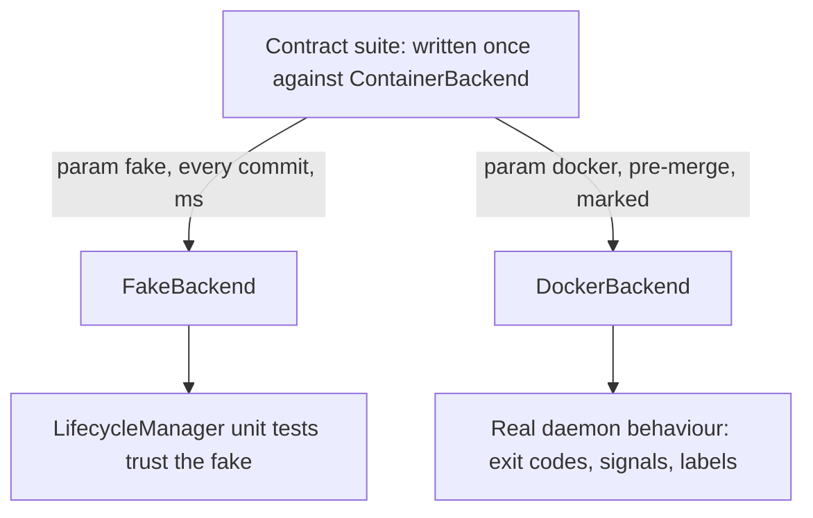

# M2 — Docker testing recommendation

Answer to: *"Do we really need to test Docker? Can we abstract things from Docker, or is
there a better way to handle tests as they should be easy to manage by themselves?"*

Scope: the `@pytest.mark.docker` block in
[`plan/09_IMPLEMENTATION_PLAN.md`](../plan/09_IMPLEMENTATION_PLAN.md:97) for M2.

---

## 1. Verdict

**Keep the suite, but shrink it to three tests, run them against a disposable daemon rather
than the machine's, and move them out of M2's blocking path.**

Reduce from "a real container starts, is probed, and stops; labels are queryable; stop
escalates SIGTERM → SIGKILL" to a single **contract-conformance suite** run against both
backends, plus one test for the thing no fake can model (SIGKILL escalation).

**Encapsulation is satisfied at the daemon level, not by mocking** (§4): the docker
parameterisation refuses to run against an ambient host daemon and requires an explicit,
throwaway `DOCKER_HOST`. Tests therefore cannot touch the machine's Docker state — not
because they are careful, but because they are not talking to it.

The reasoning, in the plan's own terms:

- [`plan/10_TESTING_STRATEGY.md`](../plan/10_TESTING_STRATEGY.md:27) already sets the rule:
  *"nothing essential may be verifiable only at L3/L4."* Dropping L3 entirely is not what
  that rule asks for — it asks that the *logic* live above the seam. The `DockerBackend` is
  the one place where there is no logic above the seam to move it to.
- The same document forbids the opposite error at
  [line 289](../plan/10_TESTING_STRATEGY.md:289): *"Mocking BentoML to unit-test the adapter
  … tests the mock's idea of the framework, which is exactly the thing we do not control."*
  Mocking the Docker SDK to unit-test `DockerBackend` is the identical anti-pattern one
  level up. So the choice is genuinely binary: **a few tests against a real daemon, or no
  verification of `DockerBackend` at all.** A mock cannot tell us whether our label selector
  selects, because the mock's selector is ours; that is the whole problem.
- "Abstract things from Docker" is already done — `ContainerBackend`
  ([`plan/01_ARCHITECTURE.md`](../plan/01_ARCHITECTURE.md:305)) is the abstraction, and
  `FakeBackend` is why 95% of M2 needs no daemon. What remains untested is not the
  lifecycle manager; it is **whether `DockerBackend` actually satisfies the protocol the
  fake pretends to satisfy.** A fake that has drifted from the real implementation is worse
  than no fake, because every green unit test then asserts a fiction.

### The failure this buys insurance against

`FakeBackend.stop()` returns and the container is gone. `DockerBackend.stop()` sends
SIGTERM and returns *before* the container has exited. If those differ, every drain test in
M2 passes and production leaks containers. That divergence is invisible to the fakes **by
construction** — it is exactly what the fakes abstract away.

---

## 2. Restructure: one contract suite, two backends

The single highest-value change, and the answer to "self-contained and easy to manage": stop
writing "docker tests" and write a **backend contract suite**, parameterised over the
backends — the same pattern already chosen for the runtime at
[`plan/10_TESTING_STRATEGY.md`](../plan/10_TESTING_STRATEGY.md:164).

```
tests/contract/backend/test_container_backend_contract.py
```

```python
@pytest.fixture(params=["fake", "docker"])
def backend(request):
    if request.param == "docker":
        pytest.importorskip("docker")
        request.applymarker(pytest.mark.docker)
        ...
```

Every assertion is written once, in terms of `ContainerBackend`, and never mentions Docker.
It runs in milliseconds against `FakeBackend` on every commit and against `DockerBackend`
pre-merge.

This inverts the cost/benefit of the original plan. The docker tests are no longer extra
tests to maintain; they are **the fake-fidelity gate** — the mechanism that keeps
`FakeBackend` honest. Without it, the fake is a second, unverified implementation of the
container backend, and the entire fast suite rests on it.



---

## 3. The minimum docker set

Three tests. Everything else in M2 goes to the fakes.

| # | Test | Why it cannot be a fake test |
|---|---|---|
| 1 | **Round trip**: `start` → `is_running` is true → `list_managed` returns it with our labels → `stop` → `is_running` is false | The one test that proves the SDK call shapes are right: image ref, name, env, network, labels, and that our label selector actually selects. A wrong label key is a silent reconciliation failure in production and is unreachable from a fake. |
| 2 | **Stop escalates SIGTERM → SIGKILL** with a fixture that ignores SIGTERM; assert it is gone after `timeout_s` and the exit code shows the kill | Signal handling and the daemon's stop timeout are not modellable in-memory. This is also the guard against `stop()` returning before the container has exited — the divergence in §1. |
| 3 | **A vanished container is reported not-running, not an exception**: `docker rm -f` behind the backend's back, then `is_running` | The SDK raises `NotFound`; whether that becomes `False` or propagates is our contract, and getting it wrong turns M2's "vanished container becomes `FAILED`" path into an unhandled traceback in the watchdog. The fake can only assert the behaviour we *intended*. |

Deliberately **not** in the docker set:

- **Coalescing, drain, state transitions, reconciliation adoption, backoff** — all fakes.
  These are `LifecycleManager` behaviours; a real daemon adds runtime and flakiness and
  verifies nothing extra.
- **`logs()`** — defer to M7, where the log collector and the "logs survive a stop"
  requirement actually live ([`plan/09_IMPLEMENTATION_PLAN.md`](../plan/09_IMPLEMENTATION_PLAN.md:261)).
  Note that [`plan/10_TESTING_STRATEGY.md`](../plan/10_TESTING_STRATEGY.md:236) currently
  lists "logs remain readable after the container is stopped" among L3 scenarios; it belongs
  to M7's milestone, not M2's.
- **`build()`** — defer to M5, which owns the build pipeline and its snapshot tests.
- **Device requests / `shm_size` / GPU** — `@pytest.mark.gpu`, nightly. M2 asserts only that
  the spec is *translated* into the right SDK kwargs, which is a pure mapping function
  (see §5).

Fixture: a stock tiny image (`alpine` with `sleep 3600`), pulled once by a session fixture.
**No image build in M2's docker tests** — building is M5's concern, and coupling M2's suite
to a build is what makes an L3 suite slow enough to be skipped.

---

## 4. Encapsulation: never the machine's daemon

**Decision: the tests never touch the host's Docker state.** The isolation is enforced by
*which daemon they can reach*, which is stronger than any convention about cleanup — a test
cannot leak a container onto your machine if it was never speaking to your machine's daemon.

**The rule, enforced in `conftest.py`:** the `docker` parameterisation runs **only** when
`TSWAP_TEST_DOCKER_HOST` is set, and it connects to *that* endpoint exclusively. If the
variable is absent, the tests **skip** — even when `/var/run/docker.sock` is sitting right
there and reachable. The ambient daemon is never a valid target. This makes the dangerous
case impossible to reach by accident, rather than merely discouraged:

```python
# tests/conftest.py
def docker_endpoint() -> str | None:
    """The disposable daemon to test against; never the ambient host daemon."""
    return os.environ.get("TSWAP_TEST_DOCKER_HOST")
```

Note the deliberate consequence: a contributor who has Docker installed still gets a skip
until they opt in. That is the point.

**How the disposable daemon is provided** — a Docker-in-Docker sidecar, i.e. `docker:dind`
listening on its own socket, started for the test session and destroyed after. Its entire
state is a container; when it dies, everything the tests created dies with it, so cleanup is
guaranteed by teardown of a single process instead of by the correctness of N `finally`
blocks. In CI it is a service container; locally it is one `docker run` documented in the
contributing guide. **Nothing is written to the host daemon's state** beyond the DinD
container itself.

The remaining plumbing, all M0/M2 rather than test-writing:

1. **One availability check, session-scoped and cached.** It reads
   `TSWAP_TEST_DOCKER_HOST` and pings *that* endpoint. Never a bare `importorskip`: the SDK
   importing successfully says nothing about a reachable daemon.
2. **Loud skips.** [`plan/10_TESTING_STRATEGY.md`](../plan/10_TESTING_STRATEGY.md:296)
   already names silent skipping as an anti-pattern. Implement a `pytest_terminal_summary`
   hook in M0 printing `"docker tests skipped (N): TSWAP_TEST_DOCKER_HOST is not set"`, so
   the reason and the remedy are visible in every local run.
3. **A unique namespace per run anyway.** `tswap-test-{uuid4().hex[:8]}` in every name plus a
   `tswap.test-run=<id>` label, with a per-test `finally` and a label-scoped session sweep.
   Redundant given a disposable daemon — and kept precisely because it is the defence that
   still works if someone ever points `TSWAP_TEST_DOCKER_HOST` at something real.
4. **The dev container keeps its hardening.** No socket mount, no capability grant, no host
   root. It needs only the `docker` Python SDK plus a reachable `TSWAP_TEST_DOCKER_HOST`,
   which is a TCP endpoint, not a privilege.
5. **CI split, as already specified** at
   [`plan/10_TESTING_STRATEGY.md`](../plan/10_TESTING_STRATEGY.md:306): PRs run
   `-m "not docker and not gpu and not slow"`; a separate `integration.yml` job brings up the
   DinD service, exports `TSWAP_TEST_DOCKER_HOST`, and runs `-m docker`. Three tests against
   `alpine` — well under a minute.

**On mocking instead:** it does not meet the goal it appears to. A mocked daemon cannot tell
us whether our labels are queryable or whether `stop()` returns before the container has
exited, which are the only two facts these three tests exist to establish (§1). It would
give us green tests and no information. A disposable daemon gives the isolation you asked
for *and* the information, so it is strictly better than mocking here.

---

## 5. How to test `DockerBackend` itself

Not by mocking the SDK. Split it and test the two halves differently — this is the answer to
question 4, and it is what keeps the docker set at three:

- **Extract the pure translation.** `ContainerSpec` → SDK kwargs (`name`, `image`,
  `environment`, `labels`, `network`, `volumes`, `device_requests`, `shm_size`) becomes a
  free function, e.g. `docker_backend.build_run_kwargs(spec)`, with **no daemon and no
  client**. Unit-test it exhaustively and snapshot it: GPU device requests, `shm_size`
  parsing, mount concatenation, the full label set, name derivation. This is where most of
  `DockerBackend`'s real complexity and most of its plausible bugs live, and it costs nothing
  to test. Under [`plan/08_REPO_LAYOUT.md`](../plan/08_REPO_LAYOUT.md:43), keep it inside
  `docker_backend.py` so the "only file that talks to Docker" rule is preserved.
- **Extract the pure error mapping.** SDK exception → our error taxonomy
  (`NotFound` → not-running; `ImageNotFound` → a `FAILED` reason naming the image and the
  `tswap build` remedy; `APIError` on a missing GPU → the actionable toolkit message). A
  table-driven test over synthesised exception instances covers this without a daemon, and
  it is what makes [`plan/01_ARCHITECTURE.md`](../plan/01_ARCHITECTURE.md:289)'s required
  "error string surfaced in `/status`" real rather than aspirational.
- **What is left** is a thin shell of `client.containers.run(**kwargs)` calls, verified
  once by the three contract tests. Do not chase coverage on it —
  [`plan/10_TESTING_STRATEGY.md`](../plan/10_TESTING_STRATEGY.md:279) already grants exactly
  this exemption to `bentoml_backend.py`; extend it in writing to `docker_backend.py` so
  nobody later "fixes" the coverage number by adding mocks.

**On testcontainers:** not worth adopting. It solves lifecycle management for *dependency*
containers (a Postgres for your app's tests). Here, container lifecycle **is** the system
under test, so the library would sit between us and the exact behaviour we are verifying —
and it still needs the same daemon, so it removes no requirement. A ~30-line session fixture
does the job with no dependency and no indirection.

**On relying solely on M3's integration test:** tempting but wrong, for two reasons. It is
an end-to-end test, so a `DockerBackend` bug surfaces as "the echo request failed" and gets
debugged through the proxy and the lifecycle manager first — the diagnostic cost lands every
time. And it exercises only the happy path: it never provokes SIGKILL escalation or a
vanished container, which are two of the three things worth testing. Keep the M3 test as the
spine proof it is meant to be; it is not a substitute for the backend contract.

---

## 6. Revised M2 test section and acceptance criteria

Copy-paste into the M2 issue.

**Tests (fakes, fast — the bulk of the milestone):** unchanged from the plan — ten
concurrent `ensure_ready` calls ⇒ exactly one start; failure paths give `FAILED` with the
reason; drain waits for in-flight then stops; a vanished container becomes `FAILED`;
reconciliation adopts a ready container and stops an orphan; state transitions are logged.
Plus: `build_run_kwargs` snapshot tests (labels, env, network, mounts, device requests,
`shm_size`) and the SDK-exception → error-taxonomy mapping table.

**Tests (contract suite, parameterised `[fake, docker]`):** `start`/`is_running`/
`list_managed`-by-label/`stop` round trip; `stop` escalates SIGTERM → SIGKILL for a process
that ignores SIGTERM; a container removed behind the backend's back reports not-running
rather than raising. The `docker` parameterisation is marked `@pytest.mark.docker`, runs
**only** against the disposable daemon named by `TSWAP_TEST_DOCKER_HOST`, and skips with a
printed reason when that variable is unset.

**Done when:**

1. The state machine is exercised on every edge with fakes.
2. The `ContainerBackend` contract suite passes against **both** `FakeBackend` and
   `DockerBackend` — the suite is written once, in protocol terms, with no Docker
   vocabulary in the assertions.
3. `build_run_kwargs` and the error mapping are unit-tested with no daemon.
4. **The suite cannot touch the host's Docker state**: with `TSWAP_TEST_DOCKER_HOST` unset
   the docker tests skip with a visible, explained summary line **even on a machine with a
   running daemon**, and there is a test asserting that the backend under test is never
   constructed from the default environment. Add it as a named regression test — this is the
   guardrail, and a guardrail nobody tests is a guardrail that quietly stops working.
5. Against the disposable daemon, a run leaves **no** container, network or volume behind on
   success, on failure, or on interrupt; and tearing the DinD sidecar down removes every
   trace regardless.
6. `integration.yml` brings up the DinD service, exports `TSWAP_TEST_DOCKER_HOST`, and runs
   `-m docker`; the contributing guide documents the one-command local equivalent.
7. Q2 ([`plan/13_OPEN_QUESTIONS.md`](../plan/13_OPEN_QUESTIONS.md:273), SDK vs CLI) is
   recorded as resolved, since M2 is where it was due.

**Net effect on scope:** the docker requirement narrows from an open-ended "real container
round-trip" to three named tests against `alpine` on a throwaway daemon — no image build, no
GPU, no effect on anyone's machine — while the verification gets *stronger*, because the
fakes are now proven to match the implementation they stand in for instead of being assumed
to.

---

## 7. Consequential plan edits (small, worth doing while M2 is being tasked)

- [`plan/09_IMPLEMENTATION_PLAN.md`](../plan/09_IMPLEMENTATION_PLAN.md:97): replace the M2
  docker line with §6 above.
- [`plan/10_TESTING_STRATEGY.md`](../plan/10_TESTING_STRATEGY.md:236): move "logs remain
  readable after the container is stopped" from the general L3 list into M7's scope, and add
  the backend contract suite beside the runtime one in §4.2 as a named pattern.
- [`plan/10_TESTING_STRATEGY.md`](../plan/10_TESTING_STRATEGY.md:279): extend the coverage
  exemption to `backend/docker_backend.py`, with the reason.
- [`plan/10_TESTING_STRATEGY.md`](../plan/10_TESTING_STRATEGY.md:238) §5: state the
  disposable-daemon rule for **all** L3, not just M2 — the L3 requirements currently say
  "unique namespace" and "force-remove leftovers", which assume the ambient daemon. M5.5's
  preflight corpus and M6's two-container eviction test inherit the same rule, and M6's
  `nvidia-smi` tests are the one sanctioned exception, since a GPU cannot be virtualised
  away.
- [`plan/10_TESTING_STRATEGY.md`](../plan/10_TESTING_STRATEGY.md:285) §8: add a row to the
  anti-pattern table — *"L3 tests against the developer's own daemon"* → *"a disposable
  daemon via `TSWAP_TEST_DOCKER_HOST`; skip rather than fall back."*
- [`plan/09_IMPLEMENTATION_PLAN.md`](../plan/09_IMPLEMENTATION_PLAN.md:58) (M0): add the
  `TSWAP_TEST_DOCKER_HOST` availability fixture and the skipped-marker summary hook, so the
  mechanism exists before the first test needs it.
- [`.devcontainer/devcontainer.json`](../.devcontainer/devcontainer.json): unchanged —
  explicitly record that no socket is mounted and the hardening stays, so a future
  contributor does not "fix" the skips by mounting it.
