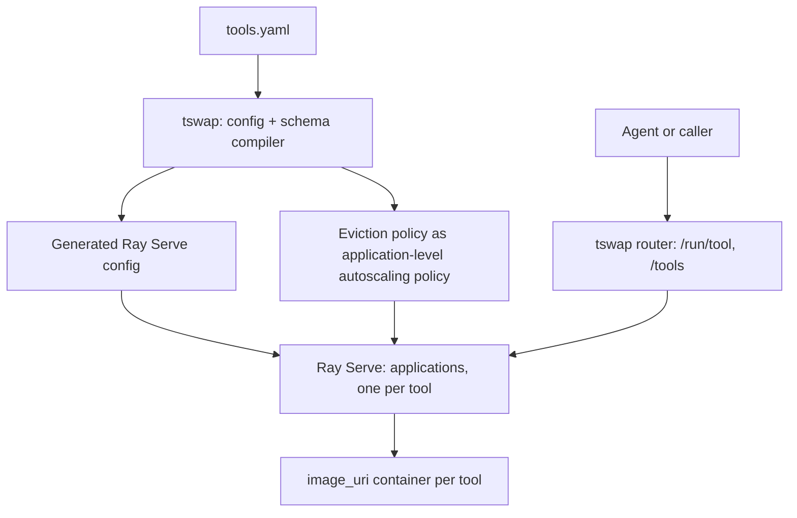

# Reconsideration — "wrap the llama-swap philosophy over Ray", and is the lockstep really fatal?

> **Two challenges from the requester, both fair:**
>
> 1. *"I do agree with the engineer that our proposed solution seems too heavy and likely hard to maintain all the code and deployment over a very well known and used library. Can we wrap the llama-swap philosophy over Ray?"*
> 2. *"Is it really the end of the world to impose a python version and ray version per container? The python version is not something that we need to change every now and then and should not affect the tools that much."*
>
> **Headline:** challenge 2 is **substantially correct and I concede it** — §4.2 of [`15_RAY_SERVE_EVALUATION.md`](../plan/15_RAY_SERVE_EVALUATION.md) is overstated and must be downgraded. But conceding it surfaces a **different blocker that no version of the Ray analysis has ever named**, and it is harder than the lockstep: **`image_uri` cannot express volume mounts.**
>
> This is the fourth pass at the Ray question. The previous three each lost ground by arguing from memory ([`15_RAY_SERVE_EVALUATION.md`](../plan/15_RAY_SERVE_EVALUATION.md) version history). Everything below is quoted from [`plan/third-party-docs/`](../plan/third-party-docs/README.md), captured at Ray 2.57.0 on 2026-08-13.

---

## 1. Conceding the lockstep challenge

The requester's reasoning is: Python versions don't churn, so pinning one across the zoo is a one-time cost, not a recurring tax. **That is right, and our document overstated the case.** Specifically:

| What §4.2 claims | What survives scrutiny |
|---|---|
| *"A Ray upgrade is a coordinated migration of the entire zoo"* | **True but rare.** We would pin the cluster's Ray version and simply not upgrade it. Nothing forces an upgrade on a single-tenant research deployment. A CVE or a needed feature might — but that is a *known, occasional, plannable* migration, not a treadmill. |
| *"A tool needing an older Python is impossible"* | **True, and probably irrelevant.** Every model in the R8 evidence base targets py3.10–3.12. The conflicts we actually observed are `torch`/`tensorflow`/`transformers`/`numpy`/`flash_attn` — **all of which separate images resolve regardless of a shared interpreter version.** |
| *"the difference between a maintainable system and one that quietly stops being upgraded"* | **Rhetorical overreach.** It is a real coupling, but it does not dominate the decision, and presenting it as decisive was the document reaching for a conclusion it had already drawn. |

**Judgement:** the lockstep is a **cost, not a gate.** It should move out of the "grounds for refusal" section and into the cost table, worded as: *"one interpreter version chosen once for the whole zoo, and a Ray upgrade is a planned zoo-wide rebuild."* Annoying; survivable; **not a reason to write a router.**

**This matters beyond Ray**, because §4.2 was named *"the strongest single ground"* and ADR-0003's revisit trigger requires *both* the lockstep relaxing *and* `image_uri` leaving experimental. **If the lockstep is only a cost, that trigger is mis-specified** and ADR-0003 rests on a narrower base than it claims.

### 1.1 What does *not* survive the concession

Three of the four maintenance objections are untouched by this argument, and they are version-independent:

1. **`image_uri` is experimental in two independent places** — the Serve guide (*"This feature is experimental and the API is subject to change"*) and the Core `runtime_env` API reference (*"`image_uri` is experimental"*). The previous `container` field is **already deprecated in favour of it**, so this API has churned once already. **D2** is the most load-bearing decision in the plan.
2. **Podman on a shared DGX we do not administer**, on *"all head and worker nodes"*, plus `--privileged` if the raylet is itself containerised. That is somebody else's change-management process, not a `pip install`.
3. ***"If you aren't using KubeRay, when the Ray cluster fails, Ray Serve cannot recover."*** Ray's own words, and we are deliberately not on Kubernetes. Guardrail 8 requires that restarting be cheap and safe.

And one documented failure mode lands squarely on our workload: *"Very slow or hanging container startup — this is typically caused by using the default podman storage driver (`vfs`) with large container images."* **Our images are multi-gigabyte CUDA images.** Fixable by configuring `overlay` + `fuse-overlayfs`, but it is one more thing to get right on a machine we share.

---

## 2. The blocker that the concession surfaces: `image_uri` has no volume mounts

> *"Currently, use of the `image_uri` field is only supported with `config` and `env_vars`. If you have a use case for pairing `image_uri` with another runtime environment feature, submit a feature request on Github."*

**`runtime_env` has no mount concept at all.** Ray mounts `/tmp/ray` for its own IPC; there is no user-facing way to bind a host directory into an `image_uri` container.

**This is fatal to the current tool contract, and it is a bigger problem than the lockstep:**

| What we need mounted | Why | Source |
|---|---|---|
| **Hugging Face / weights cache** | *"Weights come from wherever the model's own code fetches them (HF cache mount, MinIO, local path). **We mount caches**; we do not manage them."* Without it, every cold start re-downloads gigabytes — and cold start is already the dominant cost under [ADR-0004](../plan/adr/0004-hard-stop-only-in-v1.md). | [`00 §5`](../plan/00_CONTEXT_AND_MOTIVATION.md) |
| **A shared data path** | **D18**: payloads travel *by reference* because a CT scan is 500 MB. A reference to `/data/x.dcm` is meaningless in a container that cannot see `/data`. | **D18** |
| **`mounts:` as a config key** | It is a first-class field of `tools.yaml`, and it maps to KServe's `volumeMounts` in the documented growth path. | [`14 §8.2`](../plan/14_ALTERNATIVES_EVALUATION.md) |

Compare llama-swap, where the mount is just part of the command you already control:

```yaml
cmd: docker run --gpus '"device=2,3"' -v /models:/models -p ${PORT}:8000 ...
cmdStop: docker stop vllm-coder
```

**Workarounds and why each is bad:** bake weights into the image (multiplies image size by the weights, defeats sharing a cache across tools, and rebuilds on every weight change); fetch over the network on every cold start (pays gigabytes per swap, on the path we are trying to make cheap); a sidecar object store (a new service to operate, to answer a question a `-v` flag already answers).

**Status: this is a genuine finding, not a restatement.** It appears in no version of [`15_RAY_SERVE_EVALUATION.md`](../plan/15_RAY_SERVE_EVALUATION.md), in no version of ADR-0003, and in neither the engineer's analysis nor my earlier critique. It should be **verified before it is relied on** (§6, check 2) — the docs say "only supported with `config` and `env_vars`", which I am reading as prohibiting mounts, but that phrasing is about *other `runtime_env` fields*, and mounts may be reachable some other way.

---

## 3. So: can we wrap the llama-swap philosophy over Ray?

Taking the question completely seriously, because it is the right question and it is the one our documents keep dodging.

### 3.1 What the design would be

Ray Serve becomes the lifecycle engine. Our layer becomes thin.



| Piece | Owner |
|---|---|
| Container start/stop, health, replica states | **Ray** |
| Idle reclamation | **Ray** — `downscale_to_zero_delay_s` is our `ttl` under another name, and the docs' example value is in the same range as our defaults |
| HTTP ingress and routing | **Ray**, with a thin FastAPI shim for our `/run/{tool}` contract |
| Bounded residency + eviction | **Ours**, expressed as a Ray application-level autoscaling policy |
| Authoring ladder, schema compiler, `?format=tools`, preflight, CLI | **Ours**, unchanged — none of it knows a router exists |
| Micro-batching | **Ray's `@serve.batch`**, replacing BentoML |

**What gets deleted:** the container backend, the TTL watchdog, most of the lifecycle manager, the proxy. Genuinely less code — this is conceded in [`15 §7`](../plan/15_RAY_SERVE_EVALUATION.md).

### 3.2 Why it is structurally awkward rather than impossible

The awkwardness is specific and worth stating precisely, because "it doesn't fit" is the kind of vague claim that lost the previous three rounds.

- **Displacement and isolation sit on opposite sides of a boundary.** `@serve.multiplexed` — the off-the-shelf bounded-LRU model residency that is *exactly* our central primitive — operates on models *inside one replica process*. `image_uri` isolation operates *around* the replica. **You can have Ray's eviction or Ray's isolation, not both on the same axis.** Path 2 (one multiplexed deployment) is the R8 monolith rebuilt on purpose: one interpreter, torch and TensorFlow in the same process, no OS backstop when a Keras handler fails to release VRAM.
- **So displacing a containerised tool means driving replica counts**, i.e. deleting or reconfiguring an application. Ray's docs frame these as *deployment*-cadence mechanisms and warn that graph updates are *"NOT recommended in production"*. We would be driving them at **request** cadence. That is a real risk — but note it is a *risk*, not an impossibility, and no experiment has ever been run.
- **`num_replicas: 0` is a hard stop, not a warm state** — *"there will be a cold start time"*. Under [ADR-0004](../plan/adr/0004-hard-stop-only-in-v1.md) that is fine, because hard stop is exactly what v1 does. **It just means Ray offers nothing here our design doesn't already have.**
- **One-tool-per-*application* may be forced**, which puts each tool's autoscaling in a separate scope and makes a single policy over the whole zoo awkward. This is unresolved in Ray's own docs (§6, check 1).
- **`CUDA_VISIBLE_DEVICES` is not in the documented list** of environment variables propagated into an `image_uri` container — and that is how Ray normally tells an actor which GPU it has. Bears directly on **D7** (whole-device pinning). Unverified.

### 3.3 The honest scorecard for a Ray-native tool-swap

| | Ray-native | tool-swap as planned |
|---|---|---|
| Code we own | Authoring + schema + preflight + CLI + **eviction policy** | Same, **plus** container backend, watchdog, proxy |
| Prerequisites on the shared DGX | **Podman on all nodes**, a Ray cluster, `--privileged` if raylet is containerised | Docker (already there) |
| Volume mounts for weights and data | **✗ not expressible** (§2) | ✓ |
| Isolation (**D2**) | ✓ via an **experimental**, once-deprecated API | ✓ via Docker |
| Preemption of a containerised tool (**D25**) | ⚠ replica-count driving at a discouraged cadence | ✓ by design |
| Interpreter freedom per tool | ✗ one version zoo-wide — **conceded as acceptable** (§1) | ✓ |
| Recovery | ✗ *"cannot recover"* without KubeRay | ✓ stateless restart, re-adopts containers |
| Batching | `@serve.batch` — **fixed-window**, not adaptive | BentoML — **adaptive**, vendor-documented |
| Status surface | ✓✓ `serve status` + dashboard, better than ours | ⚠ we build it |
| Bus factor | ✓✓ | ✗ |

**The pattern:** adopting Ray trades *code we own* for *infrastructure we operate*, and the trade is only worth it if the infrastructure is boring. Three experimental-or-alpha APIs, a Podman prerequisite on a machine we don't administer, a documented unrecoverable failure mode, and no volume mounts is **not boring yet**.

---

## 4. But the "too heavy" instinct is right — it is just aimed at the wrong target

This is the part I most want to put in front of you, because I think the diagnosis is off by one level.

**Separate two claims:**

| Claim | Verdict |
|---|---|
| *"Too much **code**"* | **Largely false.** After [ADR-0004](../plan/adr/0004-hard-stop-only-in-v1.md) and [ADR-0005](../plan/adr/0005-one-uniform-batched-calling-convention.md), v1 is a config loader, a container backend, a **few hundred lines** of pure scheduler, a proxy and a watchdog — perhaps ~4,000 lines total, over Docker, FastAPI and BentoML, none of which we wrote. We write **no batcher**, **no inference server**, **no state machine for soft unload**. |
| *"Too much **plan**"* | **True, and already a recorded finding.** [`16 §2`](../plan/16_COMPLEXITY_AUDIT.md) item 5 says it outright: *"The plan's real risk is not over-engineering, it is over-documentation. Seventeen planning documents, five ADRs and ~29 decisions for a service whose v1 is perhaps 4,000 lines."* |

**Eighteen documents describing four thousand lines is what "too heavy" is actually detecting.** Adopting Ray would not fix that — and on current evidence it would *add* an operational surface while leaving the authoring ladder, the schema compiler, preflight, the CLI **and the eviction policy** still to write. [`15 §7`](../plan/15_RAY_SERVE_EVALUATION.md): *"The platform does not remove the interesting work; it relocates it."*

**The cheapest available win is not a framework swap. It is deleting a dozen planning documents and starting M0.**

---

## 5. The question that would actually shrink this, and nobody has asked it

Every candidate in every survey fails on **preemption**. It is also the requirement that:

- forced the rejection of KServe (Kubernetes allocates; the second pod stays `Pending`),
- forced the rejection of Ray for containerised tools (displacement is inside the replica),
- and is the reason we own a scheduler at all.

It rests on one quoted sentence (**D25**): *"We don't want to wait for TTL as it could take quite some time, if another process is not being used right now we want to stop it and warm up any process that has a request."*

**But [ADR-0004](../plan/adr/0004-hard-stop-only-in-v1.md) already softened the neighbouring requirement on exactly this kind of re-examination** — soft unload was inferred from *"shared DGX"*, was never checked, and when checked turned out to be *"not so critical"*. That descope removed a state, an endpoint, a scheduler variant, a preflight stage and four decisions. **It is the largest win in this plan's history, and it came from re-asking a question rather than from choosing a framework.**

So the question worth asking, in the same spirit:

> **If a request for tool B arrived while idle tool A held the GPU, and B simply waited for A's TTL to expire — how bad is that, concretely, in seconds, for your actual traffic?**

Because if *"wait"* is tolerable — even with `ttl` tuned down to 60s for contended tools, which is a config value and not code — then **the gate that eliminates every off-the-shelf framework disappears**, and:

- **KServe + Knative** becomes viable (its ✅ scale-to-zero is genuine),
- **Ray Serve path 1** becomes viable (`downscale_to_zero_delay_s` *is* our `ttl`),
- **our scheduler shrinks to a TTL timer**,
- and the reuse argument the engineer is making **wins outright**.

**That single answer is worth more than any framework spike.** It is one sentence from you, and it either dissolves the hardest requirement in the plan or confirms it on the record — which is exactly the ADR-0004 pattern.

---

## 6. Two cheap checks, if you want evidence rather than argument

Both need a laptop, no GPU, no DGX. **Neither is a full spike** — Spike D was retired for good reasons and I am not proposing to revive it.

1. **Per-*deployment* `image_uri`.** Ray's docs contradict themselves: `runtime_env` is a documented `ray_actor_options` key and is settable per-actor, but the Serve guide presents `image_uri` as per-*application*. Test: two deployments, two images, print the running image inside each replica. **A yes makes a Ray-native design architecturally neat** — one application, many separately-imaged tools, one autoscaling policy over all of them, which is very close to what tool-swap does.
2. **Mounts under `image_uri` (§2).** The one that could kill the Ray option outright, and the one I would run first. Test: an `image_uri` deployment that must read a host directory. If there is no supported path to a bind mount, Ray is out on a **capability** ground for the first time in four revisions — and unlike the previous capability claims, this one is about a feature our tools demonstrably need.

**Stated in advance so results are not over-read:** check 1 passing does not flip the decision on its own; check 2 failing very nearly closes it.

---

## 7. Recommendation

1. **Concede the lockstep** (§1). Downgrade [`15 §4.2`](../plan/15_RAY_SERVE_EVALUATION.md) from a ground for refusal to a cost, and **fix ADR-0003's revisit trigger**, which currently leans on it. The requester is right and the document should say so — that is the fourth concession to this challenge, and the pattern is itself information.
2. **Run check 2 (mounts) before anything else.** It is hours of work and it is now the load-bearing question. If mounts are impossible, Ray is refused on a capability our tools need, and the argument stops depending on maintainability judgement calls.
3. **Answer the preemption question (§5).** This is the highest-leverage item in this document by a wide margin. If *"wait"* is acceptable, reopen the whole survey — and the engineer's recommendation likely wins.
4. **Do not adopt Ray on current evidence**, but rest the refusal on the honest grounds: **no volume mounts**, an **experimental once-deprecated API** under our most load-bearing decision, **Podman on a machine we do not administer**, and ***"cannot recover"*** without Kubernetes. **Not** on the lockstep.
5. **Treat the "too heavy" instinct as a documentation finding** (§4) and act on it: cut the planning corpus hard, then start M0. That is [`16 §2`](../plan/16_COMPLEXITY_AUDIT.md) item 5 already agreeing with you.

**What I am not doing:** defending the plan because it is the plan. If check 2 passes and *"wait"* turns out acceptable, the right outcome is that most of this repository is deleted — and [`HANDOFF.md`](../plan/HANDOFF.md) §2 already says that outcome would be welcome.
