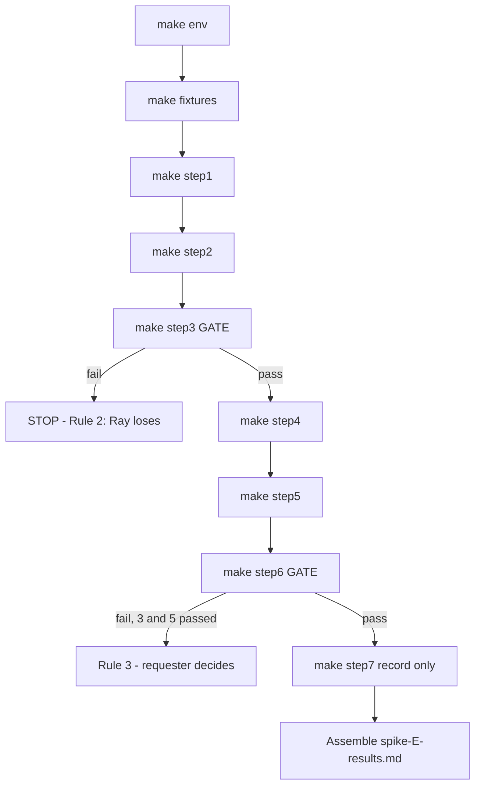

# Spike E — continuation plan (podman on host unblocks steps 1–7)

> **Branch:** `feature/spike-e-continuation` — new capability (the spike has never
> produced a measurement), not a correction to shipped behaviour. PR at the end,
> no GitHub issue.
>
> **Mode:** this is a spike. There is **no red/green TDD ledger** and no pytest
> suite for the harness — the step output *is* the check, and the user reads the
> logs. Each numbered item below is either a harness fix verified by the step that
> exercises it, or a host measurement with a verdict recorded against the frozen
> criteria of [`spike-E-ray-native-protocol.md`](spike-E-ray-native-protocol.md) §3.
>
> **Rule 0.1 is respected throughout: §5's decision rule is FROZEN and is restated
> here, never reinterpreted.**

---

## 1. Context

### Where the spike actually stands

**The scoreboard is blank.** Steps 1 and 2 were attempted on 2026-08-14 and both
died inside the harness before reaching any pass/fail criterion in §3. Per
[`spike-E-step1-2-failure-diagnosis.md`](spike-E-step1-2-failure-diagnosis.md),
the verdict is *"neither step tested Ray"*. Nothing from those runs may be
recorded as a step outcome, in either direction. No gate has been attempted.

What the 2026-08-14 runs proved, precisely:

| Observed | What it was actually evidence of |
|---|---|
| `Error: Invalid application argument 'step1_app'` | Our CLI invocation was malformed |
| `ConnectionError: Failed to connect to Ray at http://localhost:8265` | No cluster was running |
| `Found duplicate applications for route prefix "/"` | A one-line omission in our YAML |

None of these is a fact about Ray.

### What podman-on-host unblocks

The devcontainer sets `--cap-drop=ALL` and `no-new-privileges:true`, so rootless
podman cannot create a user namespace (`cannot clone: Operation not permitted`).
Ray implements `image_uri` **by shelling out to `podman run`**
([`image_uri.py:24`](/usr/local/lib/python3.11/site-packages/ray/_private/runtime_env/image_uri.py:24)),
so in this devcontainer no replica can ever start inside an image. That made the
*actual* pass condition of step 1 — *"each deployment reports its own image's
contents"* — unanswerable here, and the diagnosis §3 concluded steps 1–2 would
have to be split.

**The host removes that split.** It is a DGX-class box with `nvidia-smi`, Ray 2.57
and working podman, and it shares this repository over a volume. So:

- Steps 1–7 all run in one place, in protocol order, against real images.
- The diagnosis §3 re-scoping (item 7) is **no longer needed** — dropped from this plan.
- Harness edits committed here are directly runnable on the host.
- Host output comes back to this workspace for verification.

### Repository state

Clean tree, on `main`. Already fixed since the diagnosis, and **not re-planned here**:
per-step cluster lifecycle ([`run_with_cluster_clean.sh`](../spike-e-ray-native/scripts/lib/run_with_cluster_clean.sh)),
the control-plane client's ports and scale route ([`serve_api.py`](../spike-e-ray-native/scripts/lib/serve_api.py)),
`${VAR}` rendering, `image_uri` under `ray_actor_options.runtime_env` in
[`step1_config.yaml`](../spike-e-ray-native/apps/step1_config.yaml),
distinct `route_prefix` per app in [`step2_config.yaml`](../spike-e-ray-native/apps/step2_config.yaml),
and the [`step2_builder.py`](../spike-e-ray-native/apps/step2_builder.py) double-wrap.

---

## 2. Scope decisions taken with the user

1. **No red/green cycles.** It is a spike; we are trying things. The harness fixes
   are verified by the step running and producing sane output.
2. **The D5 config-key guard is dropped.** The user reads the logs. This is recorded
   as an accepted risk in §6 below, because it is the one diagnosis item being
   deliberately declined.
3. **Three defects found beyond the original list are included** — D7, D8, D9. Two
   of them block gate steps outright, so without them steps 3, 5 and 6 cannot run,
   and those three steps *are* the decision rule.
4. **No new third-party packages.** `requests`, `yaml` and `ray` are already
   available and sufficient. Nothing is proposed.

---

## 3. Numbered behaviours

Each item states inputs, outputs, edge cases and error behaviour. Items 1–9 are
harness work in this workspace. Items 10–17 are host measurements.

### Part A — record the null result

**1. The 2026-08-14 harness failure is on the record as an explicit null result.**

- **File:** create `plans/spike-E-results.md`.
- **Input:** the verbatim logs in
  [`results/raw/step1-20260814T155717Z.log`](../spike-e-ray-native/results/raw/step1-20260814T155717Z.log)
  and `step2-*.log`, plus the env capture.
- **Output:** a "Steps 1–2, 2026-08-14: harness failure, no data" section quoting
  the three errors verbatim, and an explicit statement that **no step 1 or step 2
  verdict is claimed, pass or fail**.
- **Edge case:** `results/raw/` is gitignored, so the logs must be **quoted inline**
  in the results file, not linked — a link would rot on a fresh clone.
- **Why first:** Rule 0.3. The blank scoreboard must be explicit before new results
  land next to it, so nobody later reads the gap as a quiet failure.
- **Verified by:** review — this is documentation, not code.

### Part B — harness fixes (blocking the host run)

**2. `step1_two_deployments.py` builds an app graph containing BOTH deployments.**

- **Defect (D1):** [`step1_two_deployments.py:67`](../spike-e-ray-native/apps/step1_two_deployments.py:67)
  exports `application = TorchProbe.bind()` — only TorchProbe is in the graph, but
  [`step1_config.yaml`](../spike-e-ray-native/apps/step1_config.yaml) lists both
  TorchProbe and TfProbe.
- **Input:** the module, imported.
- **Output:** an ingress deployment holding handles to both probes, so the built
  application's deployment names include `TorchProbe` and `TfProbe`.
- **Error behaviour without the fix:** `override_deployment_info`
  ([`application_state.py:1781`](/usr/local/lib/python3.11/site-packages/ray/serve/_private/application_state.py:1781))
  raises `ValueError: Deployment 'TfProbe' does not exist`. The deploy request is
  accepted — *"Sent deploy request successfully"* — and the app then fails at build
  time, which is exactly what the 15:57 log shows.
- **Constraint:** the ingress must route `/torch` and `/tf`, because
  [`step1_verify.py:21-26`](../spike-e-ray-native/scripts/step1_verify.py:21) already
  introspects those two paths. Composition is done by passing handles into `bind()`.
- **Verified by:** step 1 running on the host and returning two *different* image
  markers.

**3. Part A of step 1 invokes the CLI with an import path.**

- **Defect (D2):** [`step1_verify.py:43`](../spike-e-ray-native/scripts/step1_verify.py:43)
  runs `serve deploy apps/step1_two_deployments.py step1_app`.
- **Two independent errors, both confirmed in the installed source:** trailing
  positionals are parsed as builder `key=val` pairs
  ([`scripts.py:277`](/usr/local/lib/python3.11/site-packages/ray/serve/scripts.py:277)),
  and a `.py` path `is_file()`, so Ray treats it as a YAML config and refuses
  arguments outright
  ([`scripts.py:229-235`](/usr/local/lib/python3.11/site-packages/ray/serve/scripts.py:229)).
- **Output:** `serve deploy step1_two_deployments:application --name step1_app`,
  using an import path plus `--name`
  ([`scripts.py:310-316`](/usr/local/lib/python3.11/site-packages/ray/serve/scripts.py:310)).
- **Edge case:** the import path resolves only if `apps/` is on `PYTHONPATH`;
  [`env.sh:42`](../spike-e-ray-native/env.sh:42) already puts it there.
- **Verified by:** step 1 Part A exiting 0.

**4. `subprocess` is imported at module scope in `step1_verify.py`.**

- **Defect (D4):** imported inside Part A's `try`
  ([`step1_verify.py:41`](../spike-e-ray-native/scripts/step1_verify.py:41)), then
  used by Part B at line 109. If Part A raises before the import, Part B dies with
  `NameError` — masking the real Part B result.
- **Output:** the import moved to the top of the file.

**5. `step2_verify.py` polls both apps on the single proxy port.**

- **Defect (D3):** [`step2_verify.py:26-27`](../spike-e-ray-native/scripts/step2_verify.py:26)
  expects `tool_tf` on `:8001`. One HTTP proxy serves the whole cluster; apps are
  separated by `route_prefix`, not port.
- **Output:** `http://localhost:8000/torch` and `http://localhost:8000/tf`, matching
  the prefixes already set in [`step2_config.yaml`](../spike-e-ray-native/apps/step2_config.yaml).
- **Error behaviour without the fix:** connection refused on 8001, recorded as a
  step-2 failure that is really our URL.

**6. `step3_gpu_swap.py` exports applications that are not double-wrapped.**

- **Defect (D7 — new, gate-blocking):**
  [`step3_gpu_swap.py:65-66`](../spike-e-ray-native/apps/step3_gpu_swap.py:65) does
  `serve.Application(ToolTorch.bind())`. `.bind()` already returns an `Application`,
  and [`Application.__init__`](/usr/local/lib/python3.11/site-packages/ray/serve/deployment.py:59)
  accepts only a `bound_deployment`.
- **This is the identical bug the diagnosis found at §2.4 in the step-2 builder and
  that was fixed there — it was never fixed here.**
- **Blast radius:** step 3 (**GATE**), step 6 (**GATE**) and step 5 mechanism B all
  import from this module
  ([`step6_config.yaml:10`](../spike-e-ray-native/apps/step6_config.yaml:10),
  [`step5_config_mechanism_b.yaml:8`](../spike-e-ray-native/apps/step5_config_mechanism_b.yaml:8)).
- **Output:** `application_torch = ToolTorch.bind()`, `application_tf = ToolTf.bind()`.

**7. `step5_config.yaml` points at an import path that exists.**

- **Defect (D8 — new, blocks a decision step):**
  [`step5_config.yaml:14,25`](../spike-e-ray-native/apps/step5_config.yaml:14) uses
  `import_path: step5_config:application_torch`, but `step5_config` is *that YAML
  file*; there is no `step5_config.py` in `apps/`. Mechanism A cannot deploy at all.
- **Output:** point both applications at `step3_gpu_swap:application_torch` /
  `:application_tf`, which is what mechanism B already does and which carries the
  correct `num_gpus: 1` and image URIs.
- **Note to preserve:** `external_scaler_enabled: true` is already set on both apps
  and is correct for mechanism A — it is required by the scale endpoint (HTTP 412
  otherwise, [`controller.py:1333`](/usr/local/lib/python3.11/site-packages/ray/serve/_private/controller.py:1333)).
  **It also forbids Serve's own autoscaling for those apps, which must be recorded
  as a step-5 finding**, not silently accepted.

**8. `step5_config_mechanism_b.yaml` puts replica keys where Ray reads them.**

- **Defect (D9 — new, silent-no-op class):**
  [`step5_config_mechanism_b.yaml:9-15`](../spike-e-ray-native/apps/step5_config_mechanism_b.yaml:9)
  sets `num_replicas` **inside `ray_actor_options`** and `autoscaling_config` **at
  application level**.
- **Confirmed:** [`ServeApplicationSchema`](/usr/local/lib/python3.11/site-packages/ray/serve/schema.py:712)
  defines neither `ray_actor_options` nor `autoscaling_config`, and unlike its
  siblings at [`schema.py:126`](/usr/local/lib/python3.11/site-packages/ray/serve/schema.py:126)
  and [`schema.py:1360`](/usr/local/lib/python3.11/site-packages/ray/serve/schema.py:1360)
  it sets **no `extra="forbid"`** — so pydantic's default `extra="ignore"` discards
  both keys without warning.
- **Why this matters:** mechanism B would flip replica counts Ray never reads, every
  alternation would appear to "work" while changing nothing, and step 5 would produce
  a **false result** — the same trap as diagnosis §2.1, live again on a decision step.
- **Output:** move both keys under the `deployments:` list, matching the shape of
  [`step3_config.yaml:17-27`](../spike-e-ray-native/apps/step3_config.yaml:17).
  Also give each application a distinct `route_prefix`, which mechanism B currently
  lacks — both would default to `/` and be rejected as duplicates.

**9. The gate scripts read `serve_status()` with its real shape, and import what they use.**

- **Defect (D10 — new, found while confirming D9):**
  [`step3_gate.py:76`](../spike-e-ray-native/scripts/step3_gate.py:76) and
  [`step6_restart.py:134`](../spike-e-ray-native/scripts/step6_restart.py:134) iterate
  `status.get("applications", [])` as a **list of dicts**. The endpoint returns a
  **dict** keyed by application name
  ([`ServeInstanceDetails.applications`](/usr/local/lib/python3.11/site-packages/ray/serve/schema.py:1764)),
  so iterating yields **strings** and `.get("status")` raises `AttributeError`.
  Steps 1 and 2 already handle it as a dict — the gate scripts were never updated.
- **Defect (D11 — new):** [`step6_restart.py`](../spike-e-ray-native/scripts/step6_restart.py:26)
  calls `podman_ps_count()` at lines 62, 84 and 126 but imports only `podman_ps_all`
  and `podman_ps_all_json`. The function exists in
  [`podman.py:37`](../spike-e-ray-native/scripts/lib/podman.py:37) — it is just not
  imported. **`NameError` at line 62, before the head node is even killed**, so
  step 6 would fail without testing recovery at all.
- **Defect (D13 — new, ledger addition, found during item 9 verification):**
  `step6_restart.py` phase B called `get_application("tool_torch")` → `GET
  /api/serve/applications/tool_torch`, but the dashboard defines **no**
  per-application GET route (`serve_head.py`: only `GET/PUT/DELETE
  /api/serve/applications/`, the scale POST, `/api/ray/version`) — a 404 before
  recovery was ever tested. It also read `apps.get("replicas")`, the wrong
  payload shape (replicas nest under `applications[name].deployments[dep].replicas`;
  `ReplicaDetails.pid` is the PID field, `schema.py:1285`). Fixed by reading
  `serve_status()` filtered to the deployment, with the recovery check at
  deployment-level status (the app-level enum is `RUNNING`, never `HEALTHY`,
  `schema.py:1171`). Phase A and the kill/observe control flow are unchanged.
- **Output:** dict-shaped status handling in both gate scripts; the missing import
  added; phase B's data source and payload shape corrected.
- **Why grouped:** one-line fixes on the same two gate scripts, found together.
  D13 was found while verifying D10/D11 and committed separately in `85562be`.

**9a. The GATE configs deploy, and step 6 phase B queries a route that exists.
(Ledger addition — found by the manager's verification of item 9; committed in
`85562be`.)**

- **Defect (D12 — new):** [`step3_config.yaml`](../spike-e-ray-native/apps/step3_config.yaml)
  and [`step6_config.yaml`](../spike-e-ray-native/apps/step6_config.yaml) each
  declare two applications with **no** `route_prefix`, so both default to `/`
  and `ServeDeploySchema` rejects the deploy ("Found duplicate applications for
  route prefix '/'" — the same validator as the original step-2 failure). Both
  configs gate the spike's decision (step 3 is GATE 1; step 6 deploys
  `step6_config.yaml`), so both steps would have failed at deploy time without
  measuring anything.
- **Input:** the two configs, after adding `route_prefix: /tool_torch` and
  `/tool_tf` (matching what [`step3_gate.py:32-33`](../spike-e-ray-native/scripts/step3_gate.py:32)
  already polls; step 6 polls no tool URLs).
- **Verified:** all six spike configs now pass `ServeDeploySchema` under the
  installed Ray 2.57 — step 1, step 2, step 3, step 5 (both mechanisms),
  step 6.
- **D13** (see item 9) is the other half of the addition: the route the script
  queries must exist, not just the config the deploy accepts.

**9b. Fixtures bake different bytes per image, and configs render before deploy.
(Ledger additions found by the manager during pre-run review; committed in
`c52b678` and `470eb50`.)**

- **Defect (D14 — new):** [`make_assets.py`](../spike-e-ray-native/fixtures/make_assets.py)
  seeded the weights with a constant (`42`) for **every** image, so
  `tool_torch` and `tool_tf` baked byte-identical
  `/opt/spike/weights/ckpt.bin`. Step 2's pass condition requires both apps
  to load their **own** weights and the verify script's
  [`weights_sha256` check](../spike-e-ray-native/scripts/step2_verify.py:114)
  wants the two images to **differ** — it could never pass as built (the tf
  Dockerfile's comment "different bytes — seed differs in make_assets.py"
  was false). Fixed: `--seed` arg (default `42` preserves the old bytes),
  `ASSET_SEED` build args `1001`/`1002`, recorded in `build-info.log`, and
  [`build_images.sh`](../spike-e-ray-native/fixtures/build_images.sh:107)
  cross-checks the two weights sha256 and exits 1 if identical.
  Also: [`step2_config.yaml`](../spike-e-ray-native/apps/step2_config.yaml:21)
  had `image_uri: ""` (blanked while podman was broken in the devcontainer);
  on the host that sends both replicas to the controller environment where
  [`VRAMAllocator`](../spike-e-ray-native/toolkit/vram.py:27) cannot allocate
  — step 2 could not start at all. Restored, now rendered by the D15 fix.
- **Defect (D15 — new, gate-blocker):**
  [`render_env.py`](../spike-e-ray-native/scripts/lib/render_env.py) regex never
  matched the closing brace — a **prefix** match that broke every default form:
  `${VAR:default}` unset → literal placeholder (default ignored); set →
  `value:default}` (corrupted image URI); `${VAR:-default}` → stray `}`.
  With `SPIKE_IMAGE_*` unset on the host, steps 1 (Part B), 2 and 5 (a
  **decision step**) would deploy the literal `${SPIKE_IMAGE_TORCH_URI:...}`
  as the image URI → podman "image not found" before Ray was measured. The
  08-14 step-2 log already contains the literal placeholder as evidence.
  Fixed: whole-placeholder match supporting `${VAR}`, `${VAR:-default}` and
  `${VAR:default}` (single-colon == double-colon, documented — image URIs
  contain colons). [`step1_verify.py`](../spike-e-ray-native/scripts/step1_verify.py:120)
  Part B also now deploys via `apply_config` (rendered) instead of raw
  `serve deploy <yaml>`, which bypassed rendering entirely.
- **Benign note:** the `+1` seed offset means the torch image's payload bytes
  equal the tf image's weights bytes (same counter stream, different
  asset). No check compares cross-asset bytes; recorded so nobody is
  surprised in the results doc.

**9c. The host can actually build the fixtures. (Ledger addition found on the
host during the first real `make fixtures`; committed in `13c6dd0`.)**

- **Defect (D16 — new, host-blocker):** [`env.sh`](../spike-e-ray-native/env.sh:16)
  assigned `SCRIPT_DIR` (the spike root) and **exported** it. Because `source`
  runs in the caller's shell, every use of `SCRIPT_DIR` in
  [`build_images.sh`](../spike-e-ray-native/fixtures/build_images.sh:8) *after*
  the `source` line silently referred to the spike root instead of `fixtures/`.
  Host failure was `Error: stat <spike>/tool_torch.Dockerfile: no such file or
  directory` — note the path is the spike root, not `<spike>/fixtures/`. The
  build **context** was equally wrong: `"${SCRIPT_DIR}/../"` resolved to the
  **repo root**, which would also have broken the Dockerfiles' context-relative
  `COPY fixtures/… toolkit/ apps/` lines and shipped the 114 MB `vendor/`
  wheel cache to the build.
- **Fix:** `env.sh` uses a namespaced `SPIKE_ROOT` internally and exports that;
  nothing outside `env.sh` consumed the exported `SCRIPT_DIR` (grepped the
  Makefile, every shell script, `apps/`, `toolkit/` and the Python sources).
  `build_images.sh` captures its own `FIXTURES_DIR` **before** sourcing, so it
  is immune to whatever `env.sh` exports.
- **Verified** with a podman shim that echoes its arguments: `-f` absolute under
  `fixtures/`, context resolving to the spike root, byte-identical from a
  different cwd, and a `SCRIPT_DIR` sentinel surviving the `source`.
- **Latent trap noted:** `step7_podman.sh`, `scripts/lib/start_cluster.sh` and
  `scripts/lib/preflight.sh` follow the same set-then-source pattern but use
  `SCRIPT_DIR` only on the `source` line itself, so they were unaffected; the
  rename removes the trap for them too.
- **Process note (Rule 0.3 honesty):** the manager's first diagnosis — that
  podman 3.4.4 resolves `-f` relative to the build context — was **wrong**. It
  was implemented, caught by the shim experiment, and reverted before the real
  cause was found. Recorded so the reasoning trail is not flattered after the
  fact.

**9d. The host can pull the base image and bake the assets. (Ledger additions
found on the host while re-running `make fixtures`; committed in `c5d35d5` and
`260bc23`.)**

- **Defect (D17 — new, host-blocker):** the build reached `FROM` and failed:
  *"short-name `rayproject/ray:2.57.0-py311-gpu` did not resolve to an alias and
  no unqualified-search registries are defined in
  `/etc/containers/registries.conf`"*. Podman, unlike docker, does not assume
  Docker Hub for unqualified names, and this host defines no
  `unqualified-search-registries`. `RAY_BASE_TAG` is now
  `docker.io/rayproject/ray:2.57.0-py311-gpu` in
  [`.env.example`](../spike-e-ray-native/.env.example:8), in
  [`env.sh`](../spike-e-ray-native/env.sh:28)'s `:=` default, and in
  `capture_env.py`'s three copies, so the value cannot drift. Version and
  variant unchanged.
  - **Researched, not assumed:** the *fixture* images are also referenced by
    short name (`tool_torch:spike`) at run time. `podman run`'s `--pull`
    defaults to `missing`, which pulls only *"if a local image does not
    exist"*, so a just-built local image never reaches short-name resolution.
    Docs captured under
    [`plan/third-party-docs/podman/`](../plan/third-party-docs/podman/INDEX.md)
    from the podman v3.4.4 git tag, with source URLs.
  - **Residual risk, deliberately not fixed:** if the local image is absent
    (`podman system prune -a`, or a node that did not build it), the short
    name *would* go through registry resolution and fail identically.
    `localhost/tool_torch:spike` is the hardening; recorded as a
    recommendation because applying it changes what steps 1 and 2 exercise.
- **Defect (D18 — new, host-blocker):** both builds then died at STEP 8/15 with
  `PermissionError: [Errno 13] Permission denied: '/opt/spike'`. The
  `rayproject/ray` image drops to the unprivileged `ray` user (uid 1000, set by
  `USER $RAY_UID` in `docker/base-deps/Dockerfile` at tag `ray-2.57.0`), which
  cannot create a directory under `/opt`. Fixed as a **permission** change, not
  a path change — `/opt/spike` appears in 20 places across `apps/`, `toolkit/`,
  `scripts/` and the configs — with `USER root` → `mkdir -p /opt/spike && chown
  ray` → `USER ray` immediately before the asset step in both Dockerfiles.
  - **The trailing `USER ray` is load-bearing:** leaving the image as root
    would change what steps 3 and 7 exercise (step 7 checks that no
    `--privileged` is required). Verified: the last `USER` in each file is
    `ray`.
  - **Noise, investigated and dismissed:** podman warns *"SHELL is not
    supported for OCI image format"* on every step, because the base image
    declares `SHELL ["/bin/bash", "-c"]` and OCI has no shell field. Harmless
    here — every `RUN` line is POSIX, and `ARG`/`ENV` interpolation happens in
    the builder, not the step shell. `--format docker` would silence it and
    restore bash parity; optional, not applied.

- **Defect (D19 — new, host-blocker):** with D18 in place the assets **baked
  successfully** (both sha256 values printed) and only the cleanup failed:
  `rm: cannot remove '/tmp/make_assets.py': Operation not permitted`. `COPY`
  runs with root as owner, so the helper was root-owned, while the `RUN` after
  it executes as `ray`; `/tmp` is sticky (1777), under which only the file's
  owner may unlink — hence `EPERM`, not `EACCES`. Fixed with
  `COPY --chown=ray` in both Dockerfiles.
  - **Verified, not assumed:** `podman-build.1` states *"podman build uses code
    sourced from the buildah project"*; podman v3.4.4's `go.mod` pins buildah
    v1.23.1; that tag's `imagebuildah/stage_executor.go` accepts `--chown` on
    `COPY`, and `add.go`'s `userForCopy` falls through to `userForRun` for a
    non-numeric user, resolving it from the image's `/etc/passwd` — the same
    mechanism the already-working `USER ray` and `chown ray` steps rely on.
    `podman-build.1` captured under
    [`plan/third-party-docs/podman/`](../plan/third-party-docs/podman/INDEX.md).
  - **Nothing requires the helper's absence** (grepped `apps/`, `toolkit/`,
    `scripts/`, configs and docs), so the `rm` is hygiene — but keeping it
    working costs less than explaining its absence later.

**Pattern worth noting for the results write-up.** D16–D19 were four
consecutive *host-only* blockers — a shell variable collision, podman's
short-name strictness, an unprivileged-user permission, and a sticky-bit
unlink. None could have been caught by local verification, and none is a
finding about Ray. They are the cost of the "run it on the real host" step
that the protocol demands, and they are recorded here so the results
document does not mistake harness friction for evidence about the framework.

**9e. `image_uri` workers could not start at all — and the harness hid it.
(Ledger additions from the first real `make step1`; committed in `7e6b757`
and `b191df1`.)**

- **FINDING ABOUT RAY (not harness friction) — D20.** Serve replicas using
  `runtime_env.image_uri` never started. The raylet repeated *"worker … dead,
  probably crashed during start"* every 60 s with **no per-worker `.err` file**,
  while the non-container deployment in the same app ran normally. Verified
  against the installed Ray 2.57.0 source:
  - [`image_uri.py:76-96`](/usr/local/lib/python3.11/site-packages/ray/_private/runtime_env/image_uri.py:76)
    builds the worker's `podman run` prefix with `--userns=keep-id` but **no
    `--user`** (grep: no `-u`/`--user` in the file), so the worker runs as the
    **image's** `USER` (uid 1000), not as the host uid (1011).
  - [`ImageURIPlugin.modify_context:174`](/usr/local/lib/python3.11/site-packages/ray/_private/runtime_env/image_uri.py:174)
    hardcodes `run_options=[]`, so `--user` **cannot be injected** through
    `image_uri` — while the older `container` plugin *does* forward run options
    ([`:222`](/usr/local/lib/python3.11/site-packages/ray/_private/runtime_env/image_uri.py:222)).
  - Ray creates its session sockets `0755` owned by the host uid and **never**
    `chmod`s them or sets a umask (grep of `services.py`, `node.py`: neither
    appears). `connect()` on a unix socket needs **write** permission, so the
    container worker gets `EACCES` and dies before registering — a C++ failure,
    which is why there is no Python traceback and no `.err` file.
  - The comment at
    [`image_uri.py:86-94`](/usr/local/lib/python3.11/site-packages/ray/_private/runtime_env/image_uri.py:86)
    states the assumption plainly: the host user is *"usually `ray`"*.
  - **The finding:** `image_uri` carries an **unenforced precondition** — the
    host cluster uid must equal the image's `USER` uid — with no check, no
    escape hatch, and a failure mode that produces no diagnostic. For tool-swap
    this matters directly: our tool images are third-party-authored, so we
    cannot assume they run as uid 1000, and we would have to either constrain
    every tool image's `USER` or abandon `image_uri` for the `container` key.
  - **Workaround taken (Option D, user's choice):** start Ray under `umask 0`
    so sockets are `0777`. **Trade-off accepted explicitly:** any local user can
    reach the raylet socket while the cluster runs; acceptable only because this
    host has trusted users. Alternatives considered and rejected for now:
    baking the host uid into the images (non-portable), and switching to the
    `container` runtime_env key so `--user` can be passed (tests a different
    mechanism than the one we would ship).
  - **Applied to both launchers.** The first attempt patched only
    `start_cluster.sh` — which *every* Makefile step target bypasses, since they
    all use `run_with_cluster_clean.sh` and its own inline `ray start`. Caught
    by the subtask, verified with a PATH shim. `step6_restart.py` launches a
    cluster too and still inherits the operator's umask: noted, not fixed.
- **Defect (D21 — harness, and the more dangerous one).** `make step1` exited
  **0** while *both* probes timed out. Every probe error was caught, printed,
  recorded — and swallowed; nothing mapped a recorded error to the exit status.
  A broken run was indistinguishable from a passing one, which is precisely the
  failure this protocol exists to prevent. Both step scripts now exit **2** for
  a harness failure (observation could not be made), **3** for a negative
  finding (observation made, answers the step negatively), 0 clean, 1 crash.
  - Two further defects surfaced while fixing it: step 1 waited for
    `ApplicationStatus == "HEALTHY"`, which applications never report (Ray 2.57
    uses `RUNNING`), so the wait always burned its full timeout; and **step 2
    requested the `introspect` op while comparing `weights_sha256`, which only
    `startup_report` returns** ([`deployments.py:118`](../spike-e-ray-native/toolkit/deployments.py:118),
    field at [`:137`](../spike-e-ray-native/toolkit/deployments.py:137)) — its
    central isolation comparison could **never** have succeeded on any cluster,
    and it still exited 0.
  - **Not yet fixed:** steps 3–6 share the swallow-and-exit-0 pattern, and
    `step3_gate.py` can hit a `NameError` if the torch probe fails. Those carry
    gate semantics I want to review before changing their exit behaviour — but
    **no GPU-step result may be trusted until they are fixed**, since a gate
    that cannot fail is not a gate.

### Part C — host measurements

No pytest. Each runs on the host, writes verbatim output to `results/raw/` and
metrics to `results/metrics/`, and gets a verdict recorded against §3 **as written**.

**10. Environment capture.** `make env` → Ray, Python, podman, base image tags, GPU
model, driver. Feeds §4 item 1 of the protocol. Not a pass/fail.

**11. Fixtures build.** `make fixtures` → both images built via podman.
**Record the actual base tag used** (§2: it is the coupling we accepted).
Pre-condition for every step from 3 onward.

**12. Step 1 — per-deployment `image_uri`.** Depends on items 2, 3, 4.
- **Pass:** each deployment reports its own image's contents.
- **Fail:** both report the same, or the config is rejected.
- **On fail:** the mapping is one tool = one application. **Not fatal** — record and
  continue. Rule 5: does not decide the framework.

**13. Step 2 — app builder.** Depends on item 5.
- **Pass:** both apps load their own weights; the builder needs no tool-specific
  imports on the host.
- **Fail:** the builder must import tool code in the controller environment —
  **this would be serious**.
- **Record:** whether the builder runs in the controller's environment
  (`sys.executable`, image marker). Per §0a the weight-fetch timing is a **local disk
  read, not a thrash-pricing figure** — state that in the results.

**14. Step 3 — 🚪 GATE: two conflicting tools, one GPU.** Depends on items 6, 9, 11.
- Cold-start `tool_torch`; confirm VRAM held via `nvidia-smi`; wait out
  `downscale_to_zero_delay_s`; confirm the replica goes to zero and **VRAM is actually
  released — by `nvidia-smi`, not `serve status`**; then `tool_tf`; and print
  `CUDA_VISIBLE_DEVICES` **from inside the container**.
- **Pass:** both serve, alternate correctly, VRAM released on scale-down.
- **Fail:** VRAM not released, or GPU assignment does not reach the container.
- **GATE — on fail, STOP.** Record and do not run steps 4–7. Rule 2: Ray loses.

**15. Step 4 — payload by reference.** Depends on item 14 passing.
- Per §0a this reads a **baked-in local file**; there is no S3/MinIO in this spike,
  so **D18 remains an untested assumption** and the results must say so.
- Record transfer/read time. Rule 5: does not decide.

**16. Step 5 — preemption at cadence.** Depends on items 7, 8, 14 passing.
- **Both mechanisms, reported separately** — running only one would let a mechanism
  limitation be recorded as a Ray limit. Mechanism B is currently a stub
  ([`step5_alternate.py:135`](../spike-e-ray-native/scripts/step5_alternate.py:135))
  and needs implementing as the same loop with a full config re-apply. **See §6:
  this is the one item whose size is worth confirming before starting.**
- 20 alternations; record the latency distribution; watch for controller errors,
  stuck `UPDATING` states, orphaned replicas.
- **Pass:** 20 alternations, no stuck states, latency ≈ cold start.
- **Partial:** works with occasional stuck states or latency spikes. **Record
  honestly; do not round to pass or fail** (Rule 4 → escalate under Rule 3).
- **Fail:** controller degrades, or displacement cannot be driven at this cadence.
- **Record as a finding:** `external_scaler_enabled` forbids Serve autoscaling for
  those apps, and under mechanism A there is no `downscale_to_zero_delay_s`, so the
  protocol's literal precondition — an idle incumbent whose timer has *not* expired —
  cannot be reproduced. What is measured is externally-driven displacement at cadence.

**17. Step 6 — 🚪 GATE: restart and recovery.** Depends on items 6, 9, 14 passing.
- Phase A: `kill -9` the head node, restart with **documented commands only**, record
  whether config survives, whether podman containers are orphaned (`podman ps -a`),
  whether VRAM leaks, and **every manual step needed — do not quietly perform one**.
- Phase B: `kill -9` a replica actor; this should recover unattended.
- **Pass:** returns to serving, no manual cleanup, no leaked VRAM, no orphans.
- **Fail:** manual intervention, leaked VRAM, or orphaned containers.
- **GATE of a different kind:** on fail with 3 and 5 passing, **Rule 3 applies — the
  decision goes to the requester with a priced choice, not to us.**
- **Rule 0.5:** this is the step predicted to fail. A failure here is weak evidence;
  a pass is informative and means the prediction was wrong.

**18. Step 7 — shared-node fitness.** DGX only. **Record only, no pass/fail.**
Podman alongside existing Docker workloads; cold start with the `overlay` driver
**versus the default `vfs`** (Ray documents *"very slow or hanging container startup"*
with vfs); no `--privileged` requirement; no `/tmp/ray` permission failure.

---

## 4. Host runbook

Run from `spike-e-ray-native/` on the host. Every target starts its own cluster,
runs the step, tears it down
([`run_with_cluster_clean.sh`](../spike-e-ray-native/scripts/lib/run_with_cluster_clean.sh)).

| # | Command | Pre-conditions | Outputs | Verdict against |
|---|---|---|---|---|
| 1 | `make preflight` | — | terminal only | none |
| 2 | `make env` | — | `results/raw/env-capture-*.log` | §4 item 1 |
| 3 | `make fixtures` | podman works; record base tag | image digests | §2 |
| 4 | `make step1` | items 2, 3, 4 committed | `results/raw/step1-*.log`, `results/metrics/step1.jsonl` | §3 step 1 |
| 5 | `make step2` | item 5 committed | `step2-*.log`, `step2.jsonl` | §3 step 2 |
| 6 | `make step3` | items 6, 9; fixtures built | `step3-*.log`, `step3_vram.csv` | §3 step 3 — **GATE** |
| 7 | `make step4` | step 3 passed | `step4-*.log`, `step4.jsonl` | §3 step 4 |
| 8 | `make step5` | items 7, 8; step 3 passed | `step5-*.log`, `step5.jsonl` | §3 step 5 |
| 9 | `make step6` | items 6, 9; step 3 passed | `step6-*.log`, `step6.jsonl` | §3 step 6 — **GATE** |
| 10 | `make step7` | DGX | `step7-*.log` | record only |

**Gate semantics.** After command 6, stop and read the log. **If step 3 failed, do
not run 7–10** (Rule 0.4). After command 9, if step 6 failed but 3 and 5 passed,
**Rule 3 applies** — present options (a) accept manual recovery, (b) adopt KubeRay,
(c) keep our router, *neutrally*, and let the requester choose. **(c) must not be
chosen by default.**

**Getting results back.** `results/raw/` and `results/metrics/` are gitignored
([`.gitignore`](../spike-e-ray-native/.gitignore:1)), so host output must be pasted
back into this workspace for verification, and quoted **inline** into
`plans/spike-E-results.md`.

---

## 5. Order of work

1. **Item 1** — the null result, first, before any new data exists.
2. **Items 2–9** — harness fixes, in this workspace, committed so the host can pull
   them. Group as: step-1 fixes (2, 3, 4), step-2 fix (5), gate-path fixes (6, 7, 8, 9).
3. **Items 10–18** — host runs in protocol order, stopping at gates.
4. **Assemble** `plans/spike-E-results.md` per §4: versions, verbatim output, the
   timing table, pass/fail/partial per step against §3 **as written**, and anything
   surprising — especially anything contradicting
   [`plan/15_RAY_SERVE_EVALUATION.md`](../plan/15_RAY_SERVE_EVALUATION.md).
5. **PR** from `feature/spike-e-continuation`.

---

## 6. Assumptions and open items

1. **Accepted risk — no config-key guard.** Diagnosis item 5's second half is
   deliberately declined. The silent-drop trap is real and **D9 shows it already
   recurred on a decision step**. Mitigation is that the user reads the logs. The
   tell to watch for: a step that "succeeds" while changing nothing.
2. **Step 5 mechanism B is unimplemented**, not merely broken — it is a printed
   stub. Item 16 assumes it is written as a mirror of mechanism A's loop. If that
   is larger than expected, the alternative is to run mechanism A only and record
   mechanism B as not attempted — **but that weakens step 5, which Rule 1 depends on.**
   Worth a decision before starting item 16.
3. **Step 1's ingress shape is a design choice.** Item 2 requires both probes in one
   graph under one ingress routing `/torch` and `/tf`; the exact composition is left
   to implementation.
4. **`downscale_to_zero_delay_s: 60` makes step 3 slow by construction** (the script
   sleeps 65s). Expected, not a hang.
5. **Protocol §7's "steps 1–2 are a laptop afternoon" is now moot** — everything runs
   on the host. §7 is descriptive, not part of the frozen decision rule, so no
   amendment is proposed.
6. **No new third-party packages.** `requests`, `yaml`, `ray` suffice.

---

## 7. What is deliberately NOT in scope

- **Editing protocol §5 or §3.** Rule 0.1 freezes them. This plan restates; it never
  reinterprets.
- **Re-planning the already-fixed items** listed in §1.
- **The diagnosis's item 7 re-scoping** — obsolete now that podman runs on the host.
- **Deciding the framework question.** This plan produces measurements. The decision
  rule consumes them, and under Rule 3 some outcomes are the requester's call, not ours.
