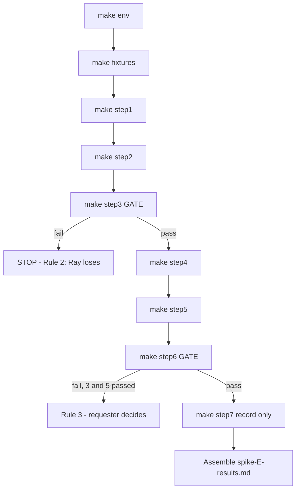

# Spike E — continuation plan (podman on host unblocks steps 1–7)

> **Branch:** `feature/spike-e-continuation` — new capability (the spike has never
> produced a measurement), not a correction to shipped behaviour. PR at the end,
> no GitHub issue.
>
> **Mode:** this is a spike. There is **no red/green TDD ledger** and no pytest
> suite for the harness — the step output *is* the check, and the user reads the
> logs. Each numbered item below is either a harness fix verified by the step that
> exercises it, or a host measurement with a verdict recorded against the frozen
> criteria of [`spike-E-ray-native-protocol.md`](spike-E-ray-native-protocol.md) §3.
>
> **Rule 0.1 is respected throughout: §5's decision rule is FROZEN and is restated
> here, never reinterpreted.**

---

## 1. Context

### Where the spike actually stands

**The scoreboard is blank.** Steps 1 and 2 were attempted on 2026-08-14 and both
died inside the harness before reaching any pass/fail criterion in §3. Per
[`spike-E-step1-2-failure-diagnosis.md`](spike-E-step1-2-failure-diagnosis.md),
the verdict is *"neither step tested Ray"*. Nothing from those runs may be
recorded as a step outcome, in either direction. No gate has been attempted.

What the 2026-08-14 runs proved, precisely:

| Observed | What it was actually evidence of |
|---|---|
| `Error: Invalid application argument 'step1_app'` | Our CLI invocation was malformed |
| `ConnectionError: Failed to connect to Ray at http://localhost:8265` | No cluster was running |
| `Found duplicate applications for route prefix "/"` | A one-line omission in our YAML |

None of these is a fact about Ray.

### What podman-on-host unblocks

The devcontainer sets `--cap-drop=ALL` and `no-new-privileges:true`, so rootless
podman cannot create a user namespace (`cannot clone: Operation not permitted`).
Ray implements `image_uri` **by shelling out to `podman run`**
([`image_uri.py:24`](/usr/local/lib/python3.11/site-packages/ray/_private/runtime_env/image_uri.py:24)),
so in this devcontainer no replica can ever start inside an image. That made the
*actual* pass condition of step 1 — *"each deployment reports its own image's
contents"* — unanswerable here, and the diagnosis §3 concluded steps 1–2 would
have to be split.

**The host removes that split.** It is a DGX-class box with `nvidia-smi`, Ray 2.57
and working podman, and it shares this repository over a volume. So:

- Steps 1–7 all run in one place, in protocol order, against real images.
- The diagnosis §3 re-scoping (item 7) is **no longer needed** — dropped from this plan.
- Harness edits committed here are directly runnable on the host.
- Host output comes back to this workspace for verification.

### Repository state

Clean tree, on `main`. Already fixed since the diagnosis, and **not re-planned here**:
per-step cluster lifecycle ([`run_with_cluster_clean.sh`](../spike-e-ray-native/scripts/lib/run_with_cluster_clean.sh)),
the control-plane client's ports and scale route ([`serve_api.py`](../spike-e-ray-native/scripts/lib/serve_api.py)),
`${VAR}` rendering, `image_uri` under `ray_actor_options.runtime_env` in
[`step1_config.yaml`](../spike-e-ray-native/apps/step1_config.yaml),
distinct `route_prefix` per app in [`step2_config.yaml`](../spike-e-ray-native/apps/step2_config.yaml),
and the [`step2_builder.py`](../spike-e-ray-native/apps/step2_builder.py) double-wrap.

---

## 2. Scope decisions taken with the user

1. **No red/green cycles.** It is a spike; we are trying things. The harness fixes
   are verified by the step running and producing sane output.
2. **The D5 config-key guard is dropped.** The user reads the logs. This is recorded
   as an accepted risk in §6 below, because it is the one diagnosis item being
   deliberately declined.
3. **Three defects found beyond the original list are included** — D7, D8, D9. Two
   of them block gate steps outright, so without them steps 3, 5 and 6 cannot run,
   and those three steps *are* the decision rule.
4. **No new third-party packages.** `requests`, `yaml` and `ray` are already
   available and sufficient. Nothing is proposed.

---

## 3. Numbered behaviours

Each item states inputs, outputs, edge cases and error behaviour. Items 1–9 are
harness work in this workspace. Items 10–17 are host measurements.

### Part A — record the null result

**1. The 2026-08-14 harness failure is on the record as an explicit null result.**

- **File:** create `plans/spike-E-results.md`.
- **Input:** the verbatim logs in
  [`results/raw/step1-20260814T155717Z.log`](../spike-e-ray-native/results/raw/step1-20260814T155717Z.log)
  and `step2-*.log`, plus the env capture.
- **Output:** a "Steps 1–2, 2026-08-14: harness failure, no data" section quoting
  the three errors verbatim, and an explicit statement that **no step 1 or step 2
  verdict is claimed, pass or fail**.
- **Edge case:** `results/raw/` is gitignored, so the logs must be **quoted inline**
  in the results file, not linked — a link would rot on a fresh clone.
- **Why first:** Rule 0.3. The blank scoreboard must be explicit before new results
  land next to it, so nobody later reads the gap as a quiet failure.
- **Verified by:** review — this is documentation, not code.

### Part B — harness fixes (blocking the host run)

**2. `step1_two_deployments.py` builds an app graph containing BOTH deployments.**

- **Defect (D1):** [`step1_two_deployments.py:67`](../spike-e-ray-native/apps/step1_two_deployments.py:67)
  exports `application = TorchProbe.bind()` — only TorchProbe is in the graph, but
  [`step1_config.yaml`](../spike-e-ray-native/apps/step1_config.yaml) lists both
  TorchProbe and TfProbe.
- **Input:** the module, imported.
- **Output:** an ingress deployment holding handles to both probes, so the built
  application's deployment names include `TorchProbe` and `TfProbe`.
- **Error behaviour without the fix:** `override_deployment_info`
  ([`application_state.py:1781`](/usr/local/lib/python3.11/site-packages/ray/serve/_private/application_state.py:1781))
  raises `ValueError: Deployment 'TfProbe' does not exist`. The deploy request is
  accepted — *"Sent deploy request successfully"* — and the app then fails at build
  time, which is exactly what the 15:57 log shows.
- **Constraint:** the ingress must route `/torch` and `/tf`, because
  [`step1_verify.py:21-26`](../spike-e-ray-native/scripts/step1_verify.py:21) already
  introspects those two paths. Composition is done by passing handles into `bind()`.
- **Verified by:** step 1 running on the host and returning two *different* image
  markers.

**3. Part A of step 1 invokes the CLI with an import path.**

- **Defect (D2):** [`step1_verify.py:43`](../spike-e-ray-native/scripts/step1_verify.py:43)
  runs `serve deploy apps/step1_two_deployments.py step1_app`.
- **Two independent errors, both confirmed in the installed source:** trailing
  positionals are parsed as builder `key=val` pairs
  ([`scripts.py:277`](/usr/local/lib/python3.11/site-packages/ray/serve/scripts.py:277)),
  and a `.py` path `is_file()`, so Ray treats it as a YAML config and refuses
  arguments outright
  ([`scripts.py:229-235`](/usr/local/lib/python3.11/site-packages/ray/serve/scripts.py:229)).
- **Output:** `serve deploy step1_two_deployments:application --name step1_app`,
  using an import path plus `--name`
  ([`scripts.py:310-316`](/usr/local/lib/python3.11/site-packages/ray/serve/scripts.py:310)).
- **Edge case:** the import path resolves only if `apps/` is on `PYTHONPATH`;
  [`env.sh:42`](../spike-e-ray-native/env.sh:42) already puts it there.
- **Verified by:** step 1 Part A exiting 0.

**4. `subprocess` is imported at module scope in `step1_verify.py`.**

- **Defect (D4):** imported inside Part A's `try`
  ([`step1_verify.py:41`](../spike-e-ray-native/scripts/step1_verify.py:41)), then
  used by Part B at line 109. If Part A raises before the import, Part B dies with
  `NameError` — masking the real Part B result.
- **Output:** the import moved to the top of the file.

**5. `step2_verify.py` polls both apps on the single proxy port.**

- **Defect (D3):** [`step2_verify.py:26-27`](../spike-e-ray-native/scripts/step2_verify.py:26)
  expects `tool_tf` on `:8001`. One HTTP proxy serves the whole cluster; apps are
  separated by `route_prefix`, not port.
- **Output:** `http://localhost:8000/torch` and `http://localhost:8000/tf`, matching
  the prefixes already set in [`step2_config.yaml`](../spike-e-ray-native/apps/step2_config.yaml).
- **Error behaviour without the fix:** connection refused on 8001, recorded as a
  step-2 failure that is really our URL.

**6. `step3_gpu_swap.py` exports applications that are not double-wrapped.**

- **Defect (D7 — new, gate-blocking):**
  [`step3_gpu_swap.py:65-66`](../spike-e-ray-native/apps/step3_gpu_swap.py:65) does
  `serve.Application(ToolTorch.bind())`. `.bind()` already returns an `Application`,
  and [`Application.__init__`](/usr/local/lib/python3.11/site-packages/ray/serve/deployment.py:59)
  accepts only a `bound_deployment`.
- **This is the identical bug the diagnosis found at §2.4 in the step-2 builder and
  that was fixed there — it was never fixed here.**
- **Blast radius:** step 3 (**GATE**), step 6 (**GATE**) and step 5 mechanism B all
  import from this module
  ([`step6_config.yaml:10`](../spike-e-ray-native/apps/step6_config.yaml:10),
  [`step5_config_mechanism_b.yaml:8`](../spike-e-ray-native/apps/step5_config_mechanism_b.yaml:8)).
- **Output:** `application_torch = ToolTorch.bind()`, `application_tf = ToolTf.bind()`.

**7. `step5_config.yaml` points at an import path that exists.**

- **Defect (D8 — new, blocks a decision step):**
  [`step5_config.yaml:14,25`](../spike-e-ray-native/apps/step5_config.yaml:14) uses
  `import_path: step5_config:application_torch`, but `step5_config` is *that YAML
  file*; there is no `step5_config.py` in `apps/`. Mechanism A cannot deploy at all.
- **Output:** point both applications at `step3_gpu_swap:application_torch` /
  `:application_tf`, which is what mechanism B already does and which carries the
  correct `num_gpus: 1` and image URIs.
- **Note to preserve:** `external_scaler_enabled: true` is already set on both apps
  and is correct for mechanism A — it is required by the scale endpoint (HTTP 412
  otherwise, [`controller.py:1333`](/usr/local/lib/python3.11/site-packages/ray/serve/_private/controller.py:1333)).
  **It also forbids Serve's own autoscaling for those apps, which must be recorded
  as a step-5 finding**, not silently accepted.

**8. `step5_config_mechanism_b.yaml` puts replica keys where Ray reads them.**

- **Defect (D9 — new, silent-no-op class):**
  [`step5_config_mechanism_b.yaml:9-15`](../spike-e-ray-native/apps/step5_config_mechanism_b.yaml:9)
  sets `num_replicas` **inside `ray_actor_options`** and `autoscaling_config` **at
  application level**.
- **Confirmed:** [`ServeApplicationSchema`](/usr/local/lib/python3.11/site-packages/ray/serve/schema.py:712)
  defines neither `ray_actor_options` nor `autoscaling_config`, and unlike its
  siblings at [`schema.py:126`](/usr/local/lib/python3.11/site-packages/ray/serve/schema.py:126)
  and [`schema.py:1360`](/usr/local/lib/python3.11/site-packages/ray/serve/schema.py:1360)
  it sets **no `extra="forbid"`** — so pydantic's default `extra="ignore"` discards
  both keys without warning.
- **Why this matters:** mechanism B would flip replica counts Ray never reads, every
  alternation would appear to "work" while changing nothing, and step 5 would produce
  a **false result** — the same trap as diagnosis §2.1, live again on a decision step.
- **Output:** move both keys under the `deployments:` list, matching the shape of
  [`step3_config.yaml:17-27`](../spike-e-ray-native/apps/step3_config.yaml:17).
  Also give each application a distinct `route_prefix`, which mechanism B currently
  lacks — both would default to `/` and be rejected as duplicates.

**9. The gate scripts read `serve_status()` with its real shape, and import what they use.**

- **Defect (D10 — new, found while confirming D9):**
  [`step3_gate.py:76`](../spike-e-ray-native/scripts/step3_gate.py:76) and
  [`step6_restart.py:134`](../spike-e-ray-native/scripts/step6_restart.py:134) iterate
  `status.get("applications", [])` as a **list of dicts**. The endpoint returns a
  **dict** keyed by application name
  ([`ServeInstanceDetails.applications`](/usr/local/lib/python3.11/site-packages/ray/serve/schema.py:1764)),
  so iterating yields **strings** and `.get("status")` raises `AttributeError`.
  Steps 1 and 2 already handle it as a dict — the gate scripts were never updated.
- **Defect (D11 — new):** [`step6_restart.py`](../spike-e-ray-native/scripts/step6_restart.py:26)
  calls `podman_ps_count()` at lines 62, 84 and 126 but imports only `podman_ps_all`
  and `podman_ps_all_json`. The function exists in
  [`podman.py:37`](../spike-e-ray-native/scripts/lib/podman.py:37) — it is just not
  imported. **`NameError` at line 62, before the head node is even killed**, so
  step 6 would fail without testing recovery at all.
- **Defect (D13 — new, ledger addition, found during item 9 verification):**
  `step6_restart.py` phase B called `get_application("tool_torch")` → `GET
  /api/serve/applications/tool_torch`, but the dashboard defines **no**
  per-application GET route (`serve_head.py`: only `GET/PUT/DELETE
  /api/serve/applications/`, the scale POST, `/api/ray/version`) — a 404 before
  recovery was ever tested. It also read `apps.get("replicas")`, the wrong
  payload shape (replicas nest under `applications[name].deployments[dep].replicas`;
  `ReplicaDetails.pid` is the PID field, `schema.py:1285`). Fixed by reading
  `serve_status()` filtered to the deployment, with the recovery check at
  deployment-level status (the app-level enum is `RUNNING`, never `HEALTHY`,
  `schema.py:1171`). Phase A and the kill/observe control flow are unchanged.
- **Output:** dict-shaped status handling in both gate scripts; the missing import
  added; phase B's data source and payload shape corrected.
- **Why grouped:** one-line fixes on the same two gate scripts, found together.
  D13 was found while verifying D10/D11 and committed separately in `85562be`.

**9a. The GATE configs deploy, and step 6 phase B queries a route that exists.
(Ledger addition — found by the manager's verification of item 9; committed in
`85562be`.)**

- **Defect (D12 — new):** [`step3_config.yaml`](../spike-e-ray-native/apps/step3_config.yaml)
  and [`step6_config.yaml`](../spike-e-ray-native/apps/step6_config.yaml) each
  declare two applications with **no** `route_prefix`, so both default to `/`
  and `ServeDeploySchema` rejects the deploy ("Found duplicate applications for
  route prefix '/'" — the same validator as the original step-2 failure). Both
  configs gate the spike's decision (step 3 is GATE 1; step 6 deploys
  `step6_config.yaml`), so both steps would have failed at deploy time without
  measuring anything.
- **Input:** the two configs, after adding `route_prefix: /tool_torch` and
  `/tool_tf` (matching what [`step3_gate.py:32-33`](../spike-e-ray-native/scripts/step3_gate.py:32)
  already polls; step 6 polls no tool URLs).
- **Verified:** all six spike configs now pass `ServeDeploySchema` under the
  installed Ray 2.57 — step 1, step 2, step 3, step 5 (both mechanisms),
  step 6.
- **D13** (see item 9) is the other half of the addition: the route the script
  queries must exist, not just the config the deploy accepts.

**9b. Fixtures bake different bytes per image, and configs render before deploy.
(Ledger additions found by the manager during pre-run review; committed in
`c52b678` and `470eb50`.)**

- **Defect (D14 — new):** [`make_assets.py`](../spike-e-ray-native/fixtures/make_assets.py)
  seeded the weights with a constant (`42`) for **every** image, so
  `tool_torch` and `tool_tf` baked byte-identical
  `/opt/spike/weights/ckpt.bin`. Step 2's pass condition requires both apps
  to load their **own** weights and the verify script's
  [`weights_sha256` check](../spike-e-ray-native/scripts/step2_verify.py:114)
  wants the two images to **differ** — it could never pass as built (the tf
  Dockerfile's comment "different bytes — seed differs in make_assets.py"
  was false). Fixed: `--seed` arg (default `42` preserves the old bytes),
  `ASSET_SEED` build args `1001`/`1002`, recorded in `build-info.log`, and
  [`build_images.sh`](../spike-e-ray-native/fixtures/build_images.sh:107)
  cross-checks the two weights sha256 and exits 1 if identical.
  Also: [`step2_config.yaml`](../spike-e-ray-native/apps/step2_config.yaml:21)
  had `image_uri: ""` (blanked while podman was broken in the devcontainer);
  on the host that sends both replicas to the controller environment where
  [`VRAMAllocator`](../spike-e-ray-native/toolkit/vram.py:27) cannot allocate
  — step 2 could not start at all. Restored, now rendered by the D15 fix.
- **Defect (D15 — new, gate-blocker):**
  [`render_env.py`](../spike-e-ray-native/scripts/lib/render_env.py) regex never
  matched the closing brace — a **prefix** match that broke every default form:
  `${VAR:default}` unset → literal placeholder (default ignored); set →
  `value:default}` (corrupted image URI); `${VAR:-default}` → stray `}`.
  With `SPIKE_IMAGE_*` unset on the host, steps 1 (Part B), 2 and 5 (a
  **decision step**) would deploy the literal `${SPIKE_IMAGE_TORCH_URI:...}`
  as the image URI → podman "image not found" before Ray was measured. The
  08-14 step-2 log already contains the literal placeholder as evidence.
  Fixed: whole-placeholder match supporting `${VAR}`, `${VAR:-default}` and
  `${VAR:default}` (single-colon == double-colon, documented — image URIs
  contain colons). [`step1_verify.py`](../spike-e-ray-native/scripts/step1_verify.py:120)
  Part B also now deploys via `apply_config` (rendered) instead of raw
  `serve deploy <yaml>`, which bypassed rendering entirely.
- **Benign note:** the `+1` seed offset means the torch image's payload bytes
  equal the tf image's weights bytes (same counter stream, different
  asset). No check compares cross-asset bytes; recorded so nobody is
  surprised in the results doc.

**9c. The host can actually build the fixtures. (Ledger addition found on the
host during the first real `make fixtures`; committed in `13c6dd0`.)**

- **Defect (D16 — new, host-blocker):** [`env.sh`](../spike-e-ray-native/env.sh:16)
  assigned `SCRIPT_DIR` (the spike root) and **exported** it. Because `source`
  runs in the caller's shell, every use of `SCRIPT_DIR` in
  [`build_images.sh`](../spike-e-ray-native/fixtures/build_images.sh:8) *after*
  the `source` line silently referred to the spike root instead of `fixtures/`.
  Host failure was `Error: stat <spike>/tool_torch.Dockerfile: no such file or
  directory` — note the path is the spike root, not `<spike>/fixtures/`. The
  build **context** was equally wrong: `"${SCRIPT_DIR}/../"` resolved to the
  **repo root**, which would also have broken the Dockerfiles' context-relative
  `COPY fixtures/… toolkit/ apps/` lines and shipped the 114 MB `vendor/`
  wheel cache to the build.
- **Fix:** `env.sh` uses a namespaced `SPIKE_ROOT` internally and exports that;
  nothing outside `env.sh` consumed the exported `SCRIPT_DIR` (grepped the
  Makefile, every shell script, `apps/`, `toolkit/` and the Python sources).
  `build_images.sh` captures its own `FIXTURES_DIR` **before** sourcing, so it
  is immune to whatever `env.sh` exports.
- **Verified** with a podman shim that echoes its arguments: `-f` absolute under
  `fixtures/`, context resolving to the spike root, byte-identical from a
  different cwd, and a `SCRIPT_DIR` sentinel surviving the `source`.
- **Latent trap noted:** `step7_podman.sh`, `scripts/lib/start_cluster.sh` and
  `scripts/lib/preflight.sh` follow the same set-then-source pattern but use
  `SCRIPT_DIR` only on the `source` line itself, so they were unaffected; the
  rename removes the trap for them too.
- **Process note (Rule 0.3 honesty):** the manager's first diagnosis — that
  podman 3.4.4 resolves `-f` relative to the build context — was **wrong**. It
  was implemented, caught by the shim experiment, and reverted before the real
  cause was found. Recorded so the reasoning trail is not flattered after the
  fact.

**9d. The host can pull the base image and bake the assets. (Ledger additions
found on the host while re-running `make fixtures`; committed in `c5d35d5` and
`260bc23`.)**

- **Defect (D17 — new, host-blocker):** the build reached `FROM` and failed:
  *"short-name `rayproject/ray:2.57.0-py311-gpu` did not resolve to an alias and
  no unqualified-search registries are defined in
  `/etc/containers/registries.conf`"*. Podman, unlike docker, does not assume
  Docker Hub for unqualified names, and this host defines no
  `unqualified-search-registries`. `RAY_BASE_TAG` is now
  `docker.io/rayproject/ray:2.57.0-py311-gpu` in
  [`.env.example`](../spike-e-ray-native/.env.example:8), in
  [`env.sh`](../spike-e-ray-native/env.sh:28)'s `:=` default, and in
  `capture_env.py`'s three copies, so the value cannot drift. Version and
  variant unchanged.
  - **Researched, not assumed:** the *fixture* images are also referenced by
    short name (`tool_torch:spike`) at run time. `podman run`'s `--pull`
    defaults to `missing`, which pulls only *"if a local image does not
    exist"*, so a just-built local image never reaches short-name resolution.
    Docs captured under
    [`plan/third-party-docs/podman/`](../plan/third-party-docs/podman/INDEX.md)
    from the podman v3.4.4 git tag, with source URLs.
  - **Residual risk, deliberately not fixed:** if the local image is absent
    (`podman system prune -a`, or a node that did not build it), the short
    name *would* go through registry resolution and fail identically.
    `localhost/tool_torch:spike` is the hardening; recorded as a
    recommendation because applying it changes what steps 1 and 2 exercise.
- **Defect (D18 — new, host-blocker):** both builds then died at STEP 8/15 with
  `PermissionError: [Errno 13] Permission denied: '/opt/spike'`. The
  `rayproject/ray` image drops to the unprivileged `ray` user (uid 1000, set by
  `USER $RAY_UID` in `docker/base-deps/Dockerfile` at tag `ray-2.57.0`), which
  cannot create a directory under `/opt`. Fixed as a **permission** change, not
  a path change — `/opt/spike` appears in 20 places across `apps/`, `toolkit/`,
  `scripts/` and the configs — with `USER root` → `mkdir -p /opt/spike && chown
  ray` → `USER ray` immediately before the asset step in both Dockerfiles.
  - **The trailing `USER ray` is load-bearing:** leaving the image as root
    would change what steps 3 and 7 exercise (step 7 checks that no
    `--privileged` is required). Verified: the last `USER` in each file is
    `ray`.
  - **Noise, investigated and dismissed:** podman warns *"SHELL is not
    supported for OCI image format"* on every step, because the base image
    declares `SHELL ["/bin/bash", "-c"]` and OCI has no shell field. Harmless
    here — every `RUN` line is POSIX, and `ARG`/`ENV` interpolation happens in
    the builder, not the step shell. `--format docker` would silence it and
    restore bash parity; optional, not applied.

- **Defect (D19 — new, host-blocker):** with D18 in place the assets **baked
  successfully** (both sha256 values printed) and only the cleanup failed:
  `rm: cannot remove '/tmp/make_assets.py': Operation not permitted`. `COPY`
  runs with root as owner, so the helper was root-owned, while the `RUN` after
  it executes as `ray`; `/tmp` is sticky (1777), under which only the file's
  owner may unlink — hence `EPERM`, not `EACCES`. Fixed with
  `COPY --chown=ray` in both Dockerfiles.
  - **Verified, not assumed:** `podman-build.1` states *"podman build uses code
    sourced from the buildah project"*; podman v3.4.4's `go.mod` pins buildah
    v1.23.1; that tag's `imagebuildah/stage_executor.go` accepts `--chown` on
    `COPY`, and `add.go`'s `userForCopy` falls through to `userForRun` for a
    non-numeric user, resolving it from the image's `/etc/passwd` — the same
    mechanism the already-working `USER ray` and `chown ray` steps rely on.
    `podman-build.1` captured under
    [`plan/third-party-docs/podman/`](../plan/third-party-docs/podman/INDEX.md).
  - **Nothing requires the helper's absence** (grepped `apps/`, `toolkit/`,
    `scripts/`, configs and docs), so the `rm` is hygiene — but keeping it
    working costs less than explaining its absence later.

**Pattern worth noting for the results write-up.** D16–D19 were four
consecutive *host-only* blockers — a shell variable collision, podman's
short-name strictness, an unprivileged-user permission, and a sticky-bit
unlink. None could have been caught by local verification, and none is a
finding about Ray. They are the cost of the "run it on the real host" step
that the protocol demands, and they are recorded here so the results
document does not mistake harness friction for evidence about the framework.

**9e. `image_uri` workers could not start at all — and the harness hid it.
(Ledger additions from the first real `make step1`; committed in `7e6b757`
and `b191df1`.)**

- **FINDING ABOUT RAY (not harness friction) — D20.** Serve replicas using
  `runtime_env.image_uri` never started. The raylet repeated *"worker … dead,
  probably crashed during start"* every 60 s with **no per-worker `.err` file**,
  while the non-container deployment in the same app ran normally. Verified
  against the installed Ray 2.57.0 source:
  - [`image_uri.py:76-96`](/usr/local/lib/python3.11/site-packages/ray/_private/runtime_env/image_uri.py:76)
    builds the worker's `podman run` prefix with `--userns=keep-id` but **no
    `--user`** (grep: no `-u`/`--user` in the file), so the worker runs as the
    **image's** `USER` (uid 1000), not as the host uid (1011).
  - [`ImageURIPlugin.modify_context:174`](/usr/local/lib/python3.11/site-packages/ray/_private/runtime_env/image_uri.py:174)
    hardcodes `run_options=[]`, so `--user` **cannot be injected** through
    `image_uri` — while the older `container` plugin *does* forward run options
    ([`:222`](/usr/local/lib/python3.11/site-packages/ray/_private/runtime_env/image_uri.py:222)).
  - Ray creates its session sockets `0755` owned by the host uid and **never**
    `chmod`s them or sets a umask (grep of `services.py`, `node.py`: neither
    appears). `connect()` on a unix socket needs **write** permission, so the
    container worker gets `EACCES` and dies before registering — a C++ failure,
    which is why there is no Python traceback and no `.err` file.
  - The comment at
    [`image_uri.py:86-94`](/usr/local/lib/python3.11/site-packages/ray/_private/runtime_env/image_uri.py:86)
    states the assumption plainly: the host user is *"usually `ray`"*.
  - **The finding:** `image_uri` carries an **unenforced precondition** — the
    host cluster uid must equal the image's `USER` uid — with no check, no
    escape hatch, and a failure mode that produces no diagnostic. For tool-swap
    this matters directly: our tool images are third-party-authored, so we
    cannot assume they run as uid 1000, and we would have to either constrain
    every tool image's `USER` or abandon `image_uri` for the `container` key.
  - **Workaround taken (Option D, user's choice):** start Ray under `umask 0`
    so sockets are `0777`. **Trade-off accepted explicitly:** any local user can
    reach the raylet socket while the cluster runs; acceptable only because this
    host has trusted users. Alternatives considered and rejected for now:
    baking the host uid into the images (non-portable), and switching to the
    `container` runtime_env key so `--user` can be passed (tests a different
    mechanism than the one we would ship).
  - **Applied to both launchers.** The first attempt patched only
    `start_cluster.sh` — which *every* Makefile step target bypasses, since they
    all use `run_with_cluster_clean.sh` and its own inline `ray start`. Caught
    by the subtask, verified with a PATH shim. `step6_restart.py` launches a
    cluster too and still inherits the operator's umask: noted, not fixed.
- **Defect (D21 — harness, and the more dangerous one).** `make step1` exited
  **0** while *both* probes timed out. Every probe error was caught, printed,
  recorded — and swallowed; nothing mapped a recorded error to the exit status.
  A broken run was indistinguishable from a passing one, which is precisely the
  failure this protocol exists to prevent. Both step scripts now exit **2** for
  a harness failure (observation could not be made), **3** for a negative
  finding (observation made, answers the step negatively), 0 clean, 1 crash.
  - Two further defects surfaced while fixing it: step 1 waited for
    `ApplicationStatus == "HEALTHY"`, which applications never report (Ray 2.57
    uses `RUNNING`), so the wait always burned its full timeout; and **step 2
    requested the `introspect` op while comparing `weights_sha256`, which only
    `startup_report` returns** ([`deployments.py:118`](../spike-e-ray-native/toolkit/deployments.py:118),
    field at [`:137`](../spike-e-ray-native/toolkit/deployments.py:137)) — its
    central isolation comparison could **never** have succeeded on any cluster,
    and it still exited 0.
  - **Not yet fixed:** steps 3–6 share the swallow-and-exit-0 pattern, and
    `step3_gate.py` can hit a `NameError` if the torch probe fails. Those carry
    gate semantics I want to review before changing their exit behaviour — but
    **no GPU-step result may be trusted until they are fixed**, since a gate
    that cannot fail is not a gate.

**9f. The `image_uri` worker crash, finally diagnosed (D22), and a harness
defect it was masking (D23).**

- **D22 — SIGABRT root cause, captured not inferred.** Container workers died
  with exit 134 and *empty* `podman logs`. The abort message was finally
  captured by straceing the worker:
  ```
  Unhandled exception: N6spdlog9spdlog_exE. what(): Failed opening file
  /tmp/ray/session_*/logs/events/event_CORE_WORKER_<pid>.log
  for writing: Permission denied
  ```
  The container worker runs as the image's `USER ray` (uid 1000) while
  `<session>/logs/events/` and `<session>/logs/export_events/` are mode **755**
  owned by the cluster uid (1011) — so the C++ core worker's event writer
  throws an **uncaught** `spdlog_ex`, `std::terminate` fires, and the message is
  invisible because Ray's `RayLog` has already redirected fd 2 into a session
  log file. Hence: no container log, no `.err`, only the raylet's "process is
  dead".
  - **Proven by intervention, not correlation:** `chmod 777 logs/events` moved
    the abort to `logs/export_events/` (same exception, next directory);
    `chmod 777` on *all* `logs/` subdirs eliminated every SIGABRT, and the
    deployment then failed *differently and visibly*.
  - **Why D20's `umask 0` did not fix it:** the sockets and `logs/` became 777,
    but these two subdirectories are still created 755.
  - **Correction to the subtask's citation, recorded for honesty:** it claimed
    the 0755 is explicit in
    [`event_logger.py:114`](/usr/local/lib/python3.11/site-packages/ray/_private/event/event_logger.py:114),
    but that line is `dir_path.mkdir(exist_ok=True)` with **no mode argument**,
    which would be umask-derived. The *observed* 755 under `umask 0` is
    therefore real but **not yet explained** — most likely the directory is
    created by Ray's C++ side (not inspectable from the Python package). The
    empirical finding stands; the mechanism is unconfirmed.
  - **Classification: a genuine Ray defect.** Ray runs the worker as the
    image's uid *by design* (`--userns=keep-id`, no `--user`, `run_options`
    hardcoded empty at
    [`image_uri.py:174`](/usr/local/lib/python3.11/site-packages/ray/_private/runtime_env/image_uri.py:174)),
    then mounts its tmp dir in and requires that differently-uid'd process to
    write into directories Ray created 755. Two of its own features in mutual
    contradiction. Aggravating: a **log sink failure is fatal**, and the
    diagnostic is emitted only after stderr redirection — so the symptom is a
    silent 134.
- **D23 — our defect, previously masked.** With the aborts gone, replicas fail
  with `ModuleNotFoundError: No module named 'toolkit'`, because
  [`serve_api.py:88-99`](../spike-e-ray-native/scripts/lib/serve_api.py:88)
  injects **host** paths into `PYTHONPATH` per *application*, and that value is
  propagated verbatim into the container, overwriting the image's own
  `PYTHONPATH` where `toolkit`/`apps` actually live (`/home/ray`). The ingress
  deployment runs on the host and *does* need the host path, so the injection
  must become per-deployment.
- **Hypotheses eliminated on the way (all tested, all negative):** host/image
  Python version mismatch; the podman flag combination; a native import abort
  (torch, tensorflow and ray all import cleanly under Ray's exact flags);
  RAY_* env poisoning; stale node/worker ids; socket permissions (re-tested);
  rlimits and cgroup pid caps; plasma `/dev/shm` under `--ipc=host`.
- **Incidental, worth guarding later:** at one point another user's Ray cluster
  owned ports 6379/8265 on this shared host. `make step1` has no check that the
  cluster it talks to is its own.
- **Still true after all this: the spike has not yet tested its actual
  question.** Every failure so far has been environmental or harness. Rule 0.3
  applies — none of it is evidence about Ray Serve's suitability, except D22
  itself, which is.

**9g. THE FINDING (D27): cross-deployment results are pickled, so the
*receiver* must import the *sender's* types — container isolation does not
isolate the serialisation contract.**

This is the first result that answers the spike's actual question rather than
its scaffolding, and it is decisive for tool-swap.

**What happened.** With every earlier blocker fixed, `TorchProbe` started in its
container and **served the request successfully** — its own log records
`CALL __call__ OK 5.5ms`. The HTTP 500 came from the **ingress**, which runs on
the *host* (no torch installed), while **deserialising the reply**:
```
ray.exceptions.RaySystemError: System error: No module named 'torch'
  File ".../ray/_private/serialization.py", line 361, in _deserialize_pickle5_data
    obj = pickle.loads(in_band)
ModuleNotFoundError: No module named 'torch'
```
`TfProbe` returned 200 on the identical code path.

**Why torch and not tensorflow.** [`introspect.py:61`](../spike-e-ray-native/toolkit/introspect.py:61)
returns `torch.__version__`, which is **not a `str`** — it is a
`torch.torch_version.TorchVersion` instance, so its pickle carries a reference to
a torch module. `tensorflow.__version__` *is* a plain `str`
([`introspect.py:65`](../spike-e-ray-native/toolkit/introspect.py:65)), so the tf
reply unpickles anywhere. The asymmetry is not luck about which image is
"better"; it is a single attribute whose type happens to be framework-specific.

**Why this matters more than any earlier entry.** Per-deployment `image_uri`
genuinely works — that part of behaviour 1 is confirmed, and `image_marker`
proves the code ran in the right image. But Ray Serve passes results between
deployments by **pickle**, so:
- a value crossing a deployment boundary must be importable by the receiver;
- isolating tools in separate images does **not** isolate their type
  dependencies;
- a router that calls heterogeneous tools would need **every tool's libraries
  installed in the router**, which defeats the entire purpose of per-tool images.

The isolation `image_uri` provides is process-level, not contract-level. For
tool-swap, whose whole premise is that tools bring mutually incompatible
dependencies, that is the crux.

**Consequence for the design.** This is direct empirical support for
[`ADR-0005`](../plan/adr/0005-one-uniform-batched-calling-convention.md): a
uniform, framework-neutral calling convention is not stylistic tidiness, it is
the only thing that makes heterogeneous tools composable. Any boundary between
tools must carry **plain data only** — str, int, float, bool, list, dict, bytes
— never a framework object, however incidental. `torch.__version__` is about as
incidental as it gets, and it was enough to break the call.

**Caveat, stated plainly.** The fixture is at fault for returning a
framework-typed value, and fixing it (`str(torch.__version__)`) will make step 1
pass. That fix does **not** retire the finding: it confirms it. The constraint is
real regardless of whether our fixture trips over it, and a real tool returning a
tensor, a numpy dtype, or any framework object would hit exactly this wall.

**Diagnostic cost worth recording.** Four wrong hypotheses preceded this one
(socket permissions, shell quoting, config placeholders, torch failing to import
in a GPU-less container — the last disproved by `torch OK 2.8.0+cu129,
cuda_available: False` and a clean standalone `introspect()` in that very image).
The Ray-side symptom was an opaque HTTP 500; the actual cause was only visible in
the *ingress* replica log, not the failing deployment's. Ray attributes the error
to the caller, which is technically correct and diagnostically misleading.

**9h. STEP 1: PASS — the first real observation the spike has produced.**

`make step1` → **exit code 0**, "all required observations made; no negative
findings". Both probes answered from their own containers:

| | TorchProbe | TfProbe |
|---|---|---|
| `image_marker` | `tool_torch` | `tool_tf` |
| `framework` | torch | tensorflow |
| `framework_version` | 2.8.0+cu129 | 2.16.2 |
| `sys_executable` | `/home/ray/anaconda3/bin/python` | `/home/ray/anaconda3/bin/python` |
| pid | 4084930 | 4086817 |

**Verdict on behaviour 1 (per-deployment `image_uri`): CONFIRMED.** Two
deployments in a single Serve application each ran in a different container
image. `SPIKE_IMAGE_MARKER` is baked into the image at build time and cannot be
set through `runtime_env`, so it is proof of *which image served the request*,
not merely of configuration being accepted. `sys_executable` confirms both ran
the container's interpreter, not the host's. Distinct pids confirm separate
processes. Both configuration forms — the decorator/`ray_actor_options` form and
the YAML config form — were accepted (`Deploy exit code: 0` for each).

Timing worth keeping for the cost discussion: the deployments took **12 polls
(~60s)** to reach RUNNING from a warm image cache, with `TorchProbe` healthy at
poll 8 and `TfProbe` trailing. The 60s default this harness originally used was
not merely unlucky — it sat right on the boundary.

**What this does NOT establish.** Behaviour 1 asked only whether per-deployment
`image_uri` is possible. It is. The expensive questions — GPU swap (behaviour 3),
payload handling (4), alternation (5), restart (6) — remain untested, and the
D27 constraint (only plain data may cross a deployment boundary) applies to every
one of them.

**Honest accounting of what it took.** Seven fixes stood between "the plan says
this should work" and this result: D20 (socket umask), D21 (steps exiting 0 on
failure), D22 (container uid vs Ray's 0755 event dirs), D23 (host PYTHONPATH
overwriting the image's), D24 (VRAMAllocator dropping its argument and demanding
a GPU), D25 (60s readiness ceiling; HTTP errors hidden behind a JSON decode),
D27 (framework-typed value crossing the boundary). Two were findings about Ray;
five were ours. That ratio is itself a result, and belongs in the write-up.

**9i. STEP 2: PASS — behaviour 2 confirmed, plus one claim I am refusing to
record as a result.**

`make step2` → **exit 0**.

| | tool_torch | tool_tf |
|---|---|---|
| `image_marker` | `tool_torch` | `tool_tf` |
| `weights_sha256` | `43d5b7a712b5ded7…` | `83faf8738805e750…` |
| `framework` / version | torch 2.8.0+cu129 | tensorflow 2.16.2 |
| `weights_bytes` | 8388608 | 8388608 |
| `init_total_seconds` | 1.83 | 2.72 |
| `vram_allocated_mb` | 0 | 0 |

**Verdict on behaviour 2 (app builder + per-app baked-in weights): CONFIRMED.**
A **generic** builder —
[`step2_builder.py`](../spike-e-ray-native/apps/step2_builder.py), which imports
neither framework — built two applications from one `import_path` with different
`args`, each landing in its own image with its own weights. Same byte count,
**different SHA-256**: the two images genuinely hold different bytes at the same
path and each replica read its own. That is the isolation proof, and it is the
check that could never have passed before D21 fixed the op being called.
`vram_allocated_mb: 0` is correct — these are CPU-only (`num_gpus: 0`) and D24
skips allocation honestly instead of faking a number.

**The claim I am NOT recording: "Strict builder ACCEPTED — builder may run in
tool_torch image".** The strict variant
([`step2_builder.py:79`](../spike-e-ray-native/apps/step2_builder.py:79)) imports
`torch` at function scope and `serve deploy` returned 0. The conclusion does not
follow:
- Exit 0 from `serve deploy` means the request was **accepted**, not that the
  builder ran, nor where it ran. Every failure in this spike so far also printed
  `Deploy exit code: 0` — that is exactly how D22 and D28 stayed hidden.
- The driver runs in the host venv, which **has torch installed**, so a
  host-side builder import succeeds for a reason that says nothing about images.
- The step never checked that the strict app reached RUNNING or answered a
  request.

**Recorded as an open question, not a finding.** Settling it needs a negative
control: a builder importing a package absent from *both* the host venv and the
target image, plus confirmation the app reaches RUNNING. Cheap, and it must be
added before the write-up says anything about where builders execute.

**Timing.** 14 polls (~70s) to RUNNING with warm images, and the two apps
diverged sharply — `step2_tf` was RUNNING at poll 8 while `step2_torch` was still
UPDATING at poll 12. Per-replica container start dominates and is not uniform,
which matters for any latency budget built on it.

**Fixed en route (D28/D28b).** `Tool` had **no `__call__`**, so it could not
serve HTTP when bound directly as an ingress — which is exactly how step 2 binds
it. Steps 3, 4 and 5 carried the identical latent bug via
[`step3_gpu_swap.py`](../spike-e-ray-native/apps/step3_gpu_swap.py)'s dict-only
overrides; found by reading the source rather than by spending the GPU gate on
it.

**9j. FINDING (D32): YAML `ray_actor_options` REPLACES the decorator's
wholesale — silently dropping `image_uri`, so the tools ran on the host.**

Step 3's first real run failed, and the cause is a genuine Ray behaviour with
sharp consequences for tool-swap.

**Evidence.** `ToolTorch` failed to start three times with:
```
FileNotFoundError: [Errno 2] No such file or directory: '/opt/spike/weights/ckpt.bin'
  File "/home/mgaron/Repositories/tool-swap/spike-e-ray-native/toolkit/deployments.py", line 107
```
`/opt/spike/weights/` exists **only inside the fixture images**, and the
traceback path is the **host checkout** — so the replica ran on the host, in no
container at all. `serve status` confirms it: the deployed `runtime_env`
contains only `env_vars`, with **no `image_uri`**, even though
[`step3_gpu_swap.py:22`](../spike-e-ray-native/apps/step3_gpu_swap.py:22) sets
`"runtime_env": {"image_uri": IMAGE_TORCH}` in the decorator.

**Cause, read from Ray's source** —
[`application_state.py:1827-1833`](/usr/local/lib/python3.11/site-packages/ray/serve/_private/application_state.py:1827):
```python
if "ray_actor_options" in options:
    # If specified, get ray_actor_options from config
    override_actor_options = options.pop("ray_actor_options", {})
else:
    # Otherwise, get options from application code
    override_actor_options = replica_config.ray_actor_options or {}
```
Whole-value **replacement, not a merge**.
[`step3_config.yaml:24`](../spike-e-ray-native/apps/step3_config.yaml:24) sets
`ray_actor_options: {num_gpus: 1}`, which replaced the decorator's
`{num_gpus: 1, runtime_env: {image_uri: …}}` and discarded the image.

**Why this is a finding and not merely our bug.** The failure is **silent**:
Ray accepts the deploy, reports RUNNING, and runs the tool in the wrong
environment. Nothing warns that an image requested in code was dropped by
config. For tool-swap the implication lands on the exact axis the project cares
about — *which environment a tool executes in*: a config that sets **any** actor
option (a GPU count, a CPU count) silently voids the image the tool author
specified, and the tool then runs against whatever is on the host. It also
explains why step 1 passed: its YAML sets `ray_actor_options` *including* the
`image_uri`, so nothing was lost.

**Consequence for the spike.** The remedy is to name `image_uri` in the YAML
beside `num_gpus`, as step 1 does. That does not retire the finding: the
constraint is real, and any deployment mixing decorator options with config
overrides will meet it.

**Secondary defects exposed in the same run:**
- `_require_same_gpu` crashed with `UnboundLocalError: tf_gpu` when the tf probe
  never ran — the same bug class D29 fixed at
  [`step3_gate.py`](../spike-e-ray-native/scripts/step3_gate.py), reintroduced by
  the D31 invariant. A guard added *to make the gate trustworthy* crashed the
  gate: exit 1, no verdict. Sobering, and worth stating plainly.
- The 120s probe timeouts were **consequences** of the replicas never starting.
  The gate classified them correctly as harness failures, but only surfaced the
  three `REPLICA_STARTUP_FAILED` events in the post-idle status dump. It should
  read `recent_dead_replicas` and fail fast.
- `Podman containers: 70` — Ray's `image_uri` launcher passes no `--rm`
  ([`image_uri.py:77-96`](/usr/local/lib/python3.11/site-packages/ray/_private/runtime_env/image_uri.py:77)),
  unlike its own throwaway inspection container at
  [`:27`](/usr/local/lib/python3.11/site-packages/ray/_private/runtime_env/image_uri.py:27).
  Every crashed worker from three days is still on disk. It helped diagnose D22,
  but on a long-running host a crash loop accumulates containers without bound —
  a second, operational finding about `image_uri`.

> **⚠ RETRACTED IN PART — read 9L before citing 9k.** The exit-3 result and the
> VRAM measurements below are real, but the *attribution* in 9k is wrong: I
> concluded a GPU could not reach a podman container on this host. It can. See
> **9L** for the corrected finding. 9k is kept verbatim, not edited, because a
> retracted decisive verdict is itself part of the record.

**9k. STEP 3 GATE: FAILED — exit 3. The cause is decisive: `image_uri` cannot
give a container a GPU, while Ray's scheduler believes it did.**

`make step3` → **exit code 3**, `STEP 3 RESULT: NEGATIVE FINDING(S)`. This is
the Rule 2 gate, so the spike stops here.

**What the gate observed.** `tool_torch` cold-started in 10.8s and answered
`introspect` from inside its container — `image_marker: tool_torch`,
`sys_executable: /home/ray/anaconda3/bin/python`, `cuda_visible_devices: "0"` —
and reached `HEALTHY`/`RUNNING`. But VRAM on GPU 0 went **647 MiB → 579 MiB**
across the request. The tool allocates 4096 MiB and added **nothing**.

**Why — established by four independent checks, not inferred:**
1. Ray's container command
   ([`image_uri.py:76-96`](/usr/local/lib/python3.11/site-packages/ray/_private/runtime_env/image_uri.py:76))
   is `podman run -v … --cgroup-manager=cgroupfs --network=host --pid=host
   --ipc=host --userns=keep-id`. Grep for `--device`, `--gpus`, `nvidia`:
   **nothing**. No device is passed and no GPU-aware runtime is selected.
2. A container run with Ray's exact flags reports
   `cuda_available: False, device_count: 0`.
3. Even passing the raw device nodes (`--device /dev/nvidia0 --device
   /dev/nvidiactl --device /dev/nvidia-uvm …`), the container reports
   `libcuda.so.1: cannot open shared object file` → `cuda: False, 0`. Device
   nodes alone are insufficient: the **driver libraries** must be injected, which
   is the job of `nvidia-container-runtime` — present at
   `/usr/bin/nvidia-container-runtime`, and never invoked by Ray.
4. [`ImageURIPlugin.modify_context`](/usr/local/lib/python3.11/site-packages/ray/_private/runtime_env/image_uri.py:174)
   hardcodes `run_options=[]`, so **`--runtime`, `--device` and `--gpus` cannot
   be supplied through `image_uri` at all**. The legacy `container` key forwards
   run options; the modern key does not.

**The finding.** Ray reserved `GPU: 1.0` for the replica, set
`CUDA_VISIBLE_DEVICES=0` in its environment, and reported it HEALTHY — while the
container had **no GPU whatsoever**. Ray's accounting claimed an A100 was
occupied while zero bytes of VRAM were allocated and the tool ran on CPU. The
two capabilities tool-swap needs *simultaneously* — **per-tool container images**
and **GPU residency** — do not compose in Ray 2.57. And the failure is silent:
nothing in the deploy, in `serve status`, or in the replica's own view reveals
that the promised GPU is absent. A scheduler built on this would hand out GPUs
that its tools cannot use, and never know.

**Rule 2 verdict: Ray Serve FAILS the decisive gate.** The question was whether
two conflicting tools can share one GPU on demand. They cannot — a containerised
tool cannot reach a GPU at all.

**Scope of the claim, stated precisely, including what would overturn it:**
- Tested on Ray 2.57 + **rootless podman 3.4.4**. That podman predates CDI, so
  the 17 devices `nvidia-ctk` registered (`nvidia.com/gpu=0…7`) are unusable by
  it — `--device nvidia.com/gpu=0` fails with *"stat … no such file or
  directory"*, i.e. the name is treated as a path. A podman ≥4.x host might
  reach a GPU **if Ray passed the device** — but Ray passes none and
  `run_options` is hardcoded empty, so the Ray-side blocker stands independently
  of the podman version.
- Under **Docker** with `nvidia-container-runtime` as the default runtime,
  library injection can occur without an explicit flag, so `image_uri` might
  behave differently there. **Untested, and unreachable here**: Ray hardcodes
  `container_driver = "podman"` at
  [`image_uri.py:76`](/usr/local/lib/python3.11/site-packages/ray/_private/runtime_env/image_uri.py:76).
  This is the single biggest caveat on the verdict and must be carried into the
  write-up as such.
- The legacy `container` runtime_env key accepts `run_options` and could carry
  `--runtime=nvidia`. That is a different API from the one under test, mutually
  exclusive with most other runtime_env fields, and would need its own run
  before any claim is made about it.

**What is not in doubt:** with the modern, documented `image_uri` key, on this
host, a GPU-bound containerised tool is impossible, and Ray misreports the GPU
as allocated.

**Also observed:**
- The same-GPU invariant never fired because the gate stopped at the first
  finding and never probed `tool_tf` — correct behaviour: further probes would
  only have recorded consequences of the decisive result.
- The D32 fix worked. `serve status` shows
  `runtime_env: {image_uri: "tool_torch:spike"}` present and the replica running
  the container's interpreter — the image reached the replica this time.
- 71 containers on disk (one still `Up`), continuing the `--rm` accumulation.

**9L. CORRECTION to 9k (D33): a GPU CAN reach a podman container on this host.
The real blocker is that `image_uri` gives you no way to ask for it.**

The user challenged my 9k conclusion — podman is supposed to support GPUs — and
was right to. I had ruled out the container path without testing the mechanism
that actually works here.

**The decisive test.** With `nvidia-container-runtime` (installed at
`/usr/bin/nvidia-container-runtime`) named explicitly, using **our own fixture
image**:
```
podman run --rm --runtime /usr/bin/nvidia-container-runtime \
  -e NVIDIA_VISIBLE_DEVICES=0 -e NVIDIA_DRIVER_CAPABILITIES=compute,utility \
  --entrypoint python tool_torch:spike -c "import torch; ..."
→ podman+nvidia-runtime cuda: True 1
```
`True`, and exactly **1** GPU visible — precisely what the gate needs. Docker
confirms the host plumbing independently (`--gpus all` → all 8 A100s listed;
`docker info` shows an `nvidia` runtime registered).

**Why every earlier attempt failed, and what each ruled out:**
| attempt | result | what it shows |
|---|---|---|
| Ray's exact flags (no device) | `False, 0` | Ray's launch cannot see a GPU |
| `--gpus all` | `False, 0` | podman 3.4.4 does not implement `--gpus` |
| `--device nvidia.com/gpu=0` | *"stat … no such file"* | podman 3.4.4 predates CDI; treats the name as a path |
| raw `/dev/nvidia*` device nodes | `libcuda.so.1` missing | device nodes alone are insufficient — the **driver libraries** must be injected |
| `NVIDIA_VISIBLE_DEVICES` env only | `False, 0` | the OCI hook is absent (no `hooks.d` directories at all) |
| **`--runtime nvidia-container-runtime`** | **`True, 1`** | **the runtime injects both devices and libraries — this is the working path** |

**The corrected finding.** The container is not the obstacle; **the missing
`--runtime` flag is**, and Ray's modern API structurally cannot supply it:
- [`ImageURIPlugin.modify_context`](/usr/local/lib/python3.11/site-packages/ray/_private/runtime_env/image_uri.py:174)
  passes `run_options=[]` — a **hardcoded empty list**. There is no
  `image_uri` field for run options, so `--runtime`, `--device` and `--gpus`
  are all unreachable through it.
- The **legacy `container` key does forward run options**
  ([`:222-229`](/usr/local/lib/python3.11/site-packages/ray/_private/runtime_env/image_uri.py:222)),
  so `runtime_env: {container: {image: …, run_options: ["--runtime=/usr/bin/nvidia-container-runtime"]}}`
  should work — **untested, and the obvious next experiment.**
- Ray still reserves `GPU: 1.0` and sets `CUDA_VISIBLE_DEVICES` regardless, so
  the mismatch between Ray's accounting and the container's reality (9k's core
  observation) **stands unchanged**: Ray believes it granted a GPU it never
  passed through.

**Revised verdict on the Rule 2 gate.** Not "Ray cannot swap GPUs", and not
"containers cannot have GPUs". The accurate statement is narrower and more
useful:

> With `runtime_env.image_uri` — the modern, documented API — a container cannot
> be given GPU access, because the plugin hardcodes empty run options. Ray
> nonetheless reserves the GPU and reports the replica healthy. The capability
> exists in Ray's *legacy* `container` API, which accepts run options.

Whether that constitutes "Ray fails the gate" now depends on a test not yet run
(the `container` key). **The exit-3 result therefore stands as a real
observation but NOT as the final Rule 2 verdict.** Step 3 must be re-run through
the `container` key before the gate is called either way.

**Process note, recorded deliberately.** I committed a decisive
framework-killing verdict (`2bc79d6`) on incomplete evidence, having tested five
GPU-passthrough mechanisms but not the one the host actually supports. It took
the user asking "podman is supposed to support GPUs" to catch it. Two lessons
worth carrying: an absence of evidence about a mechanism is not evidence of its
absence, and a *negative* result deserves the same scrutiny as a positive one —
I had been careful all spike about false passes, and then nearly shipped a false
failure.

**9M. STEP 3 via the `container` key: the GPU reached the tool — and the second
"decisive negative" is MY measurement error too (D35).**

`make step3-container` → exit 3, *"VRAM was NOT released on GPU 0 after downscale
to zero: 5163 MiB after idle vs 579 MiB baseline"*. **Not recorded as the Rule 2
verdict: the gate measured before Ray was due to release anything.**

**First, the real result — the `container` key works.** VRAM on GPU 0 went
**579 → 5163 MiB** after the request: **+4584 MiB**, matching the tool's 4096 MiB
allocation plus CUDA context. The `image_uri` run moved 647 → 579 (nothing at
all). So:
- Ray's **legacy `container` key can host a GPU-bound containerised tool**.
  `run_options` carried `--runtime=/usr/bin/nvidia-container-runtime` and the
  driver libraries were injected; `serve status` shows the options intact on both
  deployments.
- The tool answered from inside its container (`image_marker: tool_torch`, the
  container's `sys_executable`), reached HEALTHY, and **genuinely allocated
  VRAM**.
- This **confirms 9L**: the "a GPU cannot reach a container" conclusion was
  wrong, and `image_uri`'s hardcoded `run_options=[]` is the *only* reason the
  modern API cannot do it.

**Why the release check is invalid.** Per
[`autoscaling_policy.py:124-130`](/usr/local/lib/python3.11/site-packages/ray/serve/autoscaling_policy.py:124),
the delay clock starts when Ray **first wants** to scale down — not when the
request ends. Getting there requires the request-rate metric to decay over
`look_back_period_s` (15s), sampled every `metrics_interval_s` (5s); **only
then** does the 60s `downscale_to_zero_delay_s` start
([`:112-118`](/usr/local/lib/python3.11/site-packages/ray/serve/autoscaling_policy.py:112),
which also shows scale-to-zero is permitted only from 1 → 0). Earliest possible
release is **~75-80s**. The gate waited **65s** (`SPIKE_DOWNSCALE_DELAY_S=60` +
`SPIKE_DOWNSCALE_BUFFER_S=5`).

The run's own data proves the replica had not been asked to stop:
`"target_num_replicas": 1`, replica `"state": "RUNNING"`, container `Up About a
minute ago`. **The VRAM was still held because the tool was still running by
Ray's own intent** — correct behaviour, misread as a leak.

**Corrected status: the Rule 2 gate is still UNDECIDED.** Neither step-3 result
is a verdict on Ray — the `image_uri` run measured a tool that never had a GPU,
and this run measured release before release was due. Re-run needs a wait
exceeding `look_back_period_s + downscale_to_zero_delay_s` with margin (e.g.
`SPIKE_DOWNSCALE_BUFFER_S=45`, total 105s), and should **poll
`target_num_replicas` until it reaches 0** rather than sleeping a fixed period,
so the measurement is triggered by Ray's decision instead of a guess.

**Process note.** Second time on this gate that I nearly recorded a
framework-killing verdict from a measurement fault of my own. Both times the tell
was already in the data: a VRAM delta of *minus 68 MiB* in the first run, and
`target_num_replicas: 1` in this one. The rule I am carrying forward: before
accepting a decisive negative, verify the system was actually *asked* to do the
thing being measured. A gate that fires on the wrong side of a timing boundary is
a random number generator with a persuasive label.

**9N. STEP 3 GATE: PASS — exit 0. Ray Serve clears the decisive Rule 2 gate,
through the legacy `container` key (D36).**

`make step3-container` → **exit code 0**, `STEP 3 RESULT: gate CLEAN`. The full
swap cycle was observed on **one physical GPU**, with the same-GPU invariant
confirming contention was genuinely tested:
```
Same-GPU invariant (D31): tool_torch anchored to GPU 0,
tool_tf anchored to GPU 0 — SAME GPU, contention tested.
```

**The measured cycle, GPU 0 throughout:**

| phase | GPU 0 VRAM | evidence |
|---|---|---|
| baseline (both at 0 replicas) | 647 MiB | — |
| tool_torch serving | **5163 MiB** | +4516; `image_marker: tool_torch`, torch 2.8.0+cu129, cold start 11.1s |
| after Ray's own scale-to-zero | **579 MiB** | released *below* baseline; `status_trigger: DOWNSCALE_COMPLETED`, `target_num_replicas: 0`, `replicas: []` |
| tool_tf serving | **38909 MiB** | `image_marker: tool_tf`, tensorflow 2.16.2, cold start 12.3s |
| alternate back to tool_torch | served | `image_marker: tool_torch`, probe 84.2s |

**Verdict on behaviour 3 (two conflicting tools, one GPU, on demand):
CONFIRMED.** Every element the gate demanded:
- **GPU reached the container** — VRAM actually moved, and `cuda_visible_devices:
  "0"` inside a container that also reported its own baked-in `image_marker`.
- **VRAM was held** — +4516 MiB on the attributed GPU, matching the tool's
  4096 MiB allocation plus CUDA context.
- **VRAM was released** — and critically, *because Ray decided to*: the D35 poll
  observed `DOWNSCALE_COMPLETED` at 80s (17 polls), including a `STOPPING`
  transition, before any measurement was taken. This is the fix that turned a
  false negative into a real result.
- **The swap worked both ways** — tf occupied the same GPU after torch released
  it, then torch returned. Repeatable, not a one-shot.
- **Contention was real** — a single-GPU cluster (D31) plus the anchor invariant
  means the two tools genuinely competed for one device.

**Cost observations for the write-up.** Cold starts ~11-12s per tool from a warm
image cache. The alternate-back probe took **84.2s**, because it had to wait out
the incumbent's scale-to-zero (~80s: `look_back_period_s` decay + 60s
`downscale_to_zero_delay_s`) before the GPU freed. **That is the swap latency
Ray's autoscaler imposes by default**, and it is the number that matters for
tool-swap's TTL design — not the 11s cold start. It is tunable
(`downscale_to_zero_delay_s`), but the metric-decay component is not.

**The caveat that must travel with this pass — it is not incidental.** This
result is reachable **only through Ray's legacy `container` runtime_env key**,
because it accepts `run_options` and can therefore pass
`--runtime=/usr/bin/nvidia-container-runtime`. The modern, documented
`image_uri` key **cannot**:
[`ImageURIPlugin.modify_context`](/usr/local/lib/python3.11/site-packages/ray/_private/runtime_env/image_uri.py:174)
hardcodes `run_options=[]`. The `image_uri` run of the same gate allocated
**zero** VRAM (647 → 579) while Ray reported `GPU: 1.0` reserved and the replica
HEALTHY. So:
- adopting Ray for GPU tools means depending on the older API;
- `container` is mutually exclusive with most other runtime_env fields
  ([`runtime_env.py:397-404`](/usr/local/lib/python3.11/site-packages/ray/runtime_env/runtime_env.py:397)
  permits only `config` and `env_vars` alongside it), so `pip`, `working_dir`
  and friends are unavailable to a GPU tool;
- the run options are host-specific (an absolute path to the host's
  nvidia-container-runtime), so tool configs are not portable across hosts.

**Rule 2 status: Ray Serve PASSES the decisive gate.** The spike continues to
step 4. The earlier exit-3 results (§9k, §9M) are both retracted as measurement
faults of mine, and this run supersedes them.

**9O. STEP 4: PASS — exit 0. Payload read verified; D18 explicitly NOT tested.**

`make step4` → **exit 0**, now self-contained after D38 (it deploys the
container-key config itself and waits for readiness before probing).

| read | time | size | sha256 |
|---|---|---|---|
| 1 | 0.122s | 67108864 | `363824c7a5e0bbdc…` |
| 2 | 0.097s | 67108864 | `363824c7a5e0bbdc…` |
| 3 | 0.095s | 67108864 | `363824c7a5e0bbdc…` |

Median **0.097s**, min 0.095s, max 0.122s for a **64 MiB** baked-in payload.
Identical hash across all three reads, each verified against the image's sidecar
`.meta.json` (`hash_match`/`size_match` in `read_and_verify`), so the tool
genuinely read its own bytes rather than reporting a cached value.

**Verdict on behaviour 4 (payload handling): CONFIRMED, narrowly.** A
containerised tool can read and verify a large baked-in payload from inside its
image, fast and repeatably. The first read is ~26% slower (0.122 vs 0.095) —
page-cache warming, not worth more than a note.

**What this deliberately does NOT establish, and the step says so itself:**
> D18 (payload-by-reference via `s3://` URI) was NOT tested. Reason: §0a scope
> reduction — weights and payloads are baked in. The credential plumbing via
> `env_vars` was never exercised. D18 remains an open assumption.

That matters for tool-swap: these numbers are **local disk reads inside a
container**, not the cost of fetching a payload at request time. Any latency
budget that cites 0.097s must not also assume remote payloads. The §0a scope
reduction removed the fetch path, and with it the only measurement that would
have priced the thrash. Carry it into the write-up as an open input to sizing,
not as a solved question.

**Also of note:** step 4 only produced a result at all because D38 fixed two
independent faults — it deployed nothing (its cluster was empty), and its probe
URL was the bare root while the config serves `tool_torch` at `/tool_torch`.
Either alone would have yielded a confident exit 2 measuring nothing.

**9P. STEP 6 GATE: PASS — exit 0, and phase B now earns it (D41).**

`make step6` → **exit 0**, `gate CLEAN`. Both phases produced real observations
for the first time.

**Phase A — partial head-node crash, operator recovery.** `kill -9` on the
**GCS server** pid (raylet, dashboard and workers survive):
- pre-kill state genuinely live: apps RUNNING, replica woken by a request,
  VRAM **913 → 5163 MiB** on GPU 0;
- recovery = the documented operator procedure: `ray stop --force` →
  `ray start --head` **with the cluster's own flags** (`--num-gpus=1` etc.) →
  re-apply the config → poll. All four steps exited 0;
- apps back to RUNNING after **2 polls (~10s)**, `No manual steps required`
  beyond the scripted procedure, and VRAM **647 → 5163 MiB** again after a
  wake-up request.

**Phase B — replica kill, unattended recovery.** The trace is the evidence:
```
kill -9 3437362: process gone 2s after the kill
  [1] HEALTHY, UPSCALE_COMPLETED, PID: 3437362, RUNNING
      (the killed PID is still reported — not a replacement)
  [2] UNHEALTHY, HEALTH_CHECK_FAILED, PID: None, STARTING
      recent_dead_replicas: [... replica_id i3klx8ni, STOPPED, pid 3437362]
  [3] HEALTHY, PID: 3439230, RUNNING
  Recovery confirmed — replacement PID 3439230 (killed PID was 3437362)
```
Ray replaced the killed replica **unattended** in ~15s: it detected the death
(`HEALTH_CHECK_FAILED`), recorded the corpse in `recent_dead_replicas`, and
started a fresh replica with a **new pid**. The kill was verified to have landed
(`process gone 2s after the kill`), so the recovery is a response to a real
death.

**Verdict on behaviour 6 (restart and recovery): CONFIRMED, with the
distinction stated.** Two different properties, and only one of them is
automatic:
- **replica death → automatic.** Ray notices and replaces it with no human
  involvement. This is genuine self-healing.
- **head-node/GCS death → operator-driven.** `ray start` alone is *not* enough
  (an earlier run proved it: *"Ray is trying to start … but is already running"*,
  because `kill -9` on the head pid leaves the GCS, raylet and dashboard alive).
  Recovery needs `ray stop --force` first, then restart, then a **re-apply of
  the config** — Serve applications do **not** come back by themselves. For an
  unattended deployment that means a supervisor must own that runbook; Ray will
  not do it for you.

**The D40 fix earned its keep, visibly.** Poll 1 reported the just-killed pid as
`RUNNING` — precisely the stale reading that made the *previous* version of this
check pass on its first poll while measuring nothing. Requiring a **different**
pid is what turned an unfalsifiable check into a real one. Third unfalsifiable
check found in this harness (after step 1's silent exit 0 and step 2's wrong-op
comparison), and all three had been *passing*.

**9Q. STEP 5: PASS — exit 0, 20/20 cycles, 0 errors. The latency distribution is
the most important number the spike has produced (D42).**

`SPIKE_STEP5_MAX_ERRORS=2 make step5` → **exit 0**, all 20 alternations
completed, **zero** failures (the tolerance was never needed).

**The timings are bimodal, and that is the finding:**
```
 1 torch   5.853s     11 torch   8.279s
 2 tf     99.470s     12 tf       9.370s
 3 torch   8.557s     13 torch  101.192s
 4 tf      9.481s     14 tf     101.316s
 5 torch 100.507s     15 torch   8.363s
 6 tf      9.385s     16 tf       9.417s
 7 torch   8.513s     17 torch  100.824s
 8 tf    103.245s     18 tf       9.592s
 9 torch   8.570s     19 torch   8.451s
10 tf    101.570s     20 tf     103.587s
```
| statistic | value |
|---|---|
| min | 5.85s |
| **median** | **9.48s** |
| **P90** | **103.2s** |
| max | 103.6s |

**Two clean clusters, nothing in between:** ~12 cycles at **6-10s**, ~8 cycles
at **99-104s**. A **12× spread**, and the slow path is not an outlier — it is
**40% of requests**.

**Why this matters more than the pass.** A mean (≈45s) would describe no actual
request and would have hidden the whole structure; reporting only the median
(9.5s) would have hidden a 100-second tail that nearly half of all requests hit.
For a router that must answer requests on demand, **P90 is the number that
matters, and it is 103 seconds**. Any SLA built on the median would be wrong
about 40% of the time.

**What causes the split — recorded as a hypothesis, not a conclusion.** The
~100s cluster closely matches step 3's measured ~80s scale-to-zero plus a
~12s container cold start, and step 3 independently recorded an 84.2s
alternate-back for the same reason. So the likely mechanism is that a cycle is
fast when the target's container is still warm and slow when the incumbent must
be fully torn down and the target cold-started. **This is not proven here**: the
step records per-cycle end-to-end latency only, not the underlying replica
transitions, so attributing the split needs a run that also samples
`target_num_replicas` per cycle. Worth doing before any sizing work leans on it.

**What this step does and does not test — the script says so itself, and it is
right to:**
> With `external_scaler_enabled`, the `downscale_to_zero_delay_s` timer does not
> exist. The incumbent is displaced by explicit scale-to-zero, not by the timer
> expiring. This tests whether Ray can be **driven** to preempt at cadence, not
> whether its own timer is **pre-emptible**.

That distinction is load-bearing for tool-swap: it means an external scheduler
*can* drive displacement, which is the architecture tool-swap would use — but it
does **not** show that Ray's own autoscaler can be pre-empted when a higher
priority request arrives. The latter remains untested.

**Mechanism B (declarative config re-apply) was NOT implemented**, and the run
says so rather than quietly skipping it. So step 5 answers the external-scaler
question only; the "re-apply the whole config" alternative is unmeasured.

**Verdict on behaviour 5 (alternation at cadence): CONFIRMED for
externally-driven displacement, with a P90 of 103s as the cost.** Reliability is
not the problem — 20/20, no errors. Latency variance is.

**9R. STEP 7: record-only, no verdict. Three facts observed, three items left
undone (D43).**

`make step7` → exit 0, but step 7 **produces no pass/fail by design** — it is a
shared-node fitness record.

**Correction to my own framing, recorded rather than dropped:** I told the user
step 7 was a "plain podman baseline" to compare against Ray's latency. It is
not, and **no such baseline exists in this spike**. If we want to know how much
of step 5's 103s P90 is Ray's orchestration versus the cost of starting a
14-19 GB container, that measurement still has to be built. Until then the
attribution is unproven.

**What it actually observed:**
1. **Docker and rootless podman coexist.** Docker 27.5.1 with **9 running
   containers** (`vllm-openai`, `llama-swap:unified-cuda`, `qdrant`, several
   devcontainers) was unaffected by podman use — checked before and after:
   *"Docker still running"*. This matters because the host is shared and
   tool-swap would never be its only tenant.
2. **`--privileged` is not required** for the host-raylet topology: podman is
   **rootless** (`rootless: true`, `runRoot: /run/user/1011`), driven by the
   host user. The step also notes that a **devcontainer-hosted** raylet *would*
   need `--privileged` plus a `/var/lib/containers` mount — worth knowing before
   anyone tries to run the raylet inside a container.
3. **Storage driver is `overlay`**, with `Native Overlay Diff: true`. Ray's docs
   warn of *"very slow or hanging container startup"* under `vfs`, so this host
   is on the good path — which matters because our ~12s cold starts would likely
   be far worse otherwise, and the step-5 latency figures implicitly depend on
   this.

**Also in the output, worth carrying forward:** the podman store now holds
**109 stopped containers** and 120 images — the `--rm`-less accumulation from
Ray's `image_uri` worker launches
([`image_uri.py:77-96`](/usr/local/lib/python3.11/site-packages/ray/_private/runtime_env/image_uri.py:77))
compounding across the spike. Harmless on this host, unbounded in principle.

**Three things the step explicitly did NOT do, and says so instead of
pretending:**
- **the vfs-vs-overlay A/B** — it "requires temporarily switching the storage
  driver and pulling a multi-GB image with each … should be done on a disposable
  machine". Correctly skipped: it mutates configuration on a shared host.
- **the `/tmp/ray` permission check** — the `ports_by_node.json.lock` error is
  described but never exercised. Note we hit the *same class* of failure for
  real in D22 (host uid 1011 vs the image's 1000 against Ray's 0755 event
  dirs), so the concern is genuine and this version of it stays unverified.
- **a real `--privileged` experiment** — fact 2 is inferred from configuration,
  not from a run that tried without it and failed.

**Verdict: none, and none should be claimed.** Step 7 contributes environment
context to the write-up, not evidence for or against Ray.

**9S. CORRECTION (D44): I graded steps 5 and 6 against my own reading, not the
protocol as written. Both verdicts change.**

The docs-manager, writing the results document, checked my verdicts against
[`spike-E-ray-native-protocol.md`](spike-E-ray-native-protocol.md) §3 and flagged
two. It is right on both, and I was wrong on both. The protocol text is frozen
under Rule 5 precisely so verdicts cannot drift toward the outcome the author
prefers — and mine drifted.

**Step 5 is PARTIAL, not PASS.** The written criteria:
> **Pass:** 20 alternations complete with no stuck states and latency ≈ cold
> start.
> **Partial:** works but with occasional stuck states or latency spikes.
> **Record honestly; do not round to pass or fail.**

Cold start is ~12s (measured, §9N/§9Q). **40% of alternations took 99-104s** —
that is not "≈ cold start", it is the latency-spike case, and the criterion even
anticipates the temptation: *do not round*. I rounded to pass because 20/20
completed with zero errors. Completion without stuck states is **necessary** for
a pass; it is not **sufficient**. **Revised: PARTIAL** — the mechanism works,
reliability is excellent, the latency distribution is not.

**Step 6 is FAIL as written, not PASS.** The written criteria:
> **Pass:** the cluster returns to serving with no manual cleanup and no leaked
> VRAM or orphaned containers.
> **Fail:** manual intervention, leaked VRAM, or orphaned containers.

Phase A recovery required `ray stop --force`, then `ray start --head` with the
cluster's flags, then a **re-apply of the config** — three operator commands.
That *is* manual intervention, which the criterion names as Fail. Separately,
step 7 recorded **109 orphaned containers**, which the same sentence also names
as Fail. My "gate CLEAN" came from the harness's exit code — and I wrote that
classification myself; the protocol's bar is stricter than the one I built.

What must not be lost in the correction: **replica-level recovery genuinely is
automatic** (new pid, ~15s, unattended, §9P). The failure is specifically at the
**head-node/cluster level**, plus the container litter. The honest statement is:
*automatic recovery from replica death; operator-driven recovery from cluster
death; containers accumulate without bound.*

**Why this matters beyond bookkeeping.** Both of these errors ran in the same
direction — toward Ray passing. The two retracted verdicts (§9L, §9M) ran the
opposite way. So the pattern is not bias toward a conclusion; it is
**insufficient discipline about grading against a frozen criterion**, in both
directions. Rule 5 exists for exactly this, and the only reason these were caught
is that a second mode read the protocol independently instead of trusting my
summary. Worth keeping as a lesson about the method, not just this spike.

**Also flagged and accepted:** the ledger never recorded the `podman ps -a`
orphaned-container count that protocol step 6.3 requires. Step 7 captured it
incidentally (109 stopped, 120 images). Gap in the record, now closed by
reference.

**9T. STEP 8 (D45): the attribution is settled — the ~100s slow path is Ray's
orchestration, not container startup.**

`make step8` → **exit 0**, 20/20 cycles, 0 failures, every cycle VRAM-verified.
This was the experiment [`ray-adoption-analysis.md`](ray-adoption-analysis.md)
§12 named as the one cheap measurement that could move the decision. It moved
it, and against Ray.

**Plain podman, identical work, no Ray:**

| | step 5 (Ray) | step 8 (plain podman) |
|---|---|---|
| min | 5.85s | **3.87s** |
| median | 9.48s | **6.40s** |
| **P90** | **103.2s** | **6.67s** |
| max | 103.6s | **6.91s** |
| distribution | **bimodal** — 40% at 99-104s | **tight** — all 20 within 3.9-6.9s |

**~15× on P90, and the bimodality disappears entirely.** Podman's *slowest*
cycle (6.91s) beats Ray's *median* (9.48s).

**The work was genuinely done** — not a no-op being timed, which is the trap
that made step 3's first run worthless. Every cycle cleared the 1024 MiB VRAM
gate: torch **1 → 4519 MiB** (+4518), tf **1 → 38909 MiB** (+38908, TensorFlow
claiming the pool exactly as in step 3). Each container returned its own
baked-in `image_marker` and the right `weights_sha256` (`43d5b7a7…` /
`83faf873…`), so the step-1/2 identity guarantees hold here too. Inside the
container, `init_total_seconds` was **1.85-2.01s (torch)** and **3.77-3.97s
(tf)** — so of podman's 4-7s, roughly half is the tool's own initialisation and
the rest is container start.

**Conclusion: the ~95s difference is Ray's.** Container lifecycle at this image
size costs **~4-7s** warm. The remainder is Ray's scale-to-zero decision path —
metric decay over `look_back_period_s` then `downscale_to_zero_delay_s`
([`autoscaling_policy.py:124-130`](/usr/local/lib/python3.11/site-packages/ray/serve/autoscaling_policy.py:124))
— plus its replica lifecycle. **This is the hard-con branch** the analysis
specified *in advance*: our own router would inherit ~5s, not ~100s.

**Limits, stated by the step itself rather than left to inference:**
- `mode=start` measures the **run span only**: fresh container start, init,
  identity, exit. It **excludes** Ray's scale RPCs, replica teardown, ingress
  routing and the HTTP round trip. A fast step 8 does **not** by itself
  exonerate Ray's *teardown* half; `mode=full` was not run.
- Step 5's cycle includes displacing a live VRAM holder, which plain podman has
  no equivalent of. So the comparison is **start-side like-for-like,
  teardown-side incomplete**. But the gap is ~95s against a total podman cycle
  under 7s, so no plausible teardown accounting closes it.
- 20 samples, one run, one host, warm image store. A second run should confirm
  before an ADR quotes the figure as settled.
- **Ray's ~95s is configuration-dependent, not a floor.**
  `downscale_to_zero_delay_s` is tunable and part of the rest is
  `look_back_period_s`. The defensible claim is *"Ray's default displacement
  path costs ~100s where the container costs ~5s"* — **not** *"Ray cannot go
  faster"*. Whether it tunes down to ~10s without destabilising the autoscaler
  is **untested**, and is the obvious follow-up if Ray stays in contention.

**Bearing on the decision.** This resolves the largest uncertainty in the
adoption analysis (§5.1) against Ray: the latency cost is Ray's, not inherited.
It leaves the two strongest pro-Ray arguments **untouched** — the bus factor,
and multi-node GPU support we would otherwise write ourselves. Neither is
measured by any step in this spike, and the user has since named multi-node as a
first-class concern (avoiding a future rewrite), which no step 1-8 addresses.

> **⚠ The mechanism named above is WRONG — see §9U.** The *conclusion* (the ~95s
> is Ray's, not container lifecycle) stands. My explanation of *why* does not.

**9U. CORRECTION (D46): §9T named the wrong mechanism, and the experiment I
proposed would have measured nothing.**

§9T's conclusion stands: step 8 shows the ~95s excess is **Ray's**, not
container lifecycle. That measurement is sound.

**But I named the wrong cause.** I wrote the ~95s was *"Ray's scale-to-zero
decision path — metric decay over `look_back_period_s` then
`downscale_to_zero_delay_s`"*. That cannot be right.
[`step5_config.yaml:55`](../spike-e-ray-native/apps/step5_config.yaml:55) sets
**`external_scaler_enabled: true` with no `autoscaling_config`**, and step 5's
own summary says so outright:
> With `external_scaler_enabled`, the `downscale_to_zero_delay_s` timer does not
> exist. The incumbent is displaced by explicit scale-to-zero, not by the timer
> expiring.

Step 5 drove scaling with explicit `scale_deployment` calls; **the autoscaler
was never in the loop**, so its delays cannot explain the ~95s. I carried the
mechanism across from step 3 — where the ~80s downscale delay *was* real and
measured (§9N) — and applied it to a step that had deliberately disabled it.

**Consequence: the experiment I proposed to the user was worthless.** Tuning
`downscale_to_zero_delay_s` would not move step 5's numbers at all, because
step 5 never waited on it. Worse, a null result would have read as *"Ray's
latency is irreducible"* — a wrong conclusion drawn from a measurement of
nothing.

**So the mechanism is genuinely unexplained.** Candidates, none measured:
- Ray's replica lifecycle around an external scale request: actor creation,
  per-replica `runtime_env` setup, GCS worker registration, health-check and
  readiness gating before the proxy will route.
- The `container` plugin re-preparing the runtime environment on every replica
  start (each start is a fresh `podman run`, per
  [`image_uri.py`](/usr/local/lib/python3.11/site-packages/ray/_private/runtime_env/image_uri.py)).
- Something bimodal in the scale round trip — the ~12 fast / ~8 slow split is
  not what a fixed cost produces.

**An outside analysis, checked against our own data.** Two of its three
hypotheses are already falsified by measurements we hold; the third survives and
is now the leading candidate:
- **vfs storage driver** — **falsified.** Step 7 measured `overlay` with
  `Native Overlay Diff: true` (§9R), and step 8 started the same images in 4-7s
  on the same rootless podman.
- **slirp4netns rootless networking** — **falsified.** Ray's own command already
  passes `--network=host`
  ([`image_uri.py:83`](/usr/local/lib/python3.11/site-packages/ray/_private/runtime_env/image_uri.py:83)).
- **Ray's internal actor creation / worker registration** — **not falsified**,
  and strengthened by the autoscaler now being excluded.

**The right experiment is diagnostic, not a tuning knob:** instrument a
step-5-style alternation to timestamp the phases *inside* each cycle — scale
request accepted, replica actor created, container started, replica RUNNING,
first response served — and identify which phase holds the ~95s. It reuses the
existing harness, and unlike the tuning idea it cannot produce a misleading null
result.

**Third attribution error of mine in this spike**, after the two retracted
verdicts (§9L, §9M) and the two mis-graded steps (§9S). This one was caught
because a third party's analysis prompted me to re-read our own config. The
pattern is consistent and worth stating: **the measurements have survived
scrutiny; my explanations of them repeatedly have not.** Keeping those two
things separable is what has made each correction cheap.

**9V. STEP 9 (D48): the slow mode did NOT reproduce, and Ray's per-cycle
overhead is ~1-3s, not ~95s. This undermines my own framing.**

`make step9` → **exit 3**, and correctly so: the step refused to attribute a
phase that never occurred. **All 10 cycles completed in 7.2-10.3s.** No cycle
approached 30s, let alone 100s.

**The phase breakdown, and it is not what I predicted:**

| phase | all 10 cycles |
|---|---|
| scale-down RPC | 5-9 **ms** |
| scale-up RPC | 5-9 **ms** |
| decision lag (`target_num_replicas` → 1) | **5-6 ms** |
| replica materialize (target → replica appears) | **0.78s**, strikingly stable |
| **STARTING → RUNNING** | **6.1-9.2s** ← dominates every cycle |
| serving (first HTTP) | 0.29s |

**The replica logs put the dominant phase on the tool's own work**, not Ray's:
```
08:50:30,913 Started initializing replica.
08:50:33,057 Finished initializing replica.   ← 2.1s (torch)
08:51:55,410 Started initializing replica.
08:51:58,889 Finished initializing replica.   ← 3.5s (tf)
```
and `runtime_env_setup-*.log` shows each container launch at **~1s**
(`Pulling image` → `Starting worker in container` ≈ 0.9-1.1s).

**So Ray's own orchestration cost here is ~0.8s of materialize plus ~20ms of
RPCs.** Step 8's plain-podman P90 was 6.7s; step 9's Ray cycles ran 7.2-10.3s.
**The overhead is ~1-3s, not 95s** — a completely different picture from §9T's,
and the more favourable one for Ray.

**What this does and does not do to §9T:**
- §9T's *measurement* stands. Step 5 really did record P90 103.2s with 8 of 20
  cycles at 99-104s. That is in the log and is not withdrawn.
- §9T's *characterisation* is now **doubtful**. Under an equivalent config —
  verified: step 9's config differs from step 5's only in application names —
  the same operation cost 7-10s, ten times consecutively.
- Therefore step 5's ~100s was **not the steady-state cost of the mechanism**.
  **The mechanism is fast; something intermittently makes it very slow**, and
  this run did not trigger it.

**Candidates, none tested:**
- **Environmental/transient.** Step 5 ran after hours of other steps with 79+
  accumulated containers; step 9 ran against a fresher store. Step 8 was also
  clean and fast.
- **Host contention** at step 5's time (other tenants held GPUs 2-3 at ~38 GB
  during several runs).
- **A genuine intermittent stall** needing more cycles to hit — though at step
  5's 40% incidence, 10 cycles should have produced ~4 slow ones, so the absence
  is mild evidence against a 40% steady-state rate.
- **A difference between the two drivers, not the configs.** Step 5 alternated
  20 times in one process with its own probe pattern; the drivers deserve a diff,
  not just the YAML.

**Consequence for the decision, stated plainly.** The claim I put in front of
the user — *"Ray costs ~100s per swap"* — is **not safe to rely on**. What is
safe:
- Ray's observed **best-case** overhead over plain podman is **~1-3s** per swap.
- Step 5's slow mode is **real, unexplained, and not reproduced**.
- **Latency is no longer a settled argument against Ray.** It is an open
  question with one alarming observation and one clean one.

**Fourth attribution error of mine in this spike** (§9L, §9M, §9S, §9U), and the
second on this same latency number. The pattern is now unmistakable and belongs
in the record for whoever reads this next: **every measurement I took held up;
nearly every explanation I attached to one did not.** The measurements were cheap
to trust because the harness recorded raw output. The explanations were expensive
because I reached for them faster than the evidence allowed.

**Required before the latency argument is used at all:** re-run **step 5
unchanged** (20 cycles) and see whether the bimodality reproduces. If it does,
run step 9 at 20+ cycles to catch a slow cycle *with* phase instrumentation. If
it does not reproduce, step 5's P90 must be withdrawn as evidence about Ray and
recorded as an artefact of that run's conditions.

> **⚠ Answered immediately by §9W: it REPRODUCES.** §9V's "the mechanism is
> fast" framing was too strong — step 9 got lucky.

**9W. STEP 5 RE-RUN (D49): the bimodality REPRODUCES. Step 9 sampled luckily,
and the slow value's constancy points at a timeout rather than contention.**

`make step5`, unchanged, 20 cycles. The first 16:
```
 1 torch   6.142      9 torch   8.448
 2 tf      9.473     10 tf    102.791  ← slow
 3 torch   8.351     11 torch   8.359
 4 tf    101.337 ←   12 tf    101.650  ← slow
 5 torch   8.366     13 torch   8.359
 6 tf      9.571     14 tf    101.559  ← slow
 7 torch 100.926 ←   15 torch   8.465
 8 tf      9.599     16 tf      9.571
```

**Three things this settles:**

1. **The slow mode is real and reproducible.** 5 slow in 16 (~31%), consistent
   with the original 8-in-20 (40%). §9T's measurement is **confirmed**, not an
   artefact of a single run.
2. **Step 9's clean result was sampling luck, not a configuration difference.**
   At ~31-40% incidence, 10 cycles showing none has roughly a 2% probability —
   unlikely, not extraordinary. The configs were already verified equivalent, so
   **§9V's "the mechanism is fast" was too strong**: it is fast *most of the
   time*.
3. **The slow value is strikingly constant: 100.9, 101.3, 101.6, 101.6, 102.8**
   — under 2s of spread across five occurrences. **Contention or I/O pressure
   would scatter; a fixed timeout lands on the same number every time.** That is
   the best clue in this whole investigation, and it reframes the question from
   *"why is Ray slow?"* to *"what times out at ~100s and then succeeds?"*

**Also suggestive, not concluded: 4 of the 5 slow cycles targeted `tf`.** The one
slow `torch` cycle (#7) rules out "tf is always slow". Worth noting tf claims
**38909 MiB** — effectively the entire pool — against torch's 4519 MiB (§9N,
§9T), so a VRAM-availability interaction is plausible. **Unmeasured, and I am not
attributing it**, having made four attribution errors on this number already.

**No single ~100s constant in Serve's defaults.**
[`constants.py`](/usr/local/lib/python3.11/site-packages/ray/serve/_private/constants.py)
has `DEFAULT_GRACEFUL_SHUTDOWN_TIMEOUT_S = 20`,
`DEFAULT_HEALTH_CHECK_TIMEOUT_S = 30`,
`DEFAULT_UVICORN_KEEP_ALIVE_TIMEOUT_S = 90` — nothing at 100. So if it is a
timeout, it is either a composition of several or lives outside Serve (Ray core,
the runtime_env plugin, or podman itself). **Open question, not a conclusion.**

**Net effect on the decision.** The latency cost is back as a **measured,
reproducible** fact: **~31-40% of swaps take ~101s; the rest take 6-10s.** But
the cause is unknown, and the constancy suggests a **possibly fixable timeout
rather than an inherent cost** — a materially different thing for a decision.
Neither "Ray costs 100s" nor "Ray costs 8s" is honest. The honest summary is:
**Ray costs ~8s except when it costs ~101s, roughly a third of the time, for
reasons not yet identified.**

**Cheapest next step, no new code required:** `SPIKE_STEP9_N=20 make step9`.
Step 9 already exposes the cycle count, so 20 instrumented cycles should catch
6-8 slow ones **with** per-phase timestamps and the container first-seen
timestamp — which will say whether the ~101s sits in scheduling, in the container
launch, or in Ray noticing a replica that already started.

> **⚠ Answered by §9X: 0/20 slow.** Sampling luck is ruled out; the drivers
> differ in what they measure.

**9X. STEP 9 AT 20 CYCLES (D50): 0/20 slow. The difference is the DRIVER — and
step 9 does not measure what step 5 measures.**

`SPIKE_STEP9_N=20 make step9` → exit 3 again. **All 20 cycles 6.4-10.7s.** Step 5
at the *same* count gets 5-8 slow. Sampling luck is no longer credible: at ~31%
incidence, 0/20 has probability ≈0.0002.

**The drivers differ in one decisive way.** Step 5
([`step5_alternate.py:242-246`](../spike-e-ray-native/scripts/step5_alternate.py:242)):
```python
scale_deployment(other_app, 0)                   # incumbent down
scale_deployment(target, 1)                      # challenger up
resp = post_introspect(target_url, timeout=120)  # POST IMMEDIATELY
```
Step 9: scale → scale → **poll `serve_status` every 0.5s until RUNNING** → *then*
POST.

**So step 5's request arrives while the replica is still starting; step 9's never
does.** Step 5 measures *"a request arrives during a swap"*; step 9 measures
*"wait until ready, then request"*. Different experiments — and the ~101s lives
only in the first.

**Hypothesis, explicitly labelled as my fifth attempt at this attribution:** the
~101s is the **proxy-side handling of a request that arrives before its replica
exists** — queueing, retry/backoff, or a routing timeout — not the replica
lifecycle. What supports it:
- the slow value's tight constancy (100.9-102.8s over five occurrences, §9W) is
  **timeout-shaped, not work-shaped**;
- every phase step 9 *can* see is fast and stable — replica materialisation
  0.78-0.89s across **30** measured cycles;
- `DEFAULT_UVICORN_KEEP_ALIVE_TIMEOUT_S = 90` plus ~10s of startup is in the
  right neighbourhood, though the composition is **unverified**.

**Why this matters more than the number itself.** Tool-swap's premise is
**request-triggered** swapping: a request for B arrives, B is not resident, the
router displaces A and serves B. **That is step 5's pattern, not step 9's.** If
the ~101s is request-arrives-during-swap, it lands precisely on the use case
tool-swap exists to serve — which would make it the most decision-relevant
finding in the spike. If instead it is an artefact of step 5's probe (e.g. a
client-side retry), it may not bear on the design at all. **Both readings are
open.**

**A harness defect found on the way:** step 9 printed
`container first seen: <none>` on **all 20 cycles**. The podman correlation —
built specifically to separate *"slow to start the container"* from *"slow to
notice it"* — silently produced nothing, and the step still reported on its own
terms. That is the **fourth** silent-or-unfalsifiable check in this harness
(after step 1's exit 0, step 2's wrong-op comparison, step 6B's stale pid). It
must be fixed before step 9 is trusted for attribution.

**The discriminating experiment, and it is small:** run step 9's instrumentation
with **step 5's request pattern** — POST immediately after the scale calls, from
a background thread, while phase polling continues. Then:
- slow mode appears → the ~101s is **request-path**, and the phase timestamps
  will show whether the replica was ready long before the response returned;
- slow mode still absent → the difference is **the polling itself**, i.e.
  observation changes the outcome, which is its own finding.

**Honest state until that runs:** Ray's swap costs **~8s when nothing is waiting
on it**, and **~101s about a third of the time when a request is waiting** —
cause unidentified, and **the two conditions have never been varied
independently**.

**9Y. HARNESS DEFECT (D52): `env.sh` silently overrides command-line variables.
The eager run never happened — and no `SPIKE_*` knob documented in
`.env.example` has ever been settable from the command line.**

`SPIKE_STEP9_N=20 SPIKE_STEP9_PROBE=eager make step9` produced a run whose own
banner reads **`Probe pattern: READY (default)`**. The discriminating experiment
did not execute; this was a **third** `ready`-mode run.

**Cause**, at [`env.sh:21-26`](../spike-e-ray-native/env.sh:21):
```bash
if [[ -f "${SPIKE_ROOT}/.env" ]]; then
  set -a; source "${SPIKE_ROOT}/.env"; set +a
else
  set -a; source "${SPIKE_ROOT}/.env.example"; set +a
fi
```
`set -a; source` **assigns unconditionally**, so a value in the file overwrites
whatever the caller exported. D51 added `SPIKE_STEP9_PROBE=ready` to
`.env.example` — and thereby made it unreachable. The `: "${VAR:=default}"`
idiom a few lines below *does* respect the environment, but it covers only a
handful of variables, none of them `SPIKE_STEP9_*`.

**Broader than one knob.** The rule turns out to be: **a knob is overridable
only if `.env.example` does NOT define it** — exactly backwards from what any
reader would assume. Consequences for earlier runs:
- `SPIKE_STEP5_MAX_ERRORS=2 make step5` (§9Q) — the override almost certainly
  never applied. **Harmless in outcome**, since that run recorded 0 errors and
  the tolerance was never consulted, but the ledger must not imply it was
  exercised.
- `SPIKE_STEP9_N=20` (§9X) — this *did* work, because `.env.example` does not
  define `SPIKE_STEP9_N`. The run really was 20 cycles.

**My error, not the subtask's.** I specified the knob as an environment variable
and told the user to pass it on the command line without checking how
[`env.sh`](../spike-e-ray-native/env.sh) loads configuration — in a harness
whose wrapper scripts I had already read for other reasons. The subtask built
what I asked and documented it in `.env.example`, which is precisely what made
it unusable.

**What did work, and it matters:** the D51 container-correlation fix is
confirmed. Every cycle now reports a real timestamp — `container first seen:
0.477`, `0.280`, `0.277` … — where 40/40 previously said `<none>`. The
`localhost/`-prefix diagnosis was correct.

**But the fix exposed a second problem in the same feature:** the matched
containers are described as `created 5 days ago` with `Exited (1)` status on
early cycles. The recency heuristic is matching **stale containers from previous
runs**, not the cycle's own. So the correlation now returns *something* rather
than nothing — which is an improvement in honesty but not yet a usable
measurement. **It must not be used for attribution until it identifies the
cycle's own container**, and Ray's `--name`-less launches
([`image_uri.py`](/usr/local/lib/python3.11/site-packages/ray/_private/runtime_env/image_uri.py))
mean that needs a better key than recency — probably the container's own
creation time compared against the cycle's start.

**Also confirmed, a third time:** 20 more `ready`-mode cycles, all 6.3-12.6s,
with phases stable across now **50** measured cycles (scale RPCs 5-21ms,
decision lag 5-15ms, materialize 0.77-0.97s, STARTING→RUNNING 5.0-11.6s). The
step also now names its own limitation in the finding text — *"ready mode …
does NOT reproduce step 5's request pattern; run with
`SPIKE_STEP9_PROBE=eager`"* — which is exactly the instruction that could not be
followed.

**Fix required before the eager run:** make `env.sh` respect the caller's
environment (assign sourced values only where the variable is unset), then
re-run with eager. **Fifth silent-or-unfalsifiable harness defect** in this
spike, and the second one that invalidated a run I had already reported on.

**9Z. STEP 9 EAGER (D54): THE ~100s IS LOCATED. Ray waits ~93s before it even
starts the container.**

`SPIKE_STEP9_N=20 SPIKE_STEP9_PROBE=eager make step9` → **exit 0**, banner
confirmed `Probe pattern: EAGER`. **8 slow / 12 fast — the bimodality
reproduced under instrumentation**, at step 5's ~40% rate.

**The attribution, unambiguous:**

| phase | fast (12) | slow (8) |
|---|---|---|
| scale-down RPC | 8 ms | 8 ms |
| scale-up RPC | 5 ms | 4 ms |
| decision lag | 7 ms | 7 ms |
| replica materialize | 0.87s | 0.87s |
| **STARTING → RUNNING** | **8.9s** | **99.3s** |
| **container first seen** | **~3.0s** | **~93.6s** |

Every phase before the replica exists is identical between the groups, to the
millisecond. The whole difference sits in one span — and the container
timestamp, now that it works (D53), splits that span decisively.

**The container does not appear until ~93.6s into a slow cycle**, against ~3.0s
in a fast one. So this is **not** "the container was slow to start", and **not**
"Ray was slow to notice a started container". It is:

> **Ray waits ~90 seconds before issuing `podman run` at all.**

**Verified independently against Ray's own log rather than taken from the
harness's summary.** Cycle 2: t0 ≈ 10:05:43.9, `container_first_seen_s` = 93.578
→ predicts 10:07:17.48. `runtime_env_setup` records
`10:07:17.555 Pulling image tool_tf:spike`. **Agreement within 80 ms.** The
replica's own init then starts 10:07:21.2 and finishes 3.3s later — the work is
fast; the waiting precedes it.

**What this rules out:** the scale RPCs (8 ms), the controller's target update
(7 ms), actor creation (0.87s — *identical* in both groups), container startup
(~1s, per step 8 and the fast cycles), and tool initialisation (2-3.5s, present
in the replica log of every cycle including the slow ones). It is dead time
inside Ray between deciding a replica is needed and launching the process.

**And the eager/ready distinction is now explained.** `ready` polled to RUNNING
before probing — 50 cycles, never slow. `eager` probes immediately — 8/20 slow.
The difference is not observation overhead; it is that **a pending request is a
precondition for the stall**. Ray takes ~90s to place a replica *when a request
is already waiting on it*. That is exactly the condition tool-swap's design
centres on.

**Bearing on the decision — the most decision-relevant measurement in the
spike.** Tool-swap is request-triggered by construction: a request arrives for a
non-resident tool and the router must displace and start it. Step 5 and step
9-eager both exercise that path, and ~40% of the time it costs ~100s against ~5s
of real work. Plain podman does the same work in 3.9-6.9s with no bimodality
(§9T). **That is ~15× on the one path the product exists to serve.**

**Mechanism still unnamed, deliberately.** After five wrong attributions I will
state only what is measured: the dead time is inside Ray, it *precedes* the
container launch, it is ~90-95s with little spread, and it requires a pending
request to manifest. Retry/backoff, a lock, a queue interaction, a health-check
cycle — **unknown**. The controller and proxy logs for a slow cycle are the next
place to look, and step 9 already names them as gaps G1-G2.

**Two harness artefacts in this output**, neither load-bearing for the above:
- `serving_s` is **negative** (-0.05 to -0.8s) in every cycle: in eager mode p7
  (probe returned) can precede p6 (RUNNING observed at the next poll). The
  subtraction is meaningless in this mode and should be suppressed rather than
  printed as a phase.
- `replica_materialize_s` is **0.000** where p4 was first seen on the same poll
  as p3 — real, but poll-quantised at the low end.

Neither entered the attribution; both should be fixed before this output is
quoted elsewhere.

### Part C — host measurements

No pytest. Each runs on the host, writes verbatim output to `results/raw/` and
metrics to `results/metrics/`, and gets a verdict recorded against §3 **as written**.

**10. Environment capture.** `make env` → Ray, Python, podman, base image tags, GPU
model, driver. Feeds §4 item 1 of the protocol. Not a pass/fail.

**11. Fixtures build.** `make fixtures` → both images built via podman.
**Record the actual base tag used** (§2: it is the coupling we accepted).
Pre-condition for every step from 3 onward.

**12. Step 1 — per-deployment `image_uri`.** Depends on items 2, 3, 4.
- **Pass:** each deployment reports its own image's contents.
- **Fail:** both report the same, or the config is rejected.
- **On fail:** the mapping is one tool = one application. **Not fatal** — record and
  continue. Rule 5: does not decide the framework.

**13. Step 2 — app builder.** Depends on item 5.
- **Pass:** both apps load their own weights; the builder needs no tool-specific
  imports on the host.
- **Fail:** the builder must import tool code in the controller environment —
  **this would be serious**.
- **Record:** whether the builder runs in the controller's environment
  (`sys.executable`, image marker). Per §0a the weight-fetch timing is a **local disk
  read, not a thrash-pricing figure** — state that in the results.

**14. Step 3 — 🚪 GATE: two conflicting tools, one GPU.** Depends on items 6, 9, 11.
- Cold-start `tool_torch`; confirm VRAM held via `nvidia-smi`; wait out
  `downscale_to_zero_delay_s`; confirm the replica goes to zero and **VRAM is actually
  released — by `nvidia-smi`, not `serve status`**; then `tool_tf`; and print
  `CUDA_VISIBLE_DEVICES` **from inside the container**.
- **Pass:** both serve, alternate correctly, VRAM released on scale-down.
- **Fail:** VRAM not released, or GPU assignment does not reach the container.
- **GATE — on fail, STOP.** Record and do not run steps 4–7. Rule 2: Ray loses.

**15. Step 4 — payload by reference.** Depends on item 14 passing.
- Per §0a this reads a **baked-in local file**; there is no S3/MinIO in this spike,
  so **D18 remains an untested assumption** and the results must say so.
- Record transfer/read time. Rule 5: does not decide.

**16. Step 5 — preemption at cadence.** Depends on items 7, 8, 14 passing.
- **Both mechanisms, reported separately** — running only one would let a mechanism
  limitation be recorded as a Ray limit. Mechanism B is currently a stub
  ([`step5_alternate.py:135`](../spike-e-ray-native/scripts/step5_alternate.py:135))
  and needs implementing as the same loop with a full config re-apply. **See §6:
  this is the one item whose size is worth confirming before starting.**
- 20 alternations; record the latency distribution; watch for controller errors,
  stuck `UPDATING` states, orphaned replicas.
- **Pass:** 20 alternations, no stuck states, latency ≈ cold start.
- **Partial:** works with occasional stuck states or latency spikes. **Record
  honestly; do not round to pass or fail** (Rule 4 → escalate under Rule 3).
- **Fail:** controller degrades, or displacement cannot be driven at this cadence.
- **Record as a finding:** `external_scaler_enabled` forbids Serve autoscaling for
  those apps, and under mechanism A there is no `downscale_to_zero_delay_s`, so the
  protocol's literal precondition — an idle incumbent whose timer has *not* expired —
  cannot be reproduced. What is measured is externally-driven displacement at cadence.

**17. Step 6 — 🚪 GATE: restart and recovery.** Depends on items 6, 9, 14 passing.
- Phase A: `kill -9` the head node, restart with **documented commands only**, record
  whether config survives, whether podman containers are orphaned (`podman ps -a`),
  whether VRAM leaks, and **every manual step needed — do not quietly perform one**.
- Phase B: `kill -9` a replica actor; this should recover unattended.
- **Pass:** returns to serving, no manual cleanup, no leaked VRAM, no orphans.
- **Fail:** manual intervention, leaked VRAM, or orphaned containers.
- **GATE of a different kind:** on fail with 3 and 5 passing, **Rule 3 applies — the
  decision goes to the requester with a priced choice, not to us.**
- **Rule 0.5:** this is the step predicted to fail. A failure here is weak evidence;
  a pass is informative and means the prediction was wrong.

**18. Step 7 — shared-node fitness.** DGX only. **Record only, no pass/fail.**
Podman alongside existing Docker workloads; cold start with the `overlay` driver
**versus the default `vfs`** (Ray documents *"very slow or hanging container startup"*
with vfs); no `--privileged` requirement; no `/tmp/ray` permission failure.

---

## 4. Host runbook

Run from `spike-e-ray-native/` on the host. Every target starts its own cluster,
runs the step, tears it down
([`run_with_cluster_clean.sh`](../spike-e-ray-native/scripts/lib/run_with_cluster_clean.sh)).

| # | Command | Pre-conditions | Outputs | Verdict against |
|---|---|---|---|---|
| 1 | `make preflight` | — | terminal only | none |
| 2 | `make env` | — | `results/raw/env-capture-*.log` | §4 item 1 |
| 3 | `make fixtures` | podman works; record base tag | image digests | §2 |
| 4 | `make step1` | items 2, 3, 4 committed | `results/raw/step1-*.log`, `results/metrics/step1.jsonl` | §3 step 1 |
| 5 | `make step2` | item 5 committed | `step2-*.log`, `step2.jsonl` | §3 step 2 |
| 6 | `make step3` | items 6, 9; fixtures built | `step3-*.log`, `step3_vram.csv` | §3 step 3 — **GATE** |
| 7 | `make step4` | step 3 passed | `step4-*.log`, `step4.jsonl` | §3 step 4 |
| 8 | `make step5` | items 7, 8; step 3 passed | `step5-*.log`, `step5.jsonl` | §3 step 5 |
| 9 | `make step6` | items 6, 9; step 3 passed | `step6-*.log`, `step6.jsonl` | §3 step 6 — **GATE** |
| 10 | `make step7` | DGX | `step7-*.log` | record only |

**Gate semantics.** After command 6, stop and read the log. **If step 3 failed, do
not run 7–10** (Rule 0.4). After command 9, if step 6 failed but 3 and 5 passed,
**Rule 3 applies** — present options (a) accept manual recovery, (b) adopt KubeRay,
(c) keep our router, *neutrally*, and let the requester choose. **(c) must not be
chosen by default.**

**Getting results back.** `results/raw/` and `results/metrics/` are gitignored
([`.gitignore`](../spike-e-ray-native/.gitignore:1)), so host output must be pasted
back into this workspace for verification, and quoted **inline** into
`plans/spike-E-results.md`.



---

## 5. Order of work

1. **Item 1** — the null result, first, before any new data exists.
2. **Items 2–9** — harness fixes, in this workspace, committed so the host can pull
   them. Group as: step-1 fixes (2, 3, 4), step-2 fix (5), gate-path fixes (6, 7, 8, 9).
3. **Items 10–18** — host runs in protocol order, stopping at gates.
4. **Assemble** `plans/spike-E-results.md` per §4: versions, verbatim output, the
   timing table, pass/fail/partial per step against §3 **as written**, and anything
   surprising — especially anything contradicting
   [`plan/15_RAY_SERVE_EVALUATION.md`](../plan/15_RAY_SERVE_EVALUATION.md).
5. **PR** from `feature/spike-e-continuation`.

---

## 6. Assumptions and open items

1. **Accepted risk — no config-key guard.** Diagnosis item 5's second half is
   deliberately declined. The silent-drop trap is real and **D9 shows it already
   recurred on a decision step**. Mitigation is that the user reads the logs. The
   tell to watch for: a step that "succeeds" while changing nothing.
2. **Step 5 mechanism B is unimplemented**, not merely broken — it is a printed
   stub. Item 16 assumes it is written as a mirror of mechanism A's loop. If that
   is larger than expected, the alternative is to run mechanism A only and record
   mechanism B as not attempted — **but that weakens step 5, which Rule 1 depends on.**
   Worth a decision before starting item 16.
3. **Step 1's ingress shape is a design choice.** Item 2 requires both probes in one
   graph under one ingress routing `/torch` and `/tf`; the exact composition is left
   to implementation.
4. **`downscale_to_zero_delay_s: 60` makes step 3 slow by construction** (the script
   sleeps 65s). Expected, not a hang.
5. **Protocol §7's "steps 1–2 are a laptop afternoon" is now moot** — everything runs
   on the host. §7 is descriptive, not part of the frozen decision rule, so no
   amendment is proposed.
6. **No new third-party packages.** `requests`, `yaml`, `ray` suffice.

---

## 7. What is deliberately NOT in scope

- **Editing protocol §5 or §3.** Rule 0.1 freezes them. This plan restates; it never
  reinterprets.
- **Re-planning the already-fixed items** listed in §1.
- **The diagnosis's item 7 re-scoping** — obsolete now that podman runs on the host.
- **Deciding the framework question.** This plan produces measurements. The decision
  rule consumes them, and under Rule 3 some outcomes are the requester's call, not ours.
