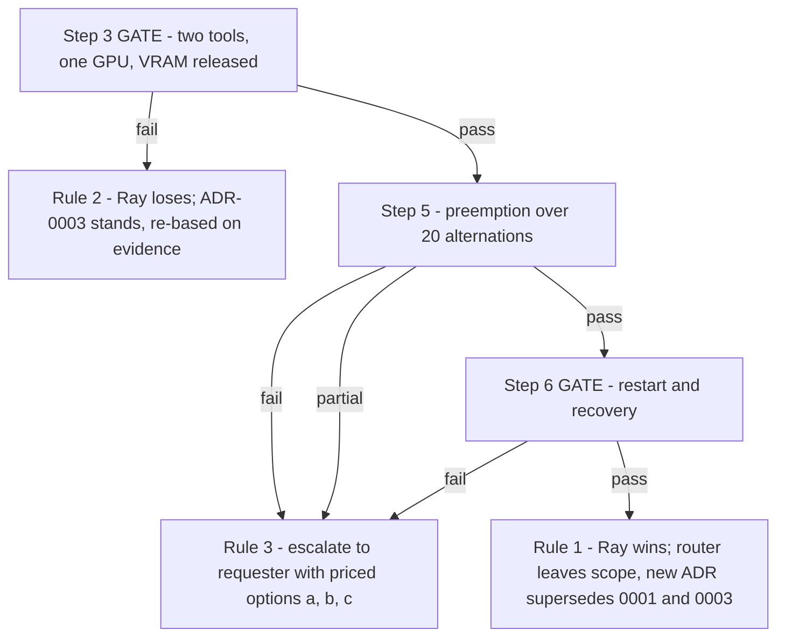

# Spike E — implementation plan for the experiment scaffolding

> **Companion to:** [`plans/spike-E-ray-native-protocol.md`](spike-E-ray-native-protocol.md) — the protocol. That file says *what to measure and how to decide*. This file says *what code to write so the measurements can be taken*.
> **Status:** design only. No code written yet.
> **Audience:** the coder who will build `spike-e-ray-native/`.
> **Execution environment (confirmed with requester):** everything runs on the **DGX**, with the **raylet and all spike scripts on the host — not in a devcontainer.** **Podman is assumed present.** The protocol's "laptop" label for steps 1–2 is therefore advisory: steps 1–2 still run without a GPU request (`num_gpus: 0`) so they can be executed and re-executed cheaply while the GPU is busy, but they run on the same box as the rest.
>
> **Topology decision (settled):** host raylet is the cleanest test of Ray — no nested containers to confound step 3's GPU and VRAM numbers, and no borrowed `--privileged` requirement. The devcontainer-on-DGX topology is therefore **out of scope as a test target** and appears only as a step 7 note. See §6.1 assumption 8.

---

## 0a. Amendment — S3 removed, weights baked into the image (2026-08-14, at requester's direction)

**What changed.** The original design fetched a ~2 GB checkpoint from MinIO inside `__init__`, and step 4 sent an `s3://` URI to test payload-by-reference (**D18**). Both are removed. Each fixture image now **contains its own small dummy checkpoint (~8 MB) baked in at build time**, and there is no MinIO, no `boto3`, and no S3 anywhere in the spike.

**Why this is a legitimate amendment and not a moved goalpost.** Rule 0.1 forbids editing the decision rule once results are known. This amendment is made **before any step has run**, and — decisively — **no gate depended on S3**:

| Gate | What it needs | S3? |
|---|---|---|
| Step 3 | two conflicting images, one GPU, VRAM released, `CUDA_VISIBLE_DEVICES` in-container | no |
| Step 5 | displacement at request cadence, measured with `introspect` (which §2.4 requires to do no I/O) | no |
| Step 6 | head-node and replica kill, recovery | no |

**§5's decision rule is therefore unchanged, word for word.** Steps 3, 5 and 6 still decide, and they are unaffected.

**What is genuinely lost, stated plainly so it cannot be discovered later as a surprise:**

1. **Step 2's weight-fetch measurement is gone.** The protocol's §6.2 called this number out as pricing the thrash risk that preemption creates. It is worth noting *why* losing it does not bias the framework decision: §6.2 itself says it prices thrash *"for **both** architectures"*. A cost identical on both sides of a comparison cannot discriminate between them. It remains an **open input to sizing work, not to this decision**, and should be measured separately whichever way the decision goes.
2. **Step 4 no longer tests D18 payload-by-reference.** **D18 stays an untested assumption.** The step is retained in reduced form (§3, step 4) only to keep the four-op surface uniform; it no longer supports any claim about remote payload references. This must be written in the results file rather than left implicit.

**One effect that runs in Ray's favour, flagged deliberately.** With weights baked in, step 3's and step 5's cold starts no longer include a multi-gigabyte download, so they will be **faster than a production cold start that fetched weights remotely**. Given that this document's history is one of bias *against* Ray ([`bias-audit-and-decision-procedure.md`](bias-audit-and-decision-procedure.md)), an optimistically Ray-favourable measurement is exactly the sort of thing that deserves flagging by the person introducing it. Two things keep it honest:

- The same download would be absent for our own router too, so the comparison stays fair.
- Removing it **improves steps 3 and 5 as discriminators**: cold start collapses to the container-start component, which is the part that actually differs between Ray-managed and router-managed containers. The weights fetch was common-mode noise.

**A second-order benefit worth recording:** baking weights into the image is a *stronger* answer to the original mount objection than S3 was — there is no external dependency to reach at all. The cost is that weights are now coupled to image builds, which is a real architectural consequence but again one that applies equally to either architecture.

---

## 0. Ground rules that constrain every design decision below

These come from §0 of the protocol and they are not stylistic preferences — they change what the code must do.

| Protocol rule | Consequence for the code |
|---|---|
| **0.3 — record raw output, not summaries** | Every script must **tee** its stdout/stderr verbatim to a file under `results/raw/`. No script may print only a computed summary. Verbatim capture is the primary artefact; the summary is secondary. |
| **0.1 — decision rule fixed before execution** | No script may compute or print a "PASS"/"FAIL" verdict for steps 3, 5 or 6. Scripts print **observations and measurements**; a human writes the verdict into [`plans/spike-E-results.md`](spike-E-results.md) against §3 as written. Automated verdicts invite silently re-tuned thresholds. |
| **0.4 — stop early on a hard fail** | Steps are separate, independently runnable scripts. There is **no** `run_all.sh` that chains steps 3→7. A `Makefile` target per step, and the operator decides whether to continue. |
| **0.5 — the prediction is on the record** | Step 6 must be run even though it is predicted to fail, and its script must capture enough state (`podman ps -a`, `nvidia-smi`, `serve status`) to *distinguish kinds* of failure, not merely detect one. |

**One more, added here:** the spike folder is **temporary and disposable**. It must not be imported by `src/tool_swap`, must not be added to `.importlinter` contracts, and must not be picked up by the repo's `make lint` / `make test` (both are scoped to `src/` and `tests/` respectively — see [`Makefile`](../Makefile:15) and `testpaths = ["tests"]` in [`pyproject.toml`](../pyproject.toml:56)). Keeping it outside those paths is deliberate: the spike answers a question and is then deleted, whichever way the answer goes.

---

## 1. Folder structure

```
spike-e-ray-native/                 # temporary, disposable, deleted after the decision
├── README.md                       # how to run each step, in order, with prerequisites
├── Makefile                        # one target per step + fixtures + env capture
├── .env.example                    # image tags, asset sizes, Ray address
├── env.sh                          # sourced by every script: exports + strict mode
│
├── fixtures/
│   ├── tool_torch.Dockerfile
│   ├── tool_tf.Dockerfile
│   ├── make_assets.py              # run AT BUILD TIME inside the image: writes the
│   │                               # baked checkpoint + payload and their .meta.json
│   └── build_images.sh             # podman build both, print digests + base tag
│
├── toolkit/                        # copied INTO both images; the shared tool code
│   ├── __init__.py
│   ├── localio.py                  # read a baked-in file from disk, timed
│   ├── introspect.py               # sys/interp/image/env/GPU report as a dict
│   └── vram.py                     # framework-specific ~4 GB allocation + free
│
├── apps/                           # Ray Serve applications, one module per step
│   ├── step1_two_deployments.py    # one app, two deployments, different image_uri
│   ├── step1_config.yaml
│   ├── step2_builder.py            # app-builder function taking args
│   ├── step2_config.yaml
│   ├── step3_gpu_swap.py           # torch + tf deployments, min_replicas 0, num_gpus 1
│   ├── step3_config.yaml
│   ├── step4_payload.py            # reuses step3 torch app; baked-in local payload
│   ├── step5_config.yaml           # step3 apps with external_scaler_enabled or fixed counts
│   └── step6_config.yaml           # step3 config, re-applied after restart
│
├── scripts/                        # measurement + verification drivers (no verdicts)
│   ├── capture_env.py              # §4 environment table
│   ├── step1_verify.py
│   ├── step2_verify.py
│   ├── step3_gate.py
│   ├── step4_payload.py
│   ├── step5_alternate.py          # 20 alternations, latency distribution
│   ├── step6_restart.py            # head-node kill + replica kill, two phases
│   ├── step7_podman.sh             # storage driver / permissions / privileged checks
│   └── lib/
│       ├── __init__.py
│       ├── recorder.py             # tee + JSONL + markdown-block emitters
│       ├── serve_api.py            # thin wrappers over Serve REST + CLI
│       ├── nvidia.py               # nvidia-smi parsing, VRAM sampling loop
│       └── podman.py               # podman ps -a / images snapshots
│
└── results/
    ├── raw/                        # verbatim stdout/stderr per run, timestamped
    ├── metrics/                    # one JSONL per step, machine-readable timings
    └── TEMPLATE.md                 # skeleton the operator fills into plans/spike-E-results.md
```

**Why this shape.**

- `toolkit/` exists because §2 requires the two fixtures to be *"the same shape"*. Sharing one module and swapping only the framework-specific bits keeps the difference between the images limited to the dependency conflict under test, not to accidental code differences.
- `apps/` separated from `scripts/` because `apps/` code runs **inside the containers** and `scripts/` code runs **outside**, on the host, against the cluster. Mixing them is how import errors that look like Ray failures get created.
- `results/metrics/*.jsonl` alongside `results/raw/` because rule 0.3 wants verbatim text and §4.3 wants a table of times. JSONL gives the table without anybody re-typing numbers out of logs.
- **No MinIO, no `boto3`, no object-generation script.** Per §0a, weights and payload are baked into each image. This removes a whole class of confound — an unreachable endpoint, a shared instance under someone else's load, or a `--network=host` workaround — from steps that were never about networking.
- No `tests/` directory. This is a spike; the "tests" are the verification scripts, and their assertions are printed observations for a human, per rule 0.1.

---

## 2. Fixtures design (§2 of the protocol)

### 2.1 The base image tag is an input, not a constant

§2 requires both images to derive from the Ray base at the cluster's **exact** Ray and Python patch version, and requires the actual tag to be **recorded**. The captured Ray doc is explicit: *"The Ray version and Python version in the container must match those of the host environment exactly… down to the patch number"* ([`multi-app-container.md`](../plan/third-party-docs/ray-serve/advanced-guides/multi-app-container.md:30)).

Design:

1. `env.sh` defines `RAY_BASE_TAG` (e.g. `rayproject/ray:2.57.0-py311-gpu`) as a **single variable used by both Dockerfiles via a build arg**, so drift between the two images is impossible.
2. `capture_env.py` prints the host's `ray.__version__` and `platform.python_version()` and **compares them to the tag string**, failing loudly with a message telling the operator to fix `RAY_BASE_TAG` before building. This is a prerequisite check, not a spike result.
3. `build_images.sh` prints the resolved base tag, both built image digests, and `podman images` output into `results/raw/`, so §2's "record the actual base tag used" is satisfied automatically.

### 2.2 `tool_torch.Dockerfile`

```
ARG RAY_BASE_TAG
FROM ${RAY_BASE_TAG}
```

Contents to install: `torch==2.8.0+cu129` (from the cu129 index URL) and nothing else that could accidentally satisfy the TF image too. **`boto3` is no longer installed** (§0a). Copy `toolkit/` to `/home/ray/toolkit/` and `apps/` to `/home/ray/apps/`, then set `ENV PYTHONPATH="${PYTHONPATH}:/home/ray"` — the doc's own workaround for module import errors.

Add `ENV SPIKE_IMAGE_MARKER=tool_torch`. This marker is what steps 1 and 2 read to prove which image a process is running in; a marker baked at build time cannot be faked by a `runtime_env` env var, which matters for step 2's controller-environment question.

**Bake the assets** (§0a). Copy `fixtures/make_assets.py` in, run it, and leave the results at fixed paths:

```
ARG WEIGHTS_MB=8
ARG PAYLOAD_MB=64
COPY fixtures/make_assets.py /tmp/make_assets.py
RUN python /tmp/make_assets.py \
      --weights /opt/spike/weights/ckpt.bin --weights-mb ${WEIGHTS_MB} \
      --payload /opt/spike/data/payload.bin --payload-mb ${PAYLOAD_MB} \
 && rm /tmp/make_assets.py
ENV SPIKE_WEIGHTS_PATH=/opt/spike/weights/ckpt.bin
ENV SPIKE_PAYLOAD_PATH=/opt/spike/data/payload.bin
```

Three properties of `make_assets.py` the coder must preserve:

- **Content is a deterministic SHA-256 counter stream, not zeros.** The assets are small now and no transfer is timed, but incompressible content keeps any future read measurement honest and stops a filesystem or layer from optimising the file away.
- **Written in chunks**, never assembled in memory, so raising `WEIGHTS_MB` later does not require rewriting the script.
- **It writes a sidecar `<asset>.meta.json`** containing exact `size_bytes` and `sha256`. `startup_report` and `predict` return these, so a partial or truncated read is detectable without the step script needing to know the expected size out of band.

Sizes are build args so the asset can be grown later without editing the Dockerfile — relevant if anyone revisits the cold-start figure that §0a notes is now optimistic.

### 2.3 `tool_tf.Dockerfile`

Identical structure, installing `tensorflow==2.16.*` + `tf-keras`, marker `tool_tf`, and the same `make_assets.py` invocation with the same asset paths. **Do not install torch.** The point of the fixture pair is that `import torch` fails in this image and `import tensorflow` fails in the other — that is the "real, not simulated" conflict §2 demands, and each replica should assert it on startup so a silently-merged environment cannot pass unnoticed.

Keeping the asset **paths** identical across both images while the **content differs** (different bytes, different `sha256`) is deliberate: scripts never branch on tool identity, but `startup_report` still proves which image answered.

### 2.4 Ray Serve API surface — identical for both fixtures

Both images expose one deployment class with the same method surface, so every step script can talk to either tool without branching.

```python
@serve.deployment(ray_actor_options={"num_gpus": <per-step>})
class Tool:
    def __init__(self, weights_path: str | None = None, vram_mb: int = 4096) -> None:
        # 1. record t0
        # 2. read the baked-in checkpoint from disk (timed); default to
        #    os.environ["SPIKE_WEIGHTS_PATH"] when weights_path is None
        # 3. allocate ~vram_mb of VRAM and hold it
        # 4. record t1; store startup report
        # 5. assert the conflicting framework is NOT importable

    async def __call__(self, request) -> dict: ...
```

`weights_path` stays an explicit constructor argument even though it now has a sensible default, because **step 2's app builder must have something meaningful to pass through `args`.** Removing S3 removed the fetch, not the need to prove that a builder can parameterise two applications differently.

HTTP contract, one route per tool, JSON in / JSON out:

| Request body | Meaning | Response |
|---|---|---|
| `{"op": "introspect"}` | no work; report identity | `{ python_version, sys_executable, framework, framework_version, hostname, image_marker, cuda_visible_devices, gpu_uuids, pid, ray_version }` |
| `{"op": "startup_report"}` | replay the `__init__` timings | `{ weights_path, weights_bytes, weights_sha256, load_seconds, init_total_seconds, vram_allocated_mb, replica_id, started_at }` |
| `{"op": "predict", "path": "/opt/spike/data/payload.bin"}` | **step 4**: read a baked-in file fully, return its size | `{ path, size_bytes, read_seconds, sha256, image_marker }` |
| `{"op": "vram_report"}` | current allocation as the framework sees it | `{ allocated_mb, reserved_mb }` |

Design notes the coder must not skip:

- **`introspect` must be cheap and must not touch the GPU**, so step 5's latency numbers measure swap cost, not inference cost. Step 5 uses `introspect`, step 4 uses `predict`.
- **`predict` returns `size_bytes`** exactly as §2 specifies — *"reads a file by URI and returns its size"*, now read from a local baked-in path rather than a URI. It also returns the **full `sha256`**, compared against the sidecar `.meta.json`, so a truncated or lazily-mapped read cannot masquerade as a full one. Hashing the whole file is affordable at these sizes; still **time the read separately from the hash** so the two are never conflated.
- **VRAM allocation must be real and resident.** For torch, a `torch.empty` on-device tensor held on the instance; for TF, an equivalently sized on-device tensor. It must show up in `nvidia-smi` — that is what step 3.2 checks. `vram.py` should verify against its own framework's allocator counters *and* leave the host-side `nvidia-smi` check to the step script, because §3.3 insists the release check is `nvidia-smi`, **not** `serve status`.
- **The weights load happens in `__init__`**, per §2 of the protocol and the app-builder pattern. It must still record wall-clock from `__init__` entry to weights-loaded. **That number is now a local disk read of a few MB, not a network fetch** — record it, but do not present it as the thrash-pricing figure §6.2 asked for. That figure is out of scope per §0a.
- **No credentials plumbing exists any more.** Because assets are baked in, there is nothing to authenticate to, and the `env_vars` companion to `image_uri` is not exercised. If a future spike restores remote assets, this is the mechanism to use and the note is preserved in git history rather than kept live here.
- **Each replica must assert the conflicting framework is absent** during `__init__` and fail loudly if it is importable. This is the fixture's own integrity check: a silently-merged environment would make step 3 look like a pass for the wrong reason.

### 2.5 Baked assets instead of object storage

Per §0a there is no object storage. Each image carries:

| Path | Size (build arg) | Purpose |
|---|---|---|
| `/opt/spike/weights/ckpt.bin` | `WEIGHTS_MB`, default 8 | the "checkpoint" loaded in `__init__` |
| `/opt/spike/weights/ckpt.bin.meta.json` | — | exact `size_bytes` + `sha256` |
| `/opt/spike/data/payload.bin` | `PAYLOAD_MB`, default 64 | step 4's read target |
| `/opt/spike/data/payload.bin.meta.json` | — | exact `size_bytes` + `sha256` |

- **`build_images.sh` must print each asset's size and `sha256` from inside each built image**, via `podman run --rm  cat …meta.json`, into `results/raw/`. §2 of the protocol requires recording what the fixtures actually are; with assets in the image, the image *is* the fixture record.
- **Assets differ between the two images.** Same paths, different bytes. This is what lets `startup_report` prove which image served a request without any script branching on tool name.
- **Both images must be built with the same `WEIGHTS_MB` and `PAYLOAD_MB`**, and `build_images.sh` should pass them from one variable each, for the same reason `RAY_BASE_TAG` is single-sourced in §2.1: silent drift between the fixtures would be invisible and would corrupt every comparison.

---

## 3. Step-by-step experiment design

### Step 1 — Per-deployment `image_uri` (no GPU)

**Question:** is `image_uri` settable per *deployment*, or only per *application*?

Code:

- `apps/step1_two_deployments.py`: one application containing **two deployments** — `TorchProbe` and `TfProbe` — plus a tiny ingress deployment that fans out to both via `DeploymentHandle`. Each probe declares `ray_actor_options={"num_gpus": 0, "runtime_env": {"image_uri": ...}}`. `runtime_env` is a documented `ray_actor_options` key ([`resource-allocation.md`](../plan/third-party-docs/ray-serve/resource-allocation.md:71)), which is the contradiction §3 step 1 exists to resolve.
- `apps/step1_config.yaml`: the same thing expressed as a Serve config, with `image_uri` under each entry of `deployments:` rather than under the application's `runtime_env`. **Both forms must be attempted** — decorator/`ray_actor_options` and YAML `deployments:` — because "the config is rejected" is one of the stated fail modes and rejection may differ between the two paths.
- The probes import their framework and report via `introspect`. Neither requests a GPU.

Measurement/verification (`scripts/step1_verify.py`):

1. Print the exact config being applied, then apply it and capture the full controller response verbatim, including a rejection traceback if it is rejected.
2. `serve status` until steady or failed; capture verbatim.
3. Call each probe's `introspect`; print `sys.version`, `framework_version`, `/etc/hostname` (read the file, do not use `socket.gethostname()` — §3 step 1 names the file), `image_marker`, `pid`.
4. Print a side-by-side comparison of the two reports **without** labelling it pass or fail.

Into results: both configs, both responses, the two introspect payloads verbatim, and whether the two reports differ. Note explicitly which of the two config forms was accepted — if only the application-level form works, that is the "one tool = one application" mapping, and §3 says record and continue.

### Step 2 — App builder with baked-in weights (no GPU)

**Question, singular now:** does the builder execute in the controller's environment?

Per §0a the fetch-timing half of this step is **deleted**, not deferred — there is no remote fetch to time. The remaining question is the one that matters structurally, and it is also the one §3 of the protocol marked as *serious* if it fails: if the builder must import tool code, per-tool isolation does not extend to the code that constructs the tool.

Code:

- `apps/step2_builder.py` exposing `def build(args: dict) -> Application`. At the very top of `build`, before touching anything else, it prints a **builder-environment banner**: `sys.executable`, `sys.version`, `os.environ.get("SPIKE_IMAGE_MARKER", "<absent>")`, `socket.gethostname()`, `os.getpid()`. The marker being absent is the signal that the builder ran outside any tool image — i.e. in the controller's environment, which is the hypothesis flagged as unverified in [`ray-app-builder-assessment.md`](ray-app-builder-assessment.md:69).
- The builder must **not** import torch or tensorflow at module scope. It reads `args["weights_path"]`, `args["framework"]`, `args["image_uri"]` and returns `Tool.options(...).bind(...)`. Whether a *generic* builder suffices is the actual question; a builder that imported tool code would prejudge it.
- `apps/step2_config.yaml`: two applications, same `import_path`, different `args` — Ray's own documented multi-model pattern. **The `args` must still differ meaningfully**, or the step proves nothing about parameterisation: give each app a different `framework`, `image_uri`, and `vram_mb`, and pass `weights_path` explicitly even though the image default would do.
- **Also include a deliberately-importing variant**, `build_strict`, which does `import torch` at function scope, in a separate config the script applies second. If the generic builder works and the strict one fails, that pins down *where* the builder runs far better than absence of a marker alone. Record both outcomes.

Measurement/verification (`scripts/step2_verify.py`):

1. Apply the config; capture controller logs around *"Building application"* verbatim (that log line is the evidence trail).
2. Locate the builder banner. If it does not appear in the controller log, say so — where it appears *is* the finding.
3. For each app, call `startup_report` and confirm each replica loaded **its own image's** checkpoint: assert `weights_sha256` differs between the two apps and matches each image's sidecar metadata. This replaces the fetch measurement with the check the fetch was incidentally providing — proof that per-application `args` reached distinct replicas in distinct images.
4. Record `load_seconds` and `init_total_seconds` anyway, clearly labelled **local disk read, not a network fetch**, so nobody later mistakes this figure for the thrash-pricing number that §0a removed.
5. Append to `results/metrics/step2.jsonl`.

Into results: the builder banner verbatim, the two apps' `weights_sha256` values with the difference called out, and a plain statement of whether the builder needed tool-specific imports on the host. **Also state explicitly that the weight-fetch measurement was dropped by the §0a amendment**, so a reader of the results does not go looking for it and conclude it was suppressed.

### Step 3 — GATE: two conflicting tools, one GPU, on-demand start

Code:

- `apps/step3_gpu_swap.py` + `apps/step3_config.yaml`: two **applications** (`tool_torch`, `tool_tf`), each one deployment, each `ray_actor_options={"num_gpus": 1}`, `autoscaling_config: {min_replicas: 0, max_replicas: 1, downscale_to_zero_delay_s: 60}` and short `upscale_delay_s` / `metrics_interval_s` / `look_back_period_s` so the timer under test is the one we set. `max_replicas` must be set explicitly — the docs warn the manual-autoscaling default is 1 and that autoscaling will not occur unless raised ([`autoscaling-guide.md`](../plan/third-party-docs/ray-serve/autoscaling-guide.md:47)); here 1 is what we want, but it must be deliberate.
- Use **two applications** rather than two deployments regardless of step 1's outcome, so step 3 is not blocked by a step 1 failure. If step 1 passed, note that the single-application variant is also available and say which was used.

Measurement/verification (`scripts/step3_gate.py`), following §3's five sub-steps in order:

1. Start a **background VRAM sampler** (`lib/nvidia.py`, `nvidia-smi --query-gpu=memory.used --format=csv -l 1`) writing a timestamped CSV to `results/metrics/step3_vram.csv` for the whole run. The release check needs a time series, not two point reads.
2. Confirm both apps are at zero replicas; snapshot `podman ps -a` and `nvidia-smi`.
3. `POST` `{"op": "introspect"}` to `tool_torch`; record **client-observed end-to-end wall clock** as cold start, and separately the replica's own `startup_report` so container start can be distinguished from the (now local) weights load. Report both; do not conflate them. Per §0a this cold start **excludes any weight download**, which makes it a cleaner measure of Ray's container-start cost but an optimistic proxy for production — the results file must say so.
4. `nvidia-smi` while serving — verify VRAM is held and the process is visible.
5. Idle past `downscale_to_zero_delay_s`, polling `serve status` and `nvidia-smi` every second. Record **the time from last request to replica-gone and the time from last request to VRAM-returned-to-baseline as two separate numbers.** They may differ, and a lag between them is precisely the kind of thing rule 0.3 wants recorded rather than summarised.
6. `POST` to `tool_tf`; record its cold start and confirm it serves.
7. From the `introspect` payload of each, print `CUDA_VISIBLE_DEVICES` **as read inside the container**, plus the GPU UUIDs the framework can see. §3 step 5 requires printing it from inside the container, and the doc's env-var propagation list does not mention it ([`multi-app-container.md`](../plan/third-party-docs/ray-serve/advanced-guides/multi-app-container.md:148)). If the variable is absent but the framework still sees exactly one GPU, record **both facts** — that combination has a different meaning from either alone.
8. Alternate once more (torch again) to confirm the swap is repeatable before step 5 tries it twenty times.

Into results: every `nvidia-smi` snapshot verbatim, the VRAM time series (or a plotted/summarised excerpt plus the CSV path), both cold starts split into container-start and local-weights-load components, the `CUDA_VISIBLE_DEVICES` line from inside each container, and `podman ps -a` before/during/after.

**Gate handling:** the script prints `--- STEP 3 OBSERVATIONS COMPLETE ---` and stops. It does **not** chain into step 4. Per rule 0.4, if VRAM was not released or GPU assignment did not reach the container, the operator stops the spike here and records it.

### Step 4 — ⚠️ Reduced by §0a: local payload read, **no longer tests D18**

**Read this before running it.** The protocol's step 4 tested payload-by-reference: a remote `s3://` URI resolved inside the replica with credentials supplied only through `env_vars`. Per §0a there is no object storage, so **that test does not happen and D18 remains an untested assumption.** What remains is a local read of a baked-in file, which exercises the `predict` op and confirms the replica can do real work — nothing more.

Under Rule 5 step 4 decided nothing anyway, so this loses no decision input. It does lose an answer we might have wanted for design, and that must be stated in the results rather than left for a reader to infer from a missing section.

Code: no new app. Reuse the running `tool_torch` from step 3's config; add `apps/step4_payload.py` only if a separate route is needed for a non-GPU variant.

Measurement/verification (`scripts/step4_payload.py`):

1. Ensure `tool_torch` is warm (send an `introspect` first) so the number measured is the read, not cold start.
2. `POST {"op": "predict", "path": "/opt/spike/data/payload.bin"}`; record client-side round trip and the replica's own `read_seconds`.
3. Verify `size_bytes` **and** `sha256` equal the sidecar `.meta.json` values exactly. A mismatch means a partial read and invalidates the timing.
4. Repeat three times; report each and the median, plus MB/s. Expect the second and third to be much faster than the first because of page cache — **report all three separately and name the cache effect**, rather than a median that hides it.
5. State in the results, in one sentence, that **D18 was not tested** and why.

Into results: the timings table row, the size + hash equality check, and the explicit D18-not-tested statement.

### Step 5 — Preemption via replica counts (D25)

**This is the step whose design most affects whether the result means anything**, because the protocol asks for an *external controller* driving displacement at request cadence.

Two mechanisms exist in the captured docs, and they are mutually exclusive:

| Mechanism | How | Constraint |
|---|---|---|
| **(A) External scaling API** | `POST /api/v1/applications/{app}/deployments/{dep}/scale` with `{"target_num_replicas": N}` | Requires `external_scaler_enabled: true`, and then **`autoscaling_config` must not be set on any deployment in that application** ([`advanced-autoscaling.md`](../plan/third-party-docs/ray-serve/advanced-guides/advanced-autoscaling.md:224)). Alpha. |
| **(B) Declarative config re-apply** | `PUT /api/serve/applications/` with the full desired set, flipping `num_replicas` | Destructive: *"removes all applications not listed"* ([`api-reference.md`](../plan/third-party-docs/ray-serve/api-reference.md:78)) — the controller must always send the complete set. |

Design: **implement both, run both, report both separately.** They fail differently and the protocol's fail condition ("displacement cannot be driven at this cadence") is mechanism-specific. Running only one would let a limitation of the chosen mechanism be recorded as a limitation of Ray.

Code:

- `apps/step5_config.yaml`: step 3's two applications with **fixed `num_replicas`** and `external_scaler_enabled: true` for mechanism A (no `autoscaling_config` anywhere, per the mutual exclusion). A second file for mechanism B keeps `autoscaling_config` out too, since B drives counts directly.
- `scripts/lib/serve_api.py`: `scale_external(app, dep, n)` and `apply_full_config(desired: dict)`.

Measurement/verification (`scripts/step5_alternate.py`):

1. Bring `tool_torch` to one replica, warm, then **leave it idle but well inside its timer** — the protocol's precondition is displacement of an *idle incumbent whose timer has not expired*. With fixed counts there is no timer, so the script must state this substitution explicitly in the results: we are testing whether externally-driven displacement works at cadence, not whether Ray's own timer can be pre-empted (it cannot — that is the known **D25** gap, restated in [`advanced-autoscaling.md`](../plan/third-party-docs/ray-serve/advanced-guides/advanced-autoscaling.md:246)). **Do not let this substitution slide by unrecorded**; it is the difference between "Ray can be driven to preempt" and "Ray preempts".
2. One alternation = set incumbent to 0, set target to 1, `POST` `introspect` to the target, record end-to-end latency from *before* the scale call to the response. Time the scale call and the request separately as well.
3. Run **20 alternations** (10 torch→tf→torch round trips), per §3.
4. Per alternation record: mechanism, direction, scale-call latency, first-request latency, total, plus any non-`HEALTHY`/`RUNNING` state seen while polling, plus `podman ps -a` count.
5. Detect and record, without editorialising: controller errors in logs, deployments stuck in `UPDATING`, orphaned Podman containers (count rising monotonically), VRAM not returning to baseline between alternations.
6. Report the distribution: min / median / p90 / max, and the **full list of 20** — a distribution summary alone hides the "occasional stuck state" that §3's *partial* outcome is written to capture.
7. Also run `serve controller-health --json` before, midway, and after, and diff it. That command exists to show controller strain, which is exactly the failure mode this cadence might provoke.
8. Sub-step §3.5.4: attempt an **application-level autoscaling policy** that receives `dict[DeploymentID, AutoscalingContext]`, and record whether the contexts it receives include deployments from the *other* application. If step 1 passed, also try both tools as two deployments of one application and check the same thing. This answers the open question flagged at the end of [`advanced-autoscaling.md`](../plan/third-party-docs/ray-serve/advanced-guides/advanced-autoscaling.md:258). Note that a policy cannot be combined with `external_scaler_enabled`, so this is a **third, separate run**, not an addition to A or B.

Into results: the 20-row table (or its JSONL path plus the full list), the distribution, the controller-health diff, every anomaly, and a clear statement of which mechanism produced which numbers.

### Step 6 — GATE: cluster restart and recovery

Code: `scripts/step6_restart.py`, in two clearly separated phases, each capturing state before and after.

**Phase A — head node.**

1. Deploy step 3's config; make one tool resident. Snapshot: `serve status`, `serve config`, `nvidia-smi`, `podman ps -a`, `ray status`.
2. Identify the head node process (`ray start --head` GCS process) and `kill -9` it. Record the exact command and the PID discovery method verbatim.
3. Immediately snapshot `podman ps -a` and `nvidia-smi` — orphaned containers and leaked VRAM are the two findings §3 names.
4. Attempt recovery **using only documented commands** (`ray start --head`, `serve deploy <config>`, `serve status`). Record every command and its output. **If an undocumented or manual step is needed, record it as a required manual step rather than quietly doing it** — the presence of manual steps is the result.
5. Record: did the deployment config survive without re-applying? Were containers orphaned? Was VRAM leaked? What manual cleanup was needed?

**Phase B — replica actor.** Same shape: find the replica actor PID (from `GET /api/serve/applications/`, which returns per-replica `pid` — [`api-reference.md`](../plan/third-party-docs/ray-serve/api-reference.md:104)), `kill -9`, then watch whether Serve restarts it unattended, how long it takes, and whether VRAM from the dead replica is reclaimed before the new one allocates. §3 says confirming recovery here is as informative as the head-node case, so give it equal care.

Into results: both phases verbatim, the manual-step list, VRAM before/after/at-rest, and `podman ps -a` diffs. Per rule 0.5 the operator should note whether the outcome matches or contradicts the recorded prediction.

### Step 7 — Shared-node fitness (DGX only, record only)

Code: `scripts/step7_podman.sh` — a shell script, because everything here is host configuration.

1. **Docker coexistence:** record `docker version`, `docker ps`, `systemctl status docker` before and after Podman use; confirm existing workloads keep running. Record `podman info` in full — it names the storage driver in use.
2. **Storage driver A/B:** the headline measurement. Record cold-start time for a multi-gigabyte image (`tool_torch`) with the **default `vfs`** driver and with **`overlay`** configured (plus `mount_program = /usr/bin/fuse-overlayfs` if needed), per the documented *"very slow or hanging container startup"* warning ([`multi-app-container.md`](../plan/third-party-docs/ray-serve/advanced-guides/multi-app-container.md:163)). Show the `storage.conf` contents used for each arm and clear the relevant cache between arms so the second arm is not measuring a warm store. **Set a timeout** — "hanging" is a documented outcome, and the script must record a timeout as a result rather than hang the operator.
3. **`--privileged`:** record whether it was needed. Because the raylet runs **on the host** (settled above), the expectation is that it is **not** needed — the docs require it only when the raylet itself runs in a container. Record the observation confirming this, and state the topology explicitly so a reader knows the arm was answered for the host case and not the nested one. Add a short **note only** — not a measurement — that a devcontainer-hosted raylet would additionally need `--privileged` and `-v /var/lib/containers:/var/lib/containers`, per the documented troubleshooting entries, should anyone later deploy that way.
4. **`/tmp/ray` permissions:** record host UID/GID, the in-container user, and whether the documented `ports_by_node.json.lock` permission error occurs under our user mapping.

Into results: record only, no verdict, per §3.

---

## 4. Results capture mechanism

### 4.1 Mechanics

- **`lib/recorder.py`** provides: `Recorder(step)` writing `results/raw/<step>-<utc-timestamp>.log` while echoing to the terminal; `record(**fields)` appending a line to `results/metrics/<step>.jsonl`; and `block(title, text)` emitting a fenced markdown block with the command and its verbatim output, ready to paste.
- **Every command a script runs is printed before it runs**, prefixed `$ `, with its full stdout and stderr following. Rule 0.3 is satisfied by construction rather than by discipline.
- **`results/TEMPLATE.md`** is the skeleton of [`plans/spike-E-results.md`](spike-E-results.md); the operator copies it and pastes blocks in. A generator that writes the results file automatically is **deliberately not** part of this design: pass/fail judgement stays human, and an auto-written results file is a results file nobody read.

### 4.2 `capture_env.py` — the environment section required by §4.1

Collects, each with the verbatim command that produced it:

| Field | Source |
|---|---|
| Ray version (host) | `ray.__version__`, `ray --version` |
| Python version (host) | `platform.python_version()`, `sys.executable` |
| Ray + Python inside each image | `podman run --rm  python -c ...` |
| Base image tag + digests | `env.sh` value, `podman images --digests` |
| Podman version, storage driver, rootless | `podman version`, `podman info` |
| GPU model, count, driver, CUDA | `nvidia-smi`, `nvidia-smi --query-gpu=name,driver_version,memory.total` |
| Container toolkit | `nvidia-ctk --version` if present |
| Host OS / kernel | `uname -a`, `/etc/os-release` |
| Docker presence | `docker version` (step 7 coexistence baseline) |
| Baked asset sizes + hashes | `podman run --rm  cat /opt/spike/**/*.meta.json`, per image |
| Git commit of spike code | `git rev-parse HEAD`, plus dirty flag |
| UTC timestamp | run start |

It also runs the §2.1 **version-match assertion** and refuses to proceed if the host and image versions disagree. Discovering that mismatch after step 3's cold-start numbers are taken would waste a GPU session.

### 4.3 Shape of `plans/spike-E-results.md`

```markdown
# Spike E — results
> Protocol: plans/spike-E-ray-native-protocol.md. Decision rule: §5 of that file, unedited.
> Operator: <name> · Dates: <...> · Spike code commit: <sha>

## 0. Environment            <- capture_env.py output verbatim
## 0a. Scope amendments      <- S3 removed; what that means for steps 2 and 4, and D18
## 1. Fixtures as built      <- base tag, digests, baked asset sizes + hashes, build logs
## 2. Step 1 — per-deployment image_uri     [pass|fail]  (informative, Rule 5)
## 3. Step 2 — app builder, baked weights   [pass|fail]  (informative, Rule 5)
## 4. Step 3 — GATE                         [pass|fail]
## 5. Step 4 — local payload read            [pass|fail]  (informative, Rule 5; D18 NOT tested)
## 6. Step 5 — preemption at cadence        [pass|partial|fail]
## 7. Step 6 — GATE, restart and recovery   [pass|fail]
## 8. Step 7 — shared-node fitness          [record only]
## 9. Measured times           <- the single table below
## 10. Surprises and contradictions
## 11. Decision under §5       <- which rule applies; escalate if Rule 3 or 4
```

The §4.3 times table, one place, filled from the JSONL:

| Measurement | Step | Samples | Median | Min | Max | Notes |
|---|---|---|---|---|---|---|
| ~~Weights fetch (~2 GB, MinIO)~~ | ~~2~~ | — | — | — | — | **removed by §0a**; no remote fetch exists |
| Weights load (baked, local disk) | 2 | 2 apps | | | | local read only — **not** a thrash-pricing figure |
| Cold start, container start component | 3 | ≥2 | | | | per tool; excludes weight download (§0a) |
| Cold start, end to end | 3 | ≥2 | | | | client-observed; optimistic vs production (§0a) |
| Replica-gone after idle | 3 | 1 | | | | vs configured 60 s |
| VRAM-returned-to-baseline after idle | 3 | 1 | | | | separate from above |
| Local payload read (64 MB baked) | 4 | 3 | | | | report all 3; page-cache effect expected |
| Preemption latency, mechanism A | 5 | 20 | | | | + p90, full list |
| Preemption latency, mechanism B | 5 | 20 | | | | + p90, full list |
| Replica-actor recovery | 6B | 1 | | | | unattended? |
| Image cold start, `vfs` vs `overlay` | 7 | 2 arms | | | | timeout if hung |

§10 deserves emphasis: the protocol asks specifically for anything contradicting [`plan/15_RAY_SERVE_EVALUATION.md`](../plan/15_RAY_SERVE_EVALUATION.md) or the four argument documents. Contradictions in the *favourable* direction are the ones most likely to go unwritten, so the operator should look for them deliberately.

---

## 5. Decision rule — reminder for the coder

Reproduced from §5 of the protocol. **It is fixed and must not be edited once any result is known** (rule 0.1). The coder's job is to make the measurements possible; **the coder does not write verdicts for steps 3, 5 or 6 into code.**



- **Rule 1 — Ray wins if steps 3, 5 and 6 all pass.**
- **Rule 2 — Ray loses if step 3 fails.** Stop there (rule 0.4).
- **Rule 3 — step 6 fails but 3 and 5 pass → the decision goes to the requester**, with options (a) accept manual recovery, (b) adopt KubeRay, (c) keep our router, presented neutrally. Option (c) must **not** be chosen by default.
- **Rule 4 — step 5 partial counts as fail for Rule 1**, but record the specifics and escalate under Rule 3 rather than deciding.
- **Rule 5 — steps 1, 2, 4 and 7 decide nothing.** A fail in any of them is **not** grounds to refuse Ray. They shape a design; they do not gate it.
- **Rule 0.2 — a pass is the welcome outcome.** Nobody is defending a milestone list.

---

## 6. Assumptions, and what could block implementation

### 6.1 Assumptions carried into this design

1. **Everything runs on the DGX**, Podman present — confirmed by the requester. Steps 1–2 use `num_gpus: 0` so they can run while the GPU is busy.
2. **`RAY_BASE_TAG` is discovered, not assumed.** The design pins nothing; `capture_env.py` asserts the match and the build args flow from one variable.
3. **`torch==2.8.0+cu129` and `tensorflow==2.16` are installable on the chosen Ray base's Python.** If the base image's Python is not a version those wheels publish for, the fixture pins must move. Any substitution must be recorded in §1 of the results, since §2 justifies the pins by mirroring the real R8 conflict.
4. ~~**MinIO reachability from inside `image_uri` containers.**~~ **Removed by §0a** — no object storage is used. The `--network=host` versus **D21** tension noted in [`ray-app-builder-assessment.md`](ray-app-builder-assessment.md:47) is consequently **not exercised by this spike** and remains open.
5. **The operator has rights to `kill -9` the Ray head process and to edit Podman `storage.conf`.** Step 6 and step 7 are unrunnable otherwise.
6. **Ray's external scaling API and custom autoscaling policies are alpha/experimental** by their own documentation. A step 5 failure attributable to alpha instability must be recorded as such, distinctly from a structural limitation.
7. **Two multi-GB images fit in the available disk.** The baked assets add well under 100 MB per image, so §0a materially *reduces* the disk requirement — but with `vfs` in play for step 7, image storage can still be several times the image size.
8. **The raylet and all spike scripts run on the DGX host, not in a devcontainer** — settled with the requester, because a host raylet is the cleanest test of Ray. Consequences the coder should rely on: `nvidia-smi` in `scripts/` reads the real device directly with no nesting to explain away; Podman runs rootless as the host user, so the `/tmp/ray` ownership question of step 7.4 concerns only the host user versus the in-container `ray(1000)` user; and step 7's `--privileged` arm is expected to be a negative observation rather than a live requirement. **If circumstances later force a containerised raylet, steps 3–6 must be re-run** — the nesting could change both cold-start and VRAM behaviour, so results from the two topologies must not be mixed in one results file.

### 6.2 Open questions for the requester

1. **Registry or local images?** The Ray doc pushes to a registry but says the push is unnecessary for local deploys. Local-only is simpler and is assumed here — confirm no multi-node concern makes a registry necessary.
2. **Is the DGX GPU exclusively available for the step 3–6 window?** Step 3's VRAM-release check reads whole-device `nvidia-smi` numbers; another tenant's allocation would confound it. If exclusivity is impossible, the scripts should record baseline VRAM and report deltas — say which, because it changes what the release check can prove.
3. ~~**Devcontainer or host for the raylet?**~~ **Answered: host raylet, scripts run from the host.** Carried into §6.1 assumption 8; the devcontainer topology is a step 7 note only.
4. ~~**Which MinIO?**~~ **Answered by §0a: none.** Weights and payload are baked into the images.
5. **Who is the operator, and who arbitrates Rule 3?** The protocol is explicit that a Rule 3 outcome goes to the requester, not the author. Naming both in advance keeps that clean.
6. **Should the spike folder be committed to the repo or kept out of git?** Committing it makes the results reproducible and reviewable; it also adds a directory that must later be deleted. Committing on a `spike/` branch is the assumption here — confirm.
7. **New, from §0a: is the weight-fetch cost being measured anywhere else?** It is out of this spike's scope now, but it prices thrash for whichever architecture wins, so it should not simply disappear. Confirm whether it becomes a separate sizing task.

### 6.3 Design risks flagged honestly

- **Step 5's timer substitution (§3, step 5, item 1) is the weakest joint in this design.** With `external_scaler_enabled` there is no `downscale_to_zero_delay_s`, so the *"idle incumbent whose timer has not expired"* precondition cannot be reproduced exactly. What gets measured is whether externally-driven displacement works at request cadence. That is the right measurement for **D25**, but it is not literally the protocol's sentence, and the results file must say so rather than let a reader assume otherwise.
- **Cold start is at least two numbers, not one** (container start + weights load). With weights baked in, the load component is now small — which means the container-start component dominates and is measured cleanly. Keep reporting both; a single conflated figure still throws away information.
- **§0a makes steps 3 and 5 optimistic relative to production**, since no cold start includes a weight download. Flagged in §0a and repeated here because it is the kind of favourable-to-Ray distortion that a document with this history should state twice rather than once.
- **`nvidia-smi` VRAM is whole-device**, so any concurrent GPU user makes the release check ambiguous. Hence the baseline snapshot and the continuous sampler.
- **Twenty alternations at ~1 cold start each is a long GPU session.** If the box is time-boxed, run mechanism A's 20 first; that is the one the protocol's cadence question is really about.

---

## 6a. Rework required in already-written batch-1 files

Batch 1 was written before the §0a amendment, so five files carry stale S3/MinIO assumptions. These are **corrections to existing files**, not new work, and they must land before the fixtures are built.

| File | Stale content | Required change |
|---|---|---|
| [`.env.example`](../spike-e-ray-native/.env.example:4) | `MINIO_ENDPOINT`, `MINIO_ROOT_USER`, `MINIO_ROOT_PASSWORD` | Delete all three. Add `WEIGHTS_MB=8` and `PAYLOAD_MB=64` |
| [`env.sh`](../spike-e-ray-native/env.sh:9) | exports the three `MINIO_*` vars | Export `WEIGHTS_MB` / `PAYLOAD_MB` instead |
| [`README.md`](../spike-e-ray-native/README.md:11) | prerequisite *"MinIO running with `weights` and `data` buckets"*; step 2 described as *"app builder + S3 weights"*; step 4 as *"Payload by reference"* | Drop the MinIO prerequisite. Step 2 → *"app builder, baked weights"*. Step 4 → *"local payload read (D18 not tested)"* |
| [`results/TEMPLATE.md`](../spike-e-ray-native/results/TEMPLATE.md:18) | §3 heading names S3; §5 says *"payload by reference"*; times table has the MinIO fetch and 500 MB transfer rows | Re-sync headings and times table to §4.3 as amended, and **add the new `## 0a. Scope amendments` section** |
| [`scripts/lib/serve_api.py`](../spike-e-ray-native/scripts/lib/serve_api.py:52) | `post_predict(url, uri)` documented as *"POST predict with s3:// URI"* | Rename the parameter to `path`, send `{"op": "predict", "path": ...}`, update the docstring |

**Nothing else in batch 1 is affected** — `recorder.py`, `nvidia.py`, `podman.py` and `capture_env.py` never referenced object storage, except that `capture_env.py` should gain the baked-asset hash capture from §4.2.

---

## 7. Suggested implementation order for the coder

1. `env.sh`, `.env.example`, `Makefile` skeleton, `scripts/lib/` (recorder, serve_api, nvidia, podman), `capture_env.py`. Nothing else can be trusted until the environment table and the version assertion work.
2. `fixtures/` — `make_assets.py`, both images built with baked assets, version match asserted. Verify `import torch` fails in the TF image and vice versa, and that each image's asset hashes differ.
3. `toolkit/` + the `Tool` deployment class with all four ops, exercised **without** Ray first (plain Python inside each image via `podman run`) so app bugs are not mistaken for Ray bugs.
4. Step 1, then step 2 — no GPU, cheap, and they test the two weakest prior claims, which §7 of the protocol says is the right order.
5. Step 3 (gate). Stop and consult before proceeding.
6. Step 4, then step 5 (both mechanisms, plus the policy-scope probe).
7. Step 6 (gate), both phases.
8. Step 7, last, since it needs a cooperative admin and changes host configuration.
