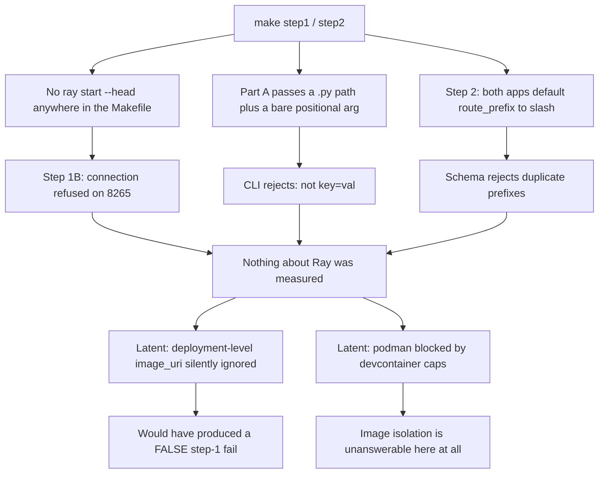

# Spike E — Steps 1 & 2 failure diagnosis

> **Verdict up front: neither step tested Ray.** Both runs died in the harness before
> reaching the pass/fail criteria in [`spike-E-ray-native-protocol.md`](spike-E-ray-native-protocol.md:58) §3.
> Under **Rule 0.3** (record raw output, not summaries) and **Rule 0.5** (a result matching
> a prediction is weak evidence), **nothing here may be recorded as a step 1 or step 2
> outcome, pass or fail.** The scoreboard is still blank.

All claims below are verified against the Ray actually installed in this devcontainer
(**2.57.0**, Python 3.11.16 — see [`env-capture-20260814T150829Z.log`](../spike-e-ray-native/results/raw/env-capture-20260814T150829Z.log:11)),
not from memory, per the coding guidelines.

---

## 1. What the logs actually say

### Step 1, Part A — malformed CLI invocation

```
Error: Invalid application argument 'step1_app', must be of the form '<key>=<val>'.
```
[`step1-20260814T150813Z.log:4`](../spike-e-ray-native/results/raw/step1-20260814T150813Z.log:4)

The harness runs `serve deploy apps/step1_two_deployments.py step1_app`
([`step1_verify.py:43`](../spike-e-ray-native/scripts/step1_verify.py:43)). Two independent
defects:

1. Trailing positional arguments are parsed as builder `key=val` pairs by
   `convert_args_to_dict`, which is why `step1_app` was rejected. Naming an application
   is `--name`, per the `--name` option at [`ray/serve/scripts.py:311`](/usr/local/lib/python3.11/site-packages/ray/serve/scripts.py:311).
2. Even with `--name` removed, the first argument is a **file path**, and
   `_generate_config_from_file_or_import_path` branches on
   `pathlib.Path(config_or_import_path).is_file()`
   ([`scripts.py:229`](/usr/local/lib/python3.11/site-packages/ray/serve/scripts.py:229)).
   A `.py` file is a file, so Ray would try to `yaml.safe_load` the Python source and
   validate it as `ServeDeploySchema`. It would also refuse the arguments outright:
   *"Application arguments cannot be specified for a config file"*
   ([`scripts.py:233`](/usr/local/lib/python3.11/site-packages/ray/serve/scripts.py:233)).
   The decorator form needs an **import path** (`module:attr`), not a path on disk.

### Step 1, Part B — no Ray cluster was running

```
ConnectionError: Failed to connect to Ray at address: http://localhost:8265.
```
[`step1-20260814T150813Z.log:108`](../spike-e-ray-native/results/raw/step1-20260814T150813Z.log:108)

`serve deploy` is a REST call to a live dashboard; its default address is
`RAY_DASHBOARD_ADDRESS` or `http://localhost:8265`
([`scripts.py:320`](/usr/local/lib/python3.11/site-packages/ray/serve/scripts.py:320)).
Nothing in [`spike-e-ray-native/Makefile`](../spike-e-ray-native/Makefile:16) ever runs
`ray start --head`, and no step-1/2 target depends on a cluster being up. **Step 1 Part B
tested only that a cluster was absent.**

### Step 2 — every application defaulted to the same route prefix

```
Value error, Found duplicate applications for route prefix "/".
```
[`step2-20260814T150833Z.log:35`](../spike-e-ray-native/results/raw/step2-20260814T150833Z.log:35)

`ServeApplicationSchema.route_prefix` defaults to `"/"`
([`schema.py:724`](/usr/local/lib/python3.11/site-packages/ray/serve/schema.py:724)) and
`ServeDeploySchema.application_routes_unique` rejects collisions
([`schema.py:1067`](/usr/local/lib/python3.11/site-packages/ray/serve/schema.py:1067)).
[`step2_config.yaml`](../spike-e-ray-native/apps/step2_config.yaml:5) declares two
applications and sets `route_prefix` on neither. This is a one-line omission in our
config, **not** a statement about the app-builder pattern.

Note this failure is client-side schema validation, so step 2 never even needed a
cluster to fail — and would have hit the step-1 connection error immediately after.

---

## 2. Latent defects that would have failed the next attempt

Fixing only the two logged errors would produce a second round of misleading results.
Each item below is a blocker sitting behind them.

### 2.1 🔴 The step-1 config would have silently produced a false "fail"

[`step1_config.yaml`](../spike-e-ray-native/apps/step1_config.yaml:11) sets `image_uri`
and `route_prefix` **as deployment-level keys**. `DeploymentSchema`
([`schema.py:309`](/usr/local/lib/python3.11/site-packages/ray/serve/schema.py:309))
defines neither, and its `model_config` is
`ConfigDict(populate_by_name=True)` — it does **not** set `extra="forbid"`, unlike the
schemas at [`schema.py:126`](/usr/local/lib/python3.11/site-packages/ray/serve/schema.py:126)
and [`schema.py:1360`](/usr/local/lib/python3.11/site-packages/ray/serve/schema.py:1360).
Pydantic v2's default is `extra="ignore"`, so **both keys would be accepted and
discarded without warning.**

Both replicas would then have reported the controller's environment, and the protocol's
step-1 fail condition — *"both report the same"* — would have been met **by our own typo**.
Per §3 that fail is recorded as *"the mapping is one tool = one application"*, a
structural conclusion about Ray drawn from a silently dropped YAML key. This is exactly
the class of error [`bias-audit-and-decision-procedure.md`](bias-audit-and-decision-procedure.md)
exists to prevent, and it is the most consequential finding in this document.

The real per-deployment surface is `ray_actor_options.runtime_env`, which **is** a
documented field ([`schema.py:227`](/usr/local/lib/python3.11/site-packages/ray/serve/schema.py:227)),
carrying `image_uri` inside it. Step 1's question is therefore answerable — but only via
that spelling.

### 2.2 🔴 `${VAR:default}` is not interpolated by Ray

Every config uses shell-style defaults, e.g.
`image_uri: "${SPIKE_IMAGE_TORCH_URI:tool_torch:spike}"`
([`step2_config.yaml:11`](../spike-e-ray-native/apps/step2_config.yaml:11)). Ray loads
configs with a plain `yaml.safe_load`
([`scripts.py:245`](/usr/local/lib/python3.11/site-packages/ray/serve/scripts.py:245));
a search of `ray/serve` for `expandvars`/`environ[` finds no substitution anywhere. The
literal string `${SPIKE_IMAGE_TORCH_URI:tool_torch:spike}` would be passed as an image
URI. Configs must be rendered before deployment, or built in Python.

### 2.3 🔴 [`step1_two_deployments.py`](../spike-e-ray-native/apps/step1_two_deployments.py) cannot be imported

Four separate errors, any one fatal:

| Line | Problem |
|---|---|
| [`:63`](../spike-e-ray-native/apps/step1_two_deployments.py:63) | `@serve.deployment(route_prefix="/")` — not a parameter of `serve.deployment`; see the full signature at [`api.py:511`](/usr/local/lib/python3.11/site-packages/ray/serve/api.py:511). `route_prefix` belongs to `serve.run` / the app config. |
| [`:87`](../spike-e-ray-native/apps/step1_two_deployments.py:87) | `serve.Application(Ingress.bind(), deployments=[...])` — `Application.__init__` accepts only `bound_deployment` ([`deployment.py:59`](/usr/local/lib/python3.11/site-packages/ray/serve/deployment.py:59)). `.bind()` already *returns* an `Application`; composition is done by passing handles into `bind()`. |
| [`:68`](../spike-e-ray-native/apps/step1_two_deployments.py:68) | `TorchProbe.bind()` called inside `Ingress.__init__` — binding is build-time graph construction, not runtime. |
| [`:75`](../spike-e-ray-native/apps/step1_two_deployments.py:75) | `.call(request_data)` — `DeploymentHandle` exposes `.remote()` ([`handle.py:1152`](/usr/local/lib/python3.11/site-packages/ray/serve/handle.py:1152)) and method-name attributes via `__getattr__`; there is no `.call`. |

### 2.4 🟠 The step-2 builder double-wraps its application

[`step2_builder.py:67`](../spike-e-ray-native/apps/step2_builder.py:67) returns
`serve.Application(deployment_cls)` where `deployment_cls` is already the result of
`.bind()` — i.e. already an `Application`. The builder should return the `bind()` result
directly.

### 2.5 🔴 [`serve_api.py`](../spike-e-ray-native/scripts/lib/serve_api.py) points at the wrong port and the wrong scale route

`_SERVE_BASE` is `http://localhost:8000`
([`serve_api.py:10`](../spike-e-ray-native/scripts/lib/serve_api.py:10)), the **Serve HTTP
proxy** — application traffic. The control-plane REST API lives on the **dashboard**
(`:8265`): `/api/serve/applications/` is declared at
[`sdk.py:14`](/usr/local/lib/python3.11/site-packages/ray/dashboard/modules/serve/sdk.py:14)
and served at [`serve_head.py:81`](/usr/local/lib/python3.11/site-packages/ray/dashboard/modules/serve/serve_head.py:81).
So `serve_status()` and `get_application()` would 404 against the proxy — which also
explains why [`step2_verify.py:49`](../spike-e-ray-native/scripts/step2_verify.py:49)
would have spun for its full 60 s "waiting for Serve to stabilize" regardless of cluster
health.

`scale_deployment` is wrong twice over, and this is a **step-5 gate blocker**:

- Its path is `/api/serve/applications/{app}/deployments/{dep}/scale`, but the real route
  is `/api/v1/applications/{application_name}/deployments/{deployment_name}/scale`
  ([`serve_head.py:200`](/usr/local/lib/python3.11/site-packages/ray/dashboard/modules/serve/serve_head.py:200)).
- The endpoint raises `ExternalScalerDisabledError` → **HTTP 412** unless the application
  sets `external_scaler_enabled: true`
  ([`controller.py:1333`](/usr/local/lib/python3.11/site-packages/ray/serve/_private/controller.py:1333),
  field at [`schema.py:801`](/usr/local/lib/python3.11/site-packages/ray/serve/schema.py:801)).
  That flag also **forbids Serve's own autoscaling** for every deployment in the app,
  which is precisely the tension [`step5_alternate.py:18`](../spike-e-ray-native/scripts/step5_alternate.py:18)
  already flags in prose. It is a real constraint on a Ray-native design and should be
  recorded as a finding when step 5 runs.

### 2.6 🟠 Step 2's two apps cannot listen on different ports

[`step2_verify.py:26`](../spike-e-ray-native/scripts/step2_verify.py:26) expects
`tool_torch` on `:8000` and `tool_tf` on `:8001`. `port` is a per-app *schema* field
([`schema.py:762`](/usr/local/lib/python3.11/site-packages/ray/serve/schema.py:762)) but
one HTTP proxy serves the whole cluster; apps are separated by `route_prefix`, not port.
The fix to §1's duplicate-prefix error and this URL scheme are the same change.

### 2.7 🟡 `subprocess` is bound conditionally

[`step1_verify.py:41`](../spike-e-ray-native/scripts/step1_verify.py:41) imports
`subprocess` inside Part A's `try`, then Part B uses it at
[`:100`](../spike-e-ray-native/scripts/step1_verify.py:100). If Part A raises before the
import, Part B dies with `NameError`. Move it to module scope.

---

## 3. 🔴 The scoping problem: steps 1–2 cannot be completed in this devcontainer

This is a correction to the protocol, not a bug in the code.

`podman` fails here with `cannot clone: Operation not permitted`
([`env-capture-20260814T150829Z.log:52`](../spike-e-ray-native/results/raw/env-capture-20260814T150829Z.log:52)),
because [`devcontainer.json`](../.devcontainer/devcontainer.json:8) sets `--cap-drop=ALL`
and `no-new-privileges:true`, so rootless podman cannot create a user namespace.
[`spike-e-ray-native/README.md`](../spike-e-ray-native/README.md:34) already anticipates
this for *builds*.

The consequence for steps 1–2 was not anticipated. Ray implements `image_uri` **by
running podman**: `_create_impl` shells out to `podman run`
([`image_uri.py:24`](/usr/local/lib/python3.11/site-packages/ray/_private/runtime_env/image_uri.py:24))
and `_modify_context_impl` sets `container_driver = "podman"`
([`image_uri.py:76`](/usr/local/lib/python3.11/site-packages/ray/_private/runtime_env/image_uri.py:76)).
No podman means no replica ever starts in an image.

Therefore, in this devcontainer:

- **Answerable:** does the Serve schema *accept* per-deployment `image_uri`, and does the
  app-builder pattern deploy two apps from one function with different `args`?
- **Not answerable:** *"each deployment reports its own image's contents"* — the actual
  pass condition of protocol §3 step 1 — and whether the builder needs tool imports in
  the controller environment, since no container environment exists to contrast with.

**Steps 1–2 must therefore be split**, and the protocol's *"steps 1–2 are a laptop
afternoon"* ([§7](spike-E-ray-native-protocol.md:203)) is wrong for the isolation half.
Recording a step-1 fail from this environment would attribute a devcontainer capability
restriction to Ray.

One further constraint for when images do run: `image_uri` is only compatible with
`config` and `env_vars` — any other `runtime_env` key raises
([`image_uri.py:146`](/usr/local/lib/python3.11/site-packages/ray/_private/runtime_env/image_uri.py:146),
enforced at [`runtime_env.py:406`](/usr/local/lib/python3.11/site-packages/ray/runtime_env/runtime_env.py:406)).
No `working_dir` and no `py_modules` alongside an image — so the toolkit must be baked in,
as the fixtures already do.

---

## 4. Failure map



---

## 5. Recommended sequence

1. **Record the null result.** Write a short "steps 1–2: harness failure, no data"
   entry in `plans/spike-E-results.md` with the verbatim logs, so the blank scoreboard is
   explicit rather than implied.
2. **Bring up a cluster as a Makefile dependency**, not by hand — a `cluster-up` target
   running `ray start --head`, with the step targets depending on it and a readiness poll
   against `:8265`.
3. **Fix the control-plane client** ([`serve_api.py`](../spike-e-ray-native/scripts/lib/serve_api.py:1)):
   dashboard port for status/scale, correct `/api/v1/...` scale route, proxy port for
   tool traffic only.
4. **Render configs** so `${VAR}` is resolved before Ray sees the YAML, and give every
   application a distinct `route_prefix`.
5. **Move `image_uri` under `ray_actor_options.runtime_env`** in the step-1 config, and
   add a guard that fails loudly if a config key is dropped — the silent-ignore trap in
   §2.1 must not be able to recur.
6. **Repair [`step1_two_deployments.py`](../spike-e-ray-native/apps/step1_two_deployments.py:1)**
   (§2.3) and the builder's double-wrap (§2.4).
7. **Re-scope steps 1–2**: run the schema-acceptance half here; defer the
   image-isolation half to the GPU/podman host alongside step 3. Amend protocol §7.
8. Only then re-run, and evaluate against §3's criteria as written.

**Do not amend the §5 decision rule.** Rule 0.1 freezes it, and nothing here bears on it:
no gate has been attempted.
